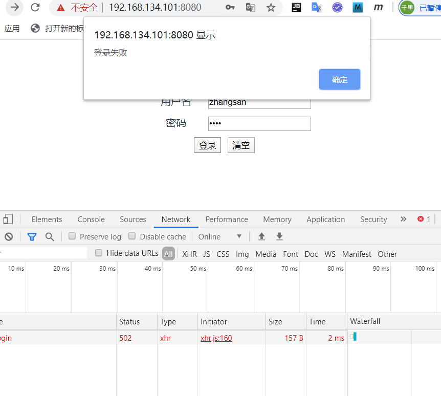
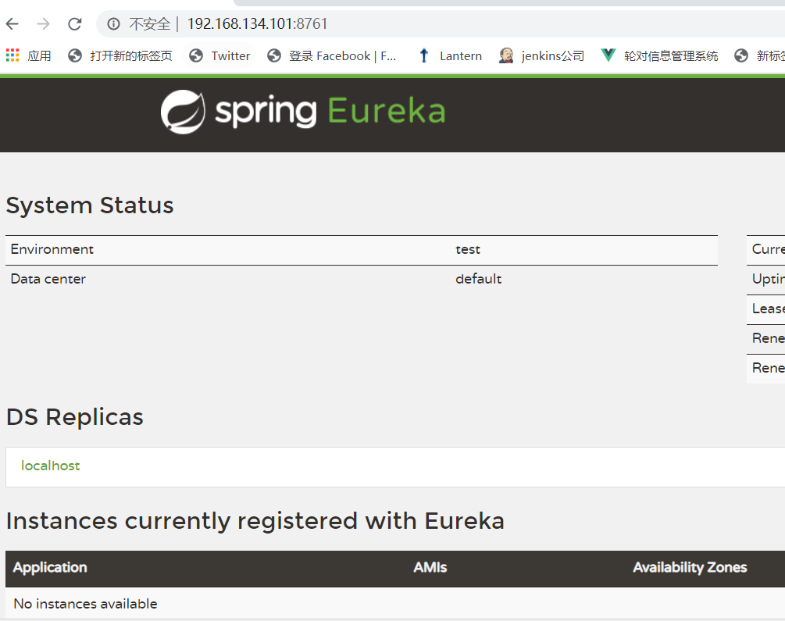
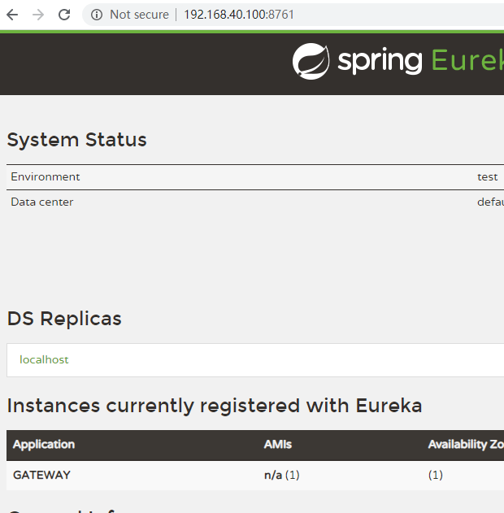
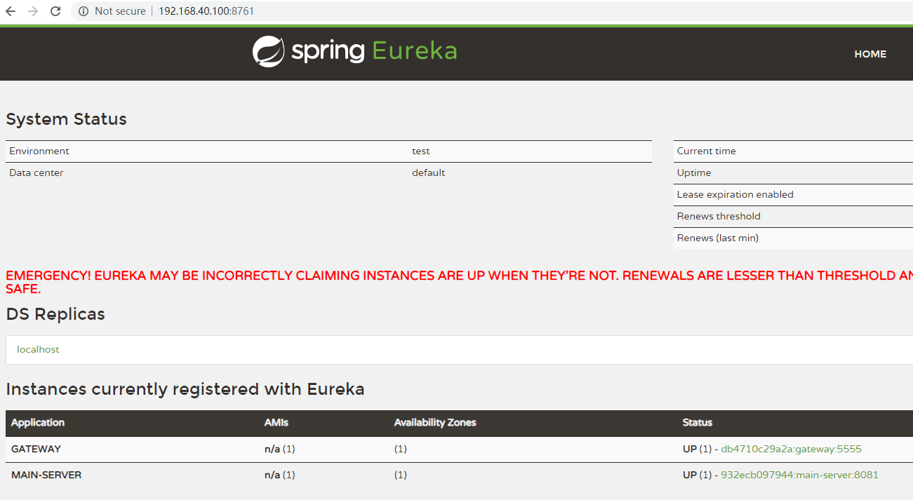
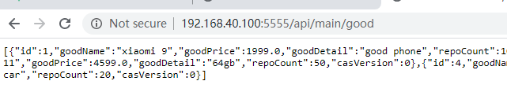

# docker镜像构建

## 1. 虚拟机准备

### 1.1 安装vmware

### 1.2 安装虚拟机镜像

#### 打开虚拟机镜像

​	点击**打开虚拟机**，选择虚拟机镜像

#### 设置虚拟机

虚拟机网络模式设置为**NAT**

1. root 用户登录，密码1234

2. 设置静态ip

   ```bash
   vim /etc/sysconfig/network-scripts/ifcfg-ens33
   ----------------
   IPADDR=192.168.134.101
   DNS1=114.114.114.114
   GATEWAY=192.168.134.2
   NETMASK=255.255.255.0
   # 以上参数设置根据各自的vmnet8的地址改变
   ```

   重启虚拟机

   ```bash
   reboot now
   ```

## 2.安装docker

### 2.1 配置yum安装源

访问阿里云获取docker安装源

```bash
# step 1: 安装必要的一些系统工具
sudo yum install -y yum-utils device-mapper-persistent-data lvm2
# Step 2: 添加软件源信息
sudo yum-config-manager --add-repo https://mirrors.aliyun.com/docker-ce/linux/centos/docker-ce.repo
# Step 3: 更新并安装Docker-CE
sudo yum makecache fast
sudo yum -y install docker-ce
# Step 4: 设置docker自启动和开启
sudo systemctl start docker
sudo systemctl enable docker

# 注意：
# 官方软件源默认启用了最新的软件，您可以通过编辑软件源的方式获取各个版本的软件包。例如官方并没有将测试版本的软件源置为可用，您可以通过以下方式开启。同理可以开启各种测试版本等。
# vim /etc/yum.repos.d/docker-ee.repo
#   将[docker-ce-test]下方的enabled=0修改为enabled=1
#
# 安装指定版本的Docker-CE:
# Step 1: 查找Docker-CE的版本:
# yum list docker-ce.x86_64 --showduplicates | sort -r
#   Loading mirror speeds from cached hostfile
#   Loaded plugins: branch, fastestmirror, langpacks
#   docker-ce.x86_64            17.03.1.ce-1.el7.centos            docker-ce-stable
#   docker-ce.x86_64            17.03.1.ce-1.el7.centos            @docker-ce-stable
#   docker-ce.x86_64            17.03.0.ce-1.el7.centos            docker-ce-stable
#   Available Packages
# Step2: 安装指定版本的Docker-CE: (VERSION例如上面的17.03.0.ce.1-1.el7.centos)
# sudo yum -y install docker-ce-[VERSION]
```

#### 2.2 配置docker镜像加速器

```bash
$ sudo mkdir -p /etc/docker
$ sudo tee /etc/docker/daemon.json <<-'EOF'
{
  "registry-mirrors": ["https://registry.docker-cn.com"]
}
EOF
$ sudo systemctl daemon-reload
$ sudo systemctl restart docker
```

#### 2.3 配置iptables

```bash
$ /etc/sysctl.conf <<'EOF'
net.bridge.bridge-nf-call-ip6tables = 1
net.bridge.bridge-nf-call-iptables = 1
EOF
$ sysctl -p
$ systemctl daemon-reload
$ systemctl restart docker
```

## 3. 纯手动部署docker项目

​	在实际生产环境中，我们需要依赖于容器编排工具来实现动态扩容、服务发现、运行监测等工作。还需要通过工具来实现持续集成和持续部署，因此纯手动的方式几乎是不可能满足生产环境中庞大的运维工作的，因此，这里只是作为演示，并且通过手动搭建掌握docker基本概念和命令。

### 3.1 mysql服务安装

#### 3.1.1 下载mysql官方镜像

```bash
$ docker pull mysql:5.6
```

#### 3.1.2 运行mysql容器

准备sql

```sql

CREATE DATABASE IF NOT EXISTS rush_store CHARACTER SET  utf8 collate utf8_general_ci;

use rush_store;

create table user_info (
	user_id bigint primary key auto_increment,
    username varchar(32),
    password varchar(32),
    consumption double
);

create table good_info (
	good_id bigint primary key auto_increment,
    good_name varchar(32),
    good_price double,
    good_detail text,
    repo_count bigint,
    cas_version int
);

create table rush_record (
	user_id bigint,
    good_id bigint,
    amount int,
    status char,
    create_time datetime  
);


insert into user_info (username,password,consumption)values ('zhangsan','1234',12000);
insert into user_info (username,password,consumption)values ('lisi','1234',10000);
insert into user_info (username,password,consumption)values ('wangwu','1234',9000);
insert into user_info (username,password,consumption)values ('zhaoliu','1234',3000);
insert into user_info (username,password,consumption)values ('tianqi','1234',22000);

insert into good_info (good_name,good_price,good_detail,repo_count,cas_version) values ('xiaomi 9',1999,'good phone',10,0);
insert into good_info (good_name,good_price,good_detail,repo_count,cas_version) values ('air pods',799,'wireless bluetooth earphone',100,0);
insert into good_info (good_name,good_price,good_detail,repo_count,cas_version) values ('iphone 11',4599,'64gb',50,0);
insert into good_info (good_name,good_price,good_detail,repo_count,cas_version) values ('maotai',1499,'drink together',30,0);
insert into good_info (good_name,good_price,good_detail,repo_count,cas_version) values ('tesla',299998,'electronic motor car',20,0);

```

运行命令

```bash
$ docker run --name test-mysql  -e MYSQL_ROOT_PASSWORD=1234  -v /opt/projects:/docker-entrypoint-initdb.d   -v /opt/mysqldata:/var/lib/mysql   -p 3306:3306 -d mysql:5.6
--------------------------------------------------------
#运行命令前，将数据库测试脚本放在/opt/projects文件夹内，以便于挂载卷
```

```bash
scp [要拷贝的文件路径]  [拷贝到哪]
scp  <user>@<address>:<filepath>     <user>@<address>:<filepath>
scp d:/data.sql     root@192.168.134.100:/opt/
```


#### 3.1.3 测试

通过可视化工具或者mysql客户端命令连接数据库

```bash
$ mysql -h 192.168.40.100 -u root -p
```

### 3.2. web服务单点部署

这里需要使用到nginx镜像

#### 3.2.1 编写nginx配置文件

在目录/opt/manifest/frontApp/下创建文件front-nginx.conf

```nginx

#user  nobody;
worker_processes  1;

events {
    worker_connections  1024;
}


http {
    include       mime.types;
    default_type  application/octet-stream;

    sendfile        on;

    keepalive_timeout  65;

    upstream backend {
     	    server localhost:5555;
    }

    server {
        listen       80;
        server_name  localhost;
        root /usr/share/nginx/html/; 

        location / {
            try_files $uri $uri/ /index.html;
        }

        location ~ /api {
	         proxy_pass http://backend;
	    }
    }
}

```

#### 3.2.1  运行docker命令

```bash
docker run --name front-app -v /opt/manifest/frontApp/front-nginx.conf:/etc/nginx/nginx.conf -v /opt/manifest/frontApp/dist/:/usr/share/nginx/html/ -p 8080:8080 -d nginx:1.16.1-alpine 
```

> 在这里我们通过挂载卷的方式，将虚拟机的front-nginx.conf映射至容器指定位置，同理映射了项目目录dist至指定位置，项目目录的位置我们在nginx.conf中root指定的地址

#### 3.2.3 测试

在 宿主机打开浏览器，访问nginx服务


显然我们现在是无法登陆的，因为我们并未配置后端backend的正确地址，并且后端也没有运行起来

```ngin
 upstream backend {
     	    server localhost:5555;    # 这里对于后端服务的映射显然不存在，因为我们知道容器中不存在这个服务
 }
```



### 3.3   部署 registry-server

#### 3.3.1  DockerFile方式制作镜像

首先将通过```mvn clean package```命令打包registry-server项目

将jar包导入到虚拟机目录/opt/manifest/registry-server

目录下建立Dockerfile

```dockerfile
FROM openjdk:8-jdk-alpine
VOLUME /app
ENTRYPOINT ["java","-jar","/app/app.jar"]
```

构建镜像

```bash
docker build -t registry-server .
```

#### 3.3.2 运行容器

```bash
docker run --name registry-server1  -v /opt/manifest/registry-server/registry-server-1.0-SNAPSHOT.jar:/app/app.jar -p 8761:8761 -d registry-server:latest
```

#### 3.3.3 测试

宿主机访问http:/192.168.134.101:8761



#### 3.3.4 容器互联

​	虽然服务注册中心运行起来了，但是由于是在容器内部运行，而默认容器是无法被访问到，因此这里必须要创建docker容器之间的桥接网络，并且手动将各个容器加入这个网路

##### 1. 创建网络

```bash
$ docker network create -d bridge my-net
```

##### 2. 指定网络运行注册中心

```bash
docker run --name registry-server  -v /opt/manifest/registry-server/registry-server-1.0-SNAPSHOT.jar:/app/app.jar -p 8761:8761   --network my-net -d registry-server:latest 
```

启动一个busybox容器通过ping命令来测试一下是否能访问和注册中心互联

```bash
docker run -it --rm --name busybox1 --network my-net busybox sh
------------------------
/ # ping registry-server
PING registry-server (172.19.0.2): 56 data bytes
64 bytes from 172.19.0.2: seq=0 ttl=64 time=0.064 ms
64 bytes from 172.19.0.2: seq=1 ttl=64 time=0.154 ms
64 bytes from 172.19.0.2: seq=2 ttl=64 time=0.146 ms
```

可见这两个容器互联了，理论上eureka可以被同网络下的其他网络访问了，下面用部署gateway来实践一下

### 3.4 部署gateway

#### 3.4.1 制作镜像

同registry，设置工作目录：/opt/manifest/gateway

编制Dockerfile

```dockerfile
FROM openjdk:8-jdk-alpine
VOLUME /app
ENTRYPOINT ["java","-jar","/app/app.jar","--eureka.client.serviceUrl.defaultZone=http://registry-server:8761/eureka/"]
```

> 这里我们将注册中心的域名设置成了以容器名作为域名

构建镜像

```bash
docker build -t gateway .
```

#### 3.4.2 运行容器

```bash
docker run --name gateway  -v /opt/manifest/gateway/gateway-1.0-SNAPSHOT.jar:/app/app.jar -p 5555:5555 -d gateway:latest
```

此时再次去访问eureka server的web服务，可以看到gateway注册服务成功。



### 3.5  部署main-server与rush-server

部署mainserver和rush-server过程相同，因此这里以main-server为准

#### 3.5.1 mysql设置容器通讯

由于main-server和rush-server都需要访问mysql，因此mysql容器必须加入到my-net中

```bash
$ docker run --name rush-data  -e MYSQL_ROOT_PASSWORD=1234  -v /opt/manifest/mysql/data.sql:/docker-entrypoint-initdb.d/data.sql   -v /opt/manifest/mysql/data/:/var/lib/mysql   -p 3306:3306 --network my-net -d mysql:5.6
```

#### 3.5.2 制作镜像

工作目录设置为/opt/manifest/registry-server，编制Dockerfile

```dockerfile
FROM openjdk:8-jdk-alpine
VOLUME /app
ENTRYPOINT ["java","-jar","/app/app.jar","--eureka.client.serviceUrl.defaultZone=http://registry-server:8761/eureka/","--spring.datasource.url=jdbc:mysql://rush-data:3306/rush_store?useUnicode=true&characterEncoding=utf8","--spring.datasource.username=root","--spring.datasource.password=1234"]
```

> 这里更合适的方式修改多个spring配置项是创建多个profile

构建镜像

```bash
docker build -t main-server .
```

#### 3.5.3 启动容器

```bash
$ docker run --name main-server  -p 8081:8081 -v /opt/manifest/main-server/main-server-1.0-SNAPSHOT.jar:/app/app.jar --network my-net -d main-server:latest
```

#### 3.5.4 测试

宿主机访问eureka 检查服务是否注册，通过curl命令访问登录接口或者商品接口检查是否能获得到数据





>  按照以上步骤部署rush-server,省略。。。。。

### 3.6  修改nginx服务的网络

重新配置nginx.conf，将upstream反向代理的域名换成gateway

```nginx
#user  nobody;
worker_processes  1;

events {
    worker_connections  1024;
}


http {
    include       mime.types;
    default_type  application/octet-stream;

    sendfile        on;

    keepalive_timeout  65;

    upstream backend {
            server gateway:5555; #修改这里
    }

    server {
        listen       80;
        server_name  localhost;
        root /usr/share/nginx/html/;

        location / {
            try_files $uri $uri/ /index.html;
        }

        location ~ /api {
                 proxy_pass http://backend;
            }
    }
}
```

运行前端服务

```bash
$ docker run --name front-app -v /opt/manifest/frontApp/nginx.conf:/etc/nginx/nginx.conf -v /opt/manifest/frontApp/dist/:/usr/share/nginx/html/ -p 80:80 --network my-net -d nginx:1.16.1-alpine
```

#### 综合测试

按照用例进行测试


## 4.docker-compose部署项目

Docker Compose 是 Docker 官方编排（Orchestration）项目之一，负责快速的部署分布式应用。 

> 官网：https://docs.docker.com/compose/

### 4.1 安装docker-compose

docker-compose的安装方式多种多样，甚至直接可以通过docker容器运行，这里采取容器方式来安装

```bash
$ sudo curl -L --fail https://github.com/docker/compose/releases/download/1.25.0/run.sh -o /usr/local/bin/docker-compose
$ sudo chmod +x /usr/local/bin/docker-compose
```

执行命令```docker-compose --version```,结果为```Docker version 19.03.5, build 633a0ea```

### 4.2 编制编排脚本

docker compose的核心就是编制yaml脚本，脚本中规定了项目中所包含的容器，其编排能力仅限于单机，因此还需要结合docker machine 和docker swarm来进行更加强大的编排，比如具有服务扩展，服务负载均衡这样的生产级功能，但是在实际生产环境中，k8s是更好的选择，因此这里不过多介绍

在工作目录manifest下编制docker-compose.yaml

```yaml
version: '3'
services:
  web:
   image: nginx:1.16.1-alpine
   expose:
     - "80"
   ports:
     - "80:80"
   volumes:
     - ./frontApp/nginx.conf:/etc/nginx/nginx.conf
     - ./frontApp/dist/:/usr/share/nginx/html/
   depends_on:
     - gateway
  gateway:
    build: ./gateway/
    volumes:
      - ./gateway/gateway-1.0-SNAPSHOT.jar:/app/app.jar
    expose:
      - "5555"
    depends_on:
      - registry-server
  registry-server:
    build: ./registry-server
    volumes:
      - ./registry-server/registry-server-1.0-SNAPSHOT.jar:/app/app.jar
    expose:
      - 8761
  main-server:
    build: ./main-server
    volumes:
      - ./main-server/main-server-1.0-SNAPSHOT.jar:/app/app.jar
    expose:
      - "8081"
    depends_on:
      - rush-data
  rush-server:
    build: ./rush-server
    volumes:
      - ./rush-server/rush-server-1.0-SNAPSHOT.jar:/app/app.jar
    expose:
      - "8082"
    depends_on:
      - rush-data
      - main-server
  rush-data:
    image: mysql:5.6
    volumes:
      - ./mysql/data.sql:/docker-entrypoint-initdb.d/data.sql
      - ./mysql/data/:/var/lib/mysql
    environment:
      MYSQL_ROOT_PASSWORD: 1234
    expose:
      - "3306"
    ports:
      - "3306:3306"
```

### 4.3  执行编排

```bash
$ docker-compose up
---------------
Starting manifest_rush-data_1       ... done
Starting manifest_registry-server_1 ... done
Starting manifest_gateway_1         ... done
Starting manifest_main-server_1     ... done
Starting manifest_rush-server_1     ... done
Starting manifest_web_1             ... done
rush-data_1        | 2020-01-10 15:38:08+00:00 [Note] [Entrypoint]: Entrypoint script for MySQL Server 5.6.46-1debian9 started.
rush-data_1        | 2020-01-10 15:38:08+00:00 [Note] [Entrypoint]: Switching to dedicated user 'mysql'
rush-data_1        | 2020-01-10 15:38:08+00:00 [Note] [Entrypoint]: Entrypoint script for MySQL Server 5.6.46-1debian9 started.
```

等待片刻，访问暴露端口的web服务，测试用例

