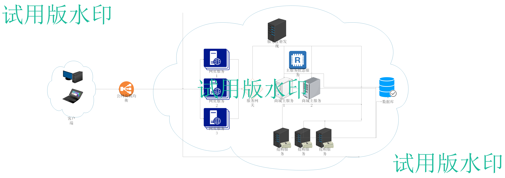
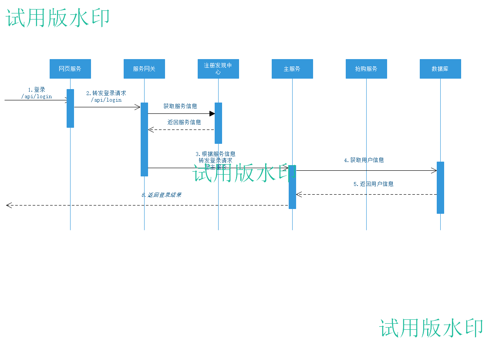
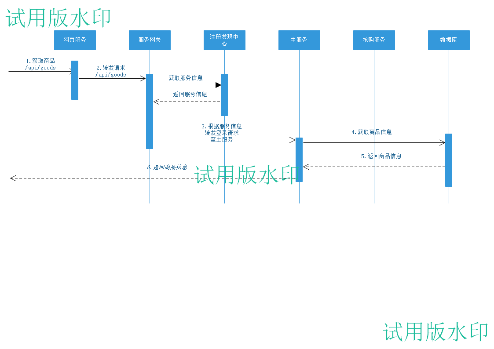
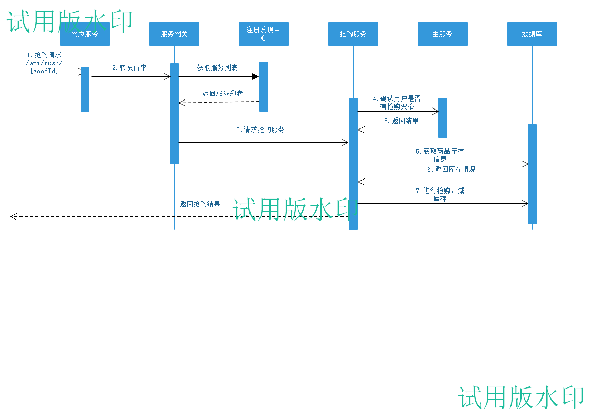

# 项目总体介绍

## 1. 业务场景

​	模拟电商平台中抢购服务模块，实现抢购服务的三高要求



## 2. 相关技术栈选用

微服务相关：springcloud

前端：nginx vue

数据库：mysql  redis

部署环境： docker


## 3. 服务调用过程

#### 登录流程



#### 获取商品



#### 抢购流程



## 4.数据库表结构

```sql
create table user_info (
	user_id int primary key auto_increment,
    username varchar(32),
    password varchar(32),
    consumption double
);

create table good_info (
	good_id int primary key auto_increment,
    good_name varchar(32),
    good_price double,
    good_detail text,
    repo_count bigint, 
    cas_version int   --cas乐观锁版本
);

create table rush_record (
	user_id int,
    good_id int,
    amount int,
    status char  
);
```

> 在good_info中有一个重要字段，参考
>
> https://mp.weixin.qq.com/s/qrpwbAcg9smxUZPLeD1QRQ
>
> 采用乐观锁的方式来控制超卖的现象

## 5. 参考文档：

docker-practice：https://yeasy.gitbooks.io/docker_practice/content/install/ubuntu.html

vue： https://cn.vuejs.org


1. 容器的独立部署：mysql  java容器 (html css javascript)nginx
2. 容器之间的互联：配置容器的内部访问，创建一个供容器使用的虚拟网段，配置个节点的ip
3. 通过编排工具来实现项目的部署：kubernetes（k8s），docker compose ,swarm ,machine