# 大数据技术之Hadoop入门

## 大数据概论

​	大数据（Big Data）： 指**无法在一定时间范围**内用常规软件工具进行捕捉、管理和处理的数据集合，是需要新处理模式才能具有更强的决策力、洞察发现力和流程优化的海量、高增长率和多样化的信息资产。

​	主要解决：海量数据的存储和海量数据的分析计算问题。

### 大数据特点（4v）

#### Volume（大量）

​	截止目前为止，人类生产的所有印刷材料的数据量是200PB，而历史上全热泪总共说过的化的数据量大约5EB，当前，典型个人计算机硬盘的容量为TB量级，而一些大企业的数据量已经接近EB量级。

> 数据存储单位：bit Byte  KB MB GB TB PB EB ZB YB BB NB DB

#### Velocity(高速)

​	这是大数据区分于传统数据挖掘的最显著特征，根据IDC的“数据宇宙”的报告，预计到2020年，全球数据使用量将达到35.2ZB，在如此海量的数据面前，处理数据的效率是企业的生命。

#### Variety（多样）

​	数据类型的多样性，相对于以往便于存储的以数据库/文本为主的结构化数据，非结构化数据越来越多，包括网络日志、音频、视频、图片、地理位置信息等，这些多类型的数据对数据的处理能力提出了很高的要求。


#### Value(低价值密度)

​	价值密度的高低与数据总量的大小成反比，比如，在一天监控的视频中，我们只关心某一时刻小偷窃取物品的1分钟，如何快速对有价值数据进行提取，称为目前大数据背景下待解决的难题。

### 大数据应用场景

​	大数据一定会逐渐普及于传统行业的方方面面，教育、医疗、金融、物流运输、工商业都越来越离不开基于大数据的人工智能和数据价值挖掘场景。例如：

**物流仓储**

​	大数据分析系统助力商家精细化运营、提升销量、节约成本。


**零售**

​	分析用户消费习惯，为用户购买商品提供方便，从而提升商品销量。(经典案例：纸尿布与啤酒)


**旅游**

​	深度就和大数据能力与旅游行业需求，共建旅游产业智慧管理、智慧服务和智慧营销的未来。


**商品广告推荐**

给用户推荐可能喜欢的商品


**保险**

​	海量数据挖掘机风险预测，助力保险行业精准营销。

**金融**

​	多维度体现用户特征，帮助经融机构推荐优质客户，方法欺诈风险。

**医疗**

​	通过收集群体及个人完整的医疗数据，建立个人医疗数据档案、患者主索引，通过整体数据分析病理，病灶。


**人工智能**


### 大数据业务流程

​	有能力和有需要使用大数据技术的公司前提就是：大！

​	如果你企业的业务不到一定规模，几乎不太需要大数据人才介入，因此，大数据人才目前往往只适合大中型企业。

​	大数据的流程一般如下：


### 大数据部门组织结构

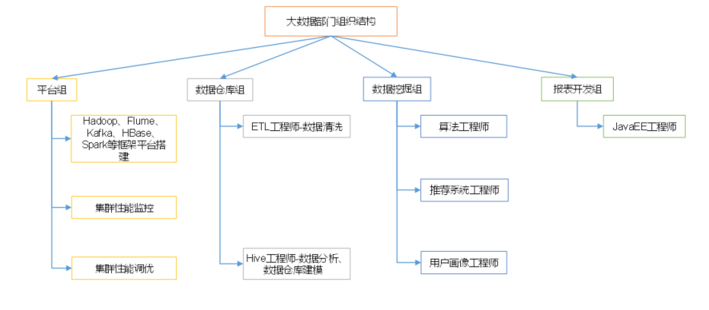

## 大数据技术生态与Hadoop

​	Hadoop不是指具体一个框架或者组件，它是Apache软件基金会下用Java语言开发的一个开源分布式计算平台。实现在大量计算机组成的集群中对海量数据进行分布式计算。适合大数据的分布式存储和计算平台。

### hadoop发展历史

​	2003-2004年，Google公布了部分GFS和MapReduce思想的细节，受此启发的Doug Cutting等人用2年的业余时间实现了DFS和MapReduce机制，使Nutch性能飙升。然后Yahoo招安Doug Gutting及其项目。
2005年，Hadoop作为Lucene的子项目Nutch的一部分正式引入Apache基金会。2006年2月被分离出来，成为一套完整独立的软件，起名为Hadoop。Hadoop名字不是一个缩写，而是一个生造出来的词。是Hadoop之父Doug Cutting儿子毛绒玩具象命名的。Hadoop的成长过程：Lucene–>Nutch—>Hadoop

总结起来，Hadoop起源于Google的三大论文
GFS：Google的分布式文件系统Google File System
MapReduce：Google的MapReduce开源分布式并行计算框架
BigTable：一个大型的分布式数据库

**演变关系**
GFS—->HDFS
Google MapReduce—->Hadoop MapReduce
BigTable—->HBase**2****.3 Hadoop三大发行版本**

### Hadoop版本

**Hadoop三大发行版本**：Apache、Cloudera、Hortonworks。

**Apache**版本最原始（最基础）的版本，对于入门学习最好。

**Cloudera**在大型互联网企业中用的较多。

**Hortonworks**文档较好。

### Hadoop的优势

1. 高可用性：Hadoop底层维护多个数据副本，所以即使Hadoop某个计算元素或存储出现故障，也不会导致数据的丢失。
2. 高可扩展性：在集群间分配任务数据，课方便的扩展数以千记的节点。
3. 高效性：在MapReduce思想下，Hadoop是并行工作的，以加快任务处理的速度，
4. 高容错性：能够自动将失败的任务重新分配。

### Hadoop架构组成（重点）

​	hadoop 1.x版本与2.x版本有着本质的区别，课程围绕2.x版本进行。

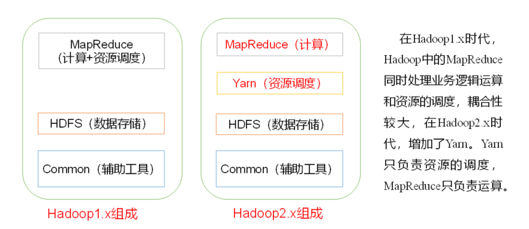

#### hdfs架构概述

> 参考：https://www.cnblogs.com/jinlin/p/10300882.html

HDFS是hadoop自带的分布式文件系统，英文名为：Hadoop Distributed Filesystem，HDFS以流式数据访问模式来存储超大文件。根据设计，HDFS具有如下特点

##### HDFS特点

1. 支持超大文件

   `一般来说，HDFS存储的文件可以支持TB和PB级别的数据`

2. 检测和快速应对硬件故障

   `在集群环境中，硬件故障是常见性问题。因为有上千台服务器连在一起，故障率很高，因此故障检测和自动恢复hdfs文件系统的一个设计目标。假设某一个datanode挂掉之后，因为数据是有备份的，还可以从其他节点里找到。namenode通过心跳机制来检测datanode是否还存活`

3. 流式数据访问

```
HDFS的访问模式是一次写入，多次读取，数据集通常都是由数据源生成或者从数据源复制而来，接着长时间在此数据集上进行各种分析，因此读取整个数据集的时间延迟比读取第一条记录的时间延迟更重要
```

1. 高容错性

   `数据自动保存多个副本，副本丢失后自动恢复。 可构建在廉价的机器上，实现线性扩展。当集群增加新节点之后，namenode也可以感知，将数据分发和备份到相应的节点上`

2. 商用硬件

   `Hadoop并不需要运行在昂贵且高可靠的硬件上。它是设计运行在商用硬件（在各种零售店都能买到的普通硬件）的集群上的，因此至少对于庞大的集群来说，节点故障的几率还是非常搞得。HDFS遇到上述故障时，被设计成能够继续运行且不让用户察觉到明显的中断。`

##### hdfs核心组件

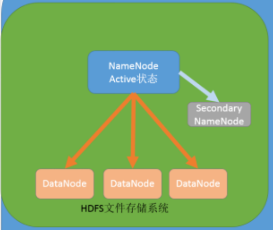

**NameNode**：

​	集群当中的主节点，主要用于管理集群当中的各种数据，存储文件的元数据，如文件名，文件目录结构，文件属性（生成时间、副本数、文件权限），以及每个文件的块列表和块所在的DataNode等。**namenode就好比是一个文件的目录。**
**secondaryNameNode**：

​	主要能用于hadoop当中元数据信息的辅助管理，用来监控hdfs状态，每隔一段时间获取hdfs元数据的快照。
**DataNode**：

​	保存在hdfs中的海量数据显然是要进行切割的，这些数据经过切割后，以块的方式保存在datanode中，datanode是集群当中的从节点，主要用于存储集群当中的各种数据，以及块数据的校验。

#### YARN架构概述

> 参考：https://www.jianshu.com/p/f50e85bdb9ce

​	Apache Hadoop YARN 是开源 Hadoop 分布式处理框架中的资源管理和作业调度技术。作为 Apache Hadoop 的核心组件之一，YARN 负责将系统资源分配给在 Hadoop 集群中运行的各种应用程序，并调度要在不同集群节点上执行的任务。

​	YARN 的基本思想是将资源管理和作业调度/监视的功能分解为单独的 daemon(守护进程)，其拥有一个全局 ```ResourceManager```(RM) 和每个应用程序的 ```ApplicationMaster```(AM)。应用程序可以是单个作业，也可以是作业的 DAG。

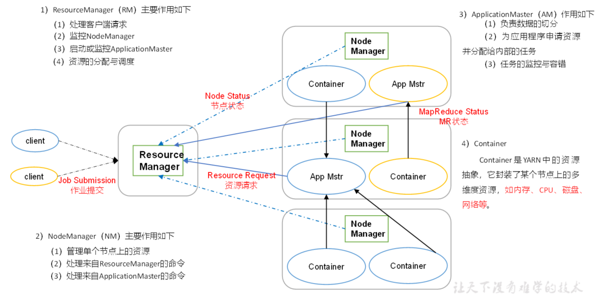

##### YARN 基本服务组件

​	YARN 总体上是 master/slave 结构，在整个资源管理框架中，```ResourceManager``` 为 master，```NodeManager``` 是 slave。

YARN的基本组成结构，YARN 主要由 ```ResourceManager```、```NodeManager```、```ApplicationMaster ```和 ```Container``` 等几个组件构成。

- ```ResourceManager```是Master上一个独立运行的进程，负责集群统一的资源管理、调度、分配等等；
- ```NodeManager```是Slave上一个独立运行的进程，负责上报节点的状态；
- ```ApplicationMaster```相当于这个Application的监护人和管理者，负责监控、管理这个Application的所有Attempt在cluster中各个节点上的具体运行，同时负责向Yarn ```ResourceManager```申请资源、返还资源等；
- ```Container```是yarn中分配资源的一个单位，包涵内存、CPU等等资源，YARN以```Containe```r为单位分配资源；

```ResourceManager``` 负责对各个 ```NodeManager ```上资源进行统一管理和调度。当用户提交一个应用程序时，需要提供一个用以跟踪和管理这个程序的 ```ApplicationMaster```，它负责向 ```ResourceManager ```申请资源，并要求 ```NodeManger``` 启动可以占用一定资源的任务。由于不同的 ```ApplicationMaster``` 被分布到不同的节点上，因此它们之间不会相互影响。

Client 向 ```ResourceManager``` 提交的每一个应用程序都必须有一个 ```ApplicationMaster```，它经过 ```ResourceManager``` 分配资源后，运行于某一个 Slave 节点的 ```Container```中，具体做事情的 Task，同样也运行与某一个 Slave 节点的 Container 中。

#### MapReduce架构概述

> 参考：https://www.jianshu.com/p/ca165beb305b
>
> https://blog.csdn.net/lgnlgn/article/details/90076430
>
> 黑桃示例：https://cloud.tencent.com/developer/news/52756

​	MapReduce是一种编程模型，用于大规模数据集（大于1TB）的并行运算。概念"Map（映射）"和"Reduce（归约）"，是它们的主要思想，都是从函数式编程语言里借来的，还有从矢量编程语言里借来的特性。它极大地方便了编程人员在不会分布式并行编程的情况下，将自己的程序运行在分布式系统上。 当前的软件实现是指定一个Map（映射）函数，用来把一组键值对映射成一组新的键值对，指定并发的Reduce（归约）函数，用来保证所有映射的键值对中的每一个共享相同的键组。

MapReduce将计算过程分为两个阶段：Map和Reduce	

1. Map阶段并行处理输入数据
2. Reduce阶段对Map结果进行汇总

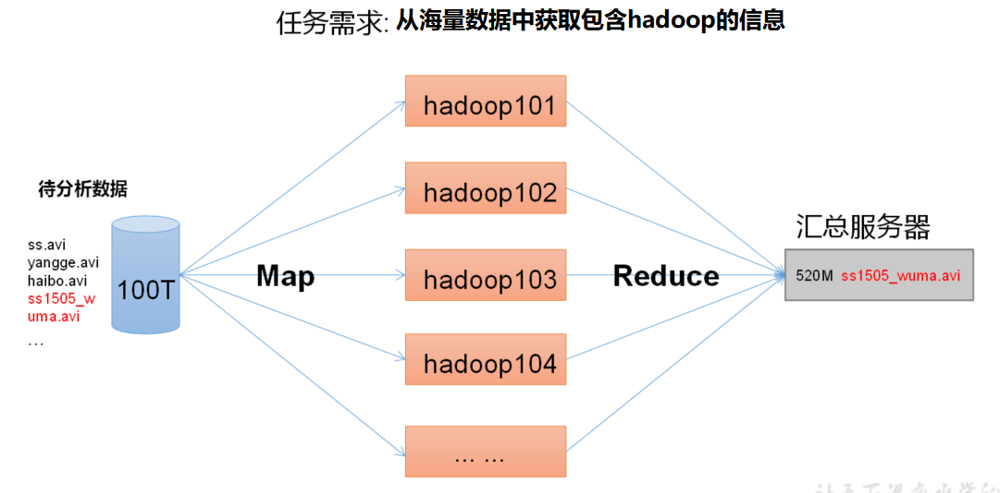

### 大数据技术生态体系

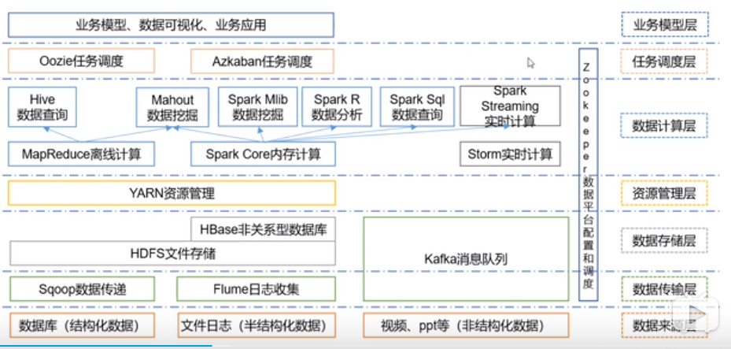

图中涉及的技术名词解释如下：

1. Sqoop：Sqoop是一款开源的工具，主要用于在Hadoop、Hive与传统的数据库(MySql)间进行数据的传递，可以将一个关系型数据库（例如 ：MySQL，Oracle 等）中的数据导进到Hadoop的HDFS中，也可以将HDFS的数据导进到关系型数据库中。

2. Flume：Flume是Cloudera提供的一个高可用的，高可靠的，分布式的海量日志采集、聚合和传输的系统，Flume支持在日志系统中定制各类数据发送方，用于收集数据；同时，Flume提供对数据进行简单处理，并写到各种数据接受方（可定制）的能力。

3. Kafka：Kafka是一种高吞吐量的分布式发布订阅消息系统，有如下特性：

   （1）通过O(1)的磁盘数据结构提供消息的持久化，这种结构对于即使数以TB的消息存储也能够保持长时间的稳定性能。

   （2）高吞吐量：即使是非常普通的硬件Kafka也可以支持每秒数百万的消息。

   （3）支持通过Kafka服务器和消费机集群来分区消息。

   （4）支持Hadoop并行数据加载。

4. Storm：Storm用于“连续计算”，对数据流做连续查询，在计算时就将结果以流的形式输出给用户。**目前storm正在被flink取代**

5. Spark：Spark是当前最流行的开源大数据内存计算框架。可以基于Hadoop上存储的大数据进行计算。

6. Oozie：Oozie是一个管理Hdoop作业（job）的工作流程调度管理系统。

7. Hbase：HBase是一个分布式的、面向列的开源数据库。HBase不同于一般的关系数据库，它是一个适合于非结构化数据存储的数据库。

8. Hive：Hive是基于Hadoop的一个数据仓库工具，可以将结构化的数据文件映射为一张数据库表，并提供简单的SQL查询功能，可以将SQL语句转换为MapReduce任务进行运行。 其优点是学习成本低，可以通过类SQL语句快速实现简单的MapReduce统计，不必开发专门的MapReduce应用，十分适合数据仓库的统计分析。

10. R语言：R是用于统计分析、绘图的语言和操作环境。R是属于GNU系统的一个自由、免费、源代码开放的软件，它是一个用于统计计算和统计制图的优秀工具。

11. Mahout：Apache Mahout是个可扩展的机器学习和数据挖掘库。

12. ZooKeeper：Zookeeper是Google的Chubby一个开源的实现。它是一个针对大型分布式系统的可靠协调系统，提供的功能包括：配置维护、名字服务、 分布式同步、组服务等。ZooKeeper的目标就是封装好复杂易出错的关键服务，将简单易用的接口和性能高效、功能稳定的系统提供给用户。

### 推荐系统架构示例

​	以电商平台中常见的推荐系统为例，大致架构如下：

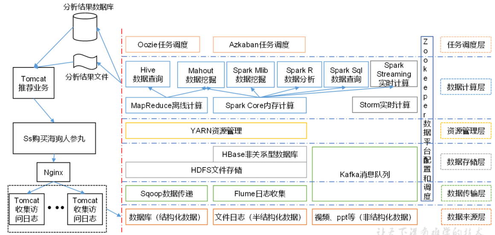


## hadoop运行环境搭建

### 虚拟机配置

#### centos虚拟机硬件环境

> 硬盘50g，内存4g，cpu 2*2

#### 虚拟机准备

1. 防火墙关闭

   ```bash
   $ systemctl stop firewalld
   $systemctl disabled firewalld
   ```

2. 创建用户

   ```bash
   $ useradd hadoop
   $ passwd hadoop
   ```

3. 在  /opt目录创建software module文件夹

   ```bash
   $ mkdir /opt/software /opt/module
   $ chown hadoop:hadoop  /opt/software /opt/module //设置权限
   ```

4. 把这个用户添加到sudoers中

   ```bash
   $ vim /etc/sudoers
   $ hadoop ALL=(ALL)        NOPASSWD: ALL
   ```

5. 改hosts文件

   ```bash
   $ vim /etc/hosts
   //在文件后追加几个虚拟机地址
   192.168.134.150 hadoop150
   192.168.134.151 hadoop151
   192.168.134.152 hadoop152
   192.168.134.153 hadoop153
   192.168.134.154 hadoop154
   192.168.134.155 hadoop155
   192.168.134.156 hadoop156
   192.168.134.157 hadoop157
   192.168.134.158 hadoop158
   192.168.134.159 hadoop159
   ```

   > 也可以用shell脚本来做
   >
   > ```bash
   > $ vim test.sh
   > -------------
   > #!/bin/bash
   > for ((i=150;i<160;i++))
   > 	echo "192.168.134.$i hadoop$i" >> /etc/hosts
   > done
   > //-------
   > $ bash test.sh //运行脚本
   > ```

6. 设置ssh服务启动和自启动

   ```bash
   $ service sshd restart //启动
   $ chkconfig sshd on // 设置开机自启动
   ```

7. 改静态ip（下面几部每克隆一台就要做一遍）

   ```bash
   vim /etc/sysconfig/network-scripts/ifcfg-ens33
   //-----------
   TYPE=Ethernet
   PROXY_METHOD=none
   BROWSER_ONLY=no
   BOOTPROTO=static
   DEFROUTE=yes
   IPV4_FAILURE_FATAL=no
   IPV6INIT=yes
   IPV6_AUTOCONF=yes
   IPV6_DEFROUTE=yes
   IPV6_FAILURE_FATAL=no
   IPV6_ADDR_GEN_MODE=stable-privacy
   NAME=ens33
   UUID=76b19c2b-5fa7-4288-baa9-8c13cb636a30
   DEVICE=ens33
   ONBOOT=yes
   IPADDR=192.168.40.151
   GATEWAY=192.168.40.2
   DNS1=114.114.114.114
   DNS2=8.8.8.8
   ```

8. 改主机名

   ```bash
   vim /etc/sysconfig/network
   HOSTNAME=hadoop151
   
   --------
   $ hostnamectl set-hostname hadoop151
   ```


#### 安装jdk和hadoop

##### 安装jdk

###### 安装openjdk

```bash
yum install java-1.8.0-openjdk* -y //安装所有openjdk的包
```

###### 安装oracle jdk

1. 下载oracle jdk linux


2. 通过ssh拷贝至 /opt/software

```bash
scp [文件路径]  [用户名]@[ipaddr]:[文件拷贝位置]
//例如
scp d:/jdk-8u201.tar.gz root@192.168.134.151:/opt/software
```

3. 解压

```bash
tar -zxvf jdk-8u201-linux-x64.tar.gz -C /opt/module
```

###### 配置环境变量

```bash
vim /etc/profile
export JAVA_HOME=/usr/lib/jvm/java-1.8.0-openjdk-1.8.0.242.b08-0.el7_7.x86_64
export PATH=$PATH:$JAVA_HOME/bin
//------------
source /etc/profile 
```

##### 安装hadoop

1. 下载hadoop，拷贝至linux

   ```bash
   $ scp  <文件所在路径>   root@<虚拟机ip>:/<想存放的路径>java
   ```

2. 解压

   ```bashj
   tar -zxvf hadoop.tar.gz -C /opt/module
   ```

3. 配置环境变量

   ```bash
   export HADOOP_HOME=/opt/module/hadoop-2.10.0
   export PATH=$PATH:$HADOOP_HOME/bin:$HADOOP_HOME/sbin
   //------------
   source /etc/profile 
   hadoop version
   ```

> 在此可以保存个快照

#### hadoop目录结构

查看Hadoop目录结构

```bash
$ ll
------------------
drwxr-xr-x. 2 hadoop hadoop  4096 5月  22 2017 bin
drwxr-xr-x. 3 hadoop hadoop  4096 5月  22 2017 etc
drwxr-xr-x. 2 hadoop hadoop  4096 5月  22 2017 include
drwxr-xr-x. 3 hadoop hadoop  4096 5月  22 2017 lib
drwxr-xr-x. 2 hadoop hadoop  4096 5月  22 2017 libexec
-rw-r--r--. 1 hadoop hadoop 15429 5月  22 2017 LICENSE.txt
-rw-r--r--. 1 hadoop hadoop   101 5月  22 2017 NOTICE.txt
-rw-r--r--. 1 hadoop hadoop  1366 5月  22 2017 README.txt
drwxr-xr-x. 2 hadoop hadoop  4096 5月  22 2017 sbin
drwxr-xr-x. 4 hadoop hadoop  4096 5月  22 2017 share
```

##### 重要目录

1. bin目录：存放对Hadoop相关服务（HDFS,YARN）进行操作的脚本

2. etc目录：Hadoop的配置文件目录，存放Hadoop的配置文件

3. lib目录：存放Hadoop的本地库（对数据进行压缩解压缩功能）

4. sbin目录：存放启动或停止Hadoop相关服务的脚本

5. share目录：存放Hadoop的依赖jar包、文档、和官方案例

## Hadoop运行模式

### 本地单节点运行hadoop

​	本地运行模式没有调用任何hdfs和yarn的调度，只是基于本次存储环境和java运行环境的运行，实际上只能用于debug

#### 官方grep案例

配置 `etc/hadoop/hadoop-env.sh`

```bash
vim  etc/hadoop/hadoop-env.sh
//---------
export JAVA_HOME=/usr/lib/jvm/java-1.8.0-openjdk-1.8.0.242.b08-0.el7_7.x86_64
```

创建输入文件夹，将例子中xml文件拷贝进入，然后执行example中的grep主函数来运算，并展示结果：

```bash
 $ mkdir input
 $ cp etc/hadoop/*.xml input
 $ bin/hadoop jar share/hadoop/mapreduce/hadoop-mapreduce-examples-2.10.0.jar grep input output 'dfs[a-z.]+'
 $ cat output/*
```

#### 官方wordcount案例

1. 创建wcinput 文件夹

   ```bash
   $ mkdir wcinput
   ```

2. 在文件夹中建立用于统计的源文件

   ```bash
   $ vim wc.input
   //---------
   haha hehe heyhey
   haha hoho hehe
   haha heyhey hello
   ```

3. 调用example jar输出统计结果

   ```bash
   $ bin/hadoop jar share/hadoop/mapreduce/hadoop-mapreduce-examples-2.10.0.jar wordcount wcinput wcoutput
   ```


### 伪分布式运行

`Pseudo-Distributed Operation`伪分布式运行，指的是将所有hadoop中的节点都运行在一台主机上，比如namenode和datanode都运行在一台主机环境上，适合学习使用，简单了解。

#### 启动HDFS伪分布式运行

##### 配置 etc/hadoop/hadoop-env.sh

```bash
vim  etc/hadoop/hadoop-env.sh
//---------
export JAVA_HOME=/usr/lib/jvm/java-1.8.0-openjdk-1.8.0.242.b08-0.el7_7.x86_64 
# 配置javahome地址
```

##### 配置etc/hadoop/core-site.xml:

```xml
<configuration>
    <!--指定HDFS中NameNode的地址-->
    <property>
        <name>fs.defaultFS</name>
        <value>hdfs://hadoop151:9000</value>
        <!--value值配置主机域名或者ip地址-->
    </property>
    <!--指定hadoop运行时产生文件的存储目录，比如namenode运行时产生的文件-->
    <property>
        <name>hadoop.tmp.dir</name>
        <value>/opt/module/hadoop-2.10.0/data/tmp</value>
        <!--value值配置主机域名或者ip地址-->
    </property>
</configuration>
```

##### 配置etc/hadoop/hdfs-site.xml:

```xml
<configuration>
    <!--配置副本数量，由于我们只有一台主机，所以只配置一个副本，一台主机存多个副本没意义，挂了都没有-->
    <property>
        <name>dfs.replication</name>
        <value>1</value>
    </property>
</configuration>
```

###### 配置ssh连接本地

由于分布式中，各个节点之间的通讯是基于ssh，实际上就是连接本地localhost，如果不想要通过ssh密码的方式互相连接，那么就需要进行ssh的间的密钥配置

```bash
ssh-keygen -t rsa -P '' -f ~/.ssh/id_rsa
cat ~/.ssh/id_rsa.pub >> ~/.ssh/authorized_keys
chmod 0600 ~/.ssh/authorized_keys
```

##### 格式化hdfs

初始化启动hdfs之前，就要像硬盘格式化一样，对hdfs进行格式化，但是务必注意，一旦namenode启动后，就不能再进行格式化了，否则datanode将找不到自己的namenode，就好比换大哥了小弟不知道

```bash
bin/hdfs namenode -format
```

##### 启动namenode和datanode

```bash
sbin/hadoop-daemon.sh start namenode
sbin/hadoop-daemon.sh start datanode
```

访问namenode web服务

浏览器打开 hadoop151:50070

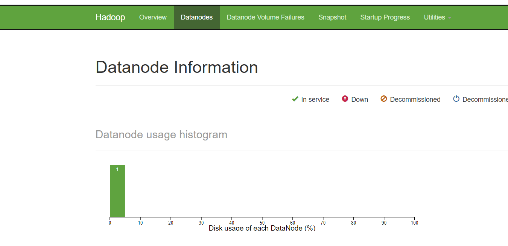

> 思考问题
>
> 为什么不能一直格式化NameNode，格式化NameNode，要注意什么？
>
> ```bash
> $ cd data/tmp/dfs/name/current/
> $ cat VERSION
> ---------
> clusterID=CID-f0330a58-36fa-4a2a-a65f-2688269b5837
> 
> $ cd data/tmp/dfs/data/current/
> $ cat VERSION
> -----
> clusterID=CID-f0330a58-36fa-4a2a-a65f-2688269b5837
> ```
>
> **注意：格式化NameNode**，会产生新的集的集群id不一致，集群找不到已往数据。所以，格式NameNode时，一定要先删除data数据和log日志，然后再格式化NameNode。

##### 创建HDFS下的目录以供执行mapreduce

```bash
  $ bin/hdfs dfs -mkdir /user
  $ bin/hdfs dfs -mkdir /user/<username>
```

##### 将本地input拷贝至hdfs 的input

```bash
$ bin/hdfs dfs -put input input
```

##### 运行示例代码

```bash
$ bin/hadoop jar share/hadoop/mapreduce/hadoop-mapreduce-examples-2.10.0.jar grep input output 'dfs[a-z.]+'
```

 检查运行结果

```bash
$ bin/hdfs dfs -cat output/*
```

##### 关闭namenode和datanode

```bash
sbin/hadoop-daemon.sh stop namenode
sbin/hadoop-daemon.sh stop datanode
```

#### 启动yarn并运行mapreduce程序

##### 配置yarn-env.sh

```bash
export JAVA_HOME=/usr/lib/jvm/java-1.8.0-openjdk.x86_64
```

##### 配置mapred-env.sh

```bash
export JAVA_HOME=/usr/lib/jvm/java-1.8.0-openjdk-1.8.0.242.b08-0.el7_7.x86_64
```

##### 配置:`etc/hadoop/mapred-site.xml`:

> 此文件不存在需要复制mapred-site.xml.template获得

```xml
<configuration>
    <!-- 指定MR运行在YARN上 -->
    <property>
        <name>mapreduce.framework.name</name>
        <value>yarn</value>
    </property>
</configuration>
```

##### 配置etc/hadoop/yarn-site.xml

```xml
<configuration>
    <!-- Reducer获取数据的方式 -->
    <property>
        <name>yarn.nodemanager.aux-services</name>
        <value>mapreduce_shuffle</value>
    </property>
    <!-- 指定YARN的ResourceManager的服务主机名 -->
    <property>
		<name>yarn.resourcemanager.hostname</name>
		<value>hadoop151</value>
	</property>
</configuration>
```

##### 启动yarn

```bash
$ sbin/start-yarn.sh
```

##### 访问ResourceManager web服务

浏览器访问http://hadoop151:8088/

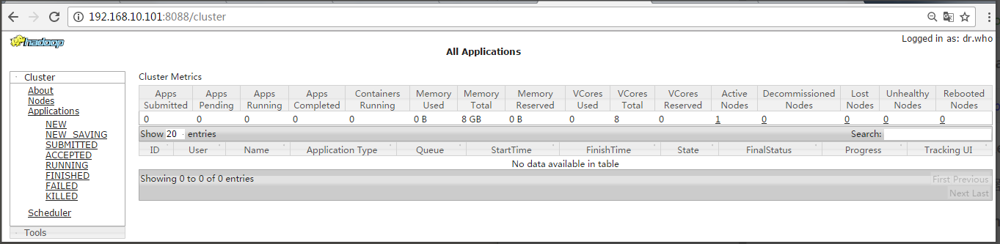

##### 运行mapreduce同hdfs部分

注意下面这张图，

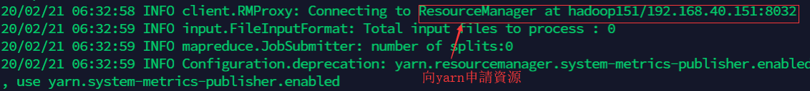

可以发现，mapreduce程序向yarn的ResourceMangager申请了资源

##### 停止yarn和hdfs

```bash
sbin/stop-dfs.sh
sbin/stop-yarn.sh
```

### 完全分布式运行模式（重点）

#### 虚拟机准备

##### 快速修改ip和主机名脚本

```bash
$ vim cip.sh
```

```bash
#!/bin/bash

ipaddr=$1
hostname=$2
if [ $ipaddr ]
then
  ipaddr= `echo $ipaddr | grep "^[0-9]\{1,3\}\.[0-9]\{1,3\}\.[0-9]\{1,3\}\.[0-9]\{1,3\}$"  `
  if [ $ipaddr ]
  then
    echo $ipaddr
  else
    echo 'no ipaddr input'
    exit
  fi
else
        echo 'no ipaddr input'
        exit
fi

sudo sed -i '/IPADDR=/d' /etc/sysconfig/network-scripts/ifcfg-ens33
sudo  echo "IPADDR=$ipaddr" | sudo tee  -a /etc/sysconfig/network-scripts/ifcfg-ens33

sudo sed -i '/HOSTNAME=/d' /etc/sysconfig/network

if [ $hostname ]
then
echo $hostname
else
hostname="hadoop${ipaddr##*.}"
fi

sudo echo "HOSTNAME=$hostname" | sudo tee  -a  /etc/sysconfig/network
sudo hostnamectl set-hostname $hostname

sudo reboot now
```

###### 脚本加入环境变量

如果希望任何用户都能直接执行以上脚本，我们需要将这个脚本放入环境变量包含的bin目录中

```bash
$ sudo cp cip.sh  /bin/
```

##### 集群快速分发脚本

​	有的时候，我们需要将一些文件快速复制到集群之下每一台机器的相同目录下，那么这时候我们就需要编写一个快速分发脚本，这个脚本中，我们会用到`scp`或者`rsync`命令

###### rsync 远程同步工具

rsync主要用于备份和镜像。具有速度快、避免复制相同内容和支持符号链接的优点。

rsync和scp区别：用rsync做文件的复制要比scp的速度快，rsync只对差异文件做更新。scp是把所有文件都复制过去。

**安装`rsync`**

```bash
$ sudo yum install -y rsync
```

**基本语法**

```bash
$ rsync    -av       $pdir/$fname              $user@hadoop$host:$pdir/$fname
# 命令   选项参数      要拷贝的文件路径/名称         目的用户@主机:目的路径/名称
```

 **选项参数说明**

| 选项 | 功能                                                         |
| ---- | ------------------------------------------------------------ |
| -a   | 归档拷贝:拷贝完全一致的文件，包括文件的所属用户权限和文件的修改时间 |
| -v   | 显示复制过程                                                 |

**案例实操**

（a）把hadoop151机器上的/opt/software目录同步到hadoop152服务器的root用户下的/opt/目录

```bash
[hadoop@hadoop151 opt]$ rsync -av /opt/software/ hadoop152:/opt/software
```

###### 自定义xsync命令

​	为了更加快速的在集群中对文件进行分发，我们可以封装一个脚本来更加便捷的分发文件，不用像rsync那样还要输入用户名和地址

```bash
$ vim xsync
```

```bash
#!/bin/bash

arg_num=$#

if [ $arg_num == 0 ] 
then
   echo 'no args'
   exit;
fi

# 获取文件或文件夹的真实路径
meta_arg=$1
#获取文件名
fname=`basename $meta_arg`
#获取文件真实路径
dir=`cd -P $(dirname $meta_arg) && pwd`
#获取用户名，由于集群是clone出来的，所以用户名都一样
user=`whoami`

echo $dir
echo $fname

#获取要分发的集群其他机器的ip后缀，例如152-154
suffix_str=`echo $2 | grep "^[0-9]\{1,3\}-[0-9]\{1,3\}$"`
if [ $suffix_str ]
then
#false 表示什么都不做
 false
else
   echo 'the ip suffix not correct'
   exit
fi


#设置IFS分割符变量为-
OLD_IFS=$IFS
IFS='-'
arr=($suffix_str)

#设置开始ip和结束ip
start=${arr[0]}
end=${arr[1]}
#还原系统分隔符
IFS=$OLD_IFS
#迭代将数据拷贝到每一台集群之下
for((suffix=$start;suffix<=$end;suffix++));do
	echo "transfer to hadoop$suffix"
#   scp -r  $dir/$fname  $user@hadoop$suffix:$dir
	rsync -av $dir/$fname $user@hadoop$suffix:$dir
done

```

**修改执行权限**

```bash
$ chmod +x xsync
```

**调用脚本**

将xsync脚本分发给其他集群的相同位置

```bash
$ xsync xsync /opt/modules/java  152-154
```

将脚本加入`/bin`目录

```bash
$ sudo cp xsync /bin
```

##### 克隆三台虚拟机

克隆`hadoop152`，`hadoop153`，`hadoop154`三台虚拟机

###### 通过cip脚本修改ip

在三台机器上运行cip脚本

```bash
[hadoop@hadoop152 ~]$ cip.sh 192.168.40.152
[hadoop@hadoop153 ~]$ cip.sh 192.168.40.153
[hadoop@hadoop154 ~]$ cip.sh 192.168.40.154
```

###### terminus创建ssh连接

#### 集群配置

​	一个完整的hadoop集群最少需要有六台主机分别运行：`NameNode`,3个`DataNode`,`SecondaryNameNode`,`ResourceManager`,3个`NodeManager`，但是由于条件不允许，我们会将部分节点合并，

|      | hadoop152          | hadoop153                    | hadoop154                   |
| ---- | ------------------ | ---------------------------- | --------------------------- |
| HDFS | NameNode，DataNode | DataNode                     | SecondaryNameNode，DataNode |
| YARN | NodeManager        | ResourceManager，NodeManager | NodeManager                 |

##### 集群配置文件

我们需要对如下文件进行修改

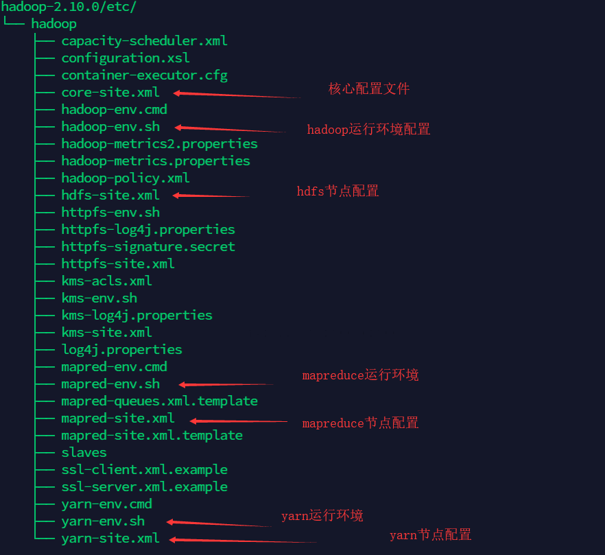

##### 1. 核心配置文件

```core-site.xml```：配置`namenode`的地址和运行时文件存储位置

```xml
<!-- 指定HDFS中NameNode的地址 -->
<property>
		<name>fs.defaultFS</name>
      <value>hdfs://hadoop152:9000</value>
</property>

<!-- 指定Hadoop运行时产生文件的存储目录 -->
<property>
		<name>hadoop.tmp.dir</name>
		<value>/opt/module/hadoop-2.10.0/data/tmp</value>
</property>
```

##### 2.hdfs配置文件

```hadoop-env.sh```：配置hdfs所需java运行环境

```shell
$ vim hadoop-env.sh
----------
export JAVA_HOME=/usr/lib/jvm/java-1.8.0-openjdk-1.8.0.242.b08-0.el7_7.x86_64
```

```hdfs-site.xml```: 配置`datanode`数量和`SecondaryNameNode`位置

```xml
<property>
		<name>dfs.replication</name>
		<value>3</value>
</property>

<!-- 指定Hadoop辅助名称节点主机配置 -->
<property>
      <name>dfs.namenode.secondary.http-address</name>
      <value>hadoop154:50090</value>
</property>
```

##### 3.yarn配置文件

`yarn-env.sh`: 配置yarn运行所依赖java运行环境

```bash
$ vi yarn-env.sh
-------------
export JAVA_HOME=/usr/lib/jvm/java-1.8.0-openjdk-1.8.0.242.b08-0.el7_7.x86_64
```

```yarn-site.xml```:配置mapreduce获取数据方式和ResourceManager地址

```xml
<!-- Reducer获取数据的方式 -->
<property>
		<name>yarn.nodemanager.aux-services</name>
		<value>mapreduce_shuffle</value>
</property>

<!-- 指定YARN的ResourceManager的地址 -->
<property>
		<name>yarn.resourcemanager.hostname</name>
		<value>hadoop153</value>
</property>
```

##### 4.MapReduce配置文件

`mapred-env.sh`:配置mapreduce运行依赖的java环境

```bash
$ vi mapred-env.sh
export JAVA_HOME=/usr/lib/jvm/java-1.8.0-openjdk-1.8.0.242.b08-0.el7_7.x86_64
```

`mapred-site.xml`:配置mapreduce运行资源需要交由yarn分配

```xml
<!-- 指定MR运行在Yarn上 -->
<property>
		<name>mapreduce.framework.name</name>
		<value>yarn</value>
</property>
```

##### 分发配置文件至集群

```bash
$ xsync /opt/module/hadoop-2.10.0/etc/
```

#### 手动启动集群

​	以上的集群配置中，我们并没有指定`datanode`和`nodemanager`的位置，我们只是设置了`NameNode`,`SecondaryNameNode`,`ResourceManager`的位置，以及集群副本的数量为3，因此我们需要手动启动`datanode`

##### 1.格式化`namenode`

如果集群是第一次启动，需要格式化`NameNode`

```bash
$ hdfs namenode -format
```

##### 2.启动`namenode`

在`hadoop152上`启动`NameNode`

```bash
$ hadoop-daemon.sh start namenode
$ jps
3461 NameNode
```

##### 3. 启动`DataNode`

在`hadoop152`、`hadoop153`以及`hadoop154`上分别启动`DataNode`

```bash
[hadoop@hadoop152 hadoop-2.10.0]$ hadoop-daemon.sh start datanode
[hadoop@hadoop152 hadoop-2.10.0]$ jps
3461 NameNode
3608 Jps
3561 DataNode
-------------------
[hadoop@hadoop153 hadoop-2.10.0]$ hadoop-daemon.sh start datanode
[hadoop@hadoop153 hadoop-2.10.0]$ jps
3190 DataNode
3279 Jps
-------------
[hadoop@hadoop154 hadoop-2.10.0]$ hadoop-daemon.sh start datanode
[hadoop@hadoop154 hadoop-2.10.0]$ jps
3237 Jps
3163 DataNode
-------------------
[hadoop@hadoop154 hadoop-2.10.0]$ hadoop-daemon.sh start secondarynamenode
```

##### 4.访问`http://hadoop152:50070`

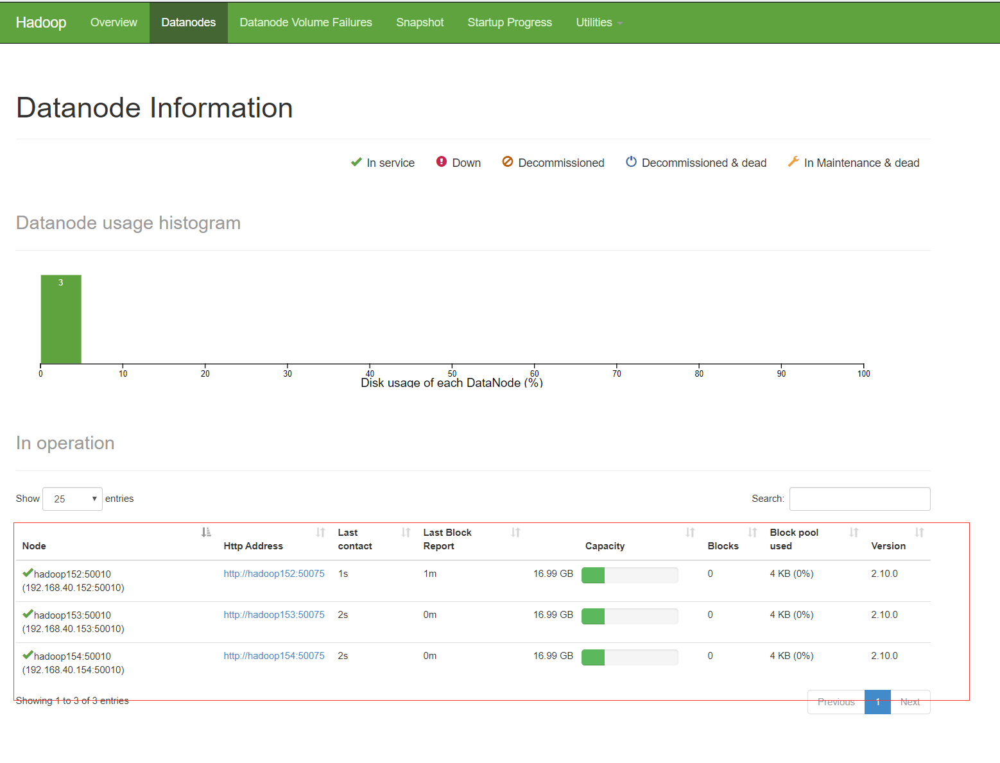

> 思考：每次都一个一个节点启动，如果节点数增加到1000个怎么办？
>
> 早上来了开始一个一个节点启动，到晚上下班刚好完成，下班？

​	

#### 使用hadoop集群脚本

​	以上手动方式启动集群的方式并不适合真实的生产环境，通过脚本自动化部署集群更符合生产要求，这一点，hadoop为我们提供了集群脚本。

##### ssh配置免密登录

​	要想使用hadoop集群脚本，name节点与节点之间进访问时，基于ssh协议是需要输入远程访问账号密码的，这在集群中显然不适合，因此我们要配置免密登录，让节点与节点可以直接进行访问。

​	ssh的免密登录实际上是利用ssl协议并且配合rsa非对称加密算法实现的，因此我们需要创建一对公钥和私钥。

> 参考：https://www.bilibili.com/video/av57769439
>
> 非对称算法基本原理解释：
>
> ```bash
> 假定我们有A和B两台服务器：
> A要通过非对称加密将数据发送给B
> A有两把钥匙：公钥Pa和私钥Sa，公钥可以解密私钥加密过的数据，同样，私钥可以解密公钥加密过的数据
> Pa(data)-> Sa(Pa(data))   Sa(data) -> Pa(Sa(data))
> 数据为data
> 
> 1.A将自己的公钥Pa传送给B    
> 2.A将data用私钥Sa加密传送给B
> 3.B将数据用A的公钥Pa对数据data进行解密
> 
> ```
>
> 非对称的好处显而易见，只有公钥不能对数据进行解密

###### ssh密码登录流程

​	假设服务器A 要远程访问服务器B

1. A 向B发送登录请求（此时没带密码，密码是要加密的）

2. B接受到请求后发送一个秘钥给A

3. A第一次拿到秘钥后，要人工确认下B的身份(让你输入yes或no)

   ```bash
   The authenticity of host 'hadoop154 (192.168.40.154)' can't be established.
   ECDSA key fingerprint is SHA256:xGZgy9HQnLbcRbqS76hZfjfQq2jumcPnjXI7CSBV+1k.
   ECDSA key fingerprint is MD5:45:fe:20:cc:4a:cf:44:29:5e:30:80:66:a2:ef:87:19.
   Are you sure you want to continue connecting (yes/no)? 
   ```

4. 输入yes后，A就会将B发送的秘钥保存在~/.ssh的known_hosts里

5. A这时候将密码用B给的秘钥加密后发送给B

我们可以访问A服务器下的~/.ssh/known_hosts文件，这里就保存了B发送回来的秘钥,例如我们访问hadoop152

```bash
$ vim ~/.ssh/known_hosts
-----------------------
hadoop154,192.168.40.154 ecdsa-sha2-nistp256 AAAAE2VjZHNhLXNoYTItbmlzdHAyNTYAAAAIbmlzdHAyNTYAAABBBAvB+B4ckb3ExOkduWIuoGB2oG9RJE4UALIjEKuAXpRZ0WQoONndcGKu0pJWou/DMvrZWwz/UiiBNamd4LwjDTI=
#这就是hadoop154发给152的公钥
```

###### ssh免密登录流程

​	还是假设服务器A 要远程访问服务器B

1. A生成自己的公钥和私钥
2. A将公钥发送给B
3. A通过私钥加密发送访问B的请求
4. B能够通过A的公钥解密
5. 建立ssh通信

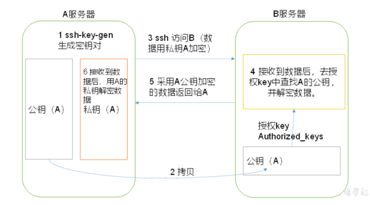

当B收到A发过来的公钥时，我们就可以在B的`~/.ssh/authrized_keys`中看到A发送的公钥

###### ssh免密登录配置完全步骤

1. 在```hadoop152```上生成公钥和私钥

   ```bash
   $ ssh-keygen -t rsa
   #连按三次回车
   ```

   此时在`~/.ssh/`目录下产生id_rsa（私钥）、id_rsa.pub（公钥）两个文件

2. 将公钥拷贝到目标机器上（**本机也要拷贝**，因为本机namenode也会通过ssh免密访问本机datanode）

   ```bash
   [hadoop@hadoop152 .ssh]$ ssh-copy-id hadoop152
   [hadoop@hadoop153 .ssh]$ ssh-copy-id hadoop153
   [hadoop@hadoop154 .ssh]$ ssh-copy-id hadoop154
   ```

   此时，在三台主机的`~/.ssh/authorized_keys`中就会保存了`hadoop152`的公钥

   ```bash
   # 152的公钥
   ssh-rsa AAAAB3NzaC1yc2EAAAADAQABAAABAQDDHUb6fPgtqqqf+cRxb2zGBZA/lXBrjiNkBoh/L/jFmdOzMl7ezFEjkULQBUDD9tZgvNEl8L3exLM0SYsrpP88G3eD0pwtsMSWIzbbg9/6CeP0p3JnWxH2jHmlsOzvc0XbP5wBVqx9/6VAap9G+cEeCs4CCNvhBEzq/YqBgFKFATggahuU7bGgCMK9ON90c2AgqyFs8ZntjGmy7cBhrFoA3+yJiMAuYlhca/WE1aVtvnKyq1gFrZdPiLlCHBCw2JECGFlaSmdjEkw3W3tuYQOuWzCMFXS8h3V4idWuik1chRGigNw1iEV0tdz/OskY/3vB8tKmTd8Iz0u2dzyX/rgf hadoop@hadoop152
   ~                                                                                                         
   ```

3. 在`hadoop152`上登录用ssh命令登录测试

   ```bash
   $ ssh hadoop@192.168.40.152
   ----------------
   Last login: Sun Feb 23 00:58:21 2020 from hadoop153
   ```

**注意**：

​	目前我们只是配置了`hadoop152`访问其他节点的免密登录，而且只能用hadoop账号来操作，我们知道`hadoop153`中有`ResourceManager`，`hadoop154`中有`SecondaryNameNode`。因此`hadoop153`和`hadoop154`同样生成秘钥，并将公钥发送给三台主机

​	此外，**如果想要实现root账号访问其他节点**，那么之前生成的公钥和私钥是无用的，因为他们存在hadoop用户目录下的`.ssh`目录下，因此，我们还要用root登录主机再次生成秘钥，并发送给其他目标主机。

##### ssh免密简化配置（只适合学习或局域网内部）

1. 在`hadoop152`节点生成公钥私钥

   ```bash
   $ ssh-keygen -t rsa
   #连按三次回车
   ```

2. 将公钥拷贝给本机

   ```bash
   [hadoop@hadoop152 .ssh]$ ssh-copy-id hadoop152
   ```

3. 同步整个`~/.ssh`文件夹至集群

   ```bash
   $ sudo xsync ~/.ssh/ 153-154
   ```

> **注意**： 这种方式显然有很大的安全风险，首先三台机器用的公钥和私钥其实是一样的，再次，拷贝ssh目录时，我们其实有可能被黑客拦截请求获取私钥

###### ~/.ssh文件夹文件解释

表2-4

| known_hosts     | 记录ssh访问过计算机的公钥(public key) |
| --------------- | ------------------------------------- |
| id_rsa          | 生成的私钥                            |
| id_rsa.pub      | 生成的公钥                            |
| authorized_keys | 存放授权过得无密登录服务器公钥        |

##### 运行群起脚本

###### 1.配置slaves从节点

​	之前手动启动集群时，我们并没有配置`DataNode`和`NodeManager`,这几个服务需要有从节点来运行，而我们的主节点也是从节点

```bash
# /opt/module/hadoop-2.10.0/etc/hadoop/slaves
[hadoop@hadoop152 hadoop]$ vim slaves
----------------------
#删除localhost，添加
hadoop152
hadoop153
hadoop154
```

> **注意**：该文件中添加的内容结尾不允许有空格，文件中不允许有空行。

同步所有节点

```bash
$ xsync slaves 153-154
```

###### 2. 启动集群

1. 如果集群是第一次启动，需要格式化`NameNode`（注意格式化之前，一定要先停止上次启动的所有`namenode`和`datanode`进程，然后再删除`data`和`log`数据）

   ```bash
   $ hdfs namenode -format
   ```

2. 启动hdfs

   在`hadoop152`下启动hdfs

   ```bash
   [hadoop@hadoop152 hadoop-2.10.0]$ sbin/start-dfs.sh
   [hadoop@hadoop152 hadoop-2.10.0]$ jps
   4166 NameNode
   4482 Jps
   4263 DataNode
   
   [hadoop@hadoop153 hadoop-2.10.0]$ jps
   3218 DataNode
   3288 Jps
   
   [hadoop@hadoop154 hadoop-2.10.0]$ jps
   3221 DataNode
   3283 SecondaryNameNode
   3364 Jps
   ```

3. 启动yarn

   **注意**：启动yarn的命令一定要在配置了`ResourceManager`的机器上执行

   ```bash
   [hadoop@hadoop153 hadoop-2.10.0]$ sbin/start-yarn.sh
   ```

4. web端查看hdfs和yarn

   分别访问 http://hadoop152:50070   ,   http://hadoop154:50090  ， http://hadoop153:8088 查看HDFS和YARN的信息

   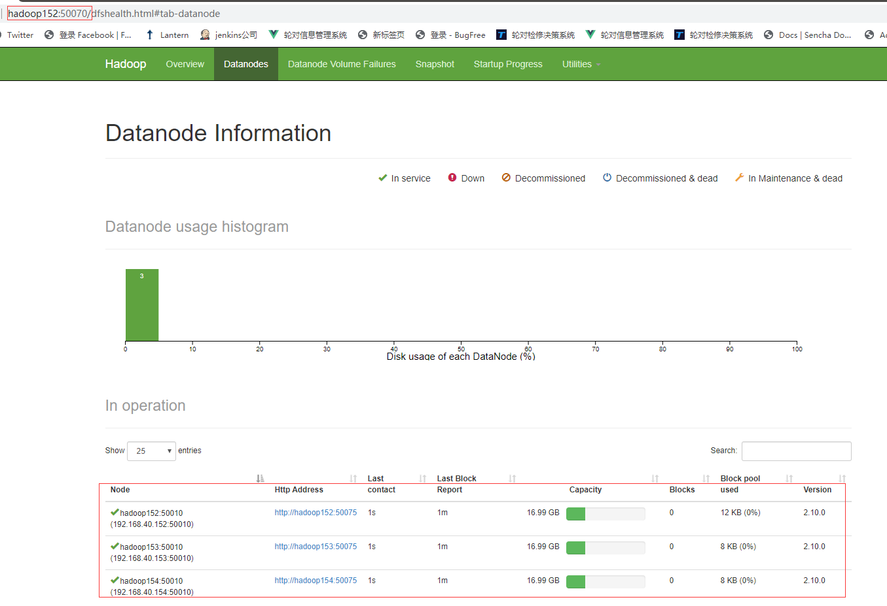

   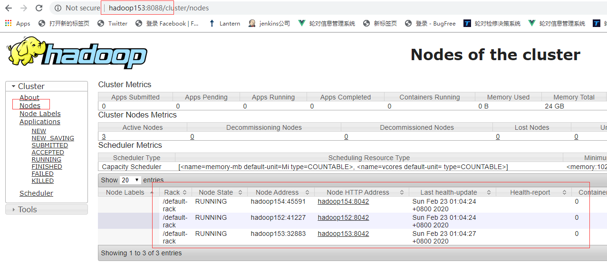

   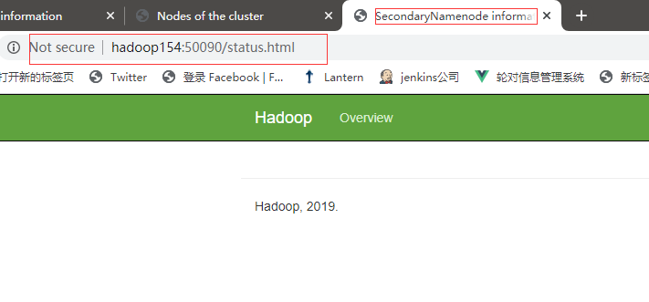


##### mapreduce测试

1. 创建wcinput 文件夹

   ```bash
   $ mkdir wcinput
   ```

2. 在文件夹中建立用于统计的源文件

   ```bash
   $ vim wc.input
   //---------
   haha hehe heyhey
   haha hoho hehe
   haha heyhey hello
   ```

3. 将文件拷贝至hdfs

   ```bash
   bin/hdfs dfs -put wcinput /wcinput
   ```

4. 调用example jar输出统计结果

   ```bash
   $ bin/hadoop jar share/hadoop/mapreduce/hadoop-mapreduce-examples-2.10.0.jar wordcount /wcinput /wcoutput
   ```

5. 检查结果

   ```bash
   $ hdfs dfs -cat /wcoutput/*
   -------------------
   haha    3
   hehe    2
   hello   1
   heyhey  2
   hoho    1
   ```

   访问yarn web服务，可以看到应用已经执行完毕

   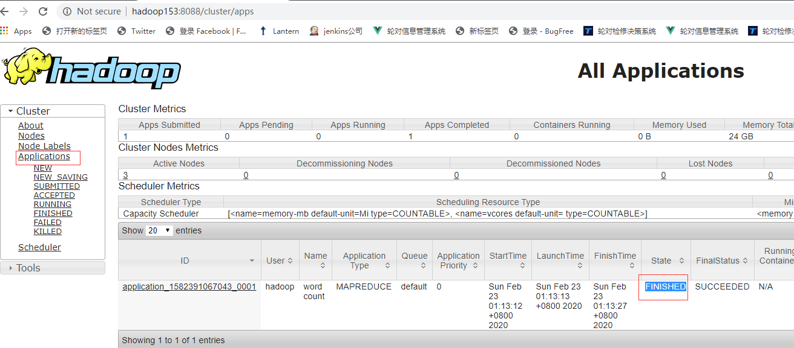

#### 配置历史服务器和日志聚集

​	在实际生产环境中，上千个节点的集群当中，如果服务出现了异常，我们要有能力快速定位错误位置，那么历史信息和日志就必须能够快速获取，所以，我们必须要给hadoop集群配置历史服务和日志聚集功能。

##### 1.配置历史服务器

1. 关闭集群节点

   ```bash
   [hadoop@hadoop152 module]$ stop-dfs.sh
   [hadoop@hadoop153 module]$ stop-yarn.sh
   ```

2. 配置`mapred-site.xml`

   ```xml
   <!-- 历史服务器端地址 -->
   <property>
   <name>mapreduce.jobhistory.address</name>
   <value>hadoop154:10020</value>
   <!--历史服务器尽量选择负载可能较小的节点部署-->
   </property>
   <!-- 历史服务器web端地址 -->
   <property>
       <name>mapreduce.jobhistory.webapp.address</name>
       <value>hadoop154:19888</value>
   </property>
   ```

3. 同步配置文件

   ```bash
   $ xsync mapred-site.xml 153-154
   ```

4. 启动历史服务器

   ```bash
   [hadoop@hadoop154 hadoop-2.10.0]$ sbin/mr-jobhistory-daemon.sh start historyserver
   ```

##### 2.配置日志聚集

​	日志聚集的作用是讲各个节点的运行日志统一上传到hdfs上，并且提供web接口，供统一查询

> **注意**：开启日志聚集功能，需要重新启动`NodeManager` 、`ResourceManager`和`HistoryManager`。

1. 关闭集群

   ```bash
   [hadoop@hadoop152 module]$ stop-dfs.sh
   [hadoop@hadoop153 module]$ stop-yarn.sh
   ```

2. 配置`yarn-site.xml`

   ```xml
   <!-- 日志聚集功能使能 -->
   <property>
   <name>yarn.log-aggregation-enable</name>
   <value>true</value>
   </property>
   
   <!-- 日志保留时间设置7天 -->
   <property>
   <name>yarn.log-aggregation.retain-seconds</name>
   <value>604800</value>
   </property>
   ```

3. 同步配置文件

   ```bash
   $ xsync yarn-site.xml 153-154
   ```

##### 3.启动集群测试

重启集群，重新执行mapreduce，打开yarn web服务，访问`applications` 页面，点击history查看历史信息

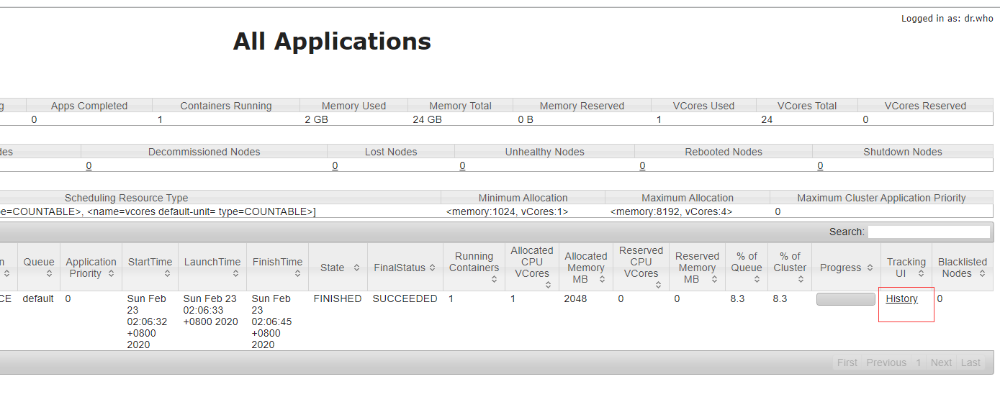

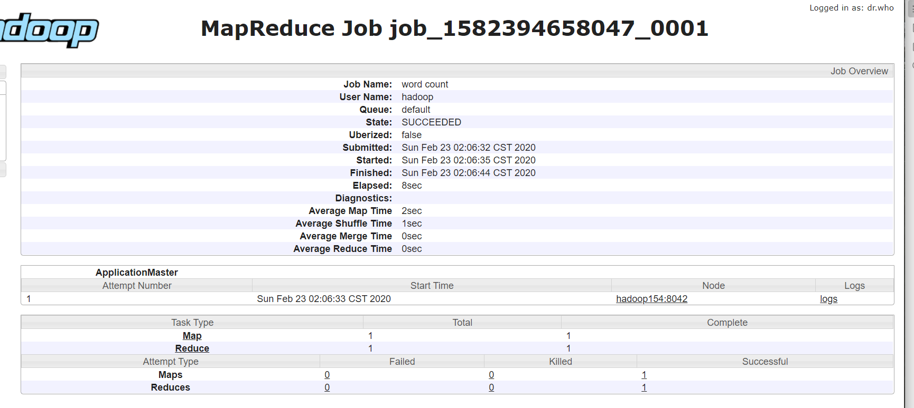

接着点击 logs查看日志

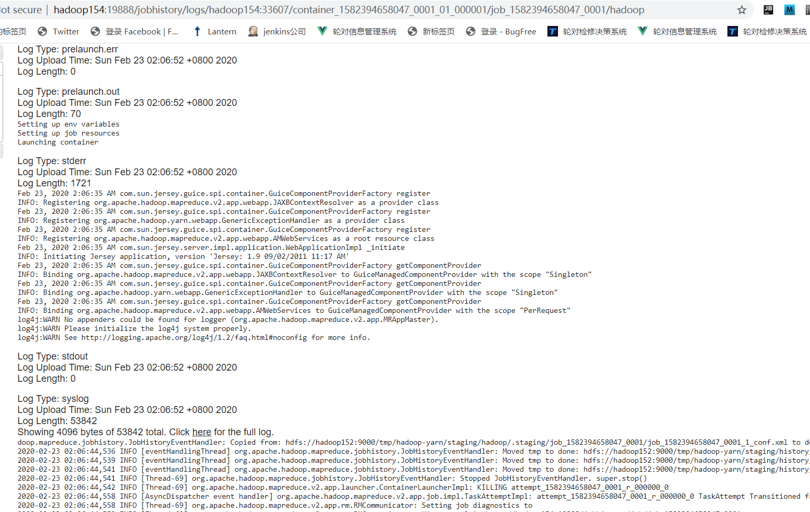

### 时间日期同步

​	在集群架构当中，保证每台节点的日期同步是基本都要做的工作，例如在Hbase集群下，时间同步的准确性是秒级的，虽然hadoop集群的时间同步要求没那个高，但是这里我们还是配置下时间同步

#### 时间同步原理

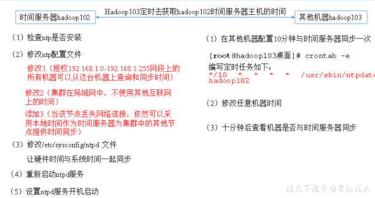

1. 将hadoop152配置为时间服务器
2. hadoop153和hadoop154定时访问hadoop152获取时间进行同步

#### 配置时间同步步骤

##### 1.时间服务器配置（必须root用户）

（1）检查ntp是否安装

```bash
[root@hadoop152 桌面]# rpm -qa|grep ntp
ntp-4.2.6p5-10.el6.centos.x86_64
fontpackages-filesystem-1.41-1.1.el6.noarch
ntpdate-4.2.6p5-10.el6.centos.x86_64
```

> centos minimal版本是没有ntp服务的，需要手动安装
>
> ```bash
> $ sudo yum install -y ntp ntpdate
> ```

查看服务状态，如果服务启动，请关闭服务

```bash
$ systemctl status ntpd
-------------
$ systemctl stop ntpd
```

（2）修改ntp配置文件

```bash
$ vi /etc/ntp.conf
```

修改内容如下

a）修改1（授权192.168.1.0-192.168.1.255网段上的所有机器可以从这台机器上查询和同步时间）

```bash
#restrict 192.168.1.0 mask 255.255.255.0 nomodify notrap为

restrict 192.168.1.0 mask 255.255.255.0 nomodify notrap
```

b）修改2（集群在局域网中，不使用其他互联网上的时间）

```bash
#注释默认的外网ntpd服务
#server 0.centos.pool.ntp.org iburst
#server 1.centos.pool.ntp.org iburst
#server 2.centos.pool.ntp.org iburst
#server 3.centos.pool.ntp.org iburst
```

c）添加3（当该节点丢失网络连接，依然可以采用本地时间作为时间服务器为集群中的其他节点提供时间同步）

```bash
server 127.127.1.0
fudge 127.127.1.0 stratum 10
```

（3）修改/etc/sysconfig/ntpd 文件

```bash
$ vim /etc/sysconfig/ntpd
```

增加内容如下（让硬件时间与系统时间一起同步）

```bash
SYNC_HWCLOCK=yes
```

（4）重新启动ntpd服务

```bash
$ systemctl status ntpd
$ systemctl start ntpd
```

（5）设置ntpd服务开机启动

```bash
$ systemctl enable ntpd
```

##### 2.其他机器配置（必须root用户）

（1）在其他机器配置10分钟与时间服务器同步一次

```bash
crontab -e
```

编写定时任务如下：

```bash
*/10 * * * * /usr/sbin/ntpdate hadoop152
```

（2）修改任意机器时间

```bash
$ date -s "2017-9-11 11:11:11"
```

（3）十分钟后查看机器是否与时间服务器同步

```bash
$ date
```

> 说明：测试的时候可以将10分钟调整为1分钟，节省时间。

