# HDFS

## 简述

​	HDFS（Hadoop Distributed File System），作为Google File System（GFS）的实现，是Hadoop项目的核心子项目，是分布式计算中数据存储管理的基础，是基于流数据模式访问和处理超大文件的需求而开发的，可以运行于廉价的商用服务器上。它所具有的高容错、高可靠性、高可扩展性、高获得性、高吞吐率等特征为海量数据提供了不怕故障的存储，为超大数据集（Large Data Set）的应用处理带来了很多便利。

## 适用性

HDFS特点：

1. **适合一次写入，多次读出的场景，且不支持文件的修改**
2. 适合用来做数据分析
3. 高容错性、可构建在廉价机器上
4. 适合批处理
5. 适合大数据处理
6. 流式文件访问

HDFS局限：

1. 不支持低延迟访问
2. 不适合小文件存储
3. 不支持并发写入
4. 不支持修改
5. 不适合用来做网盘应用

## hfds特性

### 优点

1. 高容错性

   - 数据自动保存多个副本，它通过增加副本的形式，提高容错性

     

   - 某一个副本丢失以后，可以自动回复

     

2. 适合处理大数据

   - 数据规模：能处理数据规模达到GB、TB、甚至PB级别
   - 文件规模：能够处理百万规模以上的文件数量。

3. **可构建在廉价机器上**，通过多副本机制，提高可靠性。

### 缺点

1. **不适合低延时数据访问**，比如毫秒级的存储数据，是做不到的。
2. **无法高校的对大量小文件进行存储**
   - 存储大量小文件的化，会占用NameNode大量的内存来存储文件目录和块信息，不可取。
   - 小文件存储的寻址时间会超过读写时间，它违反了HDFS的设计目标。
3. 不支持并发写入、文件随机修改。
   - 一个文件只能有一个写，不允许多个线程同时写。
   - **仅支持数据append（追加）**，不支持文件的随机修改。

## HDFS架构

>参考：
>
>https://www.jianshu.com/p/f1e785fffd4d
>
>https://blog.csdn.net/xiangxizhishi/article/details/76100513

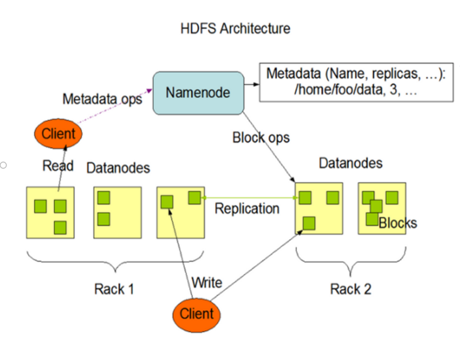

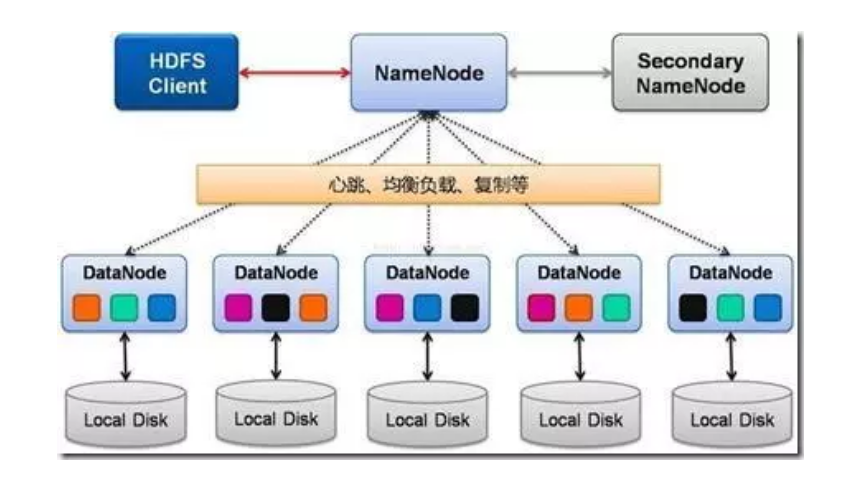

**Client：**就是客户端。

1. 提供一些命令来管理、访问 HDFS，比如启动或者关闭HDFS，对数剧的增删改查，对NameNode的格式haul等。

2. 与 DataNode 交互，读取或者写入数据；读取时，要与 NameNode 交互，获取文件的位置信息；写入 HDFS 的时候，Client 将文件切分成 一个一个的Block，然后进行存储。

**NameNode：**即Master，管理整个HDFS集群

1. 管理 HDFS 的名称空间（名称空间是指分布式文件系统中各个文件块之间的关系，文件的目录树等信息）。
2. 管理数据块（Block）映射信息

3. 配置副本策略

4. 处理客户端读写请求。

**DataNode：**就是Slave。NameNode 下达命令，DataNode 执行实际的操作。

1. 存储实际的数据块。

2. 执行数据块的读/写操作。

**SecondaryNameNode：**并非 NameNode 的热备。当NameNode 挂掉的时候，它并不能马上替换 NameNode 并提供服务。

1. 辅助 NameNode，分担其工作量。

2. 定期合并 fsimage和fsedits，并推送给NameNode。

   **注意**：hadoop2.0引入了HA机制后，解决了NameNode的单点故障问题，同时已经不用SecondaryNameNode了

   > **fsimage 和 fsedits**
   >
   > NameNode 中两个很重要的文件，
   >
   > fsimage是元数据镜像文件（**保存文件系统的目录树,文件及目录结构 组成文件的块的信息 副本数量信息**）。
   >
   > fsedits 是元数据操作日志（记录每次保存fsimage之后到下次保存之间的所有hdfs操作）。
   >
   > 内存中保存了最新的元数据信息（fsimage 和 fsedits）
   >
   > fsiedits 过大会导致NameNode重启速度慢，Secondary NameNode负责定期合并它们。
   >
   > 合并流程图：
   >
   > 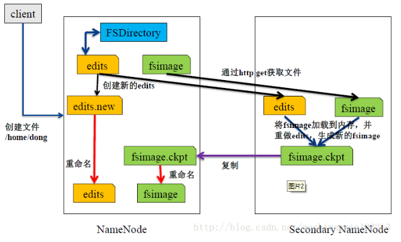

3. 在紧急情况下，可辅助恢复 NameNode。

## HDFS文件块

​	HDFS中的文件是分块存储（block），每一个datanode中以block作为数据存储的最小单元，hadoop2后默认的块大小是128M，2版本之前是64m。

>  块的大小可以通过配置参数dfs.blocksize来改变。

**为什么是128m呢**？

假设我们的文件寻址时间为10ms，那么文件的传输时间一般为寻址时间的100倍，也就是1s，而机械硬盘的传输速率大概是100Mb/s，那么正好可以在1s时间读取100m左右的数据，所以hadoop将数据块的大小设置为128M，这样可以让寻址传输时间比达到最佳。（当然、硬件技术早已经突破了10MB/s的速度）

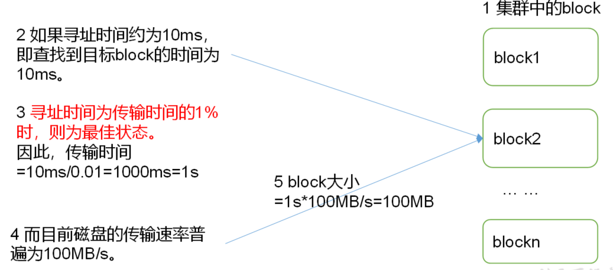

> 思考：为什么亏得大小不能设置太小，也不能设置太大？
>
> 1.HDFS的块设置太小，会增加寻址时间，程序一直在找块的位置
>
> 2.如果设置的太大，从磁盘传输数据的时间会明星大于定位这个快开始位置所需的时间，导致程序在处理快数据时，会非常慢。

**总结：**HDFS快的大小设置主要取决于磁盘的传输速率

## HDFS Shell操作（重点）

hdfs提供了本地命令客户端供操作

### 1.基本语法

```bash
$ hadoop fs [具体命令]
$ hdfs dfs [具体命令]
```

检查hadoop和hdfs的源码会发现二者其实调用的是一个java类`org.apache.hadoop.fs.FsShell`

```bash
$ vim bin/hadoop
-------------------
....
if [ "$COMMAND" = "fs" ] ; then
      CLASS=org.apache.hadoop.fs.FsShell
....
exec "$JAVA" $JAVA_HEAP_MAX $HADOOP_OPTS $CLASS "$@" #java命令执行Fsshell

$ vim bin/hdfs
----------
...
elif [ "$COMMAND" = "dfs" ] ; then
  CLASS=org.apache.hadoop.fs.FsShell
  HADOOP_OPTS="$HADOOP_OPTS $HADOOP_CLIENT_OPTS"# 同理
...
```

> 建议使用`hdfs`命令，`hadoop fs`已经被hadoop官方声明过时

### 2. 命令帮助

查看所有命令

```bash
$ hdfs dfs -help
----------
Usage: hadoop fs [generic options]
        [-appendToFile <localsrc> ... <dst>]
        [-cat [-ignoreCrc] <src> ...]
        [-checksum <src> ...]
        [-chgrp [-R] GROUP PATH...]
        [-chmod [-R] <MODE[,MODE]... | OCTALMODE> PATH...]
        [-chown [-R] [OWNER][:[GROUP]] PATH...]
        [-copyFromLocal [-f] [-p] [-l] [-d] <localsrc> ... <dst>]
        [-copyToLocal [-f] [-p] [-ignoreCrc] [-crc] <src> ... <localdst>]
        [-count [-q] [-h] [-v] [-t [<storage type>]] [-u] [-x] <path> ...]
        [-cp [-f] [-p | -p[topax]] [-d] <src> ... <dst>]
        [-createSnapshot <snapshotDir> [<snapshotName>]]
        [-deleteSnapshot <snapshotDir> <snapshotName>]
        [-df [-h] [<path> ...]]
        [-du [-s] [-h] [-x] <path> ...]
        [-expunge]
        [-find <path> ... <expression> ...]
        [-get [-f] [-p] [-ignoreCrc] [-crc] <src> ... <localdst>]
        [-getfacl [-R] <path>]
        [-getfattr [-R] {-n name | -d} [-e en] <path>]
        [-getmerge [-nl] [-skip-empty-file] <src> <localdst>]
        [-help [cmd ...]]
        [-ls [-C] [-d] [-h] [-q] [-R] [-t] [-S] [-r] [-u] [<path> ...]]
        [-mkdir [-p] <path> ...]
        [-moveFromLocal <localsrc> ... <dst>]
        [-moveToLocal <src> <localdst>]
        [-mv <src> ... <dst>]
        [-put [-f] [-p] [-l] [-d] <localsrc> ... <dst>]
        [-renameSnapshot <snapshotDir> <oldName> <newName>]
        [-rm [-f] [-r|-R] [-skipTrash] [-safely] <src> ...]
        [-rmdir [--ignore-fail-on-non-empty] <dir> ...]
        [-setfacl [-R] [{-b|-k} {-m|-x <acl_spec>} <path>]|[--set <acl_spec> <path>]]
        [-setfattr {-n name [-v value] | -x name} <path>]
        [-setrep [-R] [-w] <rep> <path> ...]
        [-stat [format] <path> ...]
        [-tail [-f] <file>]
        [-test -[defsz] <path>]
        [-text [-ignoreCrc] <src> ...]
        [-touchz <path> ...]
        [-truncate [-w] <length> <path> ...]
        [-usage [cmd ...]]
```

查看单个命令

```bash
$ hdfs dfs -help put
------------
-put [-f] [-p] [-l] [-d] <localsrc> ... <dst> :
  Copy files from the local file system into fs. Copying fails if the file already
  exists, unless the -f flag is given.
  Flags:
                                                                       
  -p  Preserves access and modification times, ownership and the mode. 
  -f  Overwrites the destination if it already exists.                 
  -l  Allow DataNode to lazily persist the file to disk. Forces        
         replication factor of 1. This flag will result in reduced
         durability. Use with care.
                                                        
  -d  Skip creation of temporary file(<dst>._COPYING_).
```

### 常用命令

hdfs的命令为了降低学习成本，其实大部分都是参照linux标准命令设计的

>分类归纳：
>
>**本地 =>hdfs**:put ,copyFromLocal, moveFromLocal,appendToFile
>
>**hdfs=>hdfs**: cp, mv,chown,chgrp,chmod, mkdir,du,df, cat
>
>**hdfs=>本地**: get, getmerge,copyToLocal

启动Hadoop集群（方便后续的测试）

（1）-help：输出这个命令参数

```bash
$ hdfs dfs -help rm
```

（2）-ls: 显示目录信息

```bash
$ hdfs dfs -ls /
```

（3）-mkdir：在HDFS上创建目录

```bash
$ hdfs dfs -mkdir -p /sanguo/shuguo
```

（4）-moveFromLocal：从本地剪切粘贴到HDFS

```bash
$ touch kongming.txt
$ hdfs dfs  -moveFromLocal  ./kongming.txt  /sanguo/shuguo
```

（5）-appendToFile：追加一个文件到已经存在的文件末尾

```bash
$ touch liubei.txt
$ vi liubei.txt
----------
san gu mao lu

$ hdfs dfs -appendToFile liubei.txt /sanguo/shuguo/kongming.txt
```

（6）-cat：显示文件内容

```bash
$ hdfs dfs -cat /sanguo/shuguo/kongming.txt
```

（7）-chgrp 、-chmod、-chown：Linux文件系统中的用法一样，修改文件所属权限

```bash
$ hdfs dfs  -chmod  666  /sanguo/shuguo/kongming.txt
$ hdfs dfs -chown  hadoop:hadoop   /sanguo/shuguo/kongming.txt
```

（8）-copyFromLocal：从本地文件系统中拷贝文件到HDFS路径去

```bash
$ hdfs dfs -copyFromLocal README.txt /
```

（9）-copyToLocal：从HDFS拷贝到本地

```bash
$ hdfs dfs -copyToLocal /sanguo/shuguo/kongming.txt ./
```

（10）-cp ：从HDFS的一个路径拷贝到HDFS的另一个路径

```bash
$ hdfs dfs -cp /sanguo/shuguo/kongming.txt /zhuge.txt
```

（11）-mv：在HDFS目录中移动文件

```bash
$ hdfs dfs -mv /zhuge.txt /sanguo/shuguo/
```

（12）-get：等同于copyToLocal，就是从HDFS下载文件到本地

```bash
$ hdfs dfs -get /sanguo/shuguo/kongming.txt ./
```

（13）-getmerge：合并下载多个文件，比如HDFS的目录 /user/hadoop/test下有多个文件:log.1, log.2,log.3,...

```bash
$ hdfs dfs -getmerge /user/hadoop/test/* ./zaiyiqi.txt
```

（14）-put：等同于copyFromLocal

```bash
$ hdfs dfs -put ./zaiyiqi.txt /user/hadoop/test/
```

（15）-tail：显示一个文件的末尾

```bash
$ hdfs dfs -tail /sanguo/shuguo/kongming.txt
```

（16）-rm：删除文件或文件夹

```bash
$ hdfs dfs -rm /user/hadoop/test/jinlian2.txt
```

（17）-rmdir：删除空目录

```bash
$ hdfs dfs -mkdir /test
$ hdfs dfs-rmdir /test
```

（18）-du统计文件夹的大小信息

```bash
$ hdfs dfs -du -s -h /user/hadoop/test
------------
2.7 K  /user/hadoop/test

$ hdfs dfs-du  -h /user/hadoop/test
--------
1.3 K  /user/hadoop/test/README.txt
15     /user/hadoop/test/jinlian.txt
1.4 K  /user/hadoop/test/zaiyiqi.txt
```

（19）-df统计hdfs的用量

```bash
$ hdfs dfs -df -h 
-------------
Filesystem               Size   Used  Available  Use%
hdfs://hadoop152:9000  51.0 G  2.9 M     38.5 G    0%
```

（20）-setrep：设置HDFS中文件的副本数量

```bash
$ hdfs dfs -setrep 10 /sanguo/shuguo/kongming.txt
```


>  注意：这里设置的副本数只是记录在NameNode的元数据中，是否真的会有这么多副本，还得看DataNode的数量。因为目前只有3台设备，最多也就3个副本，只有节点数的增加到10台时，副本数才能达到10。
>
> hadoop默认的副本数量是3个，因此假设将副本数量改到3个一下，是不会有效果的。

## HDFS 客户端操作

​	hdfs除了使用命令模式访问以外，还提供了各种各样的访问客户端，这里我们采用java应用来远程访问我们的hdfs集群。

​	由于hadoop在设计之初并没有充分考虑到异构环境下，客户端访问hadoop集群的问题，导致在windows下运行hadoop客户端不是那么愉快。如果想要在windows环境下运行java客户端，必须要手动编译hadoop windows二进制包，而hadoop编译过程中，需要涉及windows native类的编译，这就导致编译过程对于未接触过本地包编译的人来说有些许困难，好在，开源社区从来不缺乏活雷锋。

### HDFS客户端环境准备

#### 1. windows配置hadoop

1.在windows文件系统中任意位置解压hadoop的二进制包

> 注意：整个路径中不能有空格，也不要使用中文 例如 `c:/program files` 就是非法的

2.配置hadoop环境变量

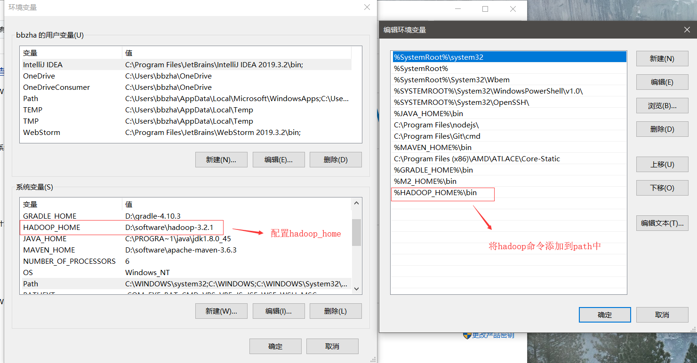

3.下载hadoop在windows上运行的必要工具winUtils

> github项目地址：https://github.com/cdarlint/winutils

请根据hadoop不同版本下载对应的**winutils**和**hadoop.dll**两个文件


4.将**winutils**和**hadoop.dll**放入bin目录

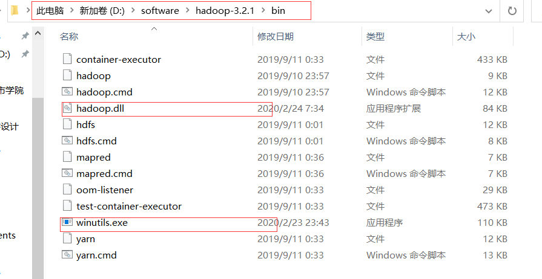

5.检查配置是否成功

```bash
PS C:\Users\bbzha> winutils
--------------
Usage: D:\software\hadoop-3.2.1\bin\winutils.exe [command] ...
Provide basic command line utilities for Hadoop on Windows.

The available commands and their usages are:

chmod          Change file mode bits.....

PS C:\Users\bbzha> hadoop version
------------------
Hadoop 3.2.1
Source code repository https://gitbox.apache.org/repos/asf/hadoop.git -r b3cbbb467e22ea829b3808f4b7b01d07e0bf3842      Compiled by rohithsharmaks on 2019-09-10T15:56Z
Compiled with protoc 2.5.0
From source with checksum 776eaf9eee9c0ffc370bcbc1888737
This command was run using /D:/software/hadoop-3.2.1/share/hadoop/common/hadoop-common-3.2.1.jar
```

#### 2. Java 开发环境配置

这里我们以Intellij为例，我们需要配置maven以及Intellij中的maven配置

##### 2.1 准备maven环境

​	maven是java编程必不可少的工具，它可以通过简单的脚本和命令帮助开发者快速构建复杂的java应用程序。帮助开发者管理依赖、测试、打包、编译，陪着持续集成工具，maven还可以帮助开发者实现项目的自动部署。

> eclipse和intellij这样的综合型ide默认都内置了maven工具，但在实际开发过程中，仍建议各位自行安装maven，并指定路径管理maven本地库

安装maven步骤：

###### 1.下载maven应用

这里我们直接下载maven二进制文件：http://mirror.bit.edu.cn/apache/maven/maven-3/3.6.3/binaries/apache-maven-3.6.3-bin.zip

###### 2.解压zip包，配置环境变量

配置MAVEN_HOME

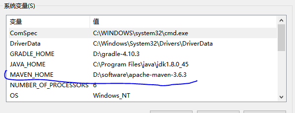

  将maven命令集添加至系统环境变量中

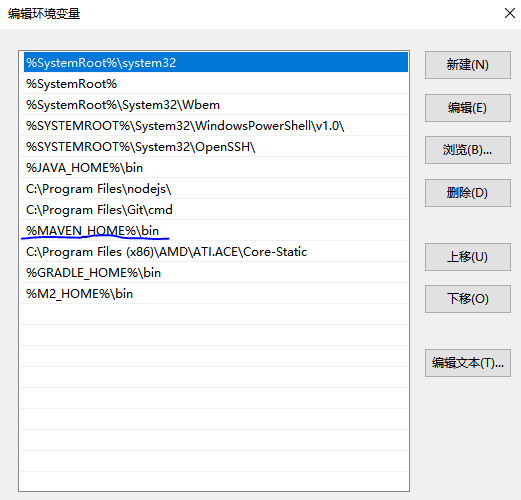

打开命令行，测试

```bash
mvn -v
------------
Maven home: D:\software\apache-maven-3.6.3\bin\..
Java version: 1.8.0_45, vendor: Oracle Corporation, runtime: C:\Program Files\java\jdk1.8.0_45\jre
Default locale: zh_CN, platform encoding: GBK
OS name: "windows 8.1", version: "6.3", arch: "amd64", family: "windows"
```

###### 3.配置maven中央仓库阿里云镜像

> maven默认的中央仓库在国内使用并不稳定，建议将中央仓库映射到阿里云镜像

修改 ```maven安装目录/conf/settings.xml```文件，在其<mirrors>标签中添加如下内容

```xml
<mirrors>
    <mirror>
        <id>alimaven</id>
        <name>aliyun maven</name>
        <url>http://maven.aliyun.com/nexus/content/groups/public/</url>
        <mirrorOf>central</mirrorOf>       
    </mirror>
</mirrors>
```

###### 4.配置maven本地仓库地址

maven会将从中央库中下载的jar包依赖默认保存在用户目录之下，也就是本地仓库，如果想修改仓库地址，在```settings.xml```中添加如下配置

```xml
<localRepository>d:\mvnRepo</localRepository>
```

##### 2.2 创建hadoopClient项目

###### 1. intellij创建maven项目

指定项目所在目录以及项目名称（这里注意项目路径不要有中文，并且最好不要在盘符下第一级子目录）


###### 2. 配置maven项目自动导入

intellij支持实时监控maven项目的规则改变，并且自动完成依赖包的导入

刚打开项目时，我们会发现intellij右下角弹出如下对话框,请选择**Enable Auto-Import**


 如果没有弹出，或者没有选择，请打开maven设置，勾选自动导入


###### 3.配置intellij maven

​	由于intellij自带maven api，因此其默认使用自带maven和默认的本地仓库地址，这里我们需要设置使用我们手动下载的maven api，并且在我们创建其他项目时，也使用次配置，因此这里我们除了配置本项目的maven外，还需要设置新项目的maven配置

**配置当前项目**


   

**全局项目配置**

​	全局项目配置与当前项目配置方式一致，只不过选项在 other settings中

##### 

###### 4 项目目录结构

​	项目创建完毕后，其目录结构如下


其中pom.xml是maven项目的核心配置文件，其中定义了这个项目的maven构建规则

### HDFS JAVA API

在hello-hadoop项目中编写如下代码，实现文件夹的创建

```bash
public class HdfsClient {

    @Test
    public void testMkdirs() throws IOException, InterruptedException, URISyntaxException {

        // 1 创建hadoop hdfs配置对象
       Configuration configuration = new Configuration();

        // 配置在集群上运行
       FileSystem fs = FileSystem.get(new URI("hdfs://hadoop152:9000"), configuration, "hadoop");

        // 2 创建目录
        fs.mkdirs(new Path("/cc"));

        // 3 关闭资源,尤其在写入时，hadoop hdfs不支持并发写入
        fs.close();
    }

```

运行结果

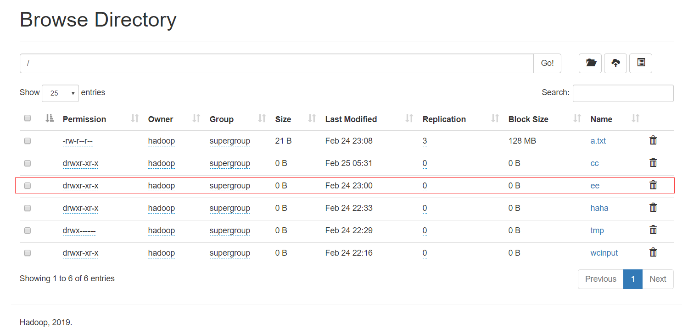

#### Api重要对象

- `FileSystem`：代表hdfs文件系统的抽象
- `Configuration`：代表hdfs的配置对象，配置优先级：`Configuration`对象>客户端代码Classpath路径下的`hdfs-site.xml`文件> 集群默认配置

#### hdfs常规操作

编写如下测试类测试

```java
package com.neuedu;

import org.apache.hadoop.conf.Configuration;
import org.apache.hadoop.fs.*;
import org.apache.hadoop.io.IOUtils;
import org.junit.After;
import org.junit.Before;
import org.junit.Test;

import java.io.FileInputStream;
import java.io.IOException;
import java.net.URI;
import java.net.URISyntaxException;

public class HdfsClient {


    private FileSystem fs;

    @Before
    public void before() throws URISyntaxException, IOException, InterruptedException {
       // Configuration configuration = new Configuration();
       // configuration.set("dfs.replication","1");
        fs = FileSystem.get(new URI("hdfs://hadoop152:9000"), new Configuration(), "hadoop");
    }

    @After
    public void after() throws IOException {
        fs.close();
    }

    @Test
    public void testMkdirs() throws IOException, InterruptedException, URISyntaxException {

        // 1 获取文件系统
//        Configuration configuration = new Configuration();

        // 配置在集群上运行
        // configuration.set("fs.defaultFS", "hdfs://hadoop152:9000");
        // FileSystem fs = FileSystem.get(configuration);

//        FileSystem fs = FileSystem.get(new URI("hdfs://hadoop152:9000"), configuration, "hadoop");

        // 2 创建目录
        fs.mkdirs(new Path("/cc"));

        // 3 关闭资源,尤其在写入时，hadoop hdfs不支持并发写入
//        fs.close();
    }

    @Test
    public void put() throws IOException {
        fs.copyFromLocalFile(new Path("f:/1.txt"), new Path("/3.txt"));
    }

    @Test
    public void get() throws IOException {
        fs.copyToLocalFile(new Path("/wcinput"), new Path("f:/"));
    }

    @Test
    public void rename() throws IOException {
        fs.rename(new Path("/wcoutput"), new Path("/haha"));
    }

    @Test
    public void delete() throws IOException {
        boolean delete = fs.delete(new Path("/1.txt"), true /*是否递归删除文件和文件夹*/);
        System.out.println(delete?"删除成功":"删除失败");
    }

    @Test
    public void append() throws IOException {
        FSDataOutputStream append = fs.append(new Path("/1.txt"), 1024);
        FileInputStream fis = new FileInputStream("f:/2.txt");
        IOUtils.copyBytes(fis,append,1024);
        append.close();
        fis.close();
    }

    /**
     * 获取文件和文件夹信息
     * @throws IOException
     */
    @Test
    public void ls() throws IOException {
        FileStatus[] statuses = fs.listStatus(new Path("/"));

        for(FileStatus status:statuses){
            if(status.isFile()){
                System.out.println("---文件信息---");
                System.out.println(status.getPath());
                System.out.println(status.getLen());
            }else{
                System.out.println("----文件夹信息--------");
                System.out.println(status.getPath());
            }
        }
    }

    /**
     * 只获取文件信息
     * @throws IOException
     */
    @Test
    public void listFiles() throws IOException {
        RemoteIterator<LocatedFileStatus> listFiles = fs.listFiles(new Path("/"), true /*递归将文件夹中的文件也取出*/);

        while(listFiles.hasNext()){
            LocatedFileStatus fileStatus = listFiles.next();
            System.out.println("---文件信息----------");
            System.out.println(fileStatus.getPath());

            //获取块信息
            BlockLocation[] blockLocations = fileStatus.getBlockLocations();
            System.out.println("-------块信息---------");
            for(BlockLocation bl:blockLocations){
                String[] hosts = bl.getHosts();
                for(String host:hosts){
                    System.out.println(host+"  ");
                }
            }
        }
    }
}

```

#### hdfs输入输出流

##### hdfs文件上传

```java
@Test
public void getFileFromHDFS() throws IOException, InterruptedException, URISyntaxException{

	// 1 获取文件系统
	Configuration configuration = new Configuration();
	FileSystem fs = FileSystem.get(new URI("hdfs://hadoop152:9000"), configuration, "hadoop");
		
	// 2 获取输入流
	FSDataInputStream fis = fs.open(new Path("/banhua.txt"));
		
	// 3 获取输出流
	FileOutputStream fos = new FileOutputStream(new File("e:/banhua.txt"));
		
	// 4 流的对拷
	IOUtils.copyBytes(fis, fos, configuration);
		
	// 5 关闭资源
	IOUtils.closeStream(fos);
	IOUtils.closeStream(fis);
	fs.close();
}
```

##### hdfs文件下载

```java
@Test
public void readFileSeek1() throws IOException, InterruptedException, URISyntaxException{

	// 1 获取文件系统
	Configuration configuration = new Configuration();
	FileSystem fs = FileSystem.get(new URI("hdfs://hadoop152:9000"), configuration, "hadoop");
		
	// 2 获取输入流
	FSDataInputStream fis = fs.open(new Path("/hadoop-3.2.1.tar.gz"));
		
	// 3 创建输出流
	FileOutputStream fos = new FileOutputStream(new File("e:/hadoop-3.2.1.tar.gz.part1"));
		
	// 4 流的拷贝
	byte[] buf = new byte[1024];
		
	for(int i =0 ; i < 1024 * 128; i++){
		fis.read(buf);
		fos.write(buf);
	}
		
	// 5关闭资源
	IOUtils.closeStream(fis);
	IOUtils.closeStream(fos);
fs.close();
}
```

## HDFS数据流

### HDFS写数据流程

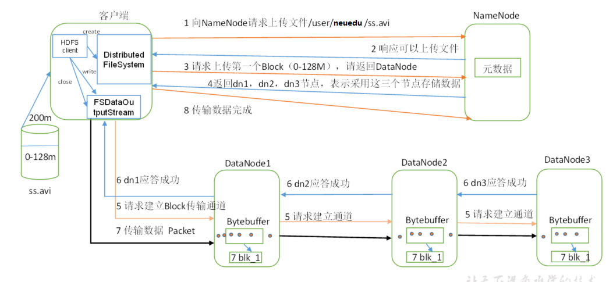

1. 客户端通过`Distributed FileSystem`模块向`NameNode`请求上传文件，`NameNode`检查目标文件是否已存在，父目录是否存在。

2. `NameNode`返回是否可以上传。

3. 客户端请求第一个 Block上传到哪几个`DataNode`服务器上。

4. `NameNode`返回3个`DataNode`节点，分别为dn1、dn2、dn3。

5. 客户端通过`FSDataOutputStream`模块请求dn1上传数据，dn1收到请求会继续调用dn2，然后dn2调用dn3，将这个通信管道建立完成。

6. dn1、dn2、dn3逐级应答客户端。

7. 客户端开始往dn1上传第一个Block（先从磁盘读取数据放到一个本地内存缓存），以Packet为单位，dn1收到一个Packet就会传给dn2，dn2传给dn3；dn1每传一个packet会放入一个应答队列等待应答。

8. 当一个Block传输完成之后，客户端再次请求`NameNode`上传第二个Block的服务器。（重复执行3-7步）。

#### 网络拓扑-节点距离计算

​	在HDFS写数据的过程中，NameNode会选择距离待上传数据最近距离的DataNode接收数据。那么这个最近距离怎么计算呢？

**节点距离：两个节点到达最近的共同祖先的距离总和。**

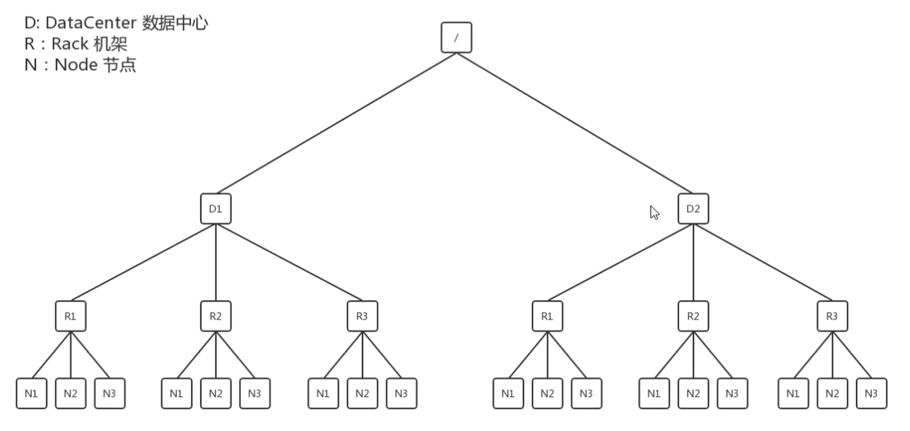

​	例如，假设有数据中心d1机架r1中的节点n1。该节点可以表示为/d1/r1/n1。利用这种标记，这里给出四种距离描述，如图所示。

##### 结论：

​	假设数据的副本数量为3，当外部客户端访问hdfs集群要求写入数据时，集群会计算拓扑距离，找到距离客户端机器最近的一个node节点作为主节点返回给客户端。

#### 机架感知（副本存储节点选择）

​	主节点选择完毕后，hadoop开始选择另外两个副本节点

1. 第一个副本节点和主节点在同一机架上，假定主节点是N1，那么第二个副本节点可能是N2或N3。
2. 第二个副本节点和位于不同的机架上，随机分配。

#### 思考

为什么hdfs要这么安排副本呢？

> 参考hadoop官方文档：<http://hadoop.apache.org/docs/r2.7.2/hadoop-project-dist/hadoop-hdfs/HdfsDesign.html#Data_Replication>
>
> ```bash
> For the common case, when the replication factor is three, HDFS’s placement policy is to put one replica on one node in the local rack, another on a different node in the local rack, and the last on a different node in a different rack. This policy cuts the inter-rack write traffic which generally improves write performance. The chance of rack failure is far less than that of node failure
> ```

理由很简单，第一第二个副本在一个机架上，可以保证数据的io效率，第三个副本在不同机架上，提高了数据的可靠性，这是一种权衡策略，但是即使如此，也不可能百分之百保证数据的可靠性。

### HDFS读数据流程

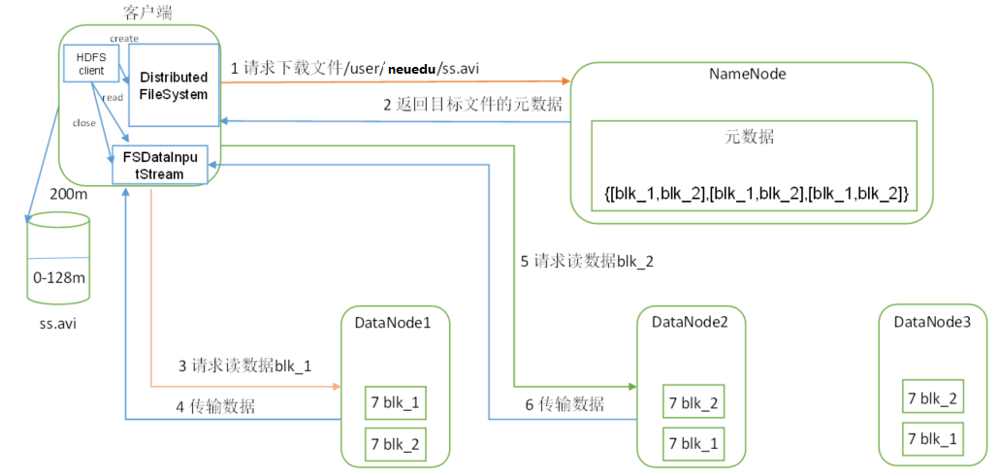

1. 客户端通过Distributed FileSystem向NameNode请求下载文件，NameNode通过查询元数据，找到文件块所在的DataNode地址。

2. 挑选一台DataNode（就近原则，然后随机）服务器，请求读取数据。

3. DataNode开始传输数据给客户端（从磁盘里面读取数据输入流，以Packet为单位来做校验）。

4. 客户端以Packet为单位接收，先在本地缓存，然后写入目标文件。
5. 重复以上步骤下载第二个block，直到全部下载完为止。

## NameNode与SecondaryNameNode

​	要解释清楚NameNode与SecondaryNameNode的关系，首先要了解NameNode要干些什么？

### NameNode的重要职责

1. NameNode启动后，会加载整个文件系统的**元数据**信息，并且保存在内存中，**元数据**就是指文件系统目录结构以及文件的块描述信息、修改时间、访问时间、权限信息等等。
2. NameNode会接受各种客户端发来的访问hdfs的请求，当请求当中有写操作请求时，显然维护在内存中的元数据需要随之更新。
3. 当客户端的写操作得到批准后，写的操作也就开始了，真正写的操作是由真实存储数据块的datanode完成的，而namenode此时需要同步更新内存中的**元数据**信息，保证**元数据**与文件系统中真实的数据的事务完整性。

> 思考：假设namenode宕机了，内存中的元数据信息没了，重新启动后，元数据信息又如何获得呢？

### Fsimage与editslog

​	要回答上面的问题，我们必须要了解Fsimage和editslog这两个文件


#### Fsimage

​	Fsimage用于保存最新的元数据镜像（checkpoint或快照）,实际上它是`NameNode`某一时刻的内存数据的一个硬盘备份快照，其中保存了这一时刻完整的文件系统的元数据信息：包含了整个HDFS文件系统的所有目录和文件的信息。

​	问题随之而来，既然是某一时刻内存的快照，那么这些数据就不是最新的，内存一旦发生变化怎么办？重新再备份生成新的Fsimage？实际情况是不允许的，我们知道，内存数据可能每秒都在更新，但不可能每时每刻都重新备份Fsimage，否则NameNode的工作负荷就太高了，备份Fsimage还要处理客户端请求，效率必然下降。那么Fsimage的更新周期间隔就不可能那么短，比如每隔十分钟镜像一次。但是，万一在这十分钟内`NameNode`宕机了怎么办？

​	Hadoop的解决方案就是editlog

#### editLog

​	回溯上面的问题，Fsimage无法同时满足数据可靠性和`NameNode`运行效率，原因是因为Fsimage镜像的创建代价太高，因此就有了editLog文件来解决这个问题。

​	editlog主要是在NameNode已经启动情况下对HDFS进行的各种更新操作进行记录，HDFS客户端执行所有的写操作都会被记录到editlog中。

​	简而言之，fsimage镜像可以降低重复创建的频率，而期间发生的所有对于文件系统的写操作都记录在了editlog中，由于是以滚动追加写入的方式进行，编辑editlog的代价显然比重新创建一个Fsimage要低得多，因此可以时时刻刻追加更新editlog。

​	当`Namenode`宕机了，这时候硬盘中存储了editlog和一个fsimage检查点，当`Namenode`恢复启动时，会首先读取editlog和fsimage，并且将二者合并读入到内存中，这样就保存了**最新的元数据**。

**思考：这样就完事大吉了吗？**

​	editlog是追加写入，那么这些记录日积月累肯定会越来越多，一旦断电，恢复元数据的时间会因为读取解析执行庞大了editlog而变得十分缓慢。因此，我们需要周期性的对Fsimage和editlog进行合并，合并之后生成新的Fsimage，再重新创建一个新的editlog文件`edit_inprogress`用于存储后续的写操作，重复以上操作保证元数据的可靠性。

​	但是，这样还不够，合并Fsimage和editlog的操作是非常耗资源的，还是会影响NameNode的工作效率。此时，SecondaryNameNode出场了。

### 2NN与NN协同机制


1. 第一阶段：NameNode启动

- 第一次启动NameNode格式化后，创建Fsimage和Edits文件。如果不是第一次启动，直接加载编辑日志和镜像文件到内存。

- 客户端对元数据进行增删改的请求。

- NameNode记录操作日志，更新滚动日志。

- NameNode在内存中对元数据进行增删改。

2. 第二阶段：Secondary NameNode工作

​	（1）Secondary NameNode询问NameNode是否需要CheckPoint。直接带回NameNode是否检查结果。

​	（2）Secondary NameNode请求执行CheckPoint。

​	（3）NameNode滚动正在写的Edits日志。

​	（4）将滚动前的编辑日志和镜像文件拷贝到Secondary NameNode。

​	（5）Secondary NameNode加载编辑日志和镜像文件到内存，并合并。

​	（6）生成新的镜像文件fsimage.chkpoint。

​	（7）拷贝fsimage.chkpoint到NameNode。

​	（8）NameNode将fsimage.chkpoint重新命名成fsimage。

> 假设HDFS是家菜鸟驿站，NameNode是驿站老板，SecondaryNameNode是员工，数据是包裹，fsimage就是包裹入库位置图，editlog是存储包裹的记录，你应该就能明白。

#### **补充：**

实际上当namenode启动的时候就会触发一次检查点操作，合并editlog和fsimage，我们可以通过访问hdfsweb服务中的`startup Porgress`来查看


### CheckPoint触发条件设置

Checkpoint的触发条件有两个：

1. 每隔一段时间
2. 当editlog日志条目数超过一定数量

这两个条件默认值的设置在`${HADOOP_HOME}/share/hadoop/hdfs/hadoop-hdfs-3.2.1.jar`中`hdfs-default.xml`中保存

```xml
<!--每隔3600秒执行重新生成一次checkpoint-->
<property>
  <name>dfs.namenode.checkpoint.period</name>
  <value>3600s</value>
  <description>
    The number of seconds between two periodic checkpoints.
    Support multiple time unit suffix(case insensitive), as described
    in dfs.heartbeat.interval.
  </description>
</property>

<!--当edit文件记录的操作次数超过100万时，无论是否已经到了一小时的间隔时间，都要进行checkpoint-->
<property>
  <name>dfs.namenode.checkpoint.txns</name>
  <value>1000000</value>
  <description>The Secondary NameNode or CheckpointNode will create a checkpoint
  of the namespace every 'dfs.namenode.checkpoint.txns' transactions, regardless
  of whether 'dfs.namenode.checkpoint.period' has expired.
  </description>
</property>

<!--2nn每隔1分钟检查Namenode的editlog的操作数，超过上面配置的100万条时，触发checkpoint-->
<property>
  <name>dfs.namenode.checkpoint.check.period</name>
  <value>60s</value>
  <description>The SecondaryNameNode and CheckpointNode will poll the NameNode
  every 'dfs.namenode.checkpoint.check.period' seconds to query the number
  of uncheckpointed transactions. Support multiple time unit suffix(case insensitive),
  as described in dfs.heartbeat.interval.
  </description>
</property>
```

要修改以上条件配置，直接在`hdfs-site.xml`中设置即可，会覆盖默认设置。

### Fsimage和edits文件解析

​	Fsimage和edit文件都保存在`/opt/module/hadoop-3.2.1/data/tmp/dfs/name/current`之下

```bash
tree
-----------------
[hadoop@hadoop152 current]$ tree .
.
├── edits_0000000000000000001-0000000000000000009
├── edits_0000000000000000010-0000000000000000168
├── edits_0000000000000000169-0000000000000000170
├── edits_0000000000000000171-0000000000000000178
├── edits_0000000000000000179-0000000000000000180
├── edits_0000000000000000181-0000000000000000182
├── edits_0000000000000000183-0000000000000000184
├── edits_0000000000000000185-0000000000000000186
├── edits_0000000000000000187-0000000000000000188
├── edits_0000000000000000189-0000000000000000208
├── edits_0000000000000000209-0000000000000000232
├── edits_0000000000000000233-0000000000000000256
├── edits_0000000000000000257-0000000000000000257
├── edits_0000000000000000258-0000000000000000259
├── edits_0000000000000000260-0000000000000000261
├── edits_inprogress_0000000000000000262
├── fsimage_0000000000000000259
├── fsimage_0000000000000000259.md5
├── fsimage_0000000000000000261
├── fsimage_0000000000000000261.md5
├── seen_txid
└── VERSION
```

#### 查看文件

hdfs提供了两个命令分别查看fsimage和edit文件

```bash
$ hdfs oiv
-------------
Usage: bin/hdfs oiv [OPTIONS] -i INPUTFILE -o OUTPUTFILE
Offline Image Viewer
View a Hadoop fsimage INPUTFILE using the specified PROCESSOR,
saving the results in OUTPUTFILE.


$ hdfs oev
------------
Usage: bin/hdfs oev [OPTIONS] -i INPUT_FILE -o OUTPUT_FILE
Offline edits viewer
Parse a Hadoop edits log file INPUT_FILE and save results
in OUTPUT_FILE.
```

这两个命令可以将指定的fsimage和edit文件转换成各种格式导出

##### 查看Fsimage

将Fsimage文件以XML格式导出

```bash
$ hdfs oiv p XML -i fsimage_0000000000000000261  -o /opt/module/hadoop-3.2.1/fsout.xml
$ cat /opt/module/hadoop-3.2.1/fsout.xml
```

```xml
<fsimage>
    <version>
        <layoutVersion>-65</layoutVersion>
        <onDiskVersion>1</onDiskVersion>
        <oivRevision>b3cbbb467e22ea829b3808f4b7b01d07e0bf3842</oivRevision>
    </version>
    <NameSection>
        <namespaceId>182854317</namespaceId>
        <genstampV1>1000</genstampV1>
        <genstampV2>1030</genstampV2>
        <genstampV1Limit>0</genstampV1Limit>
        <lastAllocatedBlockId>1073741853</lastAllocatedBlockId>
        <txid>261</txid>
    </NameSection>
    <ErasureCodingSection>
       
        <erasureCodingPolicy>
            <policyId>5</policyId>
            <policyName>RS-10-4-1024k</policyName>
            <cellSize>1048576</cellSize>
            <policyState>DISABLED</policyState>
            <ecSchema>
                <codecName>rs</codecName>
                <dataUnits>10</dataUnits>
                <parityUnits>4</parityUnits>
            </ecSchema>
        </erasureCodingPolicy>

    </ErasureCodingSection>

    <INodeSection>
        <lastInodeId>16439</lastInodeId>
        <numInodes>40</numInodes>
        <inode>
            <id>16385</id>
            <type>DIRECTORY</type>
            <name></name>
            <mtime>1582587835674</mtime>
            <permission>hadoop:supergroup:0755</permission>
            <nsquota>9223372036854775807</nsquota>
            <dsquota>-1</dsquota>
        </inode>
        <inode>
            <id>16386</id>
            <type>DIRECTORY</type>
            <name>wcinput</name>
            <mtime>1582553798982</mtime>
            <permission>hadoop:supergroup:0755</permission>
            <nsquota>-1</nsquota>
            <dsquota>-1</dsquota>
        </inode>
        ......
```

**注意：**

可以看出，Fsimage中没有记录块所对应DataNode

在集群启动后，要求DataNode上报数据块信息，并间隔一段时间后再次上报。

##### 查看edits

将edit文件以xml格式导出

```bash
$ hdfs oev -p XML -i edits_0000000000000000189-0000000000000000208 -o /opt/module/hadoop-3.2.1/edit.xml
```

```xml
<?xml version="1.0" encoding="UTF-8" standalone="yes" ?>
<EDITS>
    <EDITS_VERSION>-65</EDITS_VERSION>
    <RECORD>
        <OPCODE>OP_START_LOG_SEGMENT</OPCODE>
        <DATA>
            <TXID>189</TXID>
        </DATA>
    </RECORD>
    <RECORD>
        <OPCODE>OP_MKDIR</OPCODE>
        <DATA>
            <TXID>190</TXID>
            <LENGTH>0</LENGTH>
            <INODEID>16431</INODEID>
            <PATH>/cc</PATH>
            <TIMESTAMP>1582579905697</TIMESTAMP>
            <PERMISSION_STATUS>
                <USERNAME>hadoop</USERNAME>
                <GROUPNAME>supergroup</GROUPNAME>
                <MODE>493</MODE>
            </PERMISSION_STATUS>
        </DATA>
    </RECORD>
    <RECORD>
        <OPCODE>OP_ADD</OPCODE>
        <DATA>
            <TXID>191</TXID>
            <LENGTH>0</LENGTH>
            <INODEID>16432</INODEID>
            <PATH>/1.txt</PATH>
            <REPLICATION>3</REPLICATION>
            <MTIME>1582580731882</MTIME>
            <ATIME>1582580731882</ATIME>
            <BLOCKSIZE>134217728</BLOCKSIZE>
            <CLIENT_NAME>DFSClient_NONMAPREDUCE_-469559288_1</CLIENT_NAME>
            <CLIENT_MACHINE>192.168.40.1</CLIENT_MACHINE>
            <OVERWRITE>true</OVERWRITE>
            <PERMISSION_STATUS>
                <USERNAME>hadoop</USERNAME>
                <GROUPNAME>supergroup</GROUPNAME>
                <MODE>420</MODE>
            </PERMISSION_STATUS>
            <ERASURE_CODING_POLICY_ID>0</ERASURE_CODING_POLICY_ID>
            <RPC_CLIENTID>c197f421-f469-4c9a-b78a-76705e2effdd</RPC_CLIENTID>
            <RPC_CALLID>1</RPC_CALLID>
        </DATA>
    </RECORD>
    <RECORD>
        <OPCODE>OP_ALLOCATE_BLOCK_ID</OPCODE>
        <DATA>
            <TXID>192</TXID>
            <BLOCK_ID>1073741845</BLOCK_ID>
        </DATA>
    </RECORD>
    <RECORD>
        <OPCODE>OP_SET_GENSTAMP_V2</OPCODE>
        <DATA>
            <TXID>193</TXID>
            <GENSTAMPV2>1021</GENSTAMPV2>
        </DATA>
    </RECORD>
    ......
```

edit文件有很多，原因是合并之后，原来的edit旧版文件并不会删除。每次namenode重新启动都会重新进行一次检查点操作，合并的是最后一次生成的edit文件，运行期间的文件保存在edit_inprogress中

### NameNode故障处理

NameNode故障后，可以采用如下两种方法恢复数据。

#### 方法一

将SecondaryNameNode中数据拷贝到NameNode存储数据的目录；

1. kill -9 NameNode进程

2. 删除NameNode存储的数据（/opt/module/hadoop-3.2.1/data/tmp/dfs/name）

   ```bash
   [hadoop@hadoop152 hadoop-3.2.1]$ rm -rf /opt/module/hadoop-3.2.1/data/tmp/dfs/name/*
   ```

3. 拷贝SecondaryNameNode中数据到原NameNode存储数据目录

   ```bash
   [hadoop@hadoop152 dfs]$ scp -r hadoop@hadoop154:/opt/module/hadoop-3.2.1/data/tmp/dfs/namesecondary/* ./name/
   ```

4. 重新启动NameNode

   ```bash
   [hadoop@hadoop152 hadoop-3.2.1]$ sbin/hadoop-daemon.sh start namenode
   ```

#### 方法二

使用`-importCheckpoint`选项启动`NameNode`守护进程，从而将`SecondaryNameNode`中数据拷贝到`NameNode`目录中。

1. 修改`hdfs-site.xml`中的

   ```xml
   <property>
     <name>dfs.namenode.checkpoint.period</name>
     <value>120</value>
   </property>
   <property>
     <name>dfs.namenode.name.dir</name>
     <value>/opt/module/hadoop-3.2.1/data/tmp/dfs/name</value>
   </property>
   ```

2. kill -9 `NameNode`进程

3. 删除NameNode存储的数据（/opt/module/hadoop-3.2.1/data/tmp/dfs/name）

   ```bash
   [hadoop@hadoop152 hadoop-3.2.1]$ rm -rf /opt/module/hadoop-3.2.1/data/tmp/dfs/name/*
   ```

4. 如果SecondaryNameNode不和NameNode在一个主机节点上，需要将SecondaryNameNode存储数据的目录拷贝到NameNode存储数据的平级目录，并删除in_use.lock文件

   ```bash
   [hadoop@hadoop152 dfs]$ scp -r hadoop@hadoop154:/opt/module/hadoop-3.2.1/data/tmp/dfs/namesecondary ./
   [hadoop@hadoop152 namesecondary]$ rm -rf in_use.lock
   [hadoop@hadoop152 dfs]$ pwd
   ---------
   /opt/module/hadoop-3.2.1/data/tmp/dfs
   
   [hadoop@hadoop152 dfs]$ ls
   ---------------
   data  name  namesecondary
   ```

5. 导入检查点数据（等待一会ctrl+c结束掉）

   ```bash
   [hadoop@hadoop152 hadoop-3.2.1]$ bin/hdfs namenode -importCheckpoint
   ```

6. 启动NameNode

   ```bash
   [hadoop@hadoop152 hadoop-3.2.1]$ sbin/hadoop-daemon.sh start namenode
   ```

### 集群安全模式

​	安全模式是HDFS的一种工作状态，处于安全模式的状态下，只向客户端提供文件的**只读视图**，不接受对命名空间的修改；同时`NameNode`节点也不会进行数据块的复制或者删除，如：副本的数量小于正常水平。

 	`NameNode`启动时，首先fsimage载入内存，并执行编辑日志中的操作。一旦文件系统元数据建立成功，便会创建一个空的编辑日志。此时，`NameNode`开始监听RPC和Http请求。**但是此时NameNode处于安全模式，只接受客户端的读请求。**

 	**系统中的数据块的位置信息并不由`Namenode`维护，而是以块列表的形式存储在各个`Datanode`中**，在安全模式下，各个`DataNode`会向NameNode发送自身的数据块列表，当`NameNode`有足够的数据块信息后，便在30秒后退出安全模式，若`NameNode`发现数据节点过少会启动数据块复制过程(基本不会)

 	当hadoop的NameNode节点启动时，会进入安全模式阶段。在此阶段，DataNode会向NameNode上传他们数据块的列表，让NameNode得到数据块的位置信息，并对每个文件对应的数据块副本进行统计。**当最小副本条件满足时，即：一定比例的数据块都到达最小副本数，系统会退出安全模式**。而这需要一定的延迟时间。当最小的副本条件未达到要求时，就会对副本数不足的数据块安排DataNode进行复制，直到达到最小的副本数。而在安全模式下，系统会处于只读装态，NameNode不会处理任何数据块的复制和删除命令。

​	 **在启动一个刚刚格式化的HDFS时系统不会进入安全模式，因为没有数据块。**

#### 手动进入安全模式

##### 基本语法

集群处于安全模式，不能执行重要操作（写操作）。集群启动完成后，自动退出安全模式。

```bash
$ bin/hdfs dfsadmin -safemode get		（功能描述：查看安全模式状态）
$ bin/hdfs dfsadmin -safemode enter  	（功能描述：进入安全模式状态）
$ bin/hdfs dfsadmin -safemode leave	（功能描述：离开安全模式状态）
$ bin/hdfs dfsadmin -safemode wait	（功能描述：等待安全模式状态,此时提交写数据不会被拒绝，而是排队）
```

##### 案例

模拟等待安全模式

1. 查看当前模式

```bash
$ hdfs dfsadmin -safemode get
----------------
Safe mode is OFF
```

2. 先进入安全模式

```bash
$ bin/hdfs dfsadmin -safemode enter
```

3. 创建并执行下面的脚本

```bash
#在/opt/module/hadoop-3.2.1路径上，编辑一个脚本safemode.sh
$ touch safemode.sh
$ vim safemode.sh
-------------
#!/bin/bash
hdfs dfsadmin -safemode wait
hdfs dfs -put /opt/module/hadoop-3.2.1/README.txt /

$ chmod 777 safemode.sh
$ ./safemode.sh 
```

4. 再打开一个窗口，执行

```bash
$ bin/hdfs dfsadmin -safemode leave
```

5. 观察

（a）再观察上一个窗口

```bash
Safe mode is OFF
```

（b）HDFS集群上已经有上传的数据了。

## DataNode（重点）


`datanode`工作过程如下：

1）一个数据块在DataNode上以文件形式存储在磁盘上，包括两个文件，一个是数据本身，一个是元数据包括数据块的长度，块数据的校验和，以及时间戳。

> 数据块实际保存路径：`data/tmp/dfs/data/current/BP-294644958-192.168.40.152-1582551342202/current/finalized/subdir0/subdir0/`

2）DataNode启动后向NameNode注册，通过后，周期性（1小时）的向NameNode上报所有的块信息。

3）心跳是每3秒一次，心跳返回结果带有NameNode给该DataNode的命令如复制块数据到另一台机器，或删除某个数据块。如果超过10分钟没有收到某个DataNode的心跳，则认为该节点不可用。（试着死一个datanode）

> 可以在web服务上查看datanode的心跳信息
>
> 

4）集群运行中可以安全加入和退出一些机器。

### 数据完整性

思考：如果电脑磁盘里面存储的数据是控制高铁信号灯的红灯信号（1）和绿灯信号（0），但是存储该数据的磁盘坏了，一直显示是绿灯，是否很危险？同理DataNode节点上的数据损坏了，却没有发现，是否也很危险，那么如何解决呢？

如下是DataNode节点保证数据完整性的方法。

1）当DataNode读取Block的时候，它会计算CheckSum。

2）如果计算后的CheckSum，与Block创建时值不一样，说明Block已经损坏。

3）Client读取其他DataNode上的Block。

4）DataNode在其文件创建后周期验证CheckSum，如图。


### 掉线超时参数设置


>  需要注意的是hdfs-site.xml 配置文件中的heartbeat.recheck.interval的单位为毫秒，dfs.heartbeat.interval的单位为秒。
>
> ```xml
> <property>
>    <name>dfs.namenode.heartbeat.recheck-interval</name>
>    <value>300000</value>
> </property>
> <property>
>    <name>dfs.heartbeat.interval</name>
>     <value>3</value>
> </property>
> ```

### 节点的服役与退役

#### 新节点服役

​	在实际生产环境中，分布式应用必须要具有可伸缩性（scalable），hadoop也一样，当datanode不够用时，自动化快速扩展集群是必要的功能。

##### 1.环境准备

1. 克隆一台新虚拟机hadoop155

2. 修改ip地址和主机名称

3. **删除原来hdfs问价你系统留存的文件（/opt/module/hadoop-3.2.1/data和log）**

4. 刷新配置文件

   ```bash
   $ source /etc/profile
   ```

##### 2.服役新节点

1. 在新机器上直接启动`Datanode`

   ```bash
   $ hdfs --daemon start datanode
   #hadoop2.x命令已过时
   $ hadoop-daemon.sh start datanode
   ```

2. 在hadoop155上上传文件

   ```bash
   $ hadoop fs -put /opt/module/hadoop-3.2.1/LICENSE.txt /
   ```

3. 如果数据不均衡，用命令再平衡

   ```bash
   $ start-balancer.sh
   ```

#### 退役旧节点

​	当集群负载下降时，多余的计算资源是一种浪费，集群的可伸缩性不仅仅是针对扩展，还要能够快速退役节点，但是退役节点，上面的数据怎么办，hadoop提供了比较方便的节点退役方式，并且能够将退役节点中的数据转移到服役节点中去。

##### 1.黑名单方式

​	hadoop维护一个黑名单文件，文件中排除的节点将在刷新完成后，被踢出集群，上面的数据会转移到其他节点进行维护。

1. 在**NameNode**的`/opt/module/hadoop-3.2.1/etc/hadoop`目录下创建blacklist文件

   ```bash
   $ vim blacklist
   -----------
   hadoop152  #要加入黑名单的节点
   ```

2. 在**NameNode**的`hdfs-site.xml`中`dfs.hosts.exclude`属性

   ```xml
   <property>
   <name>dfs.hosts.exclude</name>
         <value>/opt/module/hadoop-3.2.1/etc/hadoop/blacklist</value>
   </property>
   
   
   ```

3. 刷新**Namenode**

   ```bash
   $ hdfs dfsadmin -refreshNodes
   ```

4. 检查web服务，退役节点的状态为decommission in progress（退役中），说明数据节点正在复制块到其他节点

5. 等待退役节点状态为decommissioned（所有块已经复制完成），停止该节点及节点资源管理器。**注意：如果副本数是3，服役的节点小于等于3，是不能退役成功的，需要修改副本数后才能退役**

6. 在hadoop152上执行停止datanode的命令

   ```bash
   $ hadoop-daemon.sh stop datanode
   ```

7. 此时，如果因退役节点，导致数据不均衡，可运行命令再平衡

   ```bash
   $ start-balancer.sh
   ```

##### 2.白名单方式

​	严格来说，白名单功能并不是用于退役节点的，而是用来保证集群安全性的，只有在白名单中的节点才能被加入到集群中

> **注意**：白名单和黑名单无法同时共存

1. 在**NameNode**的`/opt/module/hadoop-3.2.1/etc/hadoop`目录下创建`whitelist`文件

   ```bash
   $ vim whitelist
   ---------------
   hadoop152
   hadoop153
   hadoop154
   ```

2. 在**NameNode**`的`hdfs-site.xml`配置文件中增加`dfs.hosts`属性

   ```xml
   <property>
   	<name>dfs.hosts</name>
   	<value>/opt/module/hadoop-3.2.1/etc/hadoop/whitelist</value>
   </property>
   ```

3. 刷新**NameNode**

   ```bash
   $ hdfs dfsadmin -refreshNodes
   ```

4. 在web上查看

5. 如果数据不均衡，执行在平衡命令

   ```bash
   $ start-balancer.sh
   ```

### DateNode多目录配置

1.DataNode也可以配置成多个目录，每个目录存储的数据不一样。即：数据不是副本

2.具体配置如下

```bash
$ vim hdfs-site.xml
```

```xml
<property>
     <name>dfs.datanode.data.dir</name>
<value>file:///${hadoop.tmp.dir}/dfs/data,file:///${hadoop.tmp.dir}/dfs/data2</value>
</property>
<!--${hadoop.tmp.dir}就是core-site中配置的data路径-->
```

3.重启集群

> 多目录配置的目的是为了扩展节点硬盘空间，我们知道linux可以将一整块硬盘挂载到一个目录，这个功能就是为了扩展磁盘存储空间而设置的

## HDFS 2.X新特性(了解)

> 以下两个特性了解即可，hadoop2版本之后最大的改变在yarn

### 集群间数据拷贝

1．scp实现两个远程主机之间的文件复制

```bash
$ scp -r hello.txt [root@hadoop103:/user/hadoop/hello.txt](mailto:root@hadoop103:/user/hadoop/hello.txt)		// 推 push

$ scp -r [root@hadoop103:/user/hadoop/hello.txt  hello.txt](mailto:root@hadoop103:/user/hadoop/hello.txt%20%20hello.txt)		// 拉 pull

$ scp -r [root@hadoop103:/user/hadoop/hello.txt](mailto:root@hadoop103:/user/hadoop/hello.txt) root@hadoop104:/user/hadoop   //是通过本地主机中转
```

实现两个远程主机的文件复制；如果在两个远程主机之间ssh没有配置的情况下可以使用该方式。

2．采用distcp命令实现两个Hadoop集群之间的递归数据复制

```bash
$  bin/hadoop distcp
------------------
hdfs://haoop102:9000/user/hadoop/hello.txt hdfs://hadoop103:9000/user/hadoop/hello.txt
```

### 小文件存档

​	Hadoop不适用于处理大量小文件，这就和我们在windows上拷贝一个含有大量小文件的文件夹很慢是一个道理，windows当中我们可以打包来解决这个问题，hadoop也一样，hadoop支持将大量小文件打包成`har`格式的压缩包，并且可以支持直接访问har包下的文件

#### 案例

（1）需要启动YARN进程

```bash
$ start-yarn.sh
```

（2）归档文件

​	把/user/hadoop/input目录里面的所有文件归档成一个叫input.har的归档文件，并把归档后文件存储到/user/hadoop/output路径下。

```bash
#在hdfs中添加一个文件夹，录入十个小文件进去
$ hdfs dfs -mkdir /dir1
$ for((i=0;i<10;i++))do hdfs dfs -put README.txt /dir1/$i.txt; done

$ bin/hadoop archive -archiveName input.har –p  /dir1/   /
```

（3）查看归档

```bash
$ hadoop fs -lsr /user/hadoop/output/input.har
$ hadoop fs -lsr har:///user/hadoop/output/input.har
```

（4）解归档文件

```bash
$ hadoop fs -cp har:/// user/hadoop/output/input.har/*    /user/hadoop
```

