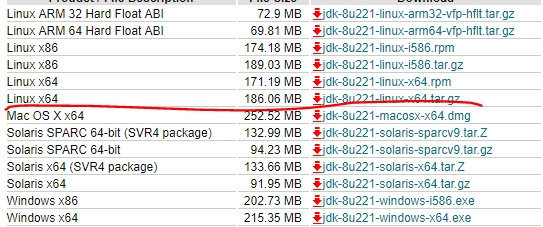

# 虚拟机配置

#### centos虚拟机硬件环境

> 硬盘50g，内存4g，cpu 2*2

#### 虚拟机准备

1. 防火墙关闭

   ```bash
   service iptables stop // 服务器关闭
   chkconfig iptables off //关闭开机自启动
   ```

2. 创建用户

   ```bash
   useradd hadoop
   passwd hadoop
   ```

3. 在  /opt目录创建software module文件夹

   ```bash
   mkdir /opt/software /opt/module
   chown hadoop:hadoop  /opt/software /opt/module //设置权限
   ```

4. 把这个用户添加到sudoers中

   ```bash
   vim /etc/sudoers
   hadoop ALL=(ALL)        NOPASSWD: ALL
   ```

5. 改hosts文件

   ```bash
   vim /etc/hosts
   //在文件后追加几个虚拟机地址
   192.168.134.100 hadoop100
   192.168.134.101 hadoop101
   192.168.134.102 hadoop102
   192.168.134.103 hadoop103
   192.168.134.104 hadoop104
   192.168.134.105 hadoop105
   192.168.134.106 hadoop106
   192.168.134.107 hadoop107
   192.168.134.108 hadoop108
   192.168.134.109 hadoop109
   ```

   > 也可以用shell脚本来做
   >
   > ```bash
   > vim test.sh
   > //以下为脚本内容
   > #!/bin/bash
   > for ((i=100;i<110;i++))
   > 	echo "192.168.134.$i hadoop$i" >> /etc/hosts
   > done
   > //-------
   > bash test.sh //运行脚本
   > ```

6. 设置ssh服务启动和自启动

   ```bash
   service sshd restart //启动
   chkconfig sshd on // 设置开机自启动
   ```

7. 改静态ip（下面几部每克隆一台就要做一遍）

   ```bash
   vim /etc/sysconfig/network-scripts/ifcfg-eth0
   //-----------
   DEVICE=eth0
   TYPE=Ethernet
   ONBOOT=yes
   BOOTPROTO=static
   IPADDR=192.168.134.100
   PREFIX=24
   GATEWAY=192.168.134.2
   DNS1=192.168.134.2
   NAME=eth0
   ```

8. 改主机名

   ```bash
   vim /etc/sysconfig/network
   HOSTNAME=hadoop100
   
   
   ```

   拍快照

9. 改网卡脚本文件（克隆的虚拟机需要此步骤）

   ```bash
   vim /etc/udev/rules.d/70-persistent-net.rules
   //第一行删掉
   
   //第二行末尾 
   NAME="eth0"
   ```

#### 安装jdk和hadoop

##### 安装jdk

###### 安装openjdk

```bash
yum install java-1.8.0-openjdk* -y //安装所有openjdk的包
```

###### 安装oracle jdk

1. 下载oracle jdk linux



2. 通过ssh拷贝至 /opt/software

```bash
scp [文件路径]  [用户名]@[ipaddr]:[文件拷贝位置]
//例如
scp d:/jdk-8u201.tar.gz root@192.168.134.101:/opt/software
```

3. 解压

```bash
tar -zxvf jdk-8u201-linux-x64.tar.gz -C /opt/module
```

###### 配置环境变量

```bash
vim /etc/profile
export JAVA_HOME=/opt/module/jdk1.8.0_144
export PATH=$PATH:$JAVA_HOME/bin
//------------
source /etc/profile 
```

##### 安装hadoop

1. 下载hadoop，拷贝至linux

2. 解压

   ```bashj
   tar -zxvf hadoop.tar.gz -C /opt/module
   ```

3. 配置环境变量

   ```bash
   export HADOOP_HOME=/opt/module/hadoop-2.9.2
   export PATH=$PATH:$HADOOP_HOME/bin:$HADOOP_HOME/sbin
   //------------
   source /etc/profile 
   hadoop version
   ```

