# MapReduce

## MapReduce概述

### MapReduce定义

​	MapReduce是一个**分布式运算程序的编程框架**，是用户开发“基于hadoop数据分析应用”的核心框架。

​	MapReduce核心功能就是将**用户编写的业务逻辑代码**和自带默认组件整合成完整的**分布式运算程序**，并发运行在hadoop集群上。

### 优缺点

#### 优点

##### 易于编程

​	**通过简单的接口实现，就可以完成一个分布式计算程序**，程序开发者可以和写普通串行程序一样的方式，完成一个分布式计算应用的编写（实际上不是你独立完成的，框架帮你完成的）

##### 良好的扩展性

​	当你的计算的计算资源不能得到满足的时候，你可以通过**简单的增加机器**来扩展计算能力

##### 高容错性

​	MapReduce设计的初衷就是使程序能够部署在廉价机器上，这就要求它具有很高的容错性。比如**其中一台机器挂了，它可以把上面的计算任务转移到另外一台机器上运行，补助与整个任务运行失败**，而且这个过程是自动化完成，不需要人为干预，

> 假设在不使用分布式方案来运行一个单节点计算的宕机概率是1/10，由10台计算机组成的mapreduce分布式程序中每一台计算机的宕机概率也是1/10，那么整个集群至少有一台宕机的概率就是1-0.9^10=0.65，所以分布式场景下，集群出现问题的几率是要比单体应该高的，如何提高容错性是分布式系统必须要面对的问题。

##### 处理海量数据

​	可以实现上千台服务器集群并发工作，提供PB级海量数据处理能力

#### 缺点

​	总结一个字：慢

##### 不擅长实时计算

​	MapReduce无法像Mysql一样，在毫秒级或者秒级内返回结果

##### 不擅长流式计算

​	所谓流式计算，是指数据持续更新，并没有一个明显的文件结尾界限，所以流式计算框架往往不让数据持久化，数据是**动态**的，而mapreduce的输入数据是**静态的**，另外，由于mapreduce自身的的数据口径太小，无法快速处理数据。

> 静态数据并不是不能进行实时，计算，spark就能。

##### 不擅长DAG（有向图计算）

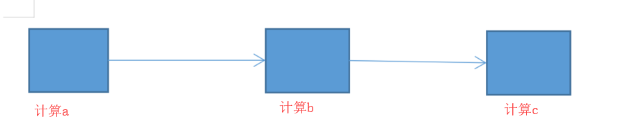

>  **有向图计算**：多个计算之间存在关联关系，计算C依赖计算B的输出，计算B依赖计算A的输出，

​	多个应用存在依赖关系，后一个应用程序的输入为前一个的输出，在这种情况下，MapReduce并不是不能做，但是使用mapreduce做，**每一个mapreduce作业的输出结果都会写入磁盘，会造成大量的IO操作，导致性能低下**。

### MapReduce核心思想

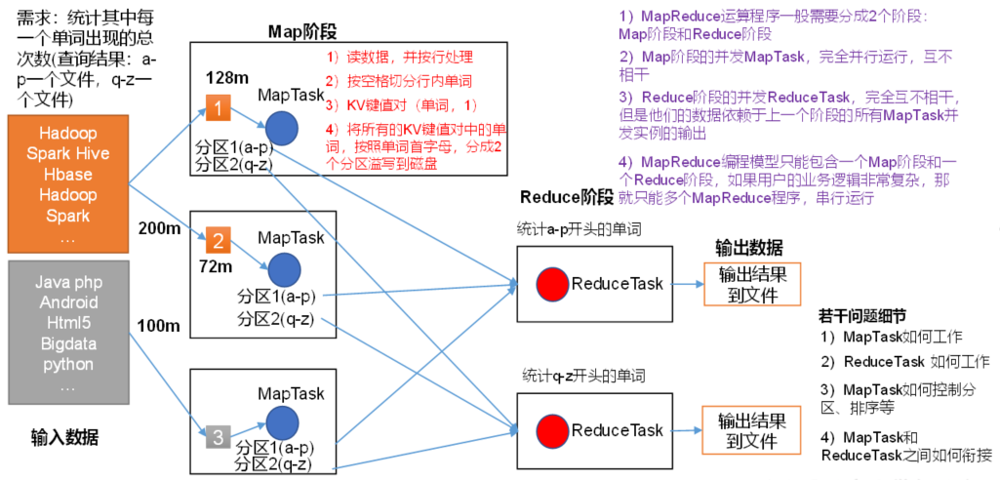

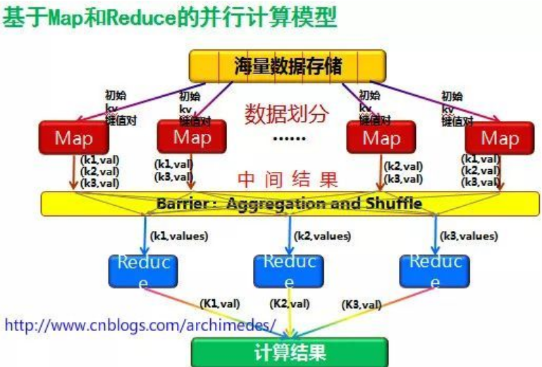

1）分布式的运算程序往往需要分成至少2个阶段。

2）第一个阶段的MapTask并发实例，完全并行运行，互不相干。

3）第二个阶段的ReduceTask并发实例互不相干，但是他们的数据依赖于上一个阶段的所有MapTask并发实例的输出。

4）MapReduce编程模型只能包含一个Map阶段和一个Reduce阶段，如果用户的业务逻辑非常复杂，那就只能多个MapReduce程序，串行运行。

总结：分析WordCount数据流走向深入理解MapReduce核心思想。

> 参考：https://www.jianshu.com/p/ca165beb305b
>
> https://blog.csdn.net/lgnlgn/article/details/90076430
>
> 黑桃示例：https://cloud.tencent.com/developer/news/52756

### MapReduce

​	一个完整的MapReduce程序在分布式运行时有三类进程实例：

1. **MrAppMaster**:负责真个程序的过程调度及协调状态。
2. **MapTask**：负责Map阶段的整个数据处理流程。
3. **ReduceTask**：负责Reduce阶段的整个数据处理流程。

### 官方WordCount源码

​	采用反编译工具反编译源码，发现WordCount案例有Map类、Reduce类和驱动类。且数据的类型是Hadoop自身封装的序列化类型。

### 常用数据序列化类型

| **Java类型** | **Hadoop Writable类型** |
| ------------ | ----------------------- |
| Boolean      | BooleanWritable         |
| Byte         | ByteWritable            |
| Int          | IntWritable             |
| Float        | FloatWritable           |
| Long         | LongWritable            |
| Double       | DoubleWritable          |
| String       | Text                    |
| Map          | MapWritable             |
| Array        | ArrayWritable           |

### MapReduce编程规范

​	用户编写的程序分成三个部分：Mapper、Reducer和Driver。

#### 1. Mapper定义

1. 定义自定义Mapper继承自父类
2. 定义mapper的输入数据类型和输出数据类型（key和value的类型）
3. 覆盖map()方法，实现具体map业务逻辑。
4. 返回输出数据（同样以kv的方式）

#### 2. Reducer定义

1. 定义自定义Reducer继承父类
2. 定义Reducer的输入数据类型（承接mapper的输出数据类型）
3. 定义Reducer的输出数据类型
4. 覆盖reduce()方法，实现聚义reduce业务逻辑
5. 返回输出结果。（kv方式）

#### 3. 定义Driver

​	Driver的是yarn进行通讯的客户端，mapreduce程序要能正常运行，需要通过向yarn申请计算资源进行，所以你要告诉yarn这个程序如何执行（配置job对象，设置mapper和reducer类型，设置mapper和reducer输出类型）。

### WordCount实现

**需求**：在给定的文本文件中统计输出每一个单词出现的总次数

1.输入数据a.txt

```bash
neuedu neuedu
ss ss
cls cls
jiao
banzhang
xue
hadoop
```

2.输出格式

```bash
neuedu 2
banzhang 1
cls 2
hadoop 1
jiao 1
ss 2
xue 1
```

#### 1.环境准备（同java连接hdfs）

1.创建maven工程

2.在`pom.xml`中添加依赖

```xml
 <properties>
        <hadoop.version>2.7.7</hadoop.version>
    </properties>

    <dependencies>
        <dependency>
            <groupId>junit</groupId>
            <artifactId>junit</artifactId>
            <version>RELEASE</version>
        </dependency>
        <dependency>
            <groupId>org.apache.logging.log4j</groupId>
            <artifactId>log4j-core</artifactId>
            <version>2.10.0</version>
        </dependency>
        <dependency>
            <groupId>org.apache.hadoop</groupId>
            <artifactId>hadoop-common</artifactId>
            <version>${hadoop.version}</version>
        </dependency>
        <dependency>
            <groupId>org.apache.hadoop</groupId>
            <artifactId>hadoop-client</artifactId>
            <version>${hadoop.version}</version>
        </dependency>
        <dependency>
            <groupId>org.apache.hadoop</groupId>
            <artifactId>hadoop-hdfs</artifactId>
            <version>${hadoop.version}</version>
        </dependency>
    </dependencies>
```

3.创建`log4j.propeties`

```properties
log4j.rootLogger=INFO, stdout
log4j.appender.stdout=org.apache.log4j.ConsoleAppender
log4j.appender.stdout.layout=org.apache.log4j.PatternLayout
log4j.appender.stdout.layout.ConversionPattern=%d %p [%c] - %m%n
log4j.appender.logfile=org.apache.log4j.FileAppender
log4j.appender.logfile.File=target/spring.log
log4j.appender.logfile.layout=org.apache.log4j.PatternLayout
log4j.appender.logfile.layout.ConversionPattern=%d %p [%c] - %m%n
```

#### 2.编码阶段

1.编写`Mapper`类

```java
package com.neuedu;
import java.io.IOException;
import org.apache.hadoop.io.IntWritable;
import org.apache.hadoop.io.LongWritable;
import org.apache.hadoop.io.Text;
import org.apache.hadoop.mapreduce.Mapper;

public class WordcountMapper extends Mapper<LongWritable, Text, Text, IntWritable>{
	
	Text k = new Text();
	IntWritable v = new IntWritable(1);
	
	@Override
	protected void map(LongWritable key, Text value, Context context)	throws IOException, InterruptedException {
		
		// 1 获取一行
		String line = value.toString();
		
		// 2 切割
		String[] words = line.split(" ");
		
		// 3 输出
		for (String word : words) {
			
			k.set(word);
			context.write(k, v);
		}
	}
}
```

2.编写`Reducer`类

```java
package com.neuedu;
import java.io.IOException;
import org.apache.hadoop.io.IntWritable;
import org.apache.hadoop.io.Text;
import org.apache.hadoop.mapreduce.Reducer;

public class WordcountReducer extends Reducer<Text, IntWritable, Text, IntWritable>{

int sum;
IntWritable v = new IntWritable();

	@Override
	protected void reduce(Text key, Iterable<IntWritable> values,Context context) throws IOException, InterruptedException {
		
		// 1 累加求和
		sum = 0;
		for (IntWritable count : values) {
			sum += count.get();
		}
		
		// 2 输出
       v.set(sum);
		context.write(key,v);
	}
}
```

3.编写`Driver`驱动类

```java
package com.neuedu;
import java.io.IOException;
import org.apache.hadoop.conf.Configuration;
import org.apache.hadoop.fs.Path;
import org.apache.hadoop.io.IntWritable;
import org.apache.hadoop.io.Text;
import org.apache.hadoop.mapreduce.Job;
import org.apache.hadoop.mapreduce.lib.input.FileInputFormat;
import org.apache.hadoop.mapreduce.lib.output.FileOutputFormat;

public class WordcountDriver {

	public static void main(String[] args) throws IOException, ClassNotFoundException, InterruptedException {

		// 1 获取配置信息以及封装任务
		Configuration configuration = new Configuration();
		Job job = Job.getInstance(configuration);

		// 2 设置jar加载路径
		job.setJarByClass(WordcountDriver.class);

		// 3 设置map和reduce类
		job.setMapperClass(WordcountMapper.class);
		job.setReducerClass(WordcountReducer.class);

		// 4 设置map输出
		job.setMapOutputKeyClass(Text.class);
		job.setMapOutputValueClass(IntWritable.class);

		// 5 设置最终输出kv类型
		job.setOutputKeyClass(Text.class);
		job.setOutputValueClass(IntWritable.class);
		
		// 6 设置输入和输出路径
		FileInputFormat.setInputPaths(job, new Path(args[0]));
		FileOutputFormat.setOutputPath(job, new Path(args[1]));

		// 7 提交
		boolean result = job.waitForCompletion(true);

		System.exit(result ? 0 : 1);
	}
}
```

#### 3.本地测试

同java连接hdfs一样，需要有windows本地hadoop运行环境

直接运行`main`函数是不行的，**我们要设置两个输入参数**，在intellij的运行配置中设置

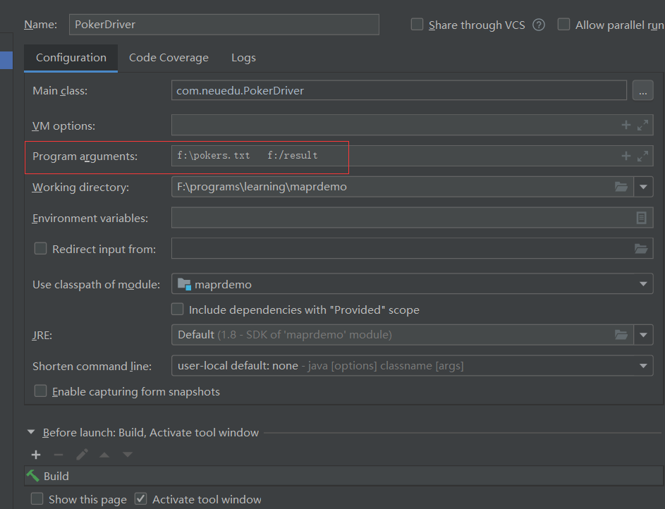

设置之后直接运行Driver类的main函数即可检查结果。

#### 4.集群测试

1. 执行`maven clean package`命令或者直接点击Intellij的**pakage按钮**打包

   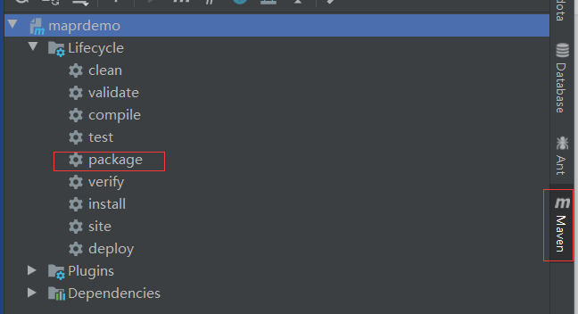

   打包后，jar包被放在**target文件夹**之下

   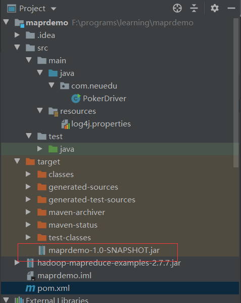

   

2. 将jar包拷贝如hadoop集群中

3. 启动hadoop集群（hdfs和yarn都要启动）

4. 将输入文件上传至hdfs

   ```bash
   $ hdfs dfs -put a.txt /a.txt
   ```

5. 执行程序

   ```bash
   $ hadoop jar  maprdemo-1.0-SNAPSHOT.jar
    com.neuedu.WordcountDriver /a.txt /output
   ```

6. 检查运行结果

> 作业：
>
> 要彻底理解mapreduce思想，请编写一个mapreduce应用：
>
> 需求：将一个包含了多张扑克牌的文件按照花色进行统计，计算出每种花色的牌数量

## Hadoop序列化

### 什么是序列化

​	**序列化**就是**把内存的对象，转换成字节序列**（或其他数据传输协议）以便于存储到磁盘（持久化）和网络传输

​	**反序列化**就是将收到的字节序列（或其他传输协议）或者是**磁盘的持久化数据，转换成内存中的对象**。

> 对于java应用而言，就是将内存中的对象数据转换成特定格式，并且持久化或者通过RPC（远程过程调用）将数据发送给其他异构或同构的服务。

### Hadoop的序列化

​	java通过实现`Serializable`接口也可以实现序列化，但是这个序列化过于重量级，一个对象一旦被序列化后，其文件内部包含了太多额外的信息，显然不便于网络高效传输，所以，hadoop开发了一套序列化机制（Writable）。

> 试着比较下两种序列化生成的文件大小，就会发现，java序列化后的文件大约是hadoop的4倍。

#### hadoop序列化特点

1. 紧凑：高效实用存储空间。
2. 快速：读写数据的额外开销小。
3. 可扩展：随着通信协议的升级而升级。
4. 互操作：支持多语言的交互。

### 自定义bean对象序列化

​	在企业开发中往往常用的基本序列化类型不能满足所有需求，比如在Hadoop框架内部传递一个bean对象，那么该对象就需要实现序列化接口。

具体实现bean对象序列化步骤如下7步。

（1）**必须实现`Writable`接口**

（2）反序列化时，需要反射调用空参构造函数，所以必须有空参构造

```java
public FlowBean() {	
    super();
}
```

（3）重写序列化方法

```java
@Override
public void write(DataOutput out) throws IOException {	
    out.writeLong(upFlow);	
    out.writeLong(downFlow);	
    out.writeLong(sumFlow);
}
```

(4) 重写反序列化方法

```java
@Override
public void readFields(DataInput in) throws IOException {	
    upFlow = in.readLong();	
    downFlow = in.readLong();
    sumFlow = in.readLong();
}
```

**（5）注意反序列化的顺序和序列化的顺序完全一致**

（6）要想把结果显示在文件中，需要重写toString()，可用”\t”分开，方便后续用。

（7）如果需要将自定义的bean放在key中传输，则还需要实现Comparable接口，因为MapReduce框中的Shuffle过程要求对key必须能排序。详见后面排序案例。

```java
@Override
public int compareTo(FlowBean o) {
    // 倒序排列，从大到小	
    return this.sumFlow > o.getSumFlow() ? -1 : 1;
}
```

### 序列化案例

#### 1. 需求：

统计每一个手机号耗费的总上行流量、下行流量、总流量

1. 输入数据`phone_data.txt`如下：

   ```bash
   1	13736230513	192.196.100.1	www.neuedu.com	2481	24681	200
   2	13846544121	192.196.100.2			264	0	200
   3 	13956435636	192.196.100.3			132	1512	200
   4 	13966251146	192.168.100.1			240	0	404
   5 	18271575951	192.168.100.2	www.neuedu.com	1527	2106	200
   6 	84188413	192.168.100.3	www.neuedu.com	4116	1432	200
   7 	13590439668	192.168.100.4			1116	954	200
   8 	15910133277	192.168.100.5	www.hao123.com	3156	2936	200
   9 	13729199489	192.168.100.6			240	0	200
   10 	13630577991	192.168.100.7	www.shouhu.com	6960	690	200
   11 	15043685818	192.168.100.8	www.baidu.com	3659	3538	200
   12 	15959002129	192.168.100.9	www.neuedu.com	1938	180	500
   13 	13560439638	192.168.100.10			918	4938	200
   14 	13470253144	192.168.100.11			180	180	200
   15 	13682846555	192.168.100.12	www.qq.com	1938	2910	200
   16 	13992314666	192.168.100.13	www.gaga.com	3008	3720	200
   17 	13509468723	192.168.100.14	www.qinghua.com	7335	110349	404
   18 	18390173782	192.168.100.15	www.sogou.com	9531	2412	200
   19 	13975057813	192.168.100.16	www.baidu.com	11058	48243	200
   20 	13768778790	192.168.100.17			120	120	200
   21 	13568436656	192.168.100.18	www.alibaba.com	2481	24681	200
   22 	13568436656	192.168.100.19			1116	954	200
   ```

   > 输入数据格式
   >
   > 7 	13560436666	120.196.100.99		1116		 954			200
   >
   > id	手机号码		网络ip			      上行流量         下行流量             网络状态码

2. 期望输出数据格式

   ```
   13560436666 		1116		      954 			2070
   手机号码		    上行流量           下行流量		   总流量
   ```

#### 2. 需求分析

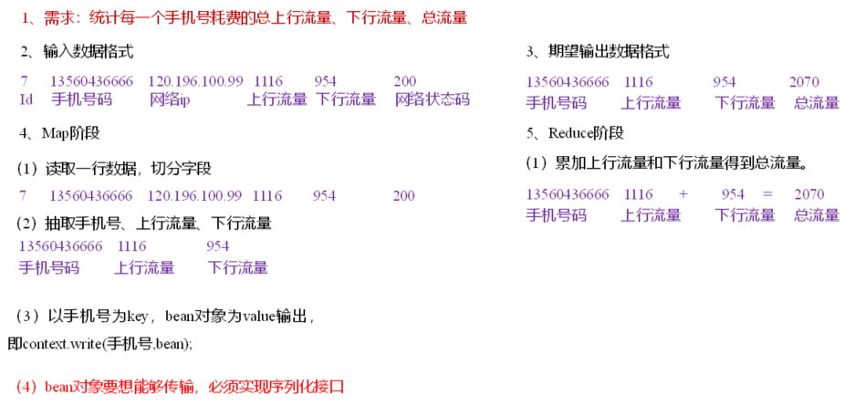

#### 3.  编写Mapreduce程序

1. 编写流量统计的bean对象

   ```java
   package com.neuedu.serialdemo.bean;
   
   import org.apache.hadoop.io.Writable;
   
   import java.io.DataInput;
   import java.io.DataOutput;
   import java.io.IOException;
   
   public class FlowWritable implements Writable {
   
       private Long upFlow;
       private Long downFlow;
   
       public Long getUpFlow() {
           return upFlow;
       }
   
       public void setUpFlow(Long upFlow) {
           this.upFlow = upFlow;
       }
   
       public Long getDownFlow() {
           return downFlow;
       }
   
       public void setDownFlow(Long downFlow) {
           this.downFlow = downFlow;
       }
   
       public Long getTotalFlow() {
           return totalFlow;
       }
   
       public void setTotalFlow(Long totalFlow) {
           this.totalFlow = totalFlow;
       }
   
       private Long totalFlow;
   
   
       @Override
       public void write(DataOutput dataOutput) throws IOException {
           dataOutput.writeLong(upFlow);
           dataOutput.writeLong(downFlow);
           dataOutput.writeLong(totalFlow);
       }
   
       @Override
       public void readFields(DataInput dataInput) throws IOException {
           upFlow = dataInput.readLong();
           downFlow = dataInput.readLong();
           totalFlow = dataInput.readLong();
       }
       @Override
       public String toString() {
           return upFlow + "\t" + downFlow + "\t" + totalFlow;
       }
   }
   
   ```

2. 编写Mapper类

   ```java
    public static class FlowMapper extends Mapper<LongWritable, Text, Text, FlowWritable> {
   
           private Text phone = new Text();
           private FlowWritable flow = new FlowWritable();
   
           @Override
           protected void map(LongWritable key, Text value, Context context) throws IOException, InterruptedException {
               String[] fields = value.toString().split("\t");
               phone.set(fields[1]);
               long upFlow = Long.parseLong(fields[fields.length - 3]);
               long downFlow = Long.parseLong(fields[fields.length - 2]);
               long totalFlow = upFlow + downFlow;
               flow.setDownFlow(downFlow);
               flow.setTotalFlow(totalFlow);
               flow.setUpFlow(upFlow);
   
               context.write(phone, flow);
           }
       }
   ```

3. 编写Reducer类

   ```java
    public static class FlowReducer extends Reducer<Text, FlowWritable, Text, FlowWritable> {
   
           private FlowWritable value = new FlowWritable();
   
           @Override
           protected void reduce(Text key, Iterable<FlowWritable> values, Context context) throws IOException, InterruptedException {
               long sum_upFlow = 0;
               long sum_downFlow = 0;
               long sum_totalFlow = 0;
   
               for (FlowWritable fw : values) {
                   sum_upFlow += fw.getUpFlow();
                   sum_downFlow += fw.getDownFlow();
                   sum_totalFlow += fw.getTotalFlow();
               }
   
               value.setUpFlow(sum_upFlow);
               value.setDownFlow(sum_downFlow);
               value.setTotalFlow(sum_totalFlow);
   
   
               context.write(key, value);
           }
       }
   ```

4. 编写Driver

   ```java
   public class FlowDriver {
   
       public static void main(String[] args) throws IOException, ClassNotFoundException, InterruptedException {
           Configuration configuration = new Configuration();
           Job job = Job.getInstance(configuration);
   
           job.setJarByClass(FlowDemo.class);
   
           job.setMapperClass(FlowMapper.class);
           job.setReducerClass(FlowReducer.class);
   
           job.setMapOutputKeyClass(Text.class);
           job.setMapOutputValueClass(FlowWritable.class);
           job.setOutputKeyClass(Text.class);
           job.setOutputValueClass(FlowWritable.class);
   
           FileInputFormat.setInputPaths(job, new Path(args[0]));
           FileOutputFormat.setOutputPath(job, new Path(args[1]));
   
           boolean result = job.waitForCompletion(true);
           System.exit(result ? 0 : 1);
       }
   }
   ```

5. 测试检查输出

## MapReduce框架原理(重点)

### InputFormat数据输入

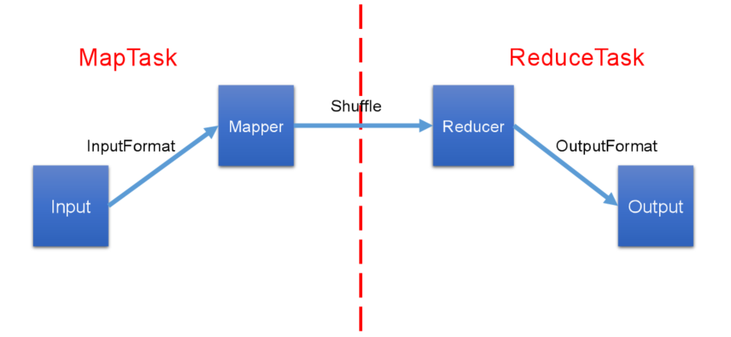

#### InputFormat的作用

> 思考：1G的数据，启动8个MapTask，可以提高集群的并发处理能力。那么1K的数据，也启动8个MapTask，会提高集群性能吗？MapTask并行任务是否越多越好呢？哪些因素影响了MapTask并行度？

​	Hadoop是一个分布式计算平台，mapreduce作为其计算逻辑核心，当然也是分布式的，每当一个`mapreduce`应用启动时，hadoop集群都要启动多个并行Map任务`MapTask`来处理计算，我们知道map阶段的数据是按照行来作为单位的，那么到底要启动多少个并行任务`MapTask`呢，换句话说，每一个MapTask处理多少数据呢？**`InputFormat`就是用来干这事的：在`MapReduce`应用启动阶段，对数据输入按照一点的规则进行切分，切分的数量会提交给`yarn`，最终决定`MapTas`k的并行数量（并行度）**

**注意**:这里所谓的数据切分，并不是真正意义上在磁盘上对文件进行切分，而只是在逻辑上对计算输入数据进行分片，最终用来确定`MapTask`的数量。

#### 切片与MapTask并行度决定机制

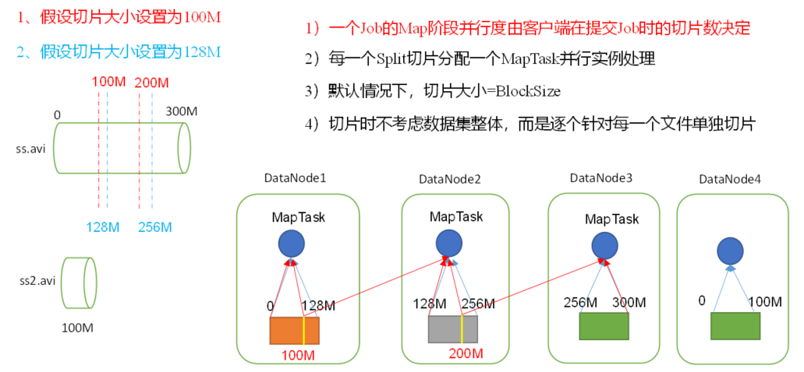

**切片规则**：

1. 一个Job的Map阶段并行度由客户端在提交Job时的切片数决定

2. 每一个split切片分配一个MapTask并行实例处理

3. 默认情况下：切片大小=BlockSize（128m）

4. 切片时不考虑数据集整体，而是逐一对每一个文件单独切片

   > 例如：
   >
   > ​	一个文件夹有里有三个文件：A.mp4 (300m)  B.txt(10m)   C.txt(10m)
   >
   > 那么他的切片就是五片：A（0-128，128-256，256-300）B（10） C（10m） 

### Job源码分析过程

​	我们从`FlowDriver`类的`job.waitForCompletion()`方法开始进行debug，来深入了解切分逻辑

1. `FlowDriver`类

   ```java
   ...
   // job调用waitForCompletion开始提交mapreduce任务申请
   boolean result = job.waitForCompletion(true);
   ...
   ```

2. `Job`类

   `waitForCompletion()`内部

   ```java
   ...
   // 判断job是否已经定义完成：也就是在FlowDriver中是否定义了map和reducer类，是否定义了数据类型等
   if (state == JobState.DEFINE) {
   // 如果job已经定义完毕，就提交任务
         submit();
   }
   ...
   ```

   `submit()`方法内部

   ```java
   //在次确认状态是否为已定义
   ensureState(JobState.DEFINE);
   //兼容hadoop老版本的api，将其转换为新api
   setUseNewAPI();
   //建立与集群的连接：
   connect();
   
   ...
   ```

   `connect()`方法内部

   ```java
   //connect方法负责确定创建一个集群Cluster实例对象，如果是本地调试，返回一个本地集群，如果是连接hadoop集群，就返回一个hadoop集群对象
   if (cluster == null) {
       cluster = 
           ugi.doAs(new PrivilegedExceptionAction<Cluster>() {
               public Cluster run()
                   throws IOException, InterruptedException, 
               ClassNotFoundException {
                   return new Cluster(getConfiguration());
               }
           });
   }
   ```

   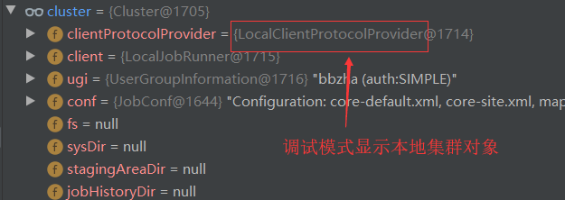

   继续回到`submit`方法内部

   ```java
   final JobSubmitter submitter = 
       getJobSubmitter(cluster.getFileSystem(), cluster.getClient());
   status = ugi.doAs(new PrivilegedExceptionAction<JobStatus>() {
       public JobStatus run() throws IOException, InterruptedException, 
       ClassNotFoundException {
           //开始提交job
           return submitter.submitJobInternal(Job.this, cluster);
       }
   });
   ```

3. `JobSubmitter`类

   `submitJobInternal()`内部

   ```java
   //验证输出路径是否正确：比如输入路径是否已经存在
   checkSpecs(job);
   ...
   ```

   `checkSpecs`内部

   ```java
   ...
   //验证输出路径是否正确的核心代码
   output.checkOutputSpecs(job);
   ...
   ```

   `checkOutputSpecs()`内部

   ```java
   // Ensure that the output directory is set and not already there
   //确保output输出地址已经设置并且不存在
   Path outDir = getOutputPath(job);
   if (outDir == null) {
       throw new InvalidJobConfException("Output directory not set.");
   }
   
   ....
   //判断文件系统是否已存在输出路径文件夹，如果已存在就抛出异常
   if (outDir.getFileSystem(job.getConfiguration()).exists(outDir)) {
       throw new FileAlreadyExistsException("Output directory " + outDir + 
                                            " already exists");
   }
   ```

   回到`submitJobInternal()`内部

   ```java
   //确定切片规划文件所在路径
   Path jobStagingArea = JobSubmissionFiles.getStagingDir(cluster, conf);
   ```

   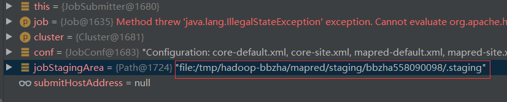

   可以看到在项目工程目录所在盘符下有如下文件夹

   

   > 这个文件夹下回存放路径规划文件`job.split`和`job.splitmetadata`，以及`jobid`文件,还有job的相关hadoop配置参数文件`job.xml`

   ```java
   ...
   // 创建jobid，并创建job路径存放jobid
   JobID jobId = submitClient.getNewJobID();
   ...
   //拷贝jar包到集群，要让集群节点执行mapreduce，当然得有jar包
   copyAndConfigureFiles(job, submitJobDir);
   ...
   //开始计算切片数量
   int maps = writeSplits(job, submitJobDir);
   ...
   ```

   `writeSplits()`方法内部

   ```java
   ...
   // 计算切片数量
   maps = writeNewSplits(job, jobSubmitDir);
   ...
   ```

   `writeNewSplits()`内部

   ```java
   ...
   // InputFormat出现了，由他来负责切分
   InputFormat<?, ?> input =
       ReflectionUtils.newInstance(job.getInputFormatClass(), conf);
   //真正的切片方法
   List<InputSplit> splits = input.getSplits(job);
   ```

   可以看到由于我们的输入是一个`phone_data.txt`文件，因此InputFormat的属性类是`TextInputFormat`

   

   > InputFormat还有很多实现类，我们也可以自定义，也就是我们可以有自己的切片规则，后面再说

4. `InputFormat`类

   `getSplits()`方法内部

   ```java
   ···
   //定义切片的最大值和最小值,最大值就是long型数值的最大值，最小值会根据文件大小确定，一般是1
   long minSize = Math.max(getFormatMinSplitSize(), getMinSplitSize(job));
   long maxSize = getMaxSplitSize(job);
   ···
   //获取所有输入文件信息，并且进行迭代，确定每个文件的切分大小，
   //印证了之前所说的切分规则：不关注输入文件整体大小
   List<FileStatus> files = listStatus(job);
       for (FileStatus file: files) {
       ...
       	//获取块大小：默认128m
       	long blockSize = file.getBlockSize();
       	// 计算切片大小，
       	long splitSize = computeSplitSize(blockSize, minSize, maxSize); 
       	// 定义变量代表切片后剩余的未切分数据长度
           long bytesRemaining = length;
           //循环对文件进行切片，直到剩余数量除以切片大小的值小于blocksize的1.1倍，就不切割下去了
           while (((double) bytesRemaining)/splitSize > SPLIT_SLOP) {
               int blkIndex = getBlockIndex(blkLocations, length-bytesRemaining);
               splits.add(makeSplit(path, length-bytesRemaining, splitSize,
                                    blkLocations[blkIndex].getHosts(),
                                    blkLocations[blkIndex].getCachedHosts()));
               bytesRemaining -= splitSize;
           }
       ...
       }
   	
   ....
   ```

   思考：**为什么是1.1倍的blocksize而不是1个blocksize？**

   假设一个文件是128.01M，如果按照1倍来计算，就要有两个切片，这显然是不合理的，**为了保证不会出现过小的切片**，导致**加载数据的时间大于计算的时间**，故设置了1.1倍的切分计算

   >当切片计算完成后，就生成了切片规则，切片规则会以文件的形式保存在staging路径下
   >
   >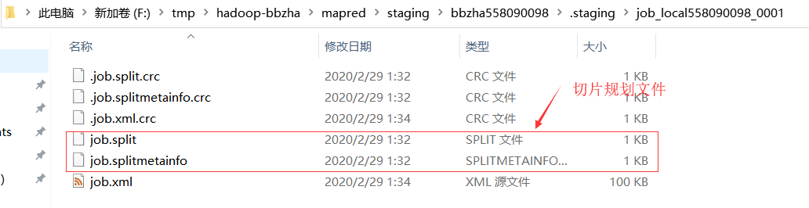

   **重点**：如果集群中由yarn来调配资源，**那么切片资源规划文件会提交给yarn，并且由yarn的MrAppMaster根据切片规则计算开启MapTask的个数**

5. 回到`JobSubmitter`类

   回到`submitJobInternal`方法

   ```java
   ...
   //向Stag路径写XML配置文件
   writeConf(conf, submitJobFile);
   ...
   ```

   可以看到staging下的`job.xml`文件

   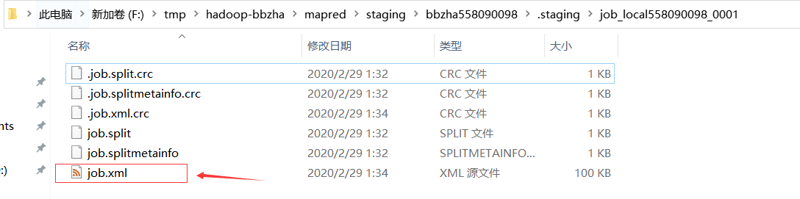

   打开job.xml看一看，都是hadoop的配置参数

   > hdfs-default.xml、mapred-default.xml、yarn-default.xml是默认的配置参数，它们都在hadoop的核心依赖包中保存

   ```xml
   <?xml version="1.0" encoding="UTF-8" standalone="no"?><configuration>
   <property><name>dfs.journalnode.rpc-address</name><value>0.0.0.0:8485</value><source>hdfs-default.xml</source></property>
   <property><name>yarn.ipc.rpc.class</name><value>org.apache.hadoop.yarn.ipc.HadoopYarnProtoRPC</value>
   <source>yarn-default.xml</source></property>
   <property><name>mapreduce.job.maxtaskfailures.per.tracker</name><value>3</value><source>mapred-default.xml</source></property>
   <property><name>yarn.client.max-cached-nodemanagers-proxies</name><value>0</value>...
   ```

   

   ```java
   ...
   //提交job，返回提交状态
   status = submitClient.submitJob(
       	jobId, submitJobDir.toString(), job.getCredentials());
   ```

   此时状态会变成`RUNNING`,也就是开始执行mapreduce

   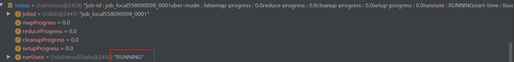

#### 总结源码分析

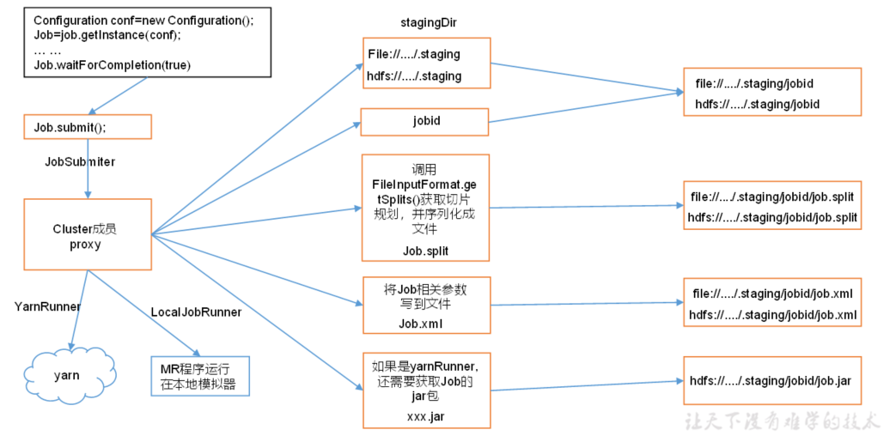

1. job调用submit方法开始提交任务

2. 确认cluster种类是本地还是集群yarn

3. 创建staging目录用于存放jobid、切片规划文件、job的hadoop参数配置、运行jar包

4. 生成jobid，并生成jobid文件

5. 遍历输入数据中的每一个文件

6. 计算每一个文件的切片，也就是规划切片，将规划切片文件保存到staging文件夹

   > 计算剩余文件长度是否大于块的1.1倍，不大于就停止切片

7. 生成job的hadoop配置文件`job.xml`

8. 提交job任务

9. yarn读取切片规划文件，`MrAppMaster`根据切片规划文件**计算开启`MapTask`的数量。**

### InputFormat类及其子类

​	InputFornat的所用就是将数据进行切片，并且将切片打散成`key、value`的形式

`InputFormat`源码：

```java
/**
 * Licensed to the Apache Software Foundation (ASF) under one
 * or more contributor license agreements.  See the NOTICE file
 * distributed with this work for additional information
 * regarding copyright ownership.  The ASF licenses this file
 * to you under the Apache License, Version 2.0 (the
 * "License"); you may not use this file except in compliance
 * with the License.  You may obtain a copy of the License at
 *
 *     http://www.apache.org/licenses/LICENSE-2.0
 *
 * Unless required by applicable law or agreed to in writing, software
 * distributed under the License is distributed on an "AS IS" BASIS,
 * WITHOUT WARRANTIES OR CONDITIONS OF ANY KIND, either express or implied.
 * See the License for the specific language governing permissions and
 * limitations under the License.
 */

package org.apache.hadoop.mapreduce;

import java.io.IOException;
import java.util.List;

import org.apache.hadoop.classification.InterfaceAudience;
import org.apache.hadoop.classification.InterfaceStability;
import org.apache.hadoop.fs.FileSystem;
import org.apache.hadoop.mapreduce.lib.input.FileInputFormat;

/** 
 * <code>InputFormat</code> describes the input-specification for a 
 * Map-Reduce job. 
 * 
 * <p>The Map-Reduce framework relies on the <code>InputFormat</code> of the
 * job to:<p>
 * <ol>
 *   <li>
 *   Validate the input-specification of the job. 
 *   <li>
 *   Split-up the input file(s) into logical {@link InputSplit}s, each of 
 *   which is then assigned to an individual {@link Mapper}.
 *   </li>
 *   <li>
 *   Provide the {@link RecordReader} implementation to be used to glean
 *   input records from the logical <code>InputSplit</code> for processing by 
 *   the {@link Mapper}.
 *   </li>
 * </ol>
 * 
 * <p>The default behavior of file-based {@link InputFormat}s, typically 
 * sub-classes of {@link FileInputFormat}, is to split the 
 * input into <i>logical</i> {@link InputSplit}s based on the total size, in 
 * bytes, of the input files. However, the {@link FileSystem} blocksize of  
 * the input files is treated as an upper bound for input splits. A lower bound 
 * on the split size can be set via 
 * <a href="{@docRoot}/../hadoop-mapreduce-client/hadoop-mapreduce-client-core/mapred-default.xml#mapreduce.input.fileinputformat.split.minsize">
 * mapreduce.input.fileinputformat.split.minsize</a>.</p>
 * 
 * <p>Clearly, logical splits based on input-size is insufficient for many 
 * applications since record boundaries are to respected. In such cases, the
 * application has to also implement a {@link RecordReader} on whom lies the
 * responsibility to respect record-boundaries and present a record-oriented
 * view of the logical <code>InputSplit</code> to the individual task.
 *
 * @see InputSplit
 * @see RecordReader
 * @see FileInputFormat
 */
@InterfaceAudience.Public
@InterfaceStability.Stable
public abstract class InputFormat<K, V> {

  /** 
   * Logically split the set of input files for the job.  
   * 
   * <p>Each {@link InputSplit} is then assigned to an individual {@link Mapper}
   * for processing.</p>
   *
   * <p><i>Note</i>: The split is a <i>logical</i> split of the inputs and the
   * input files are not physically split into chunks. For e.g. a split could
   * be <i>&lt;input-file-path, start, offset&gt;</i> tuple. The InputFormat
   * also creates the {@link RecordReader} to read the {@link InputSplit}.
   * 
   * @param context job configuration.
   * @return an array of {@link InputSplit}s for the job.
   */
   //对数据进行逻辑切片
  public abstract 
    List<InputSplit> getSplits(JobContext context
                               ) throws IOException, InterruptedException;
  
  /**
   * Create a record reader for a given split. The framework will call
   * {@link RecordReader#initialize(InputSplit, TaskAttemptContext)} before
   * the split is used.
   * @param split the split to be read
   * @param context the information about the task
   * @return a new record reader
   * @throws IOException
   * @throws InterruptedException
   */
  // 将切片转换为<K,V>
  public abstract 
    RecordReader<K,V> createRecordReader(InputSplit split,
                                         TaskAttemptContext context
                                        ) throws IOException, 
                                                 InterruptedException;

}

```

#### getSplits()方法

​	用于对文件进行切片的方法，之前我们在debug时已经看到了`FileInputFormat`是如何实现的。

#### createRecordReader()方法

​	这个方法中会创建一个`RecordReader`实例对象，用于将切片转换为<key,value>形式的数据。

> `RecordReader`：
>
> 一个`RecordReader`对象处理一个切片，说白了绑定一个`MapTask`,每一个`MapTask`对会有自己的`RecordReader`对象


#### FileInputFormat及其子类

​	`FileInputFormat`是一个定义了用于处理文件类型的输入数据的**抽象类**，其默认已经实现了`getSplits`方法，定义了默认的切面规则（上一节已经交代清楚。），但是`createRecordReader`方法需要其子类实现。

##### 相关重要子类总结

| 子类类名                                                     | getSplit方法                                   | createRecordReader方法                                       |
| ------------------------------------------------------------ | ---------------------------------------------- | ------------------------------------------------------------ |
| `TextInputFormat`                                            | 继承自`FileInputFormat`                        | **RecordReader类型**：`LineRecordReader`                                                                                    **转换逻辑**：将每一行数据作为**value**，将每一行开头距离文件开头的偏移量作为**key **                                                                                **key类型**：`LongWritable `                                                                          **value类型**：`Text` |
| `KeyValueTextInputFormat`                                    | 继承自`FileInputFormat`                        | **RecordReader类型**：`KeyValueLineRecordReader`                                                                                    **转换逻辑**：将每一行用指定分隔符切为key和value两部分 ，分隔符默认为`\t`制表位，也可通过设置参数 `..key.value.separator`  来改变                                                                        **key类型**：`Text `                                                                          **value类型**：`Text` |
| `NLineInputFormat`                                           | 自定义方法，将N行数据切割为一片，N通过参数指定 | 同`TextInputFormat`                                          |
| `CombineTextInputFormat`      专门针对大量小文件进行切分     | 自定义方法                                     | **RecordReader类型**：`CombineFileRecordReader`                                                                                    **转换逻辑**：同`TextInputFormat`                                                                            **key类型**：`LongWritable `                                                                          **value类型**：`Text` |
| `FixedLengthInputFormat`                                     | 继承自`FileInputFormat`                        | **RecordReader类型**：`FixedLengthRecordReader`                                                                                    **转换逻辑**：按照指定的长度来读取切片中的数据，每一个指定长度的数据转换为kv，key是这一段数据的偏移量，value以二进制数据格式输出                                                                              **key类型**：`LongWritable `                                                                          **value类型**：`BytesWritable` |
| `SequenceFileInputFormat` 用于上一个mapreduce的输出承接下一个mapreduce的输入，也就是有向图计算 | 继承自`FileInputFormat`                        | **RecordReader类型**：`SequenceFileRecordReader`                                                                                    **转换逻辑**：将上一个mapreduce输出的key作为key，value作为value                                                                              **key类型**：泛型，根据上游任务输出决定                                                                          **value类型**：泛型，根据上游任务输出决定 |

##### CombineTextInputFormat

​	框架默认的`TextInputFormat`切片机制是对任务按文件规划切片，不管文件多小，都会是一个单独的切片，都会交给一个`MapTask`，这样如果有大量小文件，就会产生大量的MapTask，处理效率极其低下。

1. 应用场景：

   `CombineTextInputFormat`用于小文件过多的场景，它可以将多个小文件从逻辑上规划到一个切片中，这样，多个小文件就可以交给一个MapTask处理。

2. 虚拟存储切片最大值设置

   ```java
   CombineTextInputFormat.setMaxInputSplitSize(job, 4194304);// 4m
   ```

   > 注意：虚拟存储切片最大值设置最好根据实际的小文件大小情况来设置具体的值。

3. 切片机制

   生成切片过程包括：虚拟存储过程和切片过程二部分。

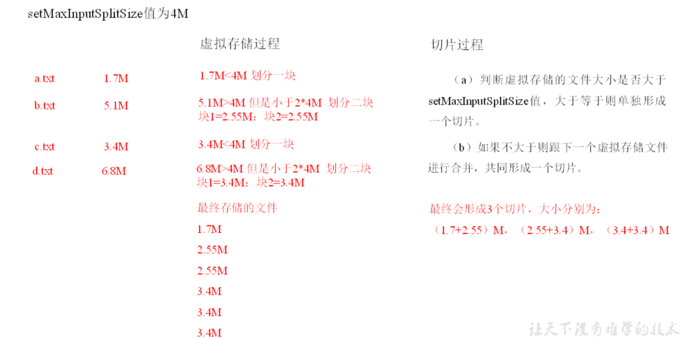

###### 虚拟存储过程	

​	将输入目录下所有文件大小，依次和设置的setMaxInputSplitSize值比较，如果不大于设置的最大值，逻辑上划分一个块。如果输入文件大于设置的最大值且大于两倍，那么以最大值切割一块；当剩余数据大小超过设置的最大值且不大于最大值2倍，此时将文件均分成2个虚拟存储块（防止出现太小切片）。

> 例如setMaxInputSplitSize值为4M，输入文件大小为8.02M，则先逻辑上分成一个4M。剩余的大小为4.02M，如果按照4M逻辑划分，就会出现0.02M的小的虚拟存储文件，所以将剩余的4.02M文件切分成（2.01M和2.01M）两个文件。

###### 切片过程

- 判断虚拟存储的文件大小是否大于setMaxInputSplitSize值，大于等于则单独形成一个切片。

- 如果不大于则跟下一个虚拟存储文件进行合并，共同形成一个切片。

- 测试举例：有4个小文件大小分别为1.7M、5.1M、3.4M以及6.8M这四个小文件，则虚拟存储之后形成6个文件块，大小分别为：

> 1.7M，（2.55M、2.55M），3.4M以及（3.4M、3.4M）
>
> 最终会形成3个切片，大小分别为：
>
> （1.7+2.55）M，（2.55+3.4）M，（3.4+3.4）M

###### CombineTextInputFormat案例

1. 需求:将输入的大量小文件合并成一个切片统一处理。

   - 准备四个小文件
   - 期望一个切片处理四个文件

2. 实现过程

   2.1 不做任何处理，运行之前的WordCount案例，观察切片数量为：

   ```bash
   number of split:4
   ```

   2.2 在`WordcountDriver`中增加如下代码，运行程序，观察切片数量：

   ```java
   // 如果不设置InputFormat，它默认用的是TextInputFormat.class
   job.setInputFormatClass(CombineTextInputFormat.class);
   
   //虚拟存储切片最大值设置4m
   CombineTextInputFormat.setMaxInputSplitSize(job, 4194304);
   ```

   ```bash
   number of splits:3
   ```

   2.3 在`WordcountDriver`中增加如下代码，运行程序，观察切片数量为1：

   ```java
   // 如果不设置InputFormat，它默认用的是TextInputFormat.class
   job.setInputFormatClass(CombineTextInputFormat.class);
   
   //虚拟存储切片最大值设置20m
   CombineTextInputFormat.setMaxInputSplitSize(job, 20971520);
   ```

   ```bash
   number of splits:1
   ```

##### TextInputFormat

​	`TextInputFormat`是默认的`FileInputFormat`实现类，按行读取每条记录。**key是存储该行在整个文件中的其实字节偏移量，`LongWritable`类型。值是该行的内容，不包括任何行终止符（换行符和回车符），`Text`类型。**

例如，一个分片包含了如下4行内容

```bash
aaaa bbbb cccc
dddd eeee ffff
gggg hhhh iiii
jjjj kkkk llll
```

没行数据会被转换为如下kv：

```bash
(0,aaaa bbbb cccc)
(15,dddd eeee ffff)
(29 gggg hhhh iiii)
(43 jjjj kkkk llll)
```

##### KeyValueTextInputFormat

​	每一行均为一条记录，被分隔符分割为key，value。可以通过在驱动类中设置`conf.set(KeyValueLineRecordReader.KEY_VALUE_SEPERATOR, "\t")`;来设定分隔符。默认分隔符是`tab（\t）`。

以下是一个示例，输入是一个包含4条记录的分片。其中——>表示一个（水平方向的）制表符。

```bash
line1 ——>Rich learning form
line2 ——>Intelligent learning engine
line3 ——>Learning more convenient
line4 ——>From the real demand for more close to the enterprise
```

每条记录表示为以下键/值对：

```bash
(line1,Rich learning form)
(line2,Intelligent learning engine)
(line3,Learning more convenient)
(line4,From the real demand for more close to the enterprise)
```

###### KeyValueTextInputFormat案例

1. 需求：统计输入文件中每一行的第一个单词相同的行数。

   - 输入数据：

     ```bash
     banzhang ni hao
     xihuan hadoop banzhang
     banzhang ni hao
     xihuan hadoop banzhang
     ```

   - 期望结果数据

     ```bash
     banzhang	2
     xihuan	    2
     ```

2. 需求分析

   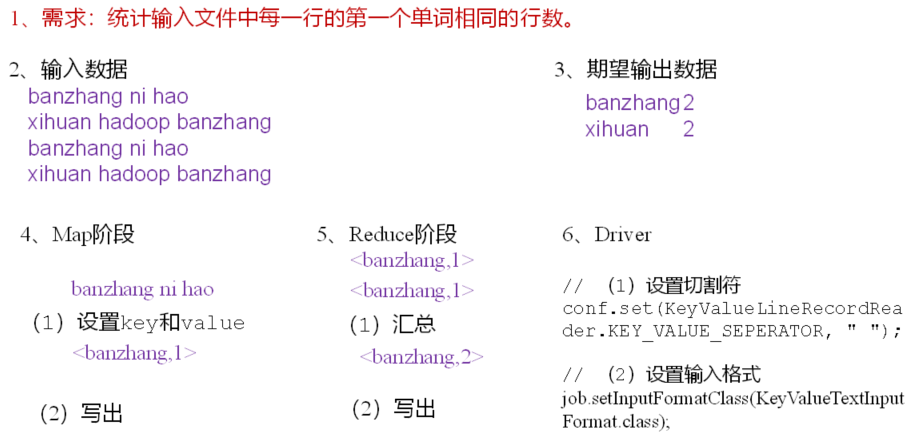

3. 代码实现

   编写`mapper`类

   ```java
   public class KVTextMapper extends Mapper<Text, Text, Text, LongWritable>{
   	
   // 1 设置value
      LongWritable v = new LongWritable(1);  
       
   	@Override
   	protected void map(Text key, Text value, Context context)
   			throws IOException, InterruptedException {
   
   // banzhang ni hao
           
           // 2 写出
           context.write(key, v);  
   	}
   }
   ```

   编写`Reducer`类：

   ```java
   public class KVTextReducer extends Reducer<Text, LongWritable, Text, LongWritable>{
   	
       LongWritable v = new LongWritable();  
       
   	@Override
   	protected void reduce(Text key, Iterable<LongWritable> values,	Context context) throws IOException, InterruptedException {
   		
   		 long sum = 0L;  
   
   		 // 1 汇总统计
           for (LongWritable value : values) {  
               sum += value.get();  
           }
            
           v.set(sum);  
            
           // 2 输出
           context.write(key, v);  
   	}
   }
   ```

   编写`Driver`类：

   ```java
   public class KVTextDriver {
   
   	public static void main(String[] args) throws IOException, ClassNotFoundException, InterruptedException {
   		
   		Configuration conf = new Configuration();
   		// 设置切割符
   	conf.set(KeyValueLineRecordReader.KEY_VALUE_SEPERATOR, " ");
   		// 1 获取job对象
   		Job job = Job.getInstance(conf);
   		
   		// 2 设置jar包位置，关联mapper和reducer
   		job.setJarByClass(KVTextDriver.class);
   		job.setMapperClass(KVTextMapper.class);
   job.setReducerClass(KVTextReducer.class);
   				
   		// 3 设置map输出kv类型
   		job.setMapOutputKeyClass(Text.class);
   		job.setMapOutputValueClass(LongWritable.class);
   
   		// 4 设置最终输出kv类型
   		job.setOutputKeyClass(Text.class);
   job.setOutputValueClass(LongWritable.class);
   		
   		// 5 设置输入输出数据路径
   		FileInputFormat.setInputPaths(job, new Path(args[0]));
   		
   		// 设置输入格式
   	job.setInputFormatClass(KeyValueTextInputFormat.class);
   		
   		// 6 设置输出数据路径
   		FileOutputFormat.setOutputPath(job, new Path(args[1]));
   		
   		// 7 提交job
   		job.waitForCompletion(true);
   	}
   }
   ```

##### NLineInputFormat

​	如果使用`NlineInputFormat`，代表每个map进程处理的`InputSplit`不再按Block块去划分，而是按`NlineInputFormat`指定的行数`N`来划分。即输入文件的总行数/N=切片数，如果不整除，切片数=商+1。

以下是一个示例，仍然以上面的4行输入为例。

```bash
Rich learning form
Intelligent learning engine
Learning more convenient
From the real demand for more close to the enterprise
```

例如，如果N是2，则每个输入分片包含两行。开启2个MapTask。

```bash
(0,Rich learning form)
(19,Intelligent learning engine)
```

另一个 mapper 则收到后两行：

```bash
(47,Learning more convenient)
(72,From the real demand for more close to the enterprise)
```

> 这里的键和值与TextInputFormat生成的一样。

###### NLineInputFormat使用案例

1. 需求

   ​	对每个单词进行个数统计，要求根据每个输入文件的行数来规定输出多少个切片。此案例要求每三行放入一个切片中。

   - 输入数据

     ```bash
     banzhang ni hao
     xihuan hadoop banzhang
     banzhang ni hao
     xihuan hadoop banzhang
     banzhang ni hao
     xihuan hadoop banzhang
     banzhang ni hao
     xihuan hadoop banzhang
     banzhang ni hao
     xihuan hadoop banzhang banzhang ni hao
     xihuan hadoop banzhang
     ```

   - 期望输出切片个数

     ```bash
     Number of splits:4
     ```

2. 需求分析

   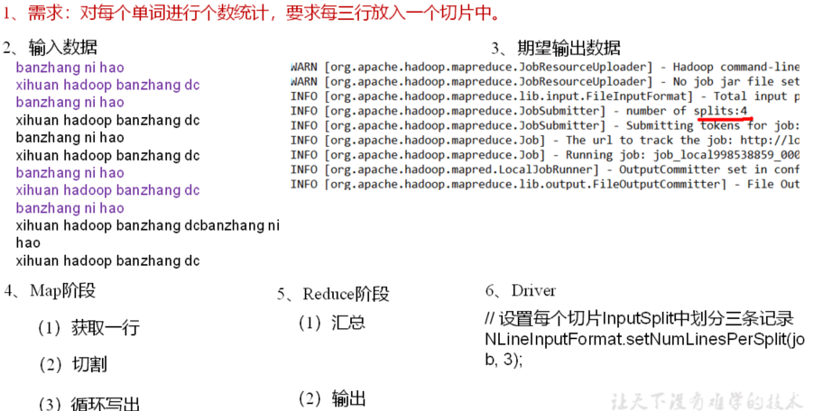

3. 代码实现

   编写Mapper类

   ```java
   public class NLineMapper extends Mapper<LongWritable, Text, Text, LongWritable>{
   	
   	private Text k = new Text();
   	private LongWritable v = new LongWritable(1);
   	
   	@Override
   	protected void map(LongWritable key, Text value, Context context)	throws IOException, InterruptedException {
   		
   		 // 1 获取一行
           String line = value.toString();
           
           // 2 切割
           String[] splited = line.split(" ");
           
           // 3 循环写出
           for (int i = 0; i < splited.length; i++) {
           	
           	k.set(splited[i]);
           	
              context.write(k, v);
           }
   	}
   }
   ```

   编写Reducer类

   ```java
   public class NLineReducer extends Reducer<Text, LongWritable, Text, LongWritable>{
   	
   	LongWritable v = new LongWritable();
   	
   	@Override
   	protected void reduce(Text key, Iterable<LongWritable> values,	Context context) throws IOException, InterruptedException {
   		
           long sum = 0l;
   
           // 1 汇总
           for (LongWritable value : values) {
               sum += value.get();
           }  
           
           v.set(sum);
           
           // 2 输出
           context.write(key, v);
   	}
   }
   ```

   编写Driver类

   ```java
   public class NLineDriver {
   	
   	public static void main(String[] args) throws IOException, URISyntaxException, ClassNotFoundException, InterruptedException {
   		
   // 输入输出路径需要根据自己电脑上实际的输入输出路径设置
   args = new String[] { "e:/input/inputword", "e:/output1" };
   
   		 // 1 获取job对象
   		 Configuration configuration = new Configuration();
           Job job = Job.getInstance(configuration);
           
           // 7设置每个切片InputSplit中划分三条记录
           NLineInputFormat.setNumLinesPerSplit(job, 3);
             
           // 8使用NLineInputFormat处理记录数  
           job.setInputFormatClass(NLineInputFormat.class);  
             
           // 2设置jar包位置，关联mapper和reducer
           job.setJarByClass(NLineDriver.class);  
           job.setMapperClass(NLineMapper.class);  
           job.setReducerClass(NLineReducer.class);  
           
           // 3设置map输出kv类型
           job.setMapOutputKeyClass(Text.class);  
           job.setMapOutputValueClass(LongWritable.class);  
           
           // 4设置最终输出kv类型
           job.setOutputKeyClass(Text.class);  
           job.setOutputValueClass(LongWritable.class);  
             
           // 5设置输入输出数据路径
           FileInputFormat.setInputPaths(job, new Path(args[0]));  
           FileOutputFormat.setOutputPath(job, new Path(args[1]));  
             
           // 6提交job
           job.waitForCompletion(true);  
   	}
   }
   ```

4. 测试结果

   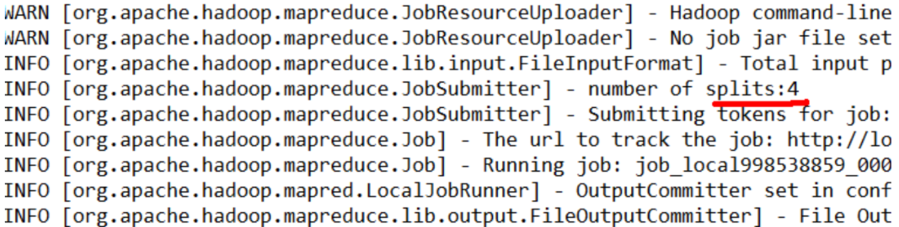

### 自定义InputFormat

​	在企业开发中，Hadoop框架自带的InputFormat类型不能满足所有应用场景，需要自定义InputFormat来解决实际问题。

#### 自定义InputFormat步骤

1. 自定义一个类继承`FileInputFormat`。
2. 改写`RecordReader`，实现一次读取一个完整文件封装为KV。

#### 案例

​	无论HDFS还是MapReduce，在处理小文件时效率都非常低，但又难免面临处理大量小文件的场景，此时，就需要有相应解决方案。可以自定义InputFormat实现小文件的合并。

##### 1.需求

将多个小文件合并成一个`SequenceFile`文件（`SequenceFile`文件是Hadoop用来存储二进制形式的key-value对的文件格式），`SequenceFile`里面存储着多个文件，存储的形式为文件路径+名称为key，文件内容为`value`。

###### 输入数据

`one.txt`

```bash
yongpeng weidong weinan
sanfeng luozong xiaoming
```

`two.txt`

```bash
longlong fanfan
mazong kailun yuhang yixin
longlong fanfan
mazong kailun yuhang yixin
```

`three.txt`

```bash
shuaige changmo zhenqiang 
dongli lingu xuanxuan
```

##### 2.需求分析

1. 自定义一个类继承FileInputFormat

   - 重写`isSplitable()`方法，返回false不可切割
   - 重写`createRecordReader()`，创建自定义的`RecordReader`对象，并初始化

2. 改写`RecordReader`，实现一次读取一个完整文件封装为KV

   - 采用IO流一次读取一个文件输出到value中，因为设置了不可切片，最终把所有文件都封装到了value中
   - 获取文件路径信息+名称，并设置key

3. 设置`Driver`

   ```java
   // （1）设置输入的inputFormat
   job.setInputFormatClass(WholeFileInputformat.class);
   
   // （2）设置输出的outputFormat
   job.setOutputFormatClass(SequenceFileOutputFormat.class);
   
   ```

##### 3. 程序实现

1. 自定义`InputFormat`

   ```java
   public class WholeFileInputFormat extends FileInputFormat<Text, ByteWritable> {
   
   
       @Override
       protected boolean isSplitable(JobContext context, Path filename) {
           return false;
       }
   
       @Override
       public RecordReader createRecordReader(InputSplit split, TaskAttemptContext context) throws IOException, InterruptedException {
           return new WholeFileRecordReader();
       }
   }
   ```

2. 自定义`RecordReader`

   ```java
   public class WholeFileRecordReader extends RecordReader<Text, BytesWritable> {
   	
       //是否已读文件
       private boolean isRead = false;
       //key
       private Text key = new Text();
       //value 由于文件可能是二进制而不是字符，所以用BytesWritable
       private BytesWritable value = new BytesWritable();
       // 文件切片对象
       private FileSplit fileSplit;
       // 文件切片输入流形式
       private FSDataInputStream fis;
   
       /**
        * 初始化方法，hadoop集群在创建完RecordReader后悔调用该方法进行自定义初始化
        * 创建一个输入流以便于nextKeyValue方法通过流读取文件内容，并转换成BytesWritable，设置给value
        *
        * @param split
        * @param context
        * @throws IOException
        * @throws InterruptedException
        */
       @Override
       public void initialize(InputSplit split, TaskAttemptContext context) throws IOException, InterruptedException {
           
           // 由于是FileInputFormat的子类，所以在这里直接强制转换为fileSplit
           // 以便于获取文件相关信息：长度，路径
           fileSplit = (FileSplit) split;
           Path path = fileSplit.getPath();
   
           //创建切片的输入流
           FileSystem fileSystem = path.getFileSystem(context.getConfiguration());
           fis = fileSystem.open(path);
   
       }
   
       /**
        * 读取文件下一段数据，并返回是否读取陈宫，类似迭代器
        *
        * @return
        * @throws IOException
        * @throws InterruptedException
        */
       @Override
       public boolean nextKeyValue() throws IOException, InterruptedException {
           if (!isRead){
               //读取key
               key.set(fileSplit.getPath().toString());
   
   
               //读取文件作为value
               byte[] buff = new byte[(int) fileSplit.getLength()];
               value.set(buff,0,buff.length);
               isRead = true;
               return true;
           }
           return false;
       }
   
       /**
        * 获取key值
        *
        * @return
        * @throws IOException
        * @throws InterruptedException
        */
       @Override
       public Text getCurrentKey() throws IOException, InterruptedException {
           return key;
       }
   
       /**
        * 获取value值
        *
        * @return
        * @throws IOException
        * @throws InterruptedException
        */
       @Override
       public BytesWritable getCurrentValue() throws IOException, InterruptedException {
           return value;
       }
   
       /**
        * 获取读取进度
        *
        * @return 以0-1之间的一个浮点型数表示读取进度，0未读，1读完，
        * @throws IOException
        * @throws InterruptedException
        */
       @Override
       public float getProgress() throws IOException, InterruptedException {
           return isRead ? 1 : 0;
       }
   
       /**
        * 关闭所需资源，如io流对象等
        * @throws IOException
        */
       @Override
       public void close() throws IOException {
           IOUtils.closeStream(fis);
       }
   }
   ```

3. 编写`Driver`

   ```java
   public class WholeFileDriver {
       public static void main(String[] args) throws IOException, ClassNotFoundException, InterruptedException {
           Job job = Job.getInstance(new Configuration());
   
           job.setMapOutputValueClass(BytesWritable.class);
           job.setMapOutputKeyClass(Text.class);
   
           job.setOutputKeyClass(Text.class);
           job.setOutputValueClass(BytesWritable.class);
   
           //输出format采用SequenceFileOutputFormat
           job.setInputFormatClass(WholeFileInputFormat.class);
           //设置输入format采用自定义format
           job.setOutputFormatClass(SequenceFileOutputFormat.class);
   
           FileInputFormat.setInputPaths(job, new Path("f:/input"));
           FileOutputFormat.setOutputPath(job, new Path("f:/output"));
   
           boolean result = job.waitForCompletion(true);
   
           System.exit(result ? 0 : 1);
   
       }
   }
   ```

4. 测试运行

   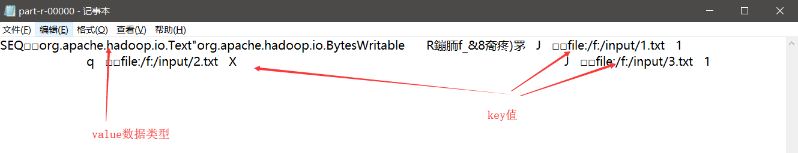

### MapReduce工作流程

​	之前我们或多或少的了解了`MapReduce`的大致流程，并熟悉了在map阶段，通过`FileInputFormat`实现了数据的切片与kv转换以此来确定`mapTask`的数量，**而`reduce`又是如何进行的，`map`至`reduce`之间的`shuffle`阶段到底又做了什么，怎么做的，是下面要详细说明的问题**

#### 全流程详解

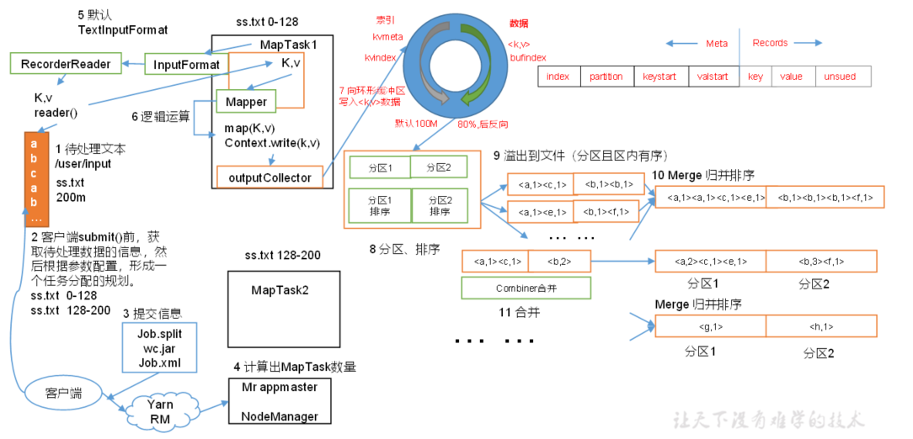

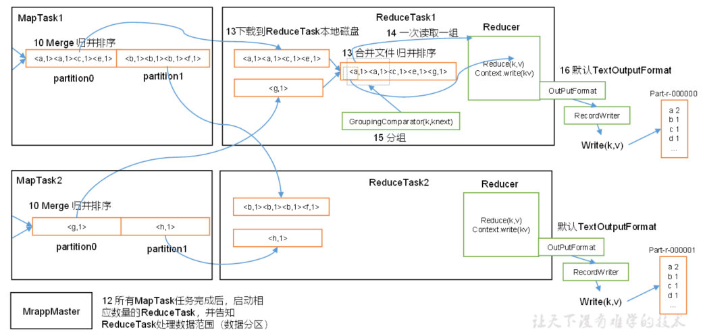

**具体步骤描述**：

1. 待处理文本数据假设为200M大小，客户端提交数据输入

2. 客户端提交之前会先确定分片规则，产生job.split文件

3. 客户端将`job.split`，`job.xml`，以及jar包提交给yarn。

4. yarn通过`Mrappmaster`结合分片规划文件计算出`MapTask`数量，产生两个`MapTask`分别对应两个数据切片。

5. MapTask调用对应的`FileInputFormat`创建`RecordReader`将数据切片转换为kv形式(每一个`RecordReader`处理一个分片)

6. `MapTask`将kv交由`Mapper`进行计算，输出结果交给`outputCollector`,通过调试，我们会看到，`context.write(k, v);`最终经过层层包装，调用了`outputCollector`的`collect`方法：

   ```java
   collector.collect(key, value,
                           partitioner.getPartition(key, value, partitions));
   ```

7. 数据被提交到环形缓冲区，环形缓冲区默认大小为100m，反复存入kv数据，当缓冲区负载超过80%后，会将数据转存至磁盘。

   > **注意：**
   >
   > Shuffle中的缓冲区大小会影响到MapReduce程序的执行效率，原则上说，缓冲区越大，磁盘io的次数越少，执行速度就越快。
   >
   > 缓冲区的大小可以通过参数调整，参数：io.sort.mb默认100M。

8. 环形缓冲区的数据按分区汇总（具体分区规则参考下面章节），分区内部数据需要按**key值**进行排序，排序算法为快排。

9. 当环形缓冲区达到80%后，数据将被转存至磁盘。

   > 环形缓冲区工作原理：
   >
   > 参考：https://baike.baidu.com/item/%E7%8E%AF%E5%BD%A2%E7%BC%93%E5%86%B2%E5%99%A8/22701730
   >
   > 环形缓冲区是一种常见的内存数据结构，在hadoop的shuffle过程中就是用了这种数据结构作为缓存
   >
   > 原理：
   > 1.随意找缓冲区中任意一点，左边写索引（真实数据内存地址），右边写数据
   >
   > 2.当出现新一条数据进来时，在元先插入数据的右边再写数据，在原先插入的索引左边再写索引，以此类推
   >
   > 3.当缓存占用率超过80%后，对缓存数据进行写入磁盘操作，并清空缓存
   >
   > 4.在进行写入缓存前，实际上分区和排序工作已经完成（排序的其实是索引），写入就会按照索引的顺序来写数据到磁盘。
   >
   > 5.如果在写入磁盘的同时，有新的kv数据要插入缓冲区，就在那剩下的20%中进行插入。
   >
   > 6.缓冲区的大小可调（默认100m），阈值也是可以调的（80%默认）

10. 当一个分片的所有数据都读完后，将按照分区进行归并排序（在合并分区的同时完成排序）。

    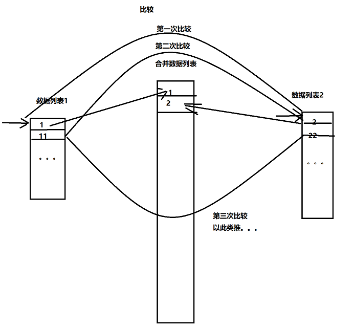

11. 使用`Combiner`实现数据合并是一个可选操作，后续再讨论

12. 当`MapTask`阶段完成后，就要由`MrAppMaster`按照**手动指定**的`ReduceTask`**数量**创建响应数量的`ReduceTask`，并将对应的数据分区告知每一个`ReduceTask`。

13. `ReduceTask`将对应的数据分区下载到本地磁盘,由于分区是从多个MapTask中读入，所以还要再对**数据进行一次归并排序**

14. 将分区中的数据按照key来进行分组，每次读取一组，之后交由`reducer`进行计算输出。

15. `GroupingComparetor`接口的实现类用于辅助排序，在reduce阶段**分组**来使用的。

16. 对应的`OutputFormat`将结果输出。

### Shuffle机制

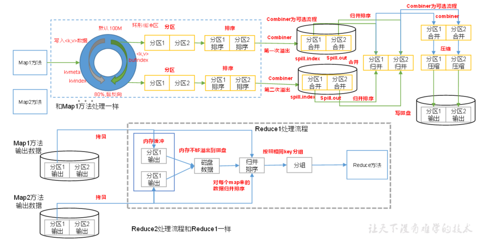

#### Partition分区

​	所谓分区,就是指某一类key的数剧应该去往哪一个reduceTask，对于数据的分区，就是将数据指定由哪一个reduceTask来进行reduce计算，reduceTask的数量通过在Driver类中手动指定：

```java
//配置reduceTask数量为5
job.setNumReduceTasks(5);
```

##### 默认分区规则

​	默认分区是根据key的hashCode对ReduceTasks个数取模得到的。用户没法控制哪个key存储到哪个分区。

debug序列化章节的phone示例来分析partition过程：

```java
collector.collect(key, value,
                        partitioner.getPartition(key, value, partitions));
```

`getPartition()`方法

```java
public class HashPartitioner<K, V> extends Partitioner<K, V> {

  /** Use {@link Object#hashCode()} to partition. */
  public int getPartition(K key, V value,
                          int numReduceTasks) {
    //将key的hashcode摸与reduceTask的数量，Integer.MAX_VALUE与运算防止hashcode传负数
    return (key.hashCode() & Integer.MAX_VALUE) % numReduceTasks;
  }

}
```

##### 自定义分区规则

1. 自定义类继承Partitioner，重写getPartition()方法

   ```java
   public class CustomPartitioner extends Partitioner<Text, FlowBean> {
    	@Override
   	public int getPartition(Text key, FlowBean value, int numPartitions) {
             // 控制分区代码逻辑
       … …
   		return partition;
   	}
   }
   
   ```

2. 在Job驱动中，设置自定义Partitioner

   ```java
   job.setPartitionerClass(CustomPartitioner.class);
   ```

3. 自定义Partition后，要根据自定义Partitioner的逻辑设置相应数量的ReduceTask

   ```java
   job.setNumReduceTasks(5);
   ```

##### 分区总结

1. 如果`ReduceTask`的数量> `getPartition`的结果数，则会多产生几个空的输出文件part-r-000xx；
2. 如果1<`ReduceTask`的数量<`getPartition`的结果数，则有一部分分区数据无处安放，会Exception；
3. 如果`ReduceTask`的数量=1，则不管`MapTask`端输出多少个分区文件，最终结果都交给这一个`ReduceTask`，最终也就只会产生一个结果文件 `part-r-00000`；
4. 分区号必须**从零开始**，逐一累加。

假设自定义分区为5，则：

```bash
job.setNumReduceTasks(1)：会正常运行，只不过会产生一个输出文件

job.setNumReduceTasks(2)：会报错

job.setNumReduceTasks(6)：大于5，程序会正常运行，会产生空文件
```

##### 自定义案例

###### 1.需求

将统计结果按照手机号136、137、138、139和其它开头输出到不同文件中（分区）

输入数据:

```bash
1	13736230513	192.196.100.1	www.neuedu.com	2481	24681	200
2	13846544121	192.196.100.2			264	0	200
3 	13956435636	192.196.100.3			132	1512	200
4 	13966251146	192.168.100.1			240	0	404
5 	18271575951	192.168.100.2	www.neuedu.com	1527	2106	200
6 	84188413	192.168.100.3	www.neuedu.com	4116	1432	200
7 	13590439668	192.168.100.4			1116	954	200
8 	15910133277	192.168.100.5	www.hao123.com	3156	2936	200
9 	13729199489	192.168.100.6			240	0	200
10 	13630577991	192.168.100.7	www.shouhu.com	6960	690	200
11 	15043685818	192.168.100.8	www.baidu.com	3659	3538	200
12 	15959002129	192.168.100.9	www.neuedu.com	1938	180	500
13 	13560439638	192.168.100.10			918	4938	200
14 	13470253144	192.168.100.11			180	180	200
15 	13682846555	192.168.100.12	www.qq.com	1938	2910	200
16 	13992314666	192.168.100.13	www.gaga.com	3008	3720	200
17 	13509468723	192.168.100.14	www.qinghua.com	7335	110349	404
18 	18390173782	192.168.100.15	www.sogou.com	9531	2412	200
19 	13975057813	192.168.100.16	www.baidu.com	11058	48243	200
20 	13768778790	192.168.100.17			120	120	200
21 	13568436656	192.168.100.18	www.alibaba.com	2481	24681	200
22 	13568436656	192.168.100.19			1116	954	200
```

手机号136、137、138、139开头都分别放到一个独立的4个文件中，其他开头的放到一个文件中。

###### 2.需求分析

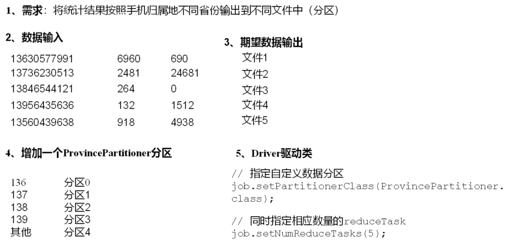

###### 3. 编码

1. 创建自定义分区类

   ```java
   public class FlowPatitioner extends Partitioner<Text, FlowWritable> {
   
   
       /**
        * 根据手机号前缀来划分分区
        * @param text
        * @param flowWritable
        * @param numPartitions
        * @return
        */
       @Override
       public int getPartition(Text text, FlowWritable flowWritable, int numPartitions) {
   
           String phone = text.toString().substring(0,3);
   
           switch (phone){
               case "136":
                   return 0;
               case "137":
                   return 1;
               case "138":
                   return 2;
               case "139":
                   return 3;
               default:
                   return 4;
   
           }
   
   
       }
   }
   ```

2. 编写驱动类设置ReduceTask数量、指定自定义分区类

   ```java
   //配置reduceTask数量
   job.setNumReduceTasks(5);
   //配置Partitioner实现类
   job.setPartitionerClass(FlowPatitioner.class);
   ```

3. 执行测试

   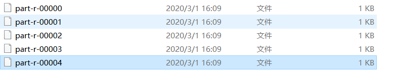

>思考
>
>假如我还要分出135呢？怎么办？

#### 排序

​	排序是MapReduce框架中最重要的操作之一

​	`MapTask`和`ReduceTask`均会对数据**按照key**进行排序。该操作属于Hadoop的默认行为。**任何应用程序中的数据均会被排序，而不管逻辑上是否需要。**

​	默认排序是按照**字典顺序排序**，且实现该排序的方法是**快速排序**。

##### 自定义排序WritableComparable

​	自定义对象作为key时，需要实现自定义`WritableComparable`接口，就可以实现排序

```java
@Override
public int compareTo(FlowBean o) {

	int result;
		
	// 按照总流量大小，倒序排列
	if (sumFlow > bean.getSumFlow()) {
		result = -1;
	}else if (sumFlow < bean.getSumFlow()) {
		result = 1;
	}else {
		result = 0;
	}

	return result;
}
```

##### 排序案例1

###### 1.需求

根据案例phone产生的结果再次对总流量进行排序。

- 输入数据：经过Flow计算后的输出文件

- 输出数据：按照总流量进行排序

  ```
  13509468723	7335	110349	117684
  13736230513	2481	24681	27162
  13956435636	132		1512	1644
  13846544121	264		0		264
  。。。 。。。
  ```

###### 2.需求分析

​	要想实现按总流量进行排序，那么总流量放在map的输出key上，也可以将`FlowWritable`类放在key上，将`FlowWritable`实现`WritableComparable`

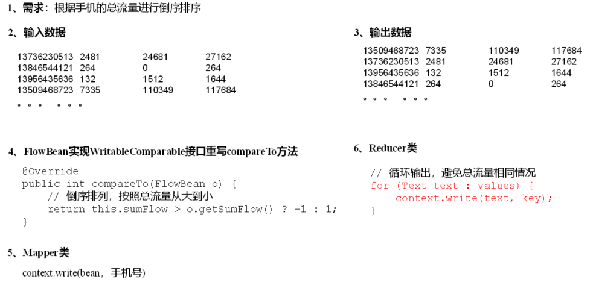

###### 3.代码实现

1. 修改`FlowWritable`

   ```java
   public class FlowWritable implements WritableComparable<FlowWritable> {
      .....
       @Override
           public int compareTo(FlowWritable o) {
               return Long.compare(o.getTotalFlow(),this.getTotalFlow());
           }
       }
   }
   ```

2. 创建`Mapper`

   ```java
   public static class FlowMapper extends Mapper<LongWritable, Text,FlowWritable,Text>{
   
           private FlowWritable k = new FlowWritable();
           private Text v = new Text();
   
           @Override
           protected void map(LongWritable key, Text value, Context context) throws IOException, InterruptedException {
               String[] split = value.toString().split("\t");
   
               k.setUpFlow(Long.parseLong(split[1]));
               k.setDownFlow(Long.parseLong(split[2]));
               k.setTotalFlow(Long.parseLong(split[3]));
   
               v.set(split[0]);
   
               context.write(k,value);
   
           }
       }
   ```

3. 创建`Reducer`

   ```java
    public static class FlowReducer extends Reducer<FlowWritable,Text,Text,FlowWritable>{
           @Override
           protected void reduce(FlowWritable key, Iterable<Text> values, Context context) throws IOException, InterruptedException {
   
               for(Text text:values){
                   context.write(text,key);
               }
           }
       }
   ```

4. 创建`Driver`

   ```java
   public class FlowDriver {
   
       public static void main(String[] args) throws IOException, ClassNotFoundException, InterruptedException {
   
           Job job = Job.getInstance(new Configuration());
   
           job.setJarByClass(FlowDriver.class);
           job.setMapperClass(FlowMapper.class);
           job.setReducerClass(FlowReducer.class);
           job.setMapOutputKeyClass(FlowWritable.class);
           job.setMapOutputValueClass(Text.class);
           job.setOutputKeyClass(Text.class);
           job.setOutputValueClass(FlowWritable.class);
   
           FileInputFormat.setInputPaths(job,new Path("f:/phone_status/"));
           FileOutputFormat.setOutputPath(job,new Path("f:/phone_status_2/"));
   
           boolean result = job.waitForCompletion(true);
           System.exit(result?0:1);
       }
   }
   ```

5. 测试运行

   ```
   13509468723	7335	110349	117684	7335	110349	117684
   13975057813	11058	48243	59301	11058	48243	59301
   13568436656	3597	25635	29232	3597	25635	29232
   13736230513	2481	24681	27162	2481	24681	27162
   18390173782	9531	2412	11943	9531	2412	11943
   13630577991	6960	690	7650	6960	690	7650
   15043685818	3659	3538	7197	3659	3538	7197
   13992314666	3008	3720	6728	3008	3720	6728
   15910133277	3156	2936	6092	3156	2936	6092
   13560439638	918	4938	5856	918	4938	5856
   84188413	4116	1432	5548	4116	1432	5548
   13682846555	1938	2910	4848	1938	2910	4848
   18271575951	1527	2106	3633	1527	2106	3633
   15959002129	1938	180	2118	1938	180	2118
   13590439668	1116	954	2070	1116	954	2070
   13956435636	132	1512	1644	132	1512	1644
   13470253144	180	180	360	180	180	360
   13846544121	264	0	264	264	0	264
   13768778790	120	120	240	120	120	240
   13729199489	240	0	240	240	0	240
   13966251146	240	0	240	240	0	240
   ```

##### 排序案例2

###### 1.需求

​	要求手机号输出的文件中按照总流量内部排序，并且按照136，137,138,139输出文件。

###### 2.需求分析

基于前一个需求，增加自定义分区类，分区按照手机号设置。

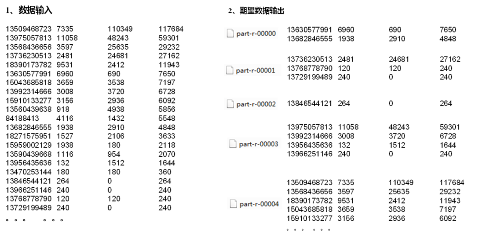

###### 3. 代码实现

基于案例1原有代码

1. 自定义分区类

   ```java
   package com.neuedu.compare;
   
   
   import org.apache.hadoop.io.Text;
   import org.apache.hadoop.mapreduce.Partitioner;
   
   public class FlowPatitioner extends Partitioner<FlowWritable,Text > {
   
   
       /**
        * 根据手机号前缀来划分分区
        * @param text
        * @param flowWritable
        * @param numPartitions
        * @return
        */
       @Override
       public int getPartition(FlowWritable flowWritable,Text text,int numPartitions) {
   
           String phone = text.toString().substring(0,3);
   
           switch (phone){
               case "136":
                   return 0;
               case "137":
                   return 1;
               case "138":
                   return 2;
               case "139":
                   return 3;
               default:
                   return 4;
   
           }
   
   
       }
   }
   
   ```

2. 在驱动类中添加分区类

   ```java
   //配置reduceTask数量
   job.setNumReduceTasks(5);
   //配置Partitioner实现类
   job.setPartitionerClass(FlowPatitioner.class);
   ```

3. 测试运行

   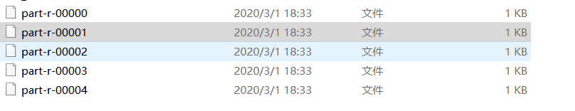

   随意打开任意一个文件

   ```
   13736230513	2481	24681	27162	2481	24681	27162
   13768778790	120	120	240	120	120	240
   13729199489	240	0	240	240	0	240  
   ```


   #### Combiner合并

1. `Combiner`是MR程序中`Mapper`和`Reducer`之外的一种组件。

2. `Combiner`组件的父类就是`Reducer`。

3. `Combiner`和`Reducer`的区别在于运行的位置：
   - `Combiner`是在每一个`MapTask`所在的节点运行;
   - `Reducer`是接收全局所有`Mapper`的输出结果；

4. `Combiner`的意义就是对每一个`MapTask`的输出进行局部汇总，以减小网络传输量。

   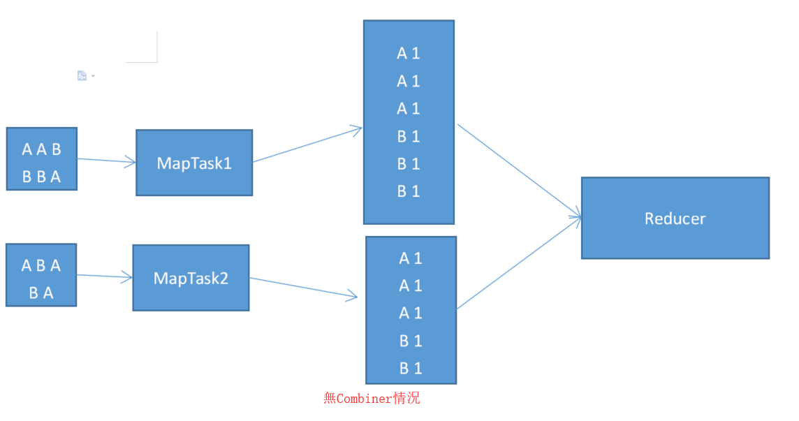

   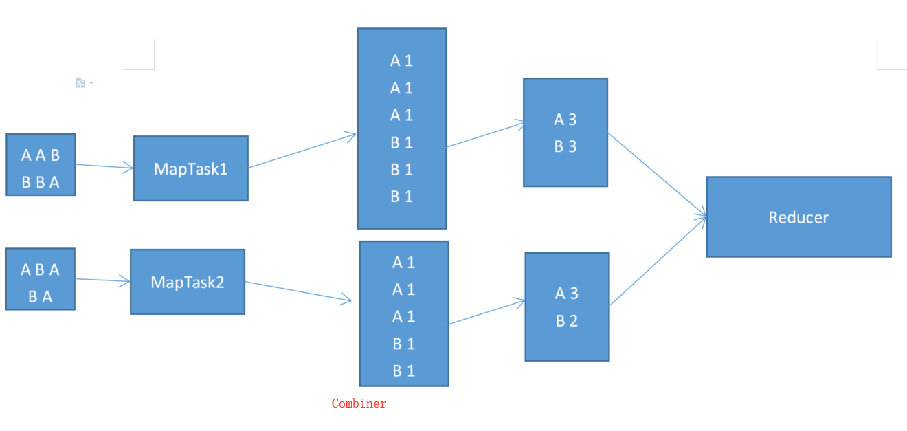

5. `Combiner`能够应用的前提是不能影响最终的业务逻辑，而且，`Combiner`的输出kv应该跟Reducer的输入kv类型要对应起来。

    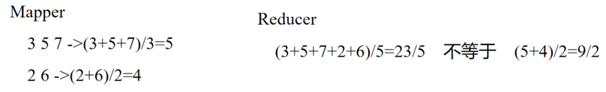

6. `Combiner`在整个MapTask过程中会进行**两次**

   - 第一次对每个环形缓冲区**溢出之前**的数据进行合并
   - 第二次在多个溢出数据块做**归并排序过程中**进行combiner

   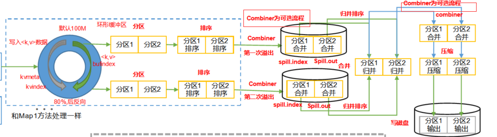


##### Combiner案例

###### 1.需求

​	给wordcount加上`Combiner`

###### 2.需求分析

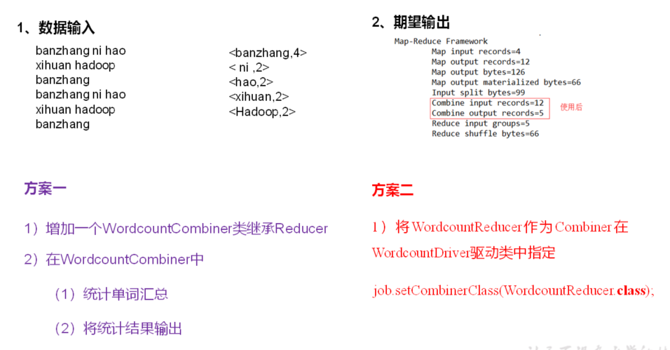

###### 3. 代码实现

第二种方案为例

在`Driver`中指定`Combiner`即可

```java
// 指定需要使用Combiner，以及用哪个类作为Combiner的逻辑
job.setCombinerClass(WordcountReducer.class);
```

分别比较无`combiner`和有`combiner`两种情况的日志

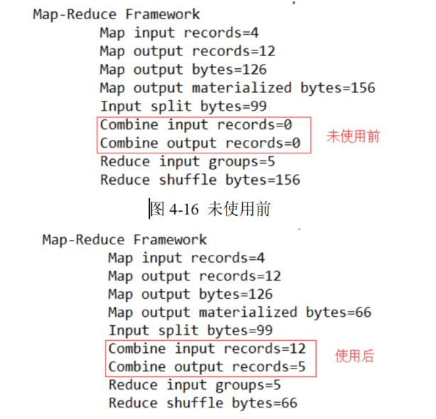

#### GroupingComparator分组（辅助排序）

​	`GroupingComparator`的作用是在reduce阶段，对map阶段传递的kv数据进行再分组，回顾我们之前完成的mapreduce应用`WordCount`，我们只有一个`ReducerTask`，并且我们也没没有实现`GroupingComparator`,但是数据仍然按照key值进行了分组，为什么呢？

原因如下：

1. 经过了shuffle阶段和reduce初段，数据已经完成了分区排序

   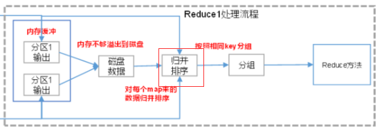

   数据的排序后如下：

   ```
   greet 1
   greet 1
   hello 1
   hello 1
   hello 1
   love 1
   love 1
   love1
   ```

2. reducer此时弃用默认分组方式，从数据第一行开始顺序与下一行数据比较key，如果key相等，就认为是一组

   ```
   line1  key=greet  compare nothing           group=group1
   line2  key=greet  compare line1  key=greet  group=group1
   line3  key=greet  compare line2  key=greet  group=group1
   line4  key=hello  compare line3  key=greet  group=group2
   ......
   ```

3. 比较完所有kv数据，完成分组

##### 自定义GroupingComparator

​	上面的默认分组方式在一些特定的情况下，无法满足业务需求，例如，key是一个bean对象的情况下，如何判定两个key对象是否相等，需要我们自己定义特定的判断逻辑，那么这时候，就需要自定义`GroupingComparator`

**自定义步骤:**

1. 自定义类继承`WritableComparator`

2. 实现`compare()`方法

   ```java
   @Override
   public int compare(WritableComparable a, WritableComparable b) {
   		// 比较的业务逻辑
   		return result;
   }
   ```

3. 创建构造函数，其中需要调用父类的构造函数指定比较对象的class类型

   ```java
   protected OrderGroupingComparator() {
   		super(OrderBean.class, true);
   }
   ```

   > 这一步为什么需要？
   >
   > 原因是hadoop是一个面向大数据的分布式框架，因此数据如果都以创建对象的方式在代码中运行，实在是太消耗内存资源，因此，比较器需要在初始化阶段就创建好两个用于比较的`WritableComparable`对象，而其值是通过反序列化磁盘数据后，通过调用setter方法设置进这两个对象里的，因此，对象不会重新创建，而这两个对象的数据却在一直变化。**好比两个水杯，承载数据，可以是可乐，也可以是雪碧，喝完了再倒。**

##### 分组案例

###### 1.需求

有如下订单数据

| 订单id  | 商品id | 成交金额 |
| ------- | ------ | -------- |
| 0000001 | Pdt_01 | 222.8    |
| Pdt_02  | 33.8   |          |
| 0000002 | Pdt_03 | 522.8    |
| Pdt_04  | 122.4  |          |
| Pdt_05  | 722.4  |          |
| 0000003 | Pdt_06 | 232.8    |
| Pdt_02  | 33.8   |          |

现在需要求出每一个订单中最贵的商品。

**输入数据**

```
0000001	Pdt_01	222.8
0000002	Pdt_05	722.4
0000001	Pdt_02	33.8
0000003	Pdt_06	232.8
0000003	Pdt_02	33.8
0000002	Pdt_03	522.8
0000002	Pdt_04	122.4
```

**期望输出数据**

展示每一个订单中最贵的商品

```
1	222.8
2	722.4
3	232.8
```

###### 2.需求分析

1. 利用“订单id和成交金额”作为key，可以将Map阶段读取到的所有订单数据按照id升序排序，如果id相同再按照金额降序排序，发送到Reduce。
2. 在Reduce端利用groupingComparator将订单id相同的kv聚合成组，然后取第一个即是该订单中最贵商品

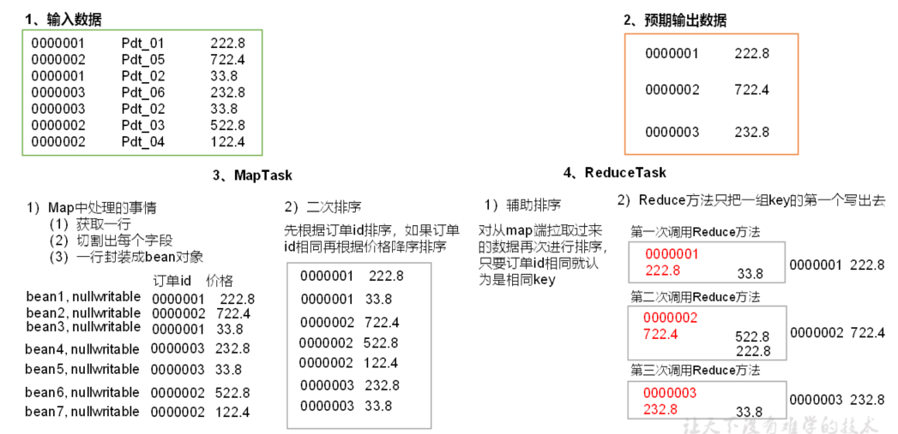

###### 3.代码实现

1. 定义订单信息类`OrderWritable`

   ```java
   public static class OrderWritable implements WritableComparable<OrderWritable> {
   
           private String orderId;
   
           public String getOrderId() {
               return orderId;
           }
   
           public void setOrderId(String orderId) {
               this.orderId = orderId;
           }
   
           public String getProductId() {
               return productId;
           }
   
           public void setProductId(String productId) {
               this.productId = productId;
           }
   
           public Double getPrice() {
               return price;
           }
   
           public void setPrice(Double price) {
               this.price = price;
           }
   
           private String productId;
           private Double price;
   
   
           @Override
           public int compareTo(OrderWritable o) {
   
               int compareOrderId = this.orderId.compareTo(o.getOrderId());
   
               if(compareOrderId==0){
                   return Double.compare(o.getPrice(),this.getPrice());
               }
   
               return compareOrderId;
           }
   
           @Override
           public void write(DataOutput dataOutput) throws IOException {
               dataOutput.writeUTF(orderId);
               dataOutput.writeUTF(productId);
               dataOutput.writeDouble(price);
           }
   
           @Override
           public void readFields(DataInput dataInput) throws IOException {
               orderId = dataInput.readUTF();
               productId = dataInput.readUTF();
               price = dataInput.readDouble();
           }
   
           @Override
           public String toString() {
               return orderId+"\t"+productId+"\t"+price;
           }
   }
   ```

2. 定义`OrderMapper`

   ```java
   public static class OrderMapper extends Mapper<LongWritable, Text,OrderWritable, NullWritable/*NullWritable就是hadoop对于空值的序列化*/>{
   
       private OrderWritable k  = new OrderWritable();
   
       @Override
       protected void map(LongWritable key, Text value, Context context) throws IOException, InterruptedException {
   
           String[] line = value.toString().split("\t");
   
           k.setOrderId(line[0]);
           k.setProductId(line[1]);
           k.setPrice(Double.parseDouble(line[2]));
   
           context.write(k,NullWritable.get());
       }
   }
   ```

3. 自定义分组类`OrderGroupingComparator`

   ```java
   public static class OrderGroupingComparator extends WritableComparator{
   
   
       public OrderGroupingComparator() {
           super(OrderWritable.class,true);
       }
   
       @Override
       public int compare(WritableComparable a, WritableComparable b) {
           //比较orderid是否想同
           OrderWritable oa = (OrderWritable) a;
           OrderWritable ob = (OrderWritable) b;
           return oa.getOrderId().compareTo(ob.getOrderId());
       }
   }
   ```

4. 定义`OrderReducer`

   ```java
   public static class OrderReducer extends Reducer<OrderWritable,NullWritable,OrderWritable,NullWritable>{
       @Override
       protected void reduce(OrderWritable key, Iterable<NullWritable> values, Context context) throws IOException, InterruptedException {
           context.write(key,NullWritable.get());
       }
   }
   ```

5. 定义`OrderDriver`

   ```java
   public class OrderDriver {
   
       
        public static void main(String[] args) throws IOException, ClassNotFoundException, InterruptedException {
            Job job = Job.getInstance(new Configuration());
   
            job.setMapperClass(OrderMapper.class);
            job.setReducerClass(OrderReducer.class);
   
            job.setMapOutputKeyClass(OrderWritable.class);
            job.setMapOutputValueClass(NullWritable.class);
   
            job.setOutputKeyClass(OrderWritable.class);
            job.setOutputValueClass(NullWritable.class);
   
            job.setGroupingComparatorClass(OrderGroupingComparator.class);
   
            FileInputFormat.setInputPaths(job, new Path("f:/input"));
            FileOutputFormat.setOutputPath(job, new Path("f:/output"));
   
            boolean result = job.waitForCompletion(true);
            System.exit(result ? 0 : 1);
        }
   }
   ```

6. 测试

   ```
   0000001	Pdt_01	222.8
   0000002	Pdt_05	722.4
   0000003	Pdt_06	232.8
   ```

   

> 思考：
>
> 1.假设我想展示所有订单数据怎么办？为什么？
>
> 修改`OrderReducer`
>
> ```java
> protected void reduce(OrderWritable key, Iterable<NullWritable> values, Context context) throws IOException, InterruptedException {
>  for(NullWritable value:values){
>      context.write(key,NullWritable.get());
>  }
> }
> ```
>
> 结果
>
> ```
> 0000001	Pdt_01	222.8
> 0000001	Pdt_02	33.8
> 0000002	Pdt_05	722.4
> 0000002	Pdt_03	522.8
> 0000002	Pdt_04	122.4
> 0000003	Pdt_06	232.8
> 0000003	Pdt_02	33.8
> ```
>
> 为什么？让我们再reduce方法代码改一下
>
> ```java
> protected void reduce(OrderWritable key, Iterable<NullWritable> values, Context context) throws IOException, InterruptedException {
>  while(values.iterator().hasNext()){
>      context.write(key,values.iterator().next());
>  }
> }
> ```
>
> debug一下，你会发现key的`hashcode`虽然没有发生变化，但是其中的值发生了变化。进入`next`方法一探究竟
>
> `next`方法内部
>
> ```java
> try {
>      nextKeyValue();
> ```
>
> `nextKeyValue`方法内部
>
> ```java
> //反序列化key值，并设置给成员变量key
> key = keyDeserializer.deserialize(key);
> // 反序列化value值，并设置给成员变量value
> value = valueDeserializer.deserialize(value);
> ```
>
> 实际上，迭代器中并不是存了多个kv数据的对象，而是只有一个k和v对象，并且在执行`next`方法时，通过反序列化磁盘中一条条的数据来设置k和v的值，在`reduce`方法中的key实际上和迭代器中的key指向了同一片内存空间。还是好比两个杯子，一个用来装key，一个用来装value，杯子不变，杯子里的东西可以变
>
> 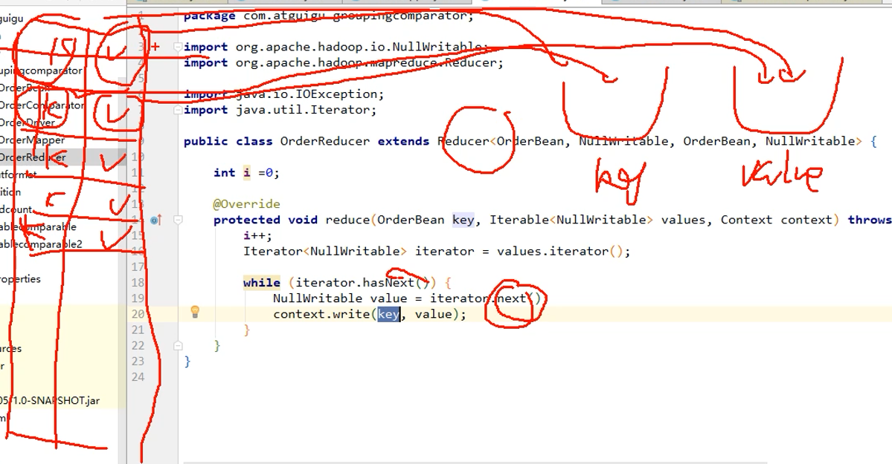

### MapTask工作机制

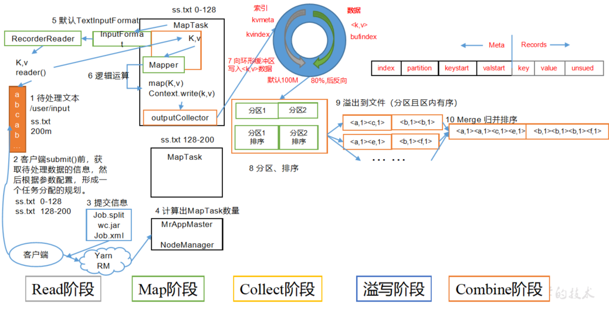

#### MapTask几个阶段

##### 1.Read阶段

​	`MapTask`通过用户编写的`RecordReader`，从输入`InputSplit`中解析出一个个key/value。

##### 2.Map阶段

​	该节点主要是将解析出的key/value交给用户编写map()函数处理，并产生一系列新的key/value。

##### 3.Collect收集阶段

​	在用户编写map()函数中，当数据处理完成后，一般会调用`OutputCollector.collect()`输出结果。在该函数内部，它会将生成的key/value分区（调用`Partitioner`），并写入一个环形内存缓冲区中。

##### 4.Spill阶段

​	即“溢写”，当环形缓冲区满后，`MapReduce`会将数据写到本地磁盘上，生成一个临时文件。需要注意的是，将数据写入本地磁盘之前，先要对数据进行一次本地排序，并在必要时对数据进行合并、压缩等操作。

###### 溢写阶段详情：

1. 利用快速排序算法对缓存区内的数据进行排序，排序方式是，先按照分区编号`Partition`进行排序，然后按照key进行排序。这样，经过排序后，数据以分区为单位聚集在一起，且同一分区内所有数据按照key有序。

2. 按照分区编号由小到大依次将每个分区中的数据写入任务工作目录下的临时文件`output/spillN.out`（N表示当前溢写次数）中。**如果用户设置了**`Combiner`，**则写入文件之前**，对每个分区中的数据进行一次聚集操作。

3. 将分区数据的元信息写到内存索引数据结构`SpillRecord`中，其中每个分区的元信息包括在临时文件中的偏移量、压缩前数据大小和压缩后数据大小。如果当前内存索引大小超过1MB，则将内存索引写到文件`output/spillN.out.index`中。

##### 5.Combine阶段

> 这个Combine不是指Combiner，而是指多个溢出文件的归并排序

​	当所有数据处理完成后，`MapTask`对所有临时文件进行一次合并，以确保最终只会生成一个数据文件。

​	当所有数据处理完后，MapTask会将所有临时文件合并成一个大文件，并保存到文件`output/file.out`中，同时生成相应的索引文件`output/file.out.index`。**如果用户配置了**`Combiner`，那么`Combiner`会在**文件合并的过程中**，进行聚集操作。

​	在进行文件合并过程中，MapTask以分区为单位进行合并。对于某个分区，它将采用多轮递归合并的方式。每轮合并`io.sort.factor`（默认10）个文件，并将产生的文件重新加入待合并列表中，对文件排序后，重复以上过程，直到最终得到一个大文件。

​	让每个MapTask最终只生成一个数据文件，可避免同时打开大量文件和同时读取大量小文件产生的随机读取带来的开销。

### ReduceTask工作机制

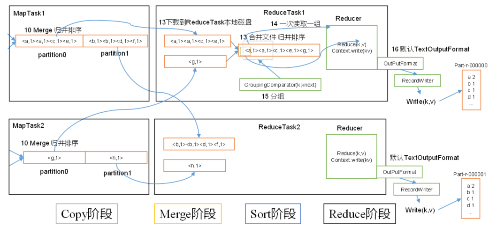

#### ReduceTask几个阶段

##### 1.Copy阶段

​	ReduceTask从各个MapTask上远程拷贝一片数据，并针对某一片数据，如果其大小超过一定阈值，则写到磁盘上，否则直接放到内存中。

##### 2.Merge阶段

​	在远程拷贝数据的同时，ReduceTask启动了两个后台线程对内存和磁盘上的文件进行合并，以防止内存使用过多或磁盘上文件过多。

##### 3.Sort阶段

​	按照MapReduce语义，用户编写reduce()函数输入数据是按key进行聚集的一组数据。为了将key相同的数据聚在一起，Hadoop采用了基于排序的策略。由于各个MapTask已经实现对自己的处理结果进行了局部排序，因此，ReduceTask只需对所有数据进行一次归并排序即可。

##### 4.Reduce阶段

​	reduce()函数将计算结果写到HDFS上。

#### 设置ReduceTask并行度（个数）

​	ReduceTask的并行度同样影响整个Job的执行并发度和执行效率，但与MapTask的并发数由切片数决定不同，ReduceTask数量的决定是可以直接手动设置：

```java
// 默认值是1，手动设置为4
job.setNumReduceTasks(4);
```

实验：测试ReduceTask多少合适

（1）实验环境：1个Master节点，16个Slave节点：CPU:8GHZ，内存: 2G

（2）实验结论：

下表展示了测试结果，改变ReduceTask （数据量为1GB）

| MapTask =16 |      |      |      |      |      |      |      |      |      |      |
| ----------- | ---- | ---- | ---- | ---- | ---- | ---- | ---- | ---- | ---- | ---- |
| ReduceTask  | 1    | 5    | 10   | 15   | 16   | 20   | 25   | 30   | 45   | 60   |
| 总时间      | 892  | 146  | 110  | 92   | 88   | 100  | 128  | 101  | 145  | 104  |

**注意事项**

1. ReduceTask=0，表示没有Reduce阶段，输出文件个数和Map个数一致。

2. ReduceTask默认值就是1，所以输出文件个数为一个。
3. 如果数据分布不均匀，就有可能在Reduce阶段产生数据倾斜。
4. ReduceTask数量并不是任意设置，还要考虑业务逻辑需求，有些情况下，需要计算全局汇总结果，就只能有1个ReduceTask。
5. 具体多少个ReduceTask，需要根据集群性能而定。
6. 如果分区数不是1，但是ReduceTask为1，是否执行分区过程。答案是：不执行分区过程。因为在MapTask的源码中，执行分区的前提是先判断ReduceNum个数是否大于1。不大于1肯定不执行。

### OutputFormat数据输出

#### OutputFormat接口实现类

​	`OutputFormat`是MapReduce输出的基类，所有实现MapReduce输出都实现了 `OutputFormat`接口。下面我们介绍几种常见的`OutputFormat`实现类。

1．文本输出`TextOutputFormat`

​        默认的输出格式是`TextOutputFormat`，它把每条记录写为文本行。它的键和值可以是任意类型，因为`TextOutputFormat`调用toString()方法把它们转换为字符串。

2．`SequenceFileOutputFormat`

 将`SequenceFileOutputFormat`输出作为后续 `MapReduce`任务的输入，这便是一种好的输出格式，因为它的格式紧凑，很容易被压缩。

#### 自定义OutPutFormat

使用场景

为了实现控制最终文件的输出路径和输出格式，可以自定义`OutputFormat`。

例如：要在一个MapReduce程序中根据数据的不同输出两类结果到不同目录，这类灵活的输出需求可以通过自定义`OutputFormat`来实现。

自定义`OutputFormat`步骤

1. 自定义一个类继承`FileOutputFormat`。
2. 改写`RecordWriter`，具体改写输出数据的方法`write()`。

#### 自定义案例

##### 1.需求

过滤输入的log日志，包含neuedu的网站输出到e:/neuedu.log，不包含neuedu的网站输出到e:/other.log。

```
http://www.baidu.com
http://www.google.com
http://cn.bing.com
http://www.neuedu.com
http://www.sohu.com
http://www.sina.com
http://www.sin2a.com
http://www.sin2desa.com
http://www.sindsafa.com
```

期望输出数据：

neuedu.log

```
http://www.neuedu.com
```

other.log

```
http://www.baidu.com
http://www.google.com
http://cn.bing.com
http://www.sohu.com
http://www.sina.com
http://www.sin2a.com
http://www.sin2desa.com
http://www.sindsafa.com
```

##### 2.需求分析

​	过滤输出输入文件，包含`neuedu`的输出到`neuedu.log`，通过自定义`OutPutFormat`实现。

##### 3. 代码实现

1. 编写`FilterOutPutFormat`类

   ```java
   package com.neuedu.filter;
   
   import org.apache.hadoop.fs.FSDataOutputStream;
   import org.apache.hadoop.fs.FileSystem;
   import org.apache.hadoop.fs.Path;
   import org.apache.hadoop.io.IOUtils;
   import org.apache.hadoop.io.LongWritable;
   import org.apache.hadoop.io.Text;
   import org.apache.hadoop.mapreduce.RecordWriter;
   import org.apache.hadoop.mapreduce.TaskAttemptContext;
   import org.apache.hadoop.mapreduce.lib.output.FileOutputFormat;
   
   import java.io.IOException;
   
   public class FilterOutPutFormat extends FileOutputFormat<LongWritable, Text> {
       @Override
       public RecordWriter<LongWritable, Text> getRecordWriter(TaskAttemptContext job) throws IOException, InterruptedException {
   
           FilterRecordWriter filterRecordWriter = new FilterRecordWriter();
           filterRecordWriter.init(job);
           return filterRecordWriter;
       }
   
   
       public static class FilterRecordWriter extends RecordWriter<LongWritable,Text>{
   
           FSDataOutputStream neuedu;
           FSDataOutputStream other;
   
   
           public void init(TaskAttemptContext job) throws IOException {
               String outDir = job.getConfiguration().get(FileOutputFormat.OUTDIR);
               FileSystem fileSystem = FileSystem.get(job.getConfiguration());
               other = fileSystem.create(new Path(outDir+"/other.log"));
               neuedu = fileSystem.create(new Path(outDir+"/neuedu.log"));
           }
   
   
           @Override
           public void write(LongWritable key, Text value) throws IOException, InterruptedException {
               if(value.toString().contains("neuedu"))
                   neuedu.write((value.toString()+"\n").getBytes());
               else
                   other.write((value.toString()+"\n").getBytes());
           }
   
           @Override
           public void close(TaskAttemptContext context) throws IOException, InterruptedException {
               IOUtils.closeStream(other);
               IOUtils.closeStream(neuedu);
           }
       }
   }
   
   ```

2. 编写`FilterDriver`

   ```java
   package com.neuedu.filter;
   
   import org.apache.hadoop.conf.Configuration;
   import org.apache.hadoop.fs.Path;
   import org.apache.hadoop.mapreduce.Job;
   import org.apache.hadoop.mapreduce.lib.input.FileInputFormat;
   import org.apache.hadoop.mapreduce.lib.output.FileOutputFormat;
   
   import java.io.IOException;
   
   public class FilterDriver {
   
   
        public static void main(String[] args) throws IOException, ClassNotFoundException, InterruptedException {
                Job job = Job.getInstance(new Configuration());
   
                job.setJarByClass(FilterDriver.class);
   
                job.setOutputFormatClass(FilterOutPutFormat.class);
   
                FileInputFormat.setInputPaths(job, new Path("f:/address.txt"));
                FileOutputFormat.setOutputPath(job, new Path("f:/output"));
   
                boolean result = job.waitForCompletion(true);
                System.exit(result ? 0 : 1);
            }
   }
   
   ```

3. 测试运行

### Join多种应用

> 开始之前，回忆一下sql中的`join`关键字用法
>
> ```sql
> select * from student left join on classes on student.class_id = classes.id
> ```
>
> mapreduce中的join也用于处理多表关联的问题，后期学了**hive**，你会明白，我们可以像写sql一样写mapreduce

#### ReduceJoin

​	所谓**ReduceJoin**,就是指join的过程发生在reduce阶段。

#### ReduceJoin案例

##### 需求

​	两个文件`order.txt`和`pd.txt`分别订单表和商品表

订单`order.txt`

```
1001	01	1
1002	02	2
1003	03	3
1004	01	4
1005	02	5
1006	03	6
```

相当于订单表

| id   | pid  | amount |
| ---- | ---- | ------ |
| 1001 | 01   | 1      |
| 1002 | 02   | 2      |
| 1003 | 03   | 3      |
| 1004 | 01   | 4      |
| 1005 | 02   | 5      |
| 1006 | 03   | 6      |

商品`pd.txt`

```
01	小米
02	华为
03	格力
```

相当于商品表

| pid  | pname |
| ---- | ----- |
| 01   | 小米  |
| 02   | 华为  |
| 03   | 格力  |

最终结果

| id   | pname | amount |
| ---- | ----- | ------ |
| 1001 | 小米  | 1      |
| 1004 | 小米  | 4      |
| 1002 | 华为  | 2      |
| 1005 | 华为  | 5      |
| 1003 | 格力  | 3      |
| 1006 | 格力  | 6      |

##### 需求分析

​	要通过`ReduceJoin`实现以上工程，关键问题在于**key选择和key排序**,这里我们需要在map阶段指定key的排序规则，再在reduce阶段通过**GroupingComparator**进行分组

**key的排序规则**：

1. 第一排序规则为`pid`，将相同pid的数据靠在一起

2. 第二排序为`pname`，有`pname`的都是商品表里的数据，让他放在最前面


最终的排序结果如下：

```java
01	小米
1001	01	1
1004	01	4
02	华为
1002	02	2
1005	02	5
...
```

经过排序后再reduce阶段我们就可以通过自定义分组获取pid相同的数据，并且每组的第一条一定是商品信息，这样我们就可以给后续的数据设置pname，从而达到输出效果

##### 代码实现

1. 创建`OrderBean`

   ```java
   public static class OrderBean implements WritableComparable<OrderBean> {
   
       private String pid;
       private String oid;
       private Integer amount;
   
       public String getPid() {
           return pid;
       }
   
       public void setPid(String pid) {
           this.pid = pid;
       }
   
       public String getOid() {
           return oid;
       }
   
       public void setOid(String oid) {
           this.oid = oid;
       }
   
       public Integer getAmount() {
           return amount;
       }
   
       public void setAmount(Integer amount) {
           this.amount = amount;
       }
   
       public String getPname() {
           return pname;
       }
   
       public void setPname(String pname) {
           this.pname = pname;
       }
   
       private String pname;
   
   
       @Override
       public int compareTo(OrderBean o) {
           int compare = pid.compareTo(o.getPid());
   
           if (compare == 0) {
               compare = o.getPname().compareTo(this.getPname());
               if (compare == 0) {
                   compare = oid.compareTo(o.getOid());
               }
           }
           return  compare;
   
       }
   
       @Override
       public void write(DataOutput dataOutput) throws IOException {
           dataOutput.writeUTF(oid);
           dataOutput.writeUTF(pid);
           dataOutput.writeUTF(pname);
           dataOutput.writeInt(amount);
       }
   
       @Override
       public void readFields(DataInput dataInput) throws IOException {
           oid = dataInput.readUTF();
           pid = dataInput.readUTF();
           pname = dataInput.readUTF();
           amount = dataInput.readInt();
       }
   
       @Override
       public String toString() {
           return oid+"\t"+pname+"\t"+amount;
       }
   }
   ```

2. 创建Mapper

   ```java
   public static class RJMapper extends Mapper<LongWritable, Text,OrderBean, NullWritable>{
   
       private OrderBean k = new OrderBean();
       private String fileName;
   
       /**
            * 获取切片的文件原文件名，根据文件名来采取不同输出数据策略
            * @param context
            * @throws IOException
            * @throws InterruptedException
            */
       @Override
       protected void setup(Context context) throws IOException, InterruptedException {
           FileSplit inputSplit = (FileSplit) context.getInputSplit();
           fileName = inputSplit.getPath().getName();
       }
   
       @Override
       protected void map(LongWritable key, Text value, Context context) throws IOException, InterruptedException {
           String[] split = value.toString().split("\t");
           if(fileName.contains("order")){
               k.setOid(split[0]);
               k.setPid(split[1]);
               k.setAmount(Integer.valueOf(split[2]));
               k.setPname("");
           }else{
               k.setOid("");
               k.setPid(split[0]);
               k.setAmount(0);
               k.setPname(split[1]);
           }
           context.write(k,NullWritable.get());
       }
   }
   ```

3. 创建GroupingComparator

   ```java
   public static class RJGroupingComparator extends WritableComparator{
   
       public RJGroupingComparator() {
           super(OrderBean.class,true);
       }
   
       @Override
       public int compare(WritableComparable a, WritableComparable b) {
           OrderBean oa = (OrderBean) a;
           OrderBean ob = (OrderBean) b;
   
   
           return oa.getPid().compareTo(ob.getPid());
       }
   }
   ```

4. 创建Reducer

   ```java
    public static class  RJReducer extends Reducer<OrderBean, NullWritable,OrderBean, NullWritable>{
   
        @Override
        protected void reduce(OrderBean key, Iterable<NullWritable> values, Context context) throws IOException, InterruptedException {
            //拿到的第一个key就是商品表的数据，将商品pname设置给后续的key，然后写出
            values.iterator().next();
            String pname = key.getPname();
            while(values.iterator().hasNext()){
                values.iterator().next();
                key.setPname(pname);
                context.write(key,NullWritable.get());
            }
        }
    }
   ```

5. 创建Driver

   ```java
   public class RJDriver {
   
        public static void main(String[] args) throws IOException, ClassNotFoundException, InterruptedException {
                Job job = Job.getInstance(new Configuration());
   
                job.setMapperClass(RJMapper.class);
                job.setReducerClass(RJReducer.class);
   
                job.setMapOutputKeyClass(OrderBean.class);
                job.setMapOutputValueClass(NullWritable.class);
   
                job.setOutputKeyClass(OrderBean.class);
                job.setOutputValueClass(NullWritable.class);
   
                job.setGroupingComparatorClass(RJGroupingComparator.class);
   
                FileInputFormat.setInputPaths(job, new Path("f:/input"));
                FileOutputFormat.setOutputPath(job, new Path("f:/output"));
   
                boolean result = job.waitForCompletion(true);
                System.exit(result ? 0 : 1);
            }
   }
   ```

6. 测试运行

   ```
   1001	小米	1
   1004	小米	4
   1002	华为	2
   1005	华为	5
   1003	格力	3
   1006	格力	6
   ```

##### ReduceJoin总结：

**缺点**：这种方式中，合并的操作是在Reduce阶段完成，Reduce端的处理压力太大，Map节点的运算负载则很低，资源利用率不高，且在Reduce阶段极易产生数据倾斜。

#### MapJoin

​	Map Join适用于**一张表十分小**、一张表很大的场景。原因是我们在map阶段，如果所有表的数据量都很大，我们是无法在某一个MapTask中将整张表的数据全部加载进来的，那就失去了分布式的意义，因此，至少一张表的数据**要很小**。

##### 优点

>  思考：在Reduce端处理过多的表，非常容易产生数据倾斜。怎么办？
>
> 什么是数据倾斜？
>
> 假如我们有10万条数据，3个ReduceTask，那么其中有一个reduceTask的数据处理量是9万条，那么这就是数据倾斜。

在Map端缓存多张表，提前处理业务逻辑，这样增加Map端业务，减少Reduce端数据的压力，尽可能的减少数据倾斜。

##### 具体办法：采用DistributedCache

（1）在Mapper的setup阶段，将文件读取到缓存集合中。

（2）在驱动函数中加载缓存。

```java
// 缓存普通文件到Task运行节点。
job.addCacheFile(new URI("file://e:/cache/pd.txt"));
```

#### Map Join案例

##### 需求

​	同Reduce Join

##### 需求分析

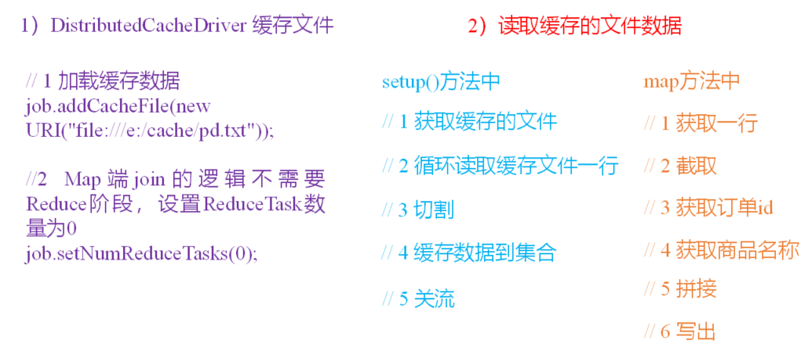

##### 实现代码

1. 创建驱动类，加载缓存

   ```java
   public static void main(String[] args) throws IOException, ClassNotFoundException, InterruptedException, URISyntaxException {
           Job job = Job.getInstance(new Configuration());
           job.setJarByClass(MJDriver.class);
   
           job.setMapperClass(MJMapper.class);
   
   
           job.setMapOutputKeyClass(RJDriver.OrderBean.class);
           job.setMapOutputValueClass(NullWritable.class);
   
           job.addCacheFile(new URI("file:///f:/input/pd.txt"));
   
           FileInputFormat.setInputPaths(job, new Path("f:/input/order.txt"));
           FileOutputFormat.setOutputPath(job, new Path("f:/output"));
   
   
           boolean result = job.waitForCompletion(true);
           System.exit(result ? 0 : 1);
       }
   }
   ```

2. 在Mapper中读取缓存

   ```java
   public static class MJMapper extends Mapper<LongWritable, Text, RJDriver.OrderBean, NullWritable> {
   
       Map<String,String> cache = new HashMap<>();
       RJDriver.OrderBean k = new RJDriver.OrderBean();
   
       @Override
       protected void setup(Context context) throws IOException, InterruptedException {
           String path = context.getCacheFiles()[0].getPath().toString();
           BufferedReader br = new BufferedReader(new FileReader(path));
           //hdfs开流
          //FileSystem fs = FileSystem.get(context.getConfiguration());
           //BufferedReader br = new BufferedReader(new InputStreamReader(fs.open(new Path(path)), "UTF-8"));
           String line;
           while(StringUtils.isNotEmpty(line = br.readLine())){
               String[] split = line.split("\t");
               cache.put(split[0],split[1]);
           }
       }
   
       @Override
       protected void map(LongWritable key, Text value, Context context) throws IOException, InterruptedException {
           String[] split = value.toString().split("\t");
           k.setPname(cache.get(split[1]));
           k.setPid(split[1]);
           k.setOid(split[0]);
           k.setAmount(Integer.valueOf(split[2]));
           context.write(k,NullWritable.get());
       }
   }
   ```

### 计数器应用

 	Hadoop为每个作业维护若干内置计数器，以描述多项指标。例如，某些计数器记录已处理的字节数和记录数，使用户可监控已处理的输入数据量和已产生的输出数据量。

##### 计数器API

1. 采用枚举的方式统计计数

   ```java
   enum MyCounter{MALFORORMED,NORMAL}
   //对枚举定义的自定义计数器加1
   context.getCounter(MyCounter.MALFORORMED).increment(1);
   ```

2. 采用计数器组、计数器名称的方式统计

   ```java
   context.getCounter("counterGroup", "counter").increment(1);
   ```

   组名和计数器名称随便起，但最好有意义。

3. 计数结果在程序运行后的控制台上查看。

##### 计数器案例实操

详见数据清洗案例。

### 数据清洗（ETL）

​	在运行核心业务MapReduce程序之前，往往要先对数据进行清洗，清理掉不符合用户要求的数据。清理的过程往往只需要运行Mapper程序，不需要运行Reduce程序。

> 实际开发者，不会用Mapper去进行数据进行ETL，ETL工具多了去了

**注意**：下面的例子**主要用于演示计数器**，而不是ETL

#### 数据清洗案例1

##### 1.需求

去除日志中字段长度小于等于11的日志。

输入文件`web.log`

```java
194.237.142.21 - - [18/Sep/2013:06:49:18 +0000] "GET /wp-content/uploads/2013/07/rstudio-git3.png HTTP/1.1" 304 0 "-" "Mozilla/4.0 (compatible;)"
183.49.46.228 - - [18/Sep/2013:06:49:23 +0000] "-" 400 0 "-" "-"
163.177.71.12 - - [18/Sep/2013:06:49:33 +0000] "HEAD / HTTP/1.1" 200 20 "-" "DNSPod-Monitor/1.0"
163.177.71.12 - - [18/Sep/2013:06:49:36 +0000] "HEAD / HTTP/1.1" 200 20 "-" "DNSPod-Monitor/1.0"
101.226.68.137 - - [18/Sep/2013:06:49:42 +0000] "HEAD / HTTP/1.1" 200 20 "-" "DNSPod-Monitor/1.0"
101.226.68.137 - - [18/Sep/2013:06:49:45 +0000] "HEAD / HTTP/1.1" 200 20 "-" "DNSPod-Monitor/1.0"
60.208.6.156 - - [18/Sep/2013:06:49:48 +0000] "GET /wp-content/uploads/2013/07/rcassandra.png HTTP/1.0" 200 185524 "http://cos.name/category/software/packages/" "Mozilla/5.0 (Windows NT 6.1) AppleWebKit/537.36 (KHTML, like Gecko) Chrome/29.0.1547.66 Safari/537.36"
...........
```

**期望输出数据**：每行字段长度都大于11。

##### 2.需求分析

需要在Map阶段对输入的数据根据规则进行过滤清洗。

##### 3.实现代码

1. 编写`LogMapper`类

   ```java
   public static class LogMapper extends Mapper<LongWritable, Text,Text, BooleanWritable>{
   
       private Text k = new Text();
       private BooleanWritable v = new BooleanWritable(false);
   
       @Override
       protected void map(LongWritable key, Text value, Context context) throws IOException, InterruptedException {
           String[] split = value.toString().split(" ");
           for(String field:split){
               k.set(field);
               if(field.length()>11){
                   v.set(true);
                   context.getCounter("logValid","true").increment(1);
               }else{
                   v.set(true);
                   context.getCounter("logValid","false").increment(1);
               }
               context.write(k,v);
           }
       }
   }
   ```

2. 编写`LogDriver`类

   ```java
   public class LogDriver {
   
        public static void main(String[] args) throws IOException, ClassNotFoundException, InterruptedException {
                Job job = Job.getInstance(new Configuration());
                job.setJarByClass(LogDriver.class);
   
                job.setMapperClass(LogMapper.class);
   
                job.setMapOutputKeyClass(Text.class);
                job.setMapOutputValueClass(BooleanWritable.class);
   
                FileInputFormat.setInputPaths(job, new Path("f:/web.log"));
                FileOutputFormat.setOutputPath(job, new Path("f:/output"));
   
                boolean result = job.waitForCompletion(true);
                System.exit(result ? 0 : 1);
            }
   }
   ```

3. 查看运行日志

   ```
   ...
   logValid
   		false=189446
   		true=88015
   ....
   ```

#### 数据清洗案例2

##### 1.需求

去除日志中状态码为200的日志。

输入文件`web.log`

```java
194.237.142.21 - - [18/Sep/2013:06:49:18 +0000] "GET /wp-content/uploads/2013/07/rstudio-git3.png HTTP/1.1" 304 0 "-" "Mozilla/4.0 (compatible;)"
183.49.46.228 - - [18/Sep/2013:06:49:23 +0000] "-" 400 0 "-" "-"
163.177.71.12 - - [18/Sep/2013:06:49:33 +0000] "HEAD / HTTP/1.1" 200 20 "-" "DNSPod-Monitor/1.0"
163.177.71.12 - - [18/Sep/2013:06:49:36 +0000] "HEAD / HTTP/1.1" 200 20 "-" "DNSPod-Monitor/1.0"
101.226.68.137 - - [18/Sep/2013:06:49:42 +0000] "HEAD / HTTP/1.1" 200 20 "-" "DNSPod-Monitor/1.0"
101.226.68.137 - - [18/Sep/2013:06:49:45 +0000] "HEAD / HTTP/1.1" 200 20 "-" "DNSPod-Monitor/1.0"
60.208.6.156 - - [18/Sep/2013:06:49:48 +0000] "GET /wp-content/uploads/2013/07/rcassandra.png HTTP/1.0" 200 185524 "http://cos.name/category/software/packages/" "Mozilla/5.0 (Windows NT 6.1) AppleWebKit/537.36 (KHTML, like Gecko) Chrome/29.0.1547.66 Safari/537.36"
...........
```

**期望输出数据**：状态码不为200的字段。

##### 2.需求分析

需要在Map阶段对输入的数据根据规则进行过滤清洗。

##### 3.实现代码

1. 编写`LogFilterMapper`类

   ```java
   public static class LogFilterMapper extends Mapper<LongWritable, Text,Text, NullWritable>{
   
       private Text k = new Text();
       private BooleanWritable v = new BooleanWritable(false);
   
       @Override
       protected void map(LongWritable key, Text value, Context context) throws IOException, InterruptedException {
           if(!value.toString().contains(" 200 ")){
               context.getCounter("logValid","false").increment(1);
               context.write(value,NullWritable.get());
           }else{
               context.getCounter("logValid","true").increment(1);
   
           }
       }
   }
   ```

2. 编写`LogFilterDriver`类

   ```java
   public class LogFilterDriver {
   
        public static void main(String[] args) throws IOException, ClassNotFoundException, InterruptedException {
                Job job = Job.getInstance(new Configuration());
                job.setJarByClass(LogFilterDriver.class);
   
                job.setMapperClass(LogFilterMapper.class);
   
                job.setMapOutputKeyClass(Text.class);
                job.setMapOutputValueClass(NullWritable.class);
   
                FileInputFormat.setInputPaths(job, new Path("f:/web.log"));
                FileOutputFormat.setOutputPath(job, new Path("f:/output"));
   
                boolean result = job.waitForCompletion(true);
                System.exit(result ? 0 : 1);
            }
   }
   ```

3. 查看运行日志

   ```
   ...
   logValid
   		false=2279
   		true=12340
   ....
   ```

   查看输入文件

   ```
   1.162.203.134 - - [18/Sep/2013:13:47:51 +0000] "-" 400 0 "-" "-"
   1.202.186.37 - - [18/Sep/2013:15:39:29 +0000] "-" 400 0 "-" "-"
   1.202.186.37 - - [18/Sep/2013:15:42:51 +0000] "-" 400 0 "-" "-"
   1.202.186.37 - - [18/Sep/2013:15:42:51 +0000] "-" 400 0 "-" "-"
   1.202.186.37 - - [18/Sep/2013:15:42:51 +0000] "-" 400 0 "-" "-"
   1.202.186.37 - - [18/Sep/2013:15:42:51 +0000] "-" 400 0 "-" "-"
   1.202.186.37 - - [18/Sep/2013:15:42:51 +0000] "-" 400 0 "-" "-"
   1.202.186.37 - - [19/Sep/2013:01:57:51 +0000] "-" 400 0 "-" "-"
   1.202.186.37 - - [19/Sep/2013:01:57:51 +0000] "-" 400 0 "-" "-"
   1.202.186.37 - - [19/Sep/2013:01:57:51 +0000] "-" 400 0 "-" "-"
   1.202.186.37 - - [19/Sep/2013:01:57:51 +0000] "-" 400 0 "-" "-"
   1.202.186.37 - - [19/Sep/2013:01:57:51 +0000] "-" 400 0 "-" "-"
   ```

### MapReduce开发总结

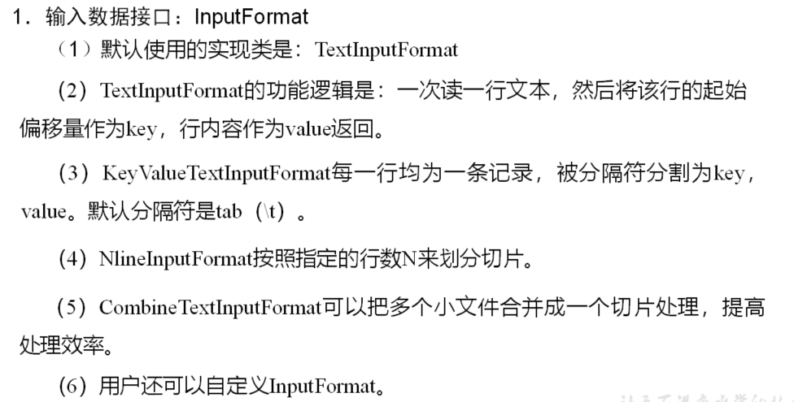

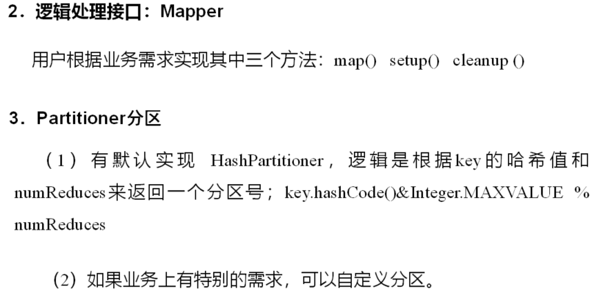

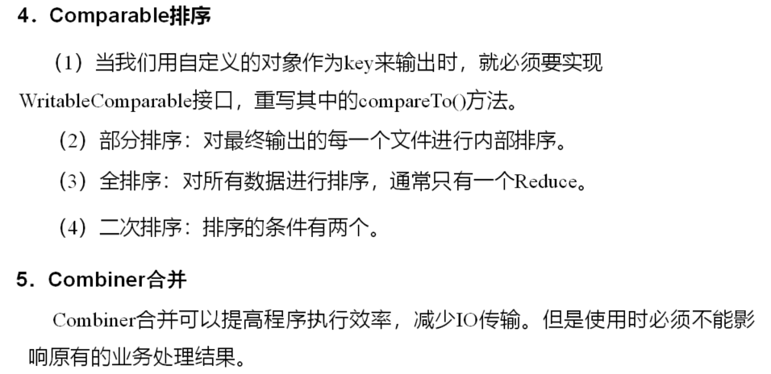

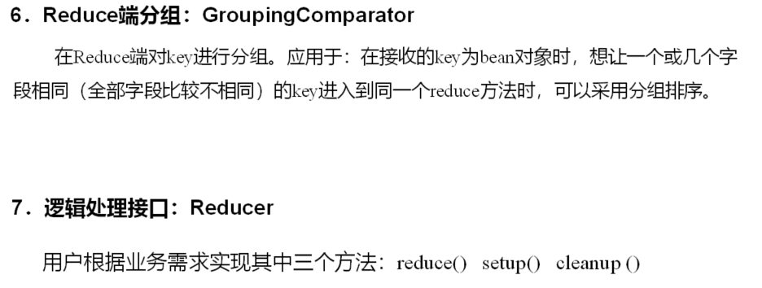

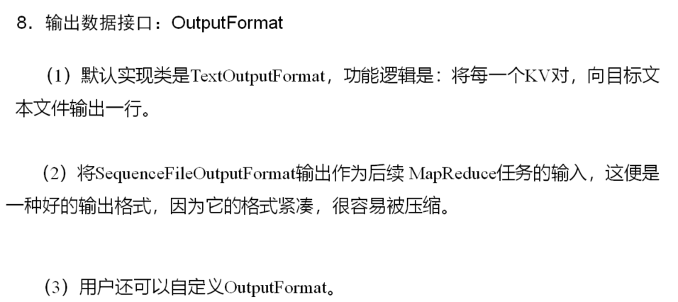

## MapReduce扩展案例

### 1.倒排索引案例（多job串联）

#### 需求

有大量的文本（文档、网页），需要建立搜索索引

##### 1.输入数据

`a.txt`

```
neuedu pingping
neuedu ss
neuedu ss
```

`b.txt`

```
neuedu pingping
neuedu pingping
pingping ss
```

`c.txt`

```
neuedu ss
neuedu pingping
```

##### 2.期望输出数据

建立如下索引

```
neuedu	c.txt-->2	b.txt-->2	a.txt-->3
pingping	c.txt-->1	b.txt-->3	a.txt-->1	
ss	c.txt-->1	b.txt-->1	a.txt-->2	
```

#### 需求分析

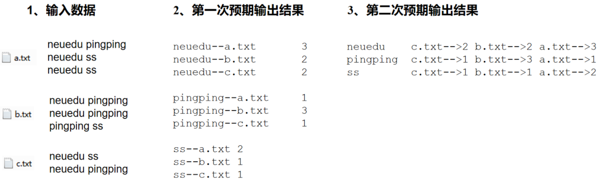

> 一次mapreduce解决不了的问题，我们来两次

#### 代码实现

##### 1.第一次数据处理

###### 1.OneIndexMapper

```java
package com.neuedu.mapreduce.index;
import java.io.IOException;
import org.apache.hadoop.io.IntWritable;
import org.apache.hadoop.io.LongWritable;
import org.apache.hadoop.io.Text;
import org.apache.hadoop.mapreduce.Mapper;
import org.apache.hadoop.mapreduce.lib.input.FileSplit;

public class OneIndexMapper extends Mapper<LongWritable, Text, Text, IntWritable>{
	
	String name;
	Text k = new Text();
	IntWritable v = new IntWritable();
	
	@Override
	protected void setup(Context context)throws IOException, InterruptedException {

		// 获取文件名称
		FileSplit split = (FileSplit) context.getInputSplit();
		
		name = split.getPath().getName();
	}
	
	@Override
	protected void map(LongWritable key, Text value, Context context)	throws IOException, InterruptedException {

		// 1 获取1行
		String line = value.toString();
		
		// 2 切割
		String[] fields = line.split(" ");
		
		for (String word : fields) {

			// 3 拼接
			k.set(word+"--"+name);
			v.set(1);
			
			// 4 写出
			context.write(k, v);
		}
	}
}
```

###### 2.OneIndexReducer

```java
package com.neuedu.mapreduce.index;
import java.io.IOException;
import org.apache.hadoop.io.IntWritable;
import org.apache.hadoop.io.Text;
import org.apache.hadoop.mapreduce.Reducer;

public class OneIndexReducer extends Reducer<Text, IntWritable, Text, IntWritable>{
	
IntWritable v = new IntWritable();

	@Override
	protected void reduce(Text key, Iterable<IntWritable> values,Context context) throws IOException, InterruptedException {
		
		int sum = 0;

		// 1 累加求和
		for(IntWritable value: values){
			sum +=value.get();
		}
		
       v.set(sum);

		// 2 写出
		context.write(key, v);
	}
}
```

###### 3.OneIndexDriver

```java
package com.neuedu.mapreduce.index;
import org.apache.hadoop.conf.Configuration;
import org.apache.hadoop.fs.Path;
import org.apache.hadoop.io.IntWritable;
import org.apache.hadoop.io.Text;
import org.apache.hadoop.mapreduce.Job;
import org.apache.hadoop.mapreduce.lib.input.FileInputFormat;
import org.apache.hadoop.mapreduce.lib.output.FileOutputFormat;

public class OneIndexDriver {

	public static void main(String[] args) throws Exception {

       // 输入输出路径需要根据自己电脑上实际的输入输出路径设置
		args = new String[] { "e:/input/inputoneindex", "e:/output5" };

		Configuration conf = new Configuration();

		Job job = Job.getInstance(conf);
		job.setJarByClass(OneIndexDriver.class);

		job.setMapperClass(OneIndexMapper.class);
		job.setReducerClass(OneIndexReducer.class);

		job.setMapOutputKeyClass(Text.class);
		job.setMapOutputValueClass(IntWritable.class);
		
		job.setOutputKeyClass(Text.class);
		job.setOutputValueClass(IntWritable.class);

		FileInputFormat.setInputPaths(job, new Path(args[0]));
		FileOutputFormat.setOutputPath(job, new Path(args[1]));

		job.waitForCompletion(true);
	}
}
```

###### 4.查看第一次输出结果

```bash
neuedu--a.txt	3
neuedu--b.txt	2
neuedu--c.txt	2
pingping--a.txt	1
pingping--b.txt	3
pingping--c.txt	1
ss--a.txt	2
ss--b.txt	1
ss--c.txt	1
```

##### 2.第二次处理

###### 1.TwoIndexMapper

```java
package com.neuedu.mapreduce.index;
import java.io.IOException;
import org.apache.hadoop.io.LongWritable;
import org.apache.hadoop.io.Text;
import org.apache.hadoop.mapreduce.Mapper;

public class TwoIndexMapper extends Mapper<LongWritable, Text, Text, Text>{

	Text k = new Text();
	Text v = new Text();
	
	@Override
	protected void map(LongWritable key, Text value, Context context) throws IOException, InterruptedException {
		
		// 1 获取1行数据
		String line = value.toString();
		
		// 2用“--”切割
		String[] fields = line.split("--");
		
		k.set(fields[0]);
		v.set(fields[1]);
		
		// 3 输出数据
		context.write(k, v);
	}
}
```

###### 2.TwoIndexReducer

```java
package com.neuedu.mapreduce.index;
import java.io.IOException;
import org.apache.hadoop.io.Text;
import org.apache.hadoop.mapreduce.Reducer;
public class TwoIndexReducer extends Reducer<Text, Text, Text, Text> {

Text v = new Text();

	@Override
	protected void reduce(Text key, Iterable<Text> values, Context context) throws IOException, InterruptedException {
		// neuedu a.txt 3
		// neuedu b.txt 2
		// neuedu c.txt 2

		// neuedu c.txt-->2 b.txt-->2 a.txt-->3

		StringBuilder sb = new StringBuilder();

        // 1 拼接
		for (Text value : values) {
			sb.append(value.toString().replace("\t", "-->") + "\t");
		}

v.set(sb.toString());

		// 2 写出
		context.write(key, v);
	}
}
```

###### 3.TwoIndexDriver

```java
package com.neuedu.mapreduce.index;
import org.apache.hadoop.conf.Configuration;
import org.apache.hadoop.fs.Path;
import org.apache.hadoop.io.Text;
import org.apache.hadoop.mapreduce.Job;
import org.apache.hadoop.mapreduce.lib.input.FileInputFormat;
import org.apache.hadoop.mapreduce.lib.output.FileOutputFormat;

public class TwoIndexDriver {

	public static void main(String[] args) throws Exception {

       // 输入输出路径需要根据自己电脑上实际的输入输出路径设置
args = new String[] { "e:/input/inputtwoindex", "e:/output6" };

		Configuration config = new Configuration();
		Job job = Job.getInstance(config);

job.setJarByClass(TwoIndexDriver.class);
		job.setMapperClass(TwoIndexMapper.class);
		job.setReducerClass(TwoIndexReducer.class);

		job.setMapOutputKeyClass(Text.class);
		job.setMapOutputValueClass(Text.class);
		
		job.setOutputKeyClass(Text.class);
		job.setOutputValueClass(Text.class);

		FileInputFormat.setInputPaths(job, new Path(args[0]));
		FileOutputFormat.setOutputPath(job, new Path(args[1]));

		boolean result = job.waitForCompletion(true);
System.exit(result?0:1);
	}
}
```

###### 4.第二次查看最终结

```
neuedu	c.txt-->2	b.txt-->2	a.txt-->3	
pingping	c.txt-->1	b.txt-->3	a.txt-->1	
ss	c.txt-->1	b.txt-->1	a.txt-->2	
```

### 2.TopN案例

#### 需求

输出手机用户中使用总流量在前十位的用户信息

##### 1.输入数据

```
13470253144	180	180	360
13509468723	7335	110349	117684
13560439638	918	4938	5856
13568436656	3597	25635	29232
13590439668	1116	954	2070
13630577991	6960	690	7650
13682846555	1938	2910	4848
13729199489	240	0	240
13736230513	2481	24681	27162
13768778790	120	120	240
13846544121	264	0	264
13956435636	132	1512	1644
13966251146	240	0	240
13975057813	11058	48243	59301
13992314666	3008	3720	6728
15043685818	3659	3538	7197
15910133277	3156	2936	6092
15959002129	1938	180	2118
18271575951	1527	2106	3633
18390173782	9531	2412	11943
84188413	4116	1432	5548
```

##### 2.期望输出数据

```
13509468723	7335	110349	117684
13975057813	11058	48243	59301
13568436656	3597	25635	29232
13736230513	2481	24681	27162
18390173782	9531	2412	11943
13630577991	6960	690	7650
15043685818	3659	3538	7197
13992314666	3008	3720	6728
15910133277	3156	2936	6092
13560439638	918	4938	5856
```

#### 需求分析

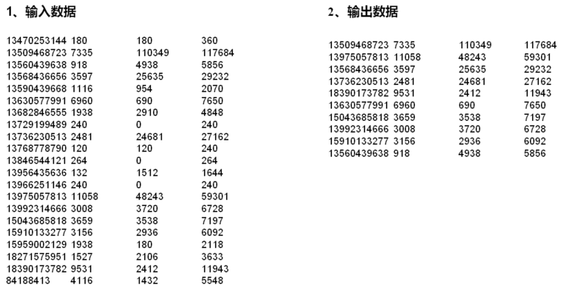

#### 实现代码

##### 1.编写FlowBean类

```java
package com.neuedu.mr.top;

import java.io.DataInput;
import java.io.DataOutput;
import java.io.IOException;

import org.apache.hadoop.io.WritableComparable;

public class FlowBean implements WritableComparable<FlowBean>{

	private long upFlow;
	private long downFlow;
	private long sumFlow;
	
	
	public FlowBean() {
		super();
	}

	public FlowBean(long upFlow, long downFlow) {
		super();
		this.upFlow = upFlow;
		this.downFlow = downFlow;
	}

	@Override
	public void write(DataOutput out) throws IOException {
		out.writeLong(upFlow);
		out.writeLong(downFlow);
		out.writeLong(sumFlow);
	}

	@Override
	public void readFields(DataInput in) throws IOException {
		upFlow = in.readLong();
		downFlow = in.readLong();
		sumFlow = in.readLong();
	}

	public long getUpFlow() {
		return upFlow;
	}

	public void setUpFlow(long upFlow) {
		this.upFlow = upFlow;
	}

	public long getDownFlow() {
		return downFlow;
	}

	public void setDownFlow(long downFlow) {
		this.downFlow = downFlow;
	}

	public long getSumFlow() {
		return sumFlow;
	}

	public void setSumFlow(long sumFlow) {
		this.sumFlow = sumFlow;
	}

	@Override
	public String toString() {
		return upFlow + "\t" + downFlow + "\t" + sumFlow;
	}

	public void set(long downFlow2, long upFlow2) {
		downFlow = downFlow2;
		upFlow = upFlow2;
		sumFlow = downFlow2 + upFlow2;
	}

	@Override
	public int compareTo(FlowBean bean) {
		
		int result;
		
		if (this.sumFlow > bean.getSumFlow()) {
			result = -1;
		}else if (this.sumFlow < bean.getSumFlow()) {
			result = 1;
		}else {
			result = 0;
		}
		
		return result;
	}
}
```

##### 2.编写TopNMapper类

```java
package com.neuedu.mr.top;

import java.io.IOException;
import java.util.Iterator;
import java.util.TreeMap;
import org.apache.hadoop.io.LongWritable;
import org.apache.hadoop.io.Text;
import org.apache.hadoop.mapreduce.Mapper;

public class TopNMapper extends Mapper<LongWritable, Text, FlowBean, Text>{
	
	// 定义一个TreeMap作为存储数据的容器（天然按key排序）
	private TreeMap<FlowBean, Text> flowMap = new TreeMap<FlowBean, Text>();
	private FlowBean kBean;
	
	@Override
	protected void map(LongWritable key, Text value, Context context)	throws IOException, InterruptedException {
		
		kBean = new FlowBean();
		Text v = new Text();
		
		// 1 获取一行
		String line = value.toString();
		
		// 2 切割
		String[] fields = line.split("\t");
		
		// 3 封装数据
		String phoneNum = fields[0];
		long upFlow = Long.parseLong(fields[1]);
		long downFlow = Long.parseLong(fields[2]);
		long sumFlow = Long.parseLong(fields[3]);
		
		kBean.setDownFlow(downFlow);
		kBean.setUpFlow(upFlow);
		kBean.setSumFlow(sumFlow);
		
		v.set(phoneNum);
		
		// 4 向TreeMap中添加数据
		flowMap.put(kBean, v);
		
		// 5 限制TreeMap的数据量，超过10条就删除掉流量最小的一条数据
		if (flowMap.size() > 10) {
//		flowMap.remove(flowMap.firstKey());
			flowMap.remove(flowMap.lastKey());		
		}
	}
	
	@Override
	protected void cleanup(Context context) throws IOException, InterruptedException {
		
		// 6 遍历treeMap集合，输出数据
		Iterator<FlowBean> bean = flowMap.keySet().iterator();

		while (bean.hasNext()) {

			FlowBean k = bean.next();

			context.write(k, flowMap.get(k));
		}
	}
}
```

##### 3.编写TopNReducer类

```java
package com.neuedu.mr.top;

import java.io.IOException;
import java.util.Iterator;
import java.util.TreeMap;

import org.apache.hadoop.io.Text;
import org.apache.hadoop.mapreduce.Reducer;

public class TopNReducer extends Reducer<FlowBean, Text, Text, FlowBean> {

	// 定义一个TreeMap作为存储数据的容器（天然按key排序）
	TreeMap<FlowBean, Text> flowMap = new TreeMap<FlowBean, Text>();

	@Override
	protected void reduce(FlowBean key, Iterable<Text> values, Context context)throws IOException, InterruptedException {

		for (Text value : values) {

			 FlowBean bean = new FlowBean();
			 bean.set(key.getDownFlow(), key.getUpFlow());

			 // 1 向treeMap集合中添加数据
			flowMap.put(bean, new Text(value));

			// 2 限制TreeMap数据量，超过10条就删除掉流量最小的一条数据
			if (flowMap.size() > 10) {
				// flowMap.remove(flowMap.firstKey());
flowMap.remove(flowMap.lastKey());
			}
		}
	}

	@Override
	protected void cleanup(Reducer<FlowBean, Text, Text, FlowBean>.Context context) throws IOException, InterruptedException {

		// 3 遍历集合，输出数据
		Iterator<FlowBean> it = flowMap.keySet().iterator();

		while (it.hasNext()) {

			FlowBean v = it.next();

			context.write(new Text(flowMap.get(v)), v);
		}
	}
}
```

##### 4.编写TopNDriver类

```java
package com.neuedu.mr.top;

import org.apache.hadoop.conf.Configuration;
import org.apache.hadoop.fs.Path;
import org.apache.hadoop.io.Text;
import org.apache.hadoop.mapreduce.Job;
import org.apache.hadoop.mapreduce.lib.input.FileInputFormat;
import org.apache.hadoop.mapreduce.lib.output.FileOutputFormat;

public class TopNDriver {

	public static void main(String[] args) throws Exception {
		
		args  = new String[]{"e:/output1","e:/output3"};
		
		// 1 获取配置信息，或者job对象实例
		Configuration configuration = new Configuration();
		Job job = Job.getInstance(configuration);

		// 6 指定本程序的jar包所在的本地路径
		job.setJarByClass(TopNDriver.class);

		// 2 指定本业务job要使用的mapper/Reducer业务类
		job.setMapperClass(TopNMapper.class);
		job.setReducerClass(TopNReducer.class);

		// 3 指定mapper输出数据的kv类型
		job.setMapOutputKeyClass(FlowBean.class);
		job.setMapOutputValueClass(Text.class);

		// 4 指定最终输出的数据的kv类型
		job.setOutputKeyClass(Text.class);
		job.setOutputValueClass(FlowBean.class);

		// 5 指定job的输入原始文件所在目录
		FileInputFormat.setInputPaths(job, new Path(args[0]));
		FileOutputFormat.setOutputPath(job, new Path(args[1]));

		// 7 将job中配置的相关参数，以及job所用的java类所在的jar包， 提交给yarn去运行
		boolean result = job.waitForCompletion(true);
		System.exit(result ? 0 : 1);
	}
}
```

### 3.找博客共同好友案例

#### 需求

​	以下是博客的好友列表数据，冒号前是一个用户，冒号后是该用户的所有好友（数据中的好友关系是单向的）

​	求出哪些人两两之间有共同好友，及他俩的共同好友都有谁？

##### 1.数据输入

```
A:B,C,D,F,E,O
B:A,C,E,K
C:F,A,D,I
D:A,E,F,L
E:B,C,D,M,L
F:A,B,C,D,E,O,M
G:A,C,D,E,F
H:A,C,D,E,O
I:A,O
J:B,O
K:A,C,D
L:D,E,F
M:E,F,G
O:A,H,I,J
```

##### 需求分析

先求出A、B、C、….等是谁的好友

**第一次输出结果**

```
A	I,K,C,B,G,F,H,O,D,
B	A,F,J,E,
C	A,E,B,H,F,G,K,
D	G,C,K,A,L,F,E,H,
E	G,M,L,H,A,F,B,D,
F	L,M,D,C,G,A,
G	M,
H	O,
I	O,C,
J	O,
K	B,
L	D,E,
M	E,F,
O	A,H,I,J,F,
```

**第二次输出结果**

```
A-B	E C 
A-C	D F 
A-D	E F 
A-E	D B C 
A-F	O B C D E 
A-G	F E C D 
A-H	E C D O 
A-I	O 
A-J	O B 
A-K	D C 
A-L	F E D 
A-M	E F 
B-C	A 
B-D	A E 
B-E	C 
B-F	E A C 
B-G	C E A 
B-H	A E C 
B-I	A 
B-K	C A 
B-L	E 
B-M	E 
B-O	A 
C-D	A F 
C-E	D 
C-F	D A 
C-G	D F A 
C-H	D A 
C-I	A 
C-K	A D 
C-L	D F 
C-M	F 
C-O	I A 
D-E	L 
D-F	A E 
D-G	E A F 
D-H	A E 
D-I	A 
D-K	A 
D-L	E F 
D-M	F E 
D-O	A 
E-F	D M C B 
E-G	C D 
E-H	C D 
E-J	B 
E-K	C D 
E-L	D 
F-G	D C A E 
F-H	A D O E C 
F-I	O A 
F-J	B O 
F-K	D C A 
F-L	E D 
F-M	E 
F-O	A 
G-H	D C E A 
G-I	A 
G-K	D A C 
G-L	D F E 
G-M	E F 
G-O	A 
H-I	O A 
H-J	O 
H-K	A C D 
H-L	D E 
H-M	E 
H-O	A 
I-J	O 
I-K	A 
I-O	A 
K-L	D 
K-O	A 
L-M	E F
```

#### 代码实现

##### 1.第一次Mapper类

```java
package com.neuedu.mapreduce.friends;
import java.io.IOException;
import org.apache.hadoop.io.LongWritable;
import org.apache.hadoop.io.Text;
import org.apache.hadoop.mapreduce.Mapper;

public class OneShareFriendsMapper extends Mapper<LongWritable, Text, Text, Text>{
	
	@Override
	protected void map(LongWritable key, Text value, Mapper<LongWritable, Text, Text, Text>.Context context)
			throws IOException, InterruptedException {

		// 1 获取一行 A:B,C,D,F,E,O
		String line = value.toString();
		
		// 2 切割
		String[] fields = line.split(":");
		
		// 3 获取person和好友
		String person = fields[0];
		String[] friends = fields[1].split(",");
		
		// 4写出去
		for(String friend: friends){

			// 输出 <好友，人>
			context.write(new Text(friend), new Text(person));
		}
	}
}
```

##### 2.第一次Reducer类

```java
package com.neuedu.mapreduce.friends;
import java.io.IOException;
import org.apache.hadoop.io.Text;
import org.apache.hadoop.mapreduce.Reducer;

public class OneShareFriendsReducer extends Reducer<Text, Text, Text, Text>{
	
	@Override
	protected void reduce(Text key, Iterable<Text> values, Context context)throws IOException, InterruptedException {
		
		StringBuffer sb = new StringBuffer();

		//1 拼接
		for(Text person: values){
			sb.append(person).append(",");
		}
		
		//2 写出
		context.write(key, new Text(sb.toString()));
	}
}
```

##### 3.第一次Driver类

```java
package com.neuedu.mapreduce.friends;
import org.apache.hadoop.conf.Configuration;
import org.apache.hadoop.fs.Path;
import org.apache.hadoop.io.Text;
import org.apache.hadoop.mapreduce.Job;
import org.apache.hadoop.mapreduce.lib.input.FileInputFormat;
import org.apache.hadoop.mapreduce.lib.output.FileOutputFormat;

public class OneShareFriendsDriver {

	public static void main(String[] args) throws Exception {
		
// 1 获取job对象
		Configuration configuration = new Configuration();
		Job job = Job.getInstance(configuration);
		
		// 2 指定jar包运行的路径
		job.setJarByClass(OneShareFriendsDriver.class);

		// 3 指定map/reduce使用的类
		job.setMapperClass(OneShareFriendsMapper.class);
		job.setReducerClass(OneShareFriendsReducer.class);
		
		// 4 指定map输出的数据类型
		job.setMapOutputKeyClass(Text.class);
		job.setMapOutputValueClass(Text.class);
		
		// 5 指定最终输出的数据类型
		job.setOutputKeyClass(Text.class);
		job.setOutputValueClass(Text.class);
		
		// 6 指定job的输入原始所在目录
		FileInputFormat.setInputPaths(job, new Path(args[0]));
		FileOutputFormat.setOutputPath(job, new Path(args[1]));
		
		// 7 提交
		boolean result = job.waitForCompletion(true);
		
		System.exit(result?0:1);
	}
}
```

##### 4.第二次Mapper类

```java
package com.neuedu.mapreduce.friends;
import java.io.IOException;
import java.util.Arrays;
import org.apache.hadoop.io.LongWritable;
import org.apache.hadoop.io.Text;
import org.apache.hadoop.mapreduce.Mapper;

public class TwoShareFriendsMapper extends Mapper<LongWritable, Text, Text, Text>{
	
	@Override
	protected void map(LongWritable key, Text value, Context context)
			throws IOException, InterruptedException {

		// A I,K,C,B,G,F,H,O,D,
		// 友 人，人，人
		String line = value.toString();
		String[] friend_persons = line.split("\t");

		String friend = friend_persons[0];
		String[] persons = friend_persons[1].split(",");

		Arrays.sort(persons);

		for (int i = 0; i < persons.length - 1; i++) {
			
			for (int j = i + 1; j < persons.length; j++) {
				// 发出 <人-人，好友> ，这样，相同的“人-人”对的所有好友就会到同1个reduce中去
				context.write(new Text(persons[i] + "-" + persons[j]), new Text(friend));
			}
		}
	}
}
```

##### 5.第二次Reducer类

```java
package com.neuedu.mapreduce.friends;
import java.io.IOException;
import org.apache.hadoop.io.Text;
import org.apache.hadoop.mapreduce.Reducer;

public class TwoShareFriendsReducer extends Reducer<Text, Text, Text, Text>{
	
	@Override
	protected void reduce(Text key, Iterable<Text> values, Context context)	throws IOException, InterruptedException {
		
		StringBuffer sb = new StringBuffer();

		for (Text friend : values) {
			sb.append(friend).append(" ");
		}
		
		context.write(key, new Text(sb.toString()));
	}
}
```

##### 6.第二次Driver类

```java
package com.neuedu.mapreduce.friends;
import org.apache.hadoop.conf.Configuration;
import org.apache.hadoop.fs.Path;
import org.apache.hadoop.io.Text;
import org.apache.hadoop.mapreduce.Job;
import org.apache.hadoop.mapreduce.lib.input.FileInputFormat;
import org.apache.hadoop.mapreduce.lib.output.FileOutputFormat;

public class TwoShareFriendsDriver {

	public static void main(String[] args) throws Exception {
		
		// 1 获取job对象
		Configuration configuration = new Configuration();
		Job job = Job.getInstance(configuration);
		
		// 2 指定jar包运行的路径
		job.setJarByClass(TwoShareFriendsDriver.class);

		// 3 指定map/reduce使用的类
		job.setMapperClass(TwoShareFriendsMapper.class);
		job.setReducerClass(TwoShareFriendsReducer.class);
		
		// 4 指定map输出的数据类型
		job.setMapOutputKeyClass(Text.class);
		job.setMapOutputValueClass(Text.class);
		
		// 5 指定最终输出的数据类型
		job.setOutputKeyClass(Text.class);
		job.setOutputValueClass(Text.class);
		
		// 6 指定job的输入原始所在目录
		FileInputFormat.setInputPaths(job, new Path(args[0]));
		FileOutputFormat.setOutputPath(job, new Path(args[1]));
		
		// 7 提交
		boolean result = job.waitForCompletion(true);
		System.exit(result?0:1);
	}
}
```

