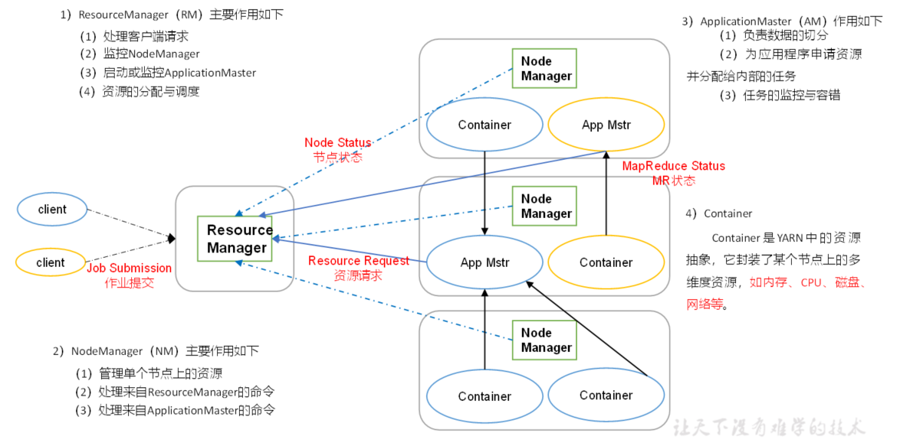
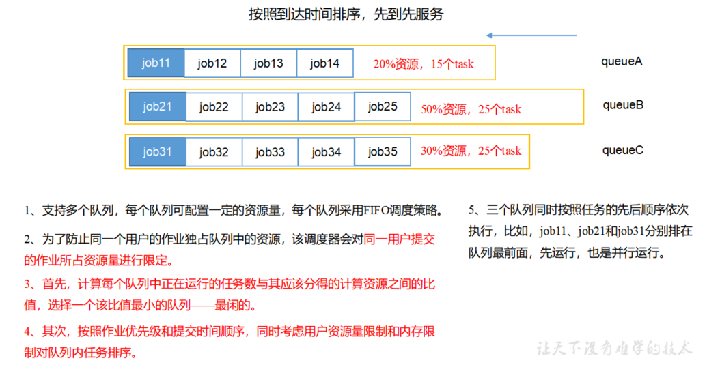

# Hadoop数据压缩

## 概述

​	压缩技术能够有效减少底层存储系统（HDFS）读写字节数。压缩提高了网络带宽和磁盘空间的效率。在运行MR程序时，I/O操作、网络数据传输、 Shuffle和Merge要花大量的时间，尤其是**数据规模很大和工作负载密集的情况下**，因此，**使用数据压缩显得非常重要**。

​	 鉴于磁盘I/O和网络带宽是Hadoop的宝贵资源，**数据压缩对于节省资源、最小化磁盘I/O和网络传输非常有帮助**。**可以在任意MapReduce阶段启用压缩**。不过，尽管压缩与解压操作的CPU开销不高，其性能的提升和资源的节省并非没有代价。

## 压缩策略和原则

​	压缩是提高Hadoop运行效率的一种**优化策略**。

​	**通过对Mapper、Reducer运行过程的数据进行压缩，以减少磁盘IO**，提高MR程序运行速度。

>  注意：采用压缩技术减少了磁盘IO，但同时**增加了CPU运算负担**。所以，压缩特性运用得当能提高性能，但运用不当也可能降低性能。

### 压缩基本原则

1. 运算密集型的job，少用压缩
2. IO密集型的job，多用压缩

## 支持的压缩编码格式

| 压缩格式 | hadoop自带？ | 算法    | 文件扩展名 | 是否可切分 | 换成压缩格式后，原来的程序是否需要修改 |
| -------- | ------------ | ------- | ---------- | ---------- | -------------------------------------- |
| DEFLATE  | 是，直接使用 | DEFLATE | .deflate   | 否         | 和文本处理一样，不需要修改             |
| Gzip     | 是，直接使用 | DEFLATE | .gz        | 否         | 和文本处理一样，不需要修改             |
| bzip2    | 是，直接使用 | bzip2   | .bz2       | 是         | 和文本处理一样，不需要修改             |
| LZO      | 否，需要安装 | LZO     | .lzo       | 是         | 需要建索引，还需要指定输入格式         |
| Snappy   | 否，需要安装 | Snappy  | .snappy    | 否         | 和文本处理一样，不需要修改             |

### 编码解码器支持

为了支持多种压缩/解压缩算法，Hadoop引入了编码/解码器，如下表所示。

| 压缩格式 | 对应的编码/解码器                          |
| -------- | ------------------------------------------ |
| DEFLATE  | org.apache.hadoop.io.compress.DefaultCodec |
| gzip     | org.apache.hadoop.io.compress.GzipCodec    |
| bzip2    | org.apache.hadoop.io.compress.BZip2Codec   |
| LZO      | com.hadoop.compression.lzo.LzopCodec       |
| Snappy   | org.apache.hadoop.io.compress.SnappyCodec  |

### 压缩性能的比较

| 压缩算法 | 原始文件大小 | 压缩文件大小 | 压缩速度 | 解压速度 |
| -------- | ------------ | ------------ | -------- | -------- |
| gzip     | 8.3GB        | 1.8GB        | 17.5MB/s | 58MB/s   |
| bzip2    | 8.3GB        | 1.1GB        | 2.4MB/s  | 9.5MB/s  |
| LZO      | 8.3GB        | 2.9GB        | 49.3MB/s | 74.6MB/s |

> <http://google.github.io/snappy/>
>
> On a single core of a Core i7 processor in 64-bit mode, Snappy compresses at about 250 MB/sec or more and decompresses at about 500 MB/sec or more.

​	从以上表格可以看出，考虑到压缩性能，企业中常用的压缩格式是**LZO**和**Snappy**，虽然各有些缺点，比如都需要额外安装，LZO需要修改mapreduce代码，Snappy不支持切片等，但这些都相对比较好客服，**最重要的是还是他们够快**。

## 压缩方式选择

### Gzip

**优点**：压缩率比较高，而且压缩/解压速度也比较快；Hadoop本身支持，在应用中处理Gzip格式的文件就和直接处理文本一样；大部分Linux系统都自带Gzip命令，使用方便。

**缺点**：不支持Split。

**应用场景**：当每个文件压缩之后在130M以内的（1个块大小内），都可以考虑用Gzip压缩格式。例如说一天或者一个小时的日志压缩成一个Gzip文件。

### Bzip2压缩

**优点**：支持Split；具有很高的压缩率，比Gzip压缩率都高；Hadoop本身自带，使用方便。

**缺点**：压缩/解压速度慢，因此不常用。

**应用场景**：适合对速度要求不高，但需要较高的压缩率的时候；或者输出之后的数据比较大，处理之后的数据需要压缩存档减少磁盘空间并且以后数据用得比较少的情况；或者对单个很大的文本文件想压缩减少存储空间，同时又需要支持Split，而且兼容之前的应用程序的情况。

### LZO压缩

**优点**：**压缩/解压速度也比较快**，合理的压缩率；支持Split，是Hadoop中最流行的压缩格式；可以在Linux系统下安装`lzop`命令，使用方便。**属于常用压缩格式**。

**缺点**：压缩率比`Gzip`要低一些；Hadoop本身不支持，需要安装；在应用中对Lzo格式的文件需要做一些特殊处理（为了支持Split需要建索引，还需要指定`InputFormat`为Lzo格式）。

**应用场景**：一个很大的文本文件，压缩之后还大于200M以上的可以考虑，而且单个文件越大，Lzo优点越越明显。

### Snappy压缩

**优点**：**高速压缩速度和合理的压缩率**，**属于常用压缩格式**。

**缺点**：不支持Split；压缩率比`Gzip`要低；Hadoop本身不支持，需要安装。

**应用场景**：当`MapReduce`作业的Map输出的数据比较大的时候，作为Map到Reduce的中间数据的压缩格式；或者作为一个`MapReduce`作业的输出和另外一个`MapReduce`作业的输入。

## 压缩位置选择

压缩可以在`MapReduce`作用的任意阶段启用


## 压缩参数配置

要在Hadoop中启用压缩，可以配置如下参数：

| 参数                                                         | 默认值                                                       | 阶段        | 建议                                          |
| ------------------------------------------------------------ | ------------------------------------------------------------ | ----------- | --------------------------------------------- |
| io.compression.codecs   （在core-site.xml中配置）            | org.apache.hadoop.io.compress.DefaultCodec, org.apache.hadoop.io.compress.GzipCodec, org.apache.hadoop.io.compress.BZip2Codec | 输入压缩    | Hadoop使用文件扩展名判断是否支持某种编解码器  |
| mapreduce.map.output.compress（在mapred-site.xml中配置）     | false                                                        | mapper输出  | 这个参数设为true启用压缩                      |
| mapreduce.map.output.compress.codec（在mapred-site.xml中配置） | org.apache.hadoop.io.compress.DefaultCodec                   | mapper输出  | 企业多使用LZO或Snappy编解码器在此阶段压缩数据 |
| mapreduce.output.fileoutputformat.compress（在mapred-site.xml中配置） | false                                                        | reducer输出 | 这个参数设为true启用压缩                      |
| mapreduce.output.fileoutputformat.compress.codec（在mapred-site.xml中配置） | org.apache.hadoop.io.compress. DefaultCodec                  | reducer输出 | 使用标准工具或者编解码器，如gzip和bzip2       |
| mapreduce.output.fileoutputformat.compress.type（在mapred-site.xml中配置） | RECORD                                                       | reducer输出 | SequenceFile输出使用的压缩类型：NONE和BLOCK   |

## 压缩案例

### 通过hadoop api实现压缩/解压缩（了解）

​	hadoop用于压缩的核心接口是`CompressionCodec`

`CompressionCodec`有两个方法可以用于轻松地压缩或解压缩数据。

1. 要想对正在被写入一个输出流的数据进行压缩，我们可以使用`createOutputStream(OutputStreamout)`方法创建一个`CompressionOutputStream`，将其以压缩格式写入底层的流。

2. 相反，要想对从输入流读取而来的数据进行解压缩，则调用`createInputStream(InputStreamin)`函数，从而获得一个`CompressionInputStream`，从而从底层的流读取未压缩的数据。

准备文件`web.log`，我们使用hadoop api对其进行压缩与解压缩

```java
package com.neuedu.compress;

import org.apache.hadoop.conf.Configuration;
import org.apache.hadoop.fs.Path;
import org.apache.hadoop.io.IOUtils;
import org.apache.hadoop.io.compress.*;
import org.apache.hadoop.util.ReflectionUtils;

import java.io.*;

public class TestCompress {


    public static void main(String[] args) throws IOException {
        //compress("f:/web.log", BZip2Codec.class);
        decompress("f:/web.log.bz2");
    }

    /**
     * 解压缩文件
     * @param filePath
     */
    private static void decompress(String filePath) throws IOException {
        //与压缩不同的是，解压缩可以通过工厂类自动判断压缩格式
        CompressionCodecFactory factory = new CompressionCodecFactory(new Configuration());
        CompressionCodec codec = factory.getCodec(new Path(filePath));

        //获取输入流
        CompressionInputStream cis = codec.createInputStream(new FileInputStream(filePath));

        //获取输出流
        FileOutputStream fos = new FileOutputStream(filePath.substring(0,filePath.lastIndexOf(".")));

        //copy流
        IOUtils.copyBytes(cis,fos,1024);

        //关流
        IOUtils.closeStream(cis);
        IOUtils.closeStream(fos);
    }

    /**
     * 按照指定格式压缩文件
     * @param filePath
     * @param codecClass
     */
    private static void compress(String filePath, Class<? extends CompressionCodec> codecClass) throws IOException {
        //获取输入流
        FileInputStream fis = new FileInputStream(filePath);

        //创建codec实例对象
        CompressionCodec codec = ReflectionUtils.newInstance(codecClass, new Configuration());

        //创建codec包装输出流,codec.getDefaultExtension()获取压缩格式后缀名
        CompressionOutputStream cos = codec.createOutputStream(new FileOutputStream(filePath + codec.getDefaultExtension()));

        //copy流
        IOUtils.copyBytes(fis,cos,1024);

        //关流
        IOUtils.closeStream(fis);
        IOUtils.closeStream(cos);
    }
}
```

### Map输出端采用压缩

​	即使你的MapReduce的输入输出文件都是未压缩的文件，你仍然可以对Map任务的中间结果输出做压缩，因为它要写在硬盘并且通过网络传输到Reduce节点，对其压缩可以提高很多性能，这些工作只要设置两个属性即可。

#### 需求

​	我们修改一下之前的ETL程序，让其在Map输出端采用压缩格式

#### 代码实现

1.修改`LogFilterDriver`

```java
public class LogFilterDriver {

    public static void main(String[] args) throws IOException, ClassNotFoundException, InterruptedException {

        Configuration configuration = new Configuration();
        // 开启map端输出压缩
        configuration.setBoolean("mapreduce.map.output.compress",true);
        // 设置map端输出压缩方式
        configuration.setClass("mapreduce.map.output.compress.codec", BZip2Codec.class, CompressionCodec.class);


        Job job = Job.getInstance(configuration);
        job.setJarByClass(LogFilterDriver.class);

        job.setMapperClass(LogFilterMapper.class);

        job.setMapOutputKeyClass(Text.class);
        job.setMapOutputValueClass(NullWritable.class);


        FileInputFormat.setInputPaths(job, new Path("f:/web.log"));
        FileOutputFormat.setOutputPath(job, new Path("f:/output"));

        boolean result = job.waitForCompletion(true);
        System.exit(result ? 0 : 1);
    }
}
```

2.执行对比压缩和不压缩的区别

有压缩情况：


无压缩情况


可以发现数据在**shuffle**阶段进行了压缩

### Map输入端采用压缩文件

​	输入端使用压缩文件，只要是hadoop默认支持的格式，那么代码直接可以运行。

修改LogFilterDriver，指定输入文件为`web.log.bz2`，然后查看测试结果

```java
 FileInputFormat.setInputPaths(job, new Path("f:/web.log.bz2"));
```

### Reduce输出端采用压缩格式

仍然基于ETL的例子

1.修改Driver类如下

```java
// 设置reduce端输出压缩开启
FileOutputFormat.setCompressOutput(job, true);

// 设置压缩的方式
FileOutputFormat.setOutputCompressorClass(job, BZip2Codec.class);
```

2.运行检查输出文件


# Yarn

​	Yarn是一个资源调度平台，负责为运算程序提供服务器运算资源，相当于一个分布式的**操作系统平台**，类似于windows的资源管理器一样，为hadoop应用分配cpu、内存等资源，而MapReduce等运算程序则相当于运行于操作系统之上的应用程序。

## Yarn基本架构

YARN主要由`ResourceManager`、`NodeManager`、`ApplicationMaster`和`Container`等组件构成



### ResourceManager作用

1. 处理客户端请求
2. 监控`NodeManager`的运行健康状况
3. 负责启动和监控`ApplicationMaster`
4. 资源的分配与调度,`ResourceManager`会将资源抽象封装成一个又一个`Container`来分配给NodeManager

> ResourceManager可以类比为公司的CEO

### ApplicationMaster作用

1. 负责数据的切分

2. 为应用程序申请资源并分配给内部的任务
3. 监控任务的运行，当任务中某个节点出现问题时，采取容错方案

> `ApplicationMaster`类似于公司的项目经理，负责管理某一个项目的执行

### NodeManager作用

1. 管理自身节点的资源使用。
2. 处理来自`ResourceManager`的命令
3. 处理来自`ApplicationMaster`的命令

> `NodeManager`相当于公司底层员工，用自己的体力来完成CEO和项目经理布置的任务。

### Container

​	`Container`是yarn中对于资源的抽象，它封装了某个节点的多维度资源，如cpu、内存、磁盘、网络等。

> Container就好比某一个员工的工作负荷的一部分，当`ApplicationMaster`向`ResourceManager`申请资源进行任务时，`ResourceManager`掌控着所有``NodeManager``的工作负荷情况，审时度势的将某几个`NodeManager`的剩余工作负荷能力分配给应用。

假设：

1. 集群目前的总资源为64核/32G内存，目前剩余空闲资源为32核/16G。
2. 此时如果有新的应用申请需要使用10核/5G资源进行计算，那么`ResourceManager`就会将资源封装成一个或多个`Container`通知对应的`NodeManager`使用`Container`规定的资源进行计算。
3. 此时`ResourceManager`中剩余资源还剩22核/11G。
4. 当计算完成后，Container对象就会被销毁，`ResourceManager`中的剩余资源回到32核/16G。


## Yarn工作机制


#### yarn工作机制详解

0. 首先客户端向集群提交申请执行`mapreduce`程序的请求（`运行Driver`）
1. 向`ResourceManager`申请运行Application
2. `ResourceManager`返回一个代表这个应用的application_id以及对应的资源提交路径，用于给当前应用提交`jar`包、配置文件`job.xml`、切片规划文件`job.split`
3. 客户端程序将对应`jar`包、配置文件`job.xml`、切片规划文件`job.split`通过提交到hdfs（在hdfs根目录会出现`tmp`文件夹保存各个应用的这些数据）
4. 资源提交完毕后，告知`ResourceManager`.并且申请创建管理应用运行的`MRAppMaster`(`ApplicationManager`)
5. `ResouceManager`将所有的资源申请封装成`Task`，并将`Task`放入执行队列（调度规则）中等待执行。
6. 当轮到处理这个`Task`时，`ResourceManager`会委派一个`NodeManager`，指定资源数量来用于运行`MRAppMaster`
7. `NodeManager`按照`Container`的规定，划分资源用于运行`MRAppMaster`
8. `NodeManager`从hdfs中下载job对应的资源到本地
9. 有了切片信息和jar包以及配置文件，`MRAppMaster`开始向`ResourceManager`发起执行`MapTask`所需要的资源`Container`，同样，这个申请也会被封装成`Task`在队列中等待。
10. 当`Task`被`ResourceManager`处理后，假设切片时2片，`ResourceManager`就会寻找两个 `NodeManager`来分别执行两个`MapTask`,并且分配资源`Container`,`NoderManger`按照`Container`划分资源
11. `MRAppMaster`获得申请的资源后，会向执行`mapTask`的两个`NodeManager`发送执行任务所需的启动脚本供`NodeManager`按照脚本执行任务。
12. `mapTask`执行完毕，输出数据。`MRAppMaster`实时监测`mapTask`执行情况，当监测到执行完成后，会接着想`ResourceManager`申请执行`ReduceTask`所需的资源
13. `ReduceTask`所在`NodeManager`获取`MapTask`输出的分区数据，开始执行`Reduce`,输出最终结果
14. 当整个应用执行完毕后，`MRAppMaster`会向`ResourceManager`申请注销自己和相应的`NodeManager`占用的资源。

## 资源调度器

​	在上面的第5步中，`ResourceManager`会根据调度策略来对资源申请进行排序，这就是资源调度规则，Hadoop有三种资源调度规则：FIFO、Capacity Scheduler和Fair Scheduler，默认的资源调度器是Capacity Scheduler。

具体设置详见：`yarn-default.xml`文件

```xml
<property>
    <description>The class to use as the resource scheduler.</description>
    <name>yarn.resourcemanager.scheduler.class</name>
<value>org.apache.hadoop.yarn.server.resourcemanager.scheduler.capacity.CapacityScheduler</value>
</property>
```

### 1.先进先出调度器（FIFO）

​	这种调度最简单，将应用放置在一个队列中，然后按照提交的顺序将所有的Applications放到队列中，*先按照作业的优先级高低、再按照到达时间的先后*，为每个app分配资源。如果第一个app需要的资源被满足了，如果还剩下了资源并且满足第二个app需要的资源，那么就为第二个app分配资源。

**优点**：简单，不需要配置。

**缺点**：不适合共享集群。如果有大的app需要很多资源，那么其他app可能会一直等待。


### 2.容量调度器（Capacity Scheduler）

​	容量调度机制适用于一个集群（集群被多个组织共享）中运行多个Application的情况，目标是最大化吞吐量和集群利用率。

​	容量调度允许将整个集群的资源分成多个部分，每个组织使用其中的一部分，即每个组织有一个专门的队列，每个组织的队列还可以进一步划分成层次结构（*Hierarchical Queues*），从而允许组织内部的不同用户组的使用。

​	每个队列内部，按照FIFO的方式调度Applications。当某个队列的资源空闲时，可以将它的剩余资源共享给其他队列。



### 3.公平调度器（Fair Scheduler）

​	*FairScheduler*允许应用在一个集群中公平地共享资源。默认情况下FairScheduler的公平调度只基于内存，也可以配置成基于memory & CPU。当集群中只有一个app时，它独占集群资源。当有新的app提交时，空闲的资源被新的app使用，这样最终每个app就会得到大约相同的资源。可以为不同的app设置优先级，决定每个app占用的资源百分比。FairScheduler可以让短的作业在合理的时间内完成，而不必一直等待长作业的完成。

​	*Fair Sharing*： Scheduler将apps组织成queues，将资源在这些queues之间公平分配。默认情况下，所有的apps都加入到名字为“default“的队列中。app也可以指定要加入哪个队列中。队列内部的默认调度策略是基于内存的共享策略，也可以配置成FIFO和multi-resource with Dominant Resource Fairness

​	*Minimum Sharing*：FairScheduller提供公平共享，还允许指定minimum shares to queues，从而保证所有的用户以及Apps都能得到足够的资源。如果有的app用不了指定的minimum的资源，那么可以将超出的资源分给别的app使用。

​	FairScheduler默认让所有的apps都运行，但是也可以通过配置文件配置每个queue中的分配权重，若权重1：1，当两个queue同时执行任务时，各分到一半资源。


## 任务的推测执行

 	一个作业由若干个Map任务和Reduce任务构成。因硬件老化、软件Bug等，某些任务可能运行非常慢。

> 思考：系统中有99%的Map任务都完成了，只有少数几个Map老是进度很慢，完不成，怎么办？

### 推测执行机制

​	发现拖后腿的任务，比如某个任务运行速度远慢于任务平均速度。为拖后腿任务启动一个备份任务，同时运行。谁先运行完，则采用谁的结果。

> 假设一个Job有三个MapTask，第一个和第二个执行速度正常，第三个由于机器老化，执行效率是前两个的10%，那么第三个mapTask就拖后腿了

### 执行推测任务的前提条件

（1）每个Task只能有一个备份任务

（2）当前Job已完成的Task必须不小于0.05（5%）

（3）开启推测执行参数设置。`mapred-site.xml`文件中默认是打开的。

```xml
<property>
  	<name>mapreduce.map.speculative</name>
  	<value>true</value>
  	<description>If true, then multiple instances of some map tasks may be executed in parallel.</description>
</property>

<property>
  	<name>mapreduce.reduce.speculative</name>
  	<value>true</value>
  	<description>If true, then multiple instances of some reduce tasks may be executed in parallel.</description>
</property>
```

### 不能启用推测执行机制情况

 （1）任务间存在严重的负载倾斜；

 （2）特殊任务，比如任务向数据库中写数据

### 算法原理

​	假设某一时刻，任务T的执行进度为progress，则可通过一定的算法推测出该任务的最终完成时刻`estimateEndTime`。另一方面，如果此刻为该任务启动一个备份任务，则可推断出它可能的完成时刻`estimateEndTime`,于是可得出以下几个公式：

```
estimatedRunTime =   (currentTimestamp   -   taskStartTime)/ progress
推测运行时间（60s）  =   （当前时刻（6）    -    任务启动时刻（0））/任务运行比例（10%）
```

```
estimateEndTime   =   estimatedRunTime  +    taskStartTime
推测执行完时刻 60  =    推测运行时间（60s）  +     任务启动时刻（0）
```

```
estimateEndTime`   =   currentTimestamp     +    averageRunTime
备份任务推测完成时刻（16） =  当前时刻（6）       +   运行完成任务的平均时间（10s） 
```

1. **MR总是选择（`estimateEndTime- estimateEndTime ` ）差值最大的任务，并为之启动备份任务。**

2. **为了防止大量任务同时启动备份任务造成的资源浪费，MR为每个作业设置了同时启动的备份任务数目上限。**

3. 推测执行机制实际上采用了经典的优化算法：**以空间换时间**，它同时启动多个相同任务处理相同的数据，并让这些任务竞争以缩短数据处理时间。显然，这种方法需要占用更多的计算资源。**在集群资源紧缺的情况下，应合理使用该机制**，争取在多用少量资源的情况下，减少作业的计算时间。

# Hadoop企业优化

### MapReduce 跑的慢的原因

#### 1.计算机性能

CPU、内存、磁盘健康、网络

#### 2．I/O 操作优化

1. 数据倾斜
2. Map和Reduce数设置不合理
3. Map运行时间太长，导致Reduce等待过久
4. 小文件过多
5. 大量的不可分块的超大文件
6. Spill(溢写)次数过多
7. Merge（合并文件）次数过多等

### MapReduce优化方法

​	`MapReduce`优化方法主要从六个方面考虑：数据输入、Map阶段、Reduce阶段、IO传输、数据倾斜问题和常用的调优参数。

#### 数据输入

1. 合并小文件：在执行MR任务前将小文件进行合并，大量的小文件会产生大量的Map任务，增大Map任务装载次数，而任务的装载比较耗时，从而导致MR运行较慢。
2. 采用`CombineTextInputFormat`来作为输入，解决输入端大量小文件场景.
3. 采用`Hadoop Archive（har）`压缩
4. JVM重用，jvm运行完一个`MapTask`后不销毁，继续运行下一个任务

#### Map阶段

1. **减少溢写（Spill）次数**：通过调整`io.sort.mb`及`sort.spill.percent`参数值，增大触发Spill的内存上限，减少Spill次数，从而减少磁盘IO。

   > 好比有100个文件，设置`io.sort.mb`可以让环形缓冲区多存一些，减少溢写次数，默认100mb
   >
   > 设置`sort.spill.percent`可以减小缓冲区的溢写域值，默认80%

2. **减少合并（Merge）次数**：通过调整`io.sort.factor`参数，增大Merge的文件数目(默认一次合并10个文件)，减少Merge的次数，从而缩短MR处理时间。

3. 在Map之后，**不影响业务逻辑前提下**，先进行**Combine**处理，减少 I/O。

#### Reduce阶段

1. **合理设置Map和Reduce数**：两个都不能设置太少，也不能设置太多。太少，会导致Task等待，延长处理时间；太多，会导致Map、Reduce任务间竞争资源，造成处理超时等错误。
2. **设置Map、Reduce共存**：调整`slowstart.completedmaps`参数，使Map运行到一定程度后，Reduce也开始运行，减少Reduce的等待时间。(hive就是默认共存)
3. **规避使用Reduce**：因为Reduce在用于连接数据集的时候将会产生大量的网络消耗，**没有reduce就没有shuffle**。
4. **合理设置Reduce端的Buffer**：默认情况下，数据达到一个阈值的时候，Buffer中的数据就会写入磁盘，然后Reduce会从磁盘中获得所有的数据。也就是说，Buffer和Reduce是没有直接关联的，中间多次写磁盘->读磁盘的过程，既然有这个弊端，那么就可以通过参数来配置，使得Buffer中的一部分数据可以直接输送到Reduce，从而减少IO开销**：`mapreduce.reduce.input.buffer.percent`，默认为0.0。当值大于0的时候，会保留指定比例的内存读Buffer中的数据直接拿给Reduce使用。这样一来，设置Buffer需要内存，读取数据需要内存，Reduce计算也要内存，所以要根据作业的运行情况进行调整**。

#### I/O传输

1. 采用数据压缩的方式，减少网络IO的的时间。安装Snappy和LZO压缩编码器。

2. 使用`SequenceFile`二进制文件。

   > 比如数字1000000，采用默认`TextOutputFormat`会按照文本来存储数据，那么占6个字节，
   >
   > 采用`SequenceFileOutputFormat`会将数据序列化，那么直接存的是二进制int，那就是4个字节。

#### 数据倾斜问题

​	**数据倾斜问题往往和业务层逻辑有着紧密联系**，因此调优更多的是在业务领域进行考虑，但是往往很难优化到完美，**因此，数据倾斜只要不是太过分，我们一般不处理**。

##### 数据倾斜现象

数据频率倾斜——某一个区域的数据量要远远大于其他区域。

数据大小倾斜——部分记录的大小远远大于平均值。

##### 减少数据倾斜的方法

###### 1.抽样和范围分区

可以通过对原始数据进行抽样得到的结果集来预设分区边界值。

例如：我们要计算学校1-3年级学生的考试平均值,数据如下

```
一年级  100000人
二年级  1000人
三年级  1000人
```

显然，一年级的人数由于扩招多余二年级和三年级10倍，如果按照完全人数进行统计，那么一年级的计算量太大，我们可以只抽取一年级1000人来进行计算。

###### 2.自定义分区

​	基于输出键的背景知识进行自定义分区。例如，如果Map输出键的单词来源于一本书。且其中某几个专业词汇较多。那么就可以自定义分区将这这些专业词汇发送给固定的一部分Reduce实例。而将其他的都发送给剩余的Reduce实例。

###### 3.Combine

​	使用Combine可以大量地减小数据倾斜。在可能的情况下，Combine的目的就是聚合并精简数据。

例如：对于wordCount

```
a 1                   经过combiner之后:  a 3
a 1                                     b 1
a 1          ===>                       c 1
b 1
c 1
```

> Combine能否优化数据倾斜的关键在于：**不影响业务逻辑的输出结果**

#### 常用的调优参数

##### 资源相关参数

1.以下参数是在用户自己的MR应用程序中配置就可以生效（`mapred-default.xml`）

| 配置参数                                      | 参数说明                                                     |
| --------------------------------------------- | ------------------------------------------------------------ |
| mapreduce.map.memory.mb                       | 一个MapTask可使用的资源上限（单位:MB），默认为1024。如果MapTask实际使用的资源量超过该值，则会被强制杀死。 |
| mapreduce.reduce.memory.mb                    | 一个ReduceTask可使用的资源上限（单位:MB），默认为1024。如果ReduceTask实际使用的资源量超过该值，则会被强制杀死。 |
| mapreduce.map.cpu.vcores                      | 每个MapTask可使用的最多cpu core数目，默认值: 1               |
| mapreduce.reduce.cpu.vcores                   | 每个ReduceTask可使用的最多cpu core数目，默认值: 1            |
| mapreduce.reduce.shuffle.parallelcopies       | 每个Reduce去Map中取数据的并行数。默认值是5                   |
| mapreduce.reduce.shuffle.merge.percent        | Buffer中的数据达到多少比例开始写入磁盘。默认值0.66           |
| mapreduce.reduce.shuffle.input.buffer.percent | Buffer大小占Reduce可用内存的比例。默认值0.7                  |
| mapreduce.reduce.input.buffer.percent         | 指定多少比例的内存用来存放Buffer中的数据，默认值是0.0        |

2.应该在YARN启动之前就配置在服务器的配置文件中才能生效（`yarn-default.xml`）

| 配置参数                                 | 参数说明                                        |
| ---------------------------------------- | ----------------------------------------------- |
| yarn.scheduler.minimum-allocation-mb     | 给应用程序Container分配的最小内存，默认值：1024 |
| yarn.scheduler.maximum-allocation-mb     | 给应用程序Container分配的最大内存，默认值：8192 |
| yarn.scheduler.minimum-allocation-vcores | 每个Container申请的最小CPU核数，默认值：1       |
| yarn.scheduler.maximum-allocation-vcores | 每个Container申请的最大CPU核数，默认值：32      |
| yarn.nodemanager.resource.memory-mb      | 给Containers分配的最大物理内存，默认值：8192    |

3.Shuffle性能优化的关键参数，应在YARN启动之前就配置好（`mapred-default.xml`）

| 配置参数                         | 参数说明                          |
| -------------------------------- | --------------------------------- |
| mapreduce.task.io.sort.mb        | Shuffle的环形缓冲区大小，默认100m |
| mapreduce.map.sort.spill.percent | 环形缓冲区溢出的阈值，默认80%     |

##### 容错相关参数(MapReduce性能优化)

| 配置参数                     | 参数说明                                                     |
| ---------------------------- | ------------------------------------------------------------ |
| mapreduce.map.maxattempts    | 每个Map Task最大重试次数，一旦重试参数超过该值，则认为Map Task运行失败，默认值：4。 |
| mapreduce.reduce.maxattempts | 每个Reduce Task最大重试次数，一旦重试参数超过该值，则认为Map Task运行失败，默认值：4。 |
| mapreduce.task.timeout       | Task超时时间，经常需要设置的一个参数，该参数表达的意思为：如果一个Task在一定时间内没有任何进入，即不会读取新的数据，也没有输出数据，则认为该Task处于Block状态，可能是卡住了，也许永远会卡住，为了防止因为用户程序永远Block住不退出，则强制设置了一个该超时时间（单位毫秒），默认是600000。如果你的程序对每条输入数据的处理时间过长（比如会访问数据库，通过网络拉取数据等），建议将该参数调大，该参数过小常出现的错误提示是“AttemptID:attempt_14267829456721_123456_m_000224_0 Timed out after 300 secsContainer killed by the ApplicationMaster.”。 |

### HDFS小文件优化方法

#### HDFS小文件弊端

​	HDFS上每个文件都要在`NameNode`上建立一个索引，这个索引的大小约为150byte，这样当小文件比较多的时候，就会产生很多的索引文件，一方面会大量占用`NameNode`的内存空间，另一方面就是索引文件过大使得索引速度变慢。

#### HDFS小文件解决方案

小文件的优化无非以下几种方式：

1. 在数据采集的时候，就将小文件或小批数据合成大文件再上传HDFS。

2. 在业务处理之前，在HDFS上使用`MapReduce`程序对小文件进行合并。

3. 在`MapReduce`处理时，可采用`CombineTextInputFormat`提高效率。

具体手段

1. `Hadoop Archive`

   ​	是一个高效地将小文件放入HDFS块中的文件存档工具，它能够将多个小文件打包成一个HAR文件，这样就减少了`NameNode`的内存使用。

2. `Sequence File`

    Sequence File由一系列的二进制key/value组成，如果key为文件名，value为文件内容，则可以将大批小文件合并成一个大文件。

3. `CombineFileInputFormat`

   `CombineFileInputFormat`是一种新的`InputFormat`，用于将多个文件合并成一个单独的Split，另外，它会考虑数据的存储位置。

4. 开启JVM重用

   对于大量小文件Job，可以开启JVM重用会减少45%运行时间。

   >  JVM重用原理：一个Map运行在一个JVM上，开启重用的话，该Map在JVM上运行完毕后，JVM继续运行其他Map。

   具体设置：`mapreduce.job.jvm.numtasks`值在10-20之间。

