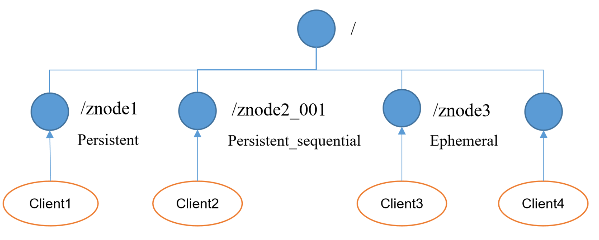
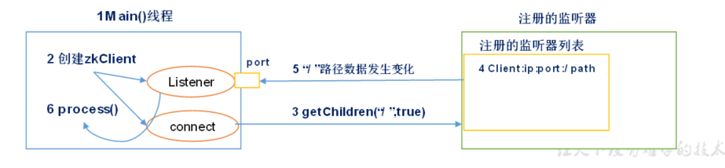
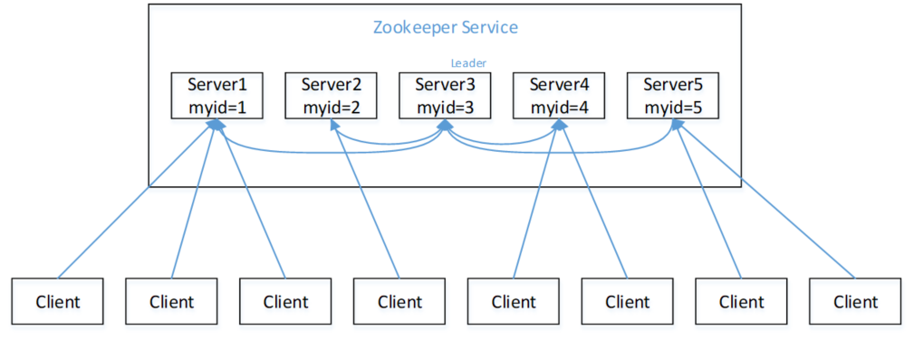
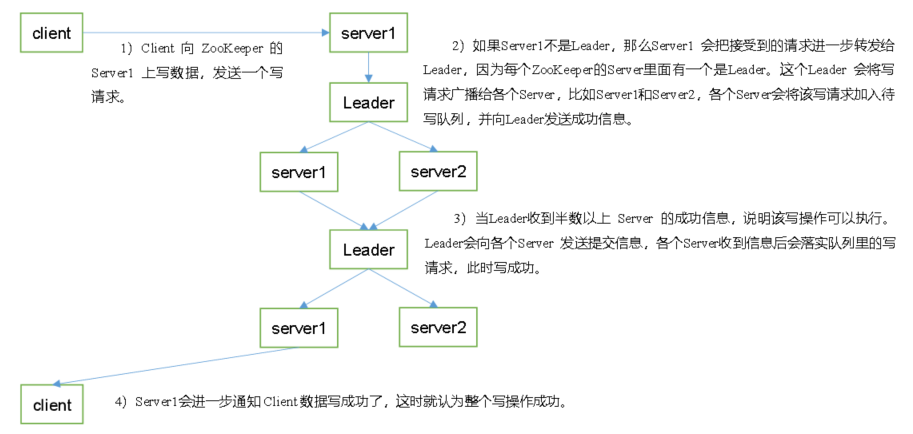
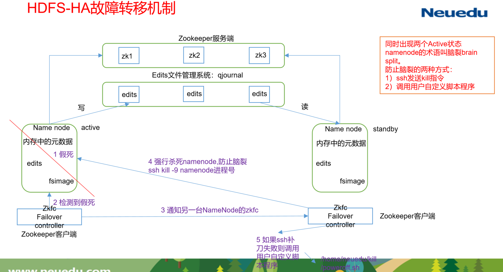
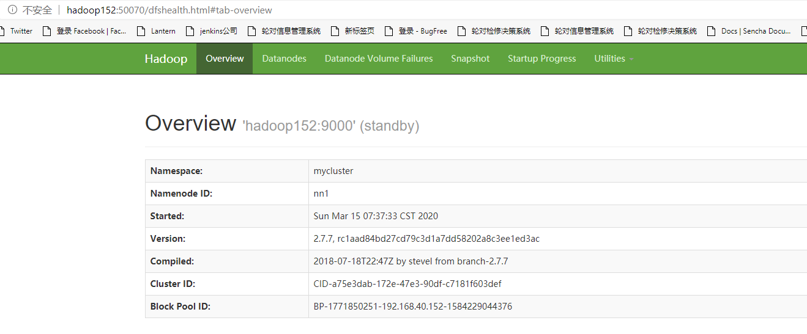

# Hadoop HA

## Zookeeper入门

### 概述

Zookeeper是一个开源的分布式的，为分布式应用提供**协调**服务的Apache项目。


> zookeeper最重要的核心是：
>
> 1. 存储数据
> 2. 当数据发生变化时，通知那些关心数据变化的客户

### 特点


1. Zookeeper：一个领导者（Leader），多个跟随者（Follower）组成的集群。
2. 集群中只要有**半数以上**节点存活，Zookeeper集群就能正常服务。
3. 全局数据一致：每个Server保存一份相同的数据副本，Client无论连接到哪个Server，数据都是一致的。
4. 更新请求顺序进行，来自同一个Client的更新请求按其发送顺序依次执行。
5. 数据更新原子性，一次数据更新要么成功，要么失败。
6. 实时性，在一定时间范围内，Client能读到最新数据。

### 数据结构

​	ZooKeeper数据模型的结构与**Unix文件系统很类似**，整体上可以看作是一棵树，每个节点称做一个ZNode。每一个ZNode默认能够存储**1MB**的数据，每个ZNode都可以通过其路径唯一标识。


**注意：**

zookeeper的`znode`与linux不同的是，**它不存在文件与文件夹的区分**，父节点不仅可以有子节点，自身也可以存数据

### 应用场景

​	zookeeper由于其抽象度极高，在很多分布式架构中都有其用武之地，hadoop集群中它可以实现高可用，可以协调hbase、hive、kafka等，除此之外它还可以在一些分布式场景中发挥如下作用：

统一命名服务、统一配置管理、统一集群管理、服务器节点动态上下线、软负载均衡等。

#### 统一命名服务

​	在分布式环境下，经常需要对应用/服务进行统一命名，便于识别。
​	例如：IP不容易记住，而域名容易记住。


#### 统一配置管理


1. 分布式环境下，配置文件同步非常常见。
   - 一般要求一个集群中，所有节点的配置信息是一致的，比如 Kafka 集群。
   - 对配置文件修改后，希望能够快速同步到各个节点上。
2. 配置管理可交由ZooKeeper实现。
   - 可将配置信息写入ZooKeeper上的一个Znode。
   - 各个客户端服务器监听这个Znode
   - 一旦Znode中的数据被修改，ZooKeeper将通知各个客户端服务器。

#### 统一集群管理


#### 服务器节点动态上下线


#### 软负载均衡

​	在Zookeeper中记录每台服务器的访问数，让访问数最少的服务器去处理最新的客户端请求


## Zookeeper安装

### 下载地址

官网首页：https://zookeeper.apache.org/


### 本地模式安装部署

#### 1.安装前准备

1. 安装Jdk

2. 拷贝Zookeeper安装包到Linux系统下

3. 解压到指定目录

   ```bash
   $ tar -zxvf zookeeper-3.6.0.tar.gz -C /opt/module/
   ```

#### 2.配置修改

1. 将`/opt/module/zookeeper-3.6.0/conf`这个路径下的`zoo_sample.cfg`修改为`zoo.cfg`；

   ```bash
   $ mv zoo_sample.cfg zoo.cfg
   ```

2. 打开`zoo.cfg`文件，修改`dataDir`路径：

   ```bash
   $ vim zoo.cfg
   ----------------
   dataDir=/opt/module/zookeeper-3.6.0/zkData
   ```

3. 在`/opt/module/zookeeper-3.6.0/`这个目录上创建`zkData`文件夹

   ```bash
   $ mkdir zkData
   ```

#### 3.操作zookeeper

1. 启动Zookeeper

   ```bash
   $ bin/zkServer.sh start
   ```

2. 查看进程是否启动

   ```bash
   $ jps
   -------------
   4020 Jps
   4001 QuorumPeerMain
   ```

   > Quorum代表多数，Peer代表集群中的每个节点，从这个进程名也能看出zookeeper是个少数服从多数的集群，只要半数以上的节点存活，集群就能正常工作

3. 查看状态

   ```bash
   $ bin/zkServer.sh status
   -------------------
   Client port found: 2181. Client address: localhost.
   Mode: standalone
   ```

4. 启动客户端

   ```bash
   $ bin/zkCli.sh
   ```

5. 退出客户端：

   ```bash
   [zk: localhost:2181(CONNECTED) 0] quit
   ```

6. 停止Zookeeper

   ```bash
   $ bin/zkServer.sh stop
   ```

### 配置参数解读

Zookeeper中的配置文件zoo.cfg中参数含义解读如下：

1. tickTime

   tickTime =2000,通信心跳数，Zookeeper服务器与客户端心跳时间，单位毫秒

   > Zookeeper使用的基本时间，服务器之间或客户端与服务器之间维持心跳的时间间隔，也就是每个tickTime时间就会发送一个心跳，时间单位为毫秒。
   >
   > 它用于心跳机制，并且设置最小的session超时时间为两倍心跳时间。(session的最小超时时间是2*tickTime)

2. initLimit

   initLimit =10：LF初始通信时限

   > 集群中的Follower跟随者服务器与Leader领导者服务器之间**初始连接时**能容忍的最多心跳数（tickTime的数量），用它来限定集群中的Zookeeper服务器连接到Leader的时限。

3. syncLimit

   syncLimit =5：LF同步通信时限

   > 集群中Leader与Follower之间的最大响应时间单位，假如响应超过syncLimit * tickTime，Leader认为Follwer死掉，从服务器列表中删除Follwer。

4. dataDir

   数据文件目录+数据持久化路径,主要用于保存Zookeeper中的数据。

5. clientPort

   clientPort =2181：客户端连接端口，监听客户端连接的端口。

## Zookeeper实战（重点）

### 分布式安装部署

#### 1.集群规划

在hadoop152、hadoop153和hadoop154三个节点上部署Zookeeper。

#### 2.解压安装

1. 解压Zookeeper安装包到/opt/module/目录下

   ```bash
   $ tar -zxvf zookeeper-3.6.0.tar.gz -C /opt/module/
   ```

#### 3.配置服务器编号

1. 在/opt/module/zookeeper-3.6.0/这个目录下创建zkData

   ```bash
   $ mkdir -p zkData
   ```

2. 在zkData中编辑myid文件

   ```bash
   $ touch myid
   $ echo 2 > myid  #注意这里的数字要和zoo.cfg里的server.id对应上 
   ```

#### 4.配置zoo.cfg文件

1. 重命名/opt/module/zookeeper-3.6.0/conf这个目录下的zoo_sample.cfg为zoo.cfg

   ```bash
   $ mv zoo_sample.cfg zoo.cfg
   ```

2. 修改存储路径

   ```bash
   dataDir=/opt/module/zookeeper-3.6.0/zkData
   ```

3. 增加多节点配置

   ```bash
   server.2=hadoop152:2888:3888
   server.3=hadoop153:2888:3888
   server.4=hadoop154:2888:3888
   ```

   > 配置参数解读
   >
   > ```bash
   > server.A=B:C:D
   > ```
   >
   > **A**是一个数字，表示这个是第几号服务器；
   >
   > 集群模式下配置一个文件myid，这个文件在dataDir目录下，这个文件里面有一个数据就是A的值，Zookeeper启动时读取此文件，拿到里面的数据与zoo.cfg里面的配置信息比较从而判断到底是哪个server。
   >
   > **B**是这个服务器的地址；
   >
   > **C**是这个服务器Follower与集群中的Leader服务器交换信息的端口；
   >
   > **D**是万一集群中的Leader服务器挂了，需要一个端口来重新进行选举，选出一个新的Leader，而这个端口就是用来执行选举时服务器相互通信的端口。

#### 5. 修改`zkEnv.sh`

我们还需要配置一下zookeeper存储日志的位置

```bash
$ vim bin/zkEnv.sh
----------

```

#### 6.分发zookeeper

将zookeeper分发到其他集群

```bash
$ xsync zookeeper-3.6.0/ 153-154
```

#### 7.集群操作

1. 分别启动集群

   ```bash
   $ bin/zkServer.sh start
   ```

2. 查看状态

   ```bash
   $ bin/zkServer.sh status
   ```

### 客户端命令操作

| 命令基本语法    | 功能描述                                         |
| --------------- | ------------------------------------------------ |
| help            | 显示所有操作命令                                 |
| ls [-w] path    | 使用 ls 命令来查看当前znode中所包含的内容        |
| ls -s [-w] path | 查看当前节点数据并能看到更新次数等数据           |
| create          | 普通创建-s  含有序列-e  临时（重启或者超时消失） |
| get [-w] path   | 获得节点的值                                     |
| set             | 设置节点的具体值                                 |
| stat            | 查看节点状态                                     |
| delete          | 删除节点                                         |
| deleteall       | 递归删除节点                                     |

#### 启动客户端

```bash
$ bin/zkCli.sh
```

#### 显示所有操作命令

```bash
[zk: localhost:2181(CONNECTED) 1] help
```

#### 查看当前znode中所包含的内容

```bash
[zk: localhost:2181(CONNECTED) 0] ls /
-------------
[zookeeper]
```

#### 查看当前节点详细数据

```bash
[zk: localhost:2181(CONNECTED) 1] ls -s  /
[zookeeper]
cZxid = 0x0
ctime = Thu Jan 01 08:00:00 CST 1970
mZxid = 0x0
mtime = Thu Jan 01 08:00:00 CST 1970
pZxid = 0x0
cversion = -1
dataVersion = 0
aclVersion = 0
ephemeralOwner = 0x0
dataLength = 0
numChildren = 1
```

#### 分别创建2个普通节点

```bash
[zk: localhost:2181(CONNECTED) 3] create /sanguo "jinlian"
Created /sanguo
[zk: localhost:2181(CONNECTED) 4] create /sanguo/shuguo "liubei"
Created /sanguo/shuguo
```

#### 获得节点的值

```bash
[zk: localhost:2181(CONNECTED) 5] get -s /sanguo
jinlian
cZxid = 0x100000003
ctime = Wed Aug 29 00:03:23 CST 2018
mZxid = 0x100000003
mtime = Wed Aug 29 00:03:23 CST 2018
pZxid = 0x100000004
cversion = 1
dataVersion = 0
aclVersion = 0
ephemeralOwner = 0x0
dataLength = 7
numChildren = 1
[zk: localhost:2181(CONNECTED) 6]
[zk: localhost:2181(CONNECTED) 6] get /sanguo/shuguo
liubei
cZxid = 0x100000004
ctime = Wed Aug 29 00:04:35 CST 2018
mZxid = 0x100000004
mtime = Wed Aug 29 00:04:35 CST 2018
pZxid = 0x100000004
cversion = 0
dataVersion = 0
aclVersion = 0
ephemeralOwner = 0x0
dataLength = 6
numChildren = 0
```

#### 创建临时节点

```bash
[zk: localhost:2181(CONNECTED) 7] create -e /sanguo/wuguo "zhouyu"
Created /sanguo/wuguo
```

1.在当前客户端是能查看到的

```bash
[zk: localhost:2181(CONNECTED) 3] ls /sanguo 
[wuguo, shuguo]
```

2.退出当前客户端然后再重启客户端

```bash
[zk: localhost:2181(CONNECTED) 12] quit
[atguigu@hadoop104 zookeeper-3.4.10]$ bin/zkCli.sh
```

3.再次查看根目录下短暂节点已经删除

```bash
[zk: localhost:2181(CONNECTED) 0] ls /sanguo
[shuguo]
```

#### 创建带序号的节点

1.先创建一个普通的根节点/sanguo/weiguo

```bash
[zk: localhost:2181(CONNECTED) 1] create /sanguo/weiguo "caocao"
Created /sanguo/weiguo
```

2.创建带序号的节点

```bash
[zk: localhost:2181(CONNECTED) 2] create -s /sanguo/weiguo/xiaoqiao "jinlian"
Created /sanguo/weiguo/xiaoqiao0000000000
[zk: localhost:2181(CONNECTED) 3] create -s /sanguo/weiguo/daqiao "jinlian"
Created /sanguo/weiguo/daqiao0000000001
[zk: localhost:2181(CONNECTED) 4] create -s /sanguo/weiguo/diaocan "jinlian"
Created /sanguo/weiguo/diaocan0000000002
```

如果原来没有序号节点，序号从0开始依次递增。如果原节点下已有2个节点，则再排序时从2开始，以此类推。

**注意**：zookeeper的序号是全局序号，添加任何节点，序号都会递增

#### 修改节点数据值

```bash
[zk: localhost:2181(CONNECTED) 6] set /sanguo/weiguo "simayi"
```

#### 节点的值变化监听

1.在hadoop154主机上注册监听/sanguo节点数据变化

```bash
[zk: localhost:2181(CONNECTED) 26] [zk: localhost:2181(CONNECTED) 8] get /sanguo watch
#3.6版本用一下命令
[zk: localhost:2181(CONNECTED) 26] [zk: localhost:2181(CONNECTED) 8] get -w /sanguo
```

2.在hadoop153主机上修改/sanguo节点的数据

```bash
[zk: localhost:2181(CONNECTED) 1] set /sanguo "xisi"
```

3.观察hadoop154主机收到数据变化的监听

```bash
WATCHER::
WatchedEvent state:SyncConnected type:NodeDataChanged path:/sanguo
```

> 再次修改，再观察，会发现观察不到修改通知了
>
> 原因是zookeeper维护着每个节点的观察者列表，发生一次修改，通知完，列表会被清空，想监听下次修改，需要重新注册。

#### 节点的子节点变化监听

1.在hadoop154主机上注册监听/sanguo节点的子节点变化

```bash
[zk: localhost:2181(CONNECTED) 1] ls /sanguo watch
[aa0000000001, server101]
# 3.6用以下命令
[zk: localhost:2181(CONNECTED) 1] ls -w /sanguo 
[aa0000000001, server101]
```

2.在hadoop153主机/sanguo节点上创建子节点

```bash
[zk: localhost:2181(CONNECTED) 2] create /sanguo/jin "simayi"
Created /sanguo/jin
```

3.观察hadoop154主机收到子节点变化的监听

```bahs
WATCHER::
WatchedEvent state:SyncConnected type:NodeChildrenChanged path:/sanguo
```

#### 删除节点

```bash
[zk: localhost:2181(CONNECTED) 4] delete /sanguo/jin
```

#### 递归删除节点

```bash
[zk: localhost:2181(CONNECTED) 15] deleteall /sanguo/shuguo
```

#### 查看节点状态

```bash
[zk: localhost:2181(CONNECTED) 17] stat /sanguo
cZxid = 0x100000003
ctime = Wed Aug 29 00:03:23 CST 2018
mZxid = 0x100000011
mtime = Wed Aug 29 00:21:23 CST 2018
pZxid = 0x100000014
cversion = 9
dataVersion = 1
aclVersion = 0
ephemeralOwner = 0x0
dataLength = 4
numChildren = 1
```

### API应用

#### 创建maven项目

添加`pom.xml`

```xml
<?xml version="1.0" encoding="UTF-8"?>
<project xmlns="http://maven.apache.org/POM/4.0.0"
         xmlns:xsi="http://www.w3.org/2001/XMLSchema-instance"
         xsi:schemaLocation="http://maven.apache.org/POM/4.0.0 http://maven.apache.org/xsd/maven-4.0.0.xsd">
    <modelVersion>4.0.0</modelVersion>

    <groupId>org.example</groupId>
    <artifactId>zkdemo</artifactId>
    <version>1.0-SNAPSHOT</version>
    <build>
        <plugins>
            <plugin>
                <groupId>org.apache.maven.plugins</groupId>
                <artifactId>maven-compiler-plugin</artifactId>
                <configuration>
                    <source>8</source>
                    <target>8</target>
                </configuration>
            </plugin>
        </plugins>
    </build>

    <dependencies>
        <dependency>
            <groupId>junit</groupId>
            <artifactId>junit</artifactId>
            <version>RELEASE</version>
        </dependency>
        <dependency>
            <groupId>org.apache.logging.log4j</groupId>
            <artifactId>log4j-core</artifactId>
            <version>2.8.2</version>
        </dependency>
        <!-- https://mvnrepository.com/artifact/org.apache.zookeeper/zookeeper -->
        <dependency>
            <groupId>org.apache.zookeeper</groupId>
            <artifactId>zookeeper</artifactId>
            <version>3.6.0</version>
        </dependency>

    </dependencies>

</project>
```

添加`log4j.properties`配置

```properties
log4j.rootLogger=INFO, stdout  
log4j.appender.stdout=org.apache.log4j.ConsoleAppender  
log4j.appender.stdout.layout=org.apache.log4j.PatternLayout  
log4j.appender.stdout.layout.ConversionPattern=%d %p [%c] - %m%n  
log4j.appender.logfile=org.apache.log4j.FileAppender  
log4j.appender.logfile.File=target/spring.log  
log4j.appender.logfile.layout=org.apache.log4j.PatternLayout  
log4j.appender.logfile.layout.ConversionPattern=%d %p [%c] - %m%n 
```

#### 创建ZooKeeper客户端

```java
public class ZKClientTest {

    private ZooKeeper zkClient;
    private static final String ZK_CONN="hadoop152:2181,hadoop153:2181,hadoop154:2181";


    @Before
    public void init() throws IOException {
        zkClient = new ZooKeeper(ZK_CONN,2000,e->{
            System.out.println("default watcher:"+e);
        });
    }
    
    @After
    public void destroy() throws InterruptedException {
        zkClient.close();
    }
}
```

#### 创建子节点

```java
@Test
public void create() throws KeeperException, InterruptedException {
    String path = zkClient.create("/idea", "haha".getBytes(), ZooDefs.Ids.OPEN_ACL_UNSAFE, CreateMode.PERSISTENT, new Stat());
    System.out.println(path);
}
```

#### 查看子节点

```java
@Test
public void ls() throws KeeperException, InterruptedException {
    List<String> children = zkClient.getChildren("/", e-> System.out.println("ls watcher:"+e));
    for(String child:children){
        System.out.println("child:"+child);
    }
}
```

#### 设置节点数据

```java
@Test
public void set() throws KeeperException, InterruptedException {
    Stat stat = zkClient.setData("/idea", "哈哈哈哈".getBytes(StandardCharsets.UTF_8), 1);
    System.out.println(stat.getDataLength());
}
```

#### 获取节点数据

```java
@Test
public void get() throws KeeperException, InterruptedException {
    byte[] data = zkClient.getData("/idea", e -> {
        System.out.println("get watcher:"+e);
    }, new Stat());
    System.out.println("data:"+new String(data));
    while(true){

    }
}
```

#### 查看状态

```java
@Test
public void stat() throws KeeperException, InterruptedException {
    Stat stat = zkClient.exists("/idea", false);
    System.out.println("version"+stat.getVersion());
    System.out.println("num children"+stat.getNumChildren());
    System.out.println("length"+stat.getDataLength());
}
```

#### 删除节点

```java
@Test
public void delete() throws KeeperException, InterruptedException {
    Stat stat = zkClient.exists("/idea", false);
    if(stat!=null)
        zkClient.delete("/idea",stat.getVersion());
}
```

#### 循环注册功能

​	我们知道watcher对一个节点的监视只能一次，如果我们想一直保持对一个节点的监视，就需要通过循环的方式，代码如下：

```java
 @Test
public void loopRegisterTest() throws KeeperException, InterruptedException {
    loopRegister();

    while (true) {

    }
}

public void loopRegister() throws KeeperException, InterruptedException {
    byte[] data = zkClient.getData("/idea", e -> {
        try {
            loopRegister();
        } catch (KeeperException | InterruptedException ex) {
            ex.printStackTrace();
        }

    }, new Stat());
    System.out.println(new String(data));

}
```

#### 监听服务器节点动态上下线案例

##### 需求

某分布式系统中，主节点可以有多台，可以动态上下线，任意一台客户端都能实时感知到主节点服务器的上下线。


##### 具体实现

1.创建/servers节点

```bash
create /servers "servers"
```

2.服务端想zookeeper注册自己

```java
package com.neuedu.register;

import org.apache.zookeeper.*;
import org.apache.zookeeper.data.Stat;

import java.io.IOException;

public class DsServer {

    private static String connectString = "hadoop152:2181,hadoop153:2181,hadoop154:2181";
    private static int sessionTimeout = 2000;
    private ZooKeeper zk = null;
    private String parentNode = "/servers";

    public void getConn() throws IOException {
        zk = new ZooKeeper(connectString, sessionTimeout, e->{});
    }

    /**
     * 注册服务器
     * @param hostname
     */
    public void registerServer(String hostname) throws KeeperException, InterruptedException {


        // 最关键的在于CreateMode.EPHEMERAL_SEQUENTIAL。因为我们创建的是临时序列节点，
        // 当server宕机后，和zookeeper的会话自然断开，导致临时序列节点被删除，这时候客户端就能监听到服务的变化，
        String path = zk.create(parentNode + "/server", hostname.getBytes(), ZooDefs.Ids.OPEN_ACL_UNSAFE, CreateMode.EPHEMERAL_SEQUENTIAL);
        System.out.println(hostname+"  active at "+ path);
    }

    public void business(String hostname) {
        System.out.println(hostname+" is working ....");
        while (true){

        }
    }

    public static void main(String[] args) throws KeeperException, InterruptedException, IOException {
        DsServer dsServer = new DsServer();
        dsServer.getConn();
        dsServer.registerServer(args[0]);
        dsServer.business(args[0]);
    }
}

```

3.客户端获取服务信息

```java
package com.neuedu.register;

import org.apache.zookeeper.ZooKeeper;

import java.io.IOException;
import java.util.ArrayList;
import java.util.List;

public class DsClient {
    private static String connectString = "hadoop152:2181,hadoop153:2181,hadoop154:2181";
    private static int sessionTimeout = 2000;
    private ZooKeeper zk = null;
    private String parentNode = "/servers";

    /**
     * 循环监听服务列表的变化
     * @throws IOException
     */
    public void getConnect() throws IOException {
        zk = new ZooKeeper(connectString, sessionTimeout, event -> {
            // 再次启动监听
            try {
                getServerList();
            } catch (Exception e) {
                e.printStackTrace();
            }
        });
    }

    // 获取服务器列表信息
    public void getServerList() throws Exception {

        // 1获取服务器子节点信息，并且对父节点进行监听
        List<String> children = zk.getChildren(parentNode, true);

        // 2存储服务器信息列表
        ArrayList<String> servers = new ArrayList<>();

        // 3遍历所有节点，获取节点中的主机名称信息
        for (String child : children) {
            byte[] data = zk.getData(parentNode + "/" + child, false, null);

            servers.add(new String(data));
        }

        // 4打印服务器列表信息
        System.out.println(servers);
    }

    // 业务功能
    public void business() throws Exception{

        System.out.println("client is working ...");
        Thread.sleep(Long.MAX_VALUE);
    }

    public static void main(String[] args) throws Exception {

        // 1获取zk连接
        DsClient client = new DsClient();
        client.getConnect();

        // 2获取servers的子节点信息，从中获取服务器信息列表
        client.getServerList();

        // 3业务进程启动
        client.business();
    }
}
```

##### 测试

启动两个`DsServer`，观察`DsClient`的变化。

```bash
client is working ...
[server200]
[server201, server200]
[server201]
```

## Zookeeper内部原理

### 节点类型

#### 按照节点生命周期划分

持久（Persistent）：客户端和服务器端断开连接后，创建的节点不删除

短暂（Ephemeral）：客户端和服务器端断开连接后，创建的节点自己删除

#### 按照是否有序划分

​	在分布式系统中，顺序号可以被用于为所有的事件进行全局排序，这样客户端可以通过顺序号推断事件的顺序。

创建znode时设置顺序标识，znode名称后会附加一个值，顺序号是一个单调递增的计数器，由父节点维护

#### 具体类型




##### 持久化目录节点

客户端与Zookeeper断开连接后，该节点依旧存在

##### 持久化顺序编号目录节点

客户端与Zookeeper断开连接后，该节点依旧存在，只是Zookeeper给该节点名称进行顺序编号

##### 临时目录节点

客户端与Zookeeper断开连接后，该节点被删除

##### 临时顺序编号目录节点

客户端与Zookeeper断开连接后，该节点被删除，只是Zookeeper给该节点名称进行顺序编号。

### Stat结构体

1.**czxid**-创建节点的事务zxid

> 每次修改ZooKeeper状态都会收到一个zxid形式的时间戳，也就是ZooKeeper事务ID。
>
> 事务ID是ZooKeeper中所有修改总的次序。每个修改都有唯一的zxid，如果zxid1小于zxid2，那么zxid1在zxid2之前发生。

2.**ctime** - znode被创建的毫秒数(从1970年开始)

3.**mzxid** - znode最后更新的事务zxid

4.**mtime** - znode最后修改的毫秒数(从1970年开始)

5.**pZxid**-znode最后更新的子节点zxid

6.**cversion** - znode子节点变化号，znode子节点修改次数

7.**dataversion** - znode数据变化号

8.**aclVersion** - znode访问控制列表的变化号

9.**ephemeralOwner**- 如果是临时节点，这个是znode拥有者的session id。如果不是临时节点则是0。

10.**dataLength**- znode的数据长度

11.**numChildren** - znode子节点数量

### 监听器原理（重点）

​	zookeeper是如何通知客户端数据变化的？



**监听原理详解**：

1. 首先要有一个`main()`线程

2. 在main线程中创建Zookeeper客户端，这时就会创建两个线程，一个负责网络连接通信（`connect`），一个负责监听（`listener`）。

   >debug `new zookeeper`构造函数，可以发现如下代码
   >
   >```java
   >this.cnxn = this.createConnection(connectStringParser.getChrootPath(), this.hostProvider, sessionTimeout, this, this.watchManager, this.getClientCnxnSocket(), canBeReadOnly);
   >this.cnxn.start();//线程启动
   >```
   >
   >```java
   >//ClientCnxn构造函数
   >.....
   >//设置事件监听线程，和发送连接线程
   >this.sendThread = new ClientCnxn.SendThread(clientCnxnSocket);
   >this.eventThread = new ClientCnxn.EventThread();
   >```
   >
   >```java
   >//线程启动
   >public void start() {
   >    this.sendThread.start();
   >    this.eventThread.start();
   >}
   >```

3. 通过`connect`线程将注册的监听事件发送给Zookeeper。

4. 在Zookeeper的注册监听器列表中将注册的监听事件添加到列表中。

5. Zookeeper监听到有数据或路径变化，就会将这个消息发送给`listener`线程。

6. `listener`线程内部调用了`process()`方法。

### Zab协议(重点)

Zab协议 的全称是 **Zookeeper Atomic Broadcast** （Zookeeper原子广播）。

1. Zab协议是为分布式协调服务Zookeeper专门设计的一种 **支持崩溃恢复** 的 **原子广播协议** ，是Zookeeper保证数据一致性的核心算法。Zab借鉴了Paxos算法，但又不像Paxos那样，是一种通用的分布式一致性算法。**它是特别为Zookeeper设计的支持崩溃恢复的原子广播协议**。

2. 在Zookeeper中主要依赖Zab协议来实现数据一致性，基于该协议，zk实现了一种主备模型（即Leader和Follower模型）的系统架构来保证集群中各个副本之间数据的一致性。
    这里的主备系统架构模型，就是指只有一台客户端（Leader）负责处理外部的写事务请求，然后Leader客户端将数据同步到其他Follower节点。

**总结Zab协议干了哪两件事：**

1. 崩溃恢复：没有leader选leader。
2. 原子广播：有了leader，怎么干活，如何保证所有节点写数据的同步。

#### 选举机制

Zab协议是如何来选leader的呢？

1. **半数机制：集群中半数以上机器存活，集群可用。所以Zookeeper适合安装奇数台服务器。**
2. Zookeeper虽然在配置文件中并没有指定Master和Slave。但是，Zookeeper工作时，是有一个节点为Leader，其他则为Follower，Leader是通过内部的选举机制临时产生的。

##### 案例过程分析

​	假设有五台服务器组成的Zookeeper集群，它们的id从1-5，同时它们都是最新启动的，也就是没有历史数据，在存放数据量这一点上，都是一样的。假设这些服务器依序启动，来看看会发生什么



> zookeeper节点有四个状态：
>
> 1. Looking：没有leader的状态，找leader
> 2. Leading：自己就是leader
> 3. Following：自己是follower
> 4. oberserver：在大集群中存在的状态,相当于屁民（了解即可）

1. 服务器1启动，发起一次选举。服务器1投自己一票。此时服务器1票数一票，不够半数以上（3票），选举无法完成，服务器1状态保持为LOOKING；
2. 服务器2启动，再发起一次选举。服务器1和2分别投自己一票并交换选票信息：此时服务器1发现服务器2的ID比自己目前投票推举的（服务器1）大，更改选票为推举服务器2。此时服务器1票数0票，服务器2票数2票，没有半数以上结果，选举无法完成，服务器1，2状态保持LOOKING
3. 服务器3启动，发起一次选举。此时服务器1和2都会更改选票为服务器3。此次投票结果：服务器1为0票，服务器2为0票，服务器3为3票。此时服务器3的票数已经超过半数，服务器3当选Leader。服务器1，2更改状态为FOLLOWING，服务器3更改状态为LEADING；
4. 服务器4启动，发起一次选举。此时服务器1，2，3已经不是LOOKING状态，不会更改选票信息。交换选票信息结果：服务器3为3票，服务器4为1票。此时服务器4服从多数，更改选票信息为服务器3，并更改状态为FOLLOWING；
5. 服务器5启动，同4一样当小弟。

##### 如何比较谁更适合当leader

​	**首先比较谁的zxid更大**，谁的zxid更大，代表数据是最新的，所以先选数据最新的，假设zxid一致，或者是一个新集群，此时**再比较谁的myid更大**，谁大谁就是leader

#### 写数据流程



##### 写投票机制

​	leader发起投票广播后，所有节点都需要判断目前**自身的zxid是否小于写请求的zxid**，如果小于就同意，**并且会将这条请求放入自己节点的待写队列。**

##### 异常的情况分析

在进行写投票时，有可能会出现某个follower不同意写的情况，为什么会出现？

原因是由于，zookeeper集群内部可能出现了网络延时，比如3台机器的zxid都是9，此时有一个10的写请求发起，leader通知了所有集群，但是由于网络延时，机器3暂时没有收到投票广播，而其他集群都收到并且同意，由于超过半数，leader进行了写广播，其他机器都完成了写操作，并且zxid升级为10。

​	此时，新的一条写请求11发起，leader再次广播投票，此时所有机器收到了广播请求，机器判断11>9,也同意了，所有机器都完成了写操作，zxid更新为11.

​	这时候，机器3才收到10的投票请求（太晚了），经过zxid判断，10<11，机器3投了不同意票，同时它知道自己的数据出现问题了，怎么办？

**注意：**当节点需要投不同意票的时候，也就意味着节点的数据可能不同步与集群了，**这时候它会果断选择自杀，自杀之后重启，向leader发起同步数据的请求**。

## Hadoop HA概述

**所谓HA（High Available）**，即高可用（7*24小时不中断服务）。

实现高可用最关键的策略是消除单点故障。HA严格来说应该分成各个组件的HA机制：HDFS的HA和YARN的HA。

Hadoop2.0之前，在HDFS集群中NameNode存在单点故障（SPOF）。

NameNode主要在以下两个方面影响HDFS集群

​	NameNode机器发生意外，如宕机，集群将无法使用，直到管理员重启

​	NameNode机器需要升级，包括软件、硬件升级，此时集群也将无法使用

HDFS HA功能通过配置Active/Standby两个NameNodes实现在集群中对NameNode的热备来解决上述问题。如果出现故障，如机器崩溃或机器需要升级维护，这时可通过此种方式将NameNode很快的切换到另外一台机器。

## HDFS-HA工作机制

​	通过双`NameNode`消除单点故障。其中一个`NameNode`的状态为激活Active，另一个为`StandBy`。正常工作情况下，处理客户端写请求的**只有状态为Active的`NameNode`**

### HDFS-HA工作要点

#### 1.元数据管理方式改变

1. 内存中各自保存一份元数据Fsimage

2. Edits日志**只有Active状态的NameNode节点可以做写操作**

3. 两个`NameNode`都可以读取Edits，**因此`SecondaryNameNode`不再需要，它的工作转移给状态为StandBy的`NameNode`**

4. **共享的Edits放在一个共享存储中管理**（QJM和NFS两个主流实现）,NFS不太稳定，**因此实际开发中一般选用QJM**

   > QJM全称是Quorum Journal Manager, 由JournalNode（JN）组成，一般是奇数点结点组成。每个JournalNode对外有一个简易的RPC接口，以供NameNode读写EditLog到JN本地磁盘。当写EditLog时，NameNode会同时向所有JournalNode并行写文件，只要有N/2+1结点写成功则认为此次写操作成功，遵循Paxos协议。
   >
   > 参考：https://blog.csdn.net/breakout_alex/article/details/88171114

#### 2.状态管理功能模块

思考问题：假设Active状态的NameNode挂了，Standby就立即上位吗？

**答案是不能**，因为你怎么知道Active真挂了？也许就是Active和StandBy之间断连了而已，而Active还在正常工作呢，如果此时Standby上位，就会出现脑裂（Brain Split）

**Brain Split比集群宕机更可怕**，因为这种现象会造成数据混乱，此时两个NameNode同时接受客户端的写请求，同时产生edits文件，导致元数据不唯一，那datanode中的数据岂不是乱套了，当客户端发起读请求时，你读的到底是什么数据？

**因此，我们需要一个第三方管理工具来验证NameNode是否真的挂了，这个第三方就是zookeeper**

​	Hadoop实现了一个`zk failover Controller`，常驻在每一个`namenode`所在的节点，每一个`zkfailover`负责t监控自己所在NameNode节点并且将状态上报Zookeeper，利用zookeeper进行状态标识，当需要进行状态切换时，由zkfailover来负责切换，切换时需要防止brain split现象的发生。

#### 3 通讯保障

必须保证两个NameNode之间能够ssh无密码登录

#### 4.隔离（Fence）

即同一时刻仅仅有一个NameNode对外提供服务

### HDFS-HA自动故障转移工作机制



#### 1.故障检测

​	集群中的每个NameNode在ZooKeeper中维护了一个持久会话，如果机器崩溃，ZooKeeper中的会话将终止，ZooKeeper通知另一个NameNode需要触发故障转移。

> 这里实际上利用了zookeeper的临时节点功能，一旦NameNode崩溃，zkfc就会断开与zookeeper的会话，自然其临时节点就没了，此时其他的NameNode就会监控到zookeeper节点的变化，从而启动故障转移。

#### 2.现役NameNode选择

​	ZooKeeper提供了一个简单的机制用于唯一的选择一个节点为active状态。如果目前现役NameNode崩溃，另一个节点可能从ZooKeeper获得特殊的排外锁以表明它应该成为现役NameNode。

​	ZKFC是自动故障转移中的另一个新组件，是ZooKeeper的客户端，也监视和管理NameNode的状态。每个运行NameNode的主机也运行了一个ZKFC进程，ZKFC负责：

1. **健康监测：**ZKFC使用一个健康检查命令定期地ping与之在相同主机的NameNode，只要该NameNode及时地回复健康状态，ZKFC认为该节点是健康的。如果该节点崩溃，冻结或进入不健康状态，健康监测器标识该节点为非健康的。
2. **ZooKeeper会话管理：**当本地NameNode是健康的，ZKFC保持一个在ZooKeeper中打开的会话。如果本地NameNode处于active状态，ZKFC也保持一个特殊的znode锁，该锁使用了ZooKeeper对短暂节点的支持，如果会话终止，锁节点将自动删除。
3. **基于ZooKeeper的选择：**如果本地NameNode是健康的，且ZKFC发现没有其它的节点当前持有znode锁，它将为自己获取该锁。如果成功，则它已经赢得了选择，并负责运行故障转移进程以使它的本地NameNode为Active。故障转移进程首先如果必要保护之前的现役NameNode，然后本地NameNode转换为Active状态。

## HDFS-HA集群配置

### 环境准备

1. 修改ip
2. 修改主机名及主机名和IP地址的映射
3. 关闭防火墙
4. ssh免密登录
5. 安装JDK，配置环境变量等

### 规划集群

| hadoop152             | hadoop153             | hadoop154   |
| --------------------- | --------------------- | ----------- |
| NameNode              | NameNode              |             |
| zk faliure controller | zk faliure controller |             |
| JournalNode           | JournalNode           | JournalNode |
| DataNode              | DataNode              | DataNode    |
| Zookeeper             | Zookeeper             | Zookeeper   |
|                       | ResourceManager       |             |
| NodeManager           | NodeManager           | NodeManager |

### 配置ZooKeeper集群

略，见zookeeper实战章节。

### 配置HDFS-HA集群

1. 在`/opt/module`下创建ha文件夹

   ```bash
   $ mdkir ha
   ```

2. 解压`hadoop-2.7.7-tar.gz`至ha

   ```bash
   $ tar -xzvf hadoop-2.7.7-tar.gz -C /opt/module/ha/
   ```

3. 配置`hadoop-env.sh`

   ```bash
   export JAVA_HOME=/usr/lib/jvm/java-1.8.0-openjdk-1.8.0.242.b08-0.el7_7.x86_64
   ```

4. 配置`yarn-env.sh`

   ```bash
   export JAVA_HOME=/usr/lib/jvm/java-1.8.0-openjdk-1.8.0.242.b08-0.el7_7.x86_64
   ```

5. 配置`mapred-env.sh`

   ```bash
   export JAVA_HOME=/usr/lib/jvm/java-1.8.0-openjdk-1.8.0.242.b08-0.el7_7.x86_64
   ```

6. 配置`slaves（workers）`文件

   ```bash
   hadoop152
   hadoop153
   hadoop154
   ```

7. 配置`core-site.xml`

   ```xml
   <configuration>
   <!-- 把两个NameNode）的地址组装成一个集群mycluster -->
   		<property>
   			<name>fs.defaultFS</name>
           	<value>hdfs://mycluster</value>
   		</property>
   
   		<!-- 指定hadoop运行时产生文件的存储目录 -->
   		<property>
   			<name>hadoop.tmp.dir</name>
   			<value>/opt/module/ha/hadoop-2.7.7/data/tmp</value>
   		</property>
   </configuration>
   ```

8. 配置`hdfs-site.xml`

   ```xml
   <configuration>
   	<!-- 完全分布式集群名称 -->
   	<property>
   		<name>dfs.nameservices</name>
   		<value>mycluster</value>
   	</property>
   
   	<!-- 集群中NameNode节点都有哪些 -->
   	<property>
   		<name>dfs.ha.namenodes.mycluster</name>
   		<value>nn1,nn2</value>
   	</property>
   
   	<!-- nn1的RPC通信地址 -->
   	<property>
   		<name>dfs.namenode.rpc-address.mycluster.nn1</name>
   		<value>hadoop152:9000</value>
   	</property>
   
   	<!-- nn2的RPC通信地址 -->
   	<property>
   		<name>dfs.namenode.rpc-address.mycluster.nn2</name>
   		<value>hadoop153:9000</value>
   	</property>
   
   	<!-- nn1的http通信地址 -->
   	<property>
   		<name>dfs.namenode.http-address.mycluster.nn1</name>
   		<value>hadoop152:50070</value>
   	</property>
   
   	<!-- nn2的http通信地址 -->
   	<property>
   		<name>dfs.namenode.http-address.mycluster.nn2</name>
   		<value>hadoop153:50070</value>
   	</property>
   
   	<!-- 指定NameNode元数据在JournalNode上的存放位置 -->
   	<property>
   		<name>dfs.namenode.shared.edits.dir</name>
   	<value>qjournal://hadoop152:8485;hadoop153:8485;hadoop154:8485/mycluster</value>
   	</property>
   
   	<!-- 配置隔离机制，即同一时刻只能有一台服务器对外响应 -->
   	<property>
   		<name>dfs.ha.fencing.methods</name>
   		<value>sshfence</value>
   	</property>
   
   	<!-- 使用隔离机制时需要ssh无秘钥登录-->
   	<property>
   		<name>dfs.ha.fencing.ssh.private-key-files</name>
   		<value>/home/hadoop/.ssh/id_rsa</value>
   	</property>
   
   	<!-- 声明journalnode服务器存储目录-->
   	<property>
   		<name>dfs.journalnode.edits.dir</name>
   		<value>/opt/module/ha/hadoop-2.7.7/data/jn</value>
   	</property>
   
   	<!-- 关闭权限检查-->
   	<property>
   		<name>dfs.permissions.enable</name>
   		<value>false</value>
   	</property>
   
   	<!-- 访问代理类：client，mycluster，active配置失败自动切换实现方式-->
   	<property>
     		<name>dfs.client.failover.proxy.provider.mycluster</name>
   			<value>org.apache.hadoop.hdfs.server.namenode.ha.ConfiguredFailoverProxyProvider</value>
   	</property>
   </configuration>
   ```

9. 分发至各个节点

   ```bash
   $ xsync /opt/module/ha/ 152-154
   ```

### 启动HDFS-HA集群

1. 在各个`JournalNode`节点上，输入以下命令启动`journalnode`服务

   ```bash
   sbin/hadoop-daemon.sh start journalnode
   ```

2. 在`nn1`上，进行`namenode`格式化，并启动

   ```bash
   $ bin/hdfs namenode -format
   $ sbin/hadoop-daemon.sh start namenode
   ```

3. 在`nn2`上，同步`nn1`的元数据信息

   ```bash
   $ bin/hdfs namenode -bootstrapStandby
   ```

4. 启动`nn2`

   ```bash
   $ sbin/hadoop-daemon.sh start namenode
   ```

5. 访问`nn1`提供的web服务

   

6. 在`nn1`上，启动所有`datanode`

   ```bash
   $ sbin/hadoop-daemons.sh start datanode
   ```

7. 手动设置`nn1` Active

   ```bash
   $ bin/hdfs haadmin -transitionToActive nn1
   ```

8. 查看是否Active

   ```bash
   $ bin/hdfs haadmin -getServiceState nn1
   ```

### 配置HDFS-HA自动故障转移

1. 在`hdfs-site.xml`中配置启动自动故障转移

   ```xml
   <property>
   	<name>dfs.ha.automatic-failover.enabled</name>
   	<value>true</value>
   </property>
   ```

2. 在`core-site.xml`文件中配置zookeeper集群地址

   ```xml
   <property>
   	<name>ha.zookeeper.quorum</name>
   	<value>hadoop152:2181,hadoop153:2181,hadoop154:2181</value>
   </property>
   ```

3. 将配置文件分发至集群

   ```bash
   $ xsync etc/ 152-154
   ```

4. 关闭所有hdfs服务

   ```bash
   $ sbin/stop-dfs.sh
   ```

5. 启动Zookeeper集群

   ```bash
   $ bin/zkServer.sh start
   ```

6. 初始化HA在Zookeeper中状态,会在zookeeper中添加父节点`/hadoop-ha/mycluster`

   ```bash
   $ bin/hdfs zkfc -formatZK
   ```

7. 启动HDFS服务

   ```bash
   $ sbin/start-dfs.sh
   ```

> 这里的active namenode将有zookeeper决定，谁先抢先在zookeeper上注册到锁节点，谁就是active
>
> ```bash
> [zk: localhost:2181(CONNECTED) 6] get  -s /hadoop-ha/mycluster/ActiveStandbyElectorLock
> -----------------------------
> 	myclusternn2	hadoop153 �F(�> // hadoop153抢先注册至zookeeper
> cZxid = 0x200000078
> ctime = Sun Mar 15 07:53:38 CST 2020
> mZxid = 0x200000078
> mtime = Sun Mar 15 07:53:38 CST 2020
> pZxid = 0x200000078
> cversion = 0
> dataVersion = 0
> aclVersion = 0
> ephemeralOwner = 0x30000072fef0008  // 这是个临时节点，再次说明hadoop ha利用了临时节点规则
> dataLength = 33
> numChildren = 0
> 
> ```

##### 验证自动故障转移

1. 将Active NameNode进程kill

   ```bash
   $ kill -9 namenode的进程id
   ```

   访问web服务发现崩溃恢复成功，hadoop152变成了active，查看zkfc日志

   ```bash
   2020-03-15 07:53:28,802 INFO org.apache.hadoop.ha.ZKFailoverController: ZK Election indicated that NameNode at hadoop152/192.168.40.152:9000 should become standby
   2020-03-15 07:53:28,810 INFO org.apache.hadoop.ha.ZKFailoverController: Successfully transitioned NameNode at hadoop152/192.168.40.152:9000 to standby state
   2020-03-15 07:59:34,490 INFO org.apache.hadoop.ha.ActiveStandbyElector: Checking for any old active which needs to be fenced...
   2020-03-15 07:59:34,495 INFO org.apache.hadoop.ha.ActiveStandbyElector: Old node exists: 0a096d79636c757374657212036e6e321a096861646f6f7031353320a84628d33e
   2020-03-15 07:59:34,496 INFO org.apache.hadoop.ha.ZKFailoverController: Should fence: NameNode at hadoop153/192.168.40.153:9000
   2020-03-15 07:59:35,499 INFO org.apache.hadoop.ipc.Client: Retrying connect to server: hadoop153/192.168.40.153:9000. Already tried 0 time(s); retry policy is RetryUpToMaximumCountWithFixedSleep(maxRetries=1, sleepTime=1000 MILLISECONDS)
   2020-03-15 07:59:35,501 WARN org.apache.hadoop.ha.FailoverController: Unable to gracefully make NameNode at hadoop153/192.168.40.153:9000 standby (unable to connect)
   ........
   2020-03-15 07:59:35,711 INFO org.apache.hadoop.ha.SshFenceByTcpPort: Connected to hadoop153
   2020-03-15 07:59:35,711 INFO org.apache.hadoop.ha.SshFenceByTcpPort: Looking for process running on port 9000
   2020-03-15 07:59:35,886 INFO org.apache.hadoop.ha.SshFenceByTcpPort: Indeterminate response from trying to kill service. Verifying whether it is running using nc...
   2020-03-15 07:59:35,896 WARN org.apache.hadoop.ha.SshFenceByTcpPort: nc -z hadoop153 9000 via ssh: bash: nc: command not found
   2020-03-15 07:59:35,897 INFO org.apache.hadoop.ha.SshFenceByTcpPort: Verified that the service is down.
   2020-03-15 07:59:35,897 INFO org.apache.hadoop.ha.SshFenceByTcpPort.jsch: Disconnecting from hadoop153 port 22
   2020-03-15 07:59:35,898 INFO org.apache.hadoop.ha.NodeFencer: ====== Fencing successful by method org.apache.hadoop.ha.SshFenceByTcpPort(null) ======
   2020-03-15 07:59:35,898 INFO org.apache.hadoop.ha.ActiveStandbyElector: Writing znode /hadoop-ha/mycluster/ActiveBreadCrumb to indicate that the local node is the most recent active...
   2020-03-15 07:59:35,898 INFO org.apache.hadoop.ha.SshFenceByTcpPort.jsch: Caught an exception, leaving main loop due to Socket closed
   2020-03-15 07:59:35,905 INFO org.apache.hadoop.ha.ZKFailoverController: Trying to make NameNode at hadoop152/192.168.40.152:9000 active...
   2020-03-15 07:59:36,124 INFO org.apache.hadoop.ha.ZKFailoverController: Successfully transitioned NameNode at hadoop152/192.168.40.152:9000 to active state
   ```

   通过日志，我们发现，hadoop152上的nn1检测到zookeeper中锁节点的消失，开始自动完成了以下工作：

   1. nn1 的zkfc检测到old active挂掉
   2. nn1尝试通过和谐的方式（访问nn2的9000端口）通知nn2将自己降级为standby
   3. 由于nn2进程挂掉了，所以和谐方式失败
   4. nn1启动sshfence 通过远程`kill -9`开始杀nn2
   5. 由于已经杀了，所以nn1发现没有进程，开始尝试向zookeeper注册锁节点。
   6. 注册成功自动转为active

2. 将Active NameNode ZKFC杀掉

   ```bash
   $ kill -9 ZKFC进程id
   ```

   查看hadoop153上的zkfc日志

   ```bash
   2020-03-15 08:12:29,315 INFO org.apache.hadoop.ha.ActiveStandbyElector: Session connected.
   2020-03-15 08:12:29,319 INFO org.apache.hadoop.ha.ZKFailoverController: ZK Election indicated that NameNode at hadoop153/192.168.40.153:9000 should become standby
   2020-03-15 08:12:29,325 INFO org.apache.hadoop.ha.ZKFailoverController: Successfully transitioned NameNode at hadoop153/192.168.40.153:9000 to standby state
   2020-03-15 08:13:23,607 INFO org.apache.hadoop.ha.ActiveStandbyElector: Checking for any old active which needs to be fenced...
   2020-03-15 08:13:23,611 INFO org.apache.hadoop.ha.ActiveStandbyElector: Old node exists: 0a096d79636c757374657212036e6e311a096861646f6f7031353220a84628d33e
   2020-03-15 08:13:23,612 INFO org.apache.hadoop.ha.ZKFailoverController: Should fence: NameNode at hadoop152/192.168.40.152:9000
   2020-03-15 08:13:23,642 INFO org.apache.hadoop.ha.ZKFailoverController: Successfully transitioned NameNode at hadoop152/192.168.40.152:9000 to standby state without fencing
   2020-03-15 08:13:23,642 INFO org.apache.hadoop.ha.ActiveStandbyElector: Writing znode /hadoop-ha/mycluster/ActiveBreadCrumb to indicate that the local node is the most recent active...
   2020-03-15 08:13:23,649 INFO org.apache.hadoop.ha.ZKFailoverController: Trying to make NameNode at hadoop153/192.168.40.153:9000 active...
   2020-03-15 08:13:23,838 INFO org.apache.hadoop.ha.ZKFailoverController: Successfully transitioned NameNode at hadoop153/192.168.40.153:9000 to active state
   ```

   1. nn2检测到nn1在zookeeper上的锁节点消失

   2. 发起隔离nn1的动作

   3. 首先通过访问nn1的9000端口，和谐的通知nn1自己降级成standby

   4. 由于nn1存活，所以和谐成功。

   5. nn2向zookeeper发起锁节点创建请求

      ```bash
      [zk: localhost:2181(CONNECTED) 10] get  -s /hadoop-ha/mycluster/ActiveStandbyElectorLock
      
      	myclusternn2	hadoop153 �F(�>
      
      ```

   6. 创建成功，升级为active

3. 将Active NameNode机器断开网络

   ```bash
   $ systemctl stop network.service
   ```

   这种情况下，standby节点不会转换成active

   查看nn1 的zkfc日志

   ```bash
   2020-03-15 08:25:00,713 INFO org.apache.hadoop.ha.ZKFailoverController: Should fence: NameNode at hadoop153/192.168.40.153:9000
   2020-03-15 08:25:03,700 INFO org.apache.hadoop.ipc.Client: Retrying connect to server: hadoop153/192.168.40.153:9000. Already tried 0 time(s); retry policy is RetryUpToMaximumCountWithFixedSleep(maxRetries=1, sleepTime=1000 MILLISECONDS)
   2020-03-15 08:25:05,705 WARN org.apache.hadoop.ha.FailoverController: Unable to gracefully make NameNode at hadoop153/192.168.40.153:9000 standby (unable to connect)
   java.net.NoRouteToHostException: No Route to Host from  hadoop152/192.168.40.152 to hadoop153:9000 failed on socket timeout exception: java.net.NoRouteToHostException: No route to host;
   ```

   1. nn1检查到zk的锁节点消失
   2. 尝试和谐失败
   3. 尝试sshfence失败
   4. nn1此时会一直尝试sshfence，当时显然不可能恢复，此时为了方式split brain，只能保持standby

