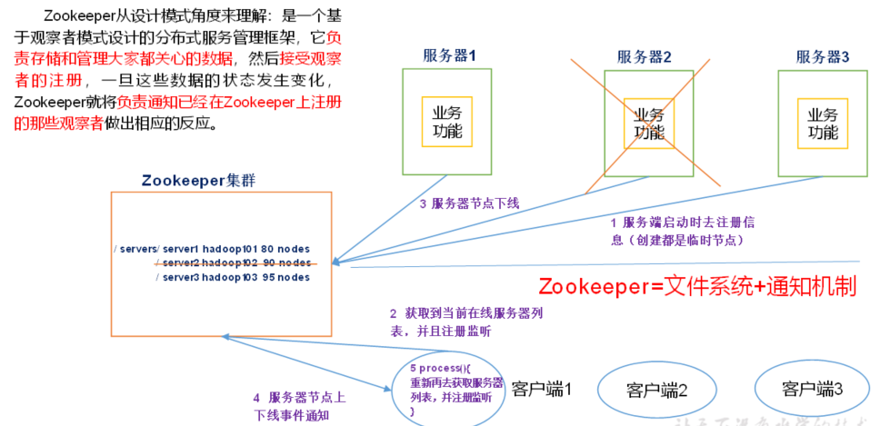
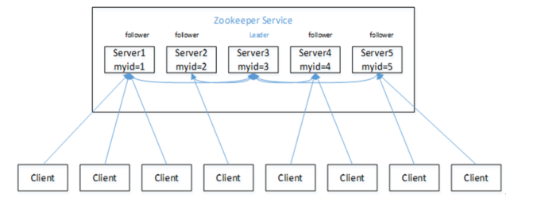
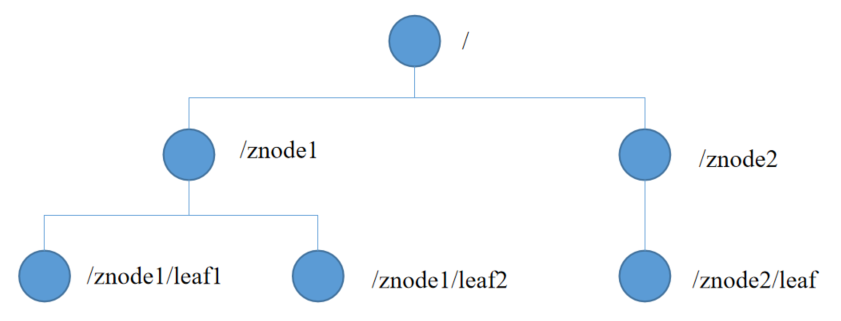
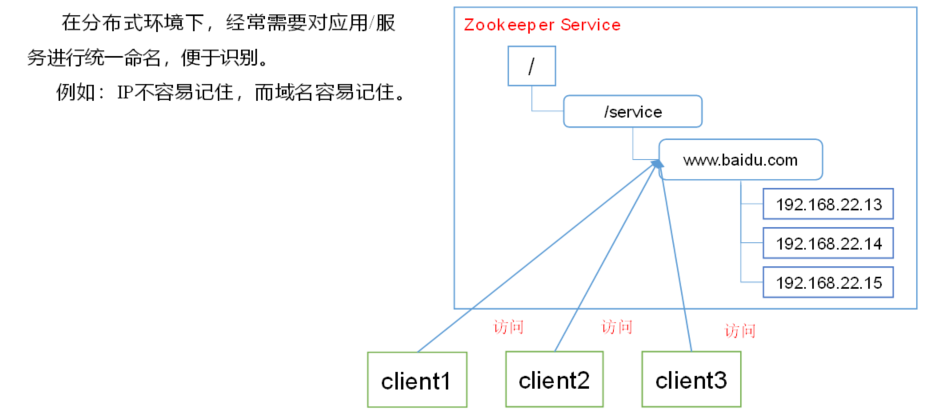
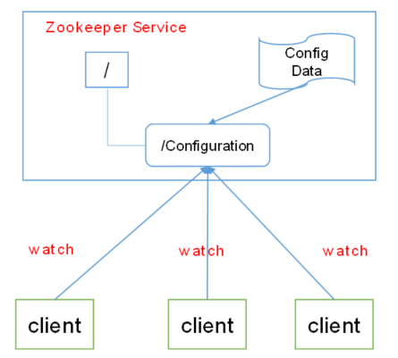
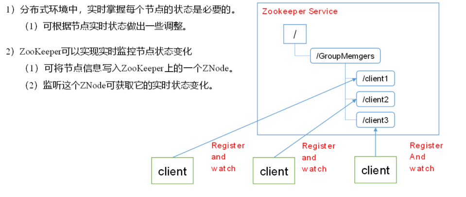
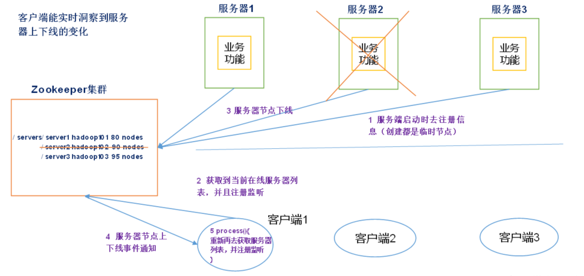
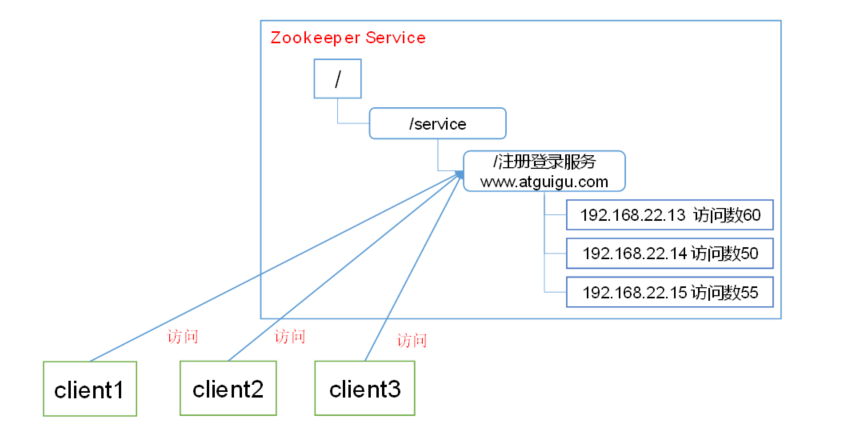
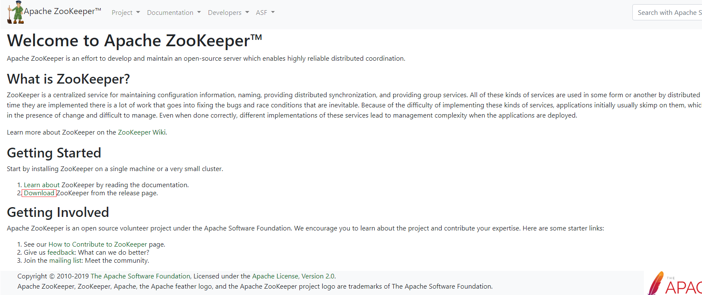

# Hadoop HA

## Zookeeper入门

### 概述

Zookeeper是一个开源的分布式的，为分布式应用提供**协调**服务的Apache项目。



> zookeeper最重要的核心是：
>
> 1. 存储数据
> 2. 当数据发生变化时，通知那些关心数据变化的客户

### 特点



1. Zookeeper：一个领导者（Leader），多个跟随者（Follower）组成的集群。
2. 集群中只要有**半数以上**节点存活，Zookeeper集群就能正常服务。
3. 全局数据一致：每个Server保存一份相同的数据副本，Client无论连接到哪个Server，数据都是一致的。
4. 更新请求顺序进行，来自同一个Client的更新请求按其发送顺序依次执行。
5. 数据更新原子性，一次数据更新要么成功，要么失败。
6. 实时性，在一定时间范围内，Client能读到最新数据。

### 数据结构

​	ZooKeeper数据模型的结构与**Unix文件系统很类似**，整体上可以看作是一棵树，每个节点称做一个ZNode。每一个ZNode默认能够存储**1MB**的数据，每个ZNode都可以通过其路径唯一标识。



**注意：**

zookeeper的`znode`与linux不同的是，**它不存在文件与文件夹的区分**，父节点不仅可以有子节点，自身也可以存数据

### 应用场景

​	zookeeper由于其抽象度极高，在很多分布式架构中都有其用武之地，hadoop集群中它可以实现高可用，可以协调hbase、hive、kafka等，除此之外它还可以在一些分布式场景中发挥如下作用：

统一命名服务、统一配置管理、统一集群管理、服务器节点动态上下线、软负载均衡等。

#### 统一命名服务

​	在分布式环境下，经常需要对应用/服务进行统一命名，便于识别。
​	例如：IP不容易记住，而域名容易记住。



#### 统一配置管理



1. 分布式环境下，配置文件同步非常常见。
   - 一般要求一个集群中，所有节点的配置信息是一致的，比如 Kafka 集群。
   - 对配置文件修改后，希望能够快速同步到各个节点上。
2. 配置管理可交由ZooKeeper实现。
   - 可将配置信息写入ZooKeeper上的一个Znode。
   - 各个客户端服务器监听这个Znode
   - 一旦Znode中的数据被修改，ZooKeeper将通知各个客户端服务器。

#### 统一集群管理



#### 服务器节点动态上下线



#### 软负载均衡

​	在Zookeeper中记录每台服务器的访问数，让访问数最少的服务器去处理最新的客户端请求



## Zookeeper安装

### 下载地址

官网首页：https://zookeeper.apache.org/




### 本地模式安装部署

#### 1.安装前准备

1. 安装Jdk

2. 拷贝Zookeeper安装包到Linux系统下

3. 解压到指定目录

   ```bash
   $ tar -zxvf zookeeper-3.6.0.tar.gz -C /opt/module/
   ```

#### 2.配置修改

1. 将`/opt/module/zookeeper-3.6.0/conf`这个路径下的`zoo_sample.cfg`修改为`zoo.cfg`；

   ```bash
   $ mv zoo_sample.cfg zoo.cfg
   ```

2. 打开`zoo.cfg`文件，修改`dataDir`路径：

   ```bash
   $ vim zoo.cfg
   ----------------
   dataDir=/opt/module/zookeeper-3.6.0/zkData
   ```

3. 在`/opt/module/zookeeper-3.6.0/`这个目录上创建`zkData`文件夹

   ```bash
   $ mkdir zkData
   ```

#### 3.操作zookeeper

1. 启动Zookeeper

   ```bash
   $ bin/zkServer.sh start
   ```

2. 查看进程是否启动

   ```bash
   $ jps
   -------------
   4020 Jps
   4001 QuorumPeerMain
   ```

   > Quorum代表多数，Peer代表集群中的每个节点，从这个进程名也能看出zookeeper是个少数服从多数的集群，只要半数以上的节点存活，集群就能正常工作

3. 查看状态

   ```bash
   $ bin/zkServer.sh status
   -------------------
   Client port found: 2181. Client address: localhost.
   Mode: standalone
   ```

4. 启动客户端

   ```bash
   $ bin/zkCli.sh
   ```

5. 退出客户端：

   ```bash
   [zk: localhost:2181(CONNECTED) 0] quit
   ```

6. 停止Zookeeper

   ```bash
   $ bin/zkServer.sh stop
   ```

### 配置参数解读

Zookeeper中的配置文件zoo.cfg中参数含义解读如下：

1. tickTime

   tickTime =2000,通信心跳数，Zookeeper服务器与客户端心跳时间，单位毫秒

   > Zookeeper使用的基本时间，服务器之间或客户端与服务器之间维持心跳的时间间隔，也就是每个tickTime时间就会发送一个心跳，时间单位为毫秒。
   >
   > 它用于心跳机制，并且设置最小的session超时时间为两倍心跳时间。(session的最小超时时间是2*tickTime)

2. initLimit

   initLimit =10：LF初始通信时限

   > 集群中的Follower跟随者服务器与Leader领导者服务器之间**初始连接时**能容忍的最多心跳数（tickTime的数量），用它来限定集群中的Zookeeper服务器连接到Leader的时限。

3. syncLimit

   syncLimit =5：LF同步通信时限

   > 集群中Leader与Follower之间的最大响应时间单位，假如响应超过syncLimit * tickTime，Leader认为Follwer死掉，从服务器列表中删除Follwer。

4. dataDir

   数据文件目录+数据持久化路径,主要用于保存Zookeeper中的数据。

5. clientPort

   clientPort =2181：客户端连接端口，监听客户端连接的端口。

## Zookeeper实战（重点）

### 分布式安装部署

#### 1.集群规划

在hadoop152、hadoop153和hadoop154三个节点上部署Zookeeper。

#### 2.解压安装

1. 解压Zookeeper安装包到/opt/module/目录下

   ```bash
   $ tar -zxvf zookeeper-3.6.0.tar.gz -C /opt/module/
   ```

#### 3.配置服务器编号

1. 在/opt/module/zookeeper-3.6.0/这个目录下创建zkData

   ```bash
   $ mkdir -p zkData
   ```

2. 在zkData中编辑myid文件

   ```bash
   $ touch myid
   $ echo 2 > myid  #注意这里的数字要和zoo.cfg里的server.id对应上 
   ```

#### 4.配置zoo.cfg文件

1. 重命名/opt/module/zookeeper-3.6.0/conf这个目录下的zoo_sample.cfg为zoo.cfg

   ```bash
   $ mv zoo_sample.cfg zoo.cfg
   ```

2. 修改存储路径

   ```bash
   dataDir=/opt/module/zookeeper-3.6.0/zkData
   ```

3. 增加多节点配置

   ```bash
   server.2=hadoop152:2888:3888
   server.3=hadoop153:2888:3888
   server.4=hadoop154:2888:3888
   ```

   > 配置参数解读
   >
   > ```bash
   > server.A=B:C:D
   > ```
   >
   > **A**是一个数字，表示这个是第几号服务器；
   >
   > 集群模式下配置一个文件myid，这个文件在dataDir目录下，这个文件里面有一个数据就是A的值，Zookeeper启动时读取此文件，拿到里面的数据与zoo.cfg里面的配置信息比较从而判断到底是哪个server。
   >
   > **B**是这个服务器的地址；
   >
   > **C**是这个服务器Follower与集群中的Leader服务器交换信息的端口；
   >
   > **D**是万一集群中的Leader服务器挂了，需要一个端口来重新进行选举，选出一个新的Leader，而这个端口就是用来执行选举时服务器相互通信的端口。

#### 5. 修改`zkEnv.sh`

我们还需要配置一下zookeeper存储日志的位置

```bash
$ vim bin/zkEnv.sh
----------

```

#### 6.分发zookeeper

将zookeeper分发到其他集群

```bash
$ xsync zookeeper-3.6.0/ 153-154
```

#### 7.集群操作

1. 分别启动集群

   ```bash
   $ bin/zkServer.sh start
   ```

2. 查看状态

   ```bash
   $ bin/zkServer.sh status
   ```

### 客户端命令操作

| 命令基本语法    | 功能描述                                         |
| --------------- | ------------------------------------------------ |
| help            | 显示所有操作命令                                 |
| ls [-w] path    | 使用 ls 命令来查看当前znode中所包含的内容        |
| ls -s [-w] path | 查看当前节点数据并能看到更新次数等数据           |
| create          | 普通创建-s  含有序列-e  临时（重启或者超时消失） |
| get [-w] path   | 获得节点的值                                     |
| set             | 设置节点的具体值                                 |
| stat            | 查看节点状态                                     |
| delete          | 删除节点                                         |
| deleteall       | 递归删除节点                                     |

#### 启动客户端

```bash
$ bin/zkCli.sh
```

#### 显示所有操作命令

```bash
[zk: localhost:2181(CONNECTED) 1] help
```

#### 查看当前znode中所包含的内容

```bash
[zk: localhost:2181(CONNECTED) 0] ls /
-------------
[zookeeper]
```

#### 查看当前节点详细数据

```bash
[zk: localhost:2181(CONNECTED) 1] ls -s  /
[zookeeper]
cZxid = 0x0
ctime = Thu Jan 01 08:00:00 CST 1970
mZxid = 0x0
mtime = Thu Jan 01 08:00:00 CST 1970
pZxid = 0x0
cversion = -1
dataVersion = 0
aclVersion = 0
ephemeralOwner = 0x0
dataLength = 0
numChildren = 1
```

#### 分别创建2个普通节点

```bash
[zk: localhost:2181(CONNECTED) 3] create /sanguo "jinlian"
Created /sanguo
[zk: localhost:2181(CONNECTED) 4] create /sanguo/shuguo "liubei"
Created /sanguo/shuguo
```

#### 获得节点的值

```bash
[zk: localhost:2181(CONNECTED) 5] get -s /sanguo
jinlian
cZxid = 0x100000003
ctime = Wed Aug 29 00:03:23 CST 2018
mZxid = 0x100000003
mtime = Wed Aug 29 00:03:23 CST 2018
pZxid = 0x100000004
cversion = 1
dataVersion = 0
aclVersion = 0
ephemeralOwner = 0x0
dataLength = 7
numChildren = 1
[zk: localhost:2181(CONNECTED) 6]
[zk: localhost:2181(CONNECTED) 6] get /sanguo/shuguo
liubei
cZxid = 0x100000004
ctime = Wed Aug 29 00:04:35 CST 2018
mZxid = 0x100000004
mtime = Wed Aug 29 00:04:35 CST 2018
pZxid = 0x100000004
cversion = 0
dataVersion = 0
aclVersion = 0
ephemeralOwner = 0x0
dataLength = 6
numChildren = 0
```

#### 创建临时节点

```bash
[zk: localhost:2181(CONNECTED) 7] create -e /sanguo/wuguo "zhouyu"
Created /sanguo/wuguo
```

1.在当前客户端是能查看到的

```bash
[zk: localhost:2181(CONNECTED) 3] ls /sanguo 
[wuguo, shuguo]
```

2.退出当前客户端然后再重启客户端

```bash
[zk: localhost:2181(CONNECTED) 12] quit
[atguigu@hadoop104 zookeeper-3.4.10]$ bin/zkCli.sh
```

3.再次查看根目录下短暂节点已经删除

```bash
[zk: localhost:2181(CONNECTED) 0] ls /sanguo
[shuguo]
```

#### 创建带序号的节点

1.先创建一个普通的根节点/sanguo/weiguo

```bash
[zk: localhost:2181(CONNECTED) 1] create /sanguo/weiguo "caocao"
Created /sanguo/weiguo
```

2.创建带序号的节点

```bash
[zk: localhost:2181(CONNECTED) 2] create -s /sanguo/weiguo/xiaoqiao "jinlian"
Created /sanguo/weiguo/xiaoqiao0000000000
[zk: localhost:2181(CONNECTED) 3] create -s /sanguo/weiguo/daqiao "jinlian"
Created /sanguo/weiguo/daqiao0000000001
[zk: localhost:2181(CONNECTED) 4] create -s /sanguo/weiguo/diaocan "jinlian"
Created /sanguo/weiguo/diaocan0000000002
```

如果原来没有序号节点，序号从0开始依次递增。如果原节点下已有2个节点，则再排序时从2开始，以此类推。

**注意**：zookeeper的序号是全局序号，添加任何节点，序号都会递增

#### 修改节点数据值

```bash
[zk: localhost:2181(CONNECTED) 6] set /sanguo/weiguo "simayi"
```

#### 节点的值变化监听

1.在hadoop154主机上注册监听/sanguo节点数据变化

```bash
[zk: localhost:2181(CONNECTED) 26] [zk: localhost:2181(CONNECTED) 8] get /sanguo watch
#3.6版本用一下命令
[zk: localhost:2181(CONNECTED) 26] [zk: localhost:2181(CONNECTED) 8] get -w /sanguo
```

2.在hadoop153主机上修改/sanguo节点的数据

```bash
[zk: localhost:2181(CONNECTED) 1] set /sanguo "xisi"
```

3.观察hadoop154主机收到数据变化的监听

```bash
WATCHER::
WatchedEvent state:SyncConnected type:NodeDataChanged path:/sanguo
```

> 再次修改，再观察，会发现观察不到修改通知了
>
> 原因是zookeeper维护着每个节点的观察者列表，发生一次修改，通知完，列表会被清空，想监听下次修改，需要重新注册。

#### 节点的子节点变化监听

1.在hadoop154主机上注册监听/sanguo节点的子节点变化

```bash
[zk: localhost:2181(CONNECTED) 1] ls /sanguo watch
[aa0000000001, server101]
# 3.6用以下命令
[zk: localhost:2181(CONNECTED) 1] ls -w /sanguo 
[aa0000000001, server101]
```

2.在hadoop153主机/sanguo节点上创建子节点

```bash
[zk: localhost:2181(CONNECTED) 2] create /sanguo/jin "simayi"
Created /sanguo/jin
```

3.观察hadoop154主机收到子节点变化的监听

```bahs
WATCHER::
WatchedEvent state:SyncConnected type:NodeChildrenChanged path:/sanguo
```

#### 删除节点

```bash
[zk: localhost:2181(CONNECTED) 4] delete /sanguo/jin
```

#### 递归删除节点

```bash
[zk: localhost:2181(CONNECTED) 15] deleteall /sanguo/shuguo
```

#### 查看节点状态

```bash
[zk: localhost:2181(CONNECTED) 17] stat /sanguo
cZxid = 0x100000003
ctime = Wed Aug 29 00:03:23 CST 2018
mZxid = 0x100000011
mtime = Wed Aug 29 00:21:23 CST 2018
pZxid = 0x100000014
cversion = 9
dataVersion = 1
aclVersion = 0
ephemeralOwner = 0x0
dataLength = 4
numChildren = 1
```

