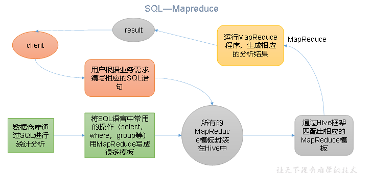
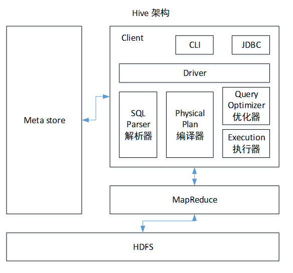
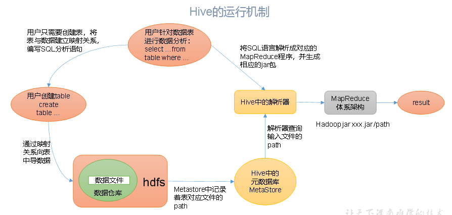
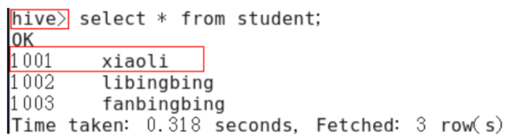
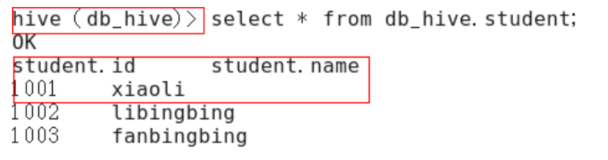
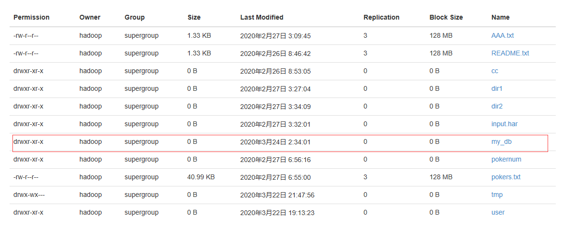
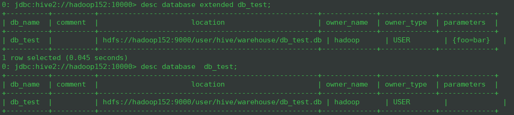
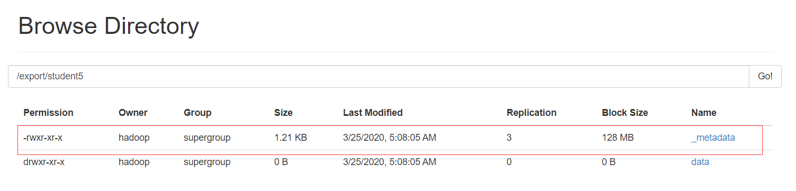

# Hive

## Hive基本概念

### 什么是Hive

Hive：由Facebook开源用于解决海量结构化日志的数据统计。

Hive是基于Hadoop的一个**数据仓库工具**，可以**将结构化的数据文件映射为一张表**，并提供**类SQL查询**功能。

本质是：**将HQL转化成MapReduce程序**



1. Hive处理的数据存储在HDFS

2. Hive分析数据底层的实现是MapReduce

3. 执行程序运行在Yarn上

### Hive的优缺点

#### 优点

1. 操作接口采用类SQL语法，提供快速开发的能力（简单、容易上手）。

2. 避免了去写MapReduce，减少开发人员的学习成本。

3. Hive的执行延迟比较高，因此Hive常用于数据分析，对实时性要求不高的场合。

4. Hive优势在于处理大数据，对于处理小数据没有优势，因为Hive的执行延迟比较高。

5. Hive支持用户自定义函数，用户可以根据自己的需求来实现自己的函数。

#### 缺点

##### 1.Hive的HQL表达能力有限

1. 迭代式算法无法表达

2. 数据挖掘方面不擅长，由于MapReduce数据处理流程的限制，效率更高的算法却无法实现。

##### 2.Hive的效率比较低

1. Hive自动生成的MapReduce作业，通常情况下不够智能化

2. Hive调优比较困难，粒度较粗

### Hive的架构原理



#### 1．用户接口：Client

​	CLI（command-line interface）、JDBC/ODBC(jdbc访问hive)、WEBUI（浏览器访问hive）

#### 2．元数据：Metastore

​	元数据包括：表名、表所属的数据库（默认是default）、表的拥有者、列/分区字段、表的类型（是否是外部表）、表的数据所在目录等；

默认存储在自带的derby数据库中，推荐使用MySQL存储Metastore

#### 3．Hadoop

使用HDFS进行存储，使用MapReduce进行计算。

#### 4．驱动器：Driver

1. 解析器（SQL Parser）：将SQL字符串转换成抽象语法树AST，这一步一般都用第三方工具库完成，比如antlr；对AST进行语法分析，比如表是否存在、字段是否存在、SQL语义是否有误。

2. 编译器（Physical Plan）：将AST编译生成逻辑加入执行计划。

3. 优化器（Query Optimizer）：对逻辑执行计划进行优化。

4. 执行器（Execution）：把逻辑执行计划转换成可以运行的物理计划。对于Hive来说，就是MR/Spark。



​	Hive通过给用户提供的一系列交互接口，接收到用户的指令(SQL)，使用自己的Driver，结合元数据(MetaStore)，将这些指令翻译成MapReduce，提交到Hadoop中执行，最后，将执行返回的结果输出到用户交互接口。

### Hive和数据库比较

​	由于 Hive 采用了类似SQL 的查询语言 HQL(Hive Query Language)，因此很容易将 Hive 理解为数据库。其实从结构上来看，Hive 和数据库除了拥有类似的查询语言，再无类似之处。本文将从多个方面来阐述 Hive 和数据库的差异。数据库可以用在 Online 的应用中，但是Hive 是为数据仓库而设计的，清楚这一点，有助于从应用角度理解 Hive 的特性。

#### 查询语言

​	由于SQL被广泛的应用在数据仓库中，因此，专门针对Hive的特性设计了类SQL的查询语言HQL。熟悉SQL开发的开发者可以很方便的使用Hive进行开发。

#### 数据存储位置

​	Hive 是建立在 Hadoop 之上的，所有 Hive 的数据都是存储在 HDFS 中的。而数据库则可以将数据保存在块设备或者本地文件系统中。

#### 数据更新

​	由于Hive是针对数据仓库应用设计的，而数据仓库的内容是读多写少的。因此，Hive中不建议对数据的改写，所有的数据都是在加载的时候确定好的。而数据库中的数据通常是需要经常进行修改的，因此可以使用 INSERT INTO … VALUES 添加数据，使用 UPDATE … SET修改数据。

#### 执行

​	Hive中大多数查询的执行是通过 Hadoop 提供的 MapReduce 来实现的。而数据库通常有自己的执行引擎。

#### 执行延迟

​	Hive 在查询数据的时候，由于没有索引，需要扫描整个表，因此延迟较高。另外一个导致 Hive 执行延迟高的因素是 MapReduce框架。由于MapReduce 本身具有较高的延迟，因此在利用MapReduce 执行Hive查询时，也会有较高的延迟。相对的，数据库的执行延迟较低。当然，这个低是有条件的，即数据规模较小，当数据规模大到超过数据库的处理能力的时候，Hive的并行计算显然能体现出优势。

#### 可扩展性

​	由于Hive是建立在Hadoop之上的，因此Hive的可扩展性是和Hadoop的可扩展性是一致的（世界上最大的Hadoop 集群在 Yahoo!，2009年的规模在4000 台节点左右）。而数据库由于 ACID 语义的严格限制，扩展行非常有限。目前最先进的并行数据库 [Oracle](http://lib.csdn.net/base/oracle) 在理论上的扩展能力也只有100台左右。

#### 数据规模

​	由于Hive建立在集群上并可以利用MapReduce进行并行计算，因此可以支持很大规模的数据；对应的，数据库可以支持的数据规模较小。

## Hive安装与基本使用

>  Hive相关地址
>
>  1．Hive官网地址
>
>  http://hive.apache.org/
>
>  2．文档查看地址
>
>  https://cwiki.apache.org/confluence/display/Hive/GettingStarted
>
>  3．下载地址
>
>  http://archive.apache.org/dist/hive/
>
>  4．github地址
>
>  https://github.com/apache/hive

### Mysql安装

​	配置企业使用的hive，元数据一定要用mysql(默认的derby数据库不支持多点登录)，所有mysql的配置至关重要。centos-7安装mysql稍许麻烦，原因是centos-7默认的数据块是MariaDB，因此安装mysql 前先进行mariadb的卸载。

#### 1.卸载mariadb

```bash
# rpm -qa |grep mariadb
----------------
mariadb-libs-5.5.50-1.el7_2.x86_64

# yum remove -y  mariadb-libs-5.5.50-1.el7_2.x86_64
```

#### 2.下载mysql bundle

> 下载地址：https://downloads.mysql.com/archives/community/

下载完成后，将mysql-bundle.tar解压

```bash
# tar -xvf my MySQL-5.6.42-1.el7.x86_64.rpm-bundle.tar
```

#### 3. 安装Mysql Server

```bash
# rpm -ivh MySQL-server-5.6.42-1.el7.x86_64.rpm
```

查看随机生成的密码

```bash
# cat /root/.mysql_secret
```

启动mysql服务和开机自启动

```bash
# systemctl start mysql
# systemctl enable mysql
```

#### 4. 安装客户端

```bash
# rpm -ivh MySQL-client-5.6.42-1.el6.x86_64.rpm
```

访问mysql

```bash
# mysql -uroot -pOEXaQuS8IWkG19Xs
```

修改随机密码

```bash
mysql>SET PASSWORD=PASSWORD('1234');
```

#### 5.修改mysql配置文件

```bash
# vim /usr/my.cnf
------------------
bind-address=0.0.0.0
```

重启mysql

```bash
# systemctl restart mysql
```

#### 6.赋予root远程访问权限

```bash
$ mysql -u root -p 1234
---------------
mysql > GRANT ALL PRIVILEGES ON *.* TO 'root'@'hadoop152' IDENTIFIED BY '1234' WITH GREANT OPTION;
mysql > FLUSH PRIVILEGES
```


### Hive安装部署

#### 1.解压`apache-hive-2.3.6-bin.tar.gz`

```bash
$ tar -xzcf apache-hive-2.3.6-bin.tar.gz -C /opt/module
# 重命名
$ cd /opt/module
$ mv apache-hive-2.3.6-bin hive
```

#### 2.配置环境变量

```bash
$ sudo vim /etc/profile
-------------------
export HIVE_HOME=/opt/module/hive
export PATH=$PATH:$HIVE_HOME/bin
```

#### 3.修改hive配置文件

```bash
$ cd /opt/module/hive/conf
$ mv hive-env.sh.template hive-env.sh #重命名环境文件
$ mv hive-log4j2.properties.template hive-log4j2.properties #重命名日志文件
$ cp hive-default.xml.template hive-site.xml #拷贝生成xml文件
```

修改`hive-enb.sh`

```bash
export HADOOP_HOME=/opt/module/hadoop-2.7.7
export HIVE_CONF_DIR=/opt/module/hive/conf
```

修改`hive-log4j2.properties`

```properties
property.hive.log.dir =/opt/module/hive/logs
```

修改`hive-site.xml`

```xml
<!-- hive元数据地址，默认是/user/hive/warehouse -->
<property>
	<name>hive.metastore.warehouse.dir</name>
	<value>/user/hive/warehouse</value>
</property>
<!-- hive查询时输出列名 -->
<property>
	<name>hive.cli.print.header</name>
	<value>true</value>
</property>
<!-- 显示当前数据库名 -->
<property>
	<name>hive.cli.print.current.db</name>
	<value>true</value>
</property>
<!-- 开启本地模式，默认是false -->
<property>
	<name>hive.exec.mode.local.auto</name>
	<value>true</value>
</property>
<!-- URL用于连接远程元数据 -->
<property>
	<name>hive.metastore.uris</name>
	<value>thrift://hadoop152:9083</value>
	<description>Thrift URI for the remote metastore. Used by metastore client to connect to remote metastore.</description>
</property>
<!-- 元数据使用mysql数据库 -->
<property>
	<name>javax.jdo.option.ConnectionURL</name>
	<value>jdbc:mysql://hadoop152:3306/hive?createDatabaseIfNotExist=true&amp;useSSL=false</value>
	<description>JDBC connect string for a JDBC metastore</description>
</property>
<property>
	<name>javax.jdo.option.ConnectionUserName</name>
	<value>root</value>
	<description>username to use against metastore database</description>
</property>
<property>
	<name>javax.jdo.option.ConnectionPassword</name>
	<value>1234</value>
	<description>password to use against metastore database</description>
</property>
<property>
	<name>javax.jdo.option.ConnectionDriverName</name>
	<value>com.mysql.jdbc.Driver</value>
	<description>Driver class name for a JDBC metastore</description>
</property>

```

#### 4.启动hadoop集群并生成hive目录

```bash
$ start-dfs.sh
$ start-yarn.sh
```

创建目录并修改可写权限

```bash
$ hdfs dfs -mkdir /tmp #如果有这个路径，这不需要重新创建
$ hdfs dfs -mkdir -p /user/hive/warehouse #创建目录
$ hdfs dfs -chmod g+w /tmp #修改文件权限
$ hdfs dfs -chmod g+w /user/hive/warehouse #修改文件权限
```

#### 5.添加mysql驱动依赖包

```bash
$ cp mysql-connector-java-5.1.47.jar $HIVE_HOME/lib
```

#### 6. 初始化mysql元数据库

```bash
schematool -initSchema -dbType mysql 
--------------
SLF4J: Class path contains multiple SLF4J bindings.
SLF4J: Found binding in [jar:file:/opt/module/hive/lib/log4j-slf4j-impl-2.6.2.jar!/org/slf4j/impl/StaticLoggerBinder.class]
SLF4J: Found binding in [jar:file:/opt/module/hadoop-2.7.7/share/hadoop/common/lib/slf4j-log4j12-1.7.10.jar!/org/slf4j/impl/StaticLoggerBinder.class]
SLF4J: See http://www.slf4j.org/codes.html#multiple_bindings for an explanation.
SLF4J: Actual binding is of type [org.apache.logging.slf4j.Log4jLoggerFactory]
Metastore connection URL:	 jdbc:mysql://hadoop152:3306/hive?createDatabaseIfNotExist=true&useSSL=false
Metastore Connection Driver :	 com.mysql.jdbc.Driver
Metastore connection User:	 root
Starting metastore schema initialization to 2.3.0
Initialization script hive-schema-2.3.0.mysql.sql
Initialization script completed
schemaTool completed
```

进入mysql

```bash
mysql > use hive;
mysql > show tables;
--------------------
+---------------------------+
| Tables_in_hive            |
+---------------------------+
| AUX_TABLE                 |
| BUCKETING_COLS            |
| CDS                       |
| COLUMNS_V2                |
| COMPACTION_QUEUE          |
| COMPLETED_COMPACTIONS     |
| COMPLETED_TXN_COMPONENTS  |
| DATABASE_PARAMS           |
| DBS                       |
| DB_PRIVS                  |
| DELEGATION_TOKENS         |
| FUNCS                     |
| FUNC_RU                   |
| GLOBAL_PRIVS              |
| HIVE_LOCKS                |
| IDXS                      |
| INDEX_PARAMS              |
| KEY_CONSTRAINTS           |
| MASTER_KEYS               |
| NEXT_COMPACTION_QUEUE_ID  |
| NEXT_LOCK_ID              |
| NEXT_TXN_ID               |
| NOTIFICATION_LOG          |
| NOTIFICATION_SEQUENCE     |
| NUCLEUS_TABLES            |
| PARTITIONS                |
| PARTITION_EVENTS          |
| PARTITION_KEYS            |
| PARTITION_KEY_VALS        |
| PARTITION_PARAMS          |
| PART_COL_PRIVS            |
| PART_COL_STATS            |
| PART_PRIVS                |
| ROLES                     |
| ROLE_MAP                  |
| SDS                       |
| SD_PARAMS                 |
| SEQUENCE_TABLE            |
| SERDES                    |
| SERDE_PARAMS              |
| SKEWED_COL_NAMES          |
| SKEWED_COL_VALUE_LOC_MAP  |
| SKEWED_STRING_LIST        |
| SKEWED_STRING_LIST_VALUES |
| SKEWED_VALUES             |
| SORT_COLS                 |
| TABLE_PARAMS              |
| TAB_COL_STATS             |
| TBLS                      |
| TBL_COL_PRIVS             |
| TBL_PRIVS                 |
| TXNS                      |
| TXN_COMPONENTS            |
| TYPES                     |
| TYPE_FIELDS               |
| VERSION                   |
| WRITE_SET                 |
+---------------------------+
```

开启元数据

```bash
$ nohup hive --service metastore & #开启元数据
```

#### 7.启动hive并测试

```bash
$ hive
```

查看数据库

```bash
hive > show databases;
```

打开默认数据库：

```bash
hive > use default;
```

显示default数据库中的表

```bash
hive > show tables;
```

创建一张表

```bash
create table student(id int,name string);
```

显示数据库中有几张表

```bash
hive > show tables;
```

查看表结构

```bash
hive > desc student;
```

向表中插入数据

```bash
hive > insert into student values（1000,"ss"）;
```

查询表中数据

```bash
hive > select * from student;
```

退出hive

```bash
hive > quit;
```

#### 8.将本地数据导入hive

##### 需求

将本地`/opt/module/datas/student.txt`这个目录下的数据导入到hive的`student(id int, name string)`表中

##### 1.数据准备

在`/opt/module/datas`这个目录准备如下数据

```txt
1001	zhangshan
1002	lisi
1003	zhaoliu
```

> 注意以tab作为间隔

##### 2.hive实际操作

删除原student表

```
hive > drop table student;
```

创建student表，并声明文件分隔符‘\t’

```
hive > create table student(id int,name string) ROW FORMAT DELIMITED FIELDS TERMINATED BY '\t';
```

加载`/opt/module/datas/student.txt`

```bash
hive > load data local inpath '/opt/module/datas/student.txt' into table student;
```

查询结果

```
hive > select * from student;
----------------
OK
student.id	student.name
1001	zhangshan
1002	lishi
1003	zhaoliu
Time taken: 1.038 seconds, Fetched: 3 row(s)
```

### Hive JDBC访问

以上方式访问hive是在本地进行访问，我们也可以通过启动hiveserver2实现通过jdbc远程访问hive

#### 1.配置hadoop proxyuser

如果希望远程访问hive，实际上就是远程访问hdfs，那么需要将hive在hdfs中的用户权限开放给代理用户，如果想要所有代理用户都能访问，那么配置如下：

在`core-site.xml`中添加如下配置：

```xml
<property>
    <name>hadoop.proxyuser.hadoop.hosts</name>
    <value>*</value>
</property>
<property>
    <name>hadoop.proxyuser.hadoop.groups</name>
    <value>*</value>
</property>
```

#### 2.启动hiveserver2

首先开启元数据服务

```bash
$ nohup hive --service metastore & #开启元数据
```

开启hiveserver2服务

```bash
$ bin/hiveserver2
#或者后台启动
$ nohup hiverserver2 &
```

#### 3.启动beeline

beeline是一个jdbc的客户端，我们可以通过它连接hive的服务

```bash
$ beeline
beeline> !connect jdbc:hive2://hadoop152:10000（回车）
Connecting to jdbc:hive2://hadoop102:10000
Enter username for jdbc:hive2://hadoop102:10000: hadoop（回车）
Enter password for jdbc:hive2://hadoop102:10000: 1234（直接回车）
Connected to: Apache Hive (version 1.2.1)
Driver: Hive JDBC (version 1.2.1)
Transaction isolation: TRANSACTION_REPEATABLE_READ
0: jdbc:hive2://hadoop102:10000> show databases;
+----------------+--+
| database_name  |
+----------------+--+
| default        |
| hive_db2       |
+----------------+--+
```

或者直接连接服务

```bash
$ beeline -n hadoop -p 1234 -u jdbc:hive2://hadoop152:10000
```

### Hive常用命令交互

```bash
$ bin/hive -help
------------
usage: hive
 -d,--define <key=value>          Variable substitution to apply to Hive
                                  commands. e.g. -d A=B or --define A=B
    --database <databasename>     Specify the database to use
 -e <quoted-query-string>         SQL from command line
 -f <filename>                    SQL from files
 -H,--help                        Print help information
    --hiveconf <property=value>   Use value for given property
    --hivevar <key=value>         Variable substitution to apply to Hive
                                  commands. e.g. --hivevar A=B
 -i <filename>                    Initialization SQL file
 -S,--silent                      Silent mode in interactive shell
 -v,--verbose                     Verbose mode (echo executed SQL to the
                                  console)

```

#### 1."-e" 不进入hive的交互窗口执行sql

```bash
$ hive -e "select id from student;"
--------
OK
id
1001
1002
1003
Time taken: 2.64 seconds, Fetched: 3 row(s)

```

#### 2."-f" 执行脚本中的sql语句

1. 在`opt/module/datas`中创建hivef.sql文件

   ```sql
   select * from student
   ```

2. 执行文件中的sql语句

   ```bash
   $ hive -f /opt/module/datas/hivef.sql
   -------
   Logging initialized using configuration in file:/opt/module/hive/conf/hive-log4j2.properties Async: true
   OK
   student.id	student.name
   1001	zhangshan
   1002	lishi
   1003	zhaoliu
   Time taken: 2.798 seconds, Fetched: 3 row(s)
   ```

3. 执行文件中的sql语句并将结果写入文件中

   ```bash
   $ hive -f /opt/module/datas/hivef.sql > /opt/module/datas/hive_result.txt
   $ cat hive_result.txt
   ---------
   student.id	student.name
   1001	zhangshan
   1002	lishi
   1003	zhaoliu
   ```

### Hive其他命令操作

#### 1.退出hive窗口

```bash
hive(default)>exit;
hive(default)>quit;
```

#### 2.查看hdfs文件系统

```bash
hive(default)>dfs -ls /;
```

#### 3.查看本地文件系统

```bash
hive(default)>! ls /opt/module/datas;
```

#### 4.查看所有历史命令

```bash
cd ~
cat .hivehistory
```

### Hive常见属性配置

#### Hive数据仓库位置配置

1. Default数据仓库的最原始位置是在hdfs上的：/user/hive/warehouse路径下

2. 在仓库目录下，没有对默认的数据库default创建文件夹。如果某张表属于default数据库，直接在数据仓库目录下创建一个文件夹。

3. 修改default数据仓库原始位置（将hive-default.xml.template如下配置信息拷贝到hive-site.xml文件中）。

   ```xml
   <property>
   <name>hive.metastore.warehouse.dir</name>
   <value>/user/hive/warehouse</value>
   <description>location of default database for the warehouse</description>
   </property>
   ```

   配置同组用户有执行权限

   ```bash
   hdfs dfs -chmod g+w /user/hive/warehouse
   ```

#### 查询后信息显示配置

1. 在`hive-site.xml`文件中添加如下配置信息，就可以实现显示当前数据库，以及查询表的头信息配置。

   ```xml
   <property>
   	<name>hive.cli.print.header</name>
   	<value>true</value>
   </property>
   
   <property>
   	<name>hive.cli.print.current.db</name>
   	<value>true</value>
   </property>
   ```

2. 重新启动hive，对比配置前后差异。





#### Hive运行日志信息配置

1.Hive的log默认存放在`/tmp/atguigu/hive.log`目录下（当前用户名下）

2.修改hive的log存放日志到`/opt/module/hive/logs`

1. 修改`/opt/module/hive/conf/hive-log4j2.properties.template`文件名称为

   `hive-log4j2.properties`

2. 在`hive-log4j2.properties`文件中修改log存放位置

   ```properties
   property.hive.log.dir =/opt/module/hive/logs
   ```

### 参数配置方式

#### 1．查看当前所有的配置信息

```bash
bashhive>set;
```

#### 2．参数的配置三种方式

##### 1.配置文件方式

默认配置文件：`hive-default.xml `

用户自定义配置文件：`hive-site.xml`

>  注意：用户自定义配置会覆盖默认配置。另外，Hive也会读入Hadoop的配置，因为Hive是作为Hadoop的客户端启动的，Hive的配置会覆盖Hadoop的配置。配置文件的设定对本机启动的所有Hive进程都有效。

##### 2.命令行参数方式

启动Hive时，可以在命令行添加`-hiveconf param=value`来设定参数。

例如：

```bash
$ bin/hive -hiveconf mapred.reduce.tasks=10;
```

> 注意：仅对本次hive启动有效

查看参数设置：

```bash
hive (default)> set mapred.reduce.tasks;
```

##### 3.参数声明方式

可以在HQL中使用SET关键字设定参数

例如：

```bash
hive (default)> set mapred.reduce.tasks=100;
```

> 注意：仅对本次hive启动有效。

查看参数设置

```bash
hive (default)> set mapred.reduce.tasks;
```

上述三种设定方式的优先级依次递增。即**配置文件<命令行参数<参数声明**。注意某些系统级的参数，例如log4j相关的设定，必须用前两种方式设定，因为那些参数的读取在会话建立以前已经完成了。

## Hive数据类型

### 基本数据类型

| Hive数据类型 | Java数据类型 | 长度                                                 | 例子                                 |
| ------------ | ------------ | ---------------------------------------------------- | ------------------------------------ |
| TINYINT      | byte         | 1byte有符号整数                                      | 20                                   |
| SMALINT      | short        | 2byte有符号整数                                      | 20                                   |
| INT          | int          | 4byte有符号整数                                      | 20                                   |
| BIGINT       | long         | 8byte有符号整数                                      | 20                                   |
| BOOLEAN      | boolean      | 布尔类型，true或者false                              | TRUE  FALSE                          |
| FLOAT        | float        | 单精度浮点数                                         | 3.14159                              |
| DOUBLE       | double       | 双精度浮点数                                         | 3.14159                              |
| STRING       | string       | 字符系列。可以指定字符集。可以使用单引号或者双引号。 | ‘now is the time’ “for all good men” |
| TIMESTAMP    |              | 时间类型                                             |                                      |
| BINARY       |              | 字节数组                                             |                                      |

​	对于Hive的String类型相当于数据库的varchar类型，该类型是一个可变的字符串，不过它不能声明其中最多能存储多少个字符，理论上它可以存储2GB的字符数。

### 集合数据类型

| 数据类型 | 描述                                                         | 语法示例                                        |
| -------- | ------------------------------------------------------------ | ----------------------------------------------- |
| STRUCT   | 和c语言中的struct类似，都可以通过“点”符号访问元素内容。例如，如果某个列的数据类型是STRUCT{first STRING, last STRING},那么第1个元素可以通过字段.first来引用。 | struct() 例如struct<street:string, city:string> |
| MAP      | MAP是一组键-值对元组集合，使用数组表示法可以访问数据。例如，如果某个列的数据类型是MAP，其中键->值对是’first’->’John’和’last’->’Doe’，那么可以通过字段名[‘last’]获取最后一个元素 | map()例如map<string, int>                       |
| ARRAY    | 数组是一组具有相同类型和名称的变量的集合。这些变量称为数组的元素，每个数组元素都有一个编号，编号从零开始。例如，数组值为[‘John’, ‘Doe’]，那么第2个元素可以通过数组名[1]进行引用。 | Array()例如array<string>                        |

Hive有三种复杂数据类型**ARRAY**、**MAP** 和 **STRUCT**。**ARRAY**和**MAP**与Java中的Array和Map类似，而**STRUCT**与C语言中的Struct类似，它封装了一个命名字段集合，复杂数据类型允许任意层次的嵌套。

#### 实际案例

1. 假设某表有如下一行，我们用JSON格式来表示其数据结构。在Hive下访问的格式为

   ```json
   {
       "name": "songsong",
       "friends": ["bingbing" , "lili"] ,       //列表Array, 
       "children": {                      //键值Map,
           "xiao song": 18 ,
           "xiaoxiao song": 19
       }
       "address": {                      //结构Struct,
           "street": "hui long guan" ,
           "city": "beijing" 
       }
   }
   ```

2. 基于上述数据结构，我们在Hive里创建对应的表，并导入数据。 

   创建本地测试文件test.txt

   ```
   songsong,bingbing_lili,xiao song:18_xiaoxiao song:19,hui long guan_beijing
   yangyang,caicai_susu,xiao yang:18_xiaoxiao yang:19,chao yang_beijing
   ```

3. Hive上创建测试表test

   ```sql
   create table test(
   name string,
   friends array<string>,
   children map<string, int>,
   address struct<street:string, city:string>
   )
   row format delimited fields terminated by ','
   collection items terminated by '_'
   map keys terminated by ':'
   lines terminated by '\n';
   ```

   > 字段解释
   >
   > row format delimited fields terminated by ','  -- 列分隔符
   >
   > collection items terminated by '_'  	--MAP STRUCT 和 ARRAY 的分隔符(数据分割符号)
   >
   > map keys terminated by ':'				-- MAP中的key与value的分隔符
   >
   > lines terminated by '\n';					-- 行分隔符

4. 导入文本数据到测试表

   ```bash
   hive (default)> load data local inpath '/opt/module/datas/test.txt' into table test
   ```

5. 访问三种集合列里的数据，以下分别是ARRAY，MAP，STRUCT的访问方式

   ```bash
   hive (default)> select friends[1],children['xiao song'],address.city from test
   where name="songsong";
   OK
   _c0     _c1     city
   lili    18      beijing
   Time taken: 0.076 seconds, Fetched: 1 row(s)
   ```

### 类型转化

​	Hive的原子数据类型是可以进行隐式转换的，类似于Java的类型转换，例如某表达式使用INT类型，TINYINT会自动转换为INT类型，**但是Hive不会进行反向转化，**例如，某表达式使用TINYINT类型，INT不会自动转换为TINYINT类型，它会返回错误，除非使用CAST操作。

#### 1.隐式类型转换规则

1. 任何整数类型都可以隐式地转换为一个范围更广的类型，如TINYINT可以转换成INT，INT可以转换成BIGINT。
2. 所有整数类型、FLOAT和**STRING类型**都可以隐式地转换成DOUBLE。
3. TINYINT、SMALLINT、INT都可以转换为FLOAT。
4. BOOLEAN类型不可以转换为任何其它的类型。

#### 2.使用CAST操作显示进行数据类型转换

​	例如CAST('1' AS INT)将把字符串'1' 转换成整数1；如果强制类型转换失败，如执行CAST('X' AS INT)，表达式返回空值 NULL。

```bash
0: jdbc:hive2://hadoop152:10000> select '1'+2, cast('1'as int) + 2;
+------+------+--+
| _c0  | _c1  |
+------+------+--+
| 3.0  | 3    |
+------+------+--+
```

## DDL数据定义

### 创建数据库

```sql
CREATE DATABASE [IF NOT EXISTS] database_name
[COMMENT database_comment]
[LOCATION hdfs_path]
[WITH DBPROPERTIES (property_name=property_value, ...)];
```

> [IF NOT EXISTS] ：表没有就创建，有就不执行创建
>
> [COMMENT database_comment] : 表的注释
>
> [LOCATION hdfs_path] : 表对应的hdfs地址
>
> [WITH DBPROPERTIES (property_name=property_value, ...)] : 表的额外属性

1. 创建一个数据库，数据库在HDFS上的默认存储路径是/user/hive/warehouse/*.db

   ```sql
   hive (default)> create database db_test;
   ```

2. 避免要创建的数据库已经存在错误，增加if not exists判断。（标准写法）

   ```sql
   hive (default)> create database db_test;
   -----------
   FAILED: Execution Error, return code 1 from org.apache.hadoop.hive.ql.exec.DDLTask. Database db_hive already exists
   
   hive (default)> create database if not exists db_test;
   ```

3. 创建一个数据库，指定数据库在HDFS上存放的位置

   ```sql
   hive (default)> create database db_test2 location '/my_db';
   ```

   查看hdfs web应用

   

### 查询数据库

#### 1.显示数据库

```sql
hive> show databases;
```

#### 2.过滤显示查询的数据库

```bash
hive > show databases like 'd*';
------------
+----------------+
| database_name  |
+----------------+
| db_test        |
| default        |
+----------------+
```

#### 3.查看数据库详情

##### 1.显示数据信息

```bash
hive > desc database db_test;
-----------
+----------+----------+----------------------------------------------------+-------------+-------------+-------------+
| db_name  | comment  |                      location                      | owner_name  | owner_type  | parameters  |
+----------+----------+----------------------------------------------------+-------------+-------------+-------------+
| db_test  |          | hdfs://hadoop152:9000/user/hive/warehouse/db_test.db | hadoop      | USER        |             |
+----------+----------+----------------------------------------------------+-------------+-------------+-------------+

```

##### 2.显示数据库详细信息

先给数据库添加一些额外属性

```bash
hive > alter database db_test set DBPROPERTIES('foo'='bar')
```

然后查询表详细信息

```bash
hive> desc database extended db_test;
---------
+----------+----------+----------------------------------------------------+-------------+-------------+-------------+
| db_name  | comment  |                      location                      | owner_name  | owner_type  | parameters  |
+----------+----------+----------------------------------------------------+-------------+-------------+-------------+
| db_test  |          | hdfs://hadoop152:9000/user/hive/warehouse/db_test.db | hadoop      | USER        | {foo=bar}   |
+----------+----------+----------------------------------------------------+-------------+-------------+-------------+

```



#### 4.切换数据库

```bash
hive > use default;
```

### 修改数据库

​	用户可以使用`ALTER DATABASE`命令为某个数据库的`DBPROPERTIES`设置键-值对属性值，来描述这个数据库的属性信息。**数据库的其他元数据信息都是不可更改的，包括数据库名和数据库所在的目录位置**。

```sql
hive (default)> alter database db_test set dbproperties('createtime'='20170830');
```

在hive中查看修改结果

```sql
hive> desc database extended db_test;
--------------------
+----------+----------+----------------------------------------------------+-------------+-------------+---------------------------------+
| db_name  | comment  |                      location                      | owner_name  | owner_type  |           parameters            |
+----------+----------+----------------------------------------------------+-------------+-------------+---------------------------------+
| db_test  |          | hdfs://hadoop152:9000/user/hive/warehouse/db_test.db | hadoop      | USER        | {createtime=20170830, foo=bar}  |
+----------+----------+----------------------------------------------------+-------------+-------------+---------------------------------+

```

### 删除数据库

#### 1.删除空数据库

```bash
hive>drop database db_test;
```

> 如果数据库不存在，可以使用if exists判断
>
> ```bash
> hive>drop database db_test;
> ```

#### 2.删除非空数据库

如果数据库中已经有表了，可以使用级联删除

```bash
hive > drop database db_test cascade;
```

### 创建表

#### 1.建表语法

```sql
CREATE [EXTERNAL] TABLE [IF NOT EXISTS] table_name 
[(col_name data_type [COMMENT col_comment], ...)] 
[COMMENT table_comment] 
[PARTITIONED BY (col_name data_type [COMMENT col_comment], ...)] 
[CLUSTERED BY (col_name, col_name, ...) 
[SORTED BY (col_name [ASC|DESC], ...)] INTO num_buckets BUCKETS] 
[ROW FORMAT row_format] 
[STORED AS file_format] 
[LOCATION hdfs_path]
[TBLPROPERTIES (property_name=property_value, ...)]
[AS select_statement]
[like table_name]
```

> [EXTERNAL]： 外部表，hive对外部表没有完全所有权（例如外部通过hdfs导入的日志数据）
>
> [IF NOT EXISTS]： 同database；
>
> [(col_name data_type [COMMENT col_comment], ...)] ：定义列
>
> [COMMENT table_comment] ： 表注释
>
> [PARTITIONED BY (col_name data_type [COMMENT col_comment], ...)] 分区列，起到类似mysql索引的作用，可以有效提高查询速度。
>
> [CLUSTERED BY (col_name, col_name, ...) ：hive的分桶就是mapreduce的partition
>
> [SORTED BY (col_name [ASC|DESC], ...)] INTO num_buckets BUCKETS] ：排序
>
> [ROW FORMAT row_format]：定义原始数据的格式
>
> [STORED AS file_format] ：定义原始数据的文件格式
>
> [LOCATION hdfs_path]：定义表的hdfs存储位置
>
> [TBLPROPERTIES (property_name=property_value, ...)]：表的额外属性，例如分区字段就存在这里
>
> [AS select_statement]：后跟查询语句，根据查询结果创建表。
>
> [like table_name] : LIKE允许用户复制现有的表结构，但是不复制数据。

**字段解释说明**

1. CREATE TABLE 创建一个指定名字的表。如果相同名字的表已经存在，则抛出异常；用户可以用 IF NOT EXISTS 选项来忽略这个异常。

2. EXTERNAL关键字可以让用户创建一个外部表，在建表的同时可以指定一个指向实际数据的路径（LOCATION），在删除表的时候，内部表的元数据和数据会被一起删除，而外部表只删除元数据，不删除数据。

3. COMMENT：为表和列添加注释。

4. PARTITIONED BY创建分区表

5. CLUSTERED BY创建分桶表

6. SORTED BY不常用，对桶中的一个或多个列另外排序

7. ROW FORMAT 

   ```sql
   DELIMITED [FIELDS TERMINATED BY char] [COLLECTION ITEMS TERMINATED BY char]
   
   [MAP KEYS TERMINATED BY char] [LINES TERMINATED BY char] 
   
      | SERDE serde_name [WITH SERDEPROPERTIES (property_name=property_value, property_name=property_value, ...)]
   ```

   用户在建表的时候可以自定义SerDe或者使用自带的SerDe。如果没有指定ROW FORMAT 或者ROW FORMAT DELIMITED，将会使用自带的SerDe。在建表的时候，用户还需要为表指定列，用户在指定表的列的同时也会指定自定义的SerDe，Hive通过SerDe确定表的具体的列的数据。

   SerDe是Serialize/Deserilize的简称， hive使用Serde进行行对象的序列与反序列化。

8. STORED AS指定存储文件类型,常用的存储文件类型：SEQUENCEFILE（二进制序列文件）、TEXTFILE（文本）、RCFILE（列式存储格式文件）

   如果文件数据是纯文本，可以使用STORED AS TEXTFILE。如果数据需要压缩，使用 STORED AS SEQUENCEFILE。

9. LOCATION ：指定表在HDFS上的存储位置。

10. AS：后跟查询语句，根据查询结果创建表。

11. LIKE允许用户复制现有的表结构，但是不复制数据。

#### 2.管理表（内部表）

​	默认创建的表都是所谓的管理表，有时也被称为内部表。因为这种表，Hive会（或多或少地）控制着数据的生命周期。Hive默认情况下会将这些表的数据存储在由配置项hive.metastore.warehouse.dir(例如，/user/hive/warehouse)所定义的目录的子目录下。**当我们删除一个管理表时，Hive也会删除这个表中数据。**管理表不适合和其他工具共享数据。

##### 案例

1. 创建管理表

   ```sql
   create table if not exists student2(
   id int, name string
   )
   row format delimited fields terminated by '\t'
   stored as textfile
   location '/user/hive/warehouse/student2';
   ```

2. 根据查询结果创建表（查询的结果会添加到新创建的表中）

   ```sql
   create table if not exists student3 as select id, name from student;
   ```

3. 根据已经存在的表结构创建表

   ```sql
   create table if not exists student4 like student;
   ```

4. 查询表的类型

   ```sql
   hive (default)> desc formatted student2;
   --------------
   | Table Type:                   | MANAGED_TABLE                                      | NULL                  |
   
   ```

#### 3.外部表

​	因为表是外部表，所以Hive并非认为其完全拥有这份数据。**删除该表并不会删除掉这份数据，不过描述表的元数据信息会被删除掉。**

##### 外部表的使用场景

​	每天将收集到的网站日志定期流入HDFS文本文件。在外部表（原始日志表）的基础上做大量的统计分析，用到的中间表、结果表使用内部表存储，数据通过SELECT+INSERT进入内部表。

##### 案例

创建stu_ext表，并向表中导入数据。

1. 上传数据到hdfs

   ```bash
   hive (default)> dfs -mkdir /student;
   hive (default)> dfs -put /opt/module/datas/student.txt /student;
   ```

2. 建表语句

   创建外部表

   ```bash
   hive (default)> create external table stu_ext(
   id int, 
   name string) 
   row format delimited fields terminated by '\t' 
   location '/student';
   ```

3. 查看创建的表

   ```bash
   hive (default)> select * from stu_ext;
   OK
   stu_ext.id stu_ext.name
   1001    lisi
   1002    wangwu
   1003    zhaoliu
   ```

4. 查看表格式化数据

   ```bash
   hive (default)> desc formatted stu_ext;
   Table Type:             EXTERNAL_TABLE
   ```

5. 删除外部表

   ```bash
   hive (default)> drop table stu_ext;
   ```

   外部表删除后，hdfs中的数据还在，但是`metadata`中`stu_ext`的元数据已被删除


#### 4.管理表与外部表转换

​	假如我们在创建表时错误的将外部表建成了内部表，我们还可以通过alter语句来修改

1. 创建内部表student2

   ```sql
   create table if not exists student2 (id int,name string )
   row format delimited fields terminated by '\t'
   location '/student2';
   ```

2. 修改为外部表

   ```bash
   hive > alter table student2 set tblproperties('EXTERNAL'='TRUE');
   ```

3. 查看表的类型

   ```bash
   hive > desc formatted student2;
   -----------
   | Table Type:                   | EXTERNAL_TABLE       
   ```

4. 修改student2为内部表

   ```bash
   hive > alter table student2 set tblproperties('EXTERNAL'='FALSE');
   ```

5. 查看表的类型

   ```bash
   hive > desc formatted student2;
   -----------
   | Table Type:                   | MANAGED_TABLE      
   ```

> 注意：**('EXTERNAL'='TRUE')和('EXTERNAL'='FALSE')为固定写法，区分大小写！**

### 分区表

​	分区表实际上就是对应一个HDFS文件系统上的独立的文件夹，该文件夹下是该分区所有的数据文件。**Hive中的分区就是分目录**，把一个大的数据集根据业务需要分割成小的数据集。在查询时通过WHERE子句中的表达式选择查询所需要的指定的分区，这样的查询效率会提高很多。

#### 分区表操作

##### 1.创建分区表

```sql
create table dept_partition (deptno int,dname string,loc string)
partitioned by (month string)
row format delimited fields terminated by '\t';
```

##### 2.加载数据到分区表中

```bash
hive (default)> load data local inpath '/opt/module/datas/dept.txt' into table default.dept_partition partition(month='201709');
hive (default)> load data local inpath '/opt/module/datas/dept.txt' into table default.dept_partition partition(month='201708');
hive (default)> load data local inpath '/opt/module/datas/dept.txt' into table default.dept_partition partition(month='201707’);
```

> 注意：分区表加载数据时，必须指定分区

##### 3. 查询分区表数据

###### 单分区查询

```bash
hive > select * from dept_partition where month='201709';
----------
```

###### 多分区联合查询

联合查询

```bash
hive > select * from dept_partition where month='201709'
 union select * from dept_partition where month='201708'
 union select * from dept_partition where month='201706';
--------------
+-------------+-------------+----------+------------+
| _u1.deptno  |  _u1.dname  | _u1.loc  | _u1.month  |
+-------------+-------------+----------+------------+
| 10          | ACCOUNTING  | 1700     | 201708     |
| 10          | ACCOUNTING  | 1700     | 201709     |
| 20          | RESEARCH    | 1800     | 201708     |
| 20          | RESEARCH    | 1800     | 201709     |
| 30          | SALES       | 1900     | 201708     |
| 30          | SALES       | 1900     | 201709     |
| 40          | OPERATIONS  | 1700     | 201708     |
| 40          | OPERATIONS  | 1700     | 201709     |
+-------------+-------------+----------+------------+
```

> 联合查询会启动mapreduce，因此速度会很慢

or查询

```bash
hive > select * from dept_partition where month='201709' or month='201708';
---------------
+------------------------+-----------------------+---------------------+-----------------------+
| dept_partition.deptno  | dept_partition.dname  | dept_partition.loc  | dept_partition.month  |
+------------------------+-----------------------+---------------------+-----------------------+
| 10                     | ACCOUNTING            | 1700                | 201708                |
| 20                     | RESEARCH              | 1800                | 201708                |
| 30                     | SALES                 | 1900                | 201708                |
| 40                     | OPERATIONS            | 1700                | 201708                |
| 10                     | ACCOUNTING            | 1700                | 201709                |
| 20                     | RESEARCH              | 1800                | 201709                |
| 30                     | SALES                 | 1900                | 201709                |
| 40                     | OPERATIONS            | 1700                | 201709                |
+------------------------+-----------------------+---------------------+-----------------------+

```

##### 4. 增加分区

###### 创建单个分区

```bash
hive (default)> alter table dept_partition add partition(month='201706') ;
```

###### 同时创建多个分区

```bash
hive (default)> alter table dept_partition add partition(month='201705') partition(month='201704');
```

##### 5. 删除分区

###### 删除单个分区

```bash
hive (default)> alter table dept_partition drop partition (month='201704');
```

同时删除多个分区

```bash
hive (default)> alter table dept_partition drop partition (month='201705'), partition (month='201706');
```

> 注意：删除多个时要有逗号隔开，新增多个不需要逗号

##### 6.查看分区

```bash
hive> show partitions dept_partition;
---------
+---------------+
|   partition   |
+---------------+
| month=201707  |
| month=201708  |
| month=201709  |
+---------------+
```

##### 7.查看分区表结构

```bash
hive >  desc formatted dept_partition;
```

#### 分区表注意事项

##### 创建二级分区表

​	实际开发过程中，分区表的作用往往体现在根据目录缩小查询范围，比如收集系统日志的表，往往会按照年/月/日来分区存储日志数据

```bash
|--2019
   |--08
      |--08
      |--09
   |--09
      |--01
      |--02
```

因此，我们分区是有多层的，这样我们可以通过创建二级或者三级分区来存储数据

```sql
create table dept_partition2(
               deptno int, dname string, loc string
               )
               partitioned by (month string, day string)
               row format delimited fields terminated by '\t'
               location '/dept';
```

导入数据

```bash
hive (default)> load data local inpath '/opt/module/datas/dept.txt' into table
 default.dept_partition2 partition(month='201709', day='13');
```

查询数据

```bash
hive (default)> select * from dept_partition2 where month='201709' and day='13';
```

##### 外部分区表的注意事项

分区表往往是外部表，例如上面举得日志例子，日志数据会按照时间进行分区存储，由外部导入到hdfs中，但是这样的数据是查不出来的，比如：

```bash
hive (default)> dfs -put '/opt/module/datas/dept.txt' /dept/month=201704
```

查看分区数据

```bash
hive > select * from  dept_partition where month="201704" ;
```

查询为空，为什么？

原因是外部导入的数据并没有和表进行关联

###### 1.关联方式1：上传数据后修复

上传数据

```bash
hive (default)> select * from dept_partition2 where month='201709' and day='12'
hive (default)> dfs -mkdir -p /dept/month=201709/day=12;
hive (default)> dfs -put /opt/module/datas/dept.txt /dept/month=201709/day=12;
```

执行修复命令

```bash
hive> msck repair table dept_partition2;
```

再次查询数据

```bash
hive (default)> select * from dept_partition2 where month='201709' and day='12';
```

###### 2.关联方式2： 上传数据后添加分区

上传数据

```bash
hive (default)> dfs -mkdir -p /dept/month=201709/day=11;
hive (default)> dfs -put /opt/module/datas/dept.txt  /dept/month=201709/day=11;
```

执行添加分区

```bash
hive (default)> alter table dept_partition2 add partition(month='201709',day='11');
```

查询数据

```bash
hive (default)> select * from dept_partition2 where month='201709' and day='11';
---
+-------------------------+------------------------+----------------------+------------------------+----------------------+
| dept_partition2.deptno  | dept_partition2.dname  | dept_partition2.loc  | dept_partition2.month  | dept_partition2.day  |
+-------------------------+------------------------+----------------------+------------------------+----------------------+
| 10                      | ACCOUNTING             | 1700                 | 201709                 | 11                   |
| 20                      | RESEARCH               | 1800                 | 201709                 | 11                   |
| 30                      | SALES                  | 1900                 | 201709                 | 11                   |
| 40                      | OPERATIONS             | 1700                 | 201709                 | 11                   |
+-------------------------+------------------------+----------------------+------------------------+----------------------+

```

###### 3.关联方式3：创建文件夹后load数据到分区

这种不常用，因为实际上是从hive内部导入数据

创建目录

```bash
hive (default)> dfs -mkdir -p /dept/month=201709/day=10;
```

上传数据

```bash
hive (default)> load data local inpath '/opt/module/datas/dept.txt' into table
 dept_partition2 partition(month='201709',day='10');
```

查询数据

```bash
hive (default)> select * from dept_partition2 where month='201709' and day='10';
```

### 修改表

#### 重命名表

```sql
ALTER TABLE table_name RENAME TO new_table_name
```

##### 案例

```sql
hive (default)> alter table dept_partition2 rename to dept_partition3;
```

#### 增加/修改/替换列信息

##### 语法

更新列

```sql
ALTER TABLE table_name CHANGE [COLUMN] col_old_name col_new_name column_type [COMMENT col_comment] [FIRST|AFTER column_name]
```

增加和替换列

```sql
ALTER TABLE table_name ADD|REPLACE COLUMNS (col_name data_type [COMMENT col_comment], ...) 
```

> 注：ADD是代表新增一字段，字段位置在所有列后面(partition列前)，REPLACE则是表示替换表中所有字段。

##### 案例

1. 查询表结构

   ```bash
   hive> desc dept_partition;
   ```

2. 添加列

   ```bash
   hive (default)> alter table dept_partition add columns(deptdesc string);
   ```

3. 查询表结构

   ```bash
   hive> desc dept_partition;
   ```

4. 更新列

   ```bash
   hive (default)> alter table dept_partition change column deptdesc desc string;
   ```

5. 查询表结构

   ```bash
   hive> desc dept_partition;
   ```

6. 替换列

   ```bash
   hive (default)> alter table dept_partition replace columns(deptno string, dname
    string, loc string);
   ```

7. 查询表结构

   ```bash
   hive> desc dept_partition;
   ```

### 删除表

```bash
hive (default)> drop table dept_partition;
```

## DML数据操作

### 数据导入

#### 向表中装载数据（LOAD）

##### **语法**

```sql
load data [local] inpath '/opt/module/datas/student.txt' [overwrite] into table student [partition (partcol1=val1,…)];
```

（1）load data:表示加载数据

（2）local:表示从本地加载数据到hive表；否则从HDFS加载数据到hive表

（3）inpath:表示加载数据的路径

（4）overwrite:表示覆盖表中已有数据，否则表示追加

（5）into table:表示加载到哪张表

（6）student:表示具体的表

（7）partition:表示上传到指定分区

##### 案例

1. 创建一张表

   ```bash
   hive (default)> create table student(id string, name string) row format delimited fields terminated by '\t';
   ```

2. 加载本地文件到hive

   ```bash
   hive (default)> load data local inpath '/opt/module/datas/student.txt' into table default.student;
   ```

3. 加载HDFS文件到hive中

   上传文件到HDFS

   ```bash
   hive (default)> dfs -put /opt/module/datas/student.txt /student;
   ```

   加载HDFS上数据

   ```bash
   hive (default)> load data inpath '/student/student.txt' into table default.student;
   ```

4. 加载数据覆盖表已有数据

   ```bash
   hive (default)> load data inpath '/student/student.txt' overwrite into table default.student;
   ```


#### 通过查询插入数据

1. 创建一张分区表

   ```bash
   hive (default)> create table student(id int, name string) partitioned by (month string) row format delimited fields terminated by '\t';
   ```

2. 基本插入数据

   ```bash
   hive (default)> insert into table  student partition(month='201709') values(1,'wangwu'),(2,’zhaoliu’);
   ```

3. 根据单张表查询结果插入

   ```bash
   hive (default)> insert overwrite table student partition(month='201708')
                select id, name from student where month='201709';
   ```

   insert into：以追加数据的方式插入到表或分区，原有数据不会删除

   insert overwrite：会覆盖表或分区中已存在的数据

   >  **注意：insert不支持插入部分字段**

4. 多表（多分区）插入模式（根据多张表查询结果）

   ```bash
   hive (default)> from student
                 insert overwrite table student partition(month='201707')
                 select id, name where month='201709'
                 insert overwrite table student partition(month='201706')
                 select id, name where month='201709';
   ```

#### 查询语句中创建表并加载数据(as select)

根据查询结果创建表（查询的结果会添加到新创建的表中）

```sql
create table if not exists student3
as select id, name from student;
```

#### 创建表时通过Location指定加载数据路径

>  这种方式就是建外部表的方式

1. 上传数据到hdfs上

   ```bash
   hive (default)> dfs -mkdir /student5;
   hive (default)> dfs -put /opt/module/datas/student.txt /student5;
   ```

2. 创建表，并指定在hdfs上的位置

   ```bash
   hive (default)> create external table if not exists student5(
                 id int, name string
                 )
                 row format delimited fields terminated by '\t'
                 location '/student5';
   ```

3. 查询数据

   ```bash
   hive (default)> select * from student5;
   ```

#### Import数据到指定Hive表中

> 注意：先用export导出后，再将数据导入。

```bash
hive (default)> import table student2 partition(month='201709') from
 '/user/hive/warehouse/export/student';
```

### 数据导出

#### Insert导出

1. 将查询的结果导出到本地

   ```bash
   hive (default)> insert overwrite local directory '/opt/module/datas/export/student'
               select * from student;
   ```

2. 将查询的结果格式化导出到本地

   ```bash
   hive(default)>insert overwrite local directory '/opt/module/datas/export/student1'
              ROW FORMAT DELIMITED FIELDS TERMINATED BY '-'             select * from student;
   ```

3. 将查询的结果导出到HDFS上(没有local)

   ```bash
   hive (default)> insert overwrite directory '/export/student2'
                ROW FORMAT DELIMITED FIELDS TERMINATED BY '-' 
                select * from student;
   ```

#### Hadoop命令导出到本地

```bash
hive (default)> dfs -get /user/hive/warehouse/student/month=201709/000000_0
/opt/module/datas/export/student3.txt;
```

#### Hive shell 命令导出

基本语法：`hive -f/-e 执行语句或者脚本 > file`

```bash
$  bin/hive -e 'select * from default.student;' >
 /opt/module/datas/export/student4.txt;
$ cat student4.txt
-----------------
student.id	student.name
1001	zhangshan
1002	lishi
1003	zhaoliu
```

#### Export导出到HDFS上

```bash
hive > export table default.student to
 '/export/student5';
```

> export和import主要用于两个Hadoop平台集群之间Hive表迁移。因此实际上完整应该这么写
>
> ```bash
> hive > export table student to  'hdfs://hadoop152:9000/export/student5';
> ```

检查`/export/student5`目录



其他的方式导出的只是数据，**而export不仅导出了数据，还导出了元数据。**因此当我们使用**import**关键字导入export的数据时，**我们并不需要描述表有哪些字段如何分割等等信息**，因为**我们有元数据。**

使用import将数据导入到student6表

```bash
hive > import table student6 from '/export/student5';
```

#### Sqoop导出

后续课程专门讲。

> sqoop主要负责将关系型数据库的数据与hdfs之间进行传导

### 清除表数据

>  **注意：Truncate只能删除管理表，不能删除外部表中数据**

```bash
hive (default)> truncate table student;
```

## 数据查询

​	实际上我们在大数据领域的应用往往是查询的工作远远大于写入，因此，查询语句很重要。

> 参考文档：<https://cwiki.apache.org/confluence/display/Hive/LanguageManual+Select>

查询语句语法：

```sql
[WITH CommonTableExpression (, CommonTableExpression)*]    (Note: Only available
 starting with Hive 0.13.0)
SELECT [ALL | DISTINCT] select_expr, select_expr, ...
  FROM table_reference
  [WHERE where_condition]
  [GROUP BY col_list]
  [ORDER BY col_list]
  [CLUSTER BY col_list
    | [DISTRIBUTE BY col_list] [SORT BY col_list]
  ]
 [LIMIT number]
```

### 基本查询（select...from）

#### 全表和特定列查询

创建部门表

```sql
create table if not exists dept(
deptno int,
dname string,
loc int
)
row format delimited fields terminated by '\t';
```

创建员工表

```sql
create table if not exists emp(
empno int,
ename string,
job string,
mgr int,
hiredate string, 
sal double, 
comm double,
deptno int)
row format delimited fields terminated by '\t';
```

导入数据

```sql
hive (default)> load data local inpath '/opt/module/datas/dept.txt' into table
dept;
hive (default)> load data local inpath '/opt/module/datas/emp.txt' into table emp;
```

##### 1.全表查询

```
hive > select * from emp;
```

##### 2.选择特定列查询

```bash
hive > select empno,ename from emp;
```

> 注意：
>
> （1）SQL 语言**大小写不敏感。** 
>
> （2）SQL 可以写在一行或者多行
>
> （3）**关键字不能被缩写也不能分行**
>
> （4）各子句一般要分行写。
>
> （5）使用缩进提高语句的可读性。

#### 列别名

 	与mysql的别名类似，我们可以重命名一列的名称，别名紧跟列名，也可以在列名和别名之间加入关键字‘AS’

##### 案列

查询护院所属部门和名字

```bash
hive > select ename as name ,deptno dn from emp;
```

#### 算数运算符

| 运算符 | 描述           |
| ------ | -------------- |
| A+B    | A和B 相加      |
| A-B    | A减去B         |
| A*B    | A和B 相乘      |
| A/B    | A除以B         |
| A%B    | A对B取余       |
| A&B    | A和B按位取与   |
| A\|B   | A和B按位取或   |
| A^B    | A和B按位取异或 |
| ~A     | A按位取反      |

##### 案例

查询出所有员工的薪水后加1显示

```bash
hive > select sal+1 from emp;
```

#### 常用函数

查询所有函数

```bash
hive > show functions;
```

##### 1.求总行数（count）

```bash
hive (default)> select count(*) cnt from emp;
```

##### 2.求最大值（max）最小值（min）

求工资最大值与最小值

```bash
hive > select max(sal) max_sal from emp;
hive > select min(sal) min_sal from emp;
```

##### 3.求和（sum）

```bash
hive > select sum(sal) sum_sal from emp;
```

##### 4.求平均值（avg）

```bash
hive < select avg(sal) avg_sal from emp;
```

#### Limit语句

典型的查询会返回多行数据。LIMIT子句用于限制返回的行数。

```bash
hive > select * from emp limit 5;
```

从第2条开始显示5条

```bash
hive > select * from emp limit 1,5;
```

### where语句

​	使用where子句，将不满足条件的行过滤掉，where子句紧随from子句

#### 案例

查询出薪水大于1000的所有员工

```bash
hive > select * from emp wherer sal >1000;
```

> 注意：where子句中不能使用字段别名

#### 比较运算符(between/in/is null)

下面表中描述了谓词操作符，这些操作符同样可以用于`JOIN`…`ON`和`HAVING`语句中。

| 操作符                  | 支持的数据类型 | 描述                                                         |
| ----------------------- | -------------- | ------------------------------------------------------------ |
| A=B                     | 基本数据类型   | 如果A等于B则返回TRUE，反之返回FALSE                          |
| A<=>B                   | 基本数据类型   | 如果A和B都为NULL，则返回TRUE，其他的和等号（=）操作符的结果一致，如果任一为NULL则结果为NULL |
| A<>B, A!=B              | 基本数据类型   | A或者B为NULL则返回NULL；如果A不等于B，则返回TRUE，反之返回FALSE |
| A<B                     | 基本数据类型   | A或者B为NULL，则返回NULL；如果A小于B，则返回TRUE，反之返回FALSE |
| A<=B                    | 基本数据类型   | A或者B为NULL，则返回NULL；如果A小于等于B，则返回TRUE，反之返回FALSE |
| A>B                     | 基本数据类型   | A或者B为NULL，则返回NULL；如果A大于B，则返回TRUE，反之返回FALSE |
| A>=B                    | 基本数据类型   | A或者B为NULL，则返回NULL；如果A大于等于B，则返回TRUE，反之返回FALSE |
| A [NOT] BETWEEN B AND C | 基本数据类型   | 如果A，B或者C任一为NULL，则结果为NULL。如果A的值大于等于B而且小于或等于C，则结果为TRUE，反之为FALSE。如果使用NOT关键字则可达到相反的效果。 |
| A IS NULL               | 所有数据类型   | 如果A等于NULL，则返回TRUE，反之返回FALSE                     |
| A IS NOT NULL           | 所有数据类型   | 如果A不等于NULL，则返回TRUE，反之返回FALSE                   |
| IN(数值1, 数值2)        | 所有数据类型   | 使用 IN运算显示列表中的值                                    |
| A [NOT] LIKE B          | STRING 类型    | B是一个SQL下的简单正则表达式，也叫通配符模式，如果A与其匹配的话，则返回TRUE；反之返回FALSE。B的表达式说明如下：‘x%’表示A必须以字母‘x’开头，‘%x’表示A必须以字母’x’结尾，而‘%x%’表示A包含有字母’x’,可以位于开头，结尾或者字符串中间。如果使用NOT关键字则可达到相反的效果。 |
| A RLIKE B, A REGEXP B   | STRING 类型    | B是基于java的正则表达式，如果A与其匹配，则返回TRUE；反之返回FALSE。匹配使用的是JDK中的正则表达式接口实现的，因为正则也依据其中的规则。例如，正则表达式必须和整个字符串A相匹配，而不是只需与其字符串匹配。 |

##### 案列

1. 查询出薪水等于5000的所有员工

   ```bash
   hive (default)> select * from emp where sal =5000;
   ```

2. 查询工资在500到1000的员工信息

   ```bash
   hive (default)> select * from emp where sal between 500 and 1000;
   ```

3. 查询comm为空的所有员工信息

   ```bash
   hive (default)> select * from emp where comm is null;
   ```

4. 查询工资是1500或5000的员工信息

   ```bash
   hive (default)> select * from emp where sal IN (1500, 5000);
   ```

#### Like和RLike

**Like**与关系型数据库用法类似，使用LIKE运算选择类似的值

选择条件可以包含字符或数字：`%` 代表零个或多个字符，`_ `代表一个字符。

**RLIKE**子句是Hive中这个功能的一个扩展，其可以通过Java的**正则表达式**这个更强大的语言来指定匹配条件。

##### 案列

1. 查找以2开头薪水的员工信息

   ```bash
   hive (default)> select * from emp where sal LIKE '2%';
   ```

2. 查找第二个数据为2的薪水的员工信息

   ```bash
   hive (default)> select * from emp where sal LIKE '_2%';
   ```

3. 查找名字以S结尾的员工

   ```bash
   hive > select * from emp where ename RLIKE 'S$';
   ```

#### 逻辑运算符

| 操作符 | 含义   |
| ------ | ------ |
| AND    | 逻辑并 |
| OR     | 逻辑或 |
| NOT    | 逻辑否 |

##### 案例

1. 查询薪水大于1000，部门是30

   ```bash
   hive (default)> select * from emp where sal>1000 and deptno=30;
   ```

2. 查询薪水大于1000，或者部门是30

   ```bash
   hive (default)> select * from emp where sal>1000 or deptno=30;
   ```

3. 查询除了20部门和30部门以外的员工信息

   ```bash
   hive (default)> select * from emp where deptno not IN(30, 20);
   ```

   > 注意:
   >
   > **如果表时存在分区的情况，最好不要写IN，**因为我们知道，这样会引起全表扫描，这点实际上是和mysql 一样的，mysql当中需要尽量避免是用in，原因就是会进行全表扫描，而不使用索引。

### 分组

#### Group By语句

​	GROUP BY语句通常会和聚合函数一起使用，按照一个或者多个列队结果进行分组，然后对每个组执行聚合操作。

##### 案例

1. 计算emp表每个部门的平均工资

   ```bash
   hive (default)> select t.deptno, avg(t.sal) avg_sal from emp t group by t.deptno;
   ```

2. 计算emp每个部门中每个岗位的最高薪水

   ```bash
   hive (default)> select t.deptno, t.job, max(t.sal) max_sal from emp t group by
    t.deptno, t.job;
   ```

#### Having语句

##### having与where不同点

1. where后面不能写分组函数，而having后面可以使用分组函数。
2. having只用于group by分组统计语句。

##### 案例

1. 求每个部门的平均薪水大于2000的部门

   ```bash
   hive > select deptno ,avg(sal) avg_sal from emp group by deptno having avg_sal> 2000;
   ```

### JOIN语句

Hive支持通常的SQL JOIN语句，但是**只支持等值连接，不支持非等值连接**。

#### 案例

1. 根据员工表和部门表中的部门编号相等，查询员工编号、员工名称和部门名称；

   ```bash
   hive > select e.empno, e.ename, d.deptno, d.dname from emp e join dept d on e.deptno = d.deptno;
   ```

#### 表的别名

同mysql一样，我们在join查询时，可以给表起别名

1. 使用别名可以简化查询
2. 使用表名前缀可以提高执行效率

##### 案例

合并员工表和部门表

```bash
hive (default)> select e.empno, e.ename,d.dname, d.deptno from emp e join dept d on e.deptno
 = d.deptno;
```

#### 内连接

内连接：只有进行连接的两个表中都存在与连接条件相匹配的数据才会被保留下来。

```bash
hive (default)> select e.empno, e.ename,d.dname, d.deptno from emp e join dept d on e.deptno
 = d.deptno;
```

#### 左外连接

左外连接：JOIN操作符左边表中符合WHERE子句的所有记录将会被返回。

```bash
hive (default)> select e.empno, e.ename,d.dname, d.deptno from emp e left join dept d on e.deptno = d.deptno;
```

#### 右外连接

```bash
hive (default)> select e.empno, e.ename,d.dname, d.deptno from emp e right join dept d on e.deptno = d.deptno;
```

#### 满外连接

满外连接：将会返回所有表中符合WHERE语句条件的所有记录。如果任一表的指定字段没有符合条件的值的话，那么就使用NULL值替代。

```bash
hive (default)> select e.empno, e.ename,d.dname, d.deptno from emp e full join dept d on e.deptno
 = d.deptno;
```

#### 多表连接

> 注意：连接 n个表，至少需要n-1个连接条件。例如：连接三个表，至少需要两个连接条件。

数据准备，准备一张location表所需的数据

```
1700	Beijing
1800	London
1900	Tokyo
```

##### 1.创建位置表

```sql
create table if not exists location(
loc int,
loc_name string
)
row format delimited fields terminated by '\t';
```

##### 2.导入数据

```bash
hive (default)> load data local inpath '/opt/module/datas/location.txt' into table location;
```

##### 3.多表连接查询

```bash
hive (default)>SELECT e.ename, d.dname, l.loc_name
FROM   emp e 
JOIN   dept d
ON     d.deptno = e.deptno 
JOIN   location l
ON     d.loc = l.loc;
```

​	大多数情况下，**Hive会对每对JOIN连接对象启动一个MapReduce任务**。本例中会首先启动一个MapReduce job对表e和表d进行连接操作，然后会再启动一个MapReduce job将第一个MapReduce job的输出和表l;进行连接操作。

> 注意：为什么不是表d和表l先进行连接操作呢？这是因为Hive总是按照从左到右的顺序执行的。

优化：**当对3个或者更多表进行join连接时，如果每个on子句都使用相同的连接键的话，那么只会产生一个MapReduce job。**

#### 笛卡尔积

笛卡尔集会在下面条件下产生

1. 省略连接条件
2. 连接条件无效
3. 所有表中的所有行互相连接

##### 案例

```bash
hive (default)> select empno, dname from emp, dept;
```

> 实际生产中严禁笛卡尔积，hive2中已经默认禁止了，除非取消严格模式配置
>
> ```bash
> Error: Error while compiling statement: FAILED: SemanticException Cartesian products are disabled for safety reasons. If you know what you are doing, please sethive.strict.checks.cartesian.product to false and that hive.mapred.mode is not set to 'strict' to proceed. Note that if you may get errors or incorrect results if you make a mistake while using some of the unsafe features. (state=42000,code=40000)
> ```

#### 连接谓词中不支持or

hive join目前不支持在on子句中使用谓词or

##### 错误案例

```bash
hive (default)> select e.empno, e.ename, d.deptno from emp e join dept d on e.deptno
= d.deptno or e.ename=d.dname;   错误的
```

