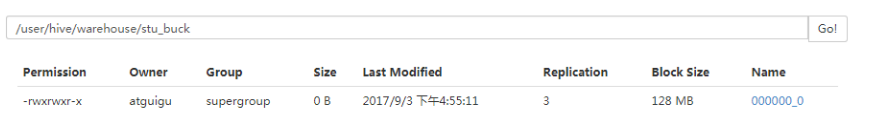
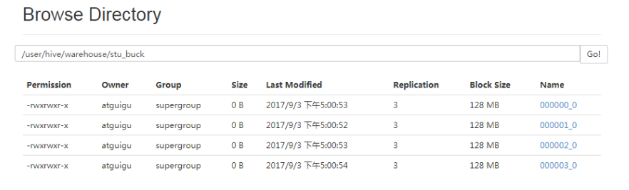
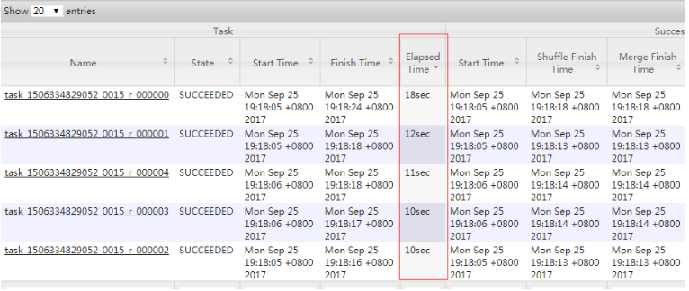
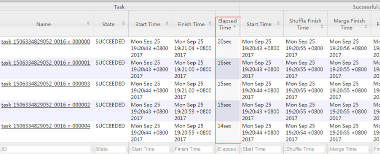
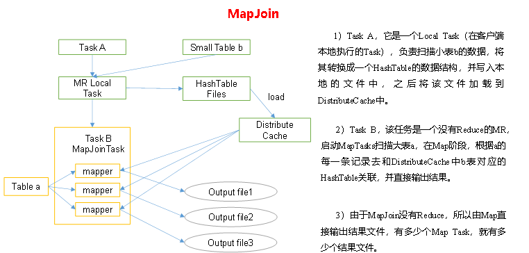
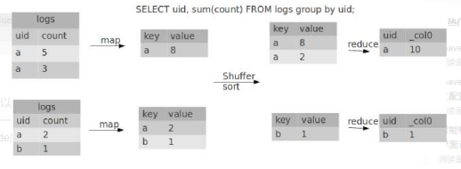

# Hive

## Hive基本概念

### 什么是Hive

Hive：由Facebook开源用于解决海量结构化日志的数据统计。

Hive是基于Hadoop的一个**数据仓库工具**，可以**将结构化的数据文件映射为一张表**，并提供**类SQL查询**功能。

本质是：**将HQL转化成MapReduce程序**


1. Hive处理的数据存储在HDFS

2. Hive分析数据底层的实现是MapReduce

3. 执行程序运行在Yarn上

### Hive的优缺点

#### 优点

1. 操作接口采用类SQL语法，提供快速开发的能力（简单、容易上手）。

2. 避免了去写MapReduce，减少开发人员的学习成本。

3. Hive的执行延迟比较高，因此Hive常用于数据分析，对实时性要求不高的场合。

4. Hive优势在于处理大数据，对于处理小数据没有优势，因为Hive的执行延迟比较高。

5. Hive支持用户自定义函数，用户可以根据自己的需求来实现自己的函数。

#### 缺点

##### 1.Hive的HQL表达能力有限

1. 迭代式算法无法表达

2. 数据挖掘方面不擅长，由于MapReduce数据处理流程的限制，效率更高的算法却无法实现。

##### 2.Hive的效率比较低

1. Hive自动生成的MapReduce作业，通常情况下不够智能化

2. Hive调优比较困难，粒度较粗

### Hive的架构原理


#### 1．用户接口：Client

​	CLI（command-line interface）、JDBC/ODBC(jdbc访问hive)、WEBUI（浏览器访问hive）

#### 2．元数据：Metastore

​	元数据包括：表名、表所属的数据库（默认是default）、表的拥有者、列/分区字段、表的类型（是否是外部表）、表的数据所在目录等；

默认存储在自带的derby数据库中，推荐使用MySQL存储Metastore

#### 3．Hadoop

使用HDFS进行存储，使用MapReduce进行计算。

#### 4．驱动器：Driver

1. 解析器（SQL Parser）：将SQL字符串转换成抽象语法树AST，这一步一般都用第三方工具库完成，比如antlr；对AST进行语法分析，比如表是否存在、字段是否存在、SQL语义是否有误。

2. 编译器（Physical Plan）：将AST编译生成逻辑加入执行计划。

3. 优化器（Query Optimizer）：对逻辑执行计划进行优化。

4. 执行器（Execution）：把逻辑执行计划转换成可以运行的物理计划。对于Hive来说，就是MR/Spark。


​	Hive通过给用户提供的一系列交互接口，接收到用户的指令(SQL)，使用自己的Driver，结合元数据(MetaStore)，将这些指令翻译成MapReduce，提交到Hadoop中执行，最后，将执行返回的结果输出到用户交互接口。

### Hive和数据库比较

​	由于 Hive 采用了类似SQL 的查询语言 HQL(Hive Query Language)，因此很容易将 Hive 理解为数据库。其实从结构上来看，Hive 和数据库除了拥有类似的查询语言，再无类似之处。本文将从多个方面来阐述 Hive 和数据库的差异。数据库可以用在 Online 的应用中，但是Hive 是为数据仓库而设计的，清楚这一点，有助于从应用角度理解 Hive 的特性。

#### 查询语言

​	由于SQL被广泛的应用在数据仓库中，因此，专门针对Hive的特性设计了类SQL的查询语言HQL。熟悉SQL开发的开发者可以很方便的使用Hive进行开发。

#### 数据存储位置

​	Hive 是建立在 Hadoop 之上的，所有 Hive 的数据都是存储在 HDFS 中的。而数据库则可以将数据保存在块设备或者本地文件系统中。

#### 数据更新

​	由于Hive是针对数据仓库应用设计的，而数据仓库的内容是读多写少的。因此，Hive中不建议对数据的改写，所有的数据都是在加载的时候确定好的。而数据库中的数据通常是需要经常进行修改的，因此可以使用 INSERT INTO … VALUES 添加数据，使用 UPDATE … SET修改数据。

#### 执行

​	Hive中大多数查询的执行是通过 Hadoop 提供的 MapReduce 来实现的。而数据库通常有自己的执行引擎。

#### 执行延迟

​	Hive 在查询数据的时候，由于没有索引，需要扫描整个表，因此延迟较高。另外一个导致 Hive 执行延迟高的因素是 MapReduce框架。由于MapReduce 本身具有较高的延迟，因此在利用MapReduce 执行Hive查询时，也会有较高的延迟。相对的，数据库的执行延迟较低。当然，这个低是有条件的，即数据规模较小，当数据规模大到超过数据库的处理能力的时候，Hive的并行计算显然能体现出优势。

#### 可扩展性

​	由于Hive是建立在Hadoop之上的，因此Hive的可扩展性是和Hadoop的可扩展性是一致的（世界上最大的Hadoop 集群在 Yahoo!，2009年的规模在4000 台节点左右）。而数据库由于 ACID 语义的严格限制，扩展行非常有限。目前最先进的并行数据库 [Oracle](http://lib.csdn.net/base/oracle) 在理论上的扩展能力也只有100台左右。

#### 数据规模

​	由于Hive建立在集群上并可以利用MapReduce进行并行计算，因此可以支持很大规模的数据；对应的，数据库可以支持的数据规模较小。

## Hive安装与基本使用

>  Hive相关地址
>
>  1．Hive官网地址
>
>  http://hive.apache.org/
>
>  2．文档查看地址
>
>  https://cwiki.apache.org/confluence/display/Hive/GettingStarted
>
>  3．下载地址
>
>  http://archive.apache.org/dist/hive/
>
>  4．github地址
>
>  https://github.com/apache/hive

### Mysql安装

​	配置企业使用的hive，元数据一定要用mysql(默认的derby数据库不支持多点登录)，所有mysql的配置至关重要。centos-7安装mysql稍许麻烦，原因是centos-7默认的数据块是MariaDB，因此安装mysql 前先进行mariadb的卸载。

#### 1.卸载mariadb

```bash
# rpm -qa |grep mariadb
----------------
mariadb-libs-5.5.50-1.el7_2.x86_64

# yum remove -y  mariadb-libs-5.5.50-1.el7_2.x86_64
```

#### 2.下载mysql bundle

> 下载地址：https://downloads.mysql.com/archives/community/

下载完成后，将mysql-bundle.tar解压

```bash
# tar -xvf my MySQL-5.6.42-1.el7.x86_64.rpm-bundle.tar
```

#### 3. 安装Mysql Server

```bash
# rpm -ivh MySQL-server-5.6.42-1.el7.x86_64.rpm
```

查看随机生成的密码

```bash
# cat /root/.mysql_secret
```

启动mysql服务和开机自启动

```bash
# systemctl start mysql
# systemctl enable mysql
```

#### 4. 安装客户端

```bash
# rpm -ivh MySQL-client-5.6.42-1.el6.x86_64.rpm
```

访问mysql

```bash
# mysql -uroot -pOEXaQuS8IWkG19Xs
```

修改随机密码

```bash
mysql>SET PASSWORD=PASSWORD('1234');
```

#### 5.修改mysql配置文件

```bash
# vim /usr/my.cnf
------------------
bind-address=0.0.0.0
```

重启mysql

```bash
# systemctl restart mysql
```

#### 6.赋予root远程访问权限

```bash
$ mysql -u root -p 1234
---------------
mysql > GRANT ALL PRIVILEGES ON *.* TO 'root'@'hadoop152' IDENTIFIED BY '1234' WITH GREANT OPTION;
mysql > FLUSH PRIVILEGES
```


### Hive安装部署

#### 1.解压`apache-hive-2.3.6-bin.tar.gz`

```bash
$ tar -xzcf apache-hive-2.3.6-bin.tar.gz -C /opt/module
# 重命名
$ cd /opt/module
$ mv apache-hive-2.3.6-bin hive
```

#### 2.配置环境变量

```bash
$ sudo vim /etc/profile
-------------------
export HIVE_HOME=/opt/module/hive
export PATH=$PATH:$HIVE_HOME/bin
```

#### 3.修改hive配置文件

```bash
$ cd /opt/module/hive/conf
$ mv hive-env.sh.template hive-env.sh #重命名环境文件
$ mv hive-log4j2.properties.template hive-log4j2.properties #重命名日志文件
$ cp hive-default.xml.template hive-site.xml #拷贝生成xml文件
```

修改`hive-enb.sh`

```bash
export HADOOP_HOME=/opt/module/hadoop-2.7.7
export HIVE_CONF_DIR=/opt/module/hive/conf
```

修改`hive-log4j2.properties`

```properties
property.hive.log.dir =/opt/module/hive/logs
```

修改`hive-site.xml`

```xml
<!-- hive元数据地址，默认是/user/hive/warehouse -->
<property>
	<name>hive.metastore.warehouse.dir</name>
	<value>/user/hive/warehouse</value>
</property>
<!-- hive查询时输出列名 -->
<property>
	<name>hive.cli.print.header</name>
	<value>true</value>
</property>
<!-- 显示当前数据库名 -->
<property>
	<name>hive.cli.print.current.db</name>
	<value>true</value>
</property>
<!-- 开启本地模式，默认是false -->
<property>
	<name>hive.exec.mode.local.auto</name>
	<value>true</value>
</property>
<!-- URL用于连接远程元数据 -->
<property>
	<name>hive.metastore.uris</name>
	<value>thrift://hadoop152:9083</value>
	<description>Thrift URI for the remote metastore. Used by metastore client to connect to remote metastore.</description>
</property>
<!-- 元数据使用mysql数据库 -->
<property>
	<name>javax.jdo.option.ConnectionURL</name>
	<value>jdbc:mysql://hadoop152:3306/hive?createDatabaseIfNotExist=true&amp;useSSL=false</value>
	<description>JDBC connect string for a JDBC metastore</description>
</property>
<property>
	<name>javax.jdo.option.ConnectionUserName</name>
	<value>root</value>
	<description>username to use against metastore database</description>
</property>
<property>
	<name>javax.jdo.option.ConnectionPassword</name>
	<value>1234</value>
	<description>password to use against metastore database</description>
</property>
<property>
	<name>javax.jdo.option.ConnectionDriverName</name>
	<value>com.mysql.jdbc.Driver</value>
	<description>Driver class name for a JDBC metastore</description>
</property>

```

#### 4.启动hadoop集群并生成hive目录

```bash
$ start-dfs.sh
$ start-yarn.sh
```

创建目录并修改可写权限

```bash
$ hdfs dfs -mkdir /tmp #如果有这个路径，这不需要重新创建
$ hdfs dfs -mkdir -p /user/hive/warehouse #创建目录
$ hdfs dfs -chmod g+w /tmp #修改文件权限
$ hdfs dfs -chmod g+w /user/hive/warehouse #修改文件权限
```

#### 5.添加mysql驱动依赖包

```bash
$ cp mysql-connector-java-5.1.47.jar $HIVE_HOME/lib
```

#### 6. 初始化mysql元数据库

```bash
schematool -initSchema -dbType mysql 
--------------
SLF4J: Class path contains multiple SLF4J bindings.
SLF4J: Found binding in [jar:file:/opt/module/hive/lib/log4j-slf4j-impl-2.6.2.jar!/org/slf4j/impl/StaticLoggerBinder.class]
SLF4J: Found binding in [jar:file:/opt/module/hadoop-2.7.7/share/hadoop/common/lib/slf4j-log4j12-1.7.10.jar!/org/slf4j/impl/StaticLoggerBinder.class]
SLF4J: See http://www.slf4j.org/codes.html#multiple_bindings for an explanation.
SLF4J: Actual binding is of type [org.apache.logging.slf4j.Log4jLoggerFactory]
Metastore connection URL:	 jdbc:mysql://hadoop152:3306/hive?createDatabaseIfNotExist=true&useSSL=false
Metastore Connection Driver :	 com.mysql.jdbc.Driver
Metastore connection User:	 root
Starting metastore schema initialization to 2.3.0
Initialization script hive-schema-2.3.0.mysql.sql
Initialization script completed
schemaTool completed
```

进入mysql

```bash
mysql > use hive;
mysql > show tables;
--------------------
+---------------------------+
| Tables_in_hive            |
+---------------------------+
| AUX_TABLE                 |
| BUCKETING_COLS            |
| CDS                       |
| COLUMNS_V2                |
| COMPACTION_QUEUE          |
| COMPLETED_COMPACTIONS     |
| COMPLETED_TXN_COMPONENTS  |
| DATABASE_PARAMS           |
| DBS                       |
| DB_PRIVS                  |
| DELEGATION_TOKENS         |
| FUNCS                     |
| FUNC_RU                   |
| GLOBAL_PRIVS              |
| HIVE_LOCKS                |
| IDXS                      |
| INDEX_PARAMS              |
| KEY_CONSTRAINTS           |
| MASTER_KEYS               |
| NEXT_COMPACTION_QUEUE_ID  |
| NEXT_LOCK_ID              |
| NEXT_TXN_ID               |
| NOTIFICATION_LOG          |
| NOTIFICATION_SEQUENCE     |
| NUCLEUS_TABLES            |
| PARTITIONS                |
| PARTITION_EVENTS          |
| PARTITION_KEYS            |
| PARTITION_KEY_VALS        |
| PARTITION_PARAMS          |
| PART_COL_PRIVS            |
| PART_COL_STATS            |
| PART_PRIVS                |
| ROLES                     |
| ROLE_MAP                  |
| SDS                       |
| SD_PARAMS                 |
| SEQUENCE_TABLE            |
| SERDES                    |
| SERDE_PARAMS              |
| SKEWED_COL_NAMES          |
| SKEWED_COL_VALUE_LOC_MAP  |
| SKEWED_STRING_LIST        |
| SKEWED_STRING_LIST_VALUES |
| SKEWED_VALUES             |
| SORT_COLS                 |
| TABLE_PARAMS              |
| TAB_COL_STATS             |
| TBLS                      |
| TBL_COL_PRIVS             |
| TBL_PRIVS                 |
| TXNS                      |
| TXN_COMPONENTS            |
| TYPES                     |
| TYPE_FIELDS               |
| VERSION                   |
| WRITE_SET                 |
+---------------------------+
```

开启元数据

```bash
$ nohup hive --service metastore & #开启元数据
```

#### 7.启动hive并测试

```bash
$ hive
```

查看数据库

```bash
hive > show databases;
```

打开默认数据库：

```bash
hive > use default;
```

显示default数据库中的表

```bash
hive > show tables;
```

创建一张表

```bash
create table student(id int,name string);
```

显示数据库中有几张表

```bash
hive > show tables;
```

查看表结构

```bash
hive > desc student;
```

向表中插入数据

```bash
hive > insert into student values（1000,"ss"）;
```

查询表中数据

```bash
hive > select * from student;
```

退出hive

```bash
hive > quit;
```

#### 8.将本地数据导入hive

##### 需求

将本地`/opt/module/datas/student.txt`这个目录下的数据导入到hive的`student(id int, name string)`表中

##### 1.数据准备

在`/opt/module/datas`这个目录准备如下数据

```txt
1001	zhangshan
1002	lisi
1003	zhaoliu
```

> 注意以tab作为间隔

##### 2.hive实际操作

删除原student表

```
hive > drop table student;
```

创建student表，并声明文件分隔符‘\t’

```
hive > create table student(id int,name string) ROW FORMAT DELIMITED FIELDS TERMINATED BY '\t';
```

加载`/opt/module/datas/student.txt`

```bash
hive > load data local inpath '/opt/module/datas/student.txt' into table student;
```

查询结果

```
hive > select * from student;
----------------
OK
student.id	student.name
1001	zhangshan
1002	lishi
1003	zhaoliu
Time taken: 1.038 seconds, Fetched: 3 row(s)
```

### Hive JDBC访问

以上方式访问hive是在本地进行访问，我们也可以通过启动hiveserver2实现通过jdbc远程访问hive

#### 1.配置hadoop proxyuser

如果希望远程访问hive，实际上就是远程访问hdfs，那么需要将hive在hdfs中的用户权限开放给代理用户，如果想要所有代理用户都能访问，那么配置如下：

在`core-site.xml`中添加如下配置：

```xml
<property>
    <name>hadoop.proxyuser.hadoop.hosts</name>
    <value>*</value>
</property>
<property>
    <name>hadoop.proxyuser.hadoop.groups</name>
    <value>*</value>
</property>
```

#### 2.启动hiveserver2

首先开启元数据服务

```bash
$ nohup hive --service metastore & #开启元数据
```

开启hiveserver2服务

```bash
$ bin/hiveserver2
#或者后台启动
$ nohup hiveserver2 &
```

#### 3.启动beeline

beeline是一个jdbc的客户端，我们可以通过它连接hive的服务

```bash
$ beeline
beeline> !connect jdbc:hive2://hadoop152:10000（回车）
Connecting to jdbc:hive2://hadoop102:10000
Enter username for jdbc:hive2://hadoop102:10000: hadoop（回车）
Enter password for jdbc:hive2://hadoop102:10000: 1234（直接回车）
Connected to: Apache Hive (version 1.2.1)
Driver: Hive JDBC (version 1.2.1)
Transaction isolation: TRANSACTION_REPEATABLE_READ
0: jdbc:hive2://hadoop102:10000> show databases;
+----------------+--+
| database_name  |
+----------------+--+
| default        |
| hive_db2       |
+----------------+--+
```

或者直接连接服务

```bash
$ beeline -n hadoop -p 1234 -u jdbc:hive2://hadoop152:10000
```

### Hive常用命令交互

```bash
$ bin/hive -help
------------
usage: hive
 -d,--define <key=value>          Variable substitution to apply to Hive
                                  commands. e.g. -d A=B or --define A=B
    --database <databasename>     Specify the database to use
 -e <quoted-query-string>         SQL from command line
 -f <filename>                    SQL from files
 -H,--help                        Print help information
    --hiveconf <property=value>   Use value for given property
    --hivevar <key=value>         Variable substitution to apply to Hive
                                  commands. e.g. --hivevar A=B
 -i <filename>                    Initialization SQL file
 -S,--silent                      Silent mode in interactive shell
 -v,--verbose                     Verbose mode (echo executed SQL to the
                                  console)

```

#### 1."-e" 不进入hive的交互窗口执行sql

```bash
$ hive -e "select id from student;"
--------
OK
id
1001
1002
1003
Time taken: 2.64 seconds, Fetched: 3 row(s)

```

#### 2."-f" 执行脚本中的sql语句

1. 在`opt/module/datas`中创建hivef.sql文件

   ```sql
   select * from student
   ```

2. 执行文件中的sql语句

   ```bash
   $ hive -f /opt/module/datas/hivef.sql
   -------
   Logging initialized using configuration in file:/opt/module/hive/conf/hive-log4j2.properties Async: true
   OK
   student.id	student.name
   1001	zhangshan
   1002	lishi
   1003	zhaoliu
   Time taken: 2.798 seconds, Fetched: 3 row(s)
   ```

3. 执行文件中的sql语句并将结果写入文件中

   ```bash
   $ hive -f /opt/module/datas/hivef.sql > /opt/module/datas/hive_result.txt
   $ cat hive_result.txt
   ---------
   student.id	student.name
   1001	zhangshan
   1002	lishi
   1003	zhaoliu
   ```

### Hive其他命令操作

#### 1.退出hive窗口

```bash
hive(default)>exit;
hive(default)>quit;
```

#### 2.查看hdfs文件系统

```bash
hive(default)>dfs -ls /;
```

#### 3.查看本地文件系统

```bash
hive(default)>! ls /opt/module/datas;
```

#### 4.查看所有历史命令

```bash
cd ~
cat .hivehistory
```

### Hive常见属性配置

#### Hive数据仓库位置配置

1. Default数据仓库的最原始位置是在hdfs上的：/user/hive/warehouse路径下

2. 在仓库目录下，没有对默认的数据库default创建文件夹。如果某张表属于default数据库，直接在数据仓库目录下创建一个文件夹。

3. 修改default数据仓库原始位置（将hive-default.xml.template如下配置信息拷贝到hive-site.xml文件中）。

   ```xml
   <property>
   <name>hive.metastore.warehouse.dir</name>
   <value>/user/hive/warehouse</value>
   <description>location of default database for the warehouse</description>
   </property>
   ```

   配置同组用户有执行权限

   ```bash
   hdfs dfs -chmod g+w /user/hive/warehouse
   ```

#### 查询后信息显示配置

1. 在`hive-site.xml`文件中添加如下配置信息，就可以实现显示当前数据库，以及查询表的头信息配置。

   ```xml
   <property>
   	<name>hive.cli.print.header</name>
   	<value>true</value>
   </property>
   
   <property>
   	<name>hive.cli.print.current.db</name>
   	<value>true</value>
   </property>
   ```

2. 重新启动hive，对比配置前后差异。


#### Hive运行日志信息配置

1.Hive的log默认存放在`/tmp/neuedu/hive.log`目录下（当前用户名下）

2.修改hive的log存放日志到`/opt/module/hive/logs`

1. 修改`/opt/module/hive/conf/hive-log4j2.properties.template`文件名称为

   `hive-log4j2.properties`

2. 在`hive-log4j2.properties`文件中修改log存放位置

   ```properties
   property.hive.log.dir =/opt/module/hive/logs
   ```

### 参数配置方式

#### 1．查看当前所有的配置信息

```bash
bashhive>set;
```

#### 2．参数的配置三种方式

##### 1.配置文件方式

默认配置文件：`hive-default.xml `

用户自定义配置文件：`hive-site.xml`

>  注意：用户自定义配置会覆盖默认配置。另外，Hive也会读入Hadoop的配置，因为Hive是作为Hadoop的客户端启动的，Hive的配置会覆盖Hadoop的配置。配置文件的设定对本机启动的所有Hive进程都有效。

##### 2.命令行参数方式

启动Hive时，可以在命令行添加`-hiveconf param=value`来设定参数。

例如：

```bash
$ bin/hive -hiveconf mapred.reduce.tasks=10;
```

> 注意：仅对本次hive启动有效

查看参数设置：

```bash
hive (default)> set mapred.reduce.tasks;
```

##### 3.参数声明方式

可以在HQL中使用SET关键字设定参数

例如：

```bash
hive (default)> set mapred.reduce.tasks=100;
```

> 注意：仅对本次hive启动有效。

查看参数设置

```bash
hive (default)> set mapred.reduce.tasks;
```

上述三种设定方式的优先级依次递增。即**配置文件<命令行参数<参数声明**。注意某些系统级的参数，例如log4j相关的设定，必须用前两种方式设定，因为那些参数的读取在会话建立以前已经完成了。

## Hive数据类型

### 基本数据类型

| Hive数据类型 | Java数据类型 | 长度                                                 | 例子                                 |
| ------------ | ------------ | ---------------------------------------------------- | ------------------------------------ |
| TINYINT      | byte         | 1byte有符号整数                                      | 20                                   |
| SMALINT      | short        | 2byte有符号整数                                      | 20                                   |
| INT          | int          | 4byte有符号整数                                      | 20                                   |
| BIGINT       | long         | 8byte有符号整数                                      | 20                                   |
| BOOLEAN      | boolean      | 布尔类型，true或者false                              | TRUE  FALSE                          |
| FLOAT        | float        | 单精度浮点数                                         | 3.14159                              |
| DOUBLE       | double       | 双精度浮点数                                         | 3.14159                              |
| STRING       | string       | 字符系列。可以指定字符集。可以使用单引号或者双引号。 | ‘now is the time’ “for all good men” |
| TIMESTAMP    |              | 时间类型                                             |                                      |
| BINARY       |              | 字节数组                                             |                                      |

​	对于Hive的String类型相当于数据库的varchar类型，该类型是一个可变的字符串，不过它不能声明其中最多能存储多少个字符，理论上它可以存储2GB的字符数。

### 集合数据类型

| 数据类型 | 描述                                                         | 语法示例                                        |
| -------- | ------------------------------------------------------------ | ----------------------------------------------- |
| STRUCT   | 和c语言中的struct类似，都可以通过“点”符号访问元素内容。例如，如果某个列的数据类型是STRUCT{first STRING, last STRING},那么第1个元素可以通过字段.first来引用。 | struct() 例如struct<street:string, city:string> |
| MAP      | MAP是一组键-值对元组集合，使用数组表示法可以访问数据。例如，如果某个列的数据类型是MAP，其中键->值对是’first’->’John’和’last’->’Doe’，那么可以通过字段名[‘last’]获取最后一个元素 | map()例如map<string, int>                       |
| ARRAY    | 数组是一组具有相同类型和名称的变量的集合。这些变量称为数组的元素，每个数组元素都有一个编号，编号从零开始。例如，数组值为[‘John’, ‘Doe’]，那么第2个元素可以通过数组名[1]进行引用。 | Array()例如array<string>                        |

Hive有三种复杂数据类型**ARRAY**、**MAP** 和 **STRUCT**。**ARRAY**和**MAP**与Java中的Array和Map类似，而**STRUCT**与C语言中的Struct类似，它封装了一个命名字段集合，复杂数据类型允许任意层次的嵌套。

#### 实际案例

1. 假设某表有如下一行，我们用JSON格式来表示其数据结构。在Hive下访问的格式为

   ```json
   {
       "name": "songsong",
       "friends": ["bingbing" , "lili"] ,       //列表Array, 
       "children": {                      //键值Map,
           "xiao song": 18 ,
           "xiaoxiao song": 19
       }
       "address": {                      //结构Struct,
           "street": "hui long guan" ,
           "city": "beijing" 
       }
   }
   ```

2. 基于上述数据结构，我们在Hive里创建对应的表，并导入数据。 

   创建本地测试文件test.txt

   ```
   songsong,bingbing_lili,xiao song:18_xiaoxiao song:19,hui long guan_beijing
   yangyang,caicai_susu,xiao yang:18_xiaoxiao yang:19,chao yang_beijing
   ```

3. Hive上创建测试表test

   ```sql
   create table test(
   name string,
   friends array<string>,
   children map<string, int>,
   address struct<street:string, city:string>
   )
   row format delimited fields terminated by ','
   collection items terminated by '_'
   map keys terminated by ':'
   lines terminated by '\n';
   ```

   > 字段解释
   >
   > row format delimited fields terminated by ','  -- 列分隔符
   >
   > collection items terminated by '_'  	--MAP STRUCT 和 ARRAY 的分隔符(数据分割符号)
   >
   > map keys terminated by ':'				-- MAP中的key与value的分隔符
   >
   > lines terminated by '\n';					-- 行分隔符

4. 导入文本数据到测试表

   ```bash
   hive (default)> load data local inpath '/opt/module/datas/test.txt' into table test
   ```

5. 访问三种集合列里的数据，以下分别是ARRAY，MAP，STRUCT的访问方式

   ```bash
   hive (default)> select friends[1],children['xiao song'],address.city from test
   where name="songsong";
   OK
   _c0     _c1     city
   lili    18      beijing
   Time taken: 0.076 seconds, Fetched: 1 row(s)
   ```

### 类型转化

​	Hive的原子数据类型是可以进行隐式转换的，类似于Java的类型转换，例如某表达式使用INT类型，TINYINT会自动转换为INT类型，**但是Hive不会进行反向转化，**例如，某表达式使用TINYINT类型，INT不会自动转换为TINYINT类型，它会返回错误，除非使用CAST操作。

#### 1.隐式类型转换规则

1. 任何整数类型都可以隐式地转换为一个范围更广的类型，如TINYINT可以转换成INT，INT可以转换成BIGINT。
2. 所有整数类型、FLOAT和**STRING类型**都可以隐式地转换成DOUBLE。
3. TINYINT、SMALLINT、INT都可以转换为FLOAT。
4. BOOLEAN类型不可以转换为任何其它的类型。

#### 2.使用CAST操作显示进行数据类型转换

​	例如CAST('1' AS INT)将把字符串'1' 转换成整数1；如果强制类型转换失败，如执行CAST('X' AS INT)，表达式返回空值 NULL。

```bash
0: jdbc:hive2://hadoop152:10000> select '1'+2, cast('1'as int) + 2;
+------+------+--+
| _c0  | _c1  |
+------+------+--+
| 3.0  | 3    |
+------+------+--+
```

## DDL数据定义

### 创建数据库

```sql
CREATE DATABASE [IF NOT EXISTS] database_name
[COMMENT database_comment]
[LOCATION hdfs_path]
[WITH DBPROPERTIES (property_name=property_value, ...)];
```

> [IF NOT EXISTS] ：表没有就创建，有就不执行创建
>
> [COMMENT database_comment] : 表的注释
>
> [LOCATION hdfs_path] : 表对应的hdfs地址
>
> [WITH DBPROPERTIES (property_name=property_value, ...)] : 表的额外属性

1. 创建一个数据库，数据库在HDFS上的默认存储路径是/user/hive/warehouse/*.db

   ```sql
   hive (default)> create database db_test;
   ```

2. 避免要创建的数据库已经存在错误，增加if not exists判断。（标准写法）

   ```sql
   hive (default)> create database db_test;
   -----------
   FAILED: Execution Error, return code 1 from org.apache.hadoop.hive.ql.exec.DDLTask. Database db_hive already exists
   
   hive (default)> create database if not exists db_test;
   ```

3. 创建一个数据库，指定数据库在HDFS上存放的位置

   ```sql
   hive (default)> create database db_test2 location '/my_db';
   ```

   查看hdfs web应用

   

### 查询数据库

#### 1.显示数据库

```sql
hive> show databases;
```

#### 2.过滤显示查询的数据库

```bash
hive > show databases like 'd*';
------------
+----------------+
| database_name  |
+----------------+
| db_test        |
| default        |
+----------------+
```

#### 3.查看数据库详情

##### 1.显示数据信息

```bash
hive > desc database db_test;
-----------
+----------+----------+----------------------------------------------------+-------------+-------------+-------------+
| db_name  | comment  |                      location                      | owner_name  | owner_type  | parameters  |
+----------+----------+----------------------------------------------------+-------------+-------------+-------------+
| db_test  |          | hdfs://hadoop152:9000/user/hive/warehouse/db_test.db | hadoop      | USER        |             |
+----------+----------+----------------------------------------------------+-------------+-------------+-------------+

```

##### 2.显示数据库详细信息

先给数据库添加一些额外属性

```bash
hive > alter database db_test set DBPROPERTIES('foo'='bar')
```

然后查询表详细信息

```bash
hive> desc database extended db_test;
---------
+----------+----------+----------------------------------------------------+-------------+-------------+-------------+
| db_name  | comment  |                      location                      | owner_name  | owner_type  | parameters  |
+----------+----------+----------------------------------------------------+-------------+-------------+-------------+
| db_test  |          | hdfs://hadoop152:9000/user/hive/warehouse/db_test.db | hadoop      | USER        | {foo=bar}   |
+----------+----------+----------------------------------------------------+-------------+-------------+-------------+

```


#### 4.切换数据库

```bash
hive > use default;
```

### 修改数据库

​	用户可以使用`ALTER DATABASE`命令为某个数据库的`DBPROPERTIES`设置键-值对属性值，来描述这个数据库的属性信息。**数据库的其他元数据信息都是不可更改的，包括数据库名和数据库所在的目录位置**。

```sql
hive (default)> alter database db_test set dbproperties('createtime'='20170830');
```

在hive中查看修改结果

```sql
hive> desc database extended db_test;
--------------------
+----------+----------+----------------------------------------------------+-------------+-------------+---------------------------------+
| db_name  | comment  |                      location                      | owner_name  | owner_type  |           parameters            |
+----------+----------+----------------------------------------------------+-------------+-------------+---------------------------------+
| db_test  |          | hdfs://hadoop152:9000/user/hive/warehouse/db_test.db | hadoop      | USER        | {createtime=20170830, foo=bar}  |
+----------+----------+----------------------------------------------------+-------------+-------------+---------------------------------+

```

### 删除数据库

#### 1.删除空数据库

```bash
hive>drop database db_test;
```

> 如果数据库不存在，可以使用if exists判断
>
> ```bash
> hive>drop database db_test;
> ```

#### 2.删除非空数据库

如果数据库中已经有表了，可以使用级联删除

```bash
hive > drop database db_test cascade;
```

### 创建表

#### 1.建表语法

```sql
CREATE [EXTERNAL] TABLE [IF NOT EXISTS] table_name 
[(col_name data_type [COMMENT col_comment], ...)] 
[COMMENT table_comment] 
[PARTITIONED BY (col_name data_type [COMMENT col_comment], ...)] 
[CLUSTERED BY (col_name, col_name, ...) 
[SORTED BY (col_name [ASC|DESC], ...)] INTO num_buckets BUCKETS] 
[ROW FORMAT row_format] 
[STORED AS file_format] 
[LOCATION hdfs_path]
[TBLPROPERTIES (property_name=property_value, ...)]
[AS select_statement]
[like table_name]
```

> [EXTERNAL]： 外部表，hive对外部表没有完全所有权（例如外部通过hdfs导入的日志数据）
>
> [IF NOT EXISTS]： 同database；
>
> [(col_name data_type [COMMENT col_comment], ...)] ：定义列
>
> [COMMENT table_comment] ： 表注释
>
> [PARTITIONED BY (col_name data_type [COMMENT col_comment], ...)] 分区列，起到类似mysql索引的作用，可以有效提高查询速度。
>
> [CLUSTERED BY (col_name, col_name, ...) ：hive的分桶表
>
> [SORTED BY (col_name [ASC|DESC], ...)] INTO num_buckets BUCKETS] ：排序
>
> [ROW FORMAT row_format]：定义原始数据的格式
>
> [STORED AS file_format] ：定义原始数据的文件格式
>
> [LOCATION hdfs_path]：定义表的hdfs存储位置
>
> [TBLPROPERTIES (property_name=property_value, ...)]：表的额外属性，例如分区字段就存在这里
>
> [AS select_statement]：后跟查询语句，根据查询结果创建表。
>
> [like table_name] : LIKE允许用户复制现有的表结构，但是不复制数据。

**字段解释说明**

1. CREATE TABLE 创建一个指定名字的表。如果相同名字的表已经存在，则抛出异常；用户可以用 IF NOT EXISTS 选项来忽略这个异常。

2. EXTERNAL关键字可以让用户创建一个外部表，在建表的同时可以指定一个指向实际数据的路径（LOCATION），在删除表的时候，内部表的元数据和数据会被一起删除，而外部表只删除元数据，不删除数据。

3. COMMENT：为表和列添加注释。

4. PARTITIONED BY创建分区表

5. CLUSTERED BY创建分桶表

6. SORTED BY不常用，对桶中的一个或多个列另外排序

7. ROW FORMAT 

   ```sql
   DELIMITED [FIELDS TERMINATED BY char] [COLLECTION ITEMS TERMINATED BY char]
   
   [MAP KEYS TERMINATED BY char] [LINES TERMINATED BY char] 
   
      | SERDE serde_name [WITH SERDEPROPERTIES (property_name=property_value, property_name=property_value, ...)]
   ```

   用户在建表的时候可以自定义SerDe或者使用自带的SerDe。如果没有指定ROW FORMAT 或者ROW FORMAT DELIMITED，将会使用自带的SerDe。在建表的时候，用户还需要为表指定列，用户在指定表的列的同时也会指定自定义的SerDe，Hive通过SerDe确定表的具体的列的数据。

   SerDe是Serialize/Deserilize的简称， hive使用Serde进行行对象的序列与反序列化。

8. STORED AS指定存储文件类型,常用的存储文件类型：SEQUENCEFILE（二进制序列文件）、TEXTFILE（文本）、RCFILE（列式存储格式文件）

   如果文件数据是纯文本，可以使用STORED AS TEXTFILE。如果数据需要压缩，使用 STORED AS SEQUENCEFILE。

9. LOCATION ：指定表在HDFS上的存储位置。

10. AS：后跟查询语句，根据查询结果创建表。

11. LIKE允许用户复制现有的表结构，但是不复制数据。

#### 2.管理表（内部表）

​	默认创建的表都是所谓的管理表，有时也被称为内部表。因为这种表，Hive会（或多或少地）控制着数据的生命周期。Hive默认情况下会将这些表的数据存储在由配置项hive.metastore.warehouse.dir(例如，/user/hive/warehouse)所定义的目录的子目录下。**当我们删除一个管理表时，Hive也会删除这个表中数据。**管理表不适合和其他工具共享数据。

##### 案例

1. 创建管理表

   ```sql
   create table if not exists student2(
   id int, name string
   )
   row format delimited fields terminated by '\t'
   stored as textfile
   location '/user/hive/warehouse/student2';
   ```

2. 根据查询结果创建表（查询的结果会添加到新创建的表中）

   ```sql
   create table if not exists student3 as select id, name from student;
   ```

3. 根据已经存在的表结构创建表

   ```sql
   create table if not exists student4 like student;
   ```

4. 查询表的类型

   ```sql
   hive (default)> desc formatted student2;
   --------------
   | Table Type:                   | MANAGED_TABLE                                      | NULL                  |
   
   ```

#### 3.外部表

​	因为表是外部表，所以Hive并非认为其完全拥有这份数据。**删除该表并不会删除掉这份数据，不过描述表的元数据信息会被删除掉。**

##### 外部表的使用场景

​	每天将收集到的网站日志定期流入HDFS文本文件。在外部表（原始日志表）的基础上做大量的统计分析，用到的中间表、结果表使用内部表存储，数据通过SELECT+INSERT进入内部表。

##### 案例

创建stu_ext表，并向表中导入数据。

1. 上传数据到hdfs

   ```bash
   hive (default)> dfs -mkdir /student;
   hive (default)> dfs -put /opt/module/datas/student.txt /student;
   ```

2. 建表语句

   创建外部表

   ```bash
   hive (default)> create external table stu_ext(
   id int, 
   name string) 
   row format delimited fields terminated by '\t' 
   location '/student';
   ```

3. 查看创建的表

   ```bash
   hive (default)> select * from stu_ext;
   OK
   stu_ext.id stu_ext.name
   1001    lisi
   1002    wangwu
   1003    zhaoliu
   ```

4. 查看表格式化数据

   ```bash
   hive (default)> desc formatted stu_ext;
   Table Type:             EXTERNAL_TABLE
   ```

5. 删除外部表

   ```bash
   hive (default)> drop table stu_ext;
   ```

   外部表删除后，hdfs中的数据还在，但是`metadata`中`stu_ext`的元数据已被删除


#### 4.管理表与外部表转换

​	假如我们在创建表时错误的将外部表建成了内部表，我们还可以通过alter语句来修改

1. 创建内部表student2

   ```sql
   create table if not exists student2 (id int,name string )
   row format delimited fields terminated by '\t'
   location '/student2';
   ```

2. 修改为外部表

   ```bash
   hive > alter table student2 set tblproperties('EXTERNAL'='TRUE');
   ```

3. 查看表的类型

   ```bash
   hive > desc formatted student2;
   -----------
   | Table Type:                   | EXTERNAL_TABLE       
   ```

4. 修改student2为内部表

   ```bash
   hive > alter table student2 set tblproperties('EXTERNAL'='FALSE');
   ```

5. 查看表的类型

   ```bash
   hive > desc formatted student2;
   -----------
   | Table Type:                   | MANAGED_TABLE      
   ```

> 注意：**('EXTERNAL'='TRUE')和('EXTERNAL'='FALSE')为固定写法，区分大小写！**

### 分区表

​	分区表实际上就是对应一个HDFS文件系统上的独立的文件夹，该文件夹下是该分区所有的数据文件。**Hive中的分区就是分目录**，把一个大的数据集根据业务需要分割成小的数据集。在查询时通过WHERE子句中的表达式选择查询所需要的指定的分区，这样的查询效率会提高很多。

#### 分区表操作

##### 1.创建分区表

```sql
create table dept_partition (deptno int,dname string,loc string)
partitioned by (month string)
row format delimited fields terminated by '\t';
```

##### 2.加载数据到分区表中

```bash
hive (default)> load data local inpath '/opt/module/datas/dept.txt' into table default.dept_partition partition(month='201709');
hive (default)> load data local inpath '/opt/module/datas/dept.txt' into table default.dept_partition partition(month='201708');
hive (default)> load data local inpath '/opt/module/datas/dept.txt' into table default.dept_partition partition(month='201707’);
```

> 注意：分区表加载数据时，必须指定分区

##### 3. 查询分区表数据

###### 单分区查询

```bash
hive > select * from dept_partition where month='201709';
----------
```

###### 多分区联合查询

联合查询

```bash
hive > select * from dept_partition where month='201709'
 union select * from dept_partition where month='201708'
 union select * from dept_partition where month='201706';
--------------
+-------------+-------------+----------+------------+
| _u1.deptno  |  _u1.dname  | _u1.loc  | _u1.month  |
+-------------+-------------+----------+------------+
| 10          | ACCOUNTING  | 1700     | 201708     |
| 10          | ACCOUNTING  | 1700     | 201709     |
| 20          | RESEARCH    | 1800     | 201708     |
| 20          | RESEARCH    | 1800     | 201709     |
| 30          | SALES       | 1900     | 201708     |
| 30          | SALES       | 1900     | 201709     |
| 40          | OPERATIONS  | 1700     | 201708     |
| 40          | OPERATIONS  | 1700     | 201709     |
+-------------+-------------+----------+------------+
```

> 联合查询会启动mapreduce，因此速度会很慢

or查询

```bash
hive > select * from dept_partition where month='201709' or month='201708';
---------------
+------------------------+-----------------------+---------------------+-----------------------+
| dept_partition.deptno  | dept_partition.dname  | dept_partition.loc  | dept_partition.month  |
+------------------------+-----------------------+---------------------+-----------------------+
| 10                     | ACCOUNTING            | 1700                | 201708                |
| 20                     | RESEARCH              | 1800                | 201708                |
| 30                     | SALES                 | 1900                | 201708                |
| 40                     | OPERATIONS            | 1700                | 201708                |
| 10                     | ACCOUNTING            | 1700                | 201709                |
| 20                     | RESEARCH              | 1800                | 201709                |
| 30                     | SALES                 | 1900                | 201709                |
| 40                     | OPERATIONS            | 1700                | 201709                |
+------------------------+-----------------------+---------------------+-----------------------+

```

##### 4. 增加分区

###### 创建单个分区

```bash
hive (default)> alter table dept_partition add partition(month='201706') ;
```

###### 同时创建多个分区

```bash
hive (default)> alter table dept_partition add partition(month='201705') partition(month='201704');
```

##### 5. 删除分区

###### 删除单个分区

```bash
hive (default)> alter table dept_partition drop partition (month='201704');
```

同时删除多个分区

```bash
hive (default)> alter table dept_partition drop partition (month='201705'), partition (month='201706');
```

> 注意：删除多个时要有逗号隔开，新增多个不需要逗号

##### 6.查看分区

```bash
hive> show partitions dept_partition;
---------
+---------------+
|   partition   |
+---------------+
| month=201707  |
| month=201708  |
| month=201709  |
+---------------+
```

##### 7.查看分区表结构

```bash
hive >  desc formatted dept_partition;
```

#### 分区表注意事项

##### 创建二级分区表

​	实际开发过程中，分区表的作用往往体现在根据目录缩小查询范围，比如收集系统日志的表，往往会按照年/月/日来分区存储日志数据

```bash
|--2019
   |--08
      |--08
      |--09
   |--09
      |--01
      |--02
```

因此，我们分区是有多层的，这样我们可以通过创建二级或者三级分区来存储数据

```sql
create table dept_partition2(
               deptno int, dname string, loc string
               )
               partitioned by (month string, day string)
               row format delimited fields terminated by '\t'
               location '/dept';
```

导入数据

```bash
hive (default)> load data local inpath '/opt/module/datas/dept.txt' into table
 default.dept_partition2 partition(month='201709', day='13');
```

查询数据

```bash
hive (default)> select * from dept_partition2 where month='201709' and day='13';
```

##### 外部分区表的注意事项

分区表往往是外部表，例如上面举得日志例子，日志数据会按照时间进行分区存储，由外部导入到hdfs中，但是这样的数据是查不出来的，比如：

```bash
hive (default)> dfs -put '/opt/module/datas/dept.txt' /dept/month=201704
```

查看分区数据

```bash
hive > select * from  dept_partition where month="201704" ;
```

查询为空，为什么？

原因是外部导入的数据并没有和表进行关联

###### 1.关联方式1：上传数据后修复

上传数据

```bash
hive (default)> select * from dept_partition2 where month='201709' and day='12'
hive (default)> dfs -mkdir -p /dept/month=201709/day=12;
hive (default)> dfs -put /opt/module/datas/dept.txt /dept/month=201709/day=12;
```

执行修复命令

```bash
hive> msck repair table dept_partition2;
```

再次查询数据

```bash
hive (default)> select * from dept_partition2 where month='201709' and day='12';
```

###### 2.关联方式2： 上传数据后添加分区

上传数据

```bash
hive (default)> dfs -mkdir -p /dept/month=201709/day=11;
hive (default)> dfs -put /opt/module/datas/dept.txt  /dept/month=201709/day=11;
```

执行添加分区

```bash
hive (default)> alter table dept_partition2 add partition(month='201709',day='11');
```

查询数据

```bash
hive (default)> select * from dept_partition2 where month='201709' and day='11';
---
+-------------------------+------------------------+----------------------+------------------------+----------------------+
| dept_partition2.deptno  | dept_partition2.dname  | dept_partition2.loc  | dept_partition2.month  | dept_partition2.day  |
+-------------------------+------------------------+----------------------+------------------------+----------------------+
| 10                      | ACCOUNTING             | 1700                 | 201709                 | 11                   |
| 20                      | RESEARCH               | 1800                 | 201709                 | 11                   |
| 30                      | SALES                  | 1900                 | 201709                 | 11                   |
| 40                      | OPERATIONS             | 1700                 | 201709                 | 11                   |
+-------------------------+------------------------+----------------------+------------------------+----------------------+

```

###### 3.关联方式3：创建文件夹后load数据到分区

这种不常用，因为实际上是从hive内部导入数据

创建目录

```bash
hive (default)> dfs -mkdir -p /dept/month=201709/day=10;
```

上传数据

```bash
hive (default)> load data local inpath '/opt/module/datas/dept.txt' into table
 dept_partition2 partition(month='201709',day='10');
```

查询数据

```bash
hive (default)> select * from dept_partition2 where month='201709' and day='10';
```

### 修改表

#### 重命名表

```sql
ALTER TABLE table_name RENAME TO new_table_name
```

##### 案例

```sql
hive (default)> alter table dept_partition2 rename to dept_partition3;
```

#### 增加/修改/替换列信息

##### 语法

更新列

```sql
ALTER TABLE table_name CHANGE [COLUMN] col_old_name col_new_name column_type [COMMENT col_comment] [FIRST|AFTER column_name]
```

增加和替换列

```sql
ALTER TABLE table_name ADD|REPLACE COLUMNS (col_name data_type [COMMENT col_comment], ...) 
```

> 注：ADD是代表新增一字段，字段位置在所有列后面(partition列前)，REPLACE则是表示替换表中所有字段。

##### 案例

1. 查询表结构

   ```bash
   hive> desc dept_partition;
   ```

2. 添加列

   ```bash
   hive (default)> alter table dept_partition add columns(deptdesc string);
   ```

3. 查询表结构

   ```bash
   hive> desc dept_partition;
   ```

4. 更新列

   ```bash
   hive (default)> alter table dept_partition change column deptdesc desc string;
   ```

5. 查询表结构

   ```bash
   hive> desc dept_partition;
   ```

6. 替换列

   ```bash
   hive (default)> alter table dept_partition replace columns(deptno string, dname
    string, loc string);
   ```

7. 查询表结构

   ```bash
   hive> desc dept_partition;
   ```

### 删除表

```bash
hive (default)> drop table dept_partition;
```

## DML数据操作

### 数据导入

#### 向表中装载数据（LOAD）

##### **语法**

```sql
load data [local] inpath '/opt/module/datas/student.txt' [overwrite] into table student [partition (partcol1=val1,…)];
```

（1）load data:表示加载数据

（2）local:表示从本地加载数据到hive表；否则从HDFS加载数据到hive表

（3）inpath:表示加载数据的路径

（4）overwrite:表示覆盖表中已有数据，否则表示追加

（5）into table:表示加载到哪张表

（6）student:表示具体的表

（7）partition:表示上传到指定分区

##### 案例

1. 创建一张表

   ```bash
   hive (default)> create table student(id string, name string) row format delimited fields terminated by '\t';
   ```

2. 加载本地文件到hive

   ```bash
   hive (default)> load data local inpath '/opt/module/datas/student.txt' into table default.student;
   ```

3. 加载HDFS文件到hive中

   上传文件到HDFS

   ```bash
   hive (default)> dfs -put /opt/module/datas/student.txt /student;
   ```

   加载HDFS上数据

   ```bash
   hive (default)> load data inpath '/student/student.txt' into table default.student;
   ```

4. 加载数据覆盖表已有数据

   ```bash
   hive (default)> load data inpath '/student/student.txt' overwrite into table default.student;
   ```


#### 通过查询插入数据

1. 创建一张分区表

   ```bash
   hive (default)> create table student(id int, name string) partitioned by (month string) row format delimited fields terminated by '\t';
   ```

2. 基本插入数据

   ```bash
   hive (default)> insert into table  student partition(month='201709') values(1,'wangwu'),(2,’zhaoliu’);
   ```

3. 根据单张表查询结果插入

   ```bash
   hive (default)> insert overwrite table student partition(month='201708')
                select id, name from student where month='201709';
   ```

   insert into：以追加数据的方式插入到表或分区，原有数据不会删除

   insert overwrite：会覆盖表或分区中已存在的数据

   >  **注意：insert不支持插入部分字段**

4. 多表（多分区）插入模式（根据多张表查询结果）

   ```bash
   hive (default)> from student
                 insert overwrite table student partition(month='201707')
                 select id, name where month='201709'
                 insert overwrite table student partition(month='201706')
                 select id, name where month='201709';
   ```

#### 查询语句中创建表并加载数据(as select)

根据查询结果创建表（查询的结果会添加到新创建的表中）

```sql
create table if not exists student3
as select id, name from student;
```

#### 创建表时通过Location指定加载数据路径

>  这种方式就是建外部表的方式

1. 上传数据到hdfs上

   ```bash
   hive (default)> dfs -mkdir /student5;
   hive (default)> dfs -put /opt/module/datas/student.txt /student5;
   ```

2. 创建表，并指定在hdfs上的位置

   ```bash
   hive (default)> create external table if not exists student5(
                 id int, name string
                 )
                 row format delimited fields terminated by '\t'
                 location '/student5';
   ```

3. 查询数据

   ```bash
   hive (default)> select * from student5;
   ```

#### Import数据到指定Hive表中

> 注意：先用export导出后，再将数据导入。

```bash
hive (default)> import table student2 partition(month='201709') from
 '/user/hive/warehouse/export/student';
```

### 数据导出

#### Insert导出

1. 将查询的结果导出到本地

   ```bash
   hive (default)> insert overwrite local directory '/opt/module/datas/export/student'
               select * from student;
   ```

2. 将查询的结果格式化导出到本地

   ```bash
   hive(default)>insert overwrite local directory '/opt/module/datas/export/student1'
              ROW FORMAT DELIMITED FIELDS TERMINATED BY '-'             select * from student;
   ```

3. 将查询的结果导出到HDFS上(没有local)

   ```bash
   hive (default)> insert overwrite directory '/export/student2'
                ROW FORMAT DELIMITED FIELDS TERMINATED BY '-' 
                select * from student;
   ```

#### Hadoop命令导出到本地

```bash
hive (default)> dfs -get /user/hive/warehouse/student/month=201709/000000_0
/opt/module/datas/export/student3.txt;
```

#### Hive shell 命令导出

基本语法：`hive -f/-e 执行语句或者脚本 > file`

```bash
$  bin/hive -e 'select * from default.student;' >
 /opt/module/datas/export/student4.txt;
$ cat student4.txt
-----------------
student.id	student.name
1001	zhangshan
1002	lishi
1003	zhaoliu
```

#### Export导出到HDFS上

```bash
hive > export table default.student to
 '/export/student5';
```

> export和import主要用于两个Hadoop平台集群之间Hive表迁移。因此实际上完整应该这么写
>
> ```bash
> hive > export table student to  'hdfs://hadoop152:9000/export/student5';
> ```

检查`/export/student5`目录


其他的方式导出的只是数据，**而export不仅导出了数据，还导出了元数据。**因此当我们使用**import**关键字导入export的数据时，**我们并不需要描述表有哪些字段如何分割等等信息**，因为**我们有元数据。**

使用import将数据导入到student6表

```bash
hive > import table student6 from '/export/student5';
```

#### Sqoop导出

后续课程专门讲。

> sqoop主要负责将关系型数据库的数据与hdfs之间进行传导

### 清除表数据

>  **注意：Truncate只能删除管理表，不能删除外部表中数据**

```bash
hive (default)> truncate table student;
```

## 数据查询

​	实际上我们在大数据领域的应用往往是查询的工作远远大于写入，因此，查询语句很重要。

> 参考文档：<https://cwiki.apache.org/confluence/display/Hive/LanguageManual+Select>

查询语句语法：

```sql
[WITH CommonTableExpression (, CommonTableExpression)*]    (Note: Only available
 starting with Hive 0.13.0)
SELECT [ALL | DISTINCT] select_expr, select_expr, ...
  FROM table_reference
  [WHERE where_condition]
  [GROUP BY col_list]
  [ORDER BY col_list]
  [CLUSTER BY col_list
    | [DISTRIBUTE BY col_list] [SORT BY col_list]
  ]
 [LIMIT number]
```

### 基本查询（select...from）

#### 全表和特定列查询

创建部门表

```sql
create table if not exists dept(
deptno int,
dname string,
loc int
)
row format delimited fields terminated by '\t';
```

创建员工表

```sql
create table if not exists emp(
empno int,
ename string,
job string,
mgr int,
hiredate string, 
sal double, 
comm double,
deptno int)
row format delimited fields terminated by '\t';
```

导入数据

```sql
hive (default)> load data local inpath '/opt/module/datas/dept.txt' into table
dept;
hive (default)> load data local inpath '/opt/module/datas/emp.txt' into table emp;
```

##### 1.全表查询

```
hive > select * from emp;
```

##### 2.选择特定列查询

```bash
hive > select empno,ename from emp;
```

> 注意：
>
> （1）SQL 语言**大小写不敏感。** 
>
> （2）SQL 可以写在一行或者多行
>
> （3）**关键字不能被缩写也不能分行**
>
> （4）各子句一般要分行写。
>
> （5）使用缩进提高语句的可读性。

#### 列别名

 	与mysql的别名类似，我们可以重命名一列的名称，别名紧跟列名，也可以在列名和别名之间加入关键字‘AS’

##### 案列

查询护院所属部门和名字

```bash
hive > select ename as name ,deptno dn from emp;
```

#### 算数运算符

| 运算符 | 描述           |
| ------ | -------------- |
| A+B    | A和B 相加      |
| A-B    | A减去B         |
| A*B    | A和B 相乘      |
| A/B    | A除以B         |
| A%B    | A对B取余       |
| A&B    | A和B按位取与   |
| A\|B   | A和B按位取或   |
| A^B    | A和B按位取异或 |
| ~A     | A按位取反      |

##### 案例

查询出所有员工的薪水后加1显示

```bash
hive > select sal+1 from emp;
```

#### 常用函数

查询所有函数

```bash
hive > show functions;
```

##### 1.求总行数（count）

```bash
hive (default)> select count(*) cnt from emp;
```

##### 2.求最大值（max）最小值（min）

求工资最大值与最小值

```bash
hive > select max(sal) max_sal from emp;
hive > select min(sal) min_sal from emp;
```

##### 3.求和（sum）

```bash
hive > select sum(sal) sum_sal from emp;
```

##### 4.求平均值（avg）

```bash
hive < select avg(sal) avg_sal from emp;
```

#### Limit语句

典型的查询会返回多行数据。LIMIT子句用于限制返回的行数。

```bash
hive > select * from emp limit 5;
```

从第2条开始显示5条

```bash
hive > select * from emp limit 1,5;
```

### where语句

​	使用where子句，将不满足条件的行过滤掉，where子句紧随from子句

#### 案例

查询出薪水大于1000的所有员工

```bash
hive > select * from emp wherer sal >1000;
```

> 注意：where子句中不能使用字段别名

#### 比较运算符(between/in/is null)

下面表中描述了谓词操作符，这些操作符同样可以用于`JOIN`…`ON`和`HAVING`语句中。

| 操作符                  | 支持的数据类型 | 描述                                                         |
| ----------------------- | -------------- | ------------------------------------------------------------ |
| A=B                     | 基本数据类型   | 如果A等于B则返回TRUE，反之返回FALSE                          |
| A<=>B                   | 基本数据类型   | 如果A和B都为NULL，则返回TRUE，其他的和等号（=）操作符的结果一致，如果任一为NULL则结果为NULL |
| A<>B, A!=B              | 基本数据类型   | A或者B为NULL则返回NULL；如果A不等于B，则返回TRUE，反之返回FALSE |
| A<B                     | 基本数据类型   | A或者B为NULL，则返回NULL；如果A小于B，则返回TRUE，反之返回FALSE |
| A<=B                    | 基本数据类型   | A或者B为NULL，则返回NULL；如果A小于等于B，则返回TRUE，反之返回FALSE |
| A>B                     | 基本数据类型   | A或者B为NULL，则返回NULL；如果A大于B，则返回TRUE，反之返回FALSE |
| A>=B                    | 基本数据类型   | A或者B为NULL，则返回NULL；如果A大于等于B，则返回TRUE，反之返回FALSE |
| A [NOT] BETWEEN B AND C | 基本数据类型   | 如果A，B或者C任一为NULL，则结果为NULL。如果A的值大于等于B而且小于或等于C，则结果为TRUE，反之为FALSE。如果使用NOT关键字则可达到相反的效果。 |
| A IS NULL               | 所有数据类型   | 如果A等于NULL，则返回TRUE，反之返回FALSE                     |
| A IS NOT NULL           | 所有数据类型   | 如果A不等于NULL，则返回TRUE，反之返回FALSE                   |
| IN(数值1, 数值2)        | 所有数据类型   | 使用 IN运算显示列表中的值                                    |
| A [NOT] LIKE B          | STRING 类型    | B是一个SQL下的简单正则表达式，也叫通配符模式，如果A与其匹配的话，则返回TRUE；反之返回FALSE。B的表达式说明如下：‘x%’表示A必须以字母‘x’开头，‘%x’表示A必须以字母’x’结尾，而‘%x%’表示A包含有字母’x’,可以位于开头，结尾或者字符串中间。如果使用NOT关键字则可达到相反的效果。 |
| A RLIKE B, A REGEXP B   | STRING 类型    | B是基于java的正则表达式，如果A与其匹配，则返回TRUE；反之返回FALSE。匹配使用的是JDK中的正则表达式接口实现的，因为正则也依据其中的规则。例如，正则表达式必须和整个字符串A相匹配，而不是只需与其字符串匹配。 |

##### 案列

1. 查询出薪水等于5000的所有员工

   ```bash
   hive (default)> select * from emp where sal =5000;
   ```

2. 查询工资在500到1000的员工信息

   ```bash
   hive (default)> select * from emp where sal between 500 and 1000;
   ```

3. 查询comm为空的所有员工信息

   ```bash
   hive (default)> select * from emp where comm is null;
   ```

4. 查询工资是1500或5000的员工信息

   ```bash
   hive (default)> select * from emp where sal IN (1500, 5000);
   ```

#### Like和RLike

**Like**与关系型数据库用法类似，使用LIKE运算选择类似的值

选择条件可以包含字符或数字：`%` 代表零个或多个字符，`_ `代表一个字符。

**RLIKE**子句是Hive中这个功能的一个扩展，其可以通过Java的**正则表达式**这个更强大的语言来指定匹配条件。

##### 案列

1. 查找以2开头薪水的员工信息

   ```bash
   hive (default)> select * from emp where sal LIKE '2%';
   ```

2. 查找第二个数据为2的薪水的员工信息

   ```bash
   hive (default)> select * from emp where sal LIKE '_2%';
   ```

3. 查找名字以S结尾的员工

   ```bash
   hive > select * from emp where ename RLIKE 'S$';
   ```

#### 逻辑运算符

| 操作符 | 含义   |
| ------ | ------ |
| AND    | 逻辑并 |
| OR     | 逻辑或 |
| NOT    | 逻辑否 |

##### 案例

1. 查询薪水大于1000，部门是30

   ```bash
   hive (default)> select * from emp where sal>1000 and deptno=30;
   ```

2. 查询薪水大于1000，或者部门是30

   ```bash
   hive (default)> select * from emp where sal>1000 or deptno=30;
   ```

3. 查询除了20部门和30部门以外的员工信息

   ```bash
   hive (default)> select * from emp where deptno not IN(30, 20);
   ```

   > 注意:
   >
   > **如果表时存在分区的情况，最好不要写IN，**因为我们知道，这样会引起全表扫描，这点实际上是和mysql 一样的，mysql当中需要尽量避免是用in，原因就是会进行全表扫描，而不使用索引。

### 分组

#### Group By语句

​	GROUP BY语句通常会和聚合函数一起使用，按照一个或者多个列队结果进行分组，然后对每个组执行聚合操作。

##### 案例

1. 计算emp表每个部门的平均工资

   ```bash
   hive (default)> select t.deptno, avg(t.sal) avg_sal from emp t group by t.deptno;
   ```

2. 计算emp每个部门中每个岗位的最高薪水

   ```bash
   hive (default)> select t.deptno, t.job, max(t.sal) max_sal from emp t group by
    t.deptno, t.job;
   ```

#### Having语句

##### having与where不同点

1. where后面不能写分组函数，而having后面可以使用分组函数。
2. having只用于group by分组统计语句。

##### 案例

1. 求每个部门的平均薪水大于2000的部门

   ```bash
   hive > select deptno ,avg(sal) avg_sal from emp group by deptno having avg_sal> 2000;
   ```

### JOIN语句

Hive支持通常的SQL JOIN语句，但是**只支持等值连接，不支持非等值连接**。

#### 案例

1. 根据员工表和部门表中的部门编号相等，查询员工编号、员工名称和部门名称；

   ```bash
   hive > select e.empno, e.ename, d.deptno, d.dname from emp e join dept d on e.deptno = d.deptno;
   ```

#### 表的别名

同mysql一样，我们在join查询时，可以给表起别名

1. 使用别名可以简化查询
2. 使用表名前缀可以提高执行效率

##### 案例

合并员工表和部门表

```bash
hive (default)> select e.empno, e.ename,d.dname, d.deptno from emp e join dept d on e.deptno
 = d.deptno;
```

#### 内连接

内连接：只有进行连接的两个表中都存在与连接条件相匹配的数据才会被保留下来。

```bash
hive (default)> select e.empno, e.ename,d.dname, d.deptno from emp e join dept d on e.deptno
 = d.deptno;
```

#### 左外连接

左外连接：JOIN操作符左边表中符合WHERE子句的所有记录将会被返回。

```bash
hive (default)> select e.empno, e.ename,d.dname, d.deptno from emp e left join dept d on e.deptno = d.deptno;
```

#### 右外连接

```bash
hive (default)> select e.empno, e.ename,d.dname, d.deptno from emp e right join dept d on e.deptno = d.deptno;
```

#### 满外连接

满外连接：将会返回所有表中符合WHERE语句条件的所有记录。如果任一表的指定字段没有符合条件的值的话，那么就使用NULL值替代。

```bash
hive (default)> select e.empno, e.ename,d.dname, d.deptno from emp e full join dept d on e.deptno
 = d.deptno;
```

#### 多表连接

> 注意：连接 n个表，至少需要n-1个连接条件。例如：连接三个表，至少需要两个连接条件。

数据准备，准备一张location表所需的数据

```
1700	Beijing
1800	London
1900	Tokyo
```

##### 1.创建位置表

```sql
create table if not exists location(
loc int,
loc_name string
)
row format delimited fields terminated by '\t';
```

##### 2.导入数据

```bash
hive (default)> load data local inpath '/opt/module/datas/location.txt' into table location;
```

##### 3.多表连接查询

```bash
hive (default)>SELECT e.ename, d.dname, l.loc_name
FROM   emp e 
JOIN   dept d
ON     d.deptno = e.deptno 
JOIN   location l
ON     d.loc = l.loc;
```

​	大多数情况下，**Hive会对每对JOIN连接对象启动一个MapReduce任务**。本例中会首先启动一个MapReduce job对表e和表d进行连接操作，然后会再启动一个MapReduce job将第一个MapReduce job的输出和表l;进行连接操作。

> 注意：为什么不是表d和表l先进行连接操作呢？这是因为Hive总是按照从左到右的顺序执行的。

优化：**当对3个或者更多表进行join连接时，如果每个on子句都使用相同的连接键的话，那么只会产生一个MapReduce job。**

#### 笛卡尔积

笛卡尔集会在下面条件下产生

1. 省略连接条件
2. 连接条件无效
3. 所有表中的所有行互相连接

##### 案例

```bash
hive (default)> select empno, dname from emp, dept;
```

> 实际生产中严禁笛卡尔积，hive2中已经默认禁止了，除非取消严格模式配置
>
> ```bash
> Error: Error while compiling statement: FAILED: SemanticException Cartesian products are disabled for safety reasons. If you know what you are doing, please sethive.strict.checks.cartesian.product to false and that hive.mapred.mode is not set to 'strict' to proceed. Note that if you may get errors or incorrect results if you make a mistake while using some of the unsafe features. (state=42000,code=40000)
> ```

#### 连接谓词中不支持or

hive join目前不支持在on子句中使用谓词or

##### 错误案例

```bash
hive (default)> select e.empno, e.ename, d.deptno from emp e join dept d on e.deptno
= d.deptno or e.ename=d.dname;   错误的
```

### 排序

#### 全局排序（order by）

Order By： **全局排序，只有一个Reducer**

> order by 要**慎用**，因为全表交给reducer排序压力太大。另外，distinct全局去重也是如此的道理，**不能乱用**

##### 1.使用 ORDER BY 子句排序

ASC（ascend）: 升序（默认）

DESC（descend）: 降序

##### 2.ORDER BY 子句在SELECT语句的结尾

###### 案例

1. 查询员工信息按工资升序排序

   ```bash
   hive > select * from emp order by sal;
   ```

2. 查询员工信息按工资降序排列

   ```bash
   hive > select * from emp order by sal desc;
   ```

#### 按照别名排序

按照员工薪水的2倍排序

```bash
hive > select ename ,sal*2 twosal from emp order by twosal;
```

#### 多个列排序

按照部门和工资升序排序

```bash
hive > select ename ,deptno,sal from emp order by deptno,sal;
```

#### 每个MapReduce内部排序（Sort By）

​	Sort By：对于大规模的数据集order by的效率非常低。在很多情况下，并不需要全局排序，此时可以使用`sort by`。

`Sort by`为每个`reducer`产生一个排序文件。每个`Reducer`内部进行排序，对全局结果集来说不是排序。

1. 设置reduce个数

   ```bash
   hive > set mapreduce.job.reduces=3;
   ```

2. 查看设置reduce个数

   ```bash
   hive (default)> set mapreduce.job.reduces;
   ```

3. 根据部门编号降序查看员工信息

   ```bash
   hive > select * from emp sort by deptno desc;
   ```

4. 将查询结果导入到文件中（按照部门编号降序排列）

   ```bash
   hive > insert overwrite local directory '/opt/module/datas/sortby-result'
    select * from emp sort by deptno desc;
   ```

#### 分区排序

​	Distribute By： 在有些情况下，我们需要控制某个特定行应该到哪个reducer，通常是为了进行后续的聚集操作。**distribute by** 子句可以做这件事。**distribute by**类似MR中partition（自定义分区），进行分区，结合sort by使用。 

​	对于distribute by进行测试，一定要分配多reduce进行处理，否则无法看到distribute by的效果。

##### 案例

1. 先按照部门编号分区，再按照员工编号降序排序。

   ```bash
   hive (default)> set mapreduce.job.reduces=3;
   hive (default)> insert overwrite local directory '/opt/module/datas/distribute-result' select * from emp distribute by deptno sort by empno desc;
   ```

注意：

1. distribute by的分区规则是根据分区字段的hash码与reduce的个数进行模除后，余数相同的分到一个区。
2. **Hive要求DISTRIBUTE BY语句要写在SORT BY语句之前。**

#### Cluster By

​	当distribute by和sorts by字段相同时，可以使用cluster by方式。

​	cluster by除了具有distribute by的功能外还兼具sort by的功能。但是排序**只能是升序排序**，不能指定排序规则为ASC或者DESC。

1. 以下两种写法等价

   ```bash
   hive (default)> select * from emp cluster by deptno;
   hive (default)> select * from emp distribute by deptno sort by deptno;
   ```

> 注意：按照部门编号分区，不一定就是固定死的数值，可以是20号和30号部门分到一个分区里面去。

### 分桶及抽样查询

#### 分桶表数据存储

​	分区提供一个隔离数据和优化查询的便利方式。不过，并非所有的数据集都可形成合理的分区。对于一张表或者分区，Hive 可以进一步组织成桶，也就是更为细粒度的数据范围划分。

​	分桶是将数据集分解成更容易管理的若干部分的另一个技术。

**分区针对的是数据的存储路径；分桶针对的是数据文件。**

##### 1.先创建分桶表，通过直接导入数据文件的方式

1. 数据准备

   ```
   1001	ss1
   1002	ss2
   1003	ss3
   1004	ss4
   1005	ss5
   1006	ss6
   1007	ss7
   1008	ss8
   1009	ss9
   1010	ss10
   1011	ss11
   1012	ss12
   1013	ss13
   1014	ss14
   1015	ss15
   1016	ss16
   ```

2. 创建分桶表

   ```sql
   create table stu_buck(id int, name string)
   clustered by(id) 
   into 4 buckets
   row format delimited fields terminated by '\t';
   ```

3. 查看表结构

   ```bash
   hive (default)> desc formatted stu_buck;
   -------------------------------
   Num Buckets:            4
   ```

4. 导入数据到分桶表中

   ```bash
   hive (default)> load data local inpath '/opt/module/datas/student.txt' into table
    stu_buck;
   ```

5. 发现还是只有一个分桶

   >  原因是数据不超过一定规模，hive是不会分桶的，我们需要开启强制分桶

   

6. 设置如下属性并且通过查询插入数据

   ```bash
   hive (default)> set hive.enforce.bucketing=true; #开启强制分桶
   hive (default)> set mapreduce.job.reduces=-1;
   hive (default)> insert into table stu_buck
   select id, name from student;
   ```

   再次查看web，发现出现四个分桶

   

   > 思考：为什么要设置reduces数量为默认，并且要通过查询导入数据才能出现分桶文件？
   >
   > 原因是因为，要想实现分桶，数据必须走一次mapreduce，通过MapReduce的分区功能来实现数据的分桶，也就是说：**分桶表的实现利用的真实mapreduce中的分区，通过将字段的hashcode除以分桶的个数求余的方式决定该条记录放在哪个桶当中，有多少个桶，就要开多少个reduceTask**

7. 查询分桶数据

   ```bash
   hive (default)> select * from stu_buck;
   OK
   stu_buck.id     stu_buck.name
   1004    ss4
   1008    ss8
   1012    ss12
   1016    ss16
   1001    ss1
   1005    ss5
   1009    ss9
   1013    ss13
   1002    ss2
   1006    ss6
   1010    ss10
   1014    ss14
   1003    ss3
   1007    ss7
   1011    ss11
   1015    ss15
   ```

#### 分桶抽样查询

​	对于非常大的数据集，有时用户需要使用的是一个具有代表性的查询结果而不是全部结果。Hive可以通过对表进行抽样来满足这个需求。

查询表stu_buck中的数据。

```
hive (default)> select * from stu_buck tablesample(bucket 1 out of 4 on id);
```

**注：tablesample是抽样语句，语法：TABLESAMPLE(BUCKET x OUT OF y) 。**

​	y必须是table总bucket数的倍数或者因子。hive根据y的大小，决定抽样的比例。例如，table总共分了4份，当y=2时，抽取(4/2=)2个bucket的数据，当y=8时，抽取(4/8=)1/2个bucket的数据。

​	**x表示从哪个bucket开始抽取，如果需要取多个分区，以后的分区号为当前分区号加上y**。例如，table总bucket数为4，tablesample(bucket 1 out of 2)，表示总共抽取（4/2=）2个bucket的数据，抽取第1(x)个和第3(x+y)个bucket的数据。

注意：x的值必须小于等于y的值，否则报错

```bash
FAILED: SemanticException [Error 10061]: Numerator should not be bigger than denominator in sample clause for table stu_buck
```

### 其他常用查询函数

#### 空字段赋值

##### 1.函数说明

NVL：给值为NULL的数据赋值，它的格式是NVL( value，default_value)。它的功能是如果value为NULL，则NVL函数返回default_value的值，否则返回value的值，如果两个参数都为NULL ，则返回NULL。

查询：如果员工的comm为NULL，则用-1代替

```bash
hive (default)> select comm,nvl(comm, -1) from emp;
-------------------------
OK
comm    _c1
NULL    -1.0
300.0   300.0
500.0   500.0
NULL    -1.0
1400.0  1400.0
NULL    -1.0
NULL    -1.0
NULL    -1.0
NULL    -1.0
0.0     0.0
NULL    -1.0
NULL    -1.0
NULL    -1.0
NULL    -1.0
```

查询：如果员工的comm为NULL，则用领导id代替

```bash
hive (default)> select comm, nvl(comm,mgr) from emp;
--------------------------
OK
comm    _c1
NULL    7902.0
300.0   300.0
500.0   500.0
NULL    7839.0
1400.0  1400.0
NULL    7839.0
NULL    7839.0
NULL    7566.0
NULL    NULL
0.0     0.0
NULL    7788.0
NULL    7698.0
NULL    7566.0
NULL    7782.0
```

#### CASE WHEN

##### 1.数据准备

| name | dept_id | sex  |
| ---- | ------- | ---- |
| 悟空 | A       | 男   |
| 大海 | A       | 男   |
| 宋宋 | B       | 男   |
| 凤姐 | A       | 女   |
| 婷姐 | B       | 女   |
| 婷婷 | B       | 女   |

##### 2.需求

求出不同部门男女各多少人。结果如下：

```bash
A     2       1
B     1       2
```

##### 3.创建本地emp_sex.txt，导入数据

```bash
$ vi emp_sex.txt
悟空	A	男
大海	A	男
宋宋	B	男
凤姐	A	女
婷姐	B	女
婷婷	B	女
```

##### 4.创建hive表并导入数据

```sql
create table emp_sex(
name string, 
dept_id string, 
sex string) 
row format delimited fields terminated by "\t";
load data local inpath '/opt/module/datas/emp_sex.txt' into table emp_sex;
```

##### 5.按需求查询数据

```sql
select 
  dept_id,
  sum(case sex when '男' then 1 else 0 end) male_count,
  sum(case sex when '女' then 1 else 0 end) female_count
from 
  emp_sex
group by
  dept_id;
```

#### 行转列

##### 1.相关函数说明

`CONCAT(string A/col, string B/col…)`：返回输入字符串连接后的结果，支持任意个输入字符串;

`CONCAT_WS(separator,[arr],str1, str2,...)`：它是一个特殊形式的 CONCAT()。第一个参数剩余参数间的分隔符。分隔符可以是与剩余参数一样的字符串。如果分隔符是 NULL，返回值也将为 NULL。这个函数会跳过分隔符参数后的任何 NULL 和空字符串。分隔符将被加到被连接的字符串之间;

`COLLECT_SET(col)`：函数只接受基本数据类型，它的主要作用是将某字段的值进行去重汇总，产生array类型字段。

##### 2.数据准备

| name   | constellation | blood_type |
| ------ | ------------- | ---------- |
| 孙悟空 | 白羊座        | A          |
| 大海   | 射手座        | A          |
| 宋宋   | 白羊座        | B          |
| 猪八戒 | 白羊座        | A          |
| 凤姐   | 射手座        | A          |

##### 3.需求

把星座和血型一样的人归类到一起。结果如下：

```bash
射手座,A            大海|凤姐
白羊座,A            孙悟空|猪八戒
白羊座,B            宋宋
```

##### 4.创建本地constellation.txt，导入数据

```bash
$ vi constellation.txt
------------------
孙悟空	白羊座	A
大海	射手座	A
宋宋	白羊座	B
猪八戒	白羊座	A
凤姐	射手座	A
```

##### 5.创建hive表并导入数据

```sql
create table person_info(
name string, 
constellation string, 
blood_type string) 
row format delimited fields terminated by "\t";
load data local inpath "/opt/module/datas/constellation.txt" into table person_info;
```

##### 6.按需求查询数据

```sql
select
    t1.base,
    concat_ws('|', collect_set(t1.name)) name
from
    (select
        name,
        concat(constellation, ",", blood_type) base
    from
        person_info) t1
group by
    t1.base;
#或者
select 
```

#### 列转行

##### 1.函数说明

`EXPLODE(col)`：将hive一列中复杂的array或者map结构拆分成多行。

`LATERAL VIEW`

​	用法：`LATERAL VIEW udtf(expression) tableAlias AS columnAlias`

​	解释：用于和`split`, `explode`等UDTF一起使用，它能够将一列数据拆成多行数据，在此基础上可以对拆分后的数据进行聚合。

> UDTF(User-Defined Table-Generating Functions) 用来解决 输入一行输出多行(On-to-many maping) 的需求。

##### 2.数据准备

| movie         | category                 |
| ------------- | ------------------------ |
| 《疑犯追踪》  | 悬疑,动作,科幻,剧情      |
| 《Lie to me》 | 悬疑,警匪,动作,心理,剧情 |
| 《战狼2》     | 战争,动作,灾难           |

##### 3.需求

将电影分类中的数组数据展开。结果如下：

```bash
《疑犯追踪》      悬疑
《疑犯追踪》      动作
《疑犯追踪》      科幻
《疑犯追踪》      剧情
《Lie to me》   悬疑
《Lie to me》   警匪
《Lie to me》   动作
《Lie to me》   心理
《Lie to me》   剧情
《战狼2》        战争
《战狼2》        动作
《战狼2》        灾难
```

##### 4. 导入数据

```bash
$ vi movie.txt
---------------
《疑犯追踪》	悬疑,动作,科幻,剧情
《Lie to me》	悬疑,警匪,动作,心理,剧情
《战狼2》	战争,动作,灾难
```

##### 5. 创建hive表并导入数据

```sql
create table movie_info(
    movie string, 
    category array<string>) 
row format delimited fields terminated by "\t"
collection items terminated by ",";
load data local inpath "/opt/module/datas/movie.txt" into table movie_info;
```

##### 6. 按需求查询数据

```sql
select
    movie,
    category_name
from 
    movie_info lateral view explode(category) table_tmp as category_name;
```

##### 7.练习

需求：

将数据呈现如下

```bash
+----------------+---------------------------+
| category_name  |            _c1            |
+----------------+---------------------------+
| 剧情             | 《疑犯追踪》,《Lie to me》        |
| 动作             | 《疑犯追踪》,《Lie to me》,《战狼2》  |
| 心理             | 《Lie to me》               |
| 悬疑             | 《疑犯追踪》,《Lie to me》        |
| 战争             | 《战狼2》                     |
| 灾难             | 《战狼2》                     |
| 科幻             | 《疑犯追踪》                    |
| 警匪             | 《Lie to me》               |
+----------------+---------------------------+
```

```sql
select
    category_name,
    concat_ws(',',collect_set(movie))
from 
    movie_info lateral view explode(category) table_tmp as category_name
group by category_name;
```

#### 窗口函数

##### 1.相关函数说明

`OVER()`：指定分析函数工作的数据窗口大小，这个数据窗口大小可能会随着行的变而变化。

`CURRENT ROW`：当前行

`n PRECEDING`：往前n行数据

`n FOLLOWING`：往后n行数据

`UNBOUNDED`：起点，UNBOUNDED PRECEDING 表示从前面的起点， UNBOUNDED FOLLOWING表示到后面的终点

`LAG(col,n,default_val)`：往前第n行数据

`LEAD(col,n, default_val)`：往后第n行数据

`NTILE(n)`：把有序分区中的行分发到指定数据的组中，各个组有编号，编号从1开始，对于每一行，NTILE返回此行所属的组的编号。注意：n必须为int类型。

##### 2.数据准备

name，orderdate，cost

```bash
jack,2017-01-01,10
tony,2017-01-02,15
jack,2017-02-03,23
tony,2017-01-04,29
jack,2017-01-05,46
jack,2017-04-06,42
tony,2017-01-07,50
jack,2017-01-08,55
mart,2017-04-08,62
mart,2017-04-09,68
neil,2017-05-10,12
mart,2017-04-11,75
neil,2017-06-12,80
mart,2017-04-13,94
```

##### 3.需求

（1）查询在2017年4月份购买过的顾客及总人数

（2）查询顾客的购买明细及月购买总额

（3）上述的场景, 将每个顾客的cost按照日期进行累加

（4）查询每个顾客上次的购买时间

（5）查询前20%时间的订单信息

##### 4.创建本地business.txt，导入数据

##### 5.创建hive表并导入数据

```sql
create table business(
name string, 
orderdate string,
cost int
) ROW FORMAT DELIMITED FIELDS TERMINATED BY ',';
load data local inpath "/opt/module/datas/business.txt" into table business;
```

##### 6.按需求查询数据

1. 查询在2017年4月份购买过的顾客及总人数

   ```sql
   select name,count(*) over () 
   from business 
   where substring(orderdate,1,7) = '2017-04' 
   group by name;
   ```

2. 查询顾客的购买明细及月购买总额

   ```sql
   select name,orderdate,cost,sum(cost) over(partition by month(orderdate)) from
    business;
   ```

3. 上述的场景, 将每个顾客的cost按照日期进行累加

   ```sql
   select name,orderdate,cost, 
   sum(cost) over() as sample1,--所有行相加 
   sum(cost) over(partition by name) as sample2,--按name分组，组内数据相加 
   sum(cost) over(partition by name order by orderdate) as sample3,--按name分组，组内数据累加 
   sum(cost) over(partition by name order by orderdate rows between UNBOUNDED PRECEDING and current row ) as sample4 ,--和sample3一样,由起点到当前行的聚合 
   sum(cost) over(partition by name order by orderdate rows between 1 PRECEDING and current row) as sample5, --当前行和前面一行做聚合 
   sum(cost) over(partition by name order by orderdate rows between 1 PRECEDING AND 1 FOLLOWING ) as sample6,--当前行和前边一行及后面一行 
   sum(cost) over(partition by name order by orderdate rows between current row and UNBOUNDED FOLLOWING ) as sample7 --当前行及后面所有行 
   from business;
   ```

   > rows必须跟在Order by 子句之后，对排序的结果进行限制，使用固定的行数来限制分区中的数据行数量

4. 查看顾客上次的购买时间

   ```sql
   select name,orderdate,cost, 
   lag(orderdate,1,'1900-01-01') over(partition by name order by orderdate ) as time1, lag(orderdate,2) over (partition by name order by orderdate) as time2 
   from business;
   ```

5. 查询前20%时间的订单信息

   ```sql
   select * from (
       select name,orderdate,cost, ntile(5) over(order by orderdate) sorted
       from business
   ) t
   where sorted = 1;
   ```

#### Rank

rank就是指获取排名

##### 1.函数说明

`RANK()`: 排序相同时会重复，总数不会变

`DENSE_RANK()`: 排序相同时会重复，总数会减少

`ROW_NUMBER() `:会根据顺序计算

##### 2.数据准备

| name   | subject | score |
| ------ | ------- | ----- |
| 孙悟空 | 语文    | 87    |
| 孙悟空 | 数学    | 95    |
| 孙悟空 | 英语    | 68    |
| 大海   | 语文    | 94    |
| 大海   | 数学    | 56    |
| 大海   | 英语    | 84    |
| 宋宋   | 语文    | 64    |
| 宋宋   | 数学    | 86    |
| 宋宋   | 英语    | 84    |
| 婷婷   | 语文    | 65    |
| 婷婷   | 数学    | 85    |
| 婷婷   | 英语    | 78    |

##### 3.需求

计算每门学科成绩排名。

##### 4.创建本地score.txt，导入数据

```
孙悟空	语文	87
孙悟空	数学	95
孙悟空	英语	68
大海	语文	94
大海	数学	56
大海	英语	84
宋宋	语文	64
宋宋	数学	86
宋宋	英语	84
婷婷	语文	65
婷婷	数学	85
婷婷	英语	78
```

##### 5.创建hive表并导入数据

```sql
create table score(
name string,
subject string, 
score int) 
row format delimited fields terminated by "\t";
load data local inpath '/opt/module/datas/score.txt' into table score;
```

##### 6.按需求查询数据

```sql
select name,
subject,
score,
rank() over(partition by subject order by score desc) rank,
dense_rank() over(partition by subject order by score desc) drank,
row_number() over(partition by subject order by score desc) rn
from score;

name    subject score   rp      drp     rmp
孙悟空  数学    95      1       1       1
宋宋    数学    86      2       2       2
婷婷    数学    85      3       3       3
大海    数学    56      4       4       4
宋宋    英语    84      1       1       1
大海    英语    84      1       1       2
婷婷    英语    78      3       2       3
孙悟空  英语    68      4       3       4
大海    语文    94      1       1       1
孙悟空  语文    87      2       2       2
婷婷    语文    65      3       3       3
宋宋    语文    64      4       4       4
```

##### 扩展：求出每门学科前三名的学生

> 利用子查询
>
> ```sql
> select * from (select *, 
> rank() over (partition by subject ORDER BY score desc) rank,
> DENSE_RANK() over (partition by subject ORDER BY score desc) drank,
> ROW_NUMBER() over (partition by subject ORDER BY score desc) rn
> from score) t where t.rank<=3;
> ```

##### 窗口函数总结

1. 窗口函数的执行顺序几乎在sql的最后，除了order和limit，例如：

   ```sql
   select name,
   subject,
   score,
   rank() over(partition by subject order by score desc) rp
   from score
   order by score limit 5;
   ```

2. 每开一个窗口就多一次mapreduce，如果两个窗一样就开一次；

   ```sql
   explain select *, 
   rank() over (partition by subject ORDER BY score desc) rank,
   DENSE_RANK() over (partition by subject ORDER BY score desc) drank,
   ROW_NUMBER() over (partition by subject ORDER BY score desc) rn
   from score
   ----------------
   | STAGE DEPENDENCIES:                                |
   |   Stage-1 is a root stage                          |
   |   Stage-0 depends on stages: Stage-1 
   ```

   试着改下sql

   ```sql
   explain select *, 
   rank() over (partition by subject ORDER BY score desc) rank,
   DENSE_RANK() over (partition by name ORDER BY score desc) drank,
   ROW_NUMBER() over (partition by score ORDER BY name desc) rn
   from score
   ----------------
   STAGE DEPENDENCIES:                                |
   |   Stage-1 is a root stage                          |
   |   Stage-2 depends on stages: Stage-1               |
   |   Stage-3 depends on stages: Stage-2               |
   |   Stage-0 depends on stages: Stage-3 
   ```

## 函数

### 系统内置函数

查看系统自带的函数

```bash
hive> show functions;
```

显示自带的函数的用法

```bash
hive> desc function upper;
```

详细显示自带的函数的用法

```bash
hive> desc function extended upper;
```

### 自定义函数

1. Hive 自带了一些函数，比如：`max`/`min`等，但是数量有限，自己可以通过自定义`UDF`来方便的扩展。

2. 当Hive提供的内置函数无法满足你的业务处理需要时，此时就可以考虑使用用户自定义函数（UDF：user-defined function）。

3. 根据用户自定义函数类别分为以下三种：

   - UDF（User-Defined-Function）:一进一出

   - UDAF（User-Defined Aggregation Function）

     聚集函数，多进一出

     类似于：`count`/`max`/`min`

   - UDTF（User-Defined Table-Generating Functions）

     一进多出

     如`lateral` `view ``explore()`

> 官方文档地址:https://cwiki.apache.org/confluence/display/Hive/HivePlugins

#### 编程步骤

1. 继承`org.apache.hadoop.hive.ql.exec.UDF`

2. 需要实现`evaluate`函数；`evaluate`函数支持重载；

3. 在hive的命令行窗口创建函数

   - 添加jar

     ```bash
     add jar linux_jar_path
     ```

   - 创建function

     ```bash
     create [temporary] function [dbname.]function_name AS class_name;
     ```

4. 在hive的命令行窗口删除函数

   ```bash
   Drop [temporary] function [if exists] [dbname.]function_name;
   ```

注意事项：**UDF必自定义UDF函数要有返回类型，可以返回null，但是返回类型不能为void；**

### 自定义UDF函数

1.创建一个maven公出hive

2.导入依赖

```xml
<dependencies>
		<!-- https://mvnrepository.com/artifact/org.apache.hive/hive-exec -->
		<dependency>
			<groupId>org.apache.hive</groupId>
			<artifactId>hive-exec</artifactId>
			<version>1.2.1</version>
		</dependency>
</dependencies>
```

3.创建一个类

```java
package com.neuedu.hive;
import org.apache.hadoop.hive.ql.exec.UDF;

public class Lower extends UDF {

	public String evaluate (final String s) {
		
		if (s == null) {
			return null;
		}
		
		return s.toLowerCase();
	}
}
```

4.打成jar包上传到服务器/opt/module/jars/udf.jar

5.将jar包添加到hive的classpath

```bash
hive (default)> add jar /opt/module/datas/udf.jar;
```

6.创建临时函数与开发好的java class关联

```bash
hive (default)> create temporary function mylower as "com.neuedu.hive.Lower";
```

7.即可在hql中使用自定义的函数strip

```bash
hive (default)> select ename, mylower(ename) lowername from emp;
```

## 压缩和存储

### Hadoop源码编译支持Snappy压缩(了解)

#### 资源准备

##### 1.centos联网

配置CentOS能连接外网。Linux虚拟机ping [www.baidu.com](http://www.baidu.com) 是畅通的

> 注意：采用root角色编译，减少文件夹权限出现问题

##### 2.jar包准备

（1）hadoop-2.7.7-src.tar.gz

（2）jdk-8u144-linux-x64.tar.gz

（3）snappy-1.1.3.tar.gz

（4）apache-maven-3.0.5-bin.tar.gz

（5）protobuf-2.5.0.tar.gz

#### jar包安装

> 注意：所有操作必须在root用户下完成

1.JDK解压、配置环境变量`JAVA_HOME`和`PATH，验证java-version(如下都需要验证是否配置成功)

```bash
[root@hadoop152 software] # tar -zxf jdk-8u144-linux-x64.tar.gz -C /opt/module/
[root@hadoop152 software]# vi /etc/profile
#JAVA_HOME
export JAVA_HOME=/opt/module/jdk1.8.0_144
export PATH=$PATH:$JAVA_HOME/bin
[root@hadoop152 software]#source /etc/profile
```

2.Maven解压、配置 `MAVEN_HOME`和`PATH`

```bash
[root@hadoop152 software]# tar -zxvf apache-maven-3.0.5-bin.tar.gz -C /opt/module/
[root@hadoop152 apache-maven-3.0.5]# vi /etc/profile
#MAVEN_HOME
export MAVEN_HOME=/opt/module/apache-maven-3.0.5
export PATH=$PATH:$MAVEN_HOME/bin
[root@hadoop152 software]#source /etc/profile
```

#### 编译源码

1.准备编译环境

```bash
[root@hadoop152 software]# yum install svn
[root@hadoop152 software]# yum install autoconf automake libtool cmake
[root@hadoop152 software]# yum install ncurses-devel
[root@hadoop152 software]# yum install openssl-devel
[root@hadoop152 software]# yum install gcc*
```

2.编译安装snappy

```bash
[root@hadoop152 software]# tar -zxvf snappy-1.1.3.tar.gz -C /opt/module/
[root@hadoop152 module]# cd snappy-1.1.3/
[root@hadoop152 snappy-1.1.3]# ./configure
[root@hadoop152 snappy-1.1.3]# make
[root@hadoop152 snappy-1.1.3]# make install
# 查看snappy库文件
[root@hadoop152 snappy-1.1.3]# ls -lh /usr/local/lib |grep snappy
```

3.编译安装protobuf

```bash
[root@hadoop152 software]# tar -zxvf protobuf-2.5.0.tar.gz -C /opt/module/
[root@hadoop152 module]# cd protobuf-2.5.0/
[root@hadoop152 protobuf-2.5.0]# ./configure 
[root@hadoop152 protobuf-2.5.0]#  make 
[root@hadoop152 protobuf-2.5.0]#  make install
# 查看protobuf版本以测试是否安装成功
[root@hadoop152 protobuf-2.5.0]# protoc --version
```

4.编译hadoop nativ

```bash
[root@hadoop152 software]# tar -zxvf hadoop-2.7.2-src.tar.gz
[root@hadoop152 software]# cd hadoop-2.7.2-src/
[root@hadoop152 software]# mvn clean package -DskipTests -Pdist,native -Dtar -Dsnappy.lib=/usr/local/lib -Dbundle.snappy
```

执行成功后，/opt/software/hadoop-2.7.2-src/hadoop-dist/target/hadoop-2.7.2.tar.gz即为新生成的支持snappy压缩的二进制安装包。

### Hadoop压缩配置

#### MR支持的压缩编码

| 压缩格式 | 工具  | 算法    | 文件扩展名 | 是否可切分 |
| -------- | ----- | ------- | ---------- | ---------- |
| DEFLATE  | 无    | DEFLATE | .deflate   | 否         |
| Gzip     | gzip  | DEFLATE | .gz        | 否         |
| bzip2    | bzip2 | bzip2   | .bz2       | 是         |
| LZO      | lzop  | LZO     | .lzo       | 是         |
| Snappy   | 无    | Snappy  | .snappy    | 否         |

为了支持多种压缩/解压缩算法，Hadoop引入了编码/解码器，如下表所示：

| 压缩格式 | 对应的编码/解码器                          |
| -------- | ------------------------------------------ |
| DEFLATE  | org.apache.hadoop.io.compress.DefaultCodec |
| gzip     | org.apache.hadoop.io.compress.GzipCodec    |
| bzip2    | org.apache.hadoop.io.compress.BZip2Codec   |
| LZO      | com.hadoop.compression.lzo.LzopCodec       |
| Snappy   | org.apache.hadoop.io.compress.SnappyCodec  |

压缩性能的比较：

| 压缩算法 | 原始文件大小 | 压缩文件大小 | 压缩速度 | 解压速度 |
| -------- | ------------ | ------------ | -------- | -------- |
| gzip     | 8.3GB        | 1.8GB        | 17.5MB/s | 58MB/s   |
| bzip2    | 8.3GB        | 1.1GB        | 2.4MB/s  | 9.5MB/s  |
| LZO      | 8.3GB        | 2.9GB        | 49.3MB/s | 74.6MB/s |

http://google.github.io/snappy/

On a single core of a Core i7 processor in 64-bit mode, Snappy compresses at about 250 MB/sec or more and decompresses at about 500 MB/sec or more.

#### 压缩参数配置

要在Hadoop中启用压缩，可以配置如下参数（mapred-site.xml文件中）：

| 参数                                             | 默认值                                                       | 阶段        | 建议                                         |
| ------------------------------------------------ | ------------------------------------------------------------ | ----------- | -------------------------------------------- |
| io.compression.codecs  （在core-site.xml中配置） | org.apache.hadoop.io.compress.DefaultCodec, org.apache.hadoop.io.compress.GzipCodec, org.apache.hadoop.io.compress.BZip2Codec,org.apache.hadoop.io.compress.Lz4Codec | 输入压缩    | Hadoop使用文件扩展名判断是否支持某种编解码器 |
| mapreduce.map.output.compress                    | false                                                        | mapper输出  | 这个参数设为true启用压缩                     |
| mapreduce.map.output.compress.codec              | org.apache.hadoop.io.compress.DefaultCodec                   | mapper输出  | 使用LZO、LZ4或snappy编解码器在此阶段压缩数据 |
| mapreduce.output.fileoutputformat.compress       | false                                                        | reducer输出 | 这个参数设为true启用压缩                     |
| mapreduce.output.fileoutputformat.compress.codec | org.apache.hadoop.io.compress. DefaultCodec                  | reducer输出 | 使用标准工具或者编解码器，如gzip和bzip2      |
| mapreduce.output.fileoutputformat.compress.type  | RECORD                                                       | reducer输出 | SequenceFile输出使用的压缩类型：NONE和BLOCK  |

### 开启Map输出阶段压缩

​	开启map输出阶段压缩可以减少job中map和`reduce task`间数据传输量。具体配置如下：

1．开启hive中间传输数据压缩功能

```hive (default)>set hive.exec.compress.intermediate=true;```

2．开启mapreduce中map输出压缩功能

```hive (default)>set mapreduce.map.output.compress=true;```

3．设置mapreduce中map输出数据的压缩方式

```
hive (default)>set mapreduce.map.output.compress.codec=org.apache.hadoop.io.compress.SnappyCodec;
```

4．执行查询语句

​	```hive (default)> select count(ename) name from emp;```

### 开启Reduce输出阶段压缩

​	当Hive将输出写入到表中时，输出内容同样可以进行压缩。属性`hive.exec.compress.output`控制着这个功能。用户可能需要保持默认设置文件中的默认值false，这样默认的输出就是非压缩的纯文本文件了。用户可以通过在查询语句或执行脚本中设置这个值为true，来开启输出结果压缩功能。

#### 案例

1．开启hive最终输出数据压缩功能

```
hive (default)>set hive.exec.compress.output=true;
```

2．开启mapreduce最终输出数据压缩

```bash
hive (default)>set mapreduce.output.fileoutputformat.compress=true;
```

3．设置mapreduce最终数据输出压缩方式

```bash
hive (default)> set mapreduce.output.fileoutputformat.compress.codec = org.apache.hadoop.io.compress.SnappyCodec;

```

4．设置mapreduce最终数据输出压缩为块压缩

```bash
hive (default)> set mapreduce.output.fileoutputformat.compress.type=BLOCK;
```

5．测试一下输出结果是否是压缩文件

```bash
hive (default)> insert overwrite local directory
 '/opt/module/datas/distribute-result' select * from emp distribute by deptno sort by empno desc;
```

### 文件存储格式

Hive支持的存储数据的格式主要有：`TEXTFILE `、`SEQUENCEFILE`、`ORC`、`PARQUET`。

#### 列式存储和行式存储

`TEXTFILE `、`SEQUENCEFILE`为行式存储，实际使用的较少，`ORC`、`PARQUET`为列式存储，在对同一字段进行查询时，显然效率要高于行式存储，因此推荐使用,`orc`为hive主导的格式，因此hive使用效率高，`PARQUET`由spark制定，因此当hive的计算引擎不是mapreduce而是spark时，建议使用`PARQUET`。


上图左边为逻辑表，右边第一个为行式存储，第二个为列式存储。

##### 1.行存储的特点

​	查询满足条件的一整行数据的时候，列存储则需要去每个聚集的字段找到对应的每个列的值，行存储只需要找到其中一个值，其余的值都在相邻地方，所以此时行存储查询的速度更快。

##### 2.列存储的特点

​	因为每个字段的数据聚集存储，在查询只需要少数几个字段的时候，能大大减少读取的数据量；每个字段的数据类型一定是相同的，列式存储可以针对性的设计更好的设计压缩算法。

> TEXTFILE和SEQUENCEFILE的存储格式都是基于行存储的；
>
> ORC和PARQUET是基于列式存储的。

#### TextFile格式

​	默认格式，数据不做压缩，磁盘开销大，数据解析开销大。可结合Gzip、Bzip2使用，但使用Gzip这种方式，hive不会对数据进行切分，从而无法对数据进行并行操作。

#### Orc格式

​	Orc (Optimized Row Columnar)是Hive 0.11版里引入的新的存储格式。

​	如下图所示可以看到每个Orc文件由1个或多个stripe组成，每个stripe一般为HDFS的块大小，每一个stripe包含多条记录，这些记录按照列进行独立存储，对应到Parquet中的row group的概念。每个Stripe里有三部分组成，分别是Index Data，Row Data，Stripe Footer：


1. Index Data：一个轻量级的index，**默认是每隔1W行做一个索引**。这里做的索引应该只是记录某行的各字段在Row Data中的offset。

2. Row Data：存的是具体的数据，**先取部分行，然后对这些行按列进行存储。对每个列进行了编码，分成多个Stream来存储。**

3. Stripe Footer：存的是各个Stream的类型，长度等信息。

   每个文件有一个File Footer，这里面存的是每个Stripe的行数，每个Column的数据类型信息等；每个文件的尾部是一个PostScript，这里面记录了整个文件的压缩类型以及FileFooter的长度信息等。在读取文件时，会seek到文件尾部读PostScript，从里面解析到File Footer长度，再读FileFooter，从里面解析到各个Stripe信息，再读各个Stripe，即从后往前读。

#### Parquet格式

​	Parquet文件是以二进制方式存储的，所以是不可以直接读取的，文件中包括该文件的数据和元数据，**因此Parquet格式文件是自解析的。**

1. 行组(Row Group)：每一个行组包含一定的行数，在一个HDFS文件中至少存储一个行组，类似于orc的stripe的概念。

2. 列块(Column Chunk)：在一个行组中每一列保存在一个列块中，行组中的所有列连续的存储在这个行组文件中。一个列块中的值都是相同类型的，不同的列块可能使用不同的算法进行压缩。

3. 页(Page)：每一个列块划分为多个页，一个页是最小的编码的单位，在同一个列块的不同页可能使用不同的编码方式。

​    通常情况下，在存储Parquet数据的时候会按照Block大小设置行组的大小，由于一般情况下每一个Mapper任务处理数据的最小单位是一个Block，这样**可以把每一个行组由一个Mapper任务处理，增大任务执行并行度。**Parquet文件的格式如图6-12所示。


​	上图展示了一个Parquet文件的内容，一个文件中可以存储多个行组，文件的首位都是该文件的Magic Code，用于校验它是否是一个Parquet文件，Footer length记录了文件元数据的大小，通过该值和文件长度可以计算出元数据的偏移量，文件的元数据中包括每一个行组的元数据信息和该文件存储数据的Schema信息。除了文件中每一个行组的元数据，每一页的开始都会存储该页的元数据，在Parquet中，有三种类型的页：**数据页、字典页和索引页**。数据页用于存储当前行组中该列的值，字典页存储该列值的编码字典，每一个列块中最多包含一个字典页，索引页用来存储当前行组下该列的索引，目前Parquet中还不支持索引页。

#### 主流文件存储格式性能测试

从存储文件的压缩比和查询速度两个角度对比。

##### 存储文件的压缩比测试

1. 测试数据：`log.data`

2. TextFile

   1. 创建表数据

      ```sql
      create table log_text (track_time string,url string,session_id string,referer string,ip string,end_user_id string,city_id string)row format delimited fields terminated by '\t'stored as textfile ;
      ```

   2. 向表中加载数据

      ```bash
      hive (default)> load data local inpath '/opt/module/datas/log.data' into table log_text ;
      ```

   3. 查看表中数据大小

      ```bash
      hive (default)> dfs -du -h /user/hive/warehouse/log_text;
      --------------
      18.1 M  /user/hive/warehouse/log_text/log.data
      ```

      

3. ORC

   1. 创建表

      ```sql
      create table log_orc(track_time string,url string,session_id string,referer string,ip string,end_user_id string,city_id string)row format delimited fields terminated by '\t'stored as orc ;
      ```

   2. 加入数据

      ```bash
      hive (default)> insert into table log_orc select * from log_text ;
      ```

   3. 查看表中数据大小

      ```bash
      hive (default)> dfs -du -h /user/hive/warehouse/log_orc/ ;
      -------------------------
      2.8 M  /user/hive/warehouse/log_orc/000000_0
      ```


4. Parquet

   1. 创建表，存储数据格式为parquet

      ```sql
      create table log_parquet(track_time string,url string,session_id string,referer string,ip string,end_user_id string,city_id string)row format delimited fields terminated by '\t'stored as parquet ;	
      ```

   2. 向表中加载数据

      ```bash
      hive (default)> insert into table log_parquet select * from log_text ;
      ```

   3. 查看表中数据大小

      ```sql
      hive (default)> dfs -du -h /user/hive/warehouse/log_parquet/ ;
      -------------------------
      13.1 M  /user/hive/warehouse/log_parquet/000000_0
      ```

###### 存储文件的压缩比总结

ORC >  Parquet >  textFile

##### 存储文件的查询速度测试

1．TextFile

```bash
hive (default)> select count(*) from log_text;

_c0

100000

Time taken: 21.54 seconds, Fetched: 1 row(s)

Time taken: 21.08 seconds, Fetched: 1 row(s)

Time taken: 19.298 seconds, Fetched: 1 row(s)
```

2．ORC

```bash
hive (default)> select count(*) from log_orc;

_c0

100000

Time taken: 20.867 seconds, Fetched: 1 row(s)

Time taken: 22.667 seconds, Fetched: 1 row(s)

Time taken: 18.36 seconds, Fetched: 1 row(s)
```

3．Parquet

```bash
hive (default)> select count(*) from log_parquet;

_c0

100000

Time taken: 22.922 seconds, Fetched: 1 row(s)

Time taken: 21.074 seconds, Fetched: 1 row(s)

Time taken: 18.384 seconds, Fetched: 1 row(s)
```

###### 存储文件的查询速度总结

查询速度相近。

### 存储和压缩结合

#### 修改Hadoop集群具有Snappy压缩方式

1.查看hadoop checknative**命令使用**

```bash
[atguigu@hadoop104 hadoop-2.7.2]$ hadoop checknative [-a|-h]  check native hadoop and compression libraries availability
```

2.查看hadoop支持的压缩方式

```bash
[atguigu@hadoop104 hadoop-2.7.2]$ hadoop checknative
17/12/24 20:32:52 WARN bzip2.Bzip2Factory: Failed to load/initialize native-bzip2 library system-native, will use pure-Java version
17/12/24 20:32:52 INFO zlib.ZlibFactory: Successfully loaded & initialized native-zlib library
Native library checking:
hadoop:  true /opt/module/hadoop-2.7.2/lib/native/libhadoop.so
zlib:    true /lib64/libz.so.1
snappy:  false 
lz4:     true revision:99
bzip2:   false
```

3.将编译好的支持Snappy压缩的hadoop-2.7.2.tar.gz包导入到hadoop102的/opt/software中

4．解压hadoop-2.7.2.tar.gz到当前路径	

```bash
[atguigu@hadoop102 software]$ tar -zxvf hadoop-2.7.2.tar.gz
```

5．进入到`/opt/software/hadoop-2.7.2/lib/native`路径可以看到支持Snappy压缩的动态链接库

```bash
[atguigu@hadoop102 native]$ pwd
/opt/software/hadoop-2.7.2/lib/native
[atguigu@hadoop102 native]$ ll
--------------
-rw-r--r--. 1 atguigu atguigu  472950 9月   1 10:19 libsnappy.a
-rwxr-xr-x. 1 atguigu atguigu     955 9月   1 10:19 libsnappy.la
lrwxrwxrwx. 1 atguigu atguigu      18 12月 24 20:39 libsnappy.so -> libsnappy.so.1.3.0
lrwxrwxrwx. 1 atguigu atguigu      18 12月 24 20:39 libsnappy.so.1 -> libsnappy.so.1.3.0
-rwxr-xr-x. 1 atguigu atguigu  228177 9月   1 10:19 libsnappy.so.1.3.0
```

6．拷贝`/opt/software/hadoop-2.7.2/lib/native`里面的所有内容到开发集群的`/opt/module/hadoop-2.7.2/lib/native`路径上

```bash
[atguigu@hadoop102 native]$ cp ../native/* /opt/module/hadoop-2.7.2/lib/native/
```

7．分发集群

```bash
[atguigu@hadoop102 lib]$ xsync native/
```

8．再次查看hadoop支持的压缩类型

```bash
[atguigu@hadoop102 hadoop-2.7.2]$ hadoop checknative
--------------------------
17/12/24 20:45:02 WARN bzip2.Bzip2Factory: Failed to load/initialize native-bzip2 library system-native, will use pure-Java version
17/12/24 20:45:02 INFO zlib.ZlibFactory: Successfully loaded & initialized native-zlib library
Native library checking:
hadoop:  true /opt/module/hadoop-2.7.2/lib/native/libhadoop.so
zlib:    true /lib64/libz.so.1
snappy:  true /opt/module/hadoop-2.7.2/lib/native/libsnappy.so.1
lz4:     true revision:99
bzip2:   false
```

9．重新启动hadoop集群和hive

#### 测试存储和压缩

> 官网：https://cwiki.apache.org/confluence/display/Hive/LanguageManual+ORC

ORC存储方式的压缩：

| Key                      | Default     | Notes                                                        |
| ------------------------ | ----------- | ------------------------------------------------------------ |
| orc.compress             | ZLIB        | high level compression (one of NONE, ZLIB, SNAPPY)           |
| orc.compress.size        | 262,144     | number of bytes in each compression chunk                    |
| orc.stripe.size          | 268,435,456 | number of bytes in each stripe                               |
| orc.row.index.stride     | 10,000      | number of rows between index entries (must be >= 1000)       |
| orc.create.index         | true        | whether to create row indexes                                |
| orc.bloom.filter.columns | ""          | comma separated list of column names for which bloom filter should be created |
| orc.bloom.filter.fpp     | 0.05        | false positive probability for bloom filter (must >0.0 and <1.0) |

> 注意：所有关于ORCFile的参数都是在HQL语句的TBLPROPERTIES字段里面出现

##### 1.创建一个非压缩的的ORC存储方式

1. 建表语句

   ```sql
   create table log_orc_none(
   track_time string,
   url string,
   session_id string,
   referer string,
   ip string,
   end_user_id string,
   city_id string
   )
   row format delimited fields terminated by '\t'
   stored as orc tblproperties ("orc.compress"="NONE");
   ```

2. 插入数据

   ```bash
   hive (default)> insert into table log_orc_none select * from log_text ;
   ```

3. 查看插入后数据

   ```bash
   hive (default)> dfs -du -h /user/hive/warehouse/log_orc_none/ ;
   -----------
   7.7 M  /user/hive/warehouse/log_orc_none/000000_0
   ```

##### 2.创建一个SNAPPY压缩的ORC存储方式

1. 建表语句

   ```sql
   create table log_orc_snappy(
   track_time string,
   url string,
   session_id string,
   referer string,
   ip string,
   end_user_id string,
   city_id string
   )
   row format delimited fields terminated by '\t'
   stored as orc tblproperties ("orc.compress"="SNAPPY");
   ```

2. 插入数据

   ```bash
   hive (default)> insert into table log_orc_snappy select * from log_text ;
   ```

3. 查看插入后数据

   ```bash
   hive (default)> dfs -du -h /user/hive/warehouse/log_orc_snappy/ ;
   -------------------
   3.8 M  /user/hive/warehouse/log_orc_snappy/000000_0
   ```

> 上一节中默认创建的ORC存储方式，导入数据后的大小为2.8 M /user/hive/warehouse/log_orc/000000_0
>
> 比Snappy压缩的还小。原因是orc存储文件默认采用ZLIB压缩，ZLIB采用的是deflate压缩算法。比snappy压缩的小。

##### 3.存储方式和压缩总结

**在实际的项目开发当中，hive表的数据存储格式一般选择：orc或parquet。压缩方式一般选择snappy，lzo。**


## 企业级调优

### Fetch抓取

​	Fetch抓取是指，**Hive中对某些情况的查询可以不必使用MapReduce计算**。例如：`SELECT * FROM employees;`在这种情况下，Hive可以简单地读取employee对应的存储目录下的文件，然后输出查询结果到控制台。

​	在`hive-default.xml.template`文件中`hive.fetch.task.conversion`默认是more，老版本hive默认是**minimal，该属性修改为more以后，在全局查找、字段查找、limit查找等都不走mapreduce。**

```xml
<property>
    <name>hive.fetch.task.conversion</name>
    <value>more</value>
    <description>
      Expects one of [none, minimal, more].
      Some select queries can be converted to single FETCH task minimizing latency.
      Currently the query should be single sourced not having any subquery and should not have any aggregations or distincts (which incurs RS), lateral views and joins.
      0. none : disable hive.fetch.task.conversion
      1. minimal : SELECT STAR, FILTER on partition columns, LIMIT only
      2. more  : SELECT, FILTER, LIMIT only (support TABLESAMPLE and virtual columns)
    </description>
  </property>
```

案例实操：

1. 把`hive.fetch.task.conversion`设置成none，然后执行查询语句，都会执行mapreduce程序。

   ```sql
   hive (default)> set hive.fetch.task.conversion=none;
   hive (default)> select * from emp;
   hive (default)> select ename from emp;
   hive (default)> select ename from emp limit 3;
   ```

2. 把`hive.fetch.task.conversion`设置成more，然后执行查询语句，如下查询方式都不会执行mapreduce程序。

   ```sql
   hive (default)> set hive.fetch.task.conversion=more;
   hive (default)> select * from emp;
   hive (default)> select ename from emp;
   hive (default)> select ename from emp limit 3;
   ```

### 本地模式

​	大多数的Hadoop Job是需要Hadoop提供的完整的可扩展性来处理大数据集的。不过，有时Hive的输入数据量是非常小的。在这种情况下，为查询触发执行任务消耗的时间可能会比实际job的执行时间要多的多。**对于大多数这种情况，Hive可以通过本地模式在单台机器上处理所有的任务。对于小数据集，执行时间可以明显被缩短。**

​	**用户可以通过设置`hive.exec.mode.local.auto`的值为true，来让Hive在适当的时候自动启动这个优化，默认false。**

```sql
set hive.exec.mode.local.auto=true;  //开启本地mr
//设置local mr的最大输入数据量，当输入数据量小于这个值时采用local  mr的方式，默认为134217728，即128M
set hive.exec.mode.local.auto.inputbytes.max=50000000;
//设置local mr的最大输入文件个数，当输入文件个数小于这个值时采用local mr的方式，默认为4
set hive.exec.mode.local.auto.input.files.max=10;
```

案例实操：

1. 开启本地模式，并执行查询语句

   ```sql
   hive (default)> set hive.exec.mode.local.auto=true; 
   hive (default)> select * from emp cluster by deptno;
   ----------------
   Time taken: 1.328 seconds, Fetched: 14 row(s)
   ```

2. 关闭本地模式，并执行查询语句

   ```sql
   hive (default)> set hive.exec.mode.local.auto=false; 
   hive (default)> select * from emp cluster by deptno;
   --------------------
   Time taken: 20.09 seconds, Fetched: 14 row(s)
   ```

### 表的优化

#### 小表、大表Join

​	将key相对分散，并且数据量小的表放在join的左边，这样可以有效减少内存溢出错误发生的几率；再进一步，可以使用map join让小的维度表（1000条以下的记录条数）先进内存。在map端完成reduce。

​	**实际测试发现：新版的hive已经对小表JOIN大表和大表JOIN小表进行了优化。小表放在左边和右边已经没有明显区别。**

##### 案例

1.需求

测试大表JOIN小表和小表JOIN大表的效率

2．建大表、小表和JOIN后表的语句

```sql
// 创建大表
create table bigtable(id bigint, time bigint, uid string, keyword string, url_rank int, click_num int, click_url string) row format delimited fields terminated by '\t';
// 创建小表
create table smalltable(id bigint, time bigint, uid string, keyword string, url_rank int, click_num int, click_url string) row format delimited fields terminated by '\t';
// 创建join后表的语句
create table jointable(id bigint, time bigint, uid string, keyword string, url_rank int, click_num int, click_url string) row format delimited fields terminated by '\t';
```

3.分别向大表和小表中导入数据

```sql
hive (default)> load data local inpath '/opt/module/datas/bigtable' into table bigtable;
hive (default)>load data local inpath '/opt/module/datas/smalltable' into table smalltable;
```

4．关闭mapjoin功能（默认是打开的）

```sql
set hive.auto.convert.join = false;
```

5．执行小表JOIN大表语句

```sql
insert overwrite table jointable
select b.id, b.time, b.uid, b.keyword, b.url_rank, b.click_num, b.click_url
from smalltable s
left join bigtable  b
on b.id = s.id;
----------------
Time taken: 35.921 seconds
No rows affected (44.456 seconds)
```

6.执行大表JOIN小表语句

```sql
insert overwrite table jointable
select b.id, b.time, b.uid, b.keyword, b.url_rank, b.click_num, b.click_url
from bigtable  b
left join smalltable  s
on s.id = b.id;
--------------
Time taken: 34.196 seconds
No rows affected (26.287 seconds)
```

#### 大表Join大表

##### 1．空KEY过滤

​		有时join超时是因为某些key对应的数据太多，而相同key对应的数据都会发送到相同的reducer上，从而导致内存不够。此时我们应该仔细分析这些异常的key，很多情况下，这些key对应的数据是异常数据，我们需要在SQL语句中进行过滤。例如key对应的字段为空，操作如下：

###### 案例

1.置历史服务器

配置mapred-site.xml

```xml
<property>
<name>mapreduce.jobhistory.address</name>
<value>hadoop102:10020</value>
</property>
<property>
    <name>mapreduce.jobhistory.webapp.address</name>
    <value>hadoop102:19888</value>
</property>
```

启动历史服务器

```bash
sbin/mr-jobhistory-daemon.sh start historyserver
```

查看jobhistory

http://hadoop102:19888/jobhistory

2.创建原始数据表、空id表、合并后数据表

```sql
// 创建原始表
create table ori(id bigint, time bigint, uid string, keyword string, url_rank int, click_num int, click_url string) row format delimited fields terminated by '\t';
// 创建空id表
create table nullidtable(id bigint, time bigint, uid string, keyword string, url_rank int, click_num int, click_url string) row format delimited fields terminated by '\t';
// 创建join后表的语句
create table jointable(id bigint, time bigint, uid string, keyword string, url_rank int, click_num int, click_url string) row format delimited fields terminated by '\t';
```

3.分别加载原始数据和空id数据到对应表中

```sql
hive (default)> load data local inpath '/opt/module/datas/ori' into table ori;
hive (default)> load data local inpath '/opt/module/datas/nullid' into table nullidtable;
```

4.测试不过滤空id

```sql
hive (default)> insert overwrite table jointable select n.* from nullidtable n
left join ori o on n.id = o.id;
---------------
Time taken: 42.038 seconds
Time taken: 37.284 seconds
```

5.测试过滤空id

```sql
hive (default)> insert overwrite table jointable select n.* from (select * from nullidtable where id is not null ) n  left join ori o on n.id = o.id;
---------
Time taken: 31.725 seconds
Time taken: 28.876 seconds
```

##### 2．空key转换

​		有时虽然某个key为空对应的数据很多，但是相应的数据不是异常数据，必须要包含在join的结果中，此时我们可以表a中key为空的字段赋一个随机的值，使得数据随机均匀地分不到不同的reducer上。例如：

###### 案例

不随机分布空null值：

1. 设置5个reduce个数

   ```bash
   set mapreduce.job.reduces = 5;
   ```

2. JOIN两张表

   ```sql
   insert overwrite table jointable
   select n.* from nullidtable n left join ori b on n.id = b.id;
   ```

> 结果：如图所示，可以看出来，出现了数据倾斜，某些reducer的资源消耗远大于其他reducer。



随机分布空null值

1. 设置5个reduce个数

   ```sql
   set mapreduce.job.reduces = 5;
   ```

2. JOIN两张表

   ```sql
   insert overwrite table jointable
   select n.* from nullidtable n full join ori o on 
   case when n.id is null then concat('hive', rand()) else n.id end = o.id;
   ```

> 结果：如图所示，可以看出来，消除了数据倾斜，负载均衡reducer的资源消耗



#### MapJoin（小表join大表）

​		如果不指定MapJoin或者不符合MapJoin的条件，那么Hive解析器会将Join操作转换成Common Join，即：在Reduce阶段完成join。容易发生数据倾斜。可以用MapJoin把小表全部加载到内存在map端进行join，避免reducer处理。

1．开启MapJoin参数设置

（1）设置自动选择Mapjoin

  ```bash
set hive.auto.convert.join = true; 默认为true
  ```

（2）大表小表的阈值设置（默认25M一下认为是小表）：

```bash
set hive.mapjoin.smalltable.filesize=25000000;
```

2．MapJoin工作机制，如图所示



案例实操

1. 开启Mapjoin功能

   ```sql
   set hive.auto.convert.join = true; //默认为true
   ```

2. 执行小表JOIN大表语句

   ```sql
   insert overwrite table jointable
   select b.id, b.time, b.uid, b.keyword, b.url_rank, b.click_num, b.click_url
   from smalltable s
   join bigtable  b
   on s.id = b.id;
   ------------------
   Time taken: 24.594 seconds
   ```

3. 执行大表JOIN小表语句

   ```sql
   insert overwrite table jointable
   select b.id, b.time, b.uid, b.keyword, b.url_rank, b.click_num, b.click_url
   from bigtable  b
   join smalltable  s
   on s.id = b.id;
   --------------------
   Time taken: 24.315 seconds
   ```

#### Group by

​	默认情况下，Map阶段同一Key数据分发给一个reduce，当一个key数据过大时就倾斜了。



​	并不是所有的聚合操作都需要在Reduce端完成，很多聚合操作都可以先在Map端进行部分聚合，最后在Reduce端得出最终结果。

1.开启Map端聚合参数设置

（1）是否在Map端进行聚合，默认为True

`set hive.map.aggr = true`

（2）在Map端进行聚合操作的条目数目

`set hive.groupby.mapaggr.checkinterval = 100000`

（3）有数据倾斜的时候进行负载均衡（默认是false）

`set hive.groupby.skewindata = true`

​	当选项设定为 true，生成的查询计划会有两个MR Job。第一个MR Job中，Map的输出结果会随机分布到Reduce中，每个Reduce做部分聚合操作，并输出结果，这样处理的结果是相同的Group By Key有可能被分发到不同的Reduce中，从而达到负载均衡的目的；第二个MR Job再根据预处理的数据结果按照Group By Key分布到Reduce中（这个过程可以保证相同的Group By Key被分布到同一个Reduce中），最后完成最终的聚合操作。

```sql
hive (default)> select deptno from emp group by deptno;
----------------
Stage-Stage-1: Map: 1  Reduce: 5   Cumulative CPU: 23.68 sec   HDFS Read: 19987 HDFS Write: 9 SUCCESS
Total MapReduce CPU Time Spent: 23 seconds 680 msec
OK
deptno
10
20
30
```

优化以后

```sql
hive (default)> set hive.groupby.skewindata = true;
hive (default)> select deptno from emp group by deptno;
----------------
Stage-Stage-1: Map: 1  Reduce: 5   Cumulative CPU: 28.53 sec   HDFS Read: 18209 HDFS Write: 534 SUCCESS
Stage-Stage-2: Map: 1  Reduce: 5   Cumulative CPU: 38.32 sec   HDFS Read: 15014 HDFS Write: 9 SUCCESS
Total MapReduce CPU Time Spent: 1 minutes 6 seconds 850 msec
OK
deptno
10
20
30
```

#### Count(Distinct) 去重统计

​		数据量小的时候无所谓，数据量大的情况下，由于COUNT DISTINCT的全聚合操作，即使设定了reduce task个数，`set mapred.reduce.tasks=100`；hive也只会启动一个reducer。，这就造成一个Reduce处理的数据量太大，导致整个Job很难完成，一般`COUNT DISTINCT`使用先`GROUP BY`再`COUNT`的方式替换：

##### 案例

1． 创建一张大表

```sql
hive (default)> create table bigtable(id bigint, time bigint, uid string, keyword
string, url_rank int, click_num int, click_url string) row format delimited
fields terminated by '\t';
```

2．加载数据

```sql
hive (default)> load data local inpath '/opt/module/datas/bigtable' into table bigtable;
```

3．设置5个reduce个数

`set mapreduce.job.reduces = 5;`

4．执行去重id查询

```sql
hive (default)> select count(distinct id) from bigtable;
------------------------------
Stage-Stage-1: Map: 1  Reduce: 1  Cumulative CPU: 7.12 sec  HDFS Read: 120741990 HDFS Write: 7 SUCCESS
Total MapReduce CPU Time Spent: 7 seconds 120 msec
OK
c0
100001
Time taken: 23.607 seconds, Fetched:  row(s)
```

5．采用GROUP by去重id

```sql
hive (default)> select count(id) from (select id from bigtable group by id) a;
---------------------------------
Stage-Stage-1: Map: 1  Reduce: 5  Cumulative CPU: 17.53 sec  HDFS Read: 120752703 HDFS Write: 580 SUCCESS
Stage-Stage-2: Map: 1  Reduce: 1  Cumulative CPU: 4.29 sec  HDFS Read: 9409 HDFS Write: 7 SUCCESS
Total MapReduce CPU Time Spent: 21 seconds 820 msec
OK
_c0
100001
Time taken: 50.795 seconds, Fetched: 1 row(s)
```

**虽然会多用一个Job来完成，但在数据量大的情况下，这个绝对是值得的。**

#### 笛卡尔积

尽量避免笛卡尔积，join的时候不加on条件，或者无效的on条件，Hive只能使用1个reducer来完成笛卡尔积。

#### 行列过滤

列处理：在SELECT中，只拿需要的列，如果有，尽量使用分区过滤，少用SELECT *。

行处理：在分区剪裁中，当使用外关联时，如果将副表的过滤条件写在Where后面，那么就会先全表关联，之后再过滤，比如：

##### 案例实操：

1．测试先关联两张表，再用where条件过滤

```sql
hive (default)> select o.id from bigtable b
join ori o on o.id = b.id
where o.id <= 10;
--------------
Time taken: 34.406 seconds, Fetched: 100 row(s)
```

2．通过子查询后，再关联表

```sql
hive (default)> select b.id from bigtable b
join (select id from ori where id <= 10 ) o on b.id = o.id;
Time taken: 30.058 seconds, Fetched: 100 row(s)
```

#### 动态分区调整

​		关系型数据库中，对分区表Insert数据时候，数据库自动会根据分区字段的值，将数据插入到相应的分区中，Hive中也提供了类似的机制，即动态分区(Dynamic Partition)，只不过，使用Hive的动态分区，需要进行相应的配置。

##### 1．开启动态分区参数设置

（1）开启动态分区功能（默认true，开启）

`hive.exec.dynamic.partition=true`

（2）设置为非严格模式（动态分区的模式，默认strict，表示必须指定至少一个分区为静态分区，nonstrict模式表示允许所有的分区字段都可以使用动态分区。）

`hive.exec.dynamic.partition.mode=nonstrict`

（3）在所有执行MR的节点上，最大一共可以创建多少个动态分区。默认1000

`hive.exec.max.dynamic.partitions=1000`

​	（4）在每个执行MR的节点上，最大可以创建多少个动态分区。该参数需要根据实际的数据来设定。比如：源数据中包含了一年的数据，即day字段有365个值，那么该参数就需要设置成大于365，如果使用默认值100，则会报错。

`hive.exec.max.dynamic.partitions.pernode=100`

（5）整个MR Job中，最大可以创建多少个HDFS文件。默认100000

`hive.exec.max.created.files=100000`

（6）当有空分区生成时，是否抛出异常。一般不需要设置。默认false

`hive.error.on.empty.partition=false`

##### 2．案例实操

需求：将dept表中的数据按照地区（loc字段），插入到目标表dept_partition的相应分区中。

（1）创建目标分区表

```sql
hive (default)> create table dept_partition(id int, name string) partitionedby (location int) row format delimited fields terminated by '\t';
```

（2）设置动态分区

```sql
set hive.exec.dynamic.partition.mode = nonstrict;hive (default)> insert into table dept_partition partition(location) select deptno, dname, loc from dept;


```

（3）查看目标分区表的分区情况

```sql
hive (default)> show partitions dept_partition;
```

> 思考：目标分区表是如何匹配到分区字段的？

#### 分区与分桶

详见之前章节

#### 合理设置Map及Reduce数

**1）通常情况下，作业会通过input的目录产生一个或者多个map任务。**

主要的决定因素有：input的文件总个数，input的文件大小，集群设置的文件块大小。

**2）是不是map数越多越好？**

答案是否定的。如果一个任务有很多小文件（远远小于块大小128m），则每个小文件也会被当做一个块，用一个map任务来完成，而一个map任务启动和初始化的时间远远大于逻辑处理的时间，就会造成很大的资源浪费。而且，同时可执行的map数是受限的。

**3）是不是保证每个map处理接近128m的文件块，就高枕无忧了？**

答案也是不一定。比如有一个127m的文件，正常会用一个map去完成，但这个文件只有一个或者两个小字段，却有几千万的记录，如果map处理的逻辑比较复杂，用一个map任务去做，肯定也比较耗时。

针对上面的问题2和3，我们需要采取两种方式来解决：即减少map数和增加map数；

##### 复杂文件增加Map数

当input的文件都很大，任务逻辑复杂，map执行非常慢的时候，可以考虑增加Map数，来使得每个map处理的数据量减少，从而提高任务的执行效率。

增加map的方法为：根据computeSliteSize(Math.max(minSize,Math.min(maxSize,blocksize)))=blocksize=128M公式，调整maxSize最大值。让maxSize最大值低于blocksize就可以增加map的个数。

###### 案例实操：

1．执行查询

```sql
hive (default)> select count(*) from emp;
--------------
Hadoop job information for Stage-1: number of mappers: 1; number of reducers: 1
```

2．设置最大切片值为100个字节

```sql
hive (default)> set mapreduce.input.fileinputformat.split.maxsize=100;
hive (default)> select count(*) from emp;
-------------------
Hadoop job information for Stage-1: number of mappers: 6; number of reducers: 1
```

##### 小文件进行合并

 （1）在map执行前合并小文件，减少map数：CombineHiveInputFormat具有对小文件进行合并的功能（系统默认的格式）。HiveInputFormat没有对小文件合并功能。

`set hive.input.format= org.apache.hadoop.hive.ql.io.CombineHiveInputFormat;`

（2）在Map-Reduce的任务结束时合并小文件的设置：

​	在map-only任务结束时合并小文件，默认true

`SET hive.merge.mapfiles = true;`

​	在map-reduce任务结束时合并小文件，默认false

`SET hive.merge.mapredfiles = true;`

​	合并文件的大小，默认256M

`SET hive.merge.size.per.task = 268435456;`

​	当输出文件的平均大小小于该值时，启动一个独立的map-reduce任务进行文件merge

`SET hive.merge.smallfiles.avgsize = 16777216;`

##### 合理设置Reduce数

1．调整reduce个数方法一

（1）每个Reduce处理的数据量默认是256MB

`hive.exec.reducers.bytes.per.reducer=256000000`

（2）每个任务最大的reduce数，默认为1009

`hive.exec.reducers.max=1009`

（3）计算reducer数的公式

`N=min(参数2，总输入数据量/参数1)`

2．调整reduce个数方法二

在hadoop的mapred-default.xml文件中修改

设置每个job的Reduce个数

`set mapreduce.job.reduces = 15;`

3．reduce个数并不是越多越好

1）过多的启动和初始化reduce也会消耗时间和资源；

2）另外，有多少个reduce，就会有多少个输出文件，如果生成了很多个小文件，那么如果这些小文件作为下一个任务的输入，则也会出现小文件过多的问题；

在设置reduce个数的时候也需要考虑这两个原则：**处理大数据量利用合适的reduce数；使单个reduce任务处理数据量大小要合适；**

#### 并行执行

​	Hive会将一个查询转化成一个或者多个阶段。这样的阶段可以是MapReduce阶段、抽样阶段、合并阶段、limit阶段。或者Hive执行过程中可能需要的其他阶段。默认情况下，Hive一次只会执行一个阶段。不过，某个特定的job可能包含众多的阶段，而这些阶段可能并非完全互相依赖的，也就是说有些阶段是可以并行执行的，这样可能使得整个job的执行时间缩短。不过，如果有更多的阶段可以并行执行，那么job可能就越快完成。

​	通过设置参数hive.exec.parallel值为true，就可以开启并发执行。不过，在共享集群中，需要注意下，如果job中并行阶段增多，那么集群利用率就会增加。

```bash
set hive.exec.parallel=true;        //打开任务并行执行

set hive.exec.parallel.thread.number=16;  //同一个sql允许最大并行度，默认为8。
```

当然，得是在系统资源比较空闲的时候才有优势，否则，没资源，并行也起不来。

#### 严格模式

​	Hive提供了一个严格模式，可以防止用户执行那些可能意想不到的不好的影响的查询。

​	通过设置属性`hive.mapred.mode`值为默认是非严格模式nonstrict 。开启严格模式需要修改`hive.mapred.mode`值为strict，开启严格模式可以禁止3种类型的查询。

```xml
<property>
    <name>hive.mapred.mode</name>
    <value>strict</value>
    <description>
      The mode in which the Hive operations are being performed. 
      In strict mode, some risky queries are not allowed to run. They include:
        Cartesian Product.
        No partition being picked up for a query.
        Comparing bigints and strings.
        Comparing bigints and doubles.
        Orderby without limit.
	</description>
</property>
```

1) 对于分区表，除非where语句中含有分区字段过滤条件来限制范围，否则不允许执行。换句话说，就是用户不允许扫描所有分区。进行这个限制的原因是，通常分区表都拥有非常大的数据集，而且数据增加迅速。没有进行分区限制的查询可能会消耗令人不可接受的巨大资源来处理这个表。

2) 对于使用了order by语句的查询，要求必须使用limit语句。因为order by为了执行排序过程会将所有的结果数据分发到同一个Reducer中进行处理，强制要求用户增加这个LIMIT语句可以防止Reducer额外执行很长一段时间。

3) 限制笛卡尔积的查询。对关系型数据库非常了解的用户可能期望在执行JOIN查询的时候不使用ON语句而是使用where语句，这样关系数据库的执行优化器就可以高效地将WHERE语句转化成那个ON语句。不幸的是，Hive并不会执行这种优化，因此，如果表足够大，那么这个查询就会出现不可控的情况。

#### JVM重用

​	JVM重用是Hadoop调优参数的内容，其对Hive的性能具有非常大的影响，特别是对于很难**避免小文件的场景或task特别多的场景，这类场景大多数执行时间都很短。**

​	Hadoop的默认配置通常是使用派生JVM来执行map和Reduce任务的。这时JVM的启动过程可能会造成相当大的开销，尤其是执行的job包含有成百上千task任务的情况。**JVM重用可以使得JVM实例在同一个job中重新使用N次**。N的值可以在Hadoop的mapred-site.xml文件中进行配置。通常在10-20之间，具体多少需要根据具体业务场景测试得出。

```xml
<property>
  <name>mapreduce.job.jvm.numtasks</name>
  <value>10</value>
  <description>How many tasks to run per jvm. If set to -1, there is
  no limit. 
  </description>
</property>
```

​	这个功能的缺点是，开启JVM重用将一直占用使用到的task插槽，以便进行重用，直到任务完成后才能释放。如果某个“不平衡的”job中有某几个reduce task执行的时间要比其他Reduce task消耗的时间多的多的话，那么保留的插槽就会一直空闲着却无法被其他的job使用，直到所有的task都结束了才会释放。

#### 推测执行

​	在分布式集群环境下，因为程序Bug（包括Hadoop本身的bug），负载不均衡或者资源分布不均等原因，会造成同一个作业的多个任务之间运行速度不一致，有些任务的运行速度可能明显慢于其他任务（比如一个作业的某个任务进度只有50%，而其他所有任务已经运行完毕），则这些任务会拖慢作业的整体执行进度。为了避免这种情况发生，Hadoop采用了推测执行（Speculative Execution）机制，它根据一定的法则推测出“拖后腿”的任务，并为这样的任务启动一个备份任务，让该任务与原始任务同时处理同一份数据，并最终选用最先成功运行完成任务的计算结果作为最终结果。

设置开启推测执行参数：Hadoop的mapred-site.xml文件中进行配置，默认是true

```xml
<property>
  <name>mapreduce.map.speculative</name>
  <value>true</value>
  <description>If true, then multiple instances of some map tasks 
               may be executed in parallel.</description>
</property>

<property>
  <name>mapreduce.reduce.speculative</name>
  <value>true</value>
  <description>If true, then multiple instances of some reduce tasks 
               may be executed in parallel.</description>
</property>
```

不过hive本身也提供了配置项来控制reduce-side的推测执行：默认是true

```xml
  <property>
    <name>hive.mapred.reduce.tasks.speculative.execution</name>
    <value>true</value>
    <description>Whether speculative execution for reducers should be turned on. 			</description>
  </property>
```

​	关于调优这些推测执行变量，还很难给一个具体的建议。**如果用户对于运行时的偏差非常敏感的话，那么可以将这些功能关闭掉**。如果用户因为输入数据量很大而需要执行长时间的map或者Reduce task的话，那么启动推测执行造成的浪费是非常巨大大。

#### 压缩

详见之前章节

#### 执行计划（Explain）

1．基本语法

```sql
EXPLAIN [EXTENDED | DEPENDENCY | AUTHORIZATION] query
```

2．案例实操

（1）查看下面这条语句的执行计划

```sql
hive (default)> explain select * from emp;
hive (default)> explain select deptno, avg(sal) avg_sal from emp group by deptno;
```

（2）查看详细执行计划

```sql
hive (default)> explain extended select * from emp;
hive (default)> explain extended select deptno, avg(sal) avg_sal from emp group by deptno;
```

