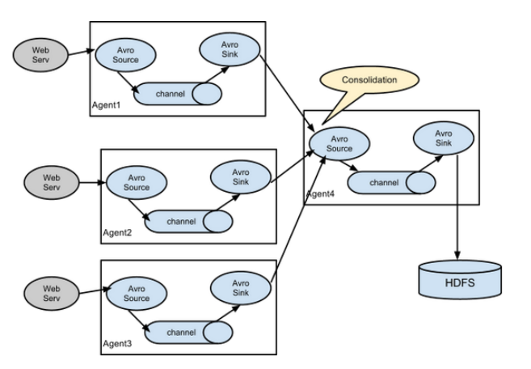
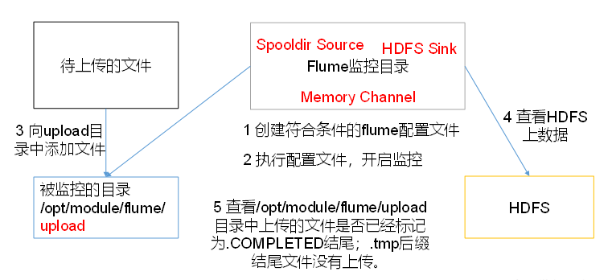

# Flume概述

## Flume定义

​		Flume是Cloudera提供的一个高可用的，高可靠的，**分布式的海量日志采集、聚合和传输的系统**。Flume基于流式架构，灵活简单。


## Flume的优点

1. 可以和任意存储进程集成。

2. 输入的的数据速率大于写入目的存储的速率，flume会进行缓冲，减小hdfs的压力。

3. flume中的事务基于channel，使用了两个事务模型（sender + receiver），确保消息被可靠发送。Flume使用两个独立的事务分别负责从soucrce到channel，以及从channel到sink的事件传递。一旦事务中所有的数据全部成功提交到channel，那么source才认为该数据读取完成。同理，只有成功被sink写出去的数据，才会从channel中移除。

## Flume组成架构


下面我们来详细介绍一下Flume架构中的组件。

### Agent

Agent是一个JVM进程，它以事件的形式将数据从源头送至目的。

Agent主要有3个部分组成，Source、Channel、Sink。

### Source

​	**Source是负责接收数据到Flume Agent的组件。**Source组件可以处理各种类型、各种格式的日志数据，包括avro、thrift、**exec**、jms、**spooling directory**、netcat、sequence generator、syslog、http、legacy。

### Channel

​	**Channel是位于Source和Sink之间的缓冲区**。因此，Channel允许Source和Sink运作在不同的速率上。Channel是线程安全的，可以同时处理几个Source的写入操作和几个Sink的读取操作。

​	Flume自带两种Channel：Memory Channel和File Channel。

​	**Memory Channel是内存中的队列。Memory Channel在不需要关心数据丢失的情景下适用**。如果需要关心数据丢失，那么Memory Channel就不应该使用，因为程序死亡、机器宕机或者重启都会导致数据丢失。

​	**File Channel将所有事件写到磁盘**。因此在程序关闭或机器宕机的情况下不会丢失数据。

### Sink

​	**Sink不断地轮询Channel中的事件且批量地移除它们，并将这些事件批量写入到存储或索引系统、或者被发送到另一个Flume Agent。**

​	**Sink是完全事务性的**。在从Channel批量删除数据之前，每个Sink用Channel启动一个事务。批量事件一旦成功写出到存储系统或下一个Flume Agent，Sink就利用Channel提交事务。事务一旦被提交，该Channel从自己的内部缓冲区删除事件。

Sink组件目的地包括hdfs、logger、avro、thrift、ipc、file、null、HBase、solr、自定义。

### Event

​	传输单元，Flume数据传输的基本单元，以事件的形式将数据从源头送至目的地。 Event由可选的header和载有数据的一个byte array 构成。Header是容纳了key-value字符串对的HashMap。


## Flume拓扑结构


### flume agent连接

​	这种模式是将多个flume给顺序连接起来了，从最初的source开始到最终sink传送的目的存储系统。此模式不建议桥接过多的flume数量， flume数量过多不仅会影响传输速率，而且一旦传输过程中某个节点flume宕机，会影响整个传输系统。

### 单source，多channel、sink


​	Flume支持将事件流向一个或者多个目的地。这种模式将数据源复制到多个channel中，每个channel都有相同的数据，sink可以选择传送的不同的目的地。

### flume负载均衡


​	Flume支持使用将多个sink逻辑上分到一个sink组，flume将数据发送到不同的sink，主要解决负载均衡和故障转移问题。

#### flume agent聚合



​	这种模式是我们最常见的，也非常实用，日常web应用通常分布在上百个服务器，大者甚至上千个、上万个服务器。产生的日志，处理起来也非常麻烦。用flume的这种组合方式能很好的解决这一问题，每台服务器部署一个flume采集日志，传送到一个集中收集日志的flume，再由此flume上传到hdfs、hive、hbase、jms等，进行日志分析。

## Flume Agent内部原理


# 快速入门

## Flume安装地址

1） Flume官网地址

http://flume.apache.org/

2）文档查看地址

http://flume.apache.org/FlumeUserGuide.html

3）下载地址

http://archive.apache.org/dist/flume/

## 安装部署

1）将`apache-flume-1.7.0-bin.tar.gz`上传到linux的`/opt/software`目录下

2）解压`apache-flume-1.7.0-bin.tar.gz`到`/opt/module/`目录下

```bash
[hadoop@hadoop102 software]$ tar -zxf apache-flume-1.7.0-bin.tar.gz -C /opt/module/
```

3）修改`apache-flume-1.7.0-bin`的名称为flume

```bash
[hadoop@hadoop102 module]$ mv apache-flume-1.7.0-bin flume
```

4） 将`flume/conf`下的`flume-env.sh.template`文件修改为`flume-env.sh`，并配置`flume-env.sh`文件

```bash
[hadoop@hadoop102 conf]$ mv flume-env.sh.template flume-env.sh
[hadoop@hadoop102 conf]$ vi flume-env.sh
export JAVA_HOME=/opt/module/jdk1.8.0_144
```

# 企业开发案例

## 1.监控端口数据官方案例

1）案例需求：

首先启动Flume任务，监控本机44444端口，服务端；

然后通过netcat工具向本机44444端口发送消息，客户端；

最后Flume将监听的数据实时显示在控制台。

2）需求分析：


3）实现步骤：

1．安装netcat工具

```bash
 [hadoop@hadoop102 software]$ sudo yum install -y nc
```

2．判断44444端口是否被占用

```bash
[hadoop@hadoop102 flume-telnet]$ sudo netstat -tunlp | grep 44444
```

> 功能描述：netstat命令是一个监控TCP/IP网络的非常有用的工具，它可以显示路由表、实际的网络连接以及每一个网络接口设备的状态信息。 
>
> 基本语法：netstat [选项]
>
> 选项参数：
>
> ​	-t或--tcp：显示TCP传输协议的连线状况； 
>
> -u或--udp：显示UDP传输协议的连线状况；
>
> ​	-n或--numeric：直接使用ip地址，而不通过域名服务器； 
>
> ​	-l或--listening：显示监控中的服务器的Socket； 
>
> ​	-p或--programs：显示正在使用Socket的程序识别码（PID）和程序名称；

3．创建Flume Agent配置文件`flume-netcat-logger.conf`

在flume目录下创建job文件夹并进入job文件夹。

```bash
[hadoop@hadoop102 flume]$ mkdir job
[hadoop@hadoop102 flume]$ cd job/
```

在job文件夹下创建Flume Agent配置文件`flume-netcat-logger.conf`。

```bash
[hadoop@hadoop102 job]$ touch flume-netcat-logger.conf
```

在flume-netcat-logger.conf文件中添加如下内容。

```bash
[hadoop@hadoop102 job]$ vim flume-netcat-logger.conf
```

添加内容如下：

```properties
# Name the components on this agent
a1.sources = r1
a1.sinks = k1
a1.channels = c1 

# Describe/configure the source
a1.sources.r1.type = netcat
a1.sources.r1.bind = localhost
a1.sources.r1.port = 44444

# Describe the sink
a1.sinks.k1.type = logger

# Use a channel which buffers events in memory
a1.channels.c1.type = memory
a1.channels.c1.capacity = 1000
a1.channels.c1.transactionCapacity = 100
 
# Bind the source and sink to the channel
a1.sources.r1.channels = c1
a1.sinks.k1.channel = c1
```

注：配置文件来源于官方手册http://flume.apache.org/FlumeUserGuide.html


4.先开启flume监听端口

第一种写法：

```bash
[hadoop@hadoop102 flume]$ bin/flume-ng agent --conf conf/ --name a1 --conf-file job/flume-netcat-logger.conf -Dflume.root.logger=INFO,console
```

第二种写法：

```bash
[hadoop@hadoop102 flume]$ bin/flume-ng agent -c conf/ -n a1 –f job/flume-netcat-logger.conf -Dflume.root.logger=INFO,console
```

> 参数说明：
>
> 	--conf conf/  ：表示配置文件存储在conf/目录
>	--name a1	：表示给agent起名为a1
> 	--conf-file job/flume-netcat.conf ：flume本次启动读取的配置文件是在job文件夹下的flume-telnet.conf文件。
>	-Dflume.root.logger==INFO,console ：-D表示flume运行时动态修改flume.root.logger参数属性值，并将控制台日志打印级别设置为INFO级别。日志级别包括:log、info、warn、error。

5．使用netcat工具向本机的44444端口发送内容

```bash
[hadoop@hadoop102 ~]$ nc localhost 44444
hello 
hadoop
```

6．在Flume监听页面观察接收数据情况

 

> 思考：nc hadoop102 44444， flume能否接收到？

## 2.实时读取本地文件到HDFS案例

1）案例需求：实时监控Hive日志，并上传到HDFS中

2）需求分析：


3）实现步骤：

Flume要想将数据输出到HDFS，必须持有Hadoop相关jar包

```
commons-configuration-1.6.jar、

hadoop-auth-2.7.2.jar、

hadoop-common-2.7.2.jar、

hadoop-hdfs-2.7.2.jar、

commons-io-2.4.jar、

htrace-core-3.1.0-incubating.jar
```

以上jar包拷贝到`/opt/module/flume/lib`文件夹下。

创建`flume-file-hdfs.conf`文件

创建文件

```bash
[hadoop@hadoop102 job]$ touch flume-file-hdfs.conf
```

> 注：要想读取Linux系统中的文件，就得按照Linux命令的规则执行命令。由于Hive日志在Linux系统中所以读取文件的类型选择：exec即execute执行的意思。表示执行Linux命令来读取文件。

```bash
[hadoop@hadoop102 job]$ vim flume-file-hdfs.conf
```

添加如下内容

```pro
# Name the components on this agent
a2.sources = r2
a2.sinks = k2
a2.channels = c2

# Describe/configure the source
a2.sources.r2.type = exec
a2.sources.r2.command = tail -F /opt/module/hive/logs/hive.log
a2.sources.r2.shell = /bin/bash -c

# Describe the sink
a2.sinks.k2.type = hdfs
a2.sinks.k2.hdfs.path = hdfs://hadoop102:9000/flume/%Y%m%d/%H
#上传文件的前缀
a2.sinks.k2.hdfs.filePrefix = logs-
#是否按照时间滚动文件夹
a2.sinks.k2.hdfs.round = true
#多少时间单位创建一个新的文件夹
a2.sinks.k2.hdfs.roundValue = 1
#重新定义时间单位
a2.sinks.k2.hdfs.roundUnit = hour
#是否使用本地时间戳
a2.sinks.k2.hdfs.useLocalTimeStamp = true
#积攒多少个Event才flush到HDFS一次
a2.sinks.k2.hdfs.batchSize = 1000
#设置文件类型，可支持压缩
a2.sinks.k2.hdfs.fileType = DataStream
#多久生成一个新的文件
a2.sinks.k2.hdfs.rollInterval = 60
#设置每个文件的滚动大小
a2.sinks.k2.hdfs.rollSize = 134217700
#文件的滚动与Event数量无关
a2.sinks.k2.hdfs.rollCount = 0

# Use a channel which buffers events in memory
a2.channels.c2.type = memory
a2.channels.c2.capacity = 1000
a2.channels.c2.transactionCapacity = 100

# Bind the source and sink to the channel
a2.sources.r2.channels = c2
a2.sinks.k2.channel = c2
```

**注意：**

对于所有与时间相关的转义序列，Event Header中必须存在以 “timestamp”的key（除非hdfs.useLocalTimeStamp设置为true，此方法会使用TimestampInterceptor自动添加timestamp）`a3.sinks.k3.hdfs.useLocalTimeStamp = true`。


1.执行监控配置

```bash
[hadoop@hadoop102 flume]$ bin/flume-ng agent --conf conf/ --name a2 --conf-file job/flume-file-hdfs.conf
```

2.开启Hadoop和Hive并操作Hive产生日志

```bash
[hadoop@hadoop102 hadoop-2.7.2]$ sbin/start-dfs.sh
[hadoop@hadoop103 hadoop-2.7.2]$ sbin/start-yarn.sh

[hadoop@hadoop102 hive]$ bin/hive
hive (default)>
```

3.在HDFS上查看文件


## 3.实时读取目录文件到HDFS案例

1）案例需求：使用Flume监听整个目录的文件

2）需求分析：



3）实现步骤：

1．创建配置文件flume-dir-hdfs.conf

创建一个文件

```bash
[hadoop@hadoop102 job]$ touch flume-dir-hdfs.conf
```

打开文件

```bash
[hadoop@hadoop102 job]$ vim flume-dir-hdfs.conf
```

添加如下内容

```properties
a3.sources = r3
a3.sinks = k3
a3.channels = c3
# Describe/configure the source
a3.sources.r3.type = spooldir
a3.sources.r3.spoolDir = /opt/module/flume/upload
a3.sources.r3.fileSuffix = .COMPLETED
a3.sources.r3.fileHeader = true
#忽略所有以.tmp结尾的文件，不上传
a3.sources.r3.ignorePattern = ([^ ]*\.tmp)
# Describe the sink
a3.sinks.k3.type = hdfs
a3.sinks.k3.hdfs.path = hdfs://hadoop102:9000/flume/upload/%Y%m%d/%H
#上传文件的前缀
a3.sinks.k3.hdfs.filePrefix = upload-
#是否按照时间滚动文件夹
a3.sinks.k3.hdfs.round = true
#多少时间单位创建一个新的文件夹
a3.sinks.k3.hdfs.roundValue = 1
#重新定义时间单位
a3.sinks.k3.hdfs.roundUnit = hour
#是否使用本地时间戳
a3.sinks.k3.hdfs.useLocalTimeStamp = true
#积攒多少个Event才flush到HDFS一次
a3.sinks.k3.hdfs.batchSize = 100
#设置文件类型，可支持压缩
a3.sinks.k3.hdfs.fileType = DataStream
#多久生成一个新的文件
a3.sinks.k3.hdfs.rollInterval = 60
#设置每个文件的滚动大小大概是128M
a3.sinks.k3.hdfs.rollSize = 134217700
#文件的滚动与Event数量无关
a3.sinks.k3.hdfs.rollCount = 0
# Use a channel which buffers events in memory
a3.channels.c3.type = memory
a3.channels.c3.capacity = 1000
a3.channels.c3.transactionCapacity = 100
# Bind the source and sink to the channel
a3.sources.r3.channels = c3
a3.sinks.k3.channel = c3
```


2. 启动监控文件夹命令

```bash
[hadoop@hadoop102 flume]$ bin/flume-ng agent --conf conf/ --name a3 --conf-file job/flume-dir-hdfs.conf
```

> 说明： 在使用Spooling Directory Source时
>
> 1) 不要在监控目录中创建并持续修改文件
>
> 2) 上传完成的文件会以.COMPLETED结尾
>
> 3) 被监控文件夹每500毫秒扫描一次文件变动

3.向upload文件夹中添加文件

在`/opt/module/flume`目录下创建upload文件夹

```bash
[hadoop@hadoop102 flume]$ mkdir upload
```

向upload文件夹中添加文件

```bash
[hadoop@hadoop102 upload]$ touch hadoop.txt
[hadoop@hadoop102 upload]$ touch hadoop.tmp
[hadoop@hadoop102 upload]$ touch hadoop.log
```

4.查看HDFS上的数据


5.等待1s，再次查询upload文件夹

```bash
[hadoop@hadoop102 upload]$ ll
总用量 0
-rw-rw-r--. 1 hadoop hadoop 0 5月  20 22:31 hadoop.log.COMPLETED
-rw-rw-r--. 1 hadoop hadoop 0 5月  20 22:31 hadoop.tmp
-rw-rw-r--. 1 hadoop hadoop 0 5月  20 22:31 hadoop.txt.COMPLETED
```

## 4.单数据源多出口案例(选择器)

单Source多Channel、Sink如图所示


1）案例需求：使用Flume-1监控文件变动，Flume-1将变动内容传递给Flume-2，Flume-2负责存储到HDFS。同时Flume-1将变动内容传递给Flume-3，Flume-3负责输出到Local FileSystem。

2）需求分析：


3）实现步骤：

0．准备工作

在`/opt/module/flume/job`目录下创建group1文件夹

```bash
[hadoop@hadoop102 job]$ cd group1/
```

在`/opt/module/datas/`目录下创建flume3文件夹

```bahs
[hadoop@hadoop102 datas]$ mkdir flume3
```

1．创建`flume-file-flume.conf`

配置1个接收日志文件的source和两个channel、两个sink，分别输送给flume-flume-hdfs和flume-flume-dir。

创建配置文件并打开

```bash
[hadoop@hadoop102 group1]$ touch flume-file-flume.conf
[hadoop@hadoop102 group1]$ vim flume-file-flume.conf
```

添加如下内容

```properties
# Name the components on this agent
a1.sources = r1
a1.sinks = k1 k2
a1.channels = c1 c2
# 将数据流复制给所有channel
a1.sources.r1.selector.type = replicating
# Describe/configure the source
a1.sources.r1.type = exec
a1.sources.r1.command = tail -F /opt/module/hive/logs/hive.log
a1.sources.r1.shell = /bin/bash -c
# Describe the sink
# sink端的avro是一个数据发送者
a1.sinks.k1.type = avro
a1.sinks.k1.hostname = hadoop102 
a1.sinks.k1.port = 4141
a1.sinks.k2.type = avro
a1.sinks.k2.hostname = hadoop102
a1.sinks.k2.port = 4142 
# Describe the channel
a1.channels.c1.type = memory
a1.channels.c1.capacity = 1000
a1.channels.c1.transactionCapacity = 100
a1.channels.c2.type = memory
a1.channels.c2.capacity = 1000
a1.channels.c2.transactionCapacity = 100 
# Bind the source and sink to the channel
a1.sources.r1.channels = c1 c2
a1.sinks.k1.channel = c1
a1.sinks.k2.channel = c2
```

> 注：Avro是由Hadoop创始人Doug Cutting创建的一种语言无关的数据序列化和RPC框架。
>
> 注：RPC（Remote Procedure Call）—远程过程调用，它是一种通过网络从远程计算机程序上请求服务，而不需要了解底层网络技术的协议。

2．创建`flume-flume-hdfs.conf`

配置上级Flume输出的Source，输出是到HDFS的Sink。

创建配置文件并打开

```bash
[hadoop@hadoop102 group1]$ touch flume-flume-hdfs.conf
[hadoop@hadoop102 group1]$ vim flume-flume-hdfs.conf
```

添加如下内容

```properties
# Name the components on this agent
a2.sources = r1
a2.sinks = k1
a2.channels = c1
# Describe/configure the source
# source端的avro是一个数据接收服务
a2.sources.r1.type = avro
a2.sources.r1.bind = hadoop102
a2.sources.r1.port = 4141
# Describe the sink
a2.sinks.k1.type = hdfs
a2.sinks.k1.hdfs.path = hdfs://hadoop102:9000/flume2/%Y%m%d/%H
#上传文件的前缀
a2.sinks.k1.hdfs.filePrefix = flume2-
#是否按照时间滚动文件夹
a2.sinks.k1.hdfs.round = true
#多少时间单位创建一个新的文件夹
a2.sinks.k1.hdfs.roundValue = 1
#重新定义时间单位
a2.sinks.k1.hdfs.roundUnit = hour
#是否使用本地时间戳
a2.sinks.k1.hdfs.useLocalTimeStamp = true
#积攒多少个Event才flush到HDFS一次
a2.sinks.k1.hdfs.batchSize = 100
#设置文件类型，可支持压缩
a2.sinks.k1.hdfs.fileType = DataStream
#多久生成一个新的文件
a2.sinks.k1.hdfs.rollInterval = 600
#设置每个文件的滚动大小大概是128M
a2.sinks.k1.hdfs.rollSize = 134217700
#文件的滚动与Event数量无关
a2.sinks.k1.hdfs.rollCount = 0
# Describe the channel
a2.channels.c1.type = memory
a2.channels.c1.capacity = 1000
a2.channels.c1.transactionCapacity = 100 
# Bind the source and sink to the channel
a2.sources.r1.channels = c1
a2.sinks.k1.channel = c1
```

3．创建`flume-flume-dir.conf`

配置上级Flume输出的Source，输出是到本地目录的Sink。

创建配置文件并打开

```bash
[hadoop@hadoop102 group1]$ touch flume-flume-dir.conf
[hadoop@hadoop102 group1]$ vim flume-flume-dir.conf
```

添加如下内容

```properties
# Name the components on this agent
a3.sources = r1
a3.sinks = k1
a3.channels = c2
# Describe/configure the source
a3.sources.r1.type = avro
a3.sources.r1.bind = hadoop102
a3.sources.r1.port = 4142 
# Describe the sink
a3.sinks.k1.type = file_roll
a3.sinks.k1.sink.directory = /opt/module/data/flume3
# Describe the channel
a3.channels.c2.type = memory
a3.channels.c2.capacity = 1000
a3.channels.c2.transactionCapacity = 100
# Bind the source and sink to the channel
a3.sources.r1.channels = c2
a3.sinks.k1.channel = c2
```

> 提示：输出的本地目录必须是已经存在的目录，如果该目录不存在，并不会创建新的目录。

4．执行配置文件

分别开启对应配置文件：`flume-flume-dir`，`flume-flume-hdfs`，`flume-file-flume`。

```bash
[hadoop@hadoop102 flume]$ bin/flume-ng agent --conf conf/ --name a3 --conf-file job/group1/flume-flume-dir.conf
[hadoop@hadoop102 flume]$ bin/flume-ng agent --conf conf/ --name a2 --conf-file job/group1/flume-flume-hdfs.conf
[hadoop@hadoop102 flume]$ bin/flume-ng agent --conf conf/ --name a1 --conf-file job/group1/flume-file-flume.conf
```

5．启动Hadoop和Hive

```bash
[hadoop@hadoop102 hadoop-2.7.2]$ sbin/start-dfs.sh
[hadoop@hadoop103 hadoop-2.7.2]$ sbin/start-yarn.sh
[hadoop@hadoop102 hive]$ bin/hive
hive (default)>
```


6．检查HDFS上数据


## 5.单数据源多出口案例(Sink组)

单Source、Channel多Sink(负载均衡)如图所示。


1）案例需求：使用Flume-1监控文件变动，Flume-1将变动内容传递给Flume-2，Flume-2负责存储到HDFS。同时Flume-1将变动内容传递给Flume-3，Flume-3也负责存储到HDFS 

2）需求分析：


3）实现步骤：

0．准备工作

在`/opt/module/flume/job`目录下创建`group2`文件夹

```bash
[hadoop@hadoop102 job]$ cd group2/
```

1．创建`flume-netcat-flume.conf`

配置1个接收日志文件的source和1个channel、两个sink，分别输送给flume-flume-console1和flume-flume-console2。

创建配置文件并打开

```bash
[hadoop@hadoop102 group2]$ touch flume-netcat-flume.conf
[hadoop@hadoop102 group2]$ vim flume-netcat-flume.conf
```

添加如下内容

```properties
# Name the components on this agent
a1.sources = r1
a1.channels = c1
a1.sinkgroups = g1
a1.sinks = k1 k2
# Describe/configure the source
a1.sources.r1.type = netcat
a1.sources.r1.bind = localhost
a1.sources.r1.port = 44444
a1.sinkgroups.g1.processor.type = load_balance
a1.sinkgroups.g1.processor.backoff = true
a1.sinkgroups.g1.processor.selector = round_robin
a1.sinkgroups.g1.processor.selector.maxTimeOut=10000 
# Describe the sink
a1.sinks.k1.type = avro
a1.sinks.k1.hostname = hadoop102
a1.sinks.k1.port = 4141 
a1.sinks.k2.type = avro
a1.sinks.k2.hostname = hadoop102
a1.sinks.k2.port = 4142
# Describe the channel
a1.channels.c1.type = memory
a1.channels.c1.capacity = 1000
a1.channels.c1.transactionCapacity = 100
# Bind the source and sink to the channel
a1.sources.r1.channels = c1
a1.sinkgroups.g1.sinks = k1 k2
a1.sinks.k1.channel = c1
a1.sinks.k2.channel = c1
```

> 注：Avro是由Hadoop创始人Doug Cutting创建的一种语言无关的数据序列化和RPC框架。
>
> 注：RPC（Remote Procedure Call）—远程过程调用，它是一种通过网络从远程计算机程序上请求服务，而不需要了解底层网络技术的协议。

2．创建`flume-flume-console1.conf`

配置上级Flume输出的Source，输出是到本地控制台。

创建配置文件并打开

```bash
[hadoop@hadoop102 group2]$ touch flume-flume-console1.conf
[hadoop@hadoop102 group2]$ vim flume-flume-console1.conf
```

添加如下内容

```properties
# Name the components on this agent
a2.sources = r1
a2.sinks = k1
a2.channels = c1
# Describe/configure the source
a2.sources.r1.type = avro
a2.sources.r1.bind = hadoop102
a2.sources.r1.port = 4141 
# Describe the sink
a2.sinks.k1.type = logger
# Describe the channel
a2.channels.c1.type = memory
a2.channels.c1.capacity = 1000
a2.channels.c1.transactionCapacity = 100
# Bind the source and sink to the channel
a2.sources.r1.channels = c1
a2.sinks.k1.channel = c1
```

3．创建`flume-flume-console2.conf`

配置上级Flume输出的Source，输出是到本地控制台。

创建配置文件并打开

```bash
[hadoop@hadoop102 group2]$ touch flume-flume-console2.conf
[hadoop@hadoop102 group2]$ vim flume-flume-console2.conf
```

添加如下内容

```properties
# Name the components on this agent
a3.sources = r1
a3.sinks = k1
a3.channels = c2 
# Describe/configure the source
a3.sources.r1.type = avro
a3.sources.r1.bind = hadoop102
a3.sources.r1.port = 4142
# Describe the sink
a3.sinks.k1.type = logger
# Describe the channel
a3.channels.c2.type = memory
a3.channels.c2.capacity = 1000
a3.channels.c2.transactionCapacity = 100
# Bind the source and sink to the channel
a3.sources.r1.channels = c2
a3.sinks.k1.channel = c2
```

4．执行配置文件

分别开启对应配置文件：flume-flume-console2，flume-flume-console1，flume-netcat-flume。

```bash
[hadoop@hadoop102 flume]$ bin/flume-ng agent --conf conf/ --name a3 --conf-file job/group2/flume-flume-console2.conf -Dflume.root.logger=INFO,console
[hadoop@hadoop102 flume]$ bin/flume-ng agent --conf conf/ --name a2 --conf-file job/group2/flume-flume-console1.conf -Dflume.root.logger=INFO,console
[hadoop@hadoop102 flume]$ bin/flume-ng agent --conf conf/ --name a1 --conf-file job/group2/flume-netcat-flume.conf
```

5.使用netcat工具向本机的44444端口发送内容

```bash
$ nc localhost 44444
```

6.查看Flume2及Flume3的控制台打印日志

## 6.多数据源汇总案例

多Source汇总数据到单Flume如图所示。


1） 案例需求：

hadoop103上的Flume-1监控文件/opt/module/group.log，

hadoop102上的Flume-2监控某一个端口的数据流，

Flume-1与Flume-2将数据发送给hadoop104上的Flume-3，Flume-3将最终数据打印到控制台。

2）需求分析：


3）实现步骤：

0．准备工作

分发Flume

```bash
[hadoop@hadoop102 module]$ xsync flume
```

在hadoop102、hadoop103以及hadoop104的`/opt/module/flume/job`目录下创建一个group3文件夹。

```bash
[hadoop@hadoop102 job]$ mkdir group3
[hadoop@hadoop103 job]$ mkdir group3
[hadoop@hadoop104 job]$ mkdir group3
```

1．创建`flume1-logger-flume.conf`

配置Source用于监控`hive.log`文件，配置Sink输出数据到下一级Flume。

在hadoop103上创建配置文件并打开

```bash
[hadoop@hadoop103 group3]$ touch flume1-logger-flume.conf
[hadoop@hadoop103 group3]$ vim flume1-logger-flume.conf 
```

添加如下内容

```properties
# Name the components on this agent
a1.sources = r1
a1.sinks = k1
a1.channels = c1
# Describe/configure the source
a1.sources.r1.type = exec
a1.sources.r1.command = tail -F /opt/module/group.log
a1.sources.r1.shell = /bin/bash -c 
# Describe the sink
a1.sinks.k1.type = avro
a1.sinks.k1.hostname = hadoop104
a1.sinks.k1.port = 4141 
# Describe the channel
a1.channels.c1.type = memory
a1.channels.c1.capacity = 1000
a1.channels.c1.transactionCapacity = 100 
# Bind the source and sink to the channel
a1.sources.r1.channels = c1
a1.sinks.k1.channel = c1
```

2．创建`flume2-netcat-flume.conf`

配置Source监控端口44444数据流，配置Sink数据到下一级Flume：

在hadoop102上创建配置文件并打开

```bash
[hadoop@hadoop102 group3]$ touch flume2-netcat-flume.conf
[hadoop@hadoop102 group3]$ vim flume2-netcat-flume.conf
```

添加如下内容

```properties
# Name the components on this agent
a2.sources = r1
a2.sinks = k1
a2.channels = c1 
# Describe/configure the source
a2.sources.r1.type = netcat
a2.sources.r1.bind = hadoop102
a2.sources.r1.port = 44444 
# Describe the sink
a2.sinks.k1.type = avro
a2.sinks.k1.hostname = hadoop104
a2.sinks.k1.port = 4141 
# Use a channel which buffers events in memory
a2.channels.c1.type = memory
a2.channels.c1.capacity = 1000
a2.channels.c1.transactionCapacity = 100
# Bind the source and sink to the channel
a2.sources.r1.channels = c1
a2.sinks.k1.channel = c1
```

3．创建`flume3-flume-logger.conf`

配置source用于接收flume1与flume2发送过来的数据流，最终合并后sink到控制台。

在hadoop104上创建配置文件并打开

```bash
[hadoop@hadoop104 group3]$ touch flume3-flume-logger.conf
[hadoop@hadoop104 group3]$ vim flume3-flume-logger.conf
```

添加如下内容

```properties
# Name the components on this agent
a3.sources = r1
a3.sinks = k1
a3.channels = c1 
# Describe/configure the source
a3.sources.r1.type = avro
a3.sources.r1.bind = hadoop104
a3.sources.r1.port = 4141 
# Describe the sink
# Describe the sink
a3.sinks.k1.type = logger 
# Describe the channel
a3.channels.c1.type = memory
a3.channels.c1.capacity = 1000
a3.channels.c1.transactionCapacity = 100 
# Bind the source and sink to the channel
a3.sources.r1.channels = c1
a3.sinks.k1.channel = c1
```

4．执行配置文件

分别开启对应配置文件：`flume3-flume-logger.conf`，`flume2-netcat-flume.conf`，`flume1-logger-flume.conf`。

```bash
[hadoop@hadoop104 flume]$ bin/flume-ng agent --conf conf/ --name a3 --conf-file job/group3/flume3-flume-logger.conf -Dflume.root.logger=INFO,console
[hadoop@hadoop102 flume]$ bin/flume-ng agent --conf conf/ --name a2 --conf-file job/group3/flume2-netcat-flume.conf
[hadoop@hadoop103 flume]$ bin/flume-ng agent --conf conf/ --name a1 --conf-file job/group3/flume1-logger-flume.conf
```

5．在hadoop103上向`/opt/module`目录下的`group.log`追加内容

```bash
[hadoop@hadoop103 module]$ echo 'hello' > group.log
```

6．在hadoop102上向44444端口发送数据

```bash
[hadoop@hadoop102 flume]$ telnet hadoop102 44444
```

7.检查hadoop104上数据


# Flume监控之Ganglia

## Ganglia的安装与部署

**1)安装httpd服务与php**

```bash
[hadoop@hadoop102 flume]$ sudo yum -y install httpd php
```

**2)安装其他依赖**

```bash
[hadoop@hadoop102 flume]$ sudo yum -y install rrdtool perl-rrdtool rrdtool-devel
[hadoop@hadoop102 flume]$ sudo yum -y install apr-devel
```

**3)安装ganglia**

```bash
[hadoop@hadoop102 flume]$ sudo rpm -Uvh http://dl.fedoraproject.org/pub/epel/6/x86_64/epel-release-6-8.noarch.rpm
[hadoop@hadoop102 flume]$ sudo yum -y install ganglia-gmetad 
[hadoop@hadoop102 flume]$ sudo yum -y install ganglia-web
[hadoop@hadoop102 flume]$ sudo yum install -y ganglia-gmond
```

> Ganglia由gmond、gmetad和gweb三部分组成。
>
> gmond（Ganglia Monitoring Daemon）是一种轻量级服务，安装在每台需要收集指标数据的节点主机上。使用gmond，你可以很容易收集很多系统指标数据，如CPU、内存、磁盘、网络和活跃进程的数据等。
>
> gmetad（Ganglia Meta Daemon）整合所有信息，并将其以RRD格式存储至磁盘的服务。
>
> gweb（Ganglia Web）Ganglia可视化工具，gweb是一种利用浏览器显示gmetad所存储数据的PHP前端。在Web界面中以图表方式展现集群的运行状态下收集的多种不同指标数据。

**4)修改配置文件`/etc/httpd/conf.d/ganglia.conf`**

```bash
[hadoop@hadoop102 flume]$ sudo vim /etc/httpd/conf.d/ganglia.conf
```

修改打*部分

```xml
# Ganglia monitoring system php web frontend
Alias /ganglia /usr/share/ganglia
<Location /ganglia>
  Order deny,allow
  *#Deny from all
  *Allow from all
  *# Allow from 127.0.0.1
  *# Allow from ::1
  # Allow from .example.com
</Location>
```

**5)修改配置文件`/etc/ganglia/gmetad.conf`**

```bash
[hadoop@hadoop102 flume]$ sudo vim /etc/ganglia/gmetad.conf
----------修改为
data_source "hadoop102" 192.168.1.102
```

**6)修改配置文件`/etc/ganglia/gmond.conf`**

```bash
[hadoop@hadoop102 flume]$ sudo vim /etc/ganglia/gmond.conf 
```

修改为

```
cluster {
  name = "hadoop102"
  owner = "unspecified"
  latlong = "unspecified"
  url = "unspecified"
}
udp_send_channel {
  #bind_hostname = yes # Highly recommended, soon to be default.
                       # This option tells gmond to use a source address
                       # that resolves to the machine's hostname.  Without
                       # this, the metrics may appear to come from any
                       # interface and the DNS names associated with
                       # those IPs will be used to create the RRDs.
  # mcast_join = 239.2.11.71
  host = 192.168.1.102
  port = 8649
  ttl = 1
}
udp_recv_channel {
  # mcast_join = 239.2.11.71
  port = 8649
  bind = 192.168.1.102
  retry_bind = true
  # Size of the UDP buffer. If you are handling lots of metrics you really
  # should bump it up to e.g. 10MB or even higher.
  # buffer = 10485760
}
```

**7)修改配置文件`/etc/selinux/config`**

```bash
[hadoop@hadoop102 flume]$ sudo vim /etc/selinux/config
```

修改为：

```bash
# This file controls the state of SELinux on the system.
# SELINUX= can take one of these three values:
#     enforcing - SELinux security policy is enforced.
#     permissive - SELinux prints warnings instead of enforcing.
#     disabled - No SELinux policy is loaded.
SELINUX=disabled
# SELINUXTYPE= can take one of these two values:
#     targeted - Targeted processes are protected,
#     mls - Multi Level Security protection.
SELINUXTYPE=targeted
```

**尖叫提示：selinux本次生效关闭必须重启，如果此时不想重启，可以临时生效之：**

```bash
[hadoop@hadoop102 flume]$ sudo setenforce 0
```

**8)启动ganglia**

```bash
[hadoop@hadoop102 flume]$ sudo service httpd start
[hadoop@hadoop102 flume]$ sudo service gmetad start
[hadoop@hadoop102 flume]$ sudo service gmond start
```

**9)打开网页浏览ganglia页面**

http://hadoop102/ganglia

**尖叫提示：如果完成以上操作依然出现权限不足错误，请修改`/var/lib/ganglia`目录的权限：**

```bash
[hadoop@hadoop102 flume]$ sudo chmod -R 777 /var/lib/ganglia
```

## 操作Flume测试监控

**1.修改/opt/module/flume/conf目录下的flume-env.sh配置**：

```properties
JAVA_OPTS="-Dflume.monitoring.type=ganglia
-Dflume.monitoring.hosts=192.168.1.102:8649
-Xms100m
-Xmx200m"
```

**2.启动flume任务**

```bash
[hadoop@hadoop102 flume]$ bin/flume-ng agent \
--conf conf/ \
--name a1 \
--conf-file job/flume-netcat-logger.conf \
-Dflume.root.logger==INFO,console \
-Dflume.monitoring.type=ganglia \
-Dflume.monitoring.hosts=192.168.1.102:8649
```

**3.发送数据观察ganglia监测图**

```bash
[hadoop@hadoop102 flume]$ nc localhost 44444
```

样式如图：


图例说明：

| 字段（图表名称）      | 字段含义                                                     |
| --------------------- | ------------------------------------------------------------ |
| EventPutAttemptCount  | source尝试写入channel的事件总数量                            |
| EventPutSuccessCount  | 成功写入channel且提交的事件总数量                            |
| EventTakeAttemptCount | sink尝试从channel拉取事件的总数量。这不意味着每次事件都被返回，因为sink拉取的时候channel可能没有任何数据。 |
| EventTakeSuccessCount | sink成功读取的事件的总数量                                   |
| StartTime             | channel启动的时间（毫秒）                                    |
| StopTime              | channel停止的时间（毫秒）                                    |
| ChannelSize           | 目前channel中事件的总数量                                    |
| ChannelFillPercentage | channel占用百分比                                            |
| ChannelCapacity       | channel的容量                                                |

# 自定义Source

## 介绍

​	**Source是负责接收数据到Flume Agent的组件**。Source组件可以处理各种类型、各种格式的日志数据，包括avro、thrift、**exec**、jms、**spooling directory**、netcat、sequence generator、syslog、http、legacy。官方提供的source类型已经很多，但是有时候并不能满足实际开发当中的需求，此时我们就需要根据实际需求自定义某些source。

官方也提供了自定义source的接口：

[https://flume.apache.org/FlumeDeveloperGuide.html#source](#source)根据官方说明自定义MySource需要继承AbstractSource类并实现Configurable和PollableSource接口。

实现相应方法：

​	`getBackOffSleepIncrement()//暂不用`

​	`getMaxBackOffSleepInterval()//暂不用`

​	`configure(Context context)//初始化context`（读取配置文件内容）

​	`process()//获取数据封装成event并写入channel，**这个方法将被循环调用**。`

**使用场景：读取MySQL数据或者其他文件系统。**

## 需求

​	使用flume接收数据，并给每条数据添加前缀，输出到控制台。前缀可从flume配置文件中配置。


## 分析


## 编码

**导入pom依赖**

```xml
<dependencies>
    <dependency>
        <groupId>org.apache.flume</groupId>
        <artifactId>flume-ng-core</artifactId>
        <version>1.7.0</version>
</dependency>

</dependencies>
```

```java
package com.hadoop;

import org.apache.flume.Context;
import org.apache.flume.EventDeliveryException;
import org.apache.flume.PollableSource;
import org.apache.flume.conf.Configurable;
import org.apache.flume.event.SimpleEvent;
import org.apache.flume.source.AbstractSource;

import java.util.HashMap;

public class MySource extends AbstractSource implements Configurable, PollableSource {

    //定义配置文件将来要读取的字段
    private Long delay;
    private String field;

    //初始化配置信息
    @Override
    public void configure(Context context) {
        delay = context.getLong("delay");
        field = context.getString("field", "Hello!");
    }

    @Override
    public Status process() throws EventDeliveryException {

        try {
            //创建事件头信息
            HashMap<String, String> hearderMap = new HashMap<>();
            //创建事件
            SimpleEvent event = new SimpleEvent();
            //循环封装事件
            for (int i = 0; i < 5; i++) {
                //给事件设置头信息
                event.setHeaders(hearderMap);
                //给事件设置内容
                event.setBody((field + i).getBytes());
                //将事件写入channel
                getChannelProcessor().processEvent(event);
                Thread.sleep(delay);
            }
        } catch (Exception e) {
            e.printStackTrace();
            return Status.BACKOFF;
        }
        return Status.READY;
    }

    @Override
    public long getBackOffSleepIncrement() {
        return 0;
    }

    @Override
    public long getMaxBackOffSleepInterval() {
        return 0;
    }
}
```

## 测试

1）打包

将写好的代码打包，并放到flume的lib目录（`/opt/module/flume`）下。

2）配置文件

```properties
# Name the components on this agent
a1.sources = r1
a1.sinks = k1
a1.channels = c1
# Describe/configure the source
a1.sources.r1.type = com.hadoop.MySource
a1.sources.r1.delay = 1000
#a1.sources.r1.field = hadoop
\# Describe the sink
a1.sinks.k1.type = logger 
# Use a channel which buffers events in memory
a1.channels.c1.type = memory
a1.channels.c1.capacity = 1000
a1.channels.c1.transactionCapacity = 100 
# Bind the source and sink to the channel
a1.sources.r1.channels = c1
a1.sinks.k1.channel = c1
```

3）开启任务

```bash
[hadoop@hadoop102 flume]$ pwd
--------
/opt/module/flume
[hadoop@hadoop102 flume]$ bin/flume-ng agent -c conf/ -f job/mysource.conf -n a1 -Dflume.root.logger=INFO,console
```

4）结果展示


# 自定义Sink