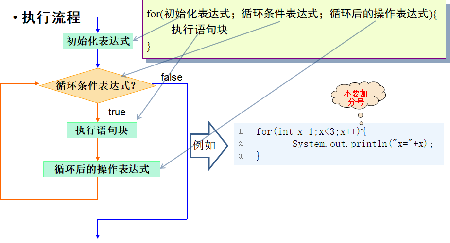

# 第三章 控制流语句

## 1.条件控制

### 1.1 if 

#### 1.1.1 代码块与作用域

```java
public class BlockDemo {

    public static void main(String[] args) {
        
    	{//局部代码块
    		int m = 89; //局部变量的作用域问题
            System.out.println(m);
    	}
        System.out.println("m="+m);//编译错误 ：找不到符号
    }
}
```

**原理：虚拟机运行到 “int m = 89”时会在内存空间中划出区域存储变量并且初始化值89**

**但是一旦出了局部代码块，这块内存空间就会释放，等待GC回收，原因按照语义，除了局部代码块这个变量就没有意义了，只会占据多余的内存空间**

作用：节省内存，对于不需要的变量，尽量写在合适的代码块中。虚拟机可以占用的内存空间是有限的

> 练习：
>
> 1.根据用户指定的具体数据，	判断该数据对应的星期
>
> [^注]: //Scanner类是java.util包中提供的一个操作类，使用此类可以方便的完成输入流的输入操作。          Scanner  scan = new Scanner(System.in);int i = scan.nextInt();
>
> ```java
> Scanner scanner = new Scanner(System.in);
>         int a = scanner.nextInt();
> ```
>
> 
>
> 2.根据输入值判断季节
>
> ```java
> int month = 1;
> if(month>1 || month >12)
> else if、、、、
> ```
>
> 


### 1.2 switch 语句

switch 可接受的表达式的类可以是int、byte、char、short 、String型、枚举型，不接受其他类型的值

例子

```java

    public static void main(String[] args) {
        int a = 2;
        switch (a) {
        default:
            System.out.println("d");
            break;
        case 4:
            System.out.println("c");
            break;
        case 3:
            System.out.println("3");
            //最后一个break可以省略
        }
    }
```


> 补充：枚举类
>
> 枚举类型是Java 5中新增特性的一部分，它是一种特殊的数据类型，之所以特殊是因为它既是一种类(class)类型却又比类类型多了些特殊的约束
>
> ```java
> public class DayDemo {
> 
>     public static final int MONDAY =1;
> 
>     public static final int TUESDAY=2;
> 
>     public static final int WEDNESDAY=3;
> 
>     public static final int THURSDAY=4;
> 
>     public static final int FRIDAY=5;
> 
>     public static final int SATURDAY=6;
> 
>     public static final int SUNDAY=7;
> 
> }
> ```
>
> ```
> enum Day {
>     MONDAY, TUESDAY, WEDNESDAY,
>     THURSDAY, FRIDAY, SATURDAY, SUNDAY
> }
> ```

> 练习：用switch实现下月份

>  if和switch的区别：
>
> 关键在于用对：十八般兵器什么时候用
>
> if:
>
> 1.对具体的值进行判断
>
> 2.对区间进行判断
>
> 3.对运算结果是boolean类型的表达式进行判断
>
> switch：
>
> 1.对具体的值进行判断
>
> 2.值得个数常是固定的
>
> **对于几个值是固定的判断建议用switch，因为switch语句会将具体的答案都加载进内存，效率相对高一点**
>
> 

## 2. 循环语句

### 2.1 while 与do while循环

>例子
>
>```java
>int x = 1;
>while(x<3){
>    System.out.println("x="+x);
>    x++;
>}
>
>//错误例子
>int x= 1;
>while（x<3）; //没有循环体
>{
>    System.out.println("x="+x);
>    x++;
>}
>```

### 2.2 do while 循环

```java
int x = 1;
do{
    System.out.println("x="+x);
    x++
}while(x<3);

int y = 1;
while(y<3){
    System.out.println("y="+y);
    y++
}
//注意以上两个的区别，do先执行，而while必须满足才执行
```

#### 课堂练习

> 1. 计算1-100的和
>
>    ```java
>    int x = 1;
>    int num = 0;
>    while(x<=100){
>        sum = sum +x;
>        x++
>    }
>    println(num)
>    ```
>
>    累加算法

> 2. 计算1-100之间6的倍数出现的次数
>
>    [^注]: 学生自己完成，并且提一下计数器思想

### 2.2 for循环

