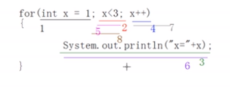

# 1第三章 控制流语句

## 1.条件控制

### 1.1 if 

#### 1.1.1 代码块与作用域

```java
public class BlockDemo {

    public static void main(String[] args) {
        
    	{//局部代码块
    		int m = 89; //局部变量的作用域问题
            System.out.println(m);
    	}
        System.out.println("m="+m);//编译错误 ：找不到符号
    }
}
```

**原理：虚拟机运行到 “int m = 89”时会在内存空间中划出区域存储变量并且初始化值89**

**但是一旦出了局部代码块，这块内存空间就会释放，等待GC回收，原因按照语义，除了局部代码块这个变量就没有意义了，只会占据多余的内存空间**

作用：节省内存，对于不需要的变量，尽量写在合适的代码块中。虚拟机可以占用的内存空间是有限的

> 练习：
>
> 1.根据用户指定的具体数据，	判断该数据对应的星期
>
> [^注]: //Scanner类是java.util包中提供的一个操作类，使用此类可以方便的完成输入流的输入操作。          Scanner  scan = new Scanner(System.in);int i = scan.nextInt();
>
> ```java
> Scanner scanner = new Scanner(System.in);
>         int a = scanner.nextInt();
> ```
>
> 
>
> 2.根据输入值判断季节
>
> ```java
> int month = 1;
> if(month>1 || month >12)
> else if、、、、
> ```
>
> 


### 1.2 switch 语句

switch 可接受的表达式的类可以是int、byte、char、short 、String型、枚举型，不接受其他类型的值

例子

```java

    public static void main(String[] args) {
        int a = 2;
        switch (a) {
        default:
            System.out.println("d");
            break;
        case 4:
            System.out.println("c");
            break;
        case 3:
            System.out.println("3");
            //最后一个break可以省略
        }
    }
```


> 补充：枚举类
>
> 枚举类型是Java 5中新增特性的一部分，它是一种特殊的数据类型，之所以特殊是因为它既是一种类(class)类型却又比类类型多了些特殊的约束
>
> ```java
> public class DayDemo {
> 
>     public static final int MONDAY =1;
> 
>     public static final int TUESDAY=2;
> 
>     public static final int WEDNESDAY=3;
> 
>     public static final int THURSDAY=4;
> 
>     public static final int FRIDAY=5;
> 
>     public static final int SATURDAY=6;
> 
>     public static final int SUNDAY=7;
> 
> }
> ```
>
> ```
> enum Day {
>     MONDAY, TUESDAY, WEDNESDAY,
>     THURSDAY, FRIDAY, SATURDAY, SUNDAY
> }
> ```

> 练习：用switch实现下月份
>
> ```java
> switch(x){
>     case 1,2,3:
>     case 4,5,6:
>     case 7,8,9:
>     case 10,11,12:
>     default:
> }
> ```
>
> 

>  if和switch的区别：
>
> 关键在于用对：十八般兵器什么时候用
>
> if:
>
> 1.对具体的值进行判断
>
> 2.对区间进行判断
>
> 3.对运算结果是boolean类型的表达式进行判断
>
> switch：
>
> 1.对具体的值进行判断
>
> 2.值得个数常是固定的
>
> **对于几个值是固定的判断建议用switch，因为switch语句会将具体的答案都加载进内存，效率相对高一点**
>
> 

## 2. 循环语句

### 2.1 while 与do while循环

>例子
>
>```java
>int x = 1;
>while(x<3){
>    System.out.println("x="+x);
>    x++;
>}
>
>//错误例子
>int x= 1;
>while（x<3）; //没有循环体
>{
>    System.out.println("x="+x);
>    x++;
>}
>```

### 2.2 do while 循环

```java
int x = 1;
do{
    System.out.println("x="+x);
    x++
}while(x<3);

int y = 1;
while(y<3){
    System.out.println("y="+y);
    y++
}
//注意以上两个的区别，do先执行，而while必须满足才执行
```

#### 课堂练习

> 1. 计算1-100的和
>
>    ```java
>    int x = 1;
>    int num = 0;
>    while(x<=100){
>        sum = sum +x;
>        x++
>    }
>    println(num)
>    ```
>
>    累加算法

> 2. 计算1-100之间6的倍数出现的次数
>
>    [^注]: 学生自己完成，并且提一下计数器思想

### 2.2 for循环




**结论：for循环的话初始化表达式只执行一次。循环在条件表达式和执行语句和循环后表达式之间进行循环**

> 例子：说明for循环中表达式的执行顺序，和有基础的人讲一讲，实际开发中都会用循环初始化表达式初始化一个数值，并且在循环后++，导致思维固话，其实只要是表达式就行，除了循环条件表达式必须返回boolean值以外，其他位置只要是合法的表达式即可。
>
> ```java
> int x =1;
> for (System.out.println("a");x<3;System.out.println("c")){
>     System.out.println("d")
>     x++;
> }
> //编译可以通过，
> for (System.out.println("a"),System.out.println("e");x<3;System.out.println("c")){
>     System.out.println("d")
>     x++;
> }
> //初始化表达式可以有多个，循环后表达式也可以有多个，例如for(int a =0,b=0;c<10;c++,b--)
> for (System.out.println("a"),System.out.println("e");x<3;System.out.println("c")){
>     System.out.println("d")
>     x++;
> }
> ```
>
> [^注]: javac命令需要指定编码：javac -encoding UTF-8 .\ForDemo.java
>
> 

#### 2.2.1 for循环与while的区别

> 练习：用for循环完成累加算法
>
> ```java
> int sum = 0;
> for(int x = 1;x<=10;x++){
>     sum = sum +x;
> }
> System.out.println("sum+"+sum);
> ```
>
> 通过以上内容说明for和while很像，那么到底他们有什么**区别**？
>
> 1. for和while可以互换
>
> 2. 格式上的不同在使用上有一点小区别，如果需要通过变量来对循环进行控制，该变量只作为循环增量存在时，区别就存在出来了
>
>    ```java
>    //打印1到4
>    int x = 1;
>    while(x<5){
>        System.out.println("x="+x);
>        x++;
>    }
>    System.out.println("x is"+x);
>    
>    for(int y = 5;y<5;y++){
>        System.out.println("y="+y);
>    }
>    System.out.println("y="+y); //编译不通过：找不到符号y
>    //原因是y的作用域只是作为循环体内的局部变量，y在循环结束后会被释放
>    ```
>
>    **结论**：到底该用哪个？
>
>    答：视情况而定，如果你的需要继续使用变量while可以，如果不是for就可以

#### 2.2.2 无限循环

**无限循环的使用场景：用于阻塞场景：又名轮询**

```java
//写法
while(true){
    
}
//三个表达式都可以不写，中间不写表达式默认true
for(;;){
    
}
```

#### 2.2.3 循环使用场景

什么使用使用循环？

<u>当某些代码执行很多次时，使用循环完成</u>

<u>当对一个条件进行一次判断时，使用if，当对一个条件进行多次判断时可以使用while</u>	

>注意：
>
>​	在使用循环时要注意哪些语句需要参与循环，哪些语句不需要
>
>​	循环通常情况下需要定义条件，需要控制次数，除非刻意使用无限循环
>
>

#### 2.2.4 循环的嵌套

什么是语句的嵌套？

​	语句的嵌套就是语句中嵌套的了别的语句，比如计数器例子中，循环中嵌套了if。

>例子
>
>```java
>for (int x = 0;x<3;x++){
>    for (int y = 0;y<4;y++){
>        System.out.println("ok");
>    }
>}
>//1.注意y每一次外循环时都会进行重新划分内存空间
>```
>
>大圈套小圈思想:月球绕着地球转，地球绕着太阳转

> 循环的一个使用场景
>
> ```java
> /* 用星号组成长方形
> 	*****	
> 	*****	
> 	*****	
> 	*****
> */
> for (int x = 0;x<4;x++){ //外循环控制行数
>     for (int y = 0;y<5;y++){
>         Sytem.out.print("*");
>     }
>     System.out.println("*");
> }
> 
> ```
>
> 应用场景：排序算法、复杂的字符串处理、二维数组的计算等。

>嵌套的练习：
>
>```java
>/* 
>	*****	
>	****	
>	***	
>	**
>	*
>*/
>    int z = 5;
>    for (int x = 0;x<5;x++){ //1-5 1-4 1-3 
>       for (int y = 1;y<z;y++){
>         System.out.print("*");
>       }
>    	z--;
>    	System.out.println("*");
>    }
>
>	int z = 1;
>    for (int x = 0;x<5;x++){ //1-5 2-5 3-5
>       for (int y = z;y<5;y++){
>         System.out.print("*");
>       }
>    	z++;
>    	System.out.println("*");
>    }
>
>	for (int x = 0;x<5;x++){ //1-5 2-5 3-5
>       for (int y = x;y<5;y++){
>         System.out.print("*");
>       }
>    	System.out.println("*");
>    }
>//只要保证外步长五次，内部递减，代码怎么写都行
>/* 
>	*	
>	**	
>	***		
>	****
>	*****
>*/
>        int z = 5;
>        for (int x = 0; x < 5; x++) { 
>            for (int y = z; y < 5; y++) {
>                System.out.print("*");
>            }
>            z--;
>            System.out.println("*");
>        }
>/*
>  54321
>  5432
>  543
>  54
>  5
>*/
>		for (int i = 1; i <= 5; i++) {
>            for (int a = 5; a > i; a--) {
>                System.out.print(a);
>            }
>            System.out.println(i);
>        }
>
>/*
>  1
>  22
>  333
>  4444
>  55555
>*/
>		for(int i = 1; i <= 5; i++){
>            for(int a = 1;a<i;a++){
>                System.out.print(i);
>            }
>            System.out.println(i);
>        }
>```
>
>```java
>/*实现99乘法表 
>1*1 =1
>1*2 = 2 2*2 = 4
>1*3 = 3 2*3 = 6 3*3 = 9 */
>
>//分析，每一行的一列都是1（列代表内循环），每一行的被乘数最大值都是该行号
>        for (int a = 1; a <=9; a++) {
>            for (int y = 1; y <=a; y++) {
>                //System.out.print(y+"*"+a+"="+(a*y)+" ")
>                System.out.print(y+"*"+a+"="+(a*y)+"\t"); //注意制表符的解释，就是让格子对
>            }
>            System.out.println("");
>        }    
>
>```
>
>```java
>/*
>  * * * * *
>  -* * * *
>  --* * *
>  ---* *
>  ----*
>*/
>//分析 以减号代替空格，由两个三角形组成，一个由空格组成的倒三角，一个星和空格组成的三角形
>for(int x= 1;x<=5;x++){
>    for (int y = 1;y<x;y++){
>        System.out.print("-");
>    }
>    for (int z = x;z<=5;z++){
>        System.out.print("* ");
>    }
>    System.out.println();
>} 
>
>```

#### 2.2.5 break 与continue

break只能在switch和loop中使用：

```java
//例子
public class BreakDemo {

    public static void main(String[] args) {
        System.out.println("hello world");
        break;
        System.out.println("haha");
    }
}
```

> 结果：
>
> .\BreakDemo.java:8: 错误: 在 switch 或 loop 外部中断
>         break;
>         ^
> 1 个错误

```java
for(int x=0;x<3;x++){
     System.out.println("x="+x);
     break;
}
// 0 
```

```java
for(int x=0;x<3;x++){
    break;
    System.out.println("x="+x);
     
}
//编译失败 打印那一句永远无法访问
```

break 只对循环和switch作用：

```java
//例子
for (int x= 0;x<3;x++){
    if (x==1){
        break;
    }
    System.out.println("x="+x);
}
// 对于if代码块，break并不管他
```

**break的作用**：剔除无限循环

>```java
>for(){
>    for(){
>        ...
>        break;
>    }
>}
>```
>
>结论：break默认跳出所在循环，要跳出指定循环，需要使用标志
>
>

break跳出指定循环：

```java
xiaoqiang:for(){
    for(){
        ...
        break;
    }
}
//xiaoqiang 就是label，在后面加冒号
```

**continue**:继续执行循环，作用范围只有循环结构

```java
//例子
for (){
    break;
    System.out.println("x="+x);
}
//编译失败：无法访问的语句System.out.println("x="+x);

//正确的例子
for(int x = 0;x<11;x++){
    if(x%2==0)
        continue;
     System.out.println("x="+x);
}
```

**continue**的作用：结束本次循环，继续下次循环

continue也可以和label一起使用。

## 3.课后练习

1．企业发放的奖金根据利润提成。利润低于或等于10万元时，奖金可提10%；利润高于10万元，低于20万元时，低于10万元的部分按10%提成，高于10万元的部分，可提成7.5%；20万到40万之间时，高于20万元的部分，可提成5%；40万到60万之间时高于40万元的部分，可提成3%；60万到100万之间时，高于60万元的部分，可提成1.5%，高于100万元时，超过100万元的部分按1%提成，从键盘输入当月利润，求应发放奖金总数？

**public** **class** Answer {

​    **public** **static** **void** main(String[] args) {

​         **double** x = 0,y = 0;

​         System.*out*.print("输入当月利润（万）：");

​         Scanner s = **new** Scanner(System.*in*);

​         x = s.nextInt();

​         **if**(x > 0 && x <= 10) {

​         y = x * 0.1;

​         } **else** **if**(x > 10 && x <= 20) {

​          y = 10 * 0.1 + (x - 10) * 0.075;

​         } **else** **if**(x > 20 && x <= 40) {

​          y = 10 * 0.1 + 10 * 0.075 + (x - 20) * 0.05;

​         } **else** **if**(x > 40 && x <= 60) {

​          y = 10 * 0.1 + 10 * 0.075 + 20 * 0.05 + (x - 40) * 0.03;

​         } **else** **if**(x > 60 && x <= 100) {

​          y = 20 * 0.175 + 20 * 0.05 + 20 * 0.03 + (x - 60) * 0.015; 

​         } **else** **if**(x > 100) {

​          y = 20 * 0.175 + 40 * 0.08 + 40 * 0.015 + (x - 100) * 0.01;

​         }

​         System.*out*.println("应该提取的奖金是 " + y + "万");

​    }

}

 

2、  给定一个成绩a，使用switch结构求出a的等级。A：90-100，B：80-89，C：70-79，D：60-69，E：0~59（知识点：条件语句switch）

public class Exercise_03_02 {

​         public static void main(String[] args) {

​                  int x;

​                  int grade = 0;

​                  Scanner s = new Scanner(System.in);

​                  System.out.print("请输入一个成绩: ");

​                  x = s.nextInt();

​                                   

​                  if (x > 0 && x <= 100) {//判断成绩是否合法，如果合法，进行比较

​                          grade = x/10;

​                          switch(grade){

​                                   case 10:

​                                   case 9:System.out.println("等级为A");break;

​                                   case 8:System.out.println("等级为B");break;

​                                   case 7:System.out.println("等级为C");break;

​                                   case 6:System.out.println("等级为D");break;

​                                   default:System.out.println("等级为E");break;

​                                   

​                          }

​                                                     

​                  } else {//判断成绩是否合法，如果非法，进行提示用户

​                          System.out.println("输入的成绩必须在0-100之间" );

​                  }

​                  

​                  

​                  

​         }

}

3． 输入一个数字，判断是一个奇数还是偶数

​    int i = new Scanner(System.in).nextInt();

**if**(i!=0){

​           System.*out*.println("0");

​       }

​       **else** **if**(i%2==1){

​           System.*out*.println("奇数");

​       }**else** **if**(i%2==0){

​           System.*out*.println("偶数");

​       }

​    }

4． 编写程序， 判断一个变量x的值，如果是1，输出x=1，如果是5，输出x=5，如果是 10，输出x=10，除了以上几个值，都输出x=none。（答案SwitchDemo.java）

​         **int** x=1;

​        

​        **switch**(x)

​        {

​            **case** 1:

​            {

​                System.*out*.println("x=1");

​                **break**;

​            }

​            **case** 5:

​            {

​                System.*out*.println("x=5");

​                **break**;

​            }

​            **case** 10:

​            {

​                System.*out*.println("x=10");

​                **break**;

​            }

​            **default**:

​            {

​                System.*out*.println("none");

​                **break**;

​            }

​        }

 

5． 判断一个随机整数是否能被5和6同时整除（打印能被5和6整除），或只能被5整除（打印能被5整除），或只能被6整除，（打印能被6整除），不能被5或6整除，（打印不能被5或6整除）

​      

​        

​        int value = new Random().nextInt(100);

​        **if** (value % 5 == 0 && value % 6 == 0) {

​         System.*out*.println("输入的数字" + value + "能被5和6整除");

​        } **else** **if** (value % 5 == 0) {

​         System.*out*.println("输入的数字" + value + "能被5整除");

​        } **else** **if** (value % 6 == 0) {

​         System.*out*.println("输入的数字" + value + "能被6整除");

​        } **else** {

​         System.*out*.println("输入的数字不能被5或者6整除");

​        }

6．输入一个年份，判断这个年份是否是闰年

​        int year = new Scanner(System.in).nextInt();

​        **if**(year%4==0&&year%100!=0||year%400==0){

​         System.*out*.println("闰年"); 

​        }**else**{

​         System.*out*.println("不是闰年");

​        } 

 

 

7．输入一个0～100的分数，如果不是0～100之间，打印分数无效，根据分数等级打印A,B,C,D,E


 

​       **int** score = 999;

​       **if**(score<=100&&score>=90)

​           System.*out*.println("A"); 

​       **else** **if**(score<90&&score>=80)

​           System.*out*.println("B");

​       **else** **if**(score<80&&score>=70)

​           System.*out*.println("C");

​       **else** **if**(score<70&&score>=60)

​           System.*out*.println("D");

​       **else** **if**(score<=70&&score>60)    

​           System.*out*.println("E");

​       **else**

​           System.*out*.println("分数无效");

 

8．试写一个三位数，从小到大排列，然后再从大到小排列。

**import** java.util.Scanner;

 

**public** **class** Answer {

​    **public** **static** **void** main(String[] args) {

​         input fnc = **new** input();

​         **int** x=0, y=0, z=0;

​         System.*out*.print("输入第一个数字：");

​          x = fnc.input();

​         System.*out*.print("输入第二个数字：");

​          y = fnc.input();

​         System.*out*.print("输入第三个数字：");

​          z = fnc.input();   

​        **if**(x > y) {

​          **int** t = x;

​          x = y;

​          y = t;

​         }

​        **if**(x > z) {

​          **int** t = x;

​          x = z;

​          z = t;

​         }

​        **if**(y > z) {

​          **int** t = y;

​          y = z;

​          z = t;

​         }

​        System.*out*.println( "三个数字由小到大排列为： "+x + " " + y + " " + z);

​    }

​    }

​    **class** input{

​    **public** **int** input() {

​         **int** value = 0;

​         Scanner s = **new** Scanner(System.*in*);

​         value = s.nextInt();

​         **return** value;

​    }

 

}

 

9．有一个不多于5位的正整数，求它是几位数，分别打印出每一位数字。

**import** java.util.Scanner;

**public** **class** Answer {

 

​    /**

​     \* **@param** args the command line arguments

​     */

​    **public** **static** **void** main(String[] args) {

​        // **TODO** code application logic here

//        int num=12345;

​        System.*out*.println("请输入一个不多于五位的正整数：");

​        **int** num = *input*();

​        String str = String.*valueOf*(num);

​        System.*out*.println(num + "的位数为：" + str.length());

​        System.*out*.println("它的各位数分别为：");

​        **for** (**int** i = 0; i < str.length(); i++) {

//            System.out.println(str.charAt(i));

​            System.*out*.print(str.charAt(i) + " ");

​        }

​        System.*out*.println();

​        System.*out*.println("它的各位数逆序分别为：");

​        **for** (**int** i = str.length() - 1; i >= 0; i--) {

//            System.out.println(str.charAt(i));

​            System.*out*.print(str.charAt(i) + " ");

​        }

​        System.*out*.println();

​    }

 

​    **private** **static** **int** input() {

​        Scanner scanner = **new** Scanner(System.*in*);

​        **int** n = scanner.nextInt();

​        **return** n;

​    }

}

 

 

1．假设某员工今年的年薪是30000元，年薪的年增长率6%。编写一个Java应用程序计算该员工10年后的年薪，并统计未来10年（从今年算起）总收入。

**double** nianxin=30000;

​       **long** sum = 0;

​       

​       **for**(**int** i=1;i<=10;i++){

​           nianxin = nianxin*(1+0.06);

​           sum+=nianxin;

​       }

​       System.*out*.println("年薪为"+nianxin+"总工资为"+sum);

 

 

2．猴子吃桃问题：猴子第一天摘下若干个桃子，当即吃了一半，还不瘾，又多吃了一个　　　第二天早上又将剩下的桃子吃掉一半，又多吃了一个。以后每天早上都吃了前一天剩下　　　的一半零一个。到第10天早上想再吃时，见只剩下一个桃子了。求第一天共摘了多少。程序分析：采取逆向思维的方法，从后往前推断。

 

**public** **class** Answer {

​    **public** **static** **void** main(String[] args) {

​         **int** x = 1;

​         **for**(**int** i=2; i<=10; i++) {

​          x = (x+1)*2;

​         }

​         System.*out*.println("猴子第一天摘了 " + x + " 个桃子");

​    }

 

 

}

 

 

3． 编写一个程序，计算邮局汇款的汇费。如果汇款金额小于100元，汇费为一元，如果金额在100元与5000元之间，按1%收取汇费，如果金额大于5000元，汇费为50元。汇款金额由命令行输入。

**public** **class** Answer {

 

​    **public** **static** **void** main(String[] args) {

​       **double** A = Integer.*parseInt*(args[0]);

​       **double** a = 0;

​       **if** (A > 5000) {

​           a = 50;

​       } **else** **if** (100 <= A) {

​           a = A * 0.01;

​       } **else** **if** (100 > A) {

​           a = 1.0;

​       }

​       System.*out*.println("汇费为：" + a);

​    }

 

}

 

4． 分别使用for循环，while循环，do循环求1到100之间所有能被3整除的整数的和。

**public** **class** Answer {

​    **public** **static** **void** main(String[] args) {

​       //for部分

​       {

​           **int** i, a = 0;

​           **for** (i = 1; i <= 100; i++) {

​              **if** (i % 3 == 0)

​                  a = a + i;

​           }

​           System.*out*.println(a);

​       }

​       //while 部分

​       {

​           **int** i = 1, a = 0;

​           **while** (i < 101) {

​              **if** (i % 3 == 0) {

​                  a = a + i;

​              }

​              i++;

​           }

​           System.*out*.println(a);

​       }

//do while部分

​       {

​           **int** i = 0, a = 0;

​           **do** {

​              **if** (i % 3 == 0) {

​                  a = a + i;

​              }

​              i++;

​           } **while** (i < 101);

​           System.*out*.println(a);

​       }

​    }

}

 

5． 输出0-9之间的数，但是不包括5。

​    **public** **static** **void** main(String[] args)

​    {

​        **for**(**int** i=0;i<10;i++)

​        {

​            **if**(i==5)

​            {

​                **continue**;

​            }

​            System.*out*.println(i);

​        }

​    }

6． 编写一个程序，求整数n的阶乘，例如5的阶乘是1*2*3*4*5

**import** java.util.Scanner;

**public** **class** Answer {

​    **public** **static** **void** main(String[] args) {

​       System.*out*.println("input:");

​       Scanner in = **new** Scanner(System.*in*);

​       **int** n = in.nextInt();

​       **int** i = 0;

​       **int** m = 1;

​       **for** (i = 1; i <= n; i++) {

​           m = m * i;

​       }

​       System.*out*.println("n的阶乘为："+m);

​    }

}


7． 编写一个程序，找出大于200的最小的质数

**public** **class** Answer {

​    **public** **static** **void** main(String[] args) {

​       // **TODO** Auto-generated method stub

​       **for** (**int** i = 200; i < 300; i++) {

​           **boolean** b = **true**;

​           **for** (**int** j = 2; j < i; j++) {

​              **if** (i % j == 0) {

​                  b = **false**;

​                  **break**;

​              }

​           }

​           **if** (!b) {

​              **continue**;

​           }

​           System.*out*.println(i);

​           **break**;

​       }

​    }

}

 

 

8． 由命令行输入一个4位整数，求将该数反转以后的数，如原数为1234，反转后的数位4321

 

**int** a, b, c, d, s;

​       **int** n = Integer.*parseInt*(args[0]);

​       a = n / 1000;

​       b = n / 100 % 10;

​       c = n / 10 % 10;

​       d = n % 10;

​       s = d * 1000 + c * 100 + b * 10 + a;

​       System.*out*.println("反转后数为：" + s);

 