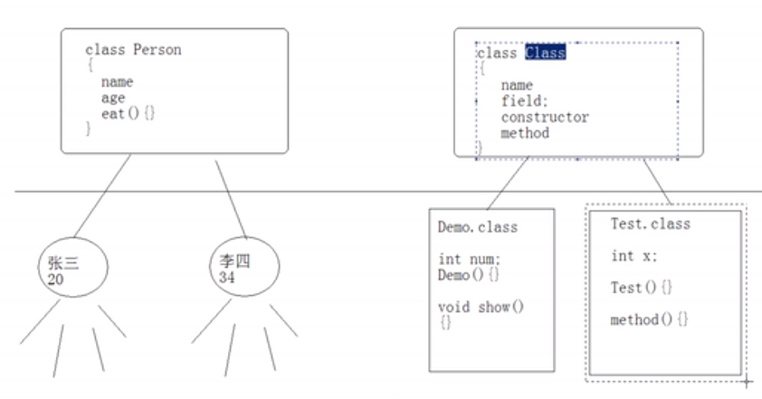
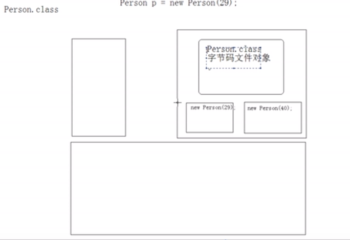
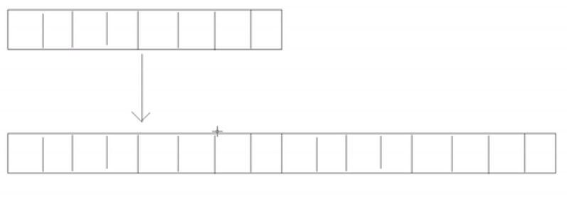
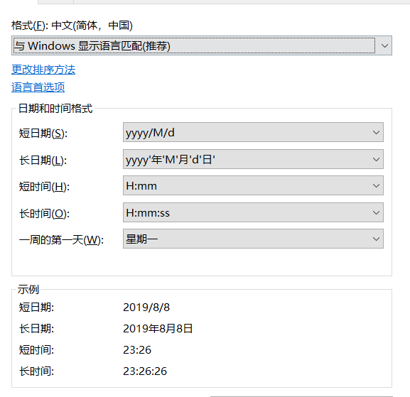

# 第九章 工具类

## 1.Object 类

Object是所有类的根类。

### 1.1 equals方法

[^]: 查看java8 Object api

```java
/**
 * ObjectDemo
 */
public class ObjectDemo {

    public static void main(String[] args) {
        Person p1 = new Person(11);
        Person p2 = new Person(11);
        System.out.println(p1==p2); //这比的啥？地址值
        System.out.println(p1.equals(p2)); //这比的啥？地址值
        Person p3 = p1;
        System.out.println(p3==p1); //说明object的equals方法比较的是==
    }
}


class Person{
    private int age;
    Person(int age){
        this.age =  age;
    }
}
```

结论:子类不覆盖equals方法的话，默认调用Object的equals方法，那么比较的是地址值

> 例子，让equals比较人的年龄
>
> ```java
> public class ObjectDemo {
> 
>     public static void main(String[] args) {
>         Person p1 = new Person(11);
>         Person p2 = new Person(11);
>   
>     }
> }
> 
> class Person{
>  private int age;
>     Person(int age){
>         this.age =  age;
>     }
>     //
>     public boolean equals(Object o){
>         return this.age==(Person)o.age; //编译失败，Object没有age属性
>     }
>    }
> //-----------写成如下
> class Person{
>  private int age;
>     Person(int age){
>         this.age =  age;
>     }
>     public boolean equals(Object o){
>         if(o instanceof Person){
>             Person p1 = (Person)o;
>             return this.age==p1.age;
>         }
>         return false;
>     }
>    }
> 
> // 也可以抛类型转换异常
> 
> class Person{
>  private int age;
>     Person(int age){
>         this.age =  age;
>     }
>     //
>     public boolean equals(Object o){
>         if(o instanceof Person){
>             Person p1 = (Person)o;
>             return this.age==p1.age;
>         }
>         throw new ClassCastException("类型转换异常");
>     }
>    }
> ```

结论：一般都会覆盖此方法，根据对象特有的内容，建立判断对象是否相同的依据。

### 1.2 hashCode 方法

[^]: 查看java8 Object api

```java
/**
 * ObjectDemo
 */
public class ObjectDemo {

    public static void main(String[] args) {
        Person p1 = new Person(11);
        Person p2 = new Person(11);
        System.out.println(p1);
        System.out.println(p1.hashCode()); 
        System.out.println(Integer.toHexString(p1.hashCode()); //打印十六进制hashcode
        
    }
}


class Person{
    private int age;
    Person(int age){
        this.age =  age;
    }
    //
    public boolean equals(Object o){
        if(o instanceof Person){
            Person p1 = (Person)o;
            return this.age==p1.age;
        }
        throw new ClassCastException("类型转换异常");
    }
    
	//比较覆盖前和覆盖后打印值得不同
    // public int hashCode(){
    //     return age;
    // }
}
```

> java8 api中说的很清楚，Ojbect的hashcode方法返回的是内部地址值转换为一个integer
>
> This is typically implemented by converting the internal
>
> ​     \* address of the object into an integer

### 1.3 getClass方法

要理解class对象，就要理解对于java而言，字节码文件也是对象

class类的对象你是不可能new的，因为没有`Class` has no public constructor

只能由jvm虚拟机进行对象创建，具体是经由类加载器调用`defineClass` 方法进行创建。



> 拿到class对象后，当然能获得他的属性和调用它的行为
>
> 他能获得字段信息，方法信息，继承信息，甚至能调用方法，创建对象。

#### class字节码对象也存在堆内存中



```java
//举例说明
Person p1 = new Person(11);
Person p2 = new Person(11);
System.out.println(p1.getClass()==p2.getClass()); //true
```

结论：class类可以干的事很多，用来反射最主要，编写框架是经常性用到，这就是java的动态性。

### 1.4 toString方法

。。。。不说了。随便举例子

## 2. 包概念

1. 对类文件进行分类管理
2. 给类提供多层命名空间（命名空间就是为了避免重复，前缀名用来区分类）。
3. 写在源码的第一行。
4. 类名的全称是包名.类名。
5. 包也是一种封装形式。

> 包的基本作用举例子
>
> 在一个文件夹下，两个java文件，其中每个java文件都有Person类，两个任意编译一个
>
> 就会覆盖另一个的Person.class字节码文件，所以需要有包的概念来解决这事。	

##### 包名书写规范：必须小写

```java
package mypack;

public class PackageDemo{
    
}
```


自动创建包的编译模式命令

```bash
javac -d . PackageDemo.java
javac -d ./output  -encoding utf-8 .\DemoB.java
```

以上命令自动在文件系统中创建文件夹

一下命令运行文件

```bash
java mypack.PakageDemo
```


### 2.1 包与包之间访问

> 注： 编译器理论上在编译时，可以自动寻找依赖的java源文件，而不需要一个个的手动编译，但是前提是这些文件的位置要符合包的声明位置，否则只能将源文件先进行编译

结论：包与包之间进行类的访问，被访问的包中的类要是public，这个类中被访问的方法也必须是public

​	

##### import用来简化全限定名的编写

通配符*的使用：

最关键的是*能配这个包里的类，不能导入包里的包，说白了只找本层目录

```java
import abc.*;
import abc.cde.*;
```

### 2.2 jar

java的压缩包：将多个文件合并成一个文件

打可执行jar包

```
jar -cef test.CardLayoutDemo CardLayoutDemo.jar test

以上命令及参数的含义如下：

jar命令为java自带的专用打包工具；

c代表生成新的jar包；

e代表可执行的类，亦即main方法所在的类。书写时要加上包名，在本例中是后面的test.CardLayoutDemo；

f代表生成的jar包的名称，在本例中是CardLayoutDemo.jar。此包名可以随意命名，没有规定；

test最后面的这个参数表示将test目录下的所有文件都打包放到新的jar包中。

```

## 3. String字符串

字符串是一个特殊的对象

字符串一旦初始化就不可以改变。

### 3.1 字面量方式创建字符串

字符串之所以一旦创建就不能改变，指的它的值，这个值存放在字符串常量池，而左边是他的引用

```java
String s = "abc";
s = "nba"; //abc 和nba是两个不同的字符串常量，都存在常量池里，而s是他们的引用地址值，当然可以改变
String s2 = "nba";
s==s2 //true,因为他们都指向了nba在常量池中的地址值，常量池没有值就会创建。
    
```

字符串常量池的特点：

池中没有就建立，池中有直接用。

### 3.2 new创建字符串

[^]: 看java.lang.String api

```java
//有什么区别。
String str= "abc";
String str1 = new String("abc");
```

简单说明：

第一句话通过字面量的方式在常量池中创建了一个字符串常量

第二句话通过new的方式在堆内存中创建了一个字符串对象

所以二者的引用地址不相同

```java
//输出结果为什么？为什么？
String str= "abc";
String str1 = new String("abc");
sop(str==str1); // false 
```

输出结果为false，因为str指向的是常量池中的地址，而str1指向的是堆内存中的地址

```java
//输出结果为什么？为什么？
String str= "abc";
String str1 = new String("abc");
sop(str.hashCode()==str1.hashCode()); // true 
```

原因是String类覆写hashCode方法，返回的是根据字符串内容计算出的结果，见文档

```java
//一下输出什么结果？为什么？
String a = "123";  
String b = "456";
String c = a+b;
System.out.println(c=="123456");//false
```

因为a和b都是字符串的引用变量，既然是变量就没法在编译器知道结果，所以c就没法算出来，而123456是一个字符串常量存放在常量池中，因此c的值只能在运行时进行计算获得，肯定不存在常量池中。

[^]: 通过javap命令反解析后，发现a和b的值都在常量池中，123456也在常量池中，因为最后打印的语句用到了它，而c在code区只是new了一个Stringbuilder对象

```java
//一下输出什么结果？为什么？
String c = "123"+"456";
System.out.println(c=="123456");//true
```

原因:由于这里123和456都是常量，因此编译器就可以在编译器进行计算，然后将运算结果存入常量池中，而后一个比较用的123456因为已经在常量池中存放了，所以显然二者的地址值相等。

并且，由于123,456在此方法中只参与了c的运算，而c的运算结果已经在编译时得到了，所以没必要将其放在class字节码文件中了， 因为没运行结果已经有了

[^]: 通过javap命令反解析后，123456也在常量池中，在code区中c是一个String类型，值已经是123456，说明运算在编译期已经结束了。

```java
//一下输出什么结果？为什么？
final String a = "123";  
final String b = "456";
String c = a+b;
System.out.println(c=="123456");//true
```

原因：加了final后a和b的值已经定死了，所以编译器仍然可以在编译期进行运算得出c的值，并将c的值存入常量池，并且，由于a和b唯一参与的运算就是计算得出c在这个方法中，因此编译器根本没有必要将a和b放入常量池中，因为jvm根本就不需要进行计算了。

[^]: 通过javap命令反解析发现code区中根本没有a和b的变量，常量池中也没有123和456的常量，当在上面的语句中加入sop（a）时，你就会发现a的值在常量池中出现了，而且a的变量也在code区中出现了，因为a要在println方法栈中参与运算

> 参考
>
> https://blog.csdn.net/weixin_43194122/article/details/88894818
>
> 通过 javap -v 解析字节码文件看一下常量池里到底有几个字符串

### 3.3 构造函数

```java
String s = new String();//构造空字符串"" 没用这个构造器
String s = new String("aaa");//这个构造器没用
//byte数组转换成字符串
byte[] arr= {97,98,99,100};
String a = new String(arr);//将byte数组默认按照ASC码进行查表转换成字符串
System.out.println(a);

//char数组转换成字符串
char[] arr= {'a','b','c','d','e'};
String s = new String(arr);
System.out.println(s);//abcde
String s2 = new String(arr,1,3);
System.out.println(s2);//bcd 从第一位开始取3位

//char数组带中文情况
char[] arr= {'a','b','c','d','e','我'};
String s = new String(arr);
System.out.println(s);//abcde我
String.valueOf(arr) //abcde我 //两种方式都可以 	
```

### 3.4 常用api

length（）:获取字符串长度

charAt（）：获取某一位置的字

indexOf（）：获取某一字符所在第一个位置

lastIndexOf（）：获取某一字符最后出现的位置

```java
String  s ="abcde";
System.out.println("length:"+s.length());//5
System.out.println("char:"+s.charAt(2));//c
System.out.println("index:"+s.indexOf('a'));//0 char向上转型为int
System.out.println("lastIndex:"+s.lastIndexOf('a'));// 0 
System.out.println("index:"+s.indexOf('k'));//-1 没有就返回-1
System.out.println("char:"+s.charAt(20));//异常StringIndexOutOfBoundsException，字符串角标越界
```

subString（）：截取字符串指定位置，获得一个新的字符串

```java
String  s ="abcde";

String s1 = s.substring(2);//从第二位开始一直截取到底
String s2 = s.substring(2,4);// 从第二位开始一直截取到4，但是不包括4
System.out.println(s1); //cde
System.out.println(s2);//cd
System.out.println(s.substring(1,10));//异常StringIndexOutOfBoundsException
```

#### 3.4.1 字符串转换

##### 字符串转换成字符串数组

```java
String  s ="张三,李四,王五";
String[] arr = s.split(",");

String  s ="张三.李四.王五";
String[] arr = s.split("."); //得到不到值，因为传的是个正则字面量，.号有特殊含义

String  s ="张三.李四.王五";
String[] arr = s.split("\\.");//进行转义后就可以
```


##### 字符串转成字符数组

```java
String  s ="张三.李四.王五";
char[] arr = s.toCharArray();
```


##### 字符串转换成字节数组

```java
String  s ="abcd我";
byte[] arr= s.getBytes();
for(byte c:arr){
    System.out.println(c);//97 98 99 100 -26 -120 -111
}
//JAVA默认使用UTF-8对字符进行编码，所以在UTF-8中我占用三个字节

//通过指定编码进行转换
byte[] arr= s.getBytes(Charset.forName("GBK"));
```


##### 字符串转换大小写

```java
s.toUpperCase();
s.toLowerCase();
```


##### 字符串指定内容替换

```java
String  s ="aaaabbbbbaaaaabbbbb";
System.out.println(s.replace('b', 'd'));//aaaadddddaaaaaddddd
//字符替换
System.out.println(s.replace("b", "d"));//aaaadddddaaaaaddddd
// CharSequence替换，由于String是其子类，所以多态
System.out.println(s.replaceAll("b", "d"));//aaaadddddaaaaaddddd
// 正则表达式替换，
System.out.println(s.replaceFirst("b", "d"));//aaaadbbbbaaaaabbbbb
//只替换第一个
```


##### trim()

```java
String a = "   ab   c     ";
System.out.println(a.trim());
System.out.println(a);
System.out.println(a.trim().replace(" ", ""));
```


##### 字符串连接

```java
String a = "abc";
        
System.out.println(a+"def");
System.out.println(a.concat("def"));
```


##### valueOf() 静态方法

```java
System.out.println(String.valueOf("4")+1);
```

#### 3.4.2 字符串判断

##### equals

```java
String a = "a";
String b = ""a;
a.equals(b);

String a = null;
if("".equals(a) && a!=null) //注意null不要放前面，防止空指针
```

##### equalsIgnoreCase

忽略大小写比较

##### 字符串当中是否包含字符串

```java
String a= "abcd";
a.contains("bc")//true 可以用a.indexOf("bc")
```

##### 字符串是否以字符串开头或结尾

```java
String a = "ArrayDemo.java";
a.startWith("Array");
a.endWith(".java");
a.contains("Demo");
```

#### 3.4.3 比较

##### compareTo

为什么有compareTo，因为String实现了Comparable接口。那么String[]数组在Array.sort中就按此排序

按照Unicode码比较大小，0相等，负数代表小于，正数代表大于

```java
System.out.println("a".compareTo("b"));//-1
System.out.println("a".compareTo("A"));//32
System.out.println("aB".compareTo("aC"));//-1
//比较规则为先比首字符在unicode表中的位置，如果相等再比较第二位，直到比出大小，否则相等
```

> 总结：基础数据类型用> <比较，而对象要比较只能用方法，例如compareTo

#### 3.4.6 intern方法

将字符串变量在运行时加入字符串常量池中，如果字符串常量池已有该值，就不会重复存，并且会将值的地址返回给引用变量

```java
String a = new String("abc");
String b = a+"def";
System.out.println(b=="abcdef");
b = b.intern(); //在编译期的时候，已经有常量abcdef了因为上面的语句中出现了字面量，
System.out.println(b=="abcdef");

```

### 3.5 课堂练习

```java
/*给定一个字符串数组，按照字典顺序进行从小到大排序
{"nba","abc","cba","zz","qq","haha"}
*/
```

```java
/*
 一个字符串在另一个字符串中出现了多少次
*/
String a = "nbadklsfnbaklsdfnbafdklsnbadksld";
String key = "nba";
int count = 0;
int index = 0;
while((index = a.indexOf(key))!=-1){
    count++;
    a = a.subString(index+key.length());
}
sop(count);
// 这种做法会导致内存中出现了很多字符串
//----------------------------
//第二种
String a = "nbadklsfnbaklsdfnbafdklsnbadksld";
String key = "nba";
int count = 0;
int index = 0;
while((index = a.indexOf(key,index))!=-1){
    count++;
   	index = index+key.length();
}
sop(count);
```

```java
/*
找出两个字符串中的最大相同子串
思路：拿短字符串和长的做比较，然后截取段字符串长度-1进行比较，依次类推
*/

String a = "fdkjslf;dsjfkldsffdsfdsf";
String b = "jfkldsffds";

for (int x = b.length();x>0;x--){
    for(int y = 0;y<b.length()-x+1;y++){
        String temp =  b.substring(y,y+x);
        if(a.contains(temp)){
            System.out.println(temp);
            return ;
        }

    }
}
```

```java
/*
模拟trim方法
*/
//思路类似快速，一个游标从前往后，一个从后往前，找到不为空字符串为止，如果超出字符串长度，就返回“”
public static String myTrim(String s ){
    int start = 0;
    int end =s.length()-1;
    while(start<=end && s.charAt(start)!=' '){
        start++;
    }
    while(start<=end && s.charAt(end)!=' '){
        end--;
    }
    return s.subString(start,end+1);
    
    
}
```

## 4 StringBuffer、StringBuilder

### 4.1 StringBuffer

就是一个字符串的缓冲区容器，内部实际上是对数组的封装

特点：

1. 长度是可变的
2. 可以存储不同类型的数据
3. 最终要转成字符串进行使用
4. 可以对字符串进行修改

#### 4.1.2 append添加

```java
StringBuffer sb = new StringBuffer();
StringBuffer s1 = sb.append(4); //声明引用没必要，因为回来的还是这个容器
sop(sb);//4
sop(s1);//4
sop(sb==s1);//true

sb.append(true);
sop(sb); //4true
sb.append(false).append(1); //链式调用
```

#### 4.1.3 insert插入

```java
StringBuffer s1 = sb.append(4).append(false);//在4和false间插入haha
s1.insert(1,"haha")
```

#### 4.1.4 delete和deleteCharAt

包含头不包含尾

```java
StringBuffer sb = new StringBuffer("abcde");
sb.delete(1,3);//ade
//清空缓冲器
sb.delete(0,sb.length());
```

#### 4.1.5 查找charAt indexOf lastIndexOf

同字符串，不讲了

#### 4.1.6 replace ,setCharAt(返回类型是void)

```java
StringBuffer sb = new StringBuffer("abcde");
sb.replace(1,3,"nba");
sop(sb); //anbade


sb.setCharAt(2,'q'); //abqde
```

#### 4.1.7 setLength()和 reverse（）

```java
StringBuffer  sb = new StringBuffer("abcde");
sb.setLength(0);
System.out.println(sb); //空字符
sb.setLength(10) //abcde----- //-代表空字符串
    
    
StringBuffer  sb = new StringBuffer("abcde");
sop(sb.reverse())//edcba
```

#### 4.1.8 Stringbuffer的可变长度

为什么能可变？stringbuffer内部还是用数组作为容器

原因是进行了数组的重新创建，将原数据复制进新数组中



```java
StringBuffer(int capacity) //这个构造函数推荐使用，在字符串长度能够预估的情况下，他可以一次性进行创建，避免扩张，这样会造成重新new数组和进行数据copy运算，效率更高
```

### 4.2 StringBuilder

[^]: 查看java Api

和StringBuffer功能一致

区别：StringBuffer线程安全，StringBuilder非线程安全，由于不同步，速度效率更快

原因：见源码

```java
//StringBuffer append方法源码
@Override
    public synchronized StringBuffer append(String str) {
        toStringCache = null;
        super.append(str);
        return this;
}

//StringBuilder源码
@Override
public StringBuilder append(String str) {
    super.append(str);
    return this;
}
```

出现线程安全问题的情况：成员变量

``` java
class Demo{
    private StringBuilder sb = new StringBuilder();
    public void method(){
        sb.append("haha")//线程安全问题，因为有可能多个线程访问合格sb
    }
}
```

### 4.3 课堂练习

1.StringBuffer与String的区别

```java
//将一个int数组转换成字符串
main(){
    int[] arr = {1,2,3,4,6};
    arr2Str(arr);
    arr2Str2(arr); //这种方式好，因为第一种方式会在内存中产生很多字符串常量
    
}
arr2Str(int[] arr){
    String str = "[";
    for (int i = 0;i<arr.length;i++){
    	if(i!=arr.length-1)
            str = str+arr[i]+",";
        else
            str = str+arr[i]+"]";
    }
    return str;
}

arr2Str2(int[] arr){
    StringBuilder sb = new StringBuilder("[");
    for (int i = 0;i<arr.length;i++){
    	if(i!=arr.length-1)
            sb.append(arr[i]+",");
        else
            sb.append(arr[i]+"]");
    }
    return sb.toString();
}

```

## 5.基础数据类型包装类

### 5.1 包装类型的好处

- 将基本数据类型封装成对象的好处在于可以在对象中定义更多的功能方法操作该数据。
- 常用的操作之一：用于基本数据类型与字符串之间的转换
- 例如：Integer的parseInt方法，intValue方法

### 5.2 定义

用于描述该基础类型的类称为基本数据类型对象包装类，一共八个。

| byte | short | int     | long | float | double | char      | boolean |
| ---- | ----- | ------- | ---- | ----- | ------ | --------- | ------- |
| Byte | Short | Integer | Long | Float | Double | Character | Boolean |

```java
sop(Integer.MAX_VALUE);//int 最大值
sop(Integer.toBinaryString(-6))//获取二进制字符串
```

### 5.3 Intger

```java
int num = 4;
Integer i = new Intger(4);//这个没多大意义
```

#### 5.3.1 Integer 与String类型进行转换

> 这个极为常用

```java
Integer.parseInt("123");//123
Integer.parseInt("123"+1);//1231
Integer.parseInt(Integer.parseInt("123")+1);//124
Integer.parseInt(Integer.parseInt("123abc")+1);//NumberFormatException


```

总结：该包装类型主要用于整数和字符串之间的转换

> 基本类型转换为字符串
>
> 1+“”；
>
> String.valueOf(1)
>
> Integer.valueOf();

> 字符串转换为基本类型
>
> 使用包装类中的静态方法：parseXXX（）
>
> int parseInt（）
>
> long parseLong（）
>
> boolean parseBoolean（）
>
> ```java
> if(Boolean.parseBoolean("true")){
>     
> }
> ```
>
> 只有Character没有parseXXX方法：因为没必要，他封装的就是字符

#### 5.3.1 intValue

将一个Integer对象转换成基本数据类型int

```java
Integer i = new Integer("123");//基本用不着了

```

#### 5.3.2 整数的进制转换

```java
int i = 60;
Integer.toBinaryString(i);//二进制
Integer.toOctalString(i);//八进制
Integer.toHexString(i);// 十六进制
Integer.toString(i,2);//二进制
Integer.toString(i,4);//四进制

//-------------------------
//其他进制转换为十进制
Integer.parseInt("110",10)//将110看做十进制
Integer.parseInt("110",2)//将110看做二进制
Integer.parseInt("3c",16)//将3c看做16进制
```

### 5.4 自动拆装箱

```java
Integer a = new Integer("3");
Integer b = new Integer(3);
System.out.println(a == b); //false 对象地址不同
System.out.println(a.equals(b));//true 
System.out.println(a.compareTo(b));//0 相等
```

上面的代码让人不爽：因为a.compareTo(b) 没有a>b来的爽

```java
Integer i = 4; //自动装箱 相当于new Integer(4) 简化书写
i = i+6;//相当于i= new Integer(i.intValue() + 6) 自动拆箱
sop(i>6) //自动拆箱 相当于 i.intValue()>6
```

面试题

```java
Integer a = new Integer(127);
Integer b = new Integer(127);
System.out.println(a==b); //false //原因是因为比较的是地址
System.out.println(a>=b); // true
System.out.println(a.equals(b));//true

Integer x = 127;
Integer y = 127;
System.out.println(x==y);//true 原因是因为通过自动装箱的-128~127的数已经在缓冲区当中共享了
System.out.println(x>=y);// true
System.out.println(x.equals(y));//true


Integer i = 129;
Integer j = 129;
System.out.println(i==j);//false 原因是超过了-128~127，缓冲区没有只能创建新的对象
System.out.println(i>=j);//true
System.out.println(i.equals(j));//true
```

### 5.5 课堂练习

对一个字符串中的数值进行从大到小的排序:	 "20  78 9 -7 88 36 29"

```java
/*
思路：
1.获取字符串中的这些int，通过String split方法
2.数值最终变成小字符串，将String通过parseInt方法转换成int
3.排序
*/
public static void main(String[] args) {
    String origin = "20 78 9 -7 88 36 29";
    int[] arr = sortStringArray(origin);

    for(int a:arr){
        System.out.println(a);
    }
}

public static int[] sortStringArray(String target){
    // 1. 拆成String数组
    String arr[] = target.split(" ");
    // 2. 转换成int数组
    int result[] = new int[arr.length];
    for(int i=0;i<arr.length;i++){
        result[i]= Integer.parseInt(arr[i]);
    }
    // 3. 排序
    Arrays.sort(result);
    return result;
}
```

## 6 Math类

- Math类提供了大量用于数学运算的方法

- Math类是final类，因此不能从Math类继承

- Math类中的方法都是static方法，因此不必创建Math类的对象就可以直接使用该类的方法

### 6.1 round() floor() ceil()

```java
double d1 = Math.ceil(12.56);//返回大于参数的最小整数
double d2 = Math.floor(12.56);//返回小于参数的最大整数
double d3 = Math.round(12.56);//返回四舍五入
```

### 6.2 max() min()

返回大的值，返回小的值

### 6.3 pow(a,b)

a的b次幂

```java
double a = Math.pow(10,2);//100.0
```

### 6.4 random()取随机数

random方法产生0-1之间的随机数，

```java
for(){
    sop(Math.random());
}

//-------
//打印1-10的整数
for(){
   //double d = Math.ceil(Math.random()*10);
   double d = (int)(Math.random()*10+1);
   sop(d);
}

```

> 前面讲过Random对象

## 7. Date类

> 实际开发经常用

> 注意带学生看api
>
> - A month is represented by an integer from **0 to 11**; 0 is January, 1 is February, and so forth; thus 11 is December.
>
> 在java中月是0-11

```java
public static void main(String[] args) {
    Long time = System.currentTimeMillis();
    System.out.println(time);//1565274871213

    Date date = new Date();//将当前时间封装成Date对象
    System.out.println(date);
    Date date2 = new Date(1565274871213L);//将制定时间戳封装成date对象
    System.out.println(date2);

}
```

### 7.1 毫秒值与Date转换

#### 7.1.1 毫秒值转Date

1. 通过Date对象的构造方法：new Date(Long timeMillis);
2. 还可以通过Date对象setTime()方法

>为什么要转？
>
>可以通过Date对象的方法对该日期中的各个字段（年月日等）进行操作

#### 7.1.2 Date转毫秒

1. Date对象getTime()方法

> 为什么要转？
>
> 因为可以根据获得的数值进行运算 。

### 7.2 after before compareTo

比较日期是否在其之前或之后

```java
Date date = new Date();
Date date2 = new Date(1565274871213L);
date.after(date2);//true
date.before(date2);//false
date.compareTo(date2);//0 1 -1
```

### 7.3 日期字符串转换

#### 7.3.1 日期转字符串

> 参考Date Api介绍
>
>  the `Calendar` class should be used to convert between dates and time fields and the `DateFormat`class should be used to format and parse date strings

##### DateFormat类

```java
public static void main(String[] args) {

        Date date = new Date();
        //获取日期格式方法 具备着默认风格
        DateFormat format = DateFormat.getDateInstance();
        String str =format.format(date);
        System.out.println(str);//2019-8-8

        format = DateFormat.getDateTimeInstance();
        str= format.format(date);
        System.out.println(str);//2019-8-8 23:10:54

        format = DateFormat.getDateInstance(DateFormat.FULL);
        str= format.format(date);
        System.out.println(str);//2019年8月8日 星期四

        format = DateFormat.getDateInstance(DateFormat.SHORT);
        str= format.format(date);
        System.out.println(str);//19-8-8

        format = DateFormat.getDateInstance(DateFormat.LONG);
        str= format.format(date);
        System.out.println(str);//2019年8月8日

        format = DateFormat.getDateInstance(DateFormat.MEDIUM);
        str= format.format(date);
        System.out.println(str);//2019-8-8

        format = DateFormat.getDateTimeInstance(DateFormat.FULL,DateFormat.FULL);
        str= format.format(date);
        System.out.println(str);//2019年8月8日 星期四 下午11时14分15秒 CST
		
    	System.out.println(format);//java.text.SimpleDateFormat@535c7d7d
    }
```

##### SimpleDateFormat

pattern格式表：

| Letter | Date or Time Component                           | Presentation                                                 | Examples                                    |
| ------ | ------------------------------------------------ | ------------------------------------------------------------ | ------------------------------------------- |
| `G`    | Era designator                                   | [Text](https://docs.oracle.com/javase/8/docs/api/java/text/SimpleDateFormat.html#text) | `AD`                                        |
| `y`    | Year                                             | [Year](https://docs.oracle.com/javase/8/docs/api/java/text/SimpleDateFormat.html#year) | `1996`; `96`                                |
| `Y`    | Week year                                        | [Year](https://docs.oracle.com/javase/8/docs/api/java/text/SimpleDateFormat.html#year) | `2009`; `09`                                |
| `M`    | Month in year (context sensitive)                | [Month](https://docs.oracle.com/javase/8/docs/api/java/text/SimpleDateFormat.html#month) | `July`; `Jul`; `07`                         |
| `L`    | Month in year (standalone form)                  | [Month](https://docs.oracle.com/javase/8/docs/api/java/text/SimpleDateFormat.html#month) | `July`; `Jul`; `07`                         |
| `w`    | Week in year                                     | [Number](https://docs.oracle.com/javase/8/docs/api/java/text/SimpleDateFormat.html#number) | `27`                                        |
| `W`    | Week in month                                    | [Number](https://docs.oracle.com/javase/8/docs/api/java/text/SimpleDateFormat.html#number) | `2`                                         |
| `D`    | Day in year                                      | [Number](https://docs.oracle.com/javase/8/docs/api/java/text/SimpleDateFormat.html#number) | `189`                                       |
| `d`    | Day in month                                     | [Number](https://docs.oracle.com/javase/8/docs/api/java/text/SimpleDateFormat.html#number) | `10`                                        |
| `F`    | Day of week in month                             | [Number](https://docs.oracle.com/javase/8/docs/api/java/text/SimpleDateFormat.html#number) | `2`                                         |
| `E`    | Day name in week                                 | [Text](https://docs.oracle.com/javase/8/docs/api/java/text/SimpleDateFormat.html#text) | `Tuesday`; `Tue`                            |
| `u`    | Day number of week (1 = Monday, ..., 7 = Sunday) | [Number](https://docs.oracle.com/javase/8/docs/api/java/text/SimpleDateFormat.html#number) | `1`                                         |
| `a`    | Am/pm marker                                     | [Text](https://docs.oracle.com/javase/8/docs/api/java/text/SimpleDateFormat.html#text) | `PM`                                        |
| `H`    | Hour in day (0-23)                               | [Number](https://docs.oracle.com/javase/8/docs/api/java/text/SimpleDateFormat.html#number) | `0`                                         |
| `k`    | Hour in day (1-24)                               | [Number](https://docs.oracle.com/javase/8/docs/api/java/text/SimpleDateFormat.html#number) | `24`                                        |
| `K`    | Hour in am/pm (0-11)                             | [Number](https://docs.oracle.com/javase/8/docs/api/java/text/SimpleDateFormat.html#number) | `0`                                         |
| `h`    | Hour in am/pm (1-12)                             | [Number](https://docs.oracle.com/javase/8/docs/api/java/text/SimpleDateFormat.html#number) | `12`                                        |
| `m`    | Minute in hour                                   | [Number](https://docs.oracle.com/javase/8/docs/api/java/text/SimpleDateFormat.html#number) | `30`                                        |
| `s`    | Second in minute                                 | [Number](https://docs.oracle.com/javase/8/docs/api/java/text/SimpleDateFormat.html#number) | `55`                                        |
| `S`    | Millisecond                                      | [Number](https://docs.oracle.com/javase/8/docs/api/java/text/SimpleDateFormat.html#number) | `978`                                       |
| `z`    | Time zone                                        | [General time zone](https://docs.oracle.com/javase/8/docs/api/java/text/SimpleDateFormat.html#timezone) | `Pacific Standard Time`; `PST`; `GMT-08:00` |
| `Z`    | Time zone                                        | [RFC 822 time zone](https://docs.oracle.com/javase/8/docs/api/java/text/SimpleDateFormat.html#rfc822timezone) | `-0800`                                     |
| `X`    | Time zone                                        | [ISO 8601 time zone](https://docs.oracle.com/javase/8/docs/api/java/text/SimpleDateFormat.html#iso8601timezone) | `-08`; `-0800`; `-08:00`                    |

```java
SimpleDateFormat sdf = new SimpleDateFormat("yyyy-MM-dd HH:mm:ss");
System.out.println(sdf.format(new Date));
```

#### 7.3.2 字符串转日期

```java
String str= "2018年4月19日";
DateFormat df = DateFormat.getDateInstance(DateFormat.LONG);
Date date = dateFormat.parse(str);
System.out.println(date);

str = "2018-04-19";
SimpleDateFormat sdf = new SimpleDateFormat("yyyy-MM-dd");
date = sdf.parse(str);
```

其实所谓的SHORT ,LONG都是根据jvm在系统获取的



### 7.4 课堂练习

```java
/*
“2018-3-17”到“2019-4-6”中间有多少天
*/
/*
思路：
1.将字符串转换成Date
2.然后获取这两个date的毫秒值
3.进行相减
4.计算出值代表少天
*/
public class DateDemo {

    public static void main(String[] args) throws ParseException {
        int count = dayCount("2018-04-07", "2019-03-11");
        System.out.println(count);
    }

    public static int dayCount(String str1, String str2) throws ParseException {
        SimpleDateFormat sdf = new SimpleDateFormat("yyyy-mm-dd");
        Date date1 = sdf.parse(str1);
        Date date2 = sdf.parse(str2);

        long time1 = date1.getTime();
        long time2 = date2.getTime();

        long interval = Math.abs(time1 - time2);

        return getDay(interval);
    }

    public static int getDay(long time) {
        return (int) (time / 1000 / 60 / 60 / 24);
    }
}


```

## 8. Calender日历类

> 和dateFormat一样，不能直接创建对象，因为abstract

```java
Calendar c = Calendar.getInstance();
System.out.println(c);
/*java.util.GregorianCalendar[time=1565279001996,areFieldsSet=true,areAllFieldsSet=true,lenient=true,zone=sun.util.calendar.ZoneInfo[id="Asia/Shanghai",offset=28800000,dstSavings=0,useDaylight=false,transitions=19,lastRule=null],firstDayOfWeek=1,minimalDaysInFirstWeek=1,ERA=1,YEAR=2019,MONTH=7,WEEK_OF_YEAR=32,WEEK_OF_MONTH=2,DAY_OF_MONTH=8,DAY_OF_YEAR=220,DAY_OF_WEEK=5,DAY_OF_WEEK_IN_MONTH=2,AM_PM=1,HOUR=11,HOUR_OF_DAY=23,MINUTE=43,SECOND=21,MILLISECOND=996,ZONE_OFFSET=28800000,DST_OFFSET=0]*/
```

```java
System.out.println(c.get(Calendar.YEAR));
System.out.println(c.get(Calendar.MONTH)+1);//
System.out.println(c.get(Calendar.DAY_OF_MONTH));//
System.out.println(c.get(Calendar.DAY_OF_WEEK));//

```

#### 8.1 calender 设置时间方法

```java
Calendar c = Calendar.getInstance();
c.set(2011,3,20); //2011-4-20
c.add(Calendar.YEAR,2);//2013-4-20

c.set(2011,11,20); //2011-12-20
c.add(Calendar.MONTH,2);//2012-2-20

c.set(2011,11,20); //2011-12-20
c.add(Calendar.DAY_OF_MONTH,12);//2012-1-1
```

#### 8.2课堂练习

```java
//输入年份，告诉我二月有多少天	
//思路二月的最后一天的下一天
int showFebruaryDays(int year){
    Calendar c = Calendar.getInstance();
    c.set(year,2,1);
    c.add(Calendar.DAY_OF_MONTH,-1);
    return c.get(Calendar.DAY_OF_MONTH);
}

//请打印出昨天现在的时刻

```

## 9 Date-Time API

JDK 1.8中的新日期和时间API解决了旧API中的许多问题

> 参考：https://www.jianshu.com/p/c7b89104534e
>
> https://blog.csdn.net/chenhao_c_h/article/details/81110605

### 9.1 Instant类

Instant 表示一个时间点，从1970-01-01开始后过了多少时间

```java
Instant now = Instant.now();// 返回当前时间对象
System.out.println(now.getEpochSecond()); //返回自纪元以来经过的秒数
System.out.println(now.getNano()); //返回自上一秒开始以来的纳秒数

//--------------------------------------------
//计算两个时间点之间的间隔
Instant start = Instant.now();
Thread.sleep(5000);

Instant end = Instant.now();

//Duration提供了纳秒精度的时间量 toMillis转换成毫秒
System.out.println(Duration.between(start, end).toMillis());

//----------------------------------------------
//传入字符串，转换为instant对象
String text = "2010-10-31T07:57:00.821Z";
Instant instant = Instant.parse(text);
System.out.println(instant);

//----------------------------------------------
// 3、比较时间（大于小于排序）
System.out.println(instant.isAfter(Instant.parse("2010-11-30T07:57:00.821Z")));
// false 返回布尔值
System.out.println(instant.isBefore(Instant.parse("2010-11-30T07:57:00.821Z")));
// true 返回布尔值
System.out.println(instant.compareTo(Instant.parse("2010-11-30T07:57:00.821Z")));
// -1  compareTo 返回值int类型  等于返回 0 小于返回 -1 大于返回 1
System.out.println(instant.equals(Instant.parse("2010-10-31T07:57:00.821Z")));
// true  返回布尔值 比较两个时间是否相等

//----------------------------------------------
// 时间偏移
Instant instant = Instant.now();
OffsetDateTime offsetDateTime = instant.atOffset(ZoneOffset.ofHours(8));
System.out.println(offsetDateTime); // 2019-08-09T00:22:17.572+08:00 
// 返回值类型OffsetDateTime  我们在东八区，所以加上八小时，就是本地时间戳
```

### 9.2 LocalDate类

`LocalDate`类只包括日期没有时间的部分。 它也没有时区(默认是系统所属时区)。 下表显示了`LocalDate`中一些重要的方法。

```java
LocalDate localDate = LocalDate.now();
System.out.println(localDate); // 2018-07-23

//===============================================================================
// 2、构造LocalDate
//===============================================================================
CharSequence text = "2010-10-10";
System.out.println(LocalDate.parse(text)); // 2010-10-10
CharSequence date = "20101010";
System.out.println(LocalDate.parse(date,DateTimeFormatter.BASIC_ISO_DATE));// 2010-10-10
// 自定义对应格式的转换，JDK1.8给出了预定义的格式化 DateTimeFormatter.BASIC_ISO_DATE 就是其中之一
CharSequence myDate = "2010年10月10日";
System.out.println(LocalDate.parse(myDate,DateTimeFormatter.ofPattern("yyyy年MM月dd日"))); // 2010-10-10
// 预定义格式没有的情况，也可以自定义
System.out.println(LocalDate.of(2010, 10, 10));// 2010-10-10
// 给出int类型对应的 年月日，亦可构造出LocalDate对象
System.out.println(LocalDate.of(2010, Month.JULY, 10));// 2010-07-10
// 月份亦可给出对应 Mouth 枚举
System.out.println(LocalDate.ofEpochDay(123)); // 1970-05-04
// 给出日子，计算出 从 1970-01-01 对应日子后的日期
System.out.println(LocalDate.ofYearDay(2010, 163)); //2010-06-12
// 传入 年，日数，计算出 对应该年份 对应日子后的日期
LocalDateTime localDateTime = LocalDateTime.now();
System.out.println(localDateTime); // 2019-08-09T00:31:58.865
localDateTime = LocalDateTime.parse("2018年08月01日22时22分22秒", DateTimeFormatter.ofPattern("yyyy年MM月dd日HH时mm分ss秒"));
System.out.println(localDateTime); // 2018-08-01T22:22:22

//===============================================================================
// 3、获取，年，月，日，时等等
//===============================================================================
int dayOfMonth = localDateTime.getDayOfMonth();
DayOfWeek dayOfWeek = localDateTime.getDayOfWeek();
int dayOfYear = localDateTime.getDayOfYear();
int hour = localDateTime.getHour();
Month month = localDateTime.getMonth();
int year = localDateTime.getYear();
System.out.println(year + "年" + month.toString() + "月" + dayOfMonth + "日" +
                   hour + "时" + "|||" + dayOfWeek + "|||" + dayOfYear);
// 2018年JULY月31日9时|||TUESDAY|||212

```

