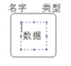
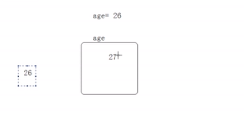
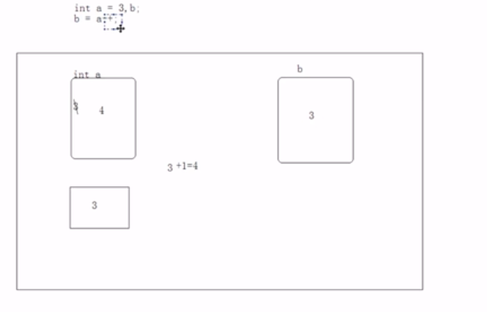
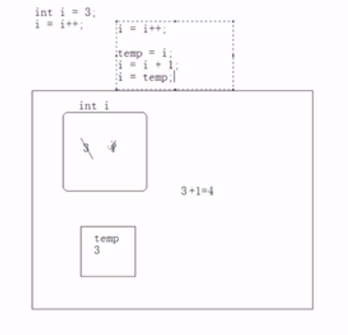

#	第二章 变量与运算符

## 1.常量

- 常量是指内存中存储的固定值

### 1.1常量种类

1. 整型常量，如：123，067，0X1D，123L
2. 浮点数常量，如：123.4，.18，1.8e1，1.2D，1.2F
3. 布尔型常量，如：true，false
4. 字符常量，如：’a’，’8’，‘\n’，‘\u123f’
5. 字符串常量，如：“a”，“hello”
6. 引用类型常量，：null

### 1.2数字常量下划线

```java
public class ConstDemo1{
	public static void main(String[] args){
        // 整形数字 10^9
        System.out.println(1_000_000_000);
        // 整形数字，
        System.out.println(1234_4567_8901_2345L);
        // 整形
        System.out.println(777_99_8888L);
        // 浮点型
        System.out.println(3.1415_9265);
        //浮点型
        System.out.println(3.14_15_92_65f);
    }	
}
```


## 2.变量

- 变量实际上是定义了内存中的一片存储区域，因为值不能确定，只能划分一片区域记录这个变量(数学中的x+3=6)
- 该区域由自己的名称（变量名）和类型（数据类型）



- 为什么定义变量？ 用来不断的存放同一类型的常量，可以重复使用

  

  >注：在这里向学生表述清楚使用变量的意义：就是不在直接操作常量，而是只管操作变量，而变量里存的数据都是常量

  

### 2.3.整数类型

#### 2.3.1  整数类型： byte short  int  long 

> 注意：类型的主要区别在于取值范围不同：

1. byte取值范围： -128~127        占用：1个字节 8bit
2. short取值范围： -32 768~32 767     占用：2 个字节 16bit
3. int 取值范围： -2147483648, 2147483647       占用：4个字节  32bit
4. long的取值范围：-9223372036854774808~9223372036854774807       占用：8个字节  64bit

> 为什么java要搞四种不同的整数类型？
>
> 因为不同类型占用的内存空间大小不同
>
> 常用的整形是int byte ,byte是因为它是数据所存储的最小单位、


#### 2.3.2  整形的四种表现形式

1. 二进制： 以0b，0B开头

2. 八进制：以0开头

3. 十进制：正常表示

4. 十六进制：以0X，0x表示


#### 2.3.3  进制的转换以及占用内存空间大小

##### 2.3.3.1 进制的由来：

> 以开关信号来说明：八个开关为一组在计算机中代表字节，数据的最小单元
>
> 计算机中的所有数据都有0101组成，八个二进制位为一个单元，叫做字节，每一个二进制位为一个bit位
>
> 1k = 1024 byte；
>
> 1m = 1024 k；
>
> 1g = 1024 m；

##### 2.3.3.2 进制的转换计算

[^注]: windows计算器的进制转换功能可以进行演示

> 1. 3个bit位为一组代表八进制
> 2. 4个为一组代表十六进制

**例子：**
$$
752 = 2*10^0+5*10^1+7*10^2
$$

$$
1011 = 1*2^0+1*2^1+0*2^2+1*2^3
$$

0101011:

1. 十进制:43

   | 0    | 1    | 0    | 1    | 0    | 1    | 1    |
   | ---- | ---- | ---- | ---- | ---- | ---- | ---- |
   | 64   | 32   | 16   | 8    | 4    | 2    | 1    |
   | 0    | 32   | 0    | 8    | 0    | 2    | 1    |

2. 八进制：053

   | 000  | 101  | 011  |
   | ---- | ---- | ---- |
   | 392  | 56   | 7    |
   | 0    | 5    | 3    |
   | 0    | 40   | 3    |

3. 十六进制：0X2B

   | 0010 | 1011 |
   | ---- | ---- |
   | 2    | B    |
   | 32   | 11   |

**结论：八进制数：3个bit位为一个八进制位。**

​			**十六进制：四个bit位为一个十六进制位。**

>注：一个byte表达最大数位255, 
>
>IP地址：
>
>IPV4: 32bit组成  表示方式：四个不超过255的十进制数组成：255.255.255.255
>
>IPV6: 128bit组成： 表示方式：八个四位长度16进制数组成 ：FFFF:FFFF:FFFF:FFFF:FFFF:FFFF:FFFF:FFFF

十进制转换二进制：

6： 6/2 = 3（0） 3/2=1(1)   1    从右往左看    110

负数的二进制在内存中的表现形式

> 注：内存中由四个字节来表示一个整数，也就是四个8bit
>
> 负数的表现形式为正数的二进制取反再+1

| 6                   | -6                  |
| ------------------- | ------------------- |
| 0000-0000-0000-0110 | 1111-1111-1111-1010 |


###### 练习：类型与表现形式的结合,以不同方式表现数字12 ：

> 1. byte：二进制
> 2. short：八进制
> 3. int：十进制
> 4. long：十六进制

```java 
byte a = 0B1100;
short b = 014;
int c =  12;
long d = 0xCL;
System.out.println(a);
System.out.println(b);
System.out.println(c);
System.out.println(d);
```


### 2.4. 浮点类型

#### 2.4.1 浮点类型：float（单精度）  double（双精度）

[^科学计数法的补充]: 科学记数法是一种记数的方法。把一个数表示成a与10的n次幂相乘的形式（1≤a<10，n为整数），这种记数法叫做**科学记数法。** **[2]**  例如：19971400000000=1.99714×10^13

> 单精度和双精度的区别: 
>
> 单精度的精度不如双精度，原因是因为单精度在内存中由4个字节表示，而双精度是八个字节表示，所以八个表示的小数点位置要比单精度多，所以java默认使用double存储浮点类型


### 2.5. 字符类型

>取值范围0-65535 也就是两个字节

[^注]: 字符如何用两字节表示，想学生说明编码表的概念。通过演示‘a’+1=98的代码引入asc编码表的概念。

asc码表：

| a        | b        |
| -------- | -------- |
| 01100001 | 01100010 |

中文编码表：GB2312 ,GBK（国标扩展码）

国际通用编码：Unicode 

> 例子说明

```java
public class CharCode {

    public static void main(String[] args) throws Exception {
        System.out.println((char)('a'+1));
        System.out.println('你'+1);
        System.out.println((char)0x4e2d);
        System.out.println('\u507E'); //unicode码表
        System.out.println((int)'\u507E');

    }    
}
```

丢失精度例子：

```java
public static void main(String[] args) {
        byte b = 4;
        //b = 3+7;
        byte b1 = 3;
        byte b2 = 7;
        b = b1+b2;
        System.out.println(b);
    	
    	//int x = 0;
        //int x1 = Integer.MAX_VALUE;
        //int x2 = 2;
       // x = x1+x2;
       // System.out.println(x);
    }
```

结果：

```
Exception in thread "main" java.lang.Error: Unresolved compilation problem:  

​	Type mismatch: cannot convert from int to byte 

at VarDetail.main(VarDetail.java:10)
```

> 原因：byte最大127，相加可能会超出127，丢失精度，而int不丢的原因是因为int是java表示整形的默认类型，所以自动截取位数，导致变为负数

### 2.6 类型转换

```java
//例子 运算两端的数据类型一致的情况下
int x = 0;
x = x+5;
// result 5
```

```
//不同类型的例子，但是只要是数值型，就会进行隐式类型转换，也叫自动类型提升
int x = 5;
byte b = 5;
x = x+b;
```


上图说明了强制类型转换的原因

强制转换的原理：将超出部分的字节强制删除

```java
byte b = 7;
//b = b+1;
// b= 8
b = (byte)(b+1);
//   00000000-00000000-00000000-00001000 int 
//   00001000 byte


```


## 3. 运算符

赋值运算符：=、+=、﹣=、*=、/=、%=

算术运算符： +、﹣、*、/、%、++、 --

比较运算符：>、<、>=、 <=、= =、!=、instanceof

逻辑运算符：!、&&、||

位运算符： &、|、^ 、 ~、>>、<<、>>>

条件运算符（三元运算符）： ?：

### 3.1 算数运算符

> 例子
>
> ```java
> public class ArthmeticDemo {
> 
>     public static void main(String[] args) {
>         int x = 6379;
>         x  = x/1000*1000;
>         System.out.println(x);
>         //result 6000 先相除，在向乘，由于x位整形，所以6379/1000 = 6而不是6.379
>         //这是java的强类型特性，不是每种语言都这样
>     }
> }
> ```
>
> 原因：由于java的强类型特性：int的长度为四个字节，而double为8个字节，int装不下double啊
>
> 结论：java中的除法运算要着重小心


> %模运算：
>
> **概念：被摸数是左，模数是右边**
>
> ```
> 5%2 = 1;
> 2%5 = 2; //模数小于被模的数，值就等于模数本身，就好比不够模了只能返回自己，没资格模
> 
> //面试题
> -5/2 = ？ //-1
> 5/-2 = ？ // 1
> //结论：负数的模运算，符号只参考被模数
> ```
>
> **模运算的用处：**
>
> **任何数模于2都等于0或者1，所以可以用于开关算法**


> ###### 作为连接符存在的+号：
>
> 任何类型的数据和字符串相加+号的作用都是连接，将字符串拼接为一个更大的字符串
>
> ```java
> System.out.println(3+2) //算数运算符
> System.out.println(3+"2") //连接符
>     
> //问题
> System.out.println("5+5="+5+5);    // "5+5=55" 计算顺序：“5+5=”+5 “5+5=5”+5 
> System.out.println("5+5="+(5+5);  //"5+5=10" 计算顺序 5+5 “5+5”+10
>                    
> //用法：
> int a = 4;int b =5;
> System.out.println("a="+a+",b="+b);
> ```

>**自增运算符: ++ --;**
>
>```java
>int a = 1; 
>a++; 
>a; //2
>a+1// 编译错误
>a = a+1; //实际上是两个运算，先进行运算，再讲运算结果赋给a
>
>```
>
>知识点：a++,加号放后面的情况
>
>```java
>int a = 3;
>int b = a++; //一句话做了三个运算：int b代表声明变量，a++代表a+1，=代表赋值给b；
>b  //3
>a  //4
>```
>
>**内存原理并不是大家想的先将a的值赋给b，而是如下**：
>
>1. a先讲原始值3存入到临时存储器。
>2. a将3放入计算区和1相加；
>3. a将自身存储的3替换为4
>4. b的值实际上取得是临时存储区中的3
>
>
>
>练习：
>
>```java
>int i = 3;
>i = i++;
>System.out.println("i="+i);
>```
>
>原理：
>
>

### 3.2 赋值运算符

#### 3.2.1 连续赋值

```java
public class AssignDemo {

    public static void main(String[] args) {
        // 连续赋值
        int a, b, c;
        a = b = c = 4;
        System.out.println(a);
        System.out.println(b);
        System.out.println(c);
    }
}
```

#### 3.2.2 组合赋值运算符 +=,-=,*=,/=,%=

```java
int a = 4;
a += 5; // 相当于a = a+5;
a //9  
```

> 面试题：
>
> ```java
> short a = 3;
> a+=4;
> a = a+4;
> //问以上两句有什么区别；
> ```
>
> [^注]: 需要通过代码变异演示来进行
>
> 答案：第二句根本不可能编译通过，因为第二句的4是int类型，所以有可能会丢失进度。
>
> 第一句是一次运算，而第二次是两次运算，第一句是一个赋值操作，因此会检查3+4的值是否能给short，能的话就会进行强制转换将int转为short，就和short a =3一样，3是int，赋给short有强制转换，而第二句中s是变量，他的值无法确定，因此java认为存在丢失精度的风险。
>
> **结论：a+=4并不完全就是a=a+4，而是存在强制转换的动作和a=（short）（a+4）一个意思**

### 3.3 关系运算符（比较运算符）

> **结论：比较运算符的结果要么true 要么false**
>
> ```java
> System.out.println(3>2);
> ```

### 3.4 逻辑运算符

#### 3.4.1 种类 ：

- & 与
- | 或
- ！非
-  &&  与短路 
- ||  或短路
- ^ 异或 

#### 3.4.2 逻辑运算符的理解

> 例子
>
> 数学中 ：
> $$
> 3<x<5
> $$
> java中：
>
> ```
> x>3 x<5;//缺连接符
> ```

**逻辑运算符定义：**

​	用于连接2个或者多个boolean类型的表达式

```java
int a = 6;
System.out.println(a>2 & a<5); //false; 与运算
... 其他几个逻辑运算符的演示
```

[^注]: 这里注意将boolean值写出来总结 例如：true& false = false

> **^ 异或：就是与或有点不一样**
>
> ```java
> true ^ true = false;
> true ^ false = true;
> false ^ true = true;
> false ^ false = false;
> ```
>
> 总结：
>
> ^与|唯一的区别：两边结果相同，就为false；

> 短路：&& 与 & 的区别，|| 与 | 的区别、
>
> ```java
> //说明区别的例子
> int x =6;
> x>2 && x<5;第一句判断x>2 后继续判断x<5，和一个&没有区别
> x<5 && x>2;第二句判断x<5后就不执行后面的代码了，而一个&还会继续执行
> ```
>
> **结论：现实场景写代码的时候一般都用短路方式，因为节省不必要的计算，另外一个区别是单个&和|还是位运算符，有可能作为面试题，务必记住**

### 3.5 位运算符

定义：用于二进制位运算的符号。

| &    | 按位“与”   | 只有参加运算的两位都为1，&运算的结果才为1，否则为0           |
| ---- | ---------- | ------------------------------------------------------------ |
| \|   | 按位“或”   | 只有参加运算的两位都为0，\|运算的结果才为0，否则为1          |
| ^    | 异或       | 只有参加运算的两位不同，^运算的结果才为1，否则为0            |
| <<   | 左移       | a<<b,将a的二进制数据左移b位，右边移空的部分补0               |
| >>   | 右移       | a>>b,将a的二进制数据右移b位，如果最高位是0，则左边移空的部分补0，如果最高位是1，则左边移空的部分补1 |
| >>>  | 无符号右移 | 不管最高位是0或1，左边移空部分都补0                          |
| ~    | 反码       |                                                              |

> ```java
> System.out.println(6&3);
> //   110
> //&  011
> //------
> //	 010 =2 
> //实际内存中是四个字节的运算：
> // 00000000 00000000 00000000 00000110
> //&00000000 00000000 00000000 00000011
> // ------------------------------------
> System.out.println(6|3);
> //   110
> //|  011
> //------
> //	 111 =7
> ```
>
> [^注]: 将0理解为假 1理解为真，就好理解

>  **与的特点：只取被与数的有效位：**
>
> ```java
> 0101011010111
> 0000000000011
> 实际上只要取第二数字的11进行计算，其他位置都不要了因为都是0
> ```
>
> **结论作用：通过将一个数字与指定长度的都为1的二进制数进行与运算，就可以取到他的指定长度的值**1111,
>
> 1是有效位

#### 3.5.1 异或

```java
6^3 = ?
// 110
//^011
//------
// 101 5
//^011
//------
// 110 6
//6^3^3 = 6;
//结论：一个数异或一个两次还是这个数
```

**现实场景下的作用：对文件进行加密，比如图片或者任何文件底层都是二进制异或一个数，没法看，但是再异或一下就回来了。但是真正的加密还是要用算法**

#### 3.5.2 ~反码

```java
System.out.println(-6);反码+1 -6
System.out.println(~6);反码不加1 -7 
```

#### 3.5.3 移位运算符

##### 3.5.3.1 左移

```java
3<<2=12; //左移
    |00000000000000000000000000000011| 
<-00|00000000000000000000000000001100| =12   
3<<3= 24 
    |00000000000000000000000000000011| 
 000|00000000000000000000000000011000| =24
//规律:每左移一位相当于乘以2        
```

3<<2,3<<3相当于数学中：
$$
3*2^2 = 12
$$

$$
3*2^3 = 24
$$

**总结：左移几位就相当于乘以2 的几次方，所以左移可以完成2的幂次运算**

##### 3.5.3.2 右移

```java
6>>1=3//右移
    |00000000000000000000000000000110| 
    |00000000000000000000000000000011|0 =3 
6>>2= 1 
    |00000000000000000000000000000110| 
 	|00000000000000000000000000000001|10 =1
-6>>2 = -2
    |11111111111111111111111111111011|    -6
    |11111111111111111111111111111110|01  -2 
    |11111111111111111111111111111101|    -1
    |00000000000000000000000000000010|     2
//规律:每右移移位相当于除以2        
//补什么根据最高为来确定：如果高位为1，就全补1，如果为0，就全部补0
```

$$
6/2^1 = 3
$$

$$
6/2^2 = 1（java整形直接去小数点）
$$

##### 3.5.3.3 无符号位右移

结论：无论有没有符号都直接补0；

> 课堂练习：
>
> 1.最有效的方式算出2乘以8等于几？
>
> 2.对两个整数变量的值进行互换（不需要第三方变量）
>
> **第一题**：
>
> 实际计算机中的计算过程
>
> ```
> 2*8 =16;
> 
>  						0010
> 					   *1000
> 					   ______
> 						0000
> 					   0000
>                       0000
>                      0010
>                      _________
>                      0010000  =16;
> 位运算：2<<3 = 16 // 8位2的3次方
> 总结：只要发现运算的值位2的倍数就可以进行位运算
> ```
>
> **第二题**
>
> 第一种方式
>
> ```java
> int a = 3;
> int b = 5;
> a =a+b;// a=3+5;a= 8
> b =a-b;// b = 3+5-5; b=3
> a = a-b;//a = 3+5-3 = 5;
> System.out.println("a="+a+",b="+b);
> ```
>
> 不推荐使用这种方式，原因很简单，因为如果a和b数值过大会超出int范围，出现精度问题
>
> 第二种方式（面试用）
>
> 思路：通过异或位运算符
>
> ```
> int a =3;
> int b =5;
> a = a^b; a = 3^5
> b = a^b;  3^5^5; b= 3;
> a = a^b; a = 3^5^3 a = 5;
> ```
>
> **注意：实际使用环境当中还是要用第三个变量，因为阅读性好，而性能影响并不大**

### 3.6 三元运算符

定义：有三个元素参加运算，java中只有这一个三元运算符	

> 练习：
>
> 1.获取两个整数中较大的值
>
> ```java
> int a = 3,b = 4;
> int max = a>b?a:b;
> ```
>
> 2.获取三个整数中最大的值
>
> ```java
> int a = 3,b = 4,c =5;
> int max = (a>b?a:b)>c?(a>b?a:b):c;
> // int max = a>b?(a>c?a:c):(b>c?b:c);
> ```
>
> 

### 3.7总结：不管什么运算符都必须要有结果

