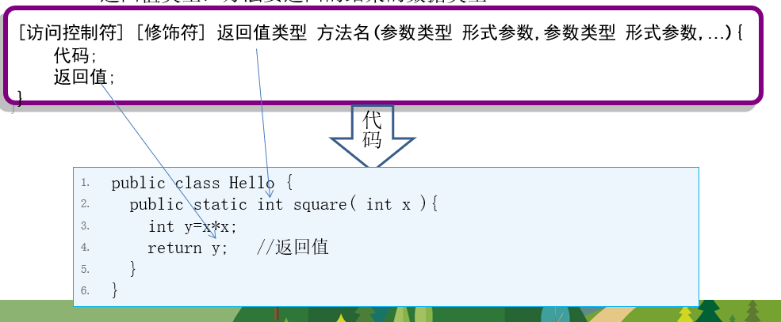
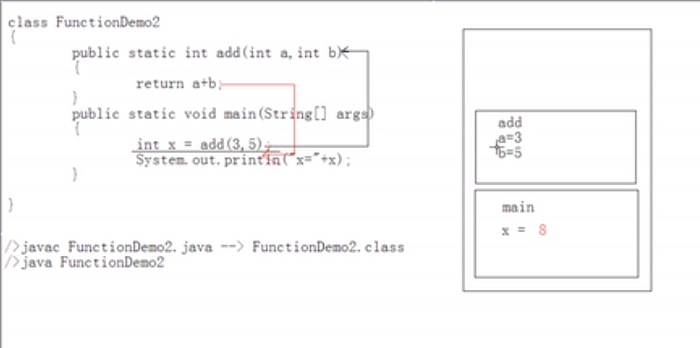
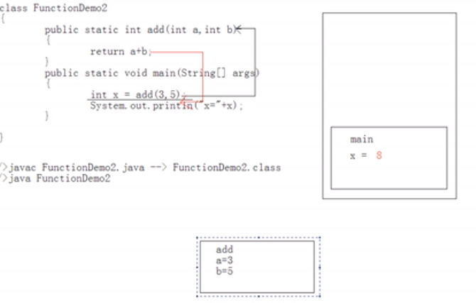

# 第5章 方法声明及调用

## 1. 定义

方法是完成某个功能的一组语句，通常将常用的功能写成一个方法，通常也称为函数。

> ```java
> //int代表返回类型
> //a,b叫形参
> //return 关键字是代表返回值，return 右边是一个返回表达式。
> //返回表达式的值类型必须要和返回类型规定的类型一致
> // public叫修饰符：属于权限修饰符：
> public int add(int a,int b){
> 	return a+b;
> }
> 
> 
> ```
>
> static 也是修饰符，但是现在不讲
>
> 修饰符好比制服，穿制服代表了身份

## 2. 格式



1. 修饰符：控制权限，static暂时不说
2. 返回值类型：java是强类型语言，因此要规定返回值的类型，例如返回int
3. 函数名： 函数的名字，名称对应规则camel，名字要提高阅读性：例如 method1 不适合
4. 形式参数：又称为方法入参，参加运算的数据，由外部传入，多个参数之间有顺序
5. 执行语句：调用函数时语句执行
6. return关键字：返回，后面跟返回值，返回值类型要和返回类型一致

```java
//例子，我是饭店老板，我有一方法叫做饭，你给我钱相当于参数，我给你饭，饭就是返回类型。
//张三给我钱，我给张三饭，李四给我钱，我也给饭，但是张三的饭不能给李四，我怎么做饭跟你没关系，
//你就是方法调用者
```

## 3. 几种特殊情况

```java
//我不收你钱，给你免费饭，代表没入参，
//你给我钱，我啥都不给你 叫做没有返回值，那么返回值类型一定是关键字：void
```

> 没有返回值，return后面不跟返回值

### 3.1 void用途

​	处理打印，处理数组换位，入参是引用类型，并且处理这个引用变量的堆内存数据等

> 例子
>
> ```java
> public static void print(int a ){
>     sop(a);
>     return //retrun 多余
> }
> ```
>
> 如果返回值类型是void，函数中的return语句可以省略不写。

## 4.函数的好处

提高代码的复用性，反过来说，没必要定义方法。定义方法的目的一定是提高复用性。

## 5.容易出现的错误

1. 函数中不能定义函数,但是jdk8用了一种语法糖，像是在函数中定义了函数，叫箭头函数（lambda）
2. 调用函数和定义函数不是一回事。
3. 函数调用只能在另一个函数中。
4. 函数的目的要清晰，该返回值就得返回值，如果调用者要处理数据，你就必须返回。

​	

> ```java
> public void add(){};
> 
> sop(add());// 如果方法没有返回值是不能被用于赋值操作，打印操作的
> ```
>
> 

## 6 函数的两个明确

开发时到底怎么定义函数？

### 用例练习

两个明确：1.是否需要结果，结果是什么类型？2.是否需要参数参与运算，是否有形参

```java
// 需求：定义一个功能，完成两个整数和的获取
//两个明确：1.有结果。2.需要两个整数参数

//需求，画出一控制台
//两个明确：1.没有结果 。2不需要参数

//需求：比较两个数是否相等
//1.有结果 2.需要两个参数
```

## 7.内存加载过程

```java
class FunctionDemo2{
    public static  int add (int a,int b){
        return a+b;
    }
    
    public static void main(String[] args){
        int x= add(3,6);
        sop(x);	
    }
}
```

```bash
javac FuntionDemo2.java // 编译器编译代码,生成字节码文件，都是机器码，供虚拟机使用	
java FunctionDemo  
启动虚拟机，运行一个java应用程序，你指定的文件后，java虚拟就会在这个类中取寻找main函数，如果找不到会报noSuchMethodError，这是个运行时错误
```

函数内存过程（**都在栈内存中完成，先进来的放在栈的底部，先进后出，类似于手枪弹夹**）：

1. main函数先执行，所以会在内存中划分空间

2. main函数调用add函数，add函数执行，在内存中划分空间

   

3. add函数执行完毕，将值返回给main，add的栈被释放

   

4. main函数执行完，释放内存

## 8 重载 overload

### 8.1定义

> 重复载入，什么重复？函数名重复

**同一个类**中，运行存在一个以上同名函数，只要他们的参数个数不同**或者**参数类型不同即可。

#### 例子

```java
//加法运算：两个整数的和
public static int add(int a ,int b)
//加法运算，两个浮点数的和
public static double add(double a ,double b)
// 加法运算，三个整数的和
public static int  add(int a ,int b,int c)
// 加法运算，一个浮点一个整数和
public static double (int a ,double b)
    
//错误的思想
//addInt addDouble addThree

//错误的重载定义
public static double add(int a ,int b) //和第一个冲突，编译直接报错：已存在
```

为什么重载这么设计，道理很简单：

原因：如果调用add同名函数，调用哪个，虚拟就要能区分，可以通过参数的类型和个数来区分

> 重载和返回类型无关

### 8.2 重载练习

```java
//举java中自带的例子
Arrays.binarySearch();
//重载代码往往重复,所以直接就复用了
//一般是参数个数不同可以重载
add(int a,int b){
    add(a,b,0);
}


//一下两个方法算重载，因为java是严谨的语言，虽然参数类型好像相同，但其实不同，因为顺序不同
 public void fun(int a ,String b){
        System.out.println(a+b);
 }

public void fun(String a,int b){
    System.out.println(a+b);
}
```

## 课后练习

1、编写一个方法，求整数n的阶乘，例如5的阶乘是1*2*3*4*5。

**import** java.util.Scanner;

**public** **class** Answer {

​    **public** **static** **int** func1(int n) {

​       **int** i = 0;

​       **int** m = 1;

​       **for** (i = 1; i <= n; i++) {

​           m = m * i;

​       }

​       System.*out*.println("n的阶乘是："+m);

​       return m;

​    }

}

 

2、  编写一个方法，判断该年份是平年还是闰年。

public class Exercise_05_02 {

​         public static void main(String[] args) {

​                  Exercise_05_02.method1(2012);

​         }

​         

​         public static void method1(int year) {

​                  

​        if(year%4==0&&year%100!=0||year%400==0){

​                 System.out.println("闰年"); 

​        }else{

​                 System.out.println("不是闰年");

​        } 

 

​         }

 

 

}

 

 

 

1.编写一个方法，输出大于200的最小的质数。

public class Exercise_05_03 {

​         public static void main(String[] args) {

​                  Exercise_05_03.method1();

​         }

​         

​         public static void method1() {

​                  // TODO Auto-generated method stub

​                  for (int i = 200; i < 300; i++) {

​                          boolean b = true;

​                          for (int j = 2; j < i; j++) {

​                                   if (i % j == 0) {

​                                            b = false;

​                                            break;

​                                   }

​                          }

​                          if (!b) {

​                                   continue;

​                          }

​                          System.out.println(i);

​                          break;

​                  }

​         }

 

 

}

 

2.写一个方法，功能：定义一个一维的int 数组，长度任意,然后将它们按从小到大的顺序输出（使用冒泡排序）（知识点：方法的定义和访问）。

public class Exercise_05_04 {

 public static void main(String[] args) {

​          int[] array = { 1, 6, 2, 3, 9, 4, 5, 7, 8 };

​          sort(array);

​          print(array);

 }

 

 public static void sort(int[] data) {

​          // 数组长度 　　

​          int len = data.length;

​          int temp = data[0]; // 临时变量

​          for (int i = 1; i < len; i++) {

​                   for (int j = 1; j <len-i; j++) {

​                            // 如果data[j+1]大于data[j]，交换 　　

​                            if (data[j] > data[j + 1]) {

​                                    temp = data[j];

​                                    data[j] = data[j + 1];

​                                    data[j + 1] = temp;

​                            }

​                   }

​          }

 }

 

 // 数组打印　

 public static void print(int[] data) {

​          for (int i = 0; i < data.length; i++) {

​                   System.out.print(data[i] + " ");

​          }

​          System.out.print("\n");

 }

}


 请用递归算法计算法斐波拉契数列1，1,2,3,5,8,13,21,34.。。。。

```java
class FibonacciDemo{
	fibo(int i){
        if(i<=1){
            return 1;
        }
        return fibo(i-1)+fibo(i);
    }
    
    
    main(){
        int length  =10;
        for(int x = 0;i<length;i++){
            fibo(x);
        }
    }
}

```

