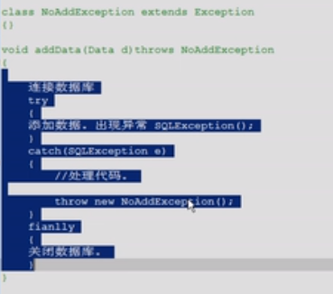
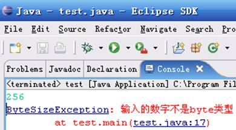

# 第八章 异常处理

## 1. 定义

java用面向对象的思想来处理异常

用类的形式对不正常的情况那些描述和封装对象

描述不正常的类就称为异常类

将正常代码和异常代码进行分离，增强阅读性。

```java
int [] arr=new int[3];
sop(arr[3])//arrayOUt
arr = null;
sop(arr[3])//nullpointer
```


## 2. 异常体系

异常种类很多，意味着描述的类也很多

将其共性向上抽取，形成了异常体系。

最终异常分为两大类：

1. 一般不可处理的。Error ：癌症
2. 可以处理的。Exception：感冒发烧

二者共性父类:Throwable：无论是Error 还是Exeption都可以抛出，该体系的特点就在于Throwable及其所有的子类都具有可抛性。

异常return不合适，只能抛：throw

### 2.1 可抛性

关键字：throws ，throw 凡是可以被这两个关键字所操作的类和对象都具备可抛性。

### 2.2 Error

```bash
java haha //error
```

特点：是由jvm抛出的严重性问题，这种问题发生不进行针对性处理，直接修改源码。

```java
int[] arr = new int[1024*1024*800];//OutOfMemoryError
```

> 注：java文档https://docs.oracle.com/javase/8/docs/api/

该体系的特点：

子类的后缀名都用其父类名作为后缀

### 2.3 异常底层运行原理

```java
/**
 * ExceptionDemo
 */
public class ExceptionDemo {

    public static void main(String[] args) {
        int[] arr = new int[3];
        Demo d = new Demo();
        d.method(arr,3);
    }
}

class Demo{
    public void method(int[] arr,int index){
        System.out.println(arr[index]);
    }

}

/*
Exception in thread "main" java.lang.ArrayIndexOutOfBoundsException: 3
        at Demo.method(ExceptionDemo.java:15)
        at ExceptionDemo.main(ExceptionDemo.java:9)
*/
```

> 数组角标越界之所以能对其识别，是引文java已经有了对这种异常的识别

以上代码异常处理步骤：

1. jvm识别错误，new一个异常对象，抛给调用者主函数
2. 主函数接收到异常对象，抛给jvm
3. 虚拟机启动默认异常处理机制，处理错误，说白了就是将异常信息打印在控制台上。


>  真实开发，不会只在控制台打印，而是存在日志里。

**问题**：两个haha输出吗？

```java
/**
 * ExceptionDemo
 */

public class ExceptionDemo {

    public static void main(String[] args) {
        int[] arr = new int[3];
        Demo d = new Demo();
        d.method(arr,3);
        System.out.println("haha");
    }
}

class Demo{
    public void method(int[] arr,int index){
        System.out.println(arr[index]);
        System.out.println("haha");
    }

}

```

**总结：异常的发生会停止正常代码执行。**

以上代码都是虚拟机自动抛出的异常，我们手动也可以。

```java
/**
 * 自定义异常对象
 */
public class ExceptionDemo {

    public static void main(String[] args) {
        int[] arr = new int[3];
        Demo d = new Demo();
        int num  = d.method(arr,3);
        System.out.println("num is "+num);
    }
}

class Demo{
    public void method(int[] arr,int index){
        
        if(index>=arr.length){
            throw new ArrayIndexOutOfBoundsException("数组角标越界："+index);
        }
        if(index<0){
            throw new ArrayIndexOutOfBoundsException("数组角标不能为负："+index);
        }
      	return arr[index];
    }

}
```

### 2.4 自定义异常类型

> 例子：对于负数角标异常的情况，准备用负数角标异常来表示
>
> java中没有这个异常类
>
> 那就按照java面向对象的思想，自己描述一个异常对象
>
> 注意：如果要让 一个类称为异常类，必须继承异常体系，才具备可抛性

```java
/**
 * ExceptionDemo
 */
public class ExceptionDemo2 {

    public static void main(String[] args) {
        int[] arr = new int[3];
        Demo d = new Demo();
        int num  = d.method(arr,3);
        System.out.println("num is "+num);
    }
}

class Demo{
    public int method(int[] arr,int index){
        
        if(index>=arr.length){
            throw new ArrayIndexOutOfBoundsException("数组角标越界："+index);
        }
        if(index<0){
            throw new NagtiveIndexException();
        }
      	return arr[index];
    }

}

class NagtiveIndexException extends Exception{
    NagtiveIndexException(){}
}

/*
错误: 未报告的异常错误NagtiveIndexException; 必须对其进行捕获或声明以便抛出
            throw new NagtiveIndexException();
*/

//-------需要在函数声明上throws
/**
 * ExceptionDemo
 */
public class ExceptionDemo2 {

    public static void main(String[] args)throws NagtiveIndexException {
        int[] arr = new int[3];
        Demo d = new Demo();
        int num  = d.method(arr,3);
        System.out.println("num is "+num);
    }
}

class Demo{
    public int method(int[] arr,int index) throws NagtiveIndexException{
        
        if(index>=arr.length){
            throw new ArrayIndexOutOfBoundsException("数组角标越界："+index);
        }
        if(index<0){
            throw new NagtiveIndexException();
        }
      	return arr[index];
    }

}

class NagtiveIndexException extends Exception{
    NagtiveIndexException(){}
}
/*
Exception in thread "main" NagtiveIndexException
        at Demo.method(ExceptionDemo2.java:21)
        at ExceptionDemo2.main(ExceptionDemo2.java:9)*/

//调用父类Throwable构造函数来实现打印自定义信息
/**
 * ExceptionDemo
 */
public class ExceptionDemo2 {

    public static void main(String[] args)throws NagtiveIndexException {
        int[] arr = new int[3];
        Demo d = new Demo();
        int num  = d.method(arr,-3);
        System.out.println("num is "+num);
    }
}

class Demo{
    public int method(int[] arr,int index) throws NagtiveIndexException{
        
        if(index>=arr.length){
            throw new ArrayIndexOutOfBoundsException("数组角标越界："+index);
        }
        if(index<0){
            throw new NagtiveIndexException("角标不能为负数"+index);
        }
      	return arr[index];
    }

}

class NagtiveIndexException extends Exception{
    private static final long serialVersionUID = 1L;

    NagtiveIndexException() {
    }
    NagtiveIndexException(String msg) {
        super(msg);
    }
}
```

### 2.5 编译时检测异常与运行时异常

思考：以上代码为什么ArrayIndexOutOfBoundsException不用throws，而自定义异常要throws

> ArrayIndexOutOfBoundsException,NullPointException 都有个爹RuntimeException

##### 异常的分类：

1. 编译时被检测异常：只要是Exception和其子类，除了特殊子类RuntimeException及其子类

   这种问题一旦出现，希望在编译时就进行检测，让这种问题有对应的处理方式。

   这样的问题都可以针对性处理

2. 编译时不检测异常：就是RuntimeException体系

   这种问题的发生无法让功能继续运算，更多是因为调用者的原因导致的或者引发了内部状态的改变造成。

   那么这种问题一般不处理，直接编译通过，在运行时，让调用者的程序强制停止，让调用者对代码进行修正。

```java
//自定义类继承RuntimeException，就不需要throw

public class ExceptionDemo2 {

    public static void main(String[] args) {
        int[] arr = new int[3];
        Demo d = new Demo();
        int num  = d.method(arr,-3);
        System.out.println("num is "+num);
    }
}

class Demo{
    public int method(int[] arr,int index) {
        
        if(index>=arr.length){
            throw new ArrayIndexOutOfBoundsException("数组角标越界："+index);
        }
        if(index<0){
            throw new NagtiveIndexException("角标不能为负数"+index);
        }
      	return arr[index];
    }

}

class NagtiveIndexException extends RuntimeException{
    private static final long serialVersionUID = 1L;

    NagtiveIndexException() {
    }
    NagtiveIndexException(String msg) {
        super(msg);
    }
}
```

运行时异常时调用者造成的，调用者没法处理这个异常，如null例子如下：

```java
//自定义类继承RuntimeException，就不需要throw

c
```

结论：自定义异常时，要么继承Exception，要么RuntimeException

##### throws 与throw的区别

1. throws使用在函数上，throw用在函数内
2. throws抛出的是异常类可以抛出多个，用逗号隔开。throw抛出的是异常对象。

## 3. 捕捉异常

### 3.1 异常处理的捕捉定义

这是可以对异常进行针对式处理的方式：

具体格式是：

```java
try{
    //需要被检测异常的代码
}catch(异常类 变量){ //括号内接受的异常对象的变量
    //处理异常的代码	
}finally{
    //一定会被执行的代码
}
```

```java
public class ExceptionDemo2 {

    public static void main(String[] args) {
        int[] arr = new int[3];
        Demo d = new Demo();
        try{
            int num  = d.method(arr,-3);
            System.out.println("num is "+num);
        }catch(NagtiveIndexException e){
            System.out.println("负数角标异常");
        }
        
    }
}

class Demo{
    public int method(int[] arr,int index) {
        
        if(index<0){
            throw new NagtiveIndexException("角标不能为负数"+index);
        }
      	return arr[index];
    }

}

class NagtiveIndexException extends RuntimeException{
    private static final long serialVersionUID = 1L;

    NagtiveIndexException() {
    }
    NagtiveIndexException(String msg) {
        super(msg);
    }
}
```

##### 内存过程：


```java
//调用异常类的方法来处理异常
 try{
     int num  = d.method(arr,-3);
     System.out.println("num is "+num);
 }catch(NagtiveIndexException e){
     System.out.println("负数角标异常");
     System.out.println(""+e);
     System.out.println(e.getMessage());
     e.printStackTrace();//打印栈追踪信息 jvm默认的异常处理机制就是调用这个方法
 }
```

##### 多catch情况

```java
public class ExceptionDemo2 {

    public static void main(String[] args) {
        int[] arr = new int[3];
        Demo d = new Demo();
        try{
            int num  = d.method(arr,-3);
            System.out.println("num is "+num);
        }catch(NagtiveIndexException e){
            System.out.println("负数角标异常");
        }catch(NullPointerException e){
            System.out.println(e.toString());
        }
        
    }
}

class Demo{
    public int method(int[] arr,int index) {
        
        if(arr==null){
            throw new NullPointerException();
        }
        if(index<0){
            throw new NagtiveIndexException("角标不能为负数"+index);
        }
      	return arr[index];
    }

}

class NagtiveIndexException extends RuntimeException{
    private static final long serialVersionUID = 1L;

    NagtiveIndexException() {
    }
    NagtiveIndexException(String msg) {
        super(msg);
    }
}
```

> 面试题：一下情况能编译通过吗
>
> ```java
> public class ExceptionDemo2 {
> 
>     public static void main(String[] args) {
>         int[] arr = new int[3];
>         Demo d = new Demo();
>         try{
>             int num  = d.method(arr,-3);
>             System.out.println("num is "+num);
>         }catch(Exception e){ //这个是父类能处理所有异常，下面两个就是废话
> 
>         }catch(NagtiveIndexException e){
>             System.out.println("负数角标异常");
>         }catch(NullPointerException e){
>             System.out.println(e.toString());
>         }
>         
>     }
> }
> 
> class Demo{
>     public int method(int[] arr,int index) {
>         
>         if(arr==null){
>             throw new NullPointerException();
>         }
>         if(index<0){
>             throw new NagtiveIndexException("角标不能为负数"+index);
>         }
>       	return arr[index];
>     }
> 
> }
> 
> class NagtiveIndexException extends RuntimeException{
>     private static final long serialVersionUID = 1L;
> 
>     NagtiveIndexException() {
>     }
>     NagtiveIndexException(String msg) {
>         super(msg);
>     }
> }
> /*
> \ExceptionDemo2.java:11: 错误: 已捕获到异常错误NagtiveIndexException
>         }catch(NagtiveIndexException e){
>          ^
> .\ExceptionDemo2.java:13: 错误: 已捕获到异常错误NullPointerException
>         }catch(NullPointerException e){
>          ^
> 2 个错误
> */
> ```

##### jdk7的catch的新语法

一个catch入参中可以有多个exception，用|隔开，但是不能存在父子关系

```java
public static void main(String[] args) {
        int[] arr = new int[3];
        Demo d = new Demo();
        try{
            int num  = d.method(arr,-3);
            System.out.println("num is "+num);
        }catch(NagtiveIndexException|NullPointerException e){
            System.out.println(e.toString());
        }
        
    }
//----------------------------------------
//以下编译失败
public static void main(String[] args) {
        int[] arr = new int[3];
        Demo d = new Demo();
        try{
            int num  = d.method(arr,-3);
            System.out.println("num is "+num);
        }catch(Exception|NullPointerException e){ //编译失败
            System.out.println(e.toString());
        }
        
}
/*
错误: multi-catch 语句中的替代无法通过子类化关联
        }catch(Exception|NullPointerException e){
                         ^
  替代NullPointerException是替代Exception的子类
*/
```

## 4.异常处理原则

1. 函数内部如果抛出需要检测异常，函数上必须要声明，否则必须在函数内用trycatch捕捉。

2. 如果调用到了声明异常的函数，要么trycatch，要么throws

3. 什么时候trycatch，什么时候throws？

   功能内容可以决绝，catch

   解决不了，用throws告诉调用者，由调用者解决。

4. 一个功能如果抛出多个异常，那么调用时，必须对应多个catch进行针对性处理。

   内部有几个需要检测的异常，就抛出几个异常，抛出几个，就catch几个。

## 5. finally代码块

除非jvm关闭，都必须要执行的代码

```java
/**
 * ExceptionDemo3
 */
public class ExceptionDemo3 {

    public static void main(String[] args) {
        Demo d = new Demo();
        int[] arr = new int[3];
        try{
            int num  = d.method(arr,0);
            System.out.println("num is "+num);
            System.exit(0);
        }catch(NullPointerException e){
            System.out.println(e.toString());
        }finally{
            System.out.println("finally");
        }
        System.out.println("over");

    }
}


class Demo{
    public int method(int[] arr,int index) {
        
        if(arr==null){
            throw new NullPointerException();
        }
    
      	return arr[index];
    }

}
```

### 5.1 finally 的用处

比如数据库关闭连接

```java
import java.sql.Connection;
import java.sql.DriverManager;
import java.sql.ResultSet;
import java.sql.Statement;

/**
 * JdbcExceptionDemo
 */
public class JdbcExceptionDemo {

    public static void main(String[] args) {
        Connection conn = null;
        Statement stmt = null;
        ResultSet rs = null;
        try {
            conn = DriverManager.getConnection("jdbc:mysql://localhost:3306?mysql");
            stmt = conn.createStatement();
            rs = stmt.executeQuery("select * from haha");
            rs.next();
        } catch (Exception e) {
            System.out.println(e);
        } finally {

            if (rs != null) {
                try {
                    rs.close();
                } catch (Exception e) {

                }

            }
            if (stmt != null) {
                try {
                    stmt.close();

                } catch (Exception e) {
                    // TODO: handle exception
                }
            }
            if (conn != null) {
                try {
                    conn.close();

                } catch (Exception e) {
                    // TODO: handle exception
                }
            }
        }

    }
}
```

### 5.2 jdk7 try-catch-resource

`  **try-with-resources**语句是一个声明一个或多个资源的 try 语句。一个资源作为一个对象，必须在程序结束之后随之关闭。 try-with-resources语句确保在语句的最后每个资源都被关闭 。任何实现了 java.lang.AutoCloseable的对象, 包括所有实现了 java.io.Closeable 的对象, 都可以用作一个资源

```java
public static void main(String[] args) {
    try (Connection conn = DriverManager.getConnection("jdbc:mysql://localhost:3306?mysql");
         Statement stmt = conn.createStatement();
         ResultSet rs = stmt.executeQuery("select * from haha")) {            
        rs.next();
    } catch (Exception e) {
        System.out.println(e);
    } 
}
```

自己实现AutoCloseAble接口

```java
/**
 * ExceptionDemo3
 */
public class ExceptionDemo3 {

    public static void main(String[] args) {
        
        int[] arr = new int[3];
        try(Demo d = new Demo()){
            int num  = d.method(null,0);
            System.out.println("num is "+num);
            System.exit(0);
        }catch(NullPointerException e){
            System.out.println(e.toString());
        }
        System.out.println("over");

    }
}


class Demo implements AutoCloseable{
    public int method(int[] arr,int index) {
        
        if(arr==null){
            throw new NullPointerException();
        }
    
      	return arr[index];
    }

    public void close() throws NullPointerException{
        System.out.println("finally");
    }

}
```

## 6.异常的封装与转换

​	

## 7.异常的注意事项

1. 子类在覆盖父类的方法，如果父类的方法抛出了异常，那么子类只能抛出父类的异常或该异常的子类
2. 如果父类抛出多个异常，那么子类只能抛出父类异常的子集

简单说：子类只能抛出父类的异常或者其子类

**重点注意**：如果父类的方法没有抛出异常，子类绝对不能抛

```java
class A extends Exception{}
class B extends A{}
class C extends Exception{}

class Fu{
    void show()throws A{}
}
class Zi{
     void show()throws A{} //可以
     void show()throws B{} //可以
     void show()throws C{} //不可以
    
}

class Demo{
    main(){
        test(new Zi());//如果抛了c，test方法没法处理
    }
    
    test(Fu fu){
        try{
           fu.show();
        }catch(A a){
            
        }
      
    }
}
```


## 课后练习

1．  编写应用程序，从命令行传入两个整型数作为除数和被除数。要求程序中捕获NumberFormatException 异常和ArithmeticException 异常在命令行输入不同的参数时能输出如下各种结果：  

  java A  
   总是被执行  
   Exception in thread "main" java.lang.ArrayIndexOutofBoundsException at  
   A.main(A.java:7)  
  
   java A 1 2  
   0  
   总是被执行  
  
   java A 1 3a  
   java.lang.NumberFormatException: 3a  
   at java.lang.Integer.parseInt(Integer.java:435)  
   at java.lang.Integer.parseInt(Integer.java:476)  
   at A.main(A.java:8)  
   总是被执行  
  
   java A 1 0  
   java.lang.ArithmeticException: / by zero at A.main(A.java:9)  
   总是被执行 

 

 

public class Exercise_08_01 {

 

 

 public static void main(String[] args) {

​                           

​          try{

​                   //读取命令行数据，并进行类型转换

​                   int x = Integer.parseInt(args[0]);

​                   int y = Integer.parseInt(args[1]);

​                   int z = 0;

​                   //计算两个数的相除

​                   z=x/y;

​                   //输出商

​                   System.out.println(z);

​          }catch(NumberFormatException e){

​                   //捕捉到对应的异常后，打印异常堆栈信息

​                   e.printStackTrace();

​          }catch(ArithmeticException e){

​                   //捕捉到对应的异常后，打印异常堆栈信息

​                   e.printStackTrace();

​          }finally{

​                   //如下代码一定会被输出

​                   System.out.println("总是被执行");

​          }

​          

 }

 

}

 

2． 编写一个方法，比较两个字符串。假如其中一个字符串为空，会产生NullPointerException异常，在方法声明中通告该异常，并在适当时候触发异常，然后编写一个程序捕获该异常。

**public** **class** Main {

​    

**public** **static** **void** test(String s,String a ) **throws** NullPointerException {

​       

​    

​       **if**(s==**null**||a == **null**) {

​           **throw** **new** NullPointerException();

​       }**else**{

​           

​       }

​    }

​    

​    **public** **static** **void** main(String[] args) {

​       // **TODO** Auto-generated method stub

​       **try**{

​           String s = **null**;

​           String a = "asff";

​           *test*(s,a);

​       

​       }**catch**(NullPointerException e){

​           e.printStackTrace();

​       }

​    }

​    

}

 

 

1． 编写一个检查给定的数字的数据类型是否为byte的程序，如果此数字超出byte数据类型表示的数的范围，则引发用户自定义的异常ByteSizeException,并显示相应的错误信息

步骤1：创建用户自定义异常类ByteSizeException

步骤2：在main方法中编写逻辑代码

步骤3：运行并测试

效果如图：



**public** **class** ByteSizeException **extends** Exception{

​    **public** ByteSizeException(){

​       **super**("此数字超出byte数据类型表示的数的范围");

​    }

}

**public** **class** Main {

​    

​    **public** **static** **void** foo(**int** number) **throws** ByteSizeException{

​       **if**(number > 127 || number < -128){

​       **throw** **new** ByteSizeException();

​       }

​       }

 

​    **public** **static** **void** main(String[] args) {

​       **try**{

​           *foo*(555);

​       }**catch** (ByteSizeException e) {

​           e.printStackTrace();

​       }

​    }

}

 

 

 