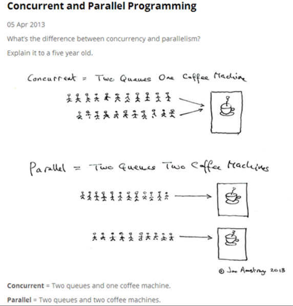
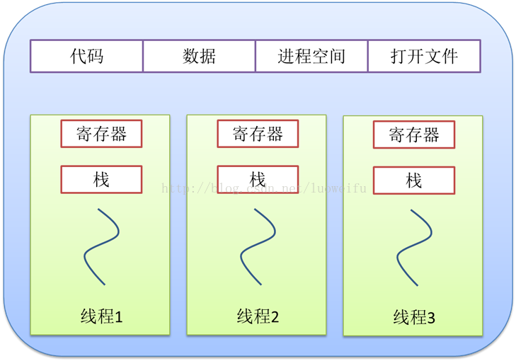
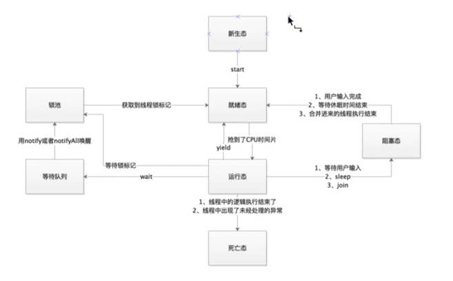
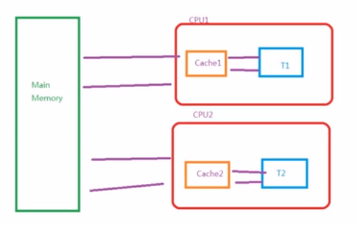
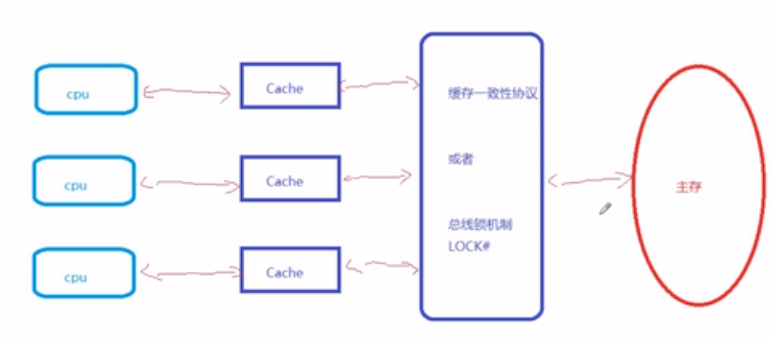
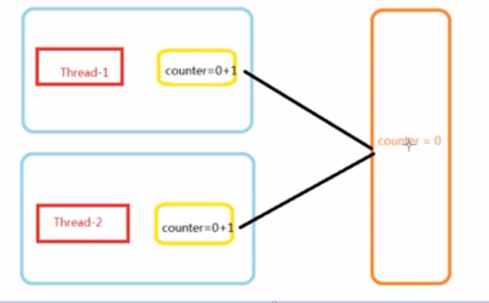
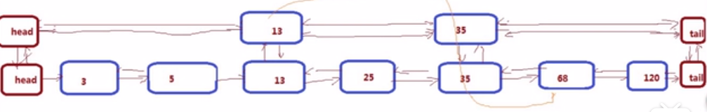
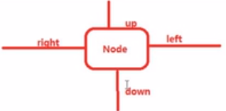
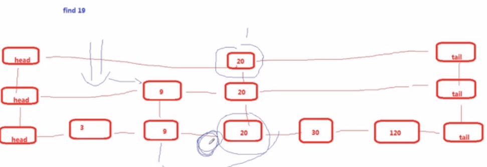

# 第十一章 并发编程

## 并发与并行

很多人都对其中的一些概念不够明确，如同步、并发等等，让我们先建立一个数据字典，以免产生误会。

- 多线程：指的是这个程序（一个进程）运行时产生了不止一个线程
- 并行与并发：
  - 并行：多个cpu实例或者多台机器同时执行一段处理逻辑，是真正的同时。
  - 并发：通过cpu调度算法，让用户看上去同时执行，实际上从cpu操作层面不是真正的同时。并发往往在场景中有公用的资源，那么针对这个公用的资源往往产生瓶颈。



> java的多线程实际上在多核cpu的情况下是在并发与并行之间进行切换。


## 进程与线程

进程与线程都和并行和并发有关系，都是对计算机资源的一种划分单位，但是区别是：

- 进程所划分的内存空间在进程之间是不可共享的，例如qq的内存空间不可能给java虚拟机访问

  j进程是操作系统进行资源分配和调度的一个独立单位

- 线程是程序执行中一个单一的顺序控制流程，是程序执行流的最小单元，是处理器调度和分派的基本单位。

  一个进程可以存在多个线程，各个线程之间可以共享程序的内存空间，当然就可以共享一些数据。

- 进程之间的切换开销较大，因为内存和硬盘根本无法跟得上cpu指针的切换速度，所以导致了进程间的切换极为缓慢，那么这样就失去了切换的意义，不如串行执行。




## 线程的生命周期

### 对象生命周期：

在程序开发中，将一个对象从实例化完成，到这个对象使用结束并销毁。

### 线程生命周期：

一个线程被实例化完成，到这个线程销毁，中间的过程。

### 线程的状态：

#### 1.新生态：New

一个线程对象的实例化完成，但是没有做任何的操作。

#### 2.就绪态：Runnable

一个线程已经被开启，已经开始争抢cpu时间片。

#### 3.运行态：Running

一个线程抢到了CPU时间片，开始执行这个线程中的逻辑代码。

#### 4.阻塞态：Blocked

一个线程在运行过程中，受到某些操作的影响，放弃了已经获取到的CPU时间片，并且不再参与CPU时间片的

争夺，此时线程处于挂起状态。

#### 5.死亡态: Dead

一个线程对象需要被销毁




## 线程的开辟方式

### 1.继承Thread类

```java
package com.neuedu;

public class ThreadDemo1 {
	
	public static void main(String[] args) {
		//创建线程对象，使得线程完成New状态
		MyThread myThread = new MyThread();
		//调用start方法，线程进入Runnable状态
		myThread.start();
		
		System.out.println("主线程执行完毕");
		
	}
}

class MyThread extends Thread{

	@Override
	public void run() {
		for(int x= 0;x<10;x++) {
			System.out.println(Thread.currentThread()+":"+x);
		}
	}
	
	
}
```

### 2.实现Runnable接口

```java
package com.neuedu;

public class ThreadDemo1 {
	
	public static void main(String[] args) {
		
		//创建runnable接口实例
		Runnable runable = ()->{
			for(int x= 0;x<10;x++) {
				System.out.println(Thread.currentThread().getName()+":"+x);
			}
		};
		
		//创建线程 New
		Thread thread = new Thread(runable);
		
		//启动线程 Runnable
		thread.start();
		
		System.out.println("主线程执行完毕");
		
	}
}
```

### 二者的优劣：

​	显然第二种更加灵活，因为java可以多实现，但不能多继承

## 线程常用方法

### 1.线程命名

```java
Thread thread = new Thread(runable,"custom");
thread.setName("custom");
```

### 2.线程的休眠

调用Thread静态方法sleep进行线程休眠，`sleep(long millisecond)`接收一个毫秒值，并且需要捕获异常`InterruptedException`异常

> 当线程sleep之时，就会放弃线程的cpu时间片使用权，线程进入到阻塞状态

```java
public class ThreadDemo1 {
	
	public static void main(String[] args) {
		
		//创建runnable接口实例
		Runnable runable = ()->{
			for(int x= 0;x<10;x++) {
				try {
					Thread.sleep(1000);
				} catch (InterruptedException e) {
					e.printStackTrace();
				}
				System.out.println(Thread.currentThread().getName()+":"+x);
			}
		};
	
		Thread thread = new Thread(runable,"custom");
		
		thread.start();
		
		System.out.println("主线程执行完毕");
		
	}
}
```

### 3.线程的优先级

> 设置线程的优先级，只是修改这个线程抢到cpu时间片的概率
>
> 并不是优先级高的线程一定能抢到时间片

优先级的设置是0-10的整数，默认是5

> 由于两个线程都是Runnable状态，假定在单核cpu的情况下，二者是必须要争抢cpu时间片的，那么此时二者就是在执行态和就绪态之间来回切换。

```java
public class ThreadDemo1 {
	
	public static void main(String[] args) {
		
		setPriority();
	}
	
	
	public static void setPriority() {
		Runnable r = ()->{
			for(int x= 0;x<100;x++) {
				System.out.println(Thread.currentThread().getName()+":"+x);
			}
		};
		
		Thread t1 = new Thread(r,"thread1");
		Thread t2 = new Thread(r,"thread2");
		t1.setPriority(1);
		t2.setPriority(10);
		t1.start();
		t2.start();
	}
}
```

### 4.线程的礼让

线程礼让：指的是当前线程在Running状态下释放自己的cpu资源，由运行状态，回到就绪状态

```java
public static void main(String[] args) {

    threadYield();
}


public static void threadYield() {
    Runnable r1 = ()->{
        for(int x= 0;x<10;x++) {
            System.out.println(Thread.currentThread().getName()+":"+x);
        }
    };
    Runnable r2 = ()->{
        Thread.yield(); //释放执行权
        for(int x= 0;x<10;x++) {
            System.out.println(Thread.currentThread().getName()+":"+x);
        }
    };
    new Thread(r2,"礼让线程").start();
    new Thread(r1,"普通线程").start();
}
```

> 注意：在cpu性能非常强的状态下，礼让线程有可能先执行完，这很正常，多核cpu根本不需要礼让，cpu忙的过来。

## 临界资源问题

临界资源问题就是线程安全问题


java当中，多个线程同时操作一个共享变量时，就会发生超卖，线程安全问题

> 思考以下用例：
>
> 四个售票员在同时售票，而票是有限的。

```java
public class TicketSale {
	int num = 10;
	
	
	public static void main(String[] args) {
		TicketSale ticketSale = new TicketSale();
		//模拟四个售票员同时卖票
		Runnable r= ()->{
			while(ticketSale.num>0) {
				System.out.println(Thread.currentThread().getName()+":卖出1张，剩余:"+--ticketSale.num);
			}
			
		};
		
		new Thread(r,"赵丽华").start();
		new Thread(r,"陈秀莲").start();
		new Thread(r,"王美丽").start();
		new Thread(r,"李淑芬").start();
	}
}
```

> 以上代码执行时，会发现当多个线程在操作一个成员变量时，就会发生执行结果错误，因为代码在执行过程中，可能会从Running状态切换回Runnable状态，而这时候已经--的计算已经完成了

### 问题产生的原因

以上代码中线程在运行态和就绪态之间来回切换，由于打印的那句语句非原子性，所以当取到ticket值时，并没有执行打印，所以大数字会打在小数字后面

## 锁

通过锁将临界资源锁住，使得线程想要操作资源必须获得锁。

### `synchronized`关键字

synchronized关键字持有的锁是互斥锁,synchronized加锁的方法就是一个原子操作

```java
	TicketSale ticketSale = new TicketSale();
		//模拟四个售票员同时卖票
		Runnable r= ()->{
            synchronized(lock){
                	while(ticketSale.num>0) {
				System.out.println(Thread.currentThread().getName()+":卖出1张，剩余:"+--ticketSale.num);
			}
            }
		
			
		};
		
		new Thread(r,"赵丽华").start();
		new Thread(r,"陈秀莲").start();
		new Thread(r,"王美丽").start();
		new Thread(r,"李淑芬").start();
```

此时只有一个线程获得了同步锁标记，并且处于running状态执行代码，而其他线程都进入到了阻塞态，在锁池中进行等待，但同步锁被释放后，这些线程将争抢这把锁，先抢到的就会从blocked状态回到runnable状态，争抢到cpu时间片后，进入运行态，当代码执行完毕后，释放锁。

### 加锁的方式

```java
private int count = 10;
private Object  o =new Object();
public void m(){
    
    //这里o的对象就是锁，注意o指向的堆内存对象中会记录这一点，而不是引用
    synchronized(o){
        count++;
        sop(Thread.currentThread().getName()+"count="+count);
    }
}

//--------------------------------------------
//用this作为锁对象，注意，锁的是对象，不是代码，就好比代码是厕所，要想用厕所并且不受干扰，你要拿着锁也就
//是对象把门锁了
private int count = 10;
public void m(){
    
    //如果单独创建一个对象当做锁的话，实在是浪费资源，而this指向的也是对象，所以正好用上
    synchronized(this){
        count++;
        sop(Thread.currentThread().getName()+"count="+count);
    }
}
//-----------------------------------------------
//直接声明在方法上的锁，等同于将对象作为锁
private int count = 10;

public synchronized /*这里等同于锁定this对象*/ void m(){
    count++;
    sop(Thread.currentThread().getName()+"count="+count);
}

//-----------------------------------------------
public synchronized /*这里等同于锁定Class对象*/ static void m(){
    count++;
    sop(Thread.currentThread().getName()+"count="+count);
} 	
//上面代码相当于如下
public static void mm(){
    synchronized(T.class){
        count++;
    }
}

```

### `ReentrantLock`显式锁

```java
public static void main(String[] args) {
		TicketSale ticketSale = new TicketSale();
		// 模拟四个售票员同时卖票

		ReentrantLock lock = new ReentrantLock();

		Runnable r = () -> {
			lock.lock();
			while (ticketSale.num > 0) {
				System.out.println(Thread.currentThread().getName() + ":卖出1张，剩余:" + --ticketSale.num);
			}
			lock.unlock();
		};

		new Thread(r, "thread-1").start();
		new Thread(r, "thread-2").start();
		new Thread(r, "thread-3").start();
		new Thread(r, "thread-4").start();
	}
```

### 死锁

多个线程彼此持有对方所需要的锁对象，而不释放自己的锁：

A线程持有a锁，等待b锁;B线程持有b锁，等待a锁

```java
package com.neuedu;

import java.util.concurrent.locks.Lock;
import java.util.concurrent.locks.ReentrantLock;

public class DeadLock {

	public static void main(String[] args) {
		String a ="A";
		String b = "B";
		
		Runnable r1 = ()->{
			synchronized (a) {
				System.out.println(Thread.currentThread().getName()+"：持有锁a，等待锁b");
				synchronized (b) {
					System.out.println(Thread.currentThread().getName()+"同时持有ab锁");
				}
			}
		};
		Runnable r2 = ()->{
			synchronized (b) {
				System.out.println(Thread.currentThread().getName()+"：持有锁b，等待锁a");
				synchronized (a) {
					System.out.println(Thread.currentThread().getName()+"同时持有ab锁");
				}
			}
		};
		
		new Thread(r1,"thread-A").start();
		new Thread(r2,"thread-B").start();
	}
}

```

> 程序开发中的死锁现象更为复杂，有可能是循环死锁

## 等待唤醒机制

### `wait()`方法：

等待，是Object类中的一个方法，当前的线程释放自己的锁标记，并且让出cpu资源。使得当前线程进入等待队列（等待Block）。

### `notify()`方法：

通知,是object类中的方法，唤醒等待队列中的一个线程，使这个线程进入到锁池。

### `notifyAll()`方法:

唤醒等待队列中的的所有线程，并使这些线程进入锁池。

```java
package com.neuedu;

import java.util.concurrent.locks.Lock;
import java.util.concurrent.locks.ReentrantLock;

public class DeadLock {
	
	
	
	
	public static void main(String[] args) {
		String a ="A";
		String b = "B";
		
		Runnable r1 = ()->{
			synchronized (a) {
				System.out.println(Thread.currentThread().getName()+"：持有锁a，等待锁b");
				
				try {
					a.wait();
				} catch (InterruptedException e) {
					// TODO Auto-generated catch block
					e.printStackTrace();
				}
				synchronized (b) {
					System.out.println(Thread.currentThread().getName()+"同时持有ab锁");
				}
			}
		};
		Runnable r2 = ()->{
			synchronized (b) {
				System.out.println(Thread.currentThread().getName()+"：持有锁b，等待锁a");
				synchronized (a) {
					System.out.println(Thread.currentThread().getName()+"同时持有ab锁");
					a.notify();
				}
			}
		};
		
		new Thread(r1,"thread-A").start();
		new Thread(r2,"thread-B").start();
	}
}
package com.neuedu;

import java.util.concurrent.locks.Lock;
import java.util.concurrent.locks.ReentrantLock;

public class DeadLock {
	
	
	
	
	public static void main(String[] args) {
		String a ="A";
		String b = "B";
		
		Runnable r1 = ()->{
			synchronized (a) {
				System.out.println(Thread.currentThread().getName()+"：持有锁a，等待锁b");
				
				try {
					a.wait();
				} catch (InterruptedException e) {
					// TODO Auto-generated catch block
					e.printStackTrace();
				}
				synchronized (b) {
					System.out.println(Thread.currentThread().getName()+"同时持有ab锁");
				}
			}
		};
		Runnable r2 = ()->{
			synchronized (b) {
				System.out.println(Thread.currentThread().getName()+"：持有锁b，等待锁a");
				synchronized (a) {
					System.out.println(Thread.currentThread().getName()+"同时持有ab锁");
					a.notify();
				}
			}
		};
		
		new Thread(r1,"thread-A").start();
		new Thread(r2,"thread-B").start();
	}
}
//-------------------------------------
//三个线程同时竞争锁，notifyAll

package com.neuedu;

import java.util.concurrent.locks.Lock;
import java.util.concurrent.locks.ReentrantLock;

public class DeadLock {
	
	
	
	
	public static void main(String[] args) {
		String a ="A";
		String b = "B";
		
		Runnable r1 = ()->{
			synchronized (a) {
				System.out.println(Thread.currentThread().getName()+"：持有锁a，等待锁b");
				
				try {
					a.wait();
				} catch (InterruptedException e) {
					// TODO Auto-generated catch block
					e.printStackTrace();
				}
				synchronized (b) {
					System.out.println(Thread.currentThread().getName()+"同时持有ab锁");
				}
				a.notifyAll();
			}
		};
		Runnable r2 = ()->{
			synchronized (b) {
				System.out.println(Thread.currentThread().getName()+"：持有锁b，等待锁a");
				synchronized (a) {
					System.out.println(Thread.currentThread().getName()+"同时持有ab锁");
					a.notifyAll();
				}
			}
		};
		
		new Thread(r1,"thread-A").start();
		new Thread(r1,"thread-C").start();
		new Thread(r2,"thread-B").start();
	}
}

```

## 多线程下的单例设计模式

```java
class Boss{
    private Boss(){}
    
    private Boss boss=null;
    
    public static getInstance(){
        synchronized(""){
            if(boss!=null){
                boss = new Boss();
            }
        }
    }
}
```

## 生产者消费者设计模式

### 生产者：

作用是生产产品。

生产逻辑：通过一个生产标记，判断是否需要生产产品。

如果需要生产：生产产品,并通知消费者消费。

如果不需要生产，等待。

### 消费者:

作用是消费产品。

消费逻辑：判断是否有足够的产品可供消费。

如果可以消费，获取产品，进行消费。

如果不可以消费，等待。

> 分析：
>
> 把生产者当成厨师，消费者当成食客，那么消费者和生产者都将对临界资源食品进行操作，那么我们要对临界资源进行访问控制。

### 代码实现

```java
// 商品
package com.neuedu.pc;

public class Product {
	
	private String name;

	public String getName() {
		return name;
	}

	public void setName(String name) {
		this.name = name;
	}

	public Product(String name) {
		super();
		this.name = name;
	}

	@Override
	public String toString() {
		return "Product [name=" + name + "]";
	}
	
}
//-----------------------------------------
//商品池
package com.neuedu.pc;

import java.util.LinkedList;

public class ProductPool {

	private LinkedList<Product> list;
	private int size;
	
	
	public ProductPool( int size) {
		this.list = new LinkedList<>();
		this.size = size;
	}
	
	public synchronized void push(Product product) {
		if(list.size()>=size) {
			try {
				this.wait(); //如果商品已经做够，就不生产了，释放掉锁标记，让消费者区竞争锁消费
			} catch (InterruptedException e) {
				// TODO Auto-generated catch block
				e.printStackTrace();
			}
		}
		this.list.addLast(product);
		System.out.println("商品池中增加一件商品，剩余商品："+this.list.size());
		//唤醒其他的生产者和消费者，
		this.notifyAll();
	}

	public  synchronized Product pop() {
		if(list.size()<1) {
			try {
				this.wait();
				//如果商品都没了，就释放当前锁标记，让生产者从锁池中竞争获取锁，
				//然后回到就绪状态竞争cpu时间片生产商品。
			} catch (InterruptedException e) {
				// TODO Auto-generated catch block
				e.printStackTrace();
			}
		}
		
		Product product = this.list.removeFirst();
		System.out.println("商品池中消费一件商品，剩余商品："+this.list.size());
		//唤醒其他的消费者进入到锁池，竞争获取锁继续消费
		this.notifyAll();
		return product;
	}
}
//-----------------------------------------
// 生产者
package com.neuedu.pc;

public class Producer implements Runnable {

	private ProductPool pool;
	
	public Producer(ProductPool pool) {
		this.pool = pool;
	}
	
	@Override
	public void run() {
		int count = 0;
		while(true) {
			pool.push(new Product("面包"));
		}
		
	}
}
//---------------------------------------
//消费者
package com.neuedu.pc;

public class Consumer implements Runnable {

private ProductPool pool;
	
	public Consumer(ProductPool pool) {
		this.pool = pool;
	}
	
	@Override
	public void run() {
		int count = 0;
		while(true) {
			Product pop = pool.pop();
		}
	}
}
//------------------------------------
//程序主函数
package com.neuedu.pc;

public class Program {
	
	public static void main(String[] args) {
		ProductPool pool = new ProductPool(20);
		
		new Thread(new Producer(pool),"生产者1").start();
		new Thread(new Consumer(pool),"消费者1").start();
	}
}
```

以上的代码实现存在缺陷，假如有多个生产者和消费者，那么会同时唤醒消费者和生产者因为nofityAll方法会把所以等待这把锁的线程同时唤醒。

### Lock与Conditon配合多监视器实现

lock接口的好处是可以在进行通知唤醒和等待的时候用过一把锁中的多个监视器来分别控制生产者和消费者的等待与唤醒

```java
//修改产品池

package com.neuedu.pc;

import java.util.LinkedList;
import java.util.concurrent.locks.Condition;
import java.util.concurrent.locks.Lock;
import java.util.concurrent.locks.ReentrantLock;

public class ProductPool {

	private LinkedList<Product> list;
	private int size;

	private Lock lock = new ReentrantLock();
	private Condition prodCond = lock.newCondition();
	private Condition consCond = lock.newCondition();

	public ProductPool(int size) {
		this.list = new LinkedList<>();
		this.size = size;
	}

	public void push(Product product) {
		lock.lock();

		try {
			if (list.size() >= size) {
				//如果商品满了，就唤醒消费者，而生产者释放锁进入等待阻塞区
				consCond.signal();
				prodCond.await();
			}
			this.list.addLast(product);
			System.out.println("商品池中增加一件商品，剩余商品：" + this.list.size());
			
		} catch (InterruptedException e) {
			// TODO Auto-generated catch block
			e.printStackTrace();
		} finally {
			lock.unlock();
		}

	}

	public Product pop() {
		lock.lock();
		Product product=null;
		try {
			if (list.size() < 1) {
				//如果商品没了，就通知生产者进行生产，消费者放弃锁
				prodCond.signal();
				consCond.await();
			}
			product = this.list.removeFirst();
			System.out.println("商品池中消费一件商品，剩余商品：" + this.list.size());
			return product;
		} catch (InterruptedException e) {
			// TODO Auto-generated catch block
			e.printStackTrace();
		} finally {
			lock.unlock();
		}
		return null;
	}

}
```


## `join()`方法

当某一个线程调用了另外一个线程的join方法后，那么该线程会释放cpu资源，处于阻塞状态，直到被调用join方法的线程执行完毕，才会重新进入就绪态 

```java
package com.neuedu;

public class JoinDemo {

    public static void main(String[] args) throws InterruptedException {
        Runnable r = ()->{
            for(int x = 0;x<10;x++){
                System.out.println(Thread.currentThread().getName()+":"+x);
            }
        };

        Thread t1 = new Thread(r);
        Thread t2 = new Thread(r);
        t1.start();
        t2.start();

        t1.join();
        t2.join();

        System.out.println("main thread finish");
    }
}

```

## ThreadGroup

每一个线程都有自己所属的线程组，如果未调用构造函数手动创建线程组，那么该线程就属于其父线程所在的线程组，比如在main函数中启动的线程，其父线程就是main线程，因此其和父亲在一个线程组当中。

```java
package com.neuedu;

import java.util.Arrays;

public class ThreadGroupDemo {

    public static void main(String[] args) {
        Runnable r = ()->{
            try {
                Thread.sleep(1000);
            } catch (InterruptedException e) {
                e.printStackTrace();
            }
        };


        Thread t1 = new Thread(r);

        t1.start();
        
        //执行结果为true
        System.out.println(t1.getThreadGroup()==Thread.currentThread().getThreadGroup());


        Thread[] threads = new Thread[3];
        t1.getThreadGroup().enumerate(threads);
        Arrays.asList(threads).forEach(System.out::println);
    }
}

```

## stackSize的改变

通过改变stacksize，我们可以控制栈内存溢出的情况，

```java
package com.neuedu;

public class StackSizeDemo {


    public static void main(String[] args) {

        Runnable run = new Runnable() {
            int count = 0;
            @Override
            public void run() {
                try {
                    add(0);
                }catch(Error e){
                    System.out.println(e);
                    System.out.println(count);
                }
            }

            public void add(int i){
                count++;
                add(i+1);
            }
        };

        Thread t1 = new Thread(null,run,"bigstack",9999999999999l);
        t1.start();
    }
}

```

> 思考一个问题：
> 当stackSize大了，那么整个jvm的栈是否可创建的线程就少了呢？

## volatile关键字

思考以下代码的执行结果，加了volatile和不加的区别

```java
package com.neuedu;

public class VolatileDemo {
	
	public static  int initValue = 0;
	public static final int MAX_SIZE = 5;
	

	public static void main(String[] args) {
		new Thread(()->{
			int localValue = initValue;
			while(localValue<MAX_SIZE) {
				if(localValue!=initValue) {
					System.out.println("the initValue updated to "+initValue);
					localValue = initValue;
				}
			}
			
		},"Reader").start();
		
		new Thread(()->{
			int localValue = initValue;
			while(localValue<MAX_SIZE) {
				System.out.println("update initValue to "+(++localValue));
				initValue = localValue;
				
				try {
					Thread.sleep(500);
				} catch (InterruptedException e) {
					// TODO Auto-generated catch block
					e.printStackTrace();
				}
				
			}
		},"UPDATER").start();
	}
}
```

结果：

加了`volatile`关键字后，Reader线程能够感知到`initValue`的变化，而不加的话，Updater线程会一直将`initValue`加到底，而对于Reader线程来说一直由于判断`initValue`和`localValue`相等而不做任何操作。



原因是因为由于计算工作都是在cpu寄存器中完成，而cpu寄存器读写速度太快，导致内存跟不上，因此cpu设置了缓存机制，当java检测到`initValue`在一个线程中只有读操作的时候，就不会从主内存中取获取值，而是直接让cpu拿缓存，导致了Reader线程感知不到`initValue`的更新，以下代码佐证了这一点。

```java
package com.neuedu;

public class VolatileDemo2 {

	public static int initValue = 0;
	public static final int MAX_SIZE = 50;

	public static void main(String[] args) {
		new Thread(() -> {
			while (initValue < MAX_SIZE) {
				System.out.println("the initValue updated to " + (++initValue));
			}

		}, "ADDER-1").start();
		new Thread(() -> {
			while (initValue < MAX_SIZE) {
				System.out.println("the initValue updated to " + (++initValue));
			}

		}, "ADDER-2").start();
	}
}
```

以上代码虽然存在线程安全问题，但是并没有导致`initValue`被两次更新，原因就是在做写操作`++initValue`时，jvm虚拟机会要求cpu去重读主内存中的值。

以ADDER-1线程的执行过程为例，说一下内存过程：

1. `initvalue`加载到cpu缓存中
2. `initValue`在cpu寄存器中进行+1操作，并将值存回cpu缓存
3. cpu缓存将更新后的值回写个主内存。

> cpu cache是为了保证cpu的高效运行。但是会导致一些不可预知的问题

### 解决缓存不一致的方案：

1. **给数据总线加锁**：悲观锁

说白了就是只让一个cpu访问变量，反映到java中就是指加`lock`或者`synchronized`关键字

2. **CPU高速缓存一致性协议MESI**：intel提出，乐观锁

核心思想：

- 当cpu写入数据的时候，如果发现该变量被共享（也就是其他cpu中也存在变量的副本），会发出一个信号，通知其他cpu该变量的缓存无效，并将值更新到主内存中去。

- 当其他cpu访问变量时，一旦检测不一致信号时，就重新到主内存获取

> 在java中利用CAS指令实现了java封装，既是`Atomic`包，它是基于cpu的缓存一致性实现了乐观锁的封装，与互斥锁机制截然不同。



## 并发编程三要素

### 原子性

操作不论有多少步，要么都成功，要么都失败，不能被打断。

### 可见性

所有的操作结果要能被其他线程感受的到

### 有序性

代码要按照指定的顺序去执行

```java
int i=0;
boolean flag = false;
i = 1;
flag = true;
//以上代码进过编译器的重排序后，执行顺序可能变成如下：
int i=0;
i = 1;
boolean flag = false;
flag = true;
```

重排序只要求最终一致性，重排序不会多**单线程**代码造成什么影响，但是有时候会**导致多线程情况下代码执行的错误**。比如：

```java
-------------Thread1-----------
obj = createObj();     2
boolean init = true;   1
//以上两步有可能因为没有关联性被重排序，导致线程2执行错误
-------------Thread2-----------
while(!init){
    sleep();
}
useObj(obj)
-------------------------------
```

### JAVA中三要素的体现

#### 1.原子性

```java
//以下代码在java中是否为原子性：
int i = 10 // 这一句话导致：cache 10 memory 10

a = 10; // 是原子性：
b = a; // 不满足，因为有两步：1.读a的值， 2.给b赋值
c++;c=c+1;//不满足，1.read c，2. add 3 ,3.assign to c

```

#### 2.可见性

java使用`volatile`关键字保证可见性，当变量使用了volatile关键字，那么可以保证线程都是第一时间到主内存中取读取值，再存到缓存中，但是这样并不能保证原子性，只保证可见性。有可能两个线程同时拿到主内存中的值，同时运算，同时更新主内存值，这就导致了非原子性。



#### 3.有序性

**happens -before relationship**

##### 3.1 代码的执行顺序

编写在前面的发生在编写在后面的。

##### 3.2 锁的原子

unlock必须发生在lock之后

##### 3.3 volatile修饰的变量

对该变量的写操作先于该变量的读操作（对于多线程情况下）

##### 3.4 传递规则

操作a先于b，b先于c，那么a肯定先于c

##### 3.5 线程启动原则

start先于run

##### 3.6 线程中断规则

interrupt这个动作，必须发生在捕获动作之前

##### 3.7 对象销毁规则

对象初始化必须发生在finalize之前。

##### 3.8 线程终结规则

所有的操作必须发生在线程死亡之前。

#### volatile关键字的深入了解

一旦一个共享变量被volatile修饰，具备如下语义：

1.保证了不同线程间的可见性。

2.禁止对其进行重排序，也就是保证了有序性。例子如下

```java
volatile boolean flag = false
-------------Thread1-----------
obj = createObj();     2
flag = true;   1 //由于被volatile修饰的成员变量禁止重排序，因此以下代码不会出问题
-------------Thread2-----------
while(!init){
    sleep();
}
useObj(obj)
-------------------------------
```

3.并未保证原子性。理由如下：

```java
System.out.println("the initValue updated to " + (++initValue));
这行代码的执行步骤：
1、从memory中读取initValue为10
2、寄存器中计算10+1 = 11，更新到cpu缓存
3、将缓存值更新到memory
//在以上过程中，假定这个线程执行到第二步的时候放弃了cpu执行权，另一个线程进来执行，那么读取到的就是10，而不是11，这样就会导致两个线程都在执行，并且更新值为11
```

#### volatile使用场景

##### 1.作为状态标记

```java
volatile boolean start = true;
while(start){
    ....
}
void close(){
    start = false;
}
```

##### 2.保障顺序性

直接参考上面顺序性的介绍。


## Atomic体系

> 我们都知道volatile是不能保证原子性的，那么看如下代码：
>
> ```java
> package com.neuedu;
> 
> import java.util.ArrayList;
> import java.util.Collections;
> import java.util.List;
> import java.util.function.BinaryOperator;
> import java.util.stream.Collectors;
> 
> public class VolatileDemo3 {
> 	
> 	public static volatile int x = 0;
> 	public static List<Integer> list = Collections.synchronizedList(new ArrayList<Integer>());
> 	public static final int MAX=100;
> 	public static void main(String[] args) throws InterruptedException {
> 		
> 		Runnable r = ()->{
> 			do {
> 				list.add(++x);
> 			} while (x<MAX);
> 		};
> 		
> 		Thread t1 = new Thread(r,"thread1");
> 		Thread t2 = new Thread(r,"thread2");
> 		Thread t3 = new Thread(r,"thread3");
> 		t1.start();
> 		t2.start();
> 		t3.start();
> 		t1.join();
> 		t2.join();
> 		t3.join();
> 		System.out.println(list.size());
> 		System.out.println(list.stream().sorted().collect(Collectors.toList()));
> 	}
> }
> 
> ```
>
> 以上这段代码中list存了1023个值，显然说明有重复的操作，说明不能保证原子性。

atomic包中的对象可以保证可见性和原子性，以上代码修改如下：

```java
package com.neuedu;

import java.util.ArrayList;
import java.util.Collections;
import java.util.List;
import java.util.concurrent.atomic.AtomicInteger;
import java.util.function.BinaryOperator;
import java.util.stream.Collectors;

public class VolatileDemo3 {
	
	public static volatile AtomicInteger x = new AtomicInteger();
	public static List<Integer> list = Collections.synchronizedList(new ArrayList<Integer>());
	public static final int MAX=1000;
	public static void main(String[] args) throws InterruptedException {
		
		Runnable r = ()->{
			do {
				list.add(x.incrementAndGet());
			} while (x.get()<MAX);
		};
		
		Thread t1 = new Thread(r,"thread1");
		Thread t2 = new Thread(r,"thread2");
		Thread t3 = new Thread(r,"thread3");
		t1.start();
		t2.start();
		t3.start();
		t1.join();
		t2.join();
		t3.join();
		System.out.println(list.size());
		System.out.println(list.stream().sorted().collect(Collectors.toList()));
	}
}

```

> 从两种写法分析，发现，`AtomicInteger`的`incrementAndGet()`显然是原子性的，那么必然就会保证在执行加操作的时候不会有重复加的操作，其中get和set方法不存在原子性，切记。

### 为什么Atomic是原子性的

难道是因为方法中加了互斥锁吗？答案是否定的，原因是Atomic包使用了CAS算法，看以下源码

```java
public final boolean compareAndSet(int expect, int update) {
        return unsafe.compareAndSwapInt(this, valueOffset, expect, update);
}
```

首先我们发现该方法并没有添加互斥锁（悲观锁），而是调用了`unsafe`包的`compareAndSwapInt()`方法，这个方法看不到源码，因为采用c++编写，并且调用了native本地方法区，**绕过操作系统，直接对cpu发出指令**，原因很简单，因为需要操作cpu的缓存机制，那么为什么要操作cpu缓存呢？

### CAS保证缓存一致性

我们看下在jdk6中`AtomicInteger`的`incrementAndGet`()的源码：

```java

public final int incrementAndGet() {
    // 一直循环的目的是为了“预期值”与“真实值”不一致的情况下，
    // 能够重新进行+1计算
    for (;;) {
        // 取得/重新取得 当前的value值
        int current = get();
        // 将当前值+1
        int next = current + 1;
        // 这是最关键的，使用JDK中实现的CAS机制
        // 对当前值和预期值进行比较
        // 如果当前值和预期的不一样，说明有某一个其他线程完成了值的更改
        // 那么进行下一次循环，进行重新操作（因为之前的操作结果就不对了）
        if (compareAndSet(current, next))
            return next;
    }

```

CAS：Compare and Swap，即比较再交换。

对CAS的理解，CAS是一种无锁算法，CAS有3个操作数，内存值V，旧的预期值A，要修改的新值B。当且仅当预期值A和内存值V相同时，将内存值V修改为B，否则什么都不做。


### 乐观锁与悲观锁

为什么`AtomicInteger`不使用synchronized关键字就可以实现线程安全的原子性操作？为什么`incrementAndGet`方法中居然还有一个死循环？

要解决这些疑问，我们首先就要介绍乐观锁和悲观锁以及JAVA对它的支持。悲观锁是一种独占锁，它假设的前提是“冲突一定会发生”，所以处理某段可能出现数据冲突的代码时，这个代码段就要被某个线程独占。而独占意味着“其它即将执行这段代码的其他线程”都将进入“阻塞”/“挂起”状态。是的，synchronized关键字就是java对于悲观锁的实现。

> 由于悲观锁的影响下，其他线程都将进入 阻塞/挂起 状态。而我们在之前的文章中都已经讲过，CPU执行线程状态切换是要耗费相当资源的，这主要涉及到CPU寄存器的操作。所以悲观锁在性能上不会有太多惊艳的表现（但是也不至于成为性能瓶颈）

有悲观锁的存在当然就有乐观锁的存在。乐观锁假定“冲突不一定会出现”，如果出现冲突则进行重试，直到冲突消失。 由于乐观锁的假定条件，所以乐观锁不会独占资源，性能自然在多数情况下就会好于悲观锁。AtomicInteger是一个标准的乐观锁实现，sun.misc.Unsafe是JDK提供的乐观锁的支持。为什么是多数情况呢？因为一旦多线程对某个资源的抢占频度达到了某种规模，就会导致乐观锁内部出现多次更新失败的情况，最终造成乐观锁内部进入一种“活锁”状态。这时乐观锁的性能反而没有悲观锁好。

### CAS在java中的应用

- [java.util.concurrent](https://docs.oracle.com/javase/8/docs/api/java/util/concurrent/package-frame.html)

- [java.util.concurrent.atomic](https://docs.oracle.com/javase/8/docs/api/java/util/concurrent/atomic/package-frame.html)

  在java这几个包中所存在的一些类都是基于unsafe包底下的CAS实现的，注意`sun.misc.Unsafe`包在jdk9后被移动至了`jdk.internal.misc.Unsafe`

## `ConcurrentHashMap`

> 看以下代码的测试代码执行结果
>
> ```java
> package com.neuedu;
> 
> import java.util.Collections;
> import java.util.HashMap;
> import java.util.Hashtable;
> import java.util.Map;
> import java.util.concurrent.ConcurrentHashMap;
> import java.util.concurrent.ExecutorService;
> import java.util.concurrent.Executors;
> import java.util.concurrent.TimeUnit;
> 
> public class MapPerformance {
> 
>     public static void main(String[] args) throws InterruptedException {
>         presureTest(new Hashtable<String, Integer>(),5,false);
>         presureTest(new Hashtable<String, Integer>(),5,true);
> 
>         presureTest(Collections.synchronizedMap(new HashMap<>()),5,false);
>         presureTest(Collections.synchronizedMap(new HashMap<>()),5,true);
> 
>         presureTest(new ConcurrentHashMap<>(),5,false);
>         presureTest(new ConcurrentHashMap<>(),5,true);
> 
> 
>     }
> 
> 
>     private static void presureTest(final Map<String,Integer> map,int threshold,boolean retrieve ) throws InterruptedException {
>         System.out.println("start test map ["+map.getClass()+"] use threshold ["+threshold+"],retrieve="+retrieve);
>         long totalTime = 0L;
>         final int MAX = 500000;
>         for(int i=0;i<5;i++){
>             long startTime = System.nanoTime();
>             ExecutorService service = Executors.newFixedThreadPool(threshold);
>             for(int j=0;j<threshold;j++){
>                 service.execute(()->{
>                     for(int z = 0;z<MAX;z++){
>                         Integer num = (int)Math.ceil(Math.random()*600000);
>                         if(retrieve){
>                             map.get(String.valueOf(num));
>                         }
>                         map.put(String.valueOf(num),num);
>                     }
>                 });
>             }
>             service.shutdown();
>             service.awaitTermination(2,TimeUnit.HOURS);
>             long endTime = System.nanoTime();
>             long period = (endTime-startTime)/ 1000000L;
>             System.out.println(threshold*MAX+" finish insert in "+period+"ms");
>             totalTime+=period;
>         }
>         System.out.println("For the map ["+map.getClass()+"],the avg time is "+totalTime/5);
>     }
> }
> 
> ```
>
> 结论：在以上多线程的压测结果中，我们显然能看到`ConcurrentHashMap`的执行效率最高，并且同时读写与只写的效果几乎没差别。
>
> 那么在单线程情况下又如何呢？
>
> ```java
> package com.neuedu;
> 
> import java.util.Collections;
> import java.util.HashMap;
> import java.util.Hashtable;
> import java.util.Map;
> import java.util.concurrent.ConcurrentHashMap;
> import java.util.concurrent.ExecutorService;
> import java.util.concurrent.Executors;
> import java.util.concurrent.TimeUnit;
> 
> public class MapPerformance {
> 
>     public static void main(String[] args) throws InterruptedException {
>     
>         presureTest(new Hashtable<>(), 1, false);
>         presureTest(new Hashtable<>(), 1, true);
> 
>         presureTest(Collections.synchronizedMap(new HashMap<>()), 1, false);
>         presureTest(Collections.synchronizedMap(new HashMap<>()), 1, true);
> 
>         presureTest(new ConcurrentHashMap<>(), 1, false);
>         presureTest(new ConcurrentHashMap<>(), 1, true);
> 
>         presureTest(new HashMap<>(), 1, false);
>         presureTest(new HashMap<>(), 1, true);
> 
>     }
> 
> 
>     private static void presureTest(final Map<String, Integer> map, int threshold, boolean retrieve) throws InterruptedException {
>         System.out.println("start test map [" + map.getClass() + "] use threshold [" + threshold + "],retrieve=" + retrieve);
>         long totalTime = 0L;
>         final int MAX = 25000000;
>         for (int i = 0; i < 5; i++) {
>             long startTime = System.nanoTime();
>             ExecutorService service = Executors.newFixedThreadPool(threshold);
>             for (int j = 0; j < threshold; j++) {
>                 service.execute(() -> {
>                     for (int z = 0; z < MAX; z++) {
>                         Integer num = (int) Math.ceil(Math.random() * 600000);
>                         if (retrieve) {
>                             map.get(String.valueOf(num));
>                         }
>                         map.put(String.valueOf(num), num);
>                     }
>                 });
>             }
>             service.shutdown();
>             service.awaitTermination(2, TimeUnit.HOURS);
>             long endTime = System.nanoTime();
>             long period = (endTime - startTime) / 1000000L;
>             System.out.println(threshold * MAX + " finish insert in " + period + "ms");
>             totalTime += period;
>         }
>         System.out.println("For the map [" + map.getClass() + "],the avg time is " + totalTime / 5);
>     }
> }
> 
> ```
>
> 在单线程下，`hashMap`因为不带任何锁，也没有CAS，因此性能第一，但是`concurrentHashMap`也没有差太多，而多线程下，`concurrentHashMap`就不带别人玩了。

### `ConcurrentHashMap`为什么会快？

> 参考：https://www.cnblogs.com/yangming1996/p/8031199.html
>
> https://www.jianshu.com/p/e694f1e868ec


因为在jdk8中，`ConcurrentHashMap`也同样实现了使用数组+链表+红黑树进行数据存储，并且为了应付并发场景，改用 Node+CAS + `synchronized` 控制并发操作.

注意：在jdk1.7中`ConcurrentHashMap`的实现有所不同，其基本数据结构仍是数组+链表，而为了实现高并发的使用，其将hash数组拆分成了多个`Segment`，对`segment`中加了互斥锁，这是通过`segment` 继承了`Reentrantlock`实现的。从底层数据结构而言，他就不如红黑树，另外由于segment过于复杂，导致其计算总数的size方法消耗极高。

[^]: 举短信队列的例子说明jdk7的实现思想。

## `ConcurrentSkipListMap`

### 跳表数据结构

跳表是**有序链表**的改进，我们自己实现一个链表如下：

```java
package com.neuedu;

public class MyLinkedList<T> {

    protected Node<T> first = null;

    protected int size = 0;

    public MyLinkedList() {
        this.first = null;
    }

    public int size() {
        return size;
    }

    public boolean isEmpty() {
        return size == 0;
    }

    protected class Node<T> {
        protected T value;
        protected Node<T> next;

        Node(T t) {
            this.value = t;
            next = null;
        }
    }

    public void addFirst(T t) {
        Node<T> orgin = first;
        first = new Node<>(t);
        first.next = orgin;
        this.size++;
    }

    public boolean contains(T t) {
        Node<T> current = this.first;
        while (current != null) {
            if (current.value.equals(t)) {
                return true;
            }
            current = current.next;
        }
        return false;
    }

    public static <E> MyLinkedList<E> of(E... arr) {
        MyLinkedList<E> list = new MyLinkedList<>();
        for (E e : arr) {
            list.addFirst(e);
        }
        return list;
    }

    public T removeFirst() {
        if (this.isEmpty()) {
            return null;
        }
        Node<T> target = this.first;
        this.first = first.next;
        size--;
        return target.value;
    }

    @Override
    public String toString() {
        if (size == 0) {
            return "[]";
        }
        StringBuilder sb = new StringBuilder("[");
        Node<T> current = this.first;
        while (current != null) {
            sb.append(current.value).append(",");
            current = current.next;
        }
        sb.replace(sb.length() - 1, sb.length(), "]");
        return sb.toString();
    }

    public static void main(String[] args) {
        MyLinkedList<String> list = MyLinkedList.of("aaa", "bbb", "ccc", "ddd");
        list.addFirst("eee");
        list.addFirst("hhh");
        System.out.println(list);

        System.out.println(list.contains("aaaa"));

        System.out.println(list.removeFirst());
        System.out.println(list);
        System.out.println(list.removeFirst());
        System.out.println(list);
        System.out.println(list.removeFirst());
        System.out.println(list);
        System.out.println(list.size());

    }
}

```

有序的LinkedList如下：

```java
package com.neuedu;

public class SeqLinkedList<T extends Comparable<T>> extends MyLinkedList<T> {

    @Override
    public void addFirst(T t) {
        Node<T> newNode = new Node<T>(t);
        Node<T> prev = null;
        Node<T> current = first;
        while(current!=null && t.compareTo(current.value)>0){
            prev = current;
            current = current.next;
        }
        if(prev==null){
            first = newNode;
            first.next = current;
        }else{
            prev.next = newNode;
            newNode.next = current;
        }
        size++;


    }
    public static <E extends Comparable<E>> SeqLinkedList<E> of(E... arr) {
        SeqLinkedList<E> list = new SeqLinkedList<>();
        for (E e : arr) {
            list.addFirst(e);
        }
        return list;
    }

    public static void main(String[] args) {
        SeqLinkedList<Integer> of = SeqLinkedList.of(10, 1, -100, 20, 323, 21, 54, 76);

        System.out.println(of);


    }
}

```

**会写链表，就会写跳表**，跳表的数据结构相对于红黑树要简单的多，但是性能特别是在高并发的情况下，**查询**性能并不比红黑树差， 所以**redis**内部就是**跳表**的实现，而在jdk8中的concurrent包中我们也看到了跳表的实现，那就是`ConcurrentSkipListMap`

具体原理如下：



#### 跳表的特点：

1. 一种随机的数据结构
2. 最底层包含整个跳表的所有元素
3. 典型的空间换时间的算法
4. 存储的数据要可排序

#### Node节点特征



#### 跳表的查找过程



### SkipList实现

```java
package com.neuedu;

import java.util.Random;

public class MySkipList {

    private static final byte HEAD_NODE = (byte) -1;
    private static final byte DATA_NODE = (byte) 0;
    private static final byte TAIL_NODE = (byte) 1;
    private Node head;
    private Node tail;
    private int size;
    private int height;
    private Random random;

    private class Node {
        private Integer value;
        private Node up, down, left, right;
        private byte bit;

        Node(Integer value, byte bit) {
            this.value = value;
            this.bit = bit;
        }

        Node(Integer value) {
            this(value, DATA_NODE);
        }
    }

    public MySkipList() {
        this.head = new Node(null,HEAD_NODE);
        this.tail = new Node(null,TAIL_NODE);
        this.height = 0;
        head.right = tail;
        tail.left = head;
        this.random = new Random(System.currentTimeMillis());
    }

    public int size(){
        return size;
    }

    public boolean isEmpty(){
        return size==0;
    }

    /**
     * 查找元素位置
     * @param el
     * @return
     */
    private Node find(Integer el){
        Node current = head;
        for(;;){
            while(current.right.bit!=TAIL_NODE && current.bit!=TAIL_NODE && current.right.value<=el){
                //如果当前节点值小于输入值，就和当前值右边再去比，直到找到大的停止
                current = current.right;
            }

            if(current.down!=null){
                current = current.down;
            }else{
                break;
            }
        }

        return current; //current<=el<current.right;
    }

    public boolean contains(Integer el){
        Node node = find(el);
        return node.value.equals(el);
    }

    public void add(Integer el){
        Node nearNode = this.find(el);
        Node newNode = new Node(el);
        //先做水平操作
        newNode.left = nearNode;
        newNode.right =nearNode.right;
        nearNode.right.left = newNode;
        nearNode.right = newNode;
        size++;//添加一个元素成功后，更新size


        //当前层数肯定是最下一层
        int currentHeight = 0;
        Node currentTail = this.tail;
        Node currentHead = this.head;

        //再根据随机数值进行随机垂直提升
        //如果随机值小于0.5，就要开始对newNode升层了
        while(random.nextDouble()<0.5){
            //如果当前层数已经超过了总高,那么想当于要重新建立一层关系，并且要建立这层的head和tail
            //并且也没有必要再去随机升层了，直接跳出当前循环
            if(currentHeight>=height){
                Node newHead = new Node(null, HEAD_NODE);
                Node newTail = new Node(null, TAIL_NODE);
                height++;

                newHead.right =newTail;
                newTail.left = newHead;

                newHead.down = currentHead;
                newTail.down = currentTail;

                currentHead.up = newHead;
                currentTail.up =newTail;

                break;
            }


            //找到上面一层最左边的节点对应的下面一层的节点，如果没有就是head节点
            while(nearNode.value!=null && nearNode.up==null){
                nearNode = nearNode.left;
            }

            //找到以后，开始对上层建立upNode
            nearNode = nearNode.up;
            Node upNode = new Node(el);

            //建立上层节点与其左右下的关系
            upNode.left = nearNode;
            upNode.right = nearNode.right;
            upNode.down = newNode;

            //重新建立上层左右节点和该节点的指针关系
            nearNode.right.left = upNode;
            nearNode.right = upNode;

            //将下层节点与上层节点建立关系
            newNode.up = upNode;

            //将层数+1
            currentHeight++;
            newNode = upNode;//将当前节点设置为上层节点，继续循环，因为有可能还要提

            currentHead = currentHead.up;
            currentTail = currentTail.up;
        }
    }

    /**
     * 遍历跳表
     */
    public void dumpList(){
        Node currentHead = this.head;
        while(currentHead!=null){
            Node current = currentHead.right;

            while(current.value!=null){
                System.out.print(current.value+">");
                current = current.right;
            }
            currentHead =currentHead.up;
            System.out.println();
            System.out.println("====================layer===========================");
        }
    }

    public static void main(String[] args) {
        MySkipList list = new MySkipList();
        list.add(10);
        Random random = new Random();
        for(int x = 0;x<100;x++){
            list.add(random.nextInt(200));
        }
        list.dumpList();
    }
}

```

### `ConcurrentSkipListMap` vs `ConcurrentHashMap`

经过测试会发现一个有趣现象，当处理的数据量越大时，`ConcurrentSkipListMap`的性能越接近`ConcurrentHashMap`，原因是基于空间换时间的道理，

