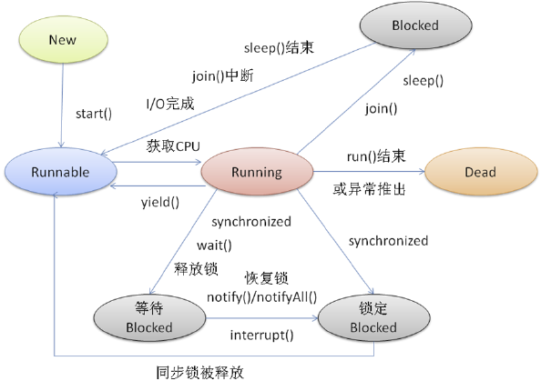

# 第十一章 并发编程

## 并发与并行

很多人都对其中的一些概念不够明确，如同步、并发等等，让我们先建立一个数据字典，以免产生误会。

- 多线程：指的是这个程序（一个进程）运行时产生了不止一个线程
- 并行与并发：
  - 并行：多个cpu实例或者多台机器同时执行一段处理逻辑，是真正的同时。
  - 并发：通过cpu调度算法，让用户看上去同时执行，实际上从cpu操作层面不是真正的同时。并发往往在场景中有公用的资源，那么针对这个公用的资源往往产生瓶颈。


> java的多线程实际上在多核cpu的情况下是在并发与并行之间进行切换。


## 进程与线程

进程与线程都和并行和并发有关系，都是对计算机资源的一种划分单位，但是区别是：

- 进程所划分的内存空间在进程之间是不可共享的，例如qq的内存空间不可能给java虚拟机访问

  j进程是操作系统进行资源分配和调度的一个独立单位

- 线程是程序执行中一个单一的顺序控制流程，是程序执行流的最小单元，是处理器调度和分派的基本单位。

  一个进程可以存在多个线程，各个线程之间可以共享程序的内存空间，当然就可以共享一些数据。

- 进程之间的切换开销较大，因为内存和硬盘根本无法跟得上cpu指针的切换速度，所以导致了进程间的切换极为缓慢，那么这样就失去了切换的意义，不如串行执行。


## 线程的生命周期

### 对象生命周期：

在程序开发中，将一个对象从实例化完成，到这个对象使用结束并销毁。

### 线程生命周期：

一个线程被实例化完成，到这个线程销毁，中间的过程。

### 线程的状态：

#### 1.新生态：New

一个线程对象的实例化完成，但是没有做任何的操作。

#### 2.就绪态：Runnable

一个线程已经被开启，已经开始争抢cpu时间片。

#### 3.运行态：Running

一个线程抢到了CPU时间片，开始执行这个线程中的逻辑代码。

#### 4.阻塞态：Blocked

一个线程在运行过程中，受到某些操作的影响，放弃了已经获取到的CPU时间片，并且不再参与CPU时间片的

争夺，此时线程处于挂起状态。

#### 5.死亡态: Dead

一个线程对象需要被销毁




## 线程的开辟方式

### 1.继承Thread类

```java
package com.neuedu;

public class ThreadDemo1 {
	
	public static void main(String[] args) {
		//创建线程对象，使得线程完成New状态
		MyThread myThread = new MyThread();
		//调用start方法，线程进入Runnable状态
		myThread.start();
		
		System.out.println("主线程执行完毕");
		
	}
}

class MyThread extends Thread{

	@Override
	public void run() {
		for(int x= 0;x<10;x++) {
			System.out.println(Thread.currentThread()+":"+x);
		}
	}
	
	
}
```

### 2.实现Runnable接口

```java
package com.neuedu;

public class ThreadDemo1 {
	
	public static void main(String[] args) {
		
		//创建runnable接口实例
		Runnable runable = ()->{
			for(int x= 0;x<10;x++) {
				System.out.println(Thread.currentThread().getName()+":"+x);
			}
		};
		
		//创建线程 New
		Thread thread = new Thread(runable);
		
		//启动线程 Runnable
		thread.start();
		
		System.out.println("主线程执行完毕");
		
	}
}
```

### 二者的优劣：

​	显然第二种更加灵活，因为java可以多实现，但不能多继承

## 线程常用方法

### 1.线程命名

```java
Thread thread = new Thread(runable,"custom");
thread.setName("custom");
```

### 2.线程的休眠

调用Thread静态方法sleep进行线程休眠，`sleep(long millisecond)`接收一个毫秒值，并且需要捕获异常`InterruptedException`异常

> 当线程sleep之时，就会放弃线程的cpu时间片使用权，线程进入到阻塞状态

```java
public class ThreadDemo1 {
	
	public static void main(String[] args) {
		
		//创建runnable接口实例
		Runnable runable = ()->{
			for(int x= 0;x<10;x++) {
				try {
					Thread.sleep(1000);
				} catch (InterruptedException e) {
					e.printStackTrace();
				}
				System.out.println(Thread.currentThread().getName()+":"+x);
			}
		};
	
		Thread thread = new Thread(runable,"custom");
		
		thread.start();
		
		System.out.println("主线程执行完毕");
		
	}
}
```

### 3.线程的优先级

> 设置线程的优先级，只是修改这个线程抢到cpu时间片的概率
>
> 并不是优先级高的线程一定能抢到时间片

优先级的设置是0-10的整数，默认是5

> 由于两个线程都是Runnable状态，假定在单核cpu的情况下，二者是必须要争抢cpu时间片的，那么此时二者就是在执行态和就绪态之间来回切换。

```java
public class ThreadDemo1 {
	
	public static void main(String[] args) {
		
		setPriority();
	}
	
	
	public static void setPriority() {
		Runnable r = ()->{
			for(int x= 0;x<100;x++) {
				System.out.println(Thread.currentThread().getName()+":"+x);
			}
		};
		
		Thread t1 = new Thread(r,"thread1");
		Thread t2 = new Thread(r,"thread2");
		t1.setPriority(1);
		t2.setPriority(10);
		t1.start();
		t2.start();
	}
}
```

### 4.线程的礼让

线程礼让：指的是当前线程在Running状态下释放自己的cpu资源，由运行状态，回到就绪状态

```java
public static void main(String[] args) {

    threadYield();
}


public static void threadYield() {
    Runnable r1 = ()->{
        for(int x= 0;x<10;x++) {
            System.out.println(Thread.currentThread().getName()+":"+x);
        }
    };
    Runnable r2 = ()->{
        Thread.yield(); //释放执行权
        for(int x= 0;x<10;x++) {
            System.out.println(Thread.currentThread().getName()+":"+x);
        }
    };
    new Thread(r2,"礼让线程").start();
    new Thread(r1,"普通线程").start();
}
```

> 注意：在cpu性能非常强的状态下，礼让线程有可能先执行完，这很正常，多核cpu根本不需要礼让，cpu忙的过来。

## 临界资源问题

临界资源问题就是线程安全问题

> 思考以下用例：
>
> 四个售票员在同时售票，而票是有限的。

```java
public class TicketSale {
	int num = 10;
	
	
	public static void main(String[] args) {
		TicketSale ticketSale = new TicketSale();
		//模拟四个售票员同时卖票
		Runnable r= ()->{
			while(ticketSale.num>0) {
				ticketSale.num--;
				System.out.println(Thread.currentThread().getName()+":卖出1张，剩余:"+ticketSale.num);
			}
			
		};
		
		new Thread(r,"赵丽华").start();
		new Thread(r,"陈秀莲").start();
		new Thread(r,"王美丽").start();
		new Thread(r,"李淑芬").start();
	}
}
```

> 以上代码执行时，会发现当多个线程在操作一个成员变量时，就会发生执行结果错误，因为代码在执行过程中，可能会从Running状态切换回Runnable状态，而这时候已经

## `synchronized`关键字

synchronized关键字持有的锁是互斥锁,synchronized加锁的方法就是一个原子操作

> 思考以下代码的执行结果
>
> ```java
> public class Run1 implements Runnable {
> 
> 	public static void main(String[] args) {
>         Run1 r = new Run1();
>         for (int i = 0;i<5;i++) {
>         	new Thread(r,"Thread"+i).start();
>         }
> 	}
> 
> 	private int count=10;
> 	
> 	@Override
> 	public void run() {
> 		count--;
> 		System.out.println(Thread.currentThread().getName()+",count:"+count);
> 		
> 	}
> }
> 
> /*
> Thread1,count:7
> Thread3,count:6
> Thread0,count:7
> Thread4,count:5
> Thread2,count:7
> 
> */
> ```
>
> 


```java
private int count = 10;
private Object  o =new Object();
public void m(){
    
    //这里o的对象就是锁，注意o指向的堆内存对象中会记录这一点，而不是引用
    synchronized(o){
        count++;
        sop(Thread.currentThread().getName()+"count="+count);
    }
}

//--------------------------------------------
//用this作为锁对象，注意，锁的是对象，不是代码，就好比代码是厕所，要想用厕所并且不受干扰，你要拿着锁也就
//是对象把门锁了
private int count = 10;
public void m(){
    
    //如果单独创建一个对象当做锁的话，实在是浪费资源，而this指向的也是对象，所以正好用上
    synchronized(this){
        count++;
        sop(Thread.currentThread().getName()+"count="+count);
    }
}
//-----------------------------------------------
//直接声明在方法上的锁，等同于将对象作为锁
private int count = 10;

public synchronized /*这里等同于锁定this对象*/ void m(){
    count++;
    sop(Thread.currentThread().getName()+"count="+count);
}

//-----------------------------------------------
public synchronized /*这里等同于锁定Class对象*/ static void m(){
    count++;
    sop(Thread.currentThread().getName()+"count="+count);
} 	
//上面代码相当于如下
public static void mm(){
    synchronized(T.class){
        count++;
    }
}

```

