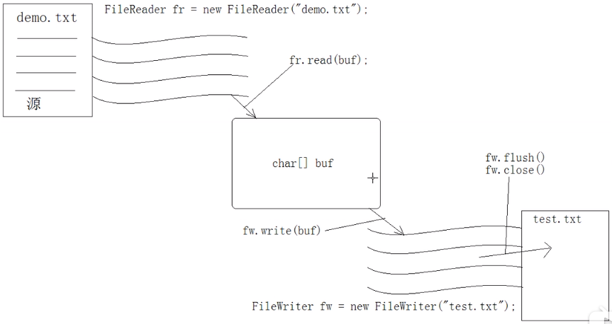

# 第十二章 IO流

## 1.定义与作用

**io流**：数据的input和output

​	将数据从一个存储介质当中读取到内存中，再将其写入给另一个存储介质或者控制台、其他互联网中的设备，这就是io流

存储介质多种多样：本地计算机硬盘、远程客户端或服务端。

**input**：读取数据。

**output**：输出数据。

> 输入流和输出流都是相对于内存而言，什么内存，jvm的内存。先把数据读取到jvm的内存空间下这是输入流，将jvm内存中的数据输入到别的地方，那就是输出流。

## 2.字节流与字符流

**字节流**：处理任何内容的数据。

**字符流**：处理文本数据。字符流实际上还是将字节转换成字符，那么必然牵扯到编码问题。说白了，字符流内部会将字节根据编码表转换成文字，再对文字进行操作。

### IO流体系

字节流抽象基类：`InputStream`，`OutputStream`

字符流抽象基类：`Reader` ，`Writer`

### 2.1 字符流

> 需求：将一些文字存储到硬盘的一个文件中
>
> 分析：1.处理文字优先考虑字符流
>
> 2.要进行输出操作，就要用Writer，操作文件当然是用FileWriter

> **java io体系命名特点**：后缀为writer和reader的就是字符流，是stream的就是字节流，前缀是具体功能。

```java
package com.neuedu;

import java.io.FileWriter;
import java.io.IOException;

public class FileWriterDemo {
	public static void main(String[] args) throws IOException {
		
		//创建一个FileWriter对象
		//要明确存储数据的目的地
		// 之所以抛出异常，有可能读不到文件
		//如果文件存在，会被覆盖
		FileWriter fw = new FileWriter("demo.txt");

		//写入数据
		fw.write("我靠，关了数据就有");
		// 数据其实写入到了一个临时存储缓冲区中，
		//立即刷新，将数据写入文档中
		//fw.flush();
		
		//切记一定要关闭，因为我们在使用操作系统的io资源，你不关就占用了windows的io资源
		//关闭的时候，自动执行flush
		fw.close();
		
		//关闭后，流就不能使用了
		//fw.write("123");
	}
}

```

> 注意：flush与close的区别就像你打开一个记事本，点保存就是flush，点关闭保存就是close

> windows换行问题，windows记事本的换行符是\r,所以为了保证操作系统兼容性，我们要用\r\n，或者是用System.lineSeparator(）获取jvm所在系统的读取到的静态常量
>
> ```java
> fw.write("我靠，关了数据就有\r\n 换行了");
> ```

### 2.2 文件续写

如果直接继续文件，会覆盖原来的内容,通过构造函数设置append为true可以实现续写。

```java
FileWriter fw = new FileWriter("demo.txt",true);
```

### 2.3 IOException处理

```java
public static void main(String[] args) {
    FileWriter fw = null;
    try {
        fw = new FileWriter("demo.txt", true);
        fw.write("我靠，关了数据就有" + System.lineSeparator() + "换行了");
    } catch (IOException e) {
        e.printStackTrace();
    } finally {
        try {
            fw.close();
        } catch (IOException e) {
            e.printStackTrace();
        }
    }
}
//---------------
//jdk1.7 以后
try (FileWriter fw = new FileWriter("demo.txt",true)){
    fw.write("我靠，关了数据就有"+System.lineSeparator()+"换行了");
    fw.close();
} catch(IOException e) {
    e.printStackTrace();
}
```

思考以上代码就一定靠谱吗？

**注意**:如果fw对象创建失败，能执行fw.close()吗？因此需要加上空指针异常,try-catch-resourse不用管

```java
catch (IOException|NullPointerException e)
```

### 2.4 文件读取

> 需求，读取一个文本文件，将读取到的文件打印到控制台
>
> 分析：读需要用输入流，FileReader

#### 第一种读取方式

```java
public static void main(String[] args) throws IOException {
    //1. 创建读取字符数据的流对象
    FileReader fr = new FileReader("demo.txt");

    //2 .调用read方法读一个字符
    int a = fr.read();
    System.out.println((char)a);//a
    int b = fr.read();
    System.out.println((char)b);//b
    int c = fr.read();
    System.out.println(c); //-1 返回-1代表数据读取结束了，因为char中没有负数
}
```

**注意**：读取数据结尾会返回-1，代表数据读取完毕

以上代码显然不行，需要循环读

```java
public static void main(String[] args) throws IOException {
    //1. 创建读取字符数据的流对象
    FileReader fr = new FileReader("demo.txt");

    //2 .调用read方法读一个字符
    int ch = 0;
    while((ch= fr.read())!=-1) {
        System.out.println((char)ch);
    }
}
```

#### 第二种读取方式

用char数组来读取

```java
public int read(char[] cbuf) throws IOException
```

```java
public static void main(String[] args) throws IOException {
    //1. 创建读取字符数据的流对象
    FileReader fr = new FileReader("demo.txt");

    //2 .以读取char数组的方式
    char[] arr = new char[3];
    int len = fr.read(arr);
    System.out.println(len+":"+new String(arr));//3:abc
    len =  fr.read(arr);
    System.out.println(len+":"+new String(arr));//	2:dec
    len =  fr.read(arr);
    System.out.println(len+":"+new String(arr));//-1:dec
    fr.close();
}
```

循环读取，并且修改数组大小一次读完

```java
public static void main(String[] args) throws IOException {
    //1. 创建读取字符数据的流对象
    FileReader fr = new FileReader("demo.txt");

    //2 .以读取char数组的方式
    char[] arr = new char[10];
    int len  =0;
    while((len=fr.read(arr))!=-1) {
        System.out.println(new String(arr,0,len));
    }
    fr.close();
}
```

> 注意数组的长度一般设为1024

### 2.5 文件读写

>  需求：将一个文件复制到另一个地方

```java
public static void main(String[] args) {
    try(FileWriter fw = new FileWriter("d:/demo.txt");
        FileReader fr = new FileReader("demo.txt")) {
        //读取文件，写文件
        char[] temp = new char[1024];
        int len = 0;
        while((len=fr.read(temp))!=-1) {
            fw.write(temp, 0, len);
        }
    } catch (IOException e) {
        e.printStackTrace();
    }

}
```

##### 读写原理



## 3.字符流缓冲区

> 我们之前写的char[]数组就是缓冲区，而java默认帮我们实现了含有缓冲区的输入输出流对象

### BufferedWriter BufferedReader

java提供的缓冲对象效率很高

### 3.1 文件写入

```java
public static void main(String[] args) throws IOException {
		
		//创建BufferdWriter对象,并和指定的字符流关联
		FileWriter fw = new FileWriter("demo.txt");
		BufferedWriter bw = new BufferedWriter(fw);
		
		//使用缓冲区的写入方法，将数据写入到缓冲区
		bw.write("aaaaaaaa");
		bw.newLine();//单独给你换行
		bw.write("bbbbbbb");
		
		//刷新
//		bw.flush();
		
		
		//关闭资源，注意会带着字符流一起关闭
		bw.close();
	}	
```

### 3.2 文件读取

```java
public static void main(String[] args) throws IOException {
    //创建BufferedReader对象，并且将字符流包装进去
    BufferedReader br = new BufferedReader(new FileReader("demo.txt"));

    /*
		 * System.out.println(br.readLine()); System.out.println(br.readLine());
		 * System.out.println(br.readLine());
		 */
    String rs= null;
    //readline方法直接读取一整行数据
    while((rs=br.readLine())!=null) {
        System.out.println(rs);
    }
}
```

> 注意：缓冲区读取数据是从缓冲区里读的，而普通的读取流式从硬盘直接取得

### 3.3 文件复制

```java
public static void main(String[] args) {

    try (BufferedWriter bw = new BufferedWriter(new FileWriter("d:/demo.txt"));
         BufferedReader br = new BufferedReader(new FileReader("demo.txt"))) {
        String temp = null;
        while ((temp = br.readLine()) != null) {
            bw.write(temp);
            bw.newLine();
        }
    } catch (IOException e) {
        e.printStackTrace();
    }

}
```

