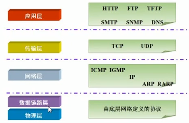
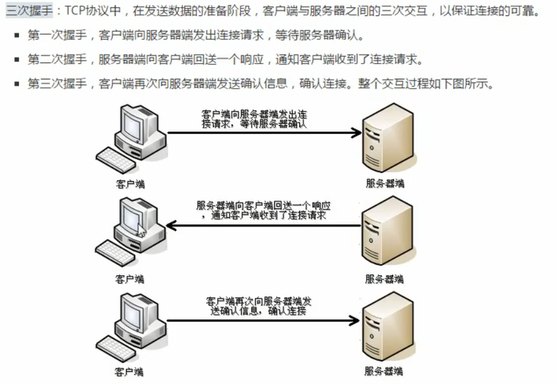
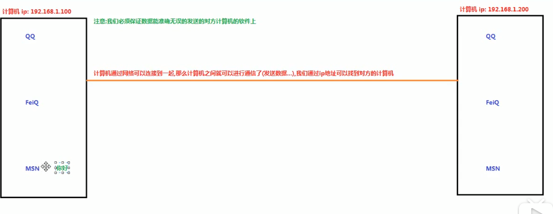

# 第十四章 网络编程

## 1.网络通讯协议

它对数据的传输格式，传输速率，传输的步骤等做了统一规定，通讯双方必须遵守才能完成数据交换。

### 1.1 TCP/IP协议

传输控制协议



### 1.2 传输层协议分类

#### TCP:

TCP面向连接，提供了全面的错误控制和流量控制，TCP具有可靠性。TCP有ACK（acknowledge），有握手动作。还能进行数据重新排序，TCP多用于实时性交互不强，并且对数据安全性有较高要求的场景。



#### UDP:

UDP是个无连接协议，错误控制也简单很多，UDP具有速度。适合于没有过多错误检测，或者自己实现错误检测的程序去使用。UDP多用于数据实时交互性强的场景，比如聊天，广播，游戏，视频直播等。

> 无连接：主机1向主机2直接发送数据包，不保证包的顺序和完整性，主机2收到数据后不用向主机返回ack码，直接处理数据。

### 1.3 TCP/IP三要素

#### 协议

不仅包括传输层协议的确定，还有应用层的协议封装

#### IP地址

指互联网协议地址，俗称IP，这是一个逻辑寻址符，并不是真正的物理MAC地址，它只是相当于给每台处于网络中的计算机分配了一个唯一标识号，类似于电话号码。

##### IP地址分类：

- IPV4：是一个32位的二进制数，通常分为四个字节，例如`192.168.222.221`
- IPV6:  128位二进制，每16位为一组，分成8组十六进制数，`ABCD:EF01:2345:6789:ABCD:EF01:2345:6789`

##### 常用命令

```BASH
WINDOWS :ipconfig
LINUX:ifconfig
```

```BASH
ping 
```

127.0.0.1 与localhost分别代表本地主机的IP地址和默认DNS映射

#### 端口号

往往用于确定访问的具体应用层程序，通过端口号可以将数据传递给特定的应用程序。



端口号由两个字节组成，因此取值范围0-65535

常用的端口号：

```
80:http服务端口，21:FTP服务端口 110:POP3邮箱服务端口 22:ssh端口
```

## 2 TCP通信程序

TCP通信能实现计算机之间的数据交互，通信的两端，要严格区分客户端与服务端

两端通信步骤：

1. 服务端程序：需要事先启动，等待客户端连接。
2. 客户端主动连接服务器，连接成功才能通信，服务端不可以主动连接客户端。

在java中，提供了两个类用于实现TCP通信程序：

1. 客户端：`java.net.Socket`类表示，创建`Socket`对象。向服务端发出请求连接，服务端响应请求，两者建立连接开始通讯。
2. 服务端：`java.net.ServerSocket`类表示，创建`ServerSocket`对象，相当于开启一个服务，并等待客户端的连接。

```java
package com.neuedu;

import java.io.IOException;
import java.io.InputStream;
import java.io.OutputStream;
import java.net.Socket;
import java.net.UnknownHostException;

/**
 * TCP通信客户端：向服务器发送连接请求，给服务器发送数据，读取服务器回写的数据 
  *  表示客户端的类：java.net.Socket:此类实现客户端套接字，套接字包含了IP地址和端口号，说白了就是一个网络通讯单位
  *  构造方法：Socket(String host,int port) 创建一个流套接字并将其连接到主机端口
  *  成员方法：getOutputStream() 返回此套接字输出流
  *  getInputStream() 返回套接字输出流
  *  close() 关闭套接字 
 */
public class TcpClient {

	public static void main(String[] args) throws UnknownHostException, IOException {
		//1.創建一个客户端套接字对象，并指定服务器地址和端口号
		Socket socket = new Socket("127.0.0.1",8888);
		//2.获取向网络发送数据的输出流对昂
		OutputStream os = socket.getOutputStream();
		//3.用输出流写一些数据
		os.write("你好，服务器".getBytes());
		
		//4.获取服务器回写数据的输入流
		InputStream in = socket.getInputStream();
		//5.通过输入流读取数据
		byte[] bytes = new byte[1024];
		in.read(bytes);
		System.out.println(new String(bytes));
		//6 关闭套接字资源
		socket.close();
	}
}

```

```java
package com.neuedu;

import java.io.IOException;
import java.io.InputStream;
import java.io.OutputStream;
import java.net.ServerSocket;
import java.net.Socket;

/**
 *  服务器接收客户端的请求
 * @author bbzha
 *
 */
public class TCPServer {
	
	public static void main(String[] args) throws IOException {
		//创建服务器套接字
		ServerSocket serverSocket = new ServerSocket(8888);
		Socket socket = serverSocket.accept();
		InputStream in = socket.getInputStream();
		byte[] bytes = new byte[1024];
		in.read(bytes);
		System.err.println(new String(bytes));
		
		OutputStream os = socket.getOutputStream();
		os.write("你好，客户".getBytes());
		socket.close();
		serverSocket.close();
	}
}

```

## 3 模拟一个web服务器

​	客户端输入一个地址，服务器返回一个html文本

```java
package com.neuedu.web;

import java.io.BufferedReader;
import java.io.File;
import java.io.FileInputStream;
import java.io.IOException;
import java.io.InputStream;
import java.io.InputStreamReader;
import java.io.OutputStream;
import java.net.ServerSocket;
import java.net.Socket;

public class WebServer {
	
	public static void main(String[] args) throws IOException {
		
		ServerSocket server = new ServerSocket(8080);
		while(true) {
			Socket socket= server.accept();
			InputStream in = socket.getInputStream();
			BufferedReader reader = new BufferedReader(new InputStreamReader(in));
			String metaInfo = reader.readLine();
			String[] arr = metaInfo.split(" ");
			String source = arr[1];
			OutputStream out = socket.getOutputStream();
			File file = new File("d:/source"+source);
			if(file.exists()) {
				FileInputStream fis = new FileInputStream("d:/source"+source);
				
				//返回http响应必须的信息
				out.write("HTTP/1.1 200 OK\r\n".getBytes());
				out.write("Content-type:text/html\r\n".getBytes());
				out.write("\r\n".getBytes());
				//将文件输入流写入网络输出流
				int len = 0;
				byte[] temp = new byte[1024];
				while((len = fis.read(temp))!=-1){
					out.write(temp,0,len);
				}
				fis.close();
			}else {
				out.write("HTTP/1.1 404 not found\r\n".getBytes());
				out.write("Content-type:text/html\r\n".getBytes());
				out.write("\r\n".getBytes());
				out.write("404,没有此资源".getBytes());
			}
			
			socket.close();
		}
		
		
	}
}

```

