# 第十章 集合

## 1.集合类

集合就是一种存储数据的集合，之前学习过的集合：数组，StringBuffer，对象

### 1.1 为什么要用集合？

集合用于用来存储对象，对象多了需要存储，如果对象的个数不确定，就是用集合容器进行存储

```java
//存一组数据 11,10,404,1
使用数组
//存字符串，张三 true 3434 
使用StringBuffer
//存一个人 姓名：李四，年龄：23
使用对象Person
//存多个对象Person
使用数组存，但是用集合存更好，集合存的是对象的地址
```

> 集合用于存储对象，实际上是存储对象的地址
>
> 那这些对象的地址如何在集合中排列呢？那就不一定来了，每个集合的排列方式不同。

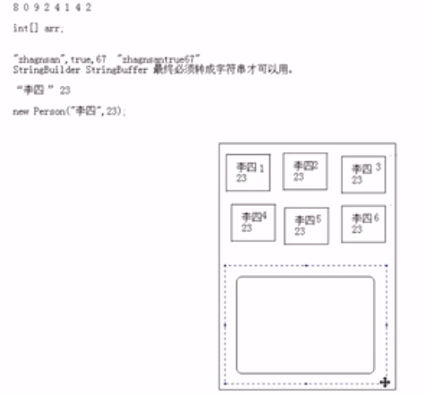

> 为什么不拿数组存对象呢？
>
> 因为数组是固定长度，而集合是可变长度

### 1.2 集合的特点

1. 用于存储对象的容器
2. 集合的长度是可变的
3. 集合中不可以存储基本数据类型值

### 1.3 集合的体系

> 集合用很多种，每种不同的集合存储对象的方式不同，也就是底层的数据结构不同
>
> 举例子：水杯是容器，但是水杯分很多种，茶杯带茶筛，普通水杯没盖子
>
> 容器分为盒子，箱子，柜子，而每一种内部还有很多种，例如盒子有铅笔盒，饭盒，有的内部不带格子，有的带，这就需要对这类事物进行抽象描述，那么也就形成了容器的体系
>
> 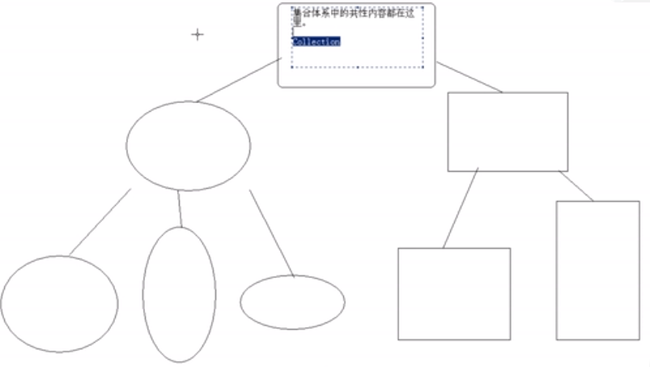

### 1.4 Collection

[^]: 参考java.util.Collection doc

集合容器因为内部的数据结构不同，有很多种容器，因此需要不断的向上抽取，就形成了集合体系。

集合体系的顶层是Collection

#### 1.4.1 常见方法

##### 添加

- boolean  add(E e) 添加一个集合
- boolean addAll(Collection coll) 将一个集合添加到另一个集合中

##### 删除

- boolean remove(Object obj); 删除一个指定元素
- boolean removeAll(Collection coll) 清空一个集合中含有另一个集合相同元素的部分
- void clear()  清空集合

##### 判断

- boolean contains(Object o) 集合是否包含一个元素
- boolean containsAll(Collection coll) 集合是否包含另一个集合
- boolean isEmpty()  集合是否有元素

##### 获取

- int size() 	获取集合长度
- Iterator iterator() 返回迭代器对象，用于获取集合中的元素

##### 其他

- boolean retainAll(Collection coll) 取两个集合中的交集。
- Object[] toArray() 将集合转成数组

```java
import java.util.ArrayList;
import java.util.Collection;

/**
 * CollectionDemo
 */
public class CollectionDemo {

    public static void main(String[] args) {
        Collection coll = new ArrayList();
        show(coll);
    }

    public static void show(Collection coll) {

        // 添加
        coll.add("abc1");
        coll.add("abc2");
        coll.add("abc3");
        coll.add("abc4");
        System.out.println(coll);
        // 删除
        coll.remove("abc1");//删除会改变集合的长度
        System.out.println(coll);

        //清空
        coll.clear();
        System.out.println(coll);

        //包含
        System.out.println(coll.contains("abc4"));


    }
}
```

```java
public static void show(Collection c1,Collection c2){
        //给c1添加元素
        c1.add("abc1");
        c1.add("abc2");
        c1.add("abc3");
        c1.add("abc4");

        //给c2添加元素
        c2.add("abc2");
        c2.add("abc5");
        c2.add("abc6");
        c2.add("abc7");
        System.out.println(c1);
        System.out.println(c2);

        c1.addAll(c2);
        System.out.println(c1.containsAll(c2));
        System.out.println(c1);

        c1.removeAll(c2);
        System.out.println(c1);

        boolean b= c1.retainAll(c2);
        System.out.println(b);
        System.out.println(c1);

    }
```

#### 1.4.2 Iterator 迭代器

用去取出集合中的元素。一个一个取

[^]: 参考Iterator Api doc

```java
Collection coll = new ArrayList();
coll.add("abc1");
coll.add("abc2");
coll.add("abc3");
coll.add("abc4");  

Iterator it = coll.iterator();
System.out.println(it.next());//abc1
System.out.println(it.next());//abc2
System.out.println(it.next());
System.out.println(it.next());
System.out.println(it.next());//java.util.NoSuchElementException

//使用while打印
while(it.hasNext()){
    System.out.println(it.next());
}

//使用for循环，好处是it是局部代码块中的变量，用完引用变量就释放，而对象等待垃圾回收
for (Iterator it = coll.iterator();it.hasNext();){
    System.out.println(it.next());
}
```

##### 迭代器原理

> 每种容器取数据的方式不用，因为数据结构不同
>
> 而迭代器是取容器中的容器，因此每种容器有不同的迭代器实现
>
> 往往都是内部类，例如这是ArrayList的迭代器内部类	：
>
> ```java
> private class ListItr extends Itr implements ListIterator<E>
> ```

迭代器接口示意图

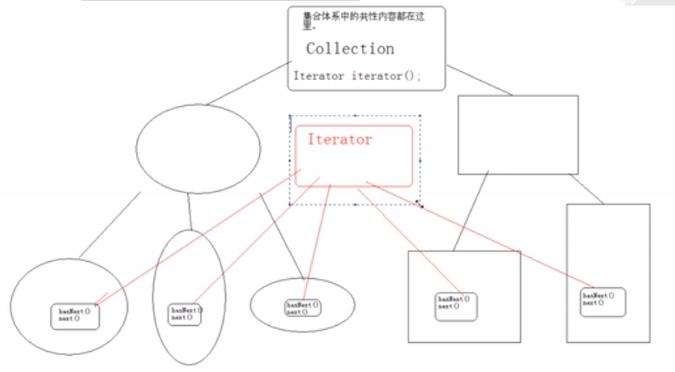

> 根据抓娃娃机来解释迭代器的对象设计
>
> 爪子就是迭代器，娃娃机就是容器，怎么抓娃娃，每种娃娃机不一样，所以爪子应该作为内部类的定义，而且这个爪子出了娃娃机就失去意义了，你没法直接访问爪子
>
> 

**结论**：

迭代器对象必须依赖于容器，因为每一个容器的数据结构不同，所以迭代器对象实在容器内部由内部类形式描述的。对于使用容器者而言，具体的实现不重要，只要通过容器获取到迭代器对象，来调用迭代器方法。

Iterator接口是对所有的Collection容器进行元素取出的公共接口。

## 2 List和Set

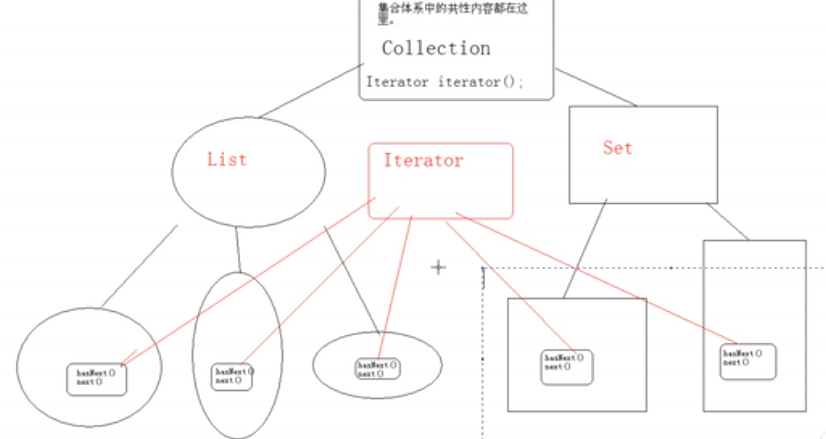

Collection:

​	|-- List: 有序：存入和取出的顺序一致，元素都有索引，元素可以重复

​	|-- Set: 元素不能重复，无序。

### 2.1 List常见方法

List特有的方法有一个共性特点：都可以操作角标

#### 添加

​	void add(index,element)

​	boolean addAll(int index,Collection)

#### 删除

​    Object  remove(index)

#### 修改

​	Object set(index,element)

#### 获取

​	Object get(index)

​	int indexOf(Object)

​	int lastIndexOf(Object)

​	List subList(from,to)

```java
package com.neuedu;

import java.util.ArrayList;
import java.util.List;

public class ListDemo1 {

	public static void main(String[] args) {
		List list = new ArrayList();
		show(list);
	}

	private static void show(List list) {
		list.add("abc1");
		list.add("abc2");
		list.add("abc3");
		list.add("abc4");
		
		//1.添加
		list.add(1,"abc5");
		System.out.println(list);//[abc1, abc5, abc2, abc3, abc4]
		
		List list2 = new ArrayList();
		list2.add("abc6");
		list2.add("abc7");
		list.addAll(1,list2);
		System.out.println(list);//[abc1, abc6, abc7, abc5, abc2, abc3, abc4]
		
		//2.删除
		System.out.println(list.remove(1));//abc6
		System.out.println(list);//[abc1, abc7, abc5, abc2, abc3, abc4]
		
		//3.修改
		System.out.println(list.set(1, "abc8"));//abc7
		System.out.println(list);//[abc1, abc8, abc5, abc2, abc3, abc4]
		
		//获取
		System.out.println(list.get(0));//abc1
		//System.out.println(list.get(10));//java.lang.IndexOutOfBoundsException: Index: 10, Size: 6
		
		System.out.println(list.subList(0, 3));//[abc1, abc8, abc5]
		
	}
}

```

结论：List集合可以对元素进行增删查改

### 2.2 ListIterator接口

[^]: 具体参考doc

#### list的迭代三种方式

```java
// 迭代器
for (Iterator it = list.iterator(); it.hasNext();) {
    System.out.println(it.next());
}
//for
for (int x = 0; x < list.size(); x++) {
    System.out.println(list.get(x));
}
// 增强for循环
for(Object obj:list) {
    System.out.println(obj);
}
```

#### Iterator的局限性

Iterator接口不能同时取和存

```java
//Exception in thread "main" java.util.ConcurrentModificationException
//以下代码会报错，原因是不能一边取一边迭代，这是迭代器接口的局限性
Iterator iterator = list.iterator();
while(iterator.hasNext()) {
    if("abc2".equals(iterator.next())) {
        list.add("abc5");
    }
}
```

#### ListIterator子接口的使用

ListIterator可以在迭代过程中完成对元素的增删改查

> **注意**：只有List结合具备该迭代功能

```java
System.out.println(list);
ListIterator iterator = list.listIterator();//[abc1, abc2, abc3, abc4]
while(iterator.hasNext()) {
    if("abc2".equals(iterator.next())) {
        iterator.add("abc5");
    }
}
System.out.println(list);//[abc1, abc2, abc3, abc4,abc5]
```

##### 逆向迭代

```java
ListIterator iterator = list.listIterator(list.size());
while(iterator.hasPrevious()) {
    System.out.println(iterator.previous());
}
```

### 2.3 List常用子类

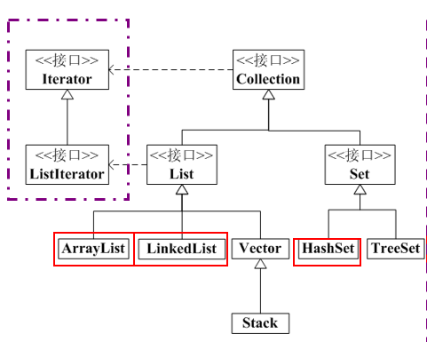

List:

​	--| Vector: 内部是数组数据结构。是同步线程安全的。增删查询都很慢

​	--| ArrayList: 内部是数组数据结构。是不同步的。替代Vector。查询的速度快。

​	--| LinkedList:内部是链表数据结构。是不同步的。增删元素的速度非常快,但是查询慢。

> 可变长度数组的原因就是创建新的数组，将数组复制到新数组中，Vector是100%延长，List是50%延长
>
> 集合中只有Vector是同步的

> 链表数据结构简单说明：
>
> 链表的数据结构好比手拉手，前面元素记住后面元素的地址：
>
> 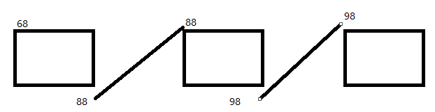
>
> 链表的删除很快，直接将第一个元素的尾部地址指向第三个元素的尾部就行了
>
> 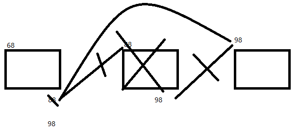
>
> 链表的插入也很快，直接将第一个元素的尾部地址存为插入元素的地址，将插入元素的尾部存为原来这个位置元素的地址
>
> 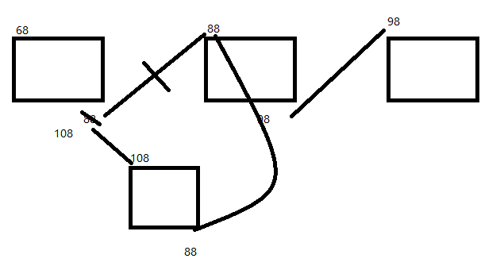

> ArrayList的数据结构特点：
>
> 由于删除或者插入一个元素，要将后面所有的元素进行角标移位，所以牵一发动全身，插入删除都很慢
>
> 但是由于数组和ArrayList在堆内存空间中存储空间是连续的，所以查询特别快
>
> 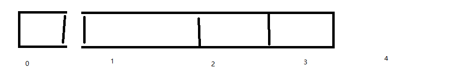

> LindedList和ArrayList查询特点：
>
> LindedList：由于是链表结构，所以查找时要一个个问，并且由于内存空间分散，所以LindedList查询慢
>
> ArrayList：由于数组的内存空间是连续的，所以查询很快。
>
> LindedList也有角标，但是这不代表它是数组
>
> 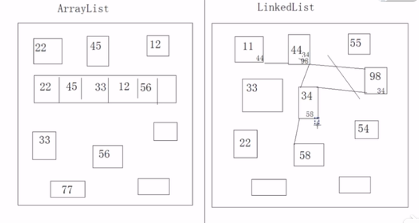

#### 2.3.1 Vector

##### 特有方法

addElement(),capacity(),elementAt(),firstElement(),lastElement(),removeAllElement(),setElementAt(),Elements()

##### elements（）方法

返回一个枚举

```java
public static void vectorShow() {
    Vector v = new Vector();
    v.add("abc1");
    v.add("abc2");
    v.add("abc3");

    Enumeration enu = v.elements();
    while(enu.hasMoreElements()) {
        System.out.println(enu.nextElement());
    }
}
```

#### 2.3.2 LinkedList

特有方法：

##### addFirst 和 addLast

```java
LinkedList list = new LinkedList();
list.addFirst("abc1");
list.addFirst("abc2");
list.addFirst("abc3");
list.addFirst("abc4");
System.out.println(list);//[abc4, abc3, abc2, abc1]
```

##### getFirst

```java
LinkedList list = new LinkedList();
list.addFirst("abc1");
list.addFirst("abc2");
list.addFirst("abc3");
list.addFirst("abc4");
System.out.println(list);//[abc4, abc3, abc2, abc1]
System.out.println(list.getFirst()); // abc4
System.out.println(list.getFirst()); // abc4
```

##### removeFirst

```java
LinkedList list = new LinkedList();
list.addFirst("abc1");
list.addFirst("abc2");
list.addFirst("abc3");
list.addFirst("abc4");
System.out.println(list);//[abc4, abc3, abc2, abc1]
System.out.println(list.removeFirst()); // abc4
System.out.println(list.removeFirst()); // abc3

//--------------------------------
删光所有
while(!list.isEmpty()){
	list.removeFirst()
}
```

结论：存和取得顺序是反的

##### jdk1.6后加入的新方法比较

getFirst peekFirst:当集合中没有元素时，getFirst会报异常：NoSuchElementException，peek返回null

removeFirst pollFirst：获取并移除，remove会报异常：NoSuchElementException，poll返回null


##### 面试题

```java
/*
	请使用LinkedList来模拟一个堆栈或者队列的数据结构
	堆栈：先进后出filo
		
	队列：先进先出fifo
*/
//队列
public class MyQueue {
	private final LinkedList list;

	public MyQueue(LinkedList list) {
		this.list = new LinkedList();
	}
	
	public void add(Object obj) {
		list.addLast(obj);
	}
	
	public Object get() {
		return list.removeFirst();
	}
	
}
//----------------------------------------
// 堆栈
public class MyStack {
	private final LinkedList list;

	public MyQueue(LinkedList list) {
		this.list = new LinkedList();
	}
	
	public void add(Object obj) {
		list.addLast(obj);
	}
	
	public Object get() {
		return list.removeLast();
	}
	
}
```

> 队列示意图
>
> 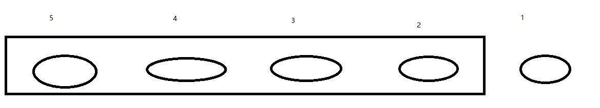

#### 2.3.3 ArrayList

##### 存储自定义对象

```java
package com.neuedu.bean;

public class Person {
	private String name;
	private int age;
	public Person(String name, int age) {
		super();
		this.name = name;
		this.age = age;
	}
	public String getName() {
		return name;
	}
	public void setName(String name) {
		this.name = name;
	}
	public int getAge() {
		return age;
	}
	public void setAge(int age) {
		this.age = age;
	}
}
//--------------
package com.neuedu;

import java.util.ArrayList;
import java.util.Iterator;
import java.util.List;

import com.neuedu.bean.Person;

public class ArrayListDemo {
	public static void main(String[] args) {
		List list = new ArrayList();
		list.add(new Person("lisi",1));
		list.add(new Person("lisi",2));
		list.add(new Person("lisi",3));
		list.add(new Person("lisi",4));
		
		for(Iterator it = list.iterator();it.hasNext();) {
			//这行代码不能按正常顺序迭代，因为调用了两次next（）
			//System.out.println(((Person) it.next()).getName()+":"+((Person) it).getAge());
			Person p = (Person) it.next();
			System.out.println(p.getName()+":"+p.getAge());//或者覆写Person的toString方法
		}
	}
}

```


##### ArrayList内存模型其实和数组一样，都是保存对象的地址


##### ArrayList存不同类型数据

> 不推荐这么干，那样你拿到对象想要调用特殊方法还得进行类型判断，后期用了泛型后，连强转都不需要

```java
public class ArrayListDemo {
	public static void main(String[] args) {
		List list = new ArrayList();
		list.add(new Person("lisi",1));
		list.add(new Person("lisi",2));
		list.add(new Person("lisi",3));
		list.add(new Person("lisi",4));
		
        list.add(5);//这里有个自动装箱的动作，Object o = new Integer(5);
	}
}

```

### 2.4 Set

[^]: 看api

set接口的方法和Collection一致

特点：不能存重复元素

set

​	|-- HashSet：内部数据结构是哈希表(不保证顺序)，是不同步非线程安全，性能稳定

​	|-- TreeSet:  可以对集合中的元素进行指定顺序的排序，内部数据结构为二叉树，有指定顺序，不同步非线程安						全。TreeSet判断元素是否唯一就是根据compareTo方法执行结果，如果为0，就判断相同

```java
HashSet set = new HashSet();
set.add("haha");
set.add("xixii");
set.add("hehe");
set.add("heyhey");
set.add("xixii");//不会重复，只存一个

Iterator it = set.iterator();
while(it.hasNext()) {
    System.out.println(it.next());
}
//haha hehe xixii heyhey 输出顺序与输入顺序不一致
```

### 2.5 HashSet

#### 哈希表原理

简单说：哈希是一种算法，他能算出来很多值，讲这些值存起来就是哈希表，哈希算法对数组进行了优化。

数组的缺点，真要到里面找元素还得使用顺序查表法，折半有前提要有顺序

哈希解决的就是查找速度问题

哈希算法在set中使用的步骤：

1.存储元素时，根据元素特有内容，按照hash算法返回一个index,并在此存储

2.下回取元素的时候，再根据特有内容根据hash算法算出index，再到这个位置上去找

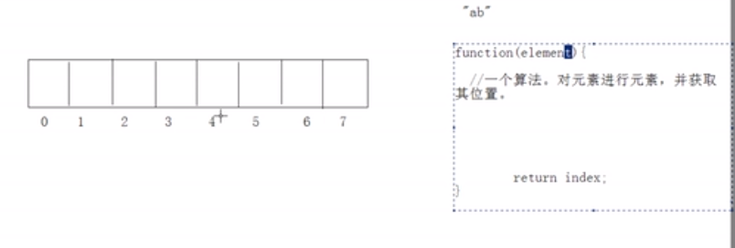

> **注意**：最重要的是，这个hash值其实通过调用对象的hashCode方法获得，
>
> 说白了，HashSet内部其实直接就是调用了对象hashCode方法给他算一个位置index，倘若我们覆盖了hashcode方法，那么就会按照我们的想法存

#### HashSet判断重复的依据

1.首先判断hashcode是否相同

2.如果hashcode值相同，那么再判断内容是否相同通过调用equals方法

例如String类型就是调用它的两个方法

**注意**：如果hashcode已经判断不同了，那就不在判断equals方法

> 思考一个问题，比如ab和ba两个不同字符串，hashcode假定相同，但是内容不同，那存在哪个位置上呢？
>
> 这是hash冲突，一般采用顺延或者串联的方式，放心，使用的时候一般碰不到
>
> 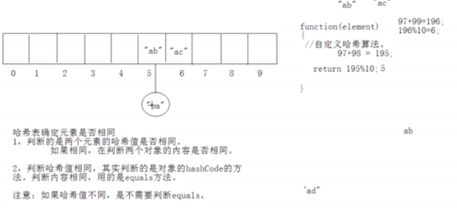

#### 存储自定义对象

往HashSet中存储Person对象，如果年龄和姓名一样，我们就视为同一个人，也就是相同元素

>  注意：为了尽量保证HashSet的效率，应该尽量不要调用equals方法，而只调用hashcode方法，
>
> 1. 可以保证存储的时候不串联
> 2. 第二保证再进行判断重复运算的时候少调用一个方法

```java
public class HashSetDemo {
	public static void main(String[] args) {
		HashSet set = new HashSet();
		set.add(new Person("lisi",12));
		set.add(new Person("wangwu",13));
		set.add(new Person("zhaoliu",17));
		set.add(new Person("tianqi",20));
		set.add(new Person("lisi",12));
		
		
		Iterator it = set.iterator();
		while(it.hasNext()) {
			System.out.println(it.next());
		}
	}
}

public class Person {
	private String name;
	private int age;
	public Person(String name, int age) {
		super();
		this.name = name;
		this.age = age;
	}
	public String getName() {
		return name;
	}
	public void setName(String name) {
		this.name = name;
	}
	public int getAge() {
		return age;
	}
	public void setAge(int age) {
		this.age = age;
	}
	@Override
	public int hashCode() {
		// TODO Auto-generated method stub
		return this.name.hashCode()+this.age;
	}
	@Override
	public boolean equals(Object obj) {
		Person other = (Person) obj;
		return this.name.equals(other.getName())&& this.age==other.getAge();
	}
	
}

//-------------------------------
//为了保证hash值不重复，我们往往会再乘以一个随机数，
//为了保证equals方法的效率和健壮性，我们也会用==号来直接判断地址值，以及对类型进行判断，再强转
@Override
public int hashCode() {
    // TODO Auto-generated method stub
    return this.name.hashCode()+this.age*39;
}
@Override
public boolean equals(Object obj) {
    if(this==obj){
        return true;
    }
    if(!obj instanceof Person){
        return false;
    }
    Person other = (Person) obj;
    if(this.name==null){
        if(other.getName()!=null){
            return false;
        }
    }else if(!this.name.equals(other.getName())){
        return false;
    }
    if(this.age==person.getAge()){
        return true;
    }
    
    return false;
}
//-------------------------------------
//高级编辑器一般会帮你自动覆盖这两个方法
@Override
public int hashCode() {
    final int prime = 31;
    int result = 1;
    result = prime * result + age;
    result = prime * result + ((name == null) ? 0 : name.hashCode());
    return result;
}
@Override
public boolean equals(Object obj) {
    if (this == obj)
        return true;
    if (obj == null)
        return false;
    if (getClass() != obj.getClass())
        return false;
    Person other = (Person) obj;
    if (age != other.age)
        return false;
    if (name == null) {
        if (other.name != null)
            return false;
    } else if (!name.equals(other.name))
        return false;
    return true;
}
```

#### 课堂练习

**知识点考核**：对于不同数据结构的集合，判断元素是否重复是不一致的，对于List，判断元素是否包含的方式是调用equals方法，而对于HashSet，要先调用hashCode然后调用equals

```java
/*
将一个ArrayList中的重复元素去掉
思路：弄一个临时list，将原list中的数据一个个存进来，存进来之前通过containsOf方法进行判断
*/
public class ArrayListDemo {
	public static void main(String[] args) {
		ArrayList list = new ArrayList();
		list.add(new Person("lisi",1));
		list.add(new Person("lisi",2));
		list.add(new Person("lisi",3));
		list.add(new Person("lisi",3));
		list.add(new Person("lisi",4));
		
		System.out.println(delDup(list));
        //[Person [name=lisi, age=1], Person [name=lisi, age=2], Person [name=lisi, age=3], Person [name=lisi, age=4]]
	}
	
	public static ArrayList delDup(ArrayList list) {
		ArrayList result = new ArrayList();
		Iterator it = list.iterator();
		while(it.hasNext()) {
			Person  p = (Person) it.next();
			if(!result.contains(p)) {
				result.add(p);
			}
		}
		return result;
	}
}
//-----------------------------------------------------
//倘若注释掉equals覆盖
//[Person [name=lisi, age=1], Person [name=lisi, age=2], Person [name=lisi, age=3], Person [name=lisi, age=3], Person [name=lisi, age=4]]

```

### 2.6 LinkedHashSet

是HashSet的子类，它是**有顺序**的。实际上链表和哈希表的结合，角标有hash表确定，然后元素之间记录后面的地址

```java
LinkedHashSet set = new LinkedHashSet();
set.add(new Person("lisi",12));
set.add(new Person("wangwu",13));
set.add(new Person("zhaoliu",17));
set.add(new Person("tianqi",20));
set.add(new Person("lisi",12));


Iterator it = set.iterator();
while(it.hasNext()) {
    System.out.println(it.next());
}
```

### 2.7 TreeSet

#### 特点：

可以对集合中的元素进行指定顺序的排序，内部数据结构为二叉树，有指定顺序，不同步非线程安						全。TreeSet判断元素是否唯一就是根据compareTo方法执行结果，如果为0，就判断相同

```java
package com.neuedu;

import java.util.Iterator;
import java.util.TreeSet;

public class TreeSetDemo {
	public static void main(String[] args) {
		TreeSet set = new TreeSet();
		set.add("abc");
		set.add("aa");
		set.add("nba");
		set.add("cba");
		set.add("cba");
		set.add("ab");
		
		for(Iterator  it = set.iterator();it.hasNext();) {
			System.out.println(it.next());
		}
	}
}
//aa ab abc cba nba

```

存自定义类

```java
package com.neuedu;

import java.util.Iterator;
import java.util.TreeSet;

import com.neuedu.bean.Person;

public class TreeSetDemo {
	public static void main(String[] args) {
		TreeSet set = new TreeSet();
		set.add(new Person("lisi",12));
		set.add(new Person("wangwu",13));
		set.add(new Person("zhaoliu",17));
		set.add(new Person("tianqi",20));
		set.add(new Person("lisi",12));
		//set.add(null);//会导致报空指针，所以不要在TreeSet里存null
		
		Iterator it = set.iterator();
		while(it.hasNext()) {
			System.out.println(it.next());
		}
	}
}
/*
Exception in thread "main" java.lang.ClassCastException: com.neuedu.bean.Person cannot be cast to java.lang.Comparable
	at java.util.TreeMap.compare(TreeMap.java:1290)
	at java.util.TreeMap.put(TreeMap.java:538)
	at java.util.TreeSet.add(TreeSet.java:255)
	at com.neuedu.TreeSetDemo.main(TreeSetDemo.java:11)
*/
```

**结论**：在Treeset存入第二个元素的时候，他会将对象转换成Comparable类型，并且调用compareTo方法，如果你们实现这个接口，当然类型转换异常。

TreeSet判断元素是否唯一就是根据compareTo方法执行结果，如果为0，就判断相同

[^]: 参考Comparable接口 doc里的定义

让Person类实现Comparable接口

```java
package com.neuedu.bean;

public class Person implements Comparable{
	private String name;
	private int age;
	public Person(String name, int age) {
		super();
		this.name = name;
		this.age = age;
	}
	public String getName() {
		return name;
	}
	public void setName(String name) {
		this.name = name;
	}
	public int getAge() {
		return age;
	}
	public void setAge(int age) {
		this.age = age;
	}
	@Override
	public int hashCode() {
		final int prime = 31;
		int result = 1;
		result = prime * result + age;
		result = prime * result + ((name == null) ? 0 : name.hashCode());
		return result;
	}

	/*
	 * @Override public boolean equals(Object obj) { if (this == obj) return true;
	 * if (obj == null) return false; if (getClass() != obj.getClass()) return
	 * false; Person other = (Person) obj; if (age != other.age) return false; if
	 * (name == null) { if (other.name != null) return false; } else if
	 * (!name.equals(other.name)) return false; return true; }
	 */
	 
	@Override
	public String toString() {
		return "Person [name=" + name + ", age=" + age + "]";
	}
	
	@Override
	public int compareTo(Object o) {
		//return 0; // 返回0的话，就只能存一个元素，因为都想到代表重复，TreeSet既然是set就要唯一
        //以年龄大小进行排序
        Person p = (Person) o;
		if(this.age>p.getAge()) {
			return 1;
		}else if(this.age<p.getAge()) {
			return -1;
		}
        
		return 0;
        //return this.age -p.getAge();//更简洁
	}
}

```

> 在进行条件比较的时候，要进行主要条件的比较，但是往往仍然不唯一，比如年龄相同，但是姓名不同，不能代表重复，所以必须再进行次要条件判断

```java
//带上次要条件
public int compareTo(Object o) {
    Person p = (Person) o;
    if(this.age>p.getAge()) {
        return 1;
    }else if(this.age<p.getAge()) {
        return -1;
    }else if(this.age==p.getAge()){
        if(this.name!=null&&p.getName()!=null){
            return this.name.compareTo(p.getName());
        }
	}

    return 0;
    //return this.age -p.getAge();//更简洁
}
//-------------------------------
//简写
public int compareTo(Object o) {
    Person p = (Person) o;
    int temp = this.age-o.getAge();
    return temp==0?this.name.compareTo(p.getName()):temp;
}
```

#### Comparator比较器

按照姓名比较

```java
public int compareTo(Object o) {
    Person p = (Person) o;
    int temp = this.name.compareTo(p.getName());
    return temp==0?this.age-p.getAge():temp;
}
```

如果不要按照对象中具备的自然顺序排序，或者这个对象不是你定义的并且没有自然排序（没有实现Comparable）接口怎么办？

那就得让集合本身具有比较功能，传入Comparator比较器

```java
package com.neuedu;

import java.util.Comparator;

import com.neuedu.bean.Person;

/*
定义按照name进行比较的比较器
*/
public class NameComparator implements Comparator {

	@Override
	public int compare(Object o1, Object o2) {
		 Person p1 = (Person) o1;
		 Person p2 = (Person) o2;
		 int temp = p1.getName().compareTo(p2.getName());
		 return temp==0?p1.getAge()-p2.getAge():temp;
	}

}
//----------------------------------------

package com.neuedu;

import java.util.Iterator;
import java.util.TreeSet;

import com.neuedu.bean.Person;

public class TreeSetDemo {
	public static void main(String[] args) {
		TreeSet set = new TreeSet(new NameComparator()); //使用自定义比较器
		set.add(new Person("lisi",12));
		set.add(new Person("wangwu",13));
		set.add(new Person("zhaoliu",17));
		set.add(new Person("tianqi",20));
		set.add(new Person("lisi",12));
	
		
		Iterator it = set.iterator();
		while(it.hasNext()) {
			System.out.println(it.next());
		}
	}
}
```

比较器比较常用点。

#### TreeSet底层数据结构

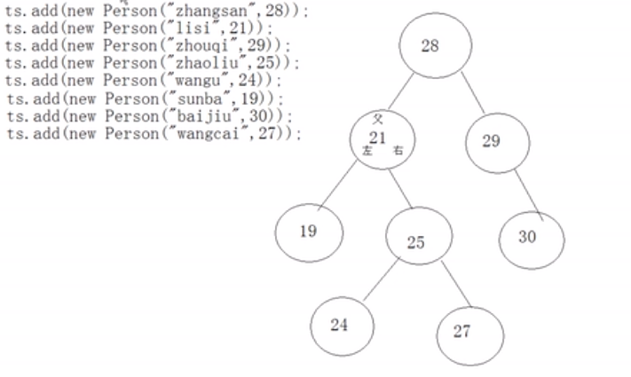

#### 课堂练习

```java
//根据字符串长度进行treeset存储
public class NameComparator implements Comparator {

	@Override
	public int compare(Object o1, Object o2) {
		 String s1 = (String) o1;
		 String s2 = (String) o2;
         int temp=s1.length()-s2.length();
		 return temp==0?s1.compareTo(s2):temp;
	}

}

//自己实现一个能存int的TreeSet
package com.neuedu;

public class MyTreeSet {
	
	Node root;
	 
	private class Node{
		int data;
		Node left;
		Node right;
		public  Node(int data) {
			this.data = data;
		}
	}
	
	private void insert(Node parent,int data) {
		if(parent.data < data) {
			if (parent.right==null) {
				parent.right= new Node(data);
			}else {
				insert(parent.right,data);
			}
		}else if(parent.data > data){
			if(parent.left==null) {
				parent.left = new Node(data);
			}else {
				insert(parent.left,data);
			}
		}else {
			return ;
		}
	}

	
	public void add(int data) {
		if(root==null) 
			root = new Node(data);
		else
			insert(root,data);
	}
	
	public StringBuilder print(Node root,StringBuilder sb) {
		//左中右
		if(root!=null) {
			print(root.left,sb);
			sb.append(root.data).append(",");
			print(root.right,sb);
		}
		return sb;
	}
	
	
	
	
	@Override
	public String toString() {
		return this.print(root,new StringBuilder()).toString();
	}


	public static void main(String[] args) {
		int[] arr=  {10,68,54,2,13,54};
		MyTreeSet tree = new MyTreeSet();
		for(int a:arr) {
			tree.add(a);
		}
		System.out.println(tree);
	}
	
}


```

## 3.Map

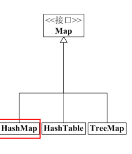