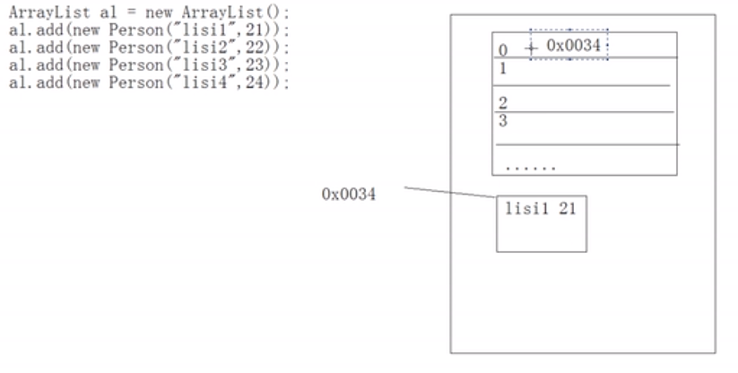

# 第十章 集合

## 1.集合类

集合就是一种存储数据的集合，之前学习过的集合：数组，StringBuffer，对象

### 1.1 为什么要用集合？

集合用于用来存储对象，对象多了需要存储，如果对象的个数不确定，就是用集合容器进行存储

```java
//存一组数据 11,10,404,1
使用数组
//存字符串，张三 true 3434 
使用StringBuffer
//存一个人 姓名：李四，年龄：23
使用对象Person
//存多个对象Person
使用数组存，但是用集合存更好，集合存的是对象的地址
```

> 集合用于存储对象，实际上是存储对象的地址
>
> 那这些对象的地址如何在集合中排列呢？那就不一定来了，每个集合的排列方式不同。


> 为什么不拿数组存对象呢？
>
> 因为数组是固定长度，而集合是可变长度

### 1.2 集合的特点

1. 用于存储对象的容器
2. 集合的长度是可变的
3. 集合中不可以存储基本数据类型值

### 1.3 集合的体系

> 集合用很多种，每种不同的集合存储对象的方式不同，也就是底层的数据结构不同
>
> 举例子：水杯是容器，但是水杯分很多种，茶杯带茶筛，普通水杯没盖子
>
> 容器分为盒子，箱子，柜子，而每一种内部还有很多种，例如盒子有铅笔盒，饭盒，有的内部不带格子，有的带，这就需要对这类事物进行抽象描述，那么也就形成了容器的体系
>
> 

### 1.4 Collection

[^]: 参考java.util.Collection doc

集合容器因为内部的数据结构不同，有很多种容器，因此需要不断的向上抽取，就形成了集合体系。

集合体系的顶层是Collection

#### 1.4.1 常见方法

##### 添加

- boolean  add(E e) 添加一个集合
- boolean addAll(Collection coll) 将一个集合添加到另一个集合中

##### 删除

- boolean remove(Object obj); 删除一个指定元素
- boolean removeAll(Collection coll) 清空一个集合中含有另一个集合相同元素的部分
- void clear()  清空集合

##### 判断

- boolean contains(Object o) 集合是否包含一个元素
- boolean containsAll(Collection coll) 集合是否包含另一个集合
- boolean isEmpty()  集合是否有元素

##### 获取

- int size() 	获取集合长度
- Iterator iterator() 返回迭代器对象，用于获取集合中的元素

##### 其他

- boolean retainAll(Collection coll) 取两个集合中的交集。
- Object[] toArray() 将集合转成数组

```java
import java.util.ArrayList;
import java.util.Collection;

/**
 * CollectionDemo
 */
public class CollectionDemo {

    public static void main(String[] args) {
        Collection coll = new ArrayList();
        show(coll);
    }

    public static void show(Collection coll) {

        // 添加
        coll.add("abc1");
        coll.add("abc2");
        coll.add("abc3");
        coll.add("abc4");
        System.out.println(coll);
        // 删除
        coll.remove("abc1");//删除会改变集合的长度
        System.out.println(coll);

        //清空
        coll.clear();
        System.out.println(coll);

        //包含
        System.out.println(coll.contains("abc4"));


    }
}
```

```java
public static void show(Collection c1,Collection c2){
        //给c1添加元素
        c1.add("abc1");
        c1.add("abc2");
        c1.add("abc3");
        c1.add("abc4");

        //给c2添加元素
        c2.add("abc2");
        c2.add("abc5");
        c2.add("abc6");
        c2.add("abc7");
        System.out.println(c1);
        System.out.println(c2);

        c1.addAll(c2);
        System.out.println(c1.containsAll(c2));
        System.out.println(c1);

        c1.removeAll(c2);
        System.out.println(c1);

        boolean b= c1.retainAll(c2);
        System.out.println(b);
        System.out.println(c1);

    }
```

#### 1.4.2 Iterator 迭代器

用去取出集合中的元素。一个一个取

[^]: 参考Iterator Api doc

```java
Collection coll = new ArrayList();
coll.add("abc1");
coll.add("abc2");
coll.add("abc3");
coll.add("abc4");  

Iterator it = coll.iterator();
System.out.println(it.next());//abc1
System.out.println(it.next());//abc2
System.out.println(it.next());
System.out.println(it.next());
System.out.println(it.next());//java.util.NoSuchElementException

//使用while打印
while(it.hasNext()){
    System.out.println(it.next());
}

//使用for循环，好处是it是局部代码块中的变量，用完引用变量就释放，而对象等待垃圾回收
for (Iterator it = coll.iterator();it.hasNext();){
    System.out.println(it.next());
}
```

##### 迭代器原理

> 每种容器取数据的方式不用，因为数据结构不同
>
> 而迭代器是取容器中的容器，因此每种容器有不同的迭代器实现
>
> 往往都是内部类，例如这是ArrayList的迭代器内部类	：
>
> ```java
> private class ListItr extends Itr implements ListIterator<E>
> ```

迭代器接口示意图


> 根据抓娃娃机来解释迭代器的对象设计
>
> 爪子就是迭代器，娃娃机就是容器，怎么抓娃娃，每种娃娃机不一样，所以爪子应该作为内部类的定义，而且这个爪子出了娃娃机就失去意义了，你没法直接访问爪子
>
> 

**结论**：

迭代器对象必须依赖于容器，因为每一个容器的数据结构不同，所以迭代器对象实在容器内部由内部类形式描述的。对于使用容器者而言，具体的实现不重要，只要通过容器获取到迭代器对象，来调用迭代器方法。

Iterator接口是对所有的Collection容器进行元素取出的公共接口。

## 2 List和Set


Collection:

​	|-- List: 有序：存入和取出的顺序一致，元素都有索引，元素可以重复

​	|-- Set: 元素不能重复，无序。

### 2.1 List常见方法

List特有的方法有一个共性特点：都可以操作角标

#### 添加

​	void add(index,element)

​	boolean addAll(int index,Collection)

#### 删除

​    Object  remove(index) 删除指定索引位置的元素

#### 修改

​	Object set(index,element)

#### 获取

​	Object get(index)

​	int indexOf(Object)

​	int lastIndexOf(Object)

​	List subList(from,to)

```java
package com.neuedu;

import java.util.ArrayList;
import java.util.List;

public class ListDemo1 {

	public static void main(String[] args) {
		List list = new ArrayList();
		show(list);
	}

	private static void show(List list) {
		list.add("abc1");
		list.add("abc2");
		list.add("abc3");
		list.add("abc4");
		
		//1.添加
		list.add(1,"abc5");
		System.out.println(list);//[abc1, abc5, abc2, abc3, abc4]
		
		List list2 = new ArrayList();
		list2.add("abc6");
		list2.add("abc7");
		list.addAll(1,list2);
		System.out.println(list);//[abc1, abc6, abc7, abc5, abc2, abc3, abc4]
		
		//2.删除
		System.out.println(list.remove(1));//abc6
		System.out.println(list);//[abc1, abc7, abc5, abc2, abc3, abc4]
		
		//3.修改
		System.out.println(list.set(1, "abc8"));//abc7
		System.out.println(list);//[abc1, abc8, abc5, abc2, abc3, abc4]
		
		//获取
		System.out.println(list.get(0));//abc1
		//System.out.println(list.get(10));//java.lang.IndexOutOfBoundsException: Index: 10, Size: 6
		
		System.out.println(list.subList(0, 3));//[abc1, abc8, abc5]
		
	}
}

```

结论：List集合可以对元素进行增删查改

### 2.2 ListIterator接口

[^]: 具体参考doc

#### list的迭代三种方式

```java
// 迭代器
for (Iterator it = list.iterator(); it.hasNext();) {
    System.out.println(it.next());
}
//for
for (int x = 0; x < list.size(); x++) {
    System.out.println(list.get(x));
}
// 增强for循环
for(Object obj:list) {
    System.out.println(obj);
}
```

#### Iterator的局限性

Iterator接口不能同时取和存

```java
//Exception in thread "main" java.util.ConcurrentModificationException
//以下代码会报错，原因是不能一边取一边迭代，这是迭代器接口的局限性
Iterator iterator = list.iterator();
while(iterator.hasNext()) {
    if("abc2".equals(iterator.next())) {
        list.add("abc5");
    }
}
```

#### ListIterator子接口的使用

ListIterator可以在迭代过程中完成对元素的增删改查

> **注意**：只有List结合具备该迭代功能

```java
System.out.println(list);
ListIterator iterator = list.listIterator();//[abc1, abc2, abc3, abc4]
while(iterator.hasNext()) {
    if("abc2".equals(iterator.next())) {
        iterator.add("abc5");
    }
}
System.out.println(list);//[abc1, abc2, abc3, abc4,abc5]
```

##### 逆向迭代

```java
ListIterator iterator = list.listIterator(list.size());
while(iterator.hasPrevious()) {
    System.out.println(iterator.previous());
}
```

### 2.3 List常用子类


List:

​	--| Vector: 内部是数组数据结构。是同步线程安全的。增删查询都很慢

​	--| ArrayList: 内部是数组数据结构。是不同步的。替代Vector。查询的速度快。

​	--| LinkedList:内部是链表数据结构。是不同步的。增删元素的速度非常快,但是查询慢。

> 可变长度数组的原因就是创建新的数组，将数组复制到新数组中，Vector是100%延长，List是50%延长
>
> 集合中只有Vector是同步的

> 链表数据结构简单说明：
>
> 链表的数据结构好比手拉手，前面元素记住后面元素的地址：
>
> 
>
> 链表的删除很快，直接将第一个元素的尾部地址指向第三个元素的尾部就行了
>
> 
>
> 链表的插入也很快，直接将第一个元素的尾部地址存为插入元素的地址，将插入元素的尾部存为原来这个位置元素的地址
>
> 

> ArrayList的数据结构特点：
>
> 由于删除或者插入一个元素，要将后面所有的元素进行角标移位，所以牵一发动全身，插入删除都很慢
>
> 但是由于数组和ArrayList在堆内存空间中存储空间是连续的，所以查询特别快
>
> 

> LindedList和ArrayList查询特点：
>
> LindedList：由于是链表结构，所以查找时要一个个问，并且由于内存空间分散，所以LindedList查询慢
>
> ArrayList：由于数组的内存空间是连续的，所以查询很快。
>
> LindedList也有角标，但是这不代表它是数组
>
> 

#### 2.3.1 Vector

##### 特有方法

addElement(),capacity(),elementAt(),firstElement(),lastElement(),removeAllElement(),setElementAt(),Elements()

##### elements（）方法

返回一个枚举

```java
public static void vectorShow() {
    Vector v = new Vector();
    v.add("abc1");
    v.add("abc2");
    v.add("abc3");

    Enumeration enu = v.elements();
    while(enu.hasMoreElements()) {
        System.out.println(enu.nextElement());
    }
}
```

#### 2.3.2 LinkedList

特有方法：

##### addFirst 和 addLast

```java
LinkedList list = new LinkedList();
list.addFirst("abc1");
list.addFirst("abc2");
list.addFirst("abc3");
list.addFirst("abc4");
System.out.println(list);//[abc4, abc3, abc2, abc1]
```

##### getFirst getLast

```java
LinkedList list = new LinkedList();
list.addFirst("abc1");
list.addFirst("abc2");
list.addFirst("abc3");
list.addFirst("abc4");
System.out.println(list);//[abc4, abc3, abc2, abc1]
System.out.println(list.getFirst()); // abc4
System.out.println(list.getFirst()); // abc4
```

##### removeFirst removeLast

```java
LinkedList list = new LinkedList();
list.addFirst("abc1");
list.addFirst("abc2");
list.addFirst("abc3");
list.addFirst("abc4");
System.out.println(list);//[abc4, abc3, abc2, abc1]
System.out.println(list.removeFirst()); // abc4
System.out.println(list.removeFirst()); // abc3

//--------------------------------
删光所有
while(!list.isEmpty()){
	list.removeFirst()
}
```

结论：存和取得顺序是反的

##### jdk1.6后加入的新方法比较

getFirst peekFirst:当集合中没有元素时，getFirst会报异常：NoSuchElementException，peek返回null

removeFirst pollFirst：获取并移除，remove会报异常：NoSuchElementException，poll返回null


##### 面试题

```java
/*
	请使用LinkedList来模拟一个栈或者队列的数据结构
	栈：先进后出filo
		
	队列：先进先出fifo
*/
//队列
public class MyQueue {
	private final LinkedList list;

	public MyQueue(LinkedList list) {
		this.list = new LinkedList();
	}
	
	public void add(Object obj) {
		list.addLast(obj);
	}
	
	public Object get() {
		return list.removeFirst();
	}
	
}
//----------------------------------------
// 栈
public class MyStack {
	private final LinkedList list;

	public MyQueue(LinkedList list) {
		this.list = new LinkedList();
	}
	
	public void add(Object obj) {
		list.addLast(obj);
	}
	
	public Object get() {
		return list.removeLast();
	}
	
}
```

> 队列示意图
>
> 

#### 2.3.3 ArrayList

##### 存储自定义对象

```java
package com.neuedu.bean;

public class Person {
	private String name;
	private int age;
	public Person(String name, int age) {
		super();
		this.name = name;
		this.age = age;
	}
	public String getName() {
		return name;
	}
	public void setName(String name) {
		this.name = name;
	}
	public int getAge() {
		return age;
	}
	public void setAge(int age) {
		this.age = age;
	}
}
//--------------
package com.neuedu;

import java.util.ArrayList;
import java.util.Iterator;
import java.util.List;

import com.neuedu.bean.Person;

public class ArrayListDemo {
	public static void main(String[] args) {
		List list = new ArrayList();
		list.add(new Person("lisi",1));
		list.add(new Person("lisi",2));
		list.add(new Person("lisi",3));
		list.add(new Person("lisi",4));
		
		for(Iterator it = list.iterator();it.hasNext();) {
			//这行代码不能按正常顺序迭代，因为调用了两次next（）
			//System.out.println(((Person) it.next()).getName()+":"+((Person) it).getAge());
			Person p = (Person) it.next();
			System.out.println(p.getName()+":"+p.getAge());//或者覆写Person的toString方法
		}
	}
}

```


##### ArrayList内存模型其实和数组一样，都是保存对象的地址



##### ArrayList存不同类型数据

> 不推荐这么干，那样你拿到对象想要调用特殊方法还得进行类型判断，后期用了泛型后，连强转都不需要

```java
public class ArrayListDemo {
	public static void main(String[] args) {
		List list = new ArrayList();
		list.add(new Person("lisi",1));
		list.add(new Person("lisi",2));
		list.add(new Person("lisi",3));
		list.add(new Person("lisi",4));
		
        list.add(5);//这里有个自动装箱的动作，Object o = new Integer(5);
	}
}

```

### 2.4 Set

[^]: 看api

set接口的方法和Collection一致

特点：不能存重复元素

set

​	|-- HashSet：内部数据结构是哈希表(不保证顺序)，是不同步非线程安全，性能稳定

​	|-- TreeSet:  可以对集合中的元素进行指定顺序的排序，内部数据结构为二叉树（后改为红黑树），有指定顺序，不同步非线程安全。TreeSet判断元素是否唯一就是根据compareTo方法执行结果，如果为0，就判断相同

```java
HashSet set = new HashSet();
set.add("haha");
set.add("xixii");
set.add("hehe");
set.add("heyhey");
set.add("xixii");//不会重复，只存一个

Iterator it = set.iterator();
while(it.hasNext()) {
    System.out.println(it.next());
}
//haha hehe xixii heyhey 输出顺序与输入顺序不一致
```

### 2.5 HashSet

#### 哈希表原理

简单说：哈希是一种算法，他能算出来很多值，讲这些值存起来就是哈希表，哈希算法对数组进行了优化。

数组的缺点，真要到里面找元素还得使用顺序查表法，折半有前提要有顺序

哈希解决的就是查找速度问题

哈希算法在set中使用的步骤：

1.存储元素时，根据元素特有内容，按照hash算法返回一个index,并在此存储

2.下回取元素的时候，再根据特有内容根据hash算法算出index，再到这个位置上去找


> **注意**：最重要的是，这个hash值其实通过调用对象的hashCode方法获得，
>
> 说白了，HashSet内部其实直接就是调用了对象hashCode方法给他算一个位置index，倘若我们覆盖了hashcode方法，那么就会按照我们的想法存

#### HashSet判断重复的依据

1.首先判断hashcode是否相同

2.如果hashcode值相同，那么再判断内容是否相同通过调用equals方法

例如String类型就是调用它的两个方法

**注意**：如果hashcode已经判断不同了，那就不在判断equals方法

> 思考一个问题，比如ab和ba两个不同字符串，hashcode假定相同，但是内容不同，那存在哪个位置上呢？
>
> 这是hash冲突，一般采用顺延或者串联的方式，放心，使用的时候一般碰不到
>
> 

#### 存储自定义对象

往HashSet中存储Person对象，如果年龄和姓名一样，我们就视为同一个人，也就是相同元素

>  注意：为了尽量保证HashSet的效率，应该尽量不要调用equals方法，而只调用hashcode方法，
>
> 1. 可以保证存储的时候不串联
> 2. 第二保证再进行判断重复运算的时候少调用一个方法

```java
public class HashSetDemo {
	public static void main(String[] args) {
		HashSet set = new HashSet();
		set.add(new Person("lisi",12));
		set.add(new Person("wangwu",13));
		set.add(new Person("zhaoliu",17));
		set.add(new Person("tianqi",20));
		set.add(new Person("lisi",12));
		
		
		Iterator it = set.iterator();
		while(it.hasNext()) {
			System.out.println(it.next());
		}
	}
}

public class Person {
	private String name;
	private int age;
	public Person(String name, int age) {
		super();
		this.name = name;
		this.age = age;
	}
	public String getName() {
		return name;
	}
	public void setName(String name) {
		this.name = name;
	}
	public int getAge() {
		return age;
	}
	public void setAge(int age) {
		this.age = age;
	}
	@Override
	public int hashCode() {
		// TODO Auto-generated method stub
		return this.name.hashCode()+this.age;
	}
	@Override
	public boolean equals(Object obj) {
		Person other = (Person) obj;
		return this.name.equals(other.getName())&& this.age==other.getAge();
	}
	
}

//-------------------------------
//为了保证hash值不重复，我们往往会再乘以一个随机数，
//为了保证equals方法的效率和健壮性，我们也会用==号来直接判断地址值，以及对类型进行判断，再强转
@Override
public int hashCode() {
    // TODO Auto-generated method stub
    return this.name.hashCode()+this.age*39;
}
@Override
public boolean equals(Object obj) {
    if(this==obj){
        return true;
    }
    if(!obj instanceof Person){
        return false;
    }
    Person other = (Person) obj;
    if(this.name==null){
        if(other.getName()!=null){
            return false;
        }
    }else if(!this.name.equals(other.getName())){
        return false;
    }
    if(this.age==person.getAge()){
        return true;
    }
    
    return false;
}
//-------------------------------------
//高级编辑器一般会帮你自动覆盖这两个方法
@Override
public int hashCode() {
    final int prime = 31;
    int result = 1;
    result = prime * result + age;
    result = prime * result + ((name == null) ? 0 : name.hashCode());
    return result;
}
@Override
public boolean equals(Object obj) {
    if (this == obj)
        return true;
    if (obj == null)
        return false;
    if (getClass() != obj.getClass())
        return false;
    Person other = (Person) obj;
    if (age != other.age)
        return false;
    if (name == null) {
        if (other.name != null)
            return false;
    } else if (!name.equals(other.name))
        return false;
    return true;
}
```

#### 课堂练习

**知识点考核**：对于不同数据结构的集合，判断元素是否重复是不一致的，对于List，判断元素是否包含的方式是调用equals方法，而对于HashSet，要先调用hashCode然后调用equals

```java
/*
将一个ArrayList中的重复元素去掉
思路：弄一个临时list，将原list中的数据一个个存进来，存进来之前通过containsOf方法进行判断
*/
public class ArrayListDemo {
	public static void main(String[] args) {
		ArrayList list = new ArrayList();
		list.add(new Person("lisi",1));
		list.add(new Person("lisi",2));
		list.add(new Person("lisi",3));
		list.add(new Person("lisi",3));
		list.add(new Person("lisi",4));
		
		System.out.println(delDup(list));
        //[Person [name=lisi, age=1], Person [name=lisi, age=2], Person [name=lisi, age=3], Person [name=lisi, age=4]]
	}
	
	public static ArrayList delDup(ArrayList list) {
		ArrayList result = new ArrayList();
		Iterator it = list.iterator();
		while(it.hasNext()) {
			Person  p = (Person) it.next();
			if(!result.contains(p)) {
				result.add(p);
			}
		}
		return result;
	}
}
//-----------------------------------------------------
//倘若注释掉equals覆盖
//[Person [name=lisi, age=1], Person [name=lisi, age=2], Person [name=lisi, age=3], Person [name=lisi, age=3], Person [name=lisi, age=4]]

```

### 2.6 LinkedHashSet

是HashSet的子类，它是**有顺序**的。实际上链表和哈希表的结合，角标有hash表确定，然后元素之间记录后面的地址

```java
LinkedHashSet set = new LinkedHashSet();
set.add(new Person("lisi",12));
set.add(new Person("wangwu",13));
set.add(new Person("zhaoliu",17));
set.add(new Person("tianqi",20));
set.add(new Person("lisi",12));


Iterator it = set.iterator();
while(it.hasNext()) {
    System.out.println(it.next());
}
```

### 2.7 TreeSet

#### 特点：

TreeSet存储的对象必须要能够进行大小的比较

可以对集合中的元素进行指定顺序的排序，内部数据结构为二叉树（jdk1.8后改为红黑树），有指定顺序，不同步非线程安全。TreeSet判断元素是否唯一就是根据compareTo方法执行结果，如果为0，就判断相同

> 参考：https://baijiahao.baidu.com/s?id=1591202940987301369&wfr=spider&for=pc

```java
package com.neuedu;

import java.util.Iterator;
import java.util.TreeSet;

public class TreeSetDemo {
	public static void main(String[] args) {
		TreeSet set = new TreeSet();
		set.add("abc");
		set.add("aa");
		set.add("nba");
		set.add("cba");
		set.add("cba");
		set.add("ab");
		
		for(Iterator  it = set.iterator();it.hasNext();) {
			System.out.println(it.next());
		}
	}
}
//aa ab abc cba nba

```

存自定义类

```java
package com.neuedu;

import java.util.Iterator;
import java.util.TreeSet;

import com.neuedu.bean.Person;

public class TreeSetDemo {
	public static void main(String[] args) {
		TreeSet set = new TreeSet();
		set.add(new Person("lisi",12));
		set.add(new Person("wangwu",13));
		set.add(new Person("zhaoliu",17));
		set.add(new Person("tianqi",20));
		set.add(new Person("lisi",12));
		//set.add(null);//会导致报空指针，所以不要在TreeSet里存null
		
		Iterator it = set.iterator();
		while(it.hasNext()) {
			System.out.println(it.next());
		}
	}
}
/*
Exception in thread "main" java.lang.ClassCastException: com.neuedu.bean.Person cannot be cast to java.lang.Comparable
	at java.util.TreeMap.compare(TreeMap.java:1290)
	at java.util.TreeMap.put(TreeMap.java:538)
	at java.util.TreeSet.add(TreeSet.java:255)
	at com.neuedu.TreeSetDemo.main(TreeSetDemo.java:11)
*/
```

**结论**：在Treeset存入第二个元素的时候，他会将对象转换成Comparable类型，并且调用compareTo方法，如果你不实现这个接口，当然类型转换异常。

TreeSet判断元素是否唯一就是根据compareTo方法执行结果，如果为0，就判断相同

[^]: 参考Comparable接口 doc里的定义

让Person类实现Comparable接口

```java
package com.neuedu.bean;

public class Person implements Comparable{
	private String name;
	private int age;
	public Person(String name, int age) {
		super();
		this.name = name;
		this.age = age;
	}
	public String getName() {
		return name;
	}
	public void setName(String name) {
		this.name = name;
	}
	public int getAge() {
		return age;
	}
	public void setAge(int age) {
		this.age = age;
	}
	@Override
	public int hashCode() {
		final int prime = 31;
		int result = 1;
		result = prime * result + age;
		result = prime * result + ((name == null) ? 0 : name.hashCode());
		return result;
	}

	/*
	 * @Override public boolean equals(Object obj) { if (this == obj) return true;
	 * if (obj == null) return false; if (getClass() != obj.getClass()) return
	 * false; Person other = (Person) obj; if (age != other.age) return false; if
	 * (name == null) { if (other.name != null) return false; } else if
	 * (!name.equals(other.name)) return false; return true; }
	 */
	 
	@Override
	public String toString() {
		return "Person [name=" + name + ", age=" + age + "]";
	}
	
	@Override
	public int compareTo(Object o) {
		//return 0; // 返回0的话，就只能存一个元素，因为都想到代表重复，TreeSet既然是set就要唯一
        //以年龄大小进行排序
        Person p = (Person) o;
		if(this.age>p.getAge()) {
			return 1;
		}else if(this.age<p.getAge()) {
			return -1;
		}
        
		return 0;
        //return this.age -p.getAge();//更简洁
	}
}

```

> 在进行条件比较的时候，要进行主要条件的比较，但是往往仍然不唯一，比如年龄相同，但是姓名不同，不能代表重复，所以必须再进行次要条件判断

```java
//带上次要条件
public int compareTo(Object o) {
    Person p = (Person) o;
    if(this.age>p.getAge()) {
        return 1;
    }else if(this.age<p.getAge()) {
        return -1;
    }else if(this.age==p.getAge()){
        if(this.name!=null&&p.getName()!=null){
            return this.name.compareTo(p.getName());
        }
	}

    return 0;
    //return this.age -p.getAge();//更简洁
}
//-------------------------------
//简写
public int compareTo(Object o) {
    Person p = (Person) o;
    int temp = this.age-o.getAge();
    return temp==0?this.name.compareTo(p.getName()):temp;
}
```

#### Comparator比较器

按照姓名比较

```java
public int compareTo(Object o) {
    Person p = (Person) o;
    int temp = this.name.compareTo(p.getName());
    return temp==0?this.age-p.getAge():temp;
}
```

如果不要按照对象中具备的自然顺序排序，或者这个对象不是你定义的并且没有自然排序（没有实现Comparable）接口怎么办？

那就得让集合本身具有比较功能，传入Comparator比较器

```java
package com.neuedu;

import java.util.Comparator;

import com.neuedu.bean.Person;

/*
定义按照name进行比较的比较器
*/
public class NameComparator implements Comparator {

	@Override
	public int compare(Object o1, Object o2) {
		 Person p1 = (Person) o1;
		 Person p2 = (Person) o2;
		 int temp = p1.getName().compareTo(p2.getName());
		 return temp==0?p1.getAge()-p2.getAge():temp;
	}

}
//----------------------------------------

package com.neuedu;

import java.util.Iterator;
import java.util.TreeSet;

import com.neuedu.bean.Person;

public class TreeSetDemo {
	public static void main(String[] args) {
		TreeSet set = new TreeSet(new NameComparator()); //使用自定义比较器
		set.add(new Person("lisi",12));
		set.add(new Person("wangwu",13));
		set.add(new Person("zhaoliu",17));
		set.add(new Person("tianqi",20));
		set.add(new Person("lisi",12));
	
		
		Iterator it = set.iterator();
		while(it.hasNext()) {
			System.out.println(it.next());
		}
	}
}
```

比较器比较常用点。

#### TreeSet底层数据结构

​	TreeSet早期使用二叉树，后改为红黑树，以下是二叉树的结构


#### 课堂练习

```java
//根据字符串长度进行treeset存储
public class NameComparator implements Comparator {

	@Override
	public int compare(Object o1, Object o2) {
		 String s1 = (String) o1;
		 String s2 = (String) o2;
         int temp=s1.length()-s2.length();
		 return temp==0?s1.compareTo(s2):temp;
	}

}

//自己实现一个能存int的TreeSet
package com.neuedu;

public class MyTreeSet {
	
	Node root;
	 
	private class Node{
		int data;
		Node left;
		Node right;
		public  Node(int data) {
			this.data = data;
		}
	}
	
	private void insert(Node parent,int data) {
		if(parent.data < data) {
			if (parent.right==null) {
				parent.right= new Node(data);
			}else {
				insert(parent.right,data);
			}
		}else if(parent.data > data){
			if(parent.left==null) {
				parent.left = new Node(data);
			}else {
				insert(parent.left,data);
			}
		}else {
			return ;
		}
	}

	
	public void add(int data) {
		if(root==null) 
			root = new Node(data);
		else
			insert(root,data);
	}
	
	public StringBuilder print(Node root,StringBuilder sb) {
		//左中右
		if(root!=null) {
			print(root.left,sb);
			sb.append(root.data).append(",");
			print(root.right,sb);
		}
		return sb;
	}
	
	
	
	
	@Override
	public String toString() {
		return this.print(root,new StringBuilder()).toString();
	}


	public static void main(String[] args) {
		int[] arr=  {10,68,54,2,13,54};
		MyTreeSet tree = new MyTreeSet();
		for(int a:arr) {
			tree.add(a);
		}
		System.out.println(tree);
	}
	
}


```

## 3.Map


特点：

1. 一次添加一对元素，map集合也称为双列集合
2. map存储的是键值对
3. map集合中必须保证键的唯一性

### 3.1 常见方法

#### 添加

value put（key，value）返回与key关联的旧值，信值替换旧值，如果没有返回null

#### 删除

void clear（）清空map集合

value remove（key）：根据指定的key删除这个键值对，返回值

#### 判断

boolean containsKey（key）：包含键

boolean containsValue(Value):包含值

boolean isEmpty（）

#### 获取

value get（key）：通过键获取值，如果没有该键，返回null

​									可以根据返回是否为空，判断是否包含指定键

int size（）：获取键值对个数

```java
package com.neuedu;

import java.util.HashMap;

public class MapDemo {
	
	public static void main(String[] args) {
		HashMap hashMap = new HashMap();
		show(hashMap);
	}

	private static void show(HashMap hashMap) {
		//添加
		System.out.println(hashMap.put(1, "zhangsan"));
		System.out.println(hashMap.put(1, "lisi"));
		hashMap.put(2, "wangwu");
		hashMap.put(3, "zhaoliu");
		System.out.println(hashMap);
		
		//删除
		System.out.println(hashMap.remove("2"));
		System.out.println(hashMap);
		
		//判断
		System.out.println("contains key 2:"+hashMap.containsKey(2));
		System.out.println("contains value zhaoliu:"+hashMap.containsValue("zhaoliu"));
		
		//获取
		System.out.println("get:"+hashMap.get(1));
	
	}
}

```

#### keySet()方法

keySet方法取出所有的key，并且以set集合形式返回，那么就可以通过迭代每一个key，再通过get方法获取所有value


```java
private static void show2(HashMap hashMap) {
    hashMap.put(2, "wangwu");
    hashMap.put(3, "zhaoliu");
    hashMap.put(4, "lisi");
    hashMap.put(5, "zhangsan ");

    Set keySet = hashMap.keySet();

    for(Iterator it = keySet.iterator();it.hasNext();) {
        Integer key = (Object)it.next();
        System.out.println(key);
        System.out.println(hashMap.get(key));
    }
}
```

#### entrySet()

Entryset对象中存的是键和值得关系（相当于存了结婚证），并且EntrySet实际上Map的内部接口，自然实现类就是Map的内部类


```java
private static void show2(HashMap hashMap) {
    hashMap.put(2, "wangwu");
    hashMap.put(3, "zhaoliu");
    hashMap.put(4, "lisi");
    hashMap.put(5, "zhangsan ");

    SetentrySet = hashMap.entrySet();
    Iterator it = entrySet.iterator();
    while(it.hasNext()) {
        Entry next = it.next();
        System.out.println(next.getKey());
        System.out.println(next.getValue());
    }
}
```

```java
//内部接口的实现
interface Map{
	interface EntrySet{
		Object getValue();
	}
}

class MyHashMap implements Map{
	class MyEntrySet implements EntrySet{

		@Override
		public Object getValue() {
			// TODO Auto-generated method stub
			return null;
		}
		
	}	
}
```

##### values()方法

```java
private static void show2(HashMap hashMap) {
    hashMap.put(2, "wangwu");
    hashMap.put(3, "zhaoliu");
    hashMap.put(4, "lisi");
    hashMap.put(5, "zhangsan ");

    Collection values = hashMap.values();
    for(Object value:values) {
        System.out.println(value);
    }
}
```

### 3.2 子类

#### Map常用子类：

​	|--HashTable:内部结构是哈希表，是同步的。不允许null作为键，不允许null作为值

​		|-- Properties使用频率相当高，用来存储键值对型的信息，和IO配合

​	|--HashMap:内部结构是哈希表配合链表（jdk8后修改为哈希表配合红黑树），允许null作为键，允许null作							为值。不同步

​	|--TreeMap：内部结构为二叉树，不同步，可以对map集合的键进行排序

> HashMap内部结构参考 https://www.bilibili.com/video/av35927212/?p=286

### 3.3 HashMap

> 实际上HashSet就是封装HashMap实现的，说白了就是只使用了hashMap的key

```java
//用HashMap以Student对象作为key，以归属地String类型作为value
//key要保证唯一性，那么Student要覆盖hashCode和equals方法
public static void main(String[] args) {
    HashMap map = new HashMap();
    map.put(new Student("zhangsan",4),"beijing");
    map.put(new Student("lisi",5),"henan");
    map.put(new Student("wangwu",6),"hubei");
    map.put(new Student("zhaoliu",7),"shanghai");
    map.put(new Student("wangwu",6),"shanghai");


    for(Iterator it = map.keySet().iterator();it.hasNext();){
        Student s = (Student) it.next();
        System.out.println("student:"+s.getName()+":"+map.get(s));
    }
}
//------------------------
//Student类
package com.neuedu.bean;

public class Student extends Person {

	public Student(String name, int age) {
		super(name, age);
		// TODO Auto-generated constructor stub
	}	
}


```

### 3.4 TreeMap

> 实际上TreeSet就是封装TreeMap实现的，说白了就是只使用了TreeMap的key

```java
//要key能排序必须实现自然排序，或者比较器
package com.neuedu;

import java.util.HashMap;
import java.util.Iterator;
import java.util.TreeMap;

import com.neuedu.bean.Student;

public class TreeMapDemo {
	public static void main(String[] args) {
		TreeMap map = new TreeMap(new NameComparator()); //按姓名比较
		map.put(new Student("zhangsan",4),"beijing");
		map.put(new Student("lisi",5),"henan");
		map.put(new Student("wangwu",6),"hubei");
		map.put(new Student("zhaoliu",7),"shanghai");
		map.put(new Student("wangwu",6),"shanghai");
		
		
		for(Iterator it = map.keySet().iterator();it.hasNext();){
			Student s = (Student) it.next();
			System.out.println(s.getName()+":"+map.get(s)+":"+s.getAge());
		}
	}
}
```

## 4. 泛型

思考以下例子，在这里存在强制转换类型失败风险

```java
ArrayList list = new ArrayList();
list.add(1);
list.add(3);
list.add(2);
list.add("String");

for(it;it.hasNext();){
    Integer i  =(Integer)it.next(); //这里会在代码运行时有强势转换失败
}
```

**结论**：类和集合在定义的时候就应该定义存什么类型的元素，这就是泛型

```java
ArrayList<Integer> list = new ArrayList<Integer>();
list.add(1);
list.add(3);
list.add(2);
list.add("String");//这里会在编译时就报编译异常

for(it;it.hasNext();){
    Integer i  =(Integer)it.next(); //这里会有强势转换失败
}
```

**结论**：泛型可以让代码在编译时就检测到问题

```java
ArrayList<Integer> list = new ArrayList<Integer>();
list.add(1);
list.add(3);
list.add(2);

for(<Integer>it;it.hasNext();){
    Integer i  =it.next(); //用了泛型都不用强转了
}
```

### 4.1 泛型定义和特点

​	jdk1.5出现的安全机制。

#### 好处：

1. 将运行时的问题ClassCastException转到了编译期。
2. 避免了强制转换的麻烦。
3. 一个类可以有多个泛型变量传入（Map<k,v>）

#### <>什么时候用

针对集合，当操作的数据类型不确定的时候，就使用<>,将要操作的引用数据类型传入即可，<>接收引用数据类型的类型

```java
class ArrayList<E>
```

在程序中，只要用到了带有<>的类或者接口，就要明确传入的具体引用数据类型

[^]: 去看ArrayList Doc,其中的泛型E就是一个类型变量

> JDK7改变了，泛型的语法，对于构造器省略了<>中的类型声明，只要根据左边引用变量的泛型声明自动推断。

### 4.2 泛型的擦除和补偿

泛型技术是个编译时的技术，所以是给编译器使用的，确保了类型的安全。运行时会将泛型去掉，生成的class文件不带泛型，这个称为泛型的擦除。

但是一旦擦除后，jvm又是如何强制转换的呢？例如 Integer i  =it.next();

这是因为虚拟机的类加载器有补偿机制，他根据getClass来获得类型直接强转。

### 4.3 泛型在集合中的使用

修改之前的TreeMap，TreeSet为泛型的写法，泛型为Student

```java
public static void main(String[] args) {
    TreeMap<Student,String> map = new TreeMap<>(new NameComparator());
    map.put(new Student("zhangsan",4),"beijing");
    map.put(new Student("lisi",5),"henan");
    map.put(new Student("wangwu",6),"hubei");
    map.put(new Student("zhaoliu",7),"shanghai");
    map.put(new Student("wangwu",6),"shanghai");


    for(Iterator<Student> it = map.keySet().iterator();it.hasNext();){
        Student s = (Student) it.next();
        System.out.println(s.getName()+":"+map.get(s)+":"+s.getAge());
    }
}
//-----------------------
//比较器泛型
package com.neuedu;

import java.util.Comparator;

import com.neuedu.bean.Person;
import com.neuedu.bean.Student;

public class NameComparator implements Comparator<Student> {

	
	@Override
	public int compare(Student o1, Student o2) {
		 
		 int temp = o1.getName().compareTo(o2.getName());
		 return temp==0?o1.getAge()-o2.getAge():temp;
	}

}
//-------------Person类
public class Person implements Comparable<Person> //这里Comparable接口也是声明了泛型的
```

### 4.4 自定义泛型

集合框架是集合实现的泛型定义，我们能做吗？我们什么时候做？

定义个工具类操作所有类型对象

```java
//无泛型做法，只能操作Person
public class BeanTools {
	
	private Object obj;

	public Object get() {
		return obj;
	}

	public void set(Object obj) {
		this.obj = obj;
	}
	
	
	public static void main(String[] args) {
		BeanTools beanTools = new BeanTools();
		beanTools.set(new Person("zhangsan ",12));
		System.out.println(beanTools.get());
		
		beenTools.set(new Worker()); 
		System.out.println((Person)beanTools.get());//此行運行時才報錯
	}
	
}
class Worker {
	
}
//------------------------------------
// 声明泛型的做法
package com.neuedu;

import com.neuedu.bean.Person;

public class BeanTools<E> {
	
	private E e;

	public E get() {
		return e;
	}

	public void set(E e) {
		this.e = e;
	}
	
	
	public static void main(String[] args) {
		BeanTools<Person> beanTools = new BeanTools<>();
		beanTools.set(new Person("zhangsan ",12));
		System.out.println(beanTools.get());
		
		beenTools.set(new Worker()); //此行代码编译就报错
		
	}
	
}
class Worker {
	
}
```

### 4.5 定义泛型方法

定义泛型方法的语法如下： [修饰符] <泛型变量声明> 方法返回类型 方法名（泛型变量声明 变量名）

```java
给BeanTools增加泛型show方法
public <T> void show(T t){
	sop(t);
}
```

> 思考1：加入把BeanTools里的get方法设置为静态，泛型还起作用吗？
>
> 不起作用，因为这个泛型类需要先有对象
>
> 思考2：加入我在show方法里传入String，向显式String的长度能行吗？
>
> 不能，因为不是具体类，不一定有length（）方法，所以编译器不会编译通过

### 4.6 泛型接口

```java
interface Animal<T>{
	void show(T t);
}

class Dog implements Animal<Dog>{

	@Override
	public void show(Dog t) {
		System.out.println(t);
	}
	
}

class MockingBird extends Bird<MockingBird>{
	@Override
	public void show(MockingBird b) {
		System.out.println(b);
	}
}

//泛型依然可以在子类中继续传递
class Bird<B> implements Animal<B>{

	@Override
	public void show(B b) {
		System.out.println(b);
	}
}
```

### 4.7 泛型高级应用

#### 4.7.1 泛型的继承上线extends

比如Collection的addAll方法

```java
package com.neuedu;

import java.util.ArrayList;
import java.util.Collection;
import java.util.HashSet;
import java.util.Iterator;

import com.neuedu.bean.*;

public class GenericDemo {
	public static void main(String[] args) {
		ArrayList<Worker> arrayList = new ArrayList<>();
		arrayList.add(new Worker("zhangsan ",44));
		
		HashSet<Student> hashSet = new HashSet<>();
		hashSet.add(new Student("lisi",12));
		printColl(arrayList);
		printColl(hashSet);
		
	}
	
	public static <T extends Person> void printColl(Collection<T> c) {
		Iterator<T> it = c.iterator();
		
		while(it.hasNext()) {
			Person p = it.next();
			System.out.println(p);
		}
	}
}

```

#### 4.7.2 泛型的继承下限super

例如	TreeSet(Comparator<? super E> comparator)

> 可以创建一个Person比较器，学生也能用

```java
public static void main(String[] args) {
    ArrayList<Worker> arrayList = new ArrayList<>();
    arrayList.add(new Worker("zhangsan ",44));

    HashSet<Student> hashSet = new HashSet<>();
    hashSet.add(new Student("lisi",12));
    printColl(arrayList);// 这行会报错
    printColl(hashSet);

}

public static void printColl(Collection<? super Student> c) {
    Iterator<?> it = c.iterator();

    while(it.hasNext()) {
        System.out.println(it.next());
    }
}
```

### 4.8 Collections工具类

#### sort() 排序

#### swap() 调换位置

#### binarySearch()：二分

#### max(),min()：返回最值

#### reverseOrder()：将已有比较规则调转

#### fill():全部替換成指定元素

#### shuffle():将元素位置随机打乱

#### sychronizedList()等：将集合变成同步


## 5  增强for循环

只要是实现了Iterable接口的类都可以使用此语法进行迭代

```java
void cancelAll(Collection<TimerTask> c) {
    for (TimerTask t : c)
        t.cancel();
}
```

## 6 可变参数

```java
package com.neuedu;

public class MutlArgsDemo {
	
	public static void main(String[] args) {
		addArgs(1,2,23,434,4,3,4);
		int[] arr = {1,3,5,6};
		addArgs(arr); //直接传数组也可以
	}
	// ...代表可变参数
	public static void addArgs(int...arr) {
		int temp = 0;
		for(int i = 0;i<arr.length;i++) {
			temp+=arr[i];
		}
		System.out.println(temp);
	}
}

```

## 7 lambda入门

#### 编程思想的转换

思考：面向对象真的要这么彻底吗？面向过程难道不应该是高级编程语言应用的能力吗？

> 回忆我们使用TreeSet的时候，为了按照我们的要求进行比较，我们就必须创建比较器，但比较器如果就用一次，那么还有必要创建这个类吗？我们可以写内部类，但是内部类语法太复杂，影响阅读性和维护性

为了解决这个弊端，所以在jdk8中，java引入了类似函数式编程的api

```java
//用字符串长度作为比较进行TreeSet的创建
package com.neuedu;

import java.util.Comparator;

public class LengthCompartor implements Comparator<String> {

	@Override
	public int compare(String o1, String o2) {
		// TODO Auto-generated method stub
		return o1.length()-o2.length();
	}

}

package com.neuedu;

import java.util.TreeSet;

public class LambdaDemo {
	
	
	public static void main(String[] args) {
		
		String a = "adsadsad";
		String b = "fdsafsdgdsg";
		TreeSet<String> set = new TreeSet<>(new LengthCompartor());
		set.add(a);
		set.add(b);
		System.out.println(set);
	}
}
//-------------------------------------
//换成内部类
public static void main(String[] args) {
		String a = "adsadsad";
		String b = "fdsafsdgdsg";
		//TreeSet<String> set = new TreeSet<>(new LengthCompartor());
		TreeSet<String> set = new TreeSet<>(new Comparator<String>() {
			@Override
			public int compare(String o1, String o2) {
				// TODO Auto-generated method stub
				return o1.length()-o2.length();
			}
		});
		set.add(a);
		set.add(b);
		System.out.println(set);
}
//--------------------------------------
//lambda表达式
public static void main(String[] args) {
		String a = "adsadsad";
		String b = "fdsafsdgdsg";
		//TreeSet<String> set = new TreeSet<>(new LengthCompartor());
		TreeSet<String> set = new TreeSet<>((s1,s2)->s1.length()-s2.length());
		set.add(a);
		set.add(b);
		System.out.println(set);
}
```

### 7.1 标准格式

由三部分组成：

1. (): 形式参数声明，并且不需要声明类型，要符合接口中抽象方法的入参个数与类型，多个参数逗号分割
2. ->箭头分割形参和方法体，把参数传递给方法体
3. {} 代码块，如果只有个java表达式，那么括号可以省略,并且不能含有；号结尾

```java
//格式
(参数列表)->{一些重写方法的代码}
```

#### 无参数无返回

```java
// 使用lambda实现cook的makeFood方法
package com.neuedu;

import java.util.TreeSet;

public class LambdaDemo {
	
	
	public static void main(String[] args) {
		invoke(()->System.out.println("饭做好了"));
		
	}
	
	public static void invoke(Cook cook) {
		cook.makeFood();
	}
}

 interface Cook{
    void makeFood();
}
```

#### 有参数有返回

```java
//实现Comparator
public static void main(String[] args) {
		String a = "adsadsad";
		String b = "fdsafsdgdsg";
		//TreeSet<String> set = new TreeSet<>(new LengthCompartor());
		TreeSet<String> set = new TreeSet<>((s1,s2)->s1.length()-s2.length());
		set.add(a);
		set.add(b);
		System.out.println(set);
}
```

#### 省略规则

凡是根据上下文推导出来的内容，都可以省略书写

可以省略的内容：

1. 参数列表：括号中的参数的数据类型可以省略

2. 参数列表：如果只有一个参数，括号可以省略

3. 方法体：如果代码只有一行，无论是否有返回值，可以省略{}，return，；

   注意：要省略三个都要省略，

```java
public class LambdaDemo {
	public static void main(String[] args) {
		invoke(a->a+10);
	}
	
	public static void invoke(Adder adder) {
		System.out.println(adder.addTen(10));
	}
}
interface Adder{
    int addTen(int a);
}
```

### 7.2 lambda表达式使用前提

1. 使用lambda必须要具有接口，且要求接口中**有且仅有一个抽象方法**。
2. 使用lambda必须具有上下文推断：也就是方法的参数类型必须为Lambda对应接口方法的声明类型，才能使用lambda作为该接口的实例。

> 注：有且仅有一个的抽象方法接口，称为**函数式接口**，其在源码中都含有@FunctionalInterface注解，即使没有显式注解，也会隐式声明。说白了，默认就被注解上了

### 7.3 @FunctionalInterface注解

作用：可以检测接口是否是一个函数式接口

是：编译成功。否：编译失败（有且只有一个抽象方法）

#### 7.4 lambda与匿名内部类的区别

除了语法简化以外，匿名内部类是会被编译成class文件的，而lambda是不会的

## 8 函数式编程

有些场景的代码执行后，结果不一定被使用，从而造成性能浪费，而Lambda表达式是延迟执行的，这正好可以作为解决方案，提升性能。

> 案例：日志的输出，级别不是1就不输出
>
> ```java
> public class DemoLogger {
> 	
> 	public static void log(int level,String msg) {
> 		if(level==1) {
> 			System.out.println(msg);
> 		}
> 	}
> 	
> 	public static void main(String[] args) {
> 		String s1 = "hello";
> 		String s2 = "world";
> 		String s3 = "haha";
> 		
> 		log(1,s1+s2+s3);
> 	}
> }
> ```
>
> 分析:上面的代码存在性能浪费问题，如果level是2，字符串就白拼接了

使用函数接口思想来优化日志：

利用lambda的延时运行特点

```java
public class DemoLogger {
	
	public static void log(int level,MsgBuilder builder) {
		if(level==1) {
			System.out.println(builder.builderMsg());
		}
	}
	
	public static void main(String[] args) {
		String s1 = "hello";
		String s2 = "world";
		String s3 = "haha";
		
		log(1,()->s1+s2+s3);
		
	}	
}
//---------------------------
//MsgBuilder
package com.neuedu.log;

@FunctionalInterface
public interface MsgBuilder {
	String builderMsg();
}

```

结论：如果日志等级不是1级，字符串不会拼接，因为builder的方法不会执行。

### 8.1 将lambda作为返回值

```java
//案例，返回一个比较器，按字符串长度进行比较

public static Comparator<String> genCompare(){
    /*
		 * return new Comparator<String>() {
		 * 
		 * @Override public int compare(String o1, String o2) { // TODO Auto-generated
		 * method stub return o1.length()-o2.length(); } };
		 */

    return (o1,o2)->o1.length()-o2.length();
}
```

### 8.2 常用函数式接口

java为我们提供很多默认的函数式借口而，在`java.util.function`包中

#### Supplier接口

用于返回通过泛型指定返回类型的数据，又称为生产型接口,抽象方法为get

```java
public class SupplierDemo {
	
	
	public static String getString(Supplier<String> supplier) {
		return supplier.get();
	}
	
	public static void main(String[] args) {
		String origin = "哈哈";
		String str = getString(()->{
			if("哈哈".equals(origin)) {
				return "haha";
			}
			return "heihei";
		});
		System.out.println(str);
	}
}

```

课堂练习：

```java
//用Supplier接口来完成一个数组最大值的查找
```

#### Comsumer接口

用于使用数据，消费者接口，比如用于输出或参与计算。抽象方法为accept

既然是消费者，无返回类型。

```java
public class ConsumerDemo {

	public static void main(String[] args) {
		
		consumeString("热巴", (a)->System.out.println(a+",也就那样"));
		
	}
	
	public static void consumeString(String a,Consumer<String> consumer	) {
		consumer.accept(a);
	}
}
```

##### addThen默认方法

可以实现Consumer的组合式操作，说白了就是执行完一个accept，再执行下一个

```java
//jdk源码
default Consumer<T> andThen(Consumer<? super T> after) {
    Objects.requireNonNull(after);
    return (T t) -> { accept(t); after.accept(t); };
}
```

```java
public class ConsumerDemo {

	public static void main(String[] args) {
		
		consumeString("热巴", (a)->System.out.println(a+",也就那样"),(a)->System.out.println(a+",不如班长"));
		
	}
	
	public static void consumeString(String a,Consumer<String> c1,Consumer<String> c2) {
		c1.andThen(c2).accept(a);
	}
}
```

##### 课堂练习

```java
//将数组{“赵丽颖,女”，“冯绍峰,男”}用andThen的方式进行打印
//要求第一个Consumer打印姓名，第二打印性别并换行
public class ConsumerDemo {

	public static void main(String[] args) {
		
		String[] arr = {"赵丽颖,女","冯绍峰,男"};
		arrPrint(arr,(a)->System.out.print(a.split(",")[0]+":"),(a)->System.out.println(a.split(",")[1]));
	}
	
	public static void arrPrint(String[] arr,Consumer<String> c1,Consumer<String> c2) {
		for(String str:arr) {
			c1.andThen(c2).accept(str);
		}
	}
}
```

####  Predicate<T>接口

作用：用于对某种数据类型进行判断，结果返回boolean，抽象方法为test

```java
public class PredicateDemo {
	public static void main(String[] args) {
		System.out.println(isBlank(null,(a)->a!=null&&!"".equals(a)));
	}
	
	public static boolean isBlank(String a,Predicate<String> pre) {
		return pre.test(a);
	}
}
```

##### and()默认方法

```java
public class PredicateDemo {
	public static void main(String[] args) {
		System.out.println(isBlank(null,(a)->a!=null,a->!"".equals(a)));
	}
	
	public static boolean isBlank(String a,Predicate<String> p1,Predicate<String> p2) {
		return p1.and(p2).test(a);
	}
}
```

##### or()默认方法

```java
public class PredicateDemo {
	public static void main(String[] args) {
		System.out.println(isBlank("",(a)->a!=null,a->!"".equals(a)));
	}
	
	public static boolean isBlank(String a,Predicate<String> p1,Predicate<String> p2) {
		return p1.or(p2).test(a);
	}
}
```

##### negate()默认方法

```java
public class PredicateDemo {
	public static void main(String[] args) {
		System.out.println(isBlank(null,(a)->a!=null&&!"".equals(a)));
	}
	
	public static boolean isBlank(String a,Predicate<String> pre) {
		return pre.negate().test(a);
	}
}
```

##### 课堂练习


```java
public class PredicateDemo {
	public static void main(String[] args) {
		ArrayList<String> arr = new ArrayList<>();
		arr.add("迪丽热巴,女");
		arr.add("杨超越,女");
		arr.add("古力娜扎,女");
		arr.add("易烊千玺,男");
		List<String> rs = filter(arr,(a)->a.split(",")[0].length()==4,(a)->a.split(",")[1].equals("女"));
		System.out.println(rs);
	}

	public static List<String> filter(List<String> target, Predicate<String> p1, Predicate<String> p2) {
		List<String> rs = new ArrayList<String>();
		for(String str:target) {
			if(p1.and(p2).test(str)) {
				rs.add(str);
			}
		}
		return rs;
	}
}
```

#### Function接口

Function接口用来将一个数据类型转换为另一种数据类型返回，抽象方法apply

```java
public class FunctionDemo {
	
	//将字符串转换为Integer
	public static void main(String[] args) {
		
		System.out.println(toInt("2",s->Integer.parseInt(s)));
	}
	
	public static Integer toInt(String s,Function<String, Integer> fn) {
	
		return fn.apply(s);
	}
}
```

##### andThen()默认方法

将两个方法组合在一起

```java
public class FunctionDemo {
	
	//将字符串转换为Integer
	public static void main(String[] args) {
		
		System.out.println(addTenAndToDouble("2",s->Integer.parseInt(s)+10,i->i+0.0));
	}
	
	public static Double 
		addTenAndToDouble(String s,Function<String, Integer> fn1,Function<Integer, Double> fn2) {
		
		return fn1.andThen(fn2).apply(s);
		
	}
}
```

##### compose()默认方法

与`andThen`正好反过来，先执行传入的，再执行自己

##### 课堂练习


#### 方法引用

看如下代码：

在这里，我们的Conusmer lambda表达式实际上只是对参数进行打印

```java
public class ConsumerDemo {

	public static void main(String[] args) {
		
		consumeString("热巴", (a)->System.out.println(a+",也就那样"));
		
	}
	
	public static void consumeString(String a,Consumer<String> consumer	) {
		consumer.accept(a);
	}
}
```

分析：

1.System.out是一个IO对象，其含有方法println

2.println可以接受lambda的入参作为println的入参

3.println的方法返回值为void，而lambda的返回值也为void

当我们有对象，并且对象的方法的入参类型个数与lambda一致，对象的方法的返回值与lambda也一致的时候，我们就可以用方法代替lambda表达式，实际上就是简化lambda

```java
consumeString("热巴", System.out::prinln);
```

##### 方法引用符::

:: 左边为对象或类名，右边为对象方法或类的静态方法

##### 通过对象名来引用成员方法

```java
public static void main(String[] args) {	
    Person person = new Person("aaa",12);
    method(()->person.getName());
    method(person::getName);
}

public static String method(Supplier<String> s) {
    return s.get();
}
```

##### 通过类名引用静态方法

前提：有类，有静态方法，该方法的返回值和入参要与函数接口声明方法一致

```java
//在person中添加isBaby静态方法
public static boolean isBaby(Person p1) {
		return p1.getAge()<10;
}

public class MethodRefDemo {
	public static void main(String[] args) {
		
		Person person = new Person("aaa",6);
		
		boolean isBaby = method(person,Person::isBaby);
		System.out.println(isBaby);
	}
	
	public static boolean method(Person p ,Predicate<Person> pre) {
		return pre.test(p);
	}
}


```


## 9 Stream API

说到Stream便容易想到I/O，实际上,stream和IO没关系，在java8中，得益于lambda所带来的函数式编程思想，引入了**Stream API**，它是用来**操作集合**的。

> 思考问题
>
> 我们为什么要进行集合的迭代？
>
> 是为了使用其来在其代码块中进行一些操作，例如对数据的过滤，对数据的转换，对数据的计算等`

```java
public class StreamDemo {
	
	public static void main(String[] args) {
		List<String> arr = new ArrayList<>();
		arr.add("张无忌");
		arr.add("张敏");
		arr.add("张小敬");
		arr.add("张静初");
		arr.add("张三");
		System.out.println(traditionFilter(arr));
	}
	
	//刷选出姓张的三字人
	public static List<String> traditionFilter(List<String> target) {
		List<String> result = new ArrayList<String>();
		for (String str:target) {
			if(str.length()==3 && str.startsWith("张")) {
				result.add(str);
			}
		}
		return result;
	}
}
```

```java
//StreamApi
public static void main(String[] args) {
    List<String> arr = new ArrayList<>();
    arr.add("张无忌");
    arr.add("张敏");
    arr.add("张小敬");
    arr.add("张静初");
    arr.add("张三");

    arr.stream().filter(s->s.startsWith("张"))
        .filter(s->s.length()==3)
        .forEach(System.out::println);
}

//再简写
public static void main(String[] args) {
    Stream.of("张无忌","张敏","张小敬","张静初","张三").filter(s->s.startsWith("张"))
        .filter(s->s.length()==3)
        .forEach(s->System.out.println(s));
}
```


### 9.1 流式思想

实际上就是流水线思想，把原始集合看成原料，经过一系列操作，得到一个新的集合或者结果，也即是产品


上图中集合经过了筛选，修改，跳过，统计总数，最终返回的是一个集合的长度值

> Steam流其实是一个集合元素的函数模型，它不是集合，也不是数据结构，其本身并不存储任何元素。

Stream是一个来自数据源的元素队列：

- 元素是特定的对象，形成一个队列。java中的Stream并不会存储元素，而是按需计算
- 数据源是流的来源。可以是集合、数组。

和以前的Collection不同，Stream操作还有两个特征：

- Pipelining：中间操作都会返回流对象本身，这样多个操作可以用串联成一个管道，如同流式风格。这样可以对操作进行优化，比如延迟执行和短路。
- 内部迭代：以前对集合遍历都是通过迭代器或者for-each的方式，显式在代码中进行迭代，这叫做外部迭代。Stream提供了内部迭代的方式，流调用对应的方法即可。

使用一个流的步骤：

1. 获取数据源
2. 数据转换
3. 进行流操作，获取结果
4. 获取一个新的Stream，继续操作。

### 9.2 获取流

两种方式：

1. 使用Collection的stream方法
2. 通过Stream静态方法of

```java
public static void main(String[] args) {
		
    //list
    List<String> list = new ArrayList<>();
    Stream<String> stream = list.stream();
    //set
    Set<Integer> set = new HashSet<>();
    Stream<Integer> stream2 = set.stream();

    //对于map要进行间接转换
    Map<String,String> map = new HashMap<>();
    Set<String> keySet = map.keySet();
    Stream<String> stream3 = keySet.stream();
    Collection<String> values = map.values();
    Stream<String> stream4 = values.stream();
    Set<Entry<String,String>> entrySet = map.entrySet();
    Stream<Entry<String, String>> stream5 = entrySet.stream();

    //of
    Stream<Integer> intStream = Stream.of(1,2,3);
    Stream.of(new int[]{1,2,3});
}
```

### 9.3 常用方法

steam流中的方法分为两类：

1. 延迟方法:方法返回值类型为一个stream，以便进行链式调用（除了终结方法，其余均是）
2. 终结方法：返回值类型不是Stream接口对象，因此不再支持链式调用，比如count和foreach

#### `forEach`：逐一处理

```java
void forEach(Consumer<? super T> action);
```

> 显然用于消费元素,是一个终结方法，相当于把元素用完了还怎么用

```java
 Stream.of("张无忌","张敏","张小敬","张静初","张三")
        .forEach(s->System.out.println(s));
```

#### `filter`: 过滤

```java
Stream<T> filter(Predicate<? super T> predicate);
```

> 用于过滤原流，并形成一个子集流

```java
Stream.of("张无忌","张敏","张小敬","张静初","张三").filter(s->s.startsWith("张"))
        .forEach(s->System.out.println(s));
```

> 注意：每个流只能操作一次，就关闭
>
> ```java
> public static void main(String[] args) {
>     List<String> list = new ArrayList<>();
>     Stream<String> stream = list.stream();
> 
>     stream.filter((s)->s=="1");
>     stream.filter((s)->s=="1"); //此行报异常，因为流已经关闭
> }
> //java.lang.IllegalStateException: stream has already been operated upon or closed
> ```

#### `map`方法：转换

```java
<R> Stream<R> map(Function<? super T, ? extends R> mapper);
```

将元素的数据类型进行转换，转换成新的类型


```java
//将String流转换为Integer流
Stream.of("1","2","3","4").map(i->i+"").forEach(s->System.out.println(s.getClass()));
```

#### `flatMap`：打散

```java
<R> Stream<R> flatMap(Function<? super T, ? extends Stream<? extends R>> mapper);
```

> 将元素中的子集和转换成另一类型集合，但前提是其function的返回类型要么是数组要么是一个新的流
>
> 

```java
Stream<String>testStream= 
    Stream.of("hello welcome","world hello","hello world","hello world welcome");
testStream.flatMap(str-> Arrays.stream(str.split(" ")))
```

#### `distinct`：去重

根据equals方法去重

#### count：统计

```java
    long count();
```

> 此方法用于统计总数，是个终结方法

```java
long count = Stream.of("1","2","3","4").count();
System.out.println(count);
```

#### `limit`:截取

```java
Stream<T> limit(long maxSize)
```

> limit是延时方法，截取流


```java
Stream.of("1","2","3","4").limit(3).forEach(s->System.out.println(s));
//1.2.3
```

#### `skip`: 跳过

```java
Stream<T> skip(long n);
```

> 跳过原流中多少个元素，然后得到新流，实际上是和limit想反

```java
Stream.of("1","2","3","4").skip(3).forEach(s->System.out.println(s));//4
Stream.of("1","2","3","4").skip(5).forEach(s->System.out.println(s));//没有
```

#### `concat`：合并流

```java
 public static <T> Stream<T> concat(Stream<? extends T> a, Stream<? extends T> b)
```

> 将两个流合并,这是个静态方法

```java
Stream<String> s1 = Stream.of("1","2","3","4");
Stream<String> s2 = Stream.of("4","6","7","8");
Stream.concat(s1, s2).forEach(s->System.out.println(s));
```

#### `collect`: 还原

```java
<R, A> R collect(Collector<? super T, A, R> collector);
```

作用：将流还原成集合

```java
//官方例子
List<String> asList = stringStream.collect(Collectors.toList());

Map<String, List<Person>> peopleByCity
         = personStream.collect(Collectors.groupingBy(Person::getCity));

Map<String, Map<String, List<Person>>> peopleByStateAndCity
         = personStream.collect(Collectors.groupingBy(Person::getState,
                                                      Collectors.groupingBy(Person::getCity)));
```


### 9.4 课堂练习

