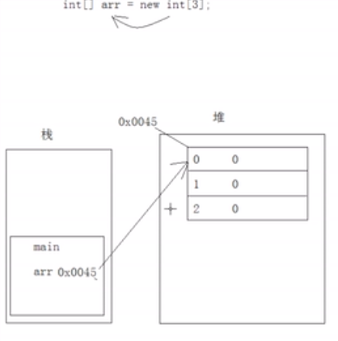
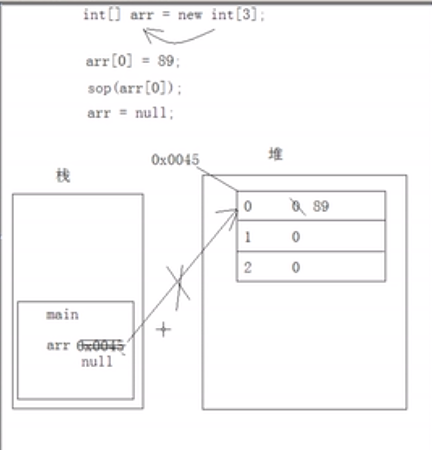
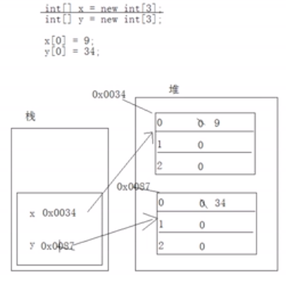
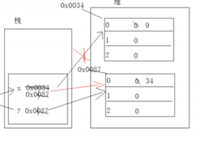
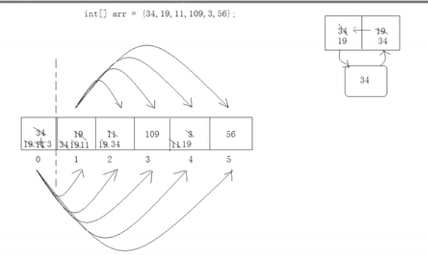
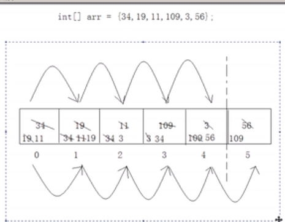
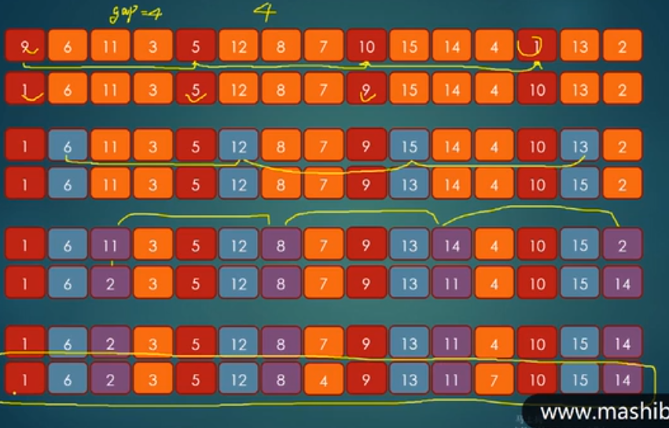
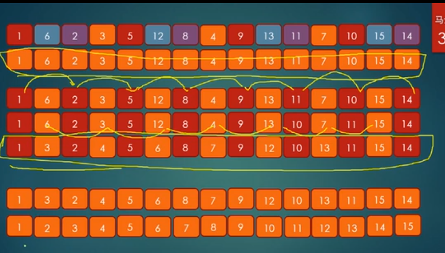
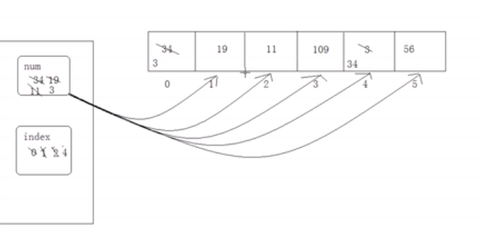

# 第四章 数组

## 概念

数组是一种数据类型的集合

## 数组的好处

数组可以装多个数据，变量只能装一个数据

数组可以自动给数据标号，从零开始，便于对数据进行管理。

## 1. 数组的定义和使用

```java
//创建数组 
//new 关键字是新建的意思  
//int是你要存什么数据 
//[]代表容器是数组
// 数组必须要指定长度，3就是长度
new int[3];

//上面创建的数组不能用，因为没有声明引用。
//[]代表数组类型，int代表存什么类型数据，数组中元素的类型
int[] arr = new int[3] ;
//int arr[] = new int[3];

//操作数组中的元素
// 0 是数组的角标，专业术语叫索引
System.out.println(arr[0])  // 打印零 ，原因是int有默认值就是0
    
//给元素赋值
arr[0] = 89;
System.out.println(arr[0]) //89

// 数组角标越界
arr[3]
```


## 2. 数组的内存划分和分布

1. jvm虚拟机启动后需要在内存中开辟空间

2. 虚拟机会对内存再进行详细划分（类似运动场中的跑步：跳远：调高：标枪）

3. 内存被划分为：

   

   - 寄存器： 由cpu调用
   - 本地方法区： 和本地操作系统有关，例如：调用不同操作系统的网络资源、存储资源等
   - 方法区：数组中暂时讲不到。
   - 栈内存：
   - 堆内存：

### 2.1 栈内存

1. 存储的都是局部变量。局部变量都存在于方法内。
2. 而且变量所属的作用域一旦运行结束，该变量就会自动释放。
3. 栈内存寿命较短，更新速度比较快
4. Java栈的区域很小，只有1M，特点是存取速度很快，所以在stack中存放的都是快速执行的任务，基本数据类型的数据，和对象的引用
5. 驻留于常规RAM（随机访问存储器）区域，因此运行速度仅次于寄存器。
6. 由于速度较快，所以空间很小，只有1m。

[^注]: 顺带提一下成员变量

```java
for(int x = 0;x<4;x++){}
// x 是局部变量，由其自己的作用域
```

> 例子：
>
> ```java
> {
>     int age =3;
> }
> System.out.println(age); //编译错误，因为作用域不同
> ```
>
> 结论：限定局部变量的生命周期，当局部代码块运行结束时，变量从栈内存中释放
>
> 参考：https://www.cnblogs.com/augus007/articles/10185796.html
>
> https://blog.csdn.net/zsf5201314z/article/details/80248016

### 2.2 堆内存

​	堆内存中存储的是数组和对象（其实数组就是对象），凡是new建立在堆中。



特点：

```java
int[] arr = new int[3]; //左边在栈，右边在堆
//堆内存储的都是实体，实体就是封装多个数据的作用。

/*上面这句的执行步骤：
1.主函数先进栈，arr变量也进栈。
2.new语句在堆内存中开辟了一个空间用于存储数据，这个空间被分配一个连续二进制的地址（用16进制数表示）
3.这个空间被划分为3份
4.每一份都相当于是一个变量，堆中的变量都会默认初始化一个值。(整数初始化为0，float初始化为0.0f，double为0.0，boolean类型是false)*/
```

1. 每一个实体都有一个首地址值
2. 堆内存中的每一个变量都有默认初始化值，根据类型的不同而不同，整数是0，小数位0.0f或0.0，boolean为false，char为'\u0000'是空格，对象是null。
3. 垃圾回收机制。

> **与基本数据类型变量的区别：**
>
> 基本数据类型的变量直接存储于栈中。引用变量类似于c++中的指针。

```java
System.out.println(arr[0]);
/*
步骤：
1.先根据内存地址找到arr的堆内存位置
2.根据索引0找到对应的格子
3.读取数据
*/
```

```java
arr = null;
//数组是对象或者实体，因此将arr指向的内存地址为空。
```



> arr之前所指向的堆内存的数组对象已经没用了，现在变成了垃圾。要被垃圾回收器回收，但并不知道什么时候来回收。而栈内存中基础类型变量直接被释放。

### 2.3 内存图解

每有一个new就会划分一份内存空间。



上图代码再加一句x=y，动作如下图



再加一句y=null，向学生说明只要有一个变量引用了堆中地址，就不会成为垃圾。

### 2.4 常见问题

> ```java
> int[] arr = new int[3];
> System.out.println(arr[3]);//ArrayIndexOutException
> ```
>
> 编译仍然能通过，应为三个角标只在运行时才会进行内存划分，**运行时**才会发现找不到3.

> ```java
> int[] arr = new int[3];
> arr = null;
> System.out.println(arr[0]);//nullPoint
> ```
>
> 编译仍然通过，因为编译时并不会产生内存，也是运行时异常

> ```java
> int[] arr = new int[3];
> System.out.println(arr);//[I@c17164
> //c17164是一个hash值，，通过hash算法来获取数组的内存地址，这个值是个二进制值，只不过16进制表示。
> //@f符号是分界线
> //左边的[I是实体的类型，半个中括号代表数组，I代表int类型
> ```
>
> 

## 3.数组的第二种定义格式

​	将已存在的数据存入到数组中。

```java
int[] arr = new int[]{89,34,270,17};
//元素类型[] 数组名= new 元素类型[]{元素,元素，...}
```

> 注：此种方法就不用在中括号中定义数组长度。

```java 
//或者：元素类型[] 数组名 = {元素，元素}
int[] arr = {89,34,270,17}
```

**区别：**

1. 需要一个容器，但是不确定容器中的具体数据。
2. 需要一个容器，存储已知的数据。

> 注意：当数据多的时候，请用数组来存储数据。就好比我不用面对班里的40个学生，只要面对班长就可以了。

## 4. 数组的操作

### 4.1 遍历

对数组的最基本操作就是存和取。核心思想就是对角标的操作。

> 遍历获取所有数组，一般用for，因为while需要单独声明一个变量作为数组角标，一旦循环完了，角标变量就不需要了，for可以在循环内部定义，运行完就被释放。

```java
arr.length //数组长度
```

数组中最大的角标是arr.length-1;

> ```java
> for (int x = 0;x<arr.length;i+=2);// 步长为2
> for (int x =arr.length;i>=0;i--)//反向遍历
>     
> ```
>
> 

### 4.2 获取最值

> 例子：比身高
>
> 思路：
>
> 1.遍历数组
>
> 2.遍历时挨个比较，定义变量记录最大值
>
> ```java
> int[] arr = {39,19,11,109,3,56};
> int max = 0;
> for (int x = 0;x<arr.length;x++){
>     if (arr[x]>max){
>         max = arr[x];
>     }
> }
> System.out.println(max); // 109
> ```
>
> ```java
> //负数导致结果错误
> int[] arr = {-39,-19,-11,-109,-3,-56};
> int max = 0;
> for (int x = 0;x<arr.length;x++){
>     if (arr[x]>max){
>         max = arr[x];
>     }
> }
> System.out.println(max); // 0
> 
> //所以max的初始化要注意：求最大值不能放姚明，求最小值不能放武大郎，应该改成如下
> int[] arr = {-39,-19,-11,-109,-3,-56};
> int max = arr[0]; //以数组中任意元素初始化零
> for (int x = 1;x<arr.length;x++){
>     //第一个比较没意义，所以从1开始
>     if (arr[x]>max){
>         max = arr[x];
>     }
> }
> System.out.println(max);
> ```
>
> max非要初始化为0，将max理解为角标
>
> ```java
> int[] arr = {-39,-19,-11,-109,-3,-56};
> int max = 0; //以数组中任意元素初始化零
> for (int x = 1;x<arr.length;x++){
>     //第一个比较没意义，所以从1开始
>     if (arr[x]>arr[max]){
>         max = x;
>     }
> }
> System.out.println(arr[max]);
> ```

### 4.3 排序

选择排序，冒泡排序，快速排序等

#### 4.3.1 选择排序

```java
//例子 从小到大排序		
int arr[]= {34,19,11,109,3,56};
```

思路：

1.从零角标开始，让0角标和每一个其他角标相比，筛选出最小值

2.0角标比完后，让1角标和除0以外的其他角标进行对比，筛选第二小值。

3.以此类推，当比完倒数第二个角标后，结束，总共比5轮。



```java
public static void main(String[] args) {
    int arr[]= {34,19,11,109,3,56};

    select(arr);

    for (int z:arr){
        System.out.println(z);
    }
}
//向学生解释下为什么不用返回int[]而是void，画堆栈图
//并且强调只有引用变量才行
public static void select(int[] arr){
    for (int x = 0;x<arr.length-1;x++){
        for (int y = x+1;y<arr.length;y++){
            if (arr[x]>arr[y]){
                int temp = arr[x];
                arr[x] = arr[y];
                arr[y] = temp;
            }
        }
    }
}
```

[^注]: 建议在这里封装专门的打印方法，打印数组，向学生灌输代码封装思想


#### 4.3.2 冒泡排序

思路：

1.相邻两位一次比较，这样最大的数就冒泡到了最后一个角标上。

2.以此类推，再进行第二轮相邻比较，将第二大的放到倒数第二个角标上。总共转5轮。



```java
public static void bubble(int[] arr){
    for (int x = 0;x<arr.length-1;x++){
        for (int y = 1;y<arr.length-x;y++){
            if (arr[y-1]>arr[y]){
                int temp = arr[y];
                arr[y] = arr[y-1];
                arr[y-1] = temp;
            }
        }
    }
}
```

```java
//另一种写法
for (int x = arr.length-1;x>0;x--){
    for (int y = 0;y<x;y++){
        if (arr[y]>arr[y+1]){
            int temp = arr[y];
            arr[y] = arr[y+1];
            arr[y+1] = temp;
        }
    }
}
//x一直都是需要排的那一位：5,4,3,2,1
```

> 排序有好几种：快速排序，插入排序、希尔排序等总计7种。
>
> ```java
> import java.util.Arrays;
> 
> //现实开发用这种：以上是为了面试
> Arrays.sort(arr);
> ```

#### 4.3.3 插入排序

思想：

1. 将数组分为两部分，将后部分元素逐一与前部分元素比较
2. 如果前部分元素比array[i]小，就将前部分元素往后移动。
3. 当没有比array[i]小的元素，即是合理位置，在此位置插入array[i]

#### 算法步骤

- 将第一待排序序列第一个元素看做一个有序序列，把第二个元素到最后一个元素当成是未排序序列。
- 从头到尾依次扫描未排序序列，将扫描到的每个元素插入有序序列的适当位置。（如果待插入的元素与有序序列中的某个元素相等，则将待插入元素插入到相等元素的后面。）


```java
for (int x = 1; x < arr.length; x++) {
    for(int y = x;y>0;y--){
        if(arr[y]<arr[y-1]){
            int temp = arr[y];
            arr[y] = arr[y - 1];
            arr[y - 1] = temp;
        }
    }
}
```

#### 4.3.4 希尔排序

比插入效率排序高一些，改进的插入排序	

提高效率的原因：

1.在间隔比较大的时候，移动的次数比较少。

2.在间隔比较小的时候，要比较的数量比较少，移动的距离短。

希尔排序法不太稳定

思路：

1.先给定一个大间隔，进行插入排序

2.再给定一个较小的间隔，再进行插入排序

4.最后来一次间隔为1的插入排序，也就是正常的插入排序





```java
for(int gap = 4;gap>0;gap/=2){
    for (int x = gap; x < arr.length; x++) {
        for(int y = x;y>gap-1;y-=gap){
            if(arr[y]<arr[y-gap]){
                swap(arr,y,y-gap);
            }
        }
    }
}
//当数据比较大时，以4开始就不合适了,可以采用数组长度的一般开始
for(int gap = arr.length/2;gap>0;gap>>=2){
    for (int x = gap; x < arr.length; x++) {
        for(int y = x;y>gap-1;y-=gap){
            if(arr[y]<arr[y-gap]){
                swap(arr,y,y-gap);
            }
        }
    }
}
//希尔的效率是否高在于间隔序列
//Knuth序列 
//h =1
//h = 3*h+1；
// 1,4,13.....
//h大于长度三分之一就不适合了
int h =3;
while(h<arr.length/3){
    h = h*3+1;
}
for(int gap = h;gap>0;gap = (gap-1)/3){
    for (int x = gap; x < arr.length; x++) {
        for(int y = x;y>gap-1;y-=gap){
            if(arr[y]<arr[y-gap]){
                swap(arr,y,y-gap);
            }
        }
    }
}


```

希尔排序的用途：不好说，一般用于中型规模的数据

#### 4.3.5 快速排序

####  算法步骤

- 从数列中挑出一个元素，称为 “基准”（pivot）;
- 重新排序数列，所有元素比基准值小的摆放在基准前面，所有元素比基准值大的摆在基准的后面（相同的数可以到任一边）。在这个分区退出之后，该基准就处于数列的中间位置。这个称为分区（partition）操作；
- 递归地（recursive）把小于基准值元素的子数列和大于基准值元素的子数列排序；


```java

```


#### 4.3.6 抽取互换位置的代码

```java
public static coid swap(int[] arr,int a ,int b){
    int temp = arr[a];
    arr[a] = arr[b];
    arr[b] = temp;
}

....swap(arr,y,y+1);
```

#### 4.3.7 排序的性能问题

思路：用一个变量记录最小值，另一个变量记住最小值得角标，减小换位次数，重点是**减少换位次数**,并且变量存在栈内存中，运算速度快，一轮下来再与最小位进行换位。



```java

for (int x = 0;x<arr.length-1;x++){
    int num = arr[x]; 
	int index = x;
    for (int y = x+1;y<arr.length;y++){
        if (arr[x]>arr[y]){
            num = arr[y];
            index = y;
        }
    }
    if(index!=x)
        swap(arr,x,index);
}
```

**结论**：元素多了才涉及效率问题。

#### 4.3.8 参考

几种排序的总结：https://www.cnblogs.com/zhaosq/p/9857713.html

最快的排序不好说，应该是快速排序