# 第四章 数组

## 概念

数组是一种数据类型的集合

## 数组的好处

数组可以装多个数据，变量只能装一个数据

数组可以自动给数据标号，从零开始，便于对数据进行管理。

## 1. 数组的定义和使用

```java
//创建数组 
//new 关键字是新建的意思  
//int是你要存什么数据 
//[]代表容器是数组
// 数组必须要指定长度，3就是长度
new int[3];

//上面创建的数组不能用，因为没有声明引用。
//[]代表数组类型，int代表存什么类型数据，数组中元素的类型
int[] arr = new int[3] ;
//int arr[] = new int[3];

//操作数组中的元素
// 0 是数组的角标，专业术语叫索引
System.out.println(arr[0])  // 打印零 ，原因是int有默认值就是0
    
//给元素赋值
arr[0] = 89;
System.out.println(arr[0]) //89

// 数组角标越界
arr[3]
```


## 2. 数组的内存划分和分布

1. jvm虚拟机启动后需要在内存中开辟空间

2. 虚拟机会对内存再进行详细划分（类似运动场中的跑步：跳远：调高：标枪）

3. 内存被划分为：

   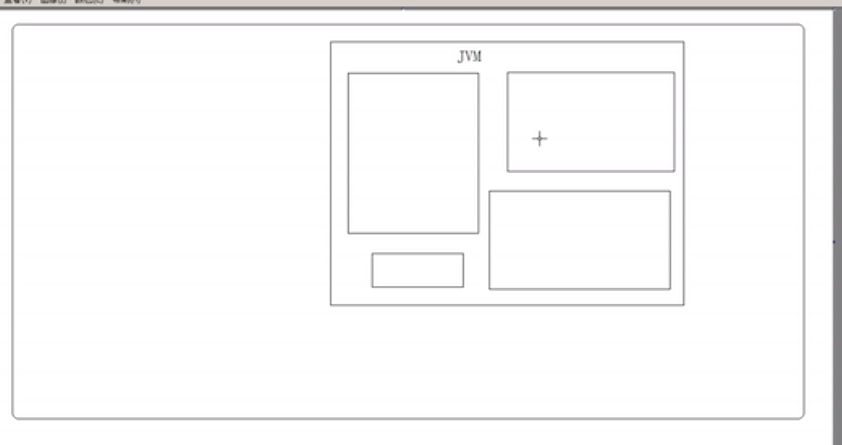

   - 寄存器： 由cpu调用
   - 本地方法区： 和本地操作系统有关，例如：调用不同操作系统的网络资源、存储资源等
   - 方法区：数组中暂时讲不到。
   - 栈内存：
   - 堆内存：

### 2.1 栈内存

1. 存储的都是局部变量。局部变量都存在于方法内。
2. 而且变量所属的作用域一旦运行结束，该变量就会自动释放。
3. 栈内存寿命较短，更新速度比较快
4. Java栈的区域很小，只有1M，特点是存取速度很快，所以在stack中存放的都是快速执行的任务，基本数据类型的数据，和对象的引用
5. 驻留于常规RAM（随机访问存储器）区域，因此运行速度仅次于寄存器。
6. 由于速度较快，所以空间很小，只有1m。

[^注]: 顺带提一下成员变量

```java
for(int x = 0;x<4;x++){}
// x 是局部变量，由其自己的作用域
```

> 例子：
>
> ```java
> {
>     int age =3;
> }
> System.out.println(age); //编译错误，因为作用域不同
> ```
>
> 结论：限定局部变量的生命周期，当局部代码块运行结束时，变量从栈内存中释放
>
> 参考：https://www.cnblogs.com/augus007/articles/10185796.html
>
> https://blog.csdn.net/zsf5201314z/article/details/80248016

### 2.2 堆内存

​	堆内存中存储的是数组和对象（其实数组就是对象），凡是new建立在堆中。

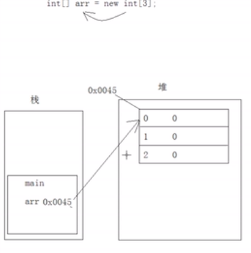

特点：

```java
int[] arr = new int[3]; //左边在栈，右边在堆
//堆内存储的都是实体，实体就是封装多个数据的作用。

/*上面这句的执行步骤：
1.主函数先进栈，arr变量也进栈。
2.new语句在堆内存中开辟了一个空间用于存储数据，这个空间被分配一个连续二进制的地址（用16进制数表示）
3.这个空间被划分为3份
4.每一份都相当于是一个变量，堆中的变量都会默认初始化一个值。(整数初始化为0，float初始化为0.0f，double为0.0，boolean类型是false)*/
```

1. 每一个实体都有一个首地址值
2. 堆内存中的每一个变量都有默认初始化值，根据类型的不同而不同，整数是0，小数位0.0f或0.0，boolean为false，char为'\u0000'是空格，对象是null。
3. 垃圾回收机制。

> **与基本数据类型变量的区别：**
>
> 基本数据类型的变量直接存储于栈中。引用变量类似于c++中的指针。

```java
System.out.println(arr[0]);
/*
步骤：
1.先根据内存地址找到arr的堆内存位置
2.根据索引0找到对应的格子
3.读取数据
*/
```

```java
arr = null;
//数组是对象或者实体，因此将arr指向的内存地址为空。
```


> arr之前所指向的堆内存的数组对象已经没用了，现在变成了垃圾。要被垃圾回收器回收，但并不知道什么时候来回收。而栈内存中基础类型变量直接被释放。

### 2.3 内存图解

每有一个new就会划分一份内存空间。

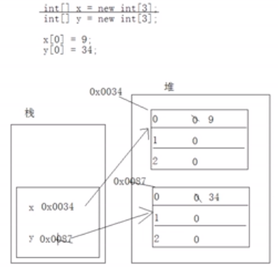

上图代码再加一句x=y，动作如下图

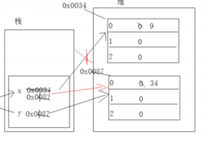

再加一句y=null，向学生说明只要有一个变量引用了堆中地址，就不会成为垃圾。

### 2.4 常见问题

> ```java
> int[] arr = new int[3];
> System.out.println(arr[3]);//ArrayIndexOutException
> ```
>
> 编译仍然能通过，应为三个角标只在运行时才会进行内存划分，**运行时**才会发现找不到3.

> ```java
> int[] arr = new int[3];
> arr = null;
> System.out.println(arr[0]);//nullPoint
> ```
>
> 编译仍然通过，因为编译时并不会产生内存，也是运行时异常

> ```java
> int[] arr = new int[3];
> System.out.println(arr);//[I@c17164
> //c17164是一个hash值，，通过hash算法来获取数组的内存地址，这个值是个二进制值，只不过16进制表示。
> //@f符号是分界线
> //左边的[I是实体的类型，半个中括号代表数组，I代表int类型
> ```
>
> 

## 3.数组的第二种定义格式

​	将已存在的数据存入到数组中。

```java
int[] arr = new int[]{89,34,270,17};
//元素类型[] 数组名= new 元素类型[]{元素,元素，...}
```

> 注：此种方法就不用在中括号中定义数组长度。

```java 
//或者：元素类型[] 数组名 = {元素，元素}
int[] arr = {89,34,270,17}
```

**区别：**

1. 需要一个容器，但是不确定容器中的具体数据。
2. 需要一个容器，存储已知的数据。

> 注意：当数据多的时候，请用数组来存储数据。就好比我不用面对班里的40个学生，只要面对班长就可以了。

## 4. 数组的操作

### 4.1 遍历

对数组的最基本操作就是存和取。核心思想就是对角标的操作。

> 遍历获取所有数组，一般用for，因为while需要单独声明一个变量作为数组角标，一旦循环完了，角标变量就不需要了，for可以在循环内部定义，运行完就被释放。

```java
arr.length //数组长度
```

数组中最大的角标是arr.length-1;

> ```java
> for (int x = 0;x<arr.length;i+=2);// 步长为2
> for (int x =arr.length;i>=0;i--)//反向遍历
>     
> ```
>
> 

### 4.2 获取最值

> 例子：比身高
>
> 思路：
>
> 1.遍历数组
>
> 2.遍历时挨个比较，定义变量记录最大值
>
> ```java
> int[] arr = {39,19,11,109,3,56};
> int max = 0;
> for (int x = 0;x<arr.length;x++){
>     if (arr[x]>max){
>         max = arr[x];
>     }
> }
> System.out.println(max); // 109
> ```
>
> ```java
> //负数导致结果错误
> int[] arr = {-39,-19,-11,-109,-3,-56};
> int max = 0;
> for (int x = 0;x<arr.length;x++){
>     if (arr[x]>max){
>         max = arr[x];
>     }
> }
> System.out.println(max); // 0
> 
> //所以max的初始化要注意：求最大值不能放姚明，求最小值不能放武大郎，应该改成如下
> int[] arr = {-39,-19,-11,-109,-3,-56};
> int max = arr[0]; //以数组中任意元素初始化零
> for (int x = 1;x<arr.length;x++){
>     //第一个比较没意义，所以从1开始
>     if (arr[x]>max){
>         max = arr[x];
>     }
> }
> System.out.println(max);
> ```
>
> max非要初始化为0，将max理解为角标
>
> ```java
> int[] arr = {-39,-19,-11,-109,-3,-56};
> int max = 0; //以数组中任意元素初始化零
> for (int x = 1;x<arr.length;x++){
>     //第一个比较没意义，所以从1开始
>     if (arr[x]>arr[max]){
>         max = x;
>     }
> }
> System.out.println(arr[max]);
> ```

### 4.3 排序

选择排序，冒泡排序，快速排序等

#### 4.3.1 选择排序

```java
//例子 从小到大排序		
int arr[]= {34,19,11,109,3,56};
```

思路：

1.从零角标开始，让0角标和每一个其他角标相比，筛选出最小值

2.0角标比完后，让1角标和除0以外的其他角标进行对比，筛选第二小值。

3.以此类推，当比完倒数第二个角标后，结束，总共比5轮。

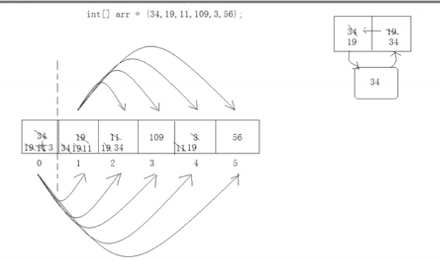

```java
public static void main(String[] args) {
    int arr[]= {34,19,11,109,3,56};

    select(arr);

    for (int z:arr){
        System.out.println(z);
    }
}
//向学生解释下为什么不用返回int[]而是void，画堆栈图
//并且强调只有引用变量才行
public static void select(int[] arr){
    for (int x = 0;x<arr.length-1;x++){
        for (int y = x+1;y<arr.length;y++){
            if (arr[x]>arr[y]){
                int temp = arr[x];
                arr[x] = arr[y];
                arr[y] = temp;
            }
        }
    }
}
```

[^注]: 建议在这里封装专门的打印方法，打印数组，向学生灌输代码封装思想


#### 4.3.2 冒泡排序

> 时间复杂度，空间复杂度
>
> https://blog.csdn.net/weixin_42447959/article/details/83003233
>
> https://zhidao.baidu.com/question/588974190575315605.html

思路：

1.相邻两位一次比较，这样最大的数就冒泡到了最后一个角标上。

2.以此类推，再进行第二轮相邻比较，将第二大的放到倒数第二个角标上。总共转5轮。

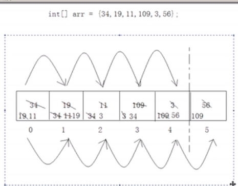

```java
public static void bubble(int[] arr){
    for (int x = 0;x<arr.length-1;x++){
        for (int y = 1;y<arr.length-x;y++){
            if (arr[y-1]>arr[y]){
                int temp = arr[y];
                arr[y] = arr[y-1];
                arr[y-1] = temp;
            }
        }
    }
}
```

```java
//另一种写法
for (int x = arr.length-1;x>0;x--){
    for (int y = 0;y<x;y++){
        if (arr[y]>arr[y+1]){
            int temp = arr[y];
            arr[y] = arr[y+1];
            arr[y+1] = temp;
        }
    }
}
//x一直都是需要排的那一位：5,4,3,2,1
```

> 排序有好几种：快速排序，插入排序、希尔排序等总计7种。
>
> ```java
> import java.util.Arrays;
> 
> //现实开发用这种：以上是为了面试
> Arrays.sort(arr);
> ```

#### 4.3.3 插入排序

思想：

1. 将数组分为两部分，将后部分元素逐一与前部分元素比较
2. 如果前部分元素比array[i]小，就将前部分元素往后移动。
3. 当没有比array[i]小的元素，即是合理位置，在此位置插入array[i]

##### 算法步骤

- 将第一待排序序列第一个元素看做一个有序序列，把第二个元素到最后一个元素当成是未排序序列。
- 从头到尾依次扫描未排序序列，将扫描到的每个元素插入有序序列的适当位置。（如果待插入的元素与有序序列中的某个元素相等，则将待插入元素插入到相等元素的后面。）


```java
for (int x = 1; x < arr.length; x++) {
    for(int y = x;y>0;y--){
        if(arr[y]<arr[y-1]){
            int temp = arr[y];
            arr[y] = arr[y - 1];
            arr[y - 1] = temp;
        }
    }
}
```

#### 4.3.4 希尔排序

比插入效率排序高一些，改进的插入排序	

提高效率的原因：

1.在间隔比较大的时候，移动的次数比较少。

2.在间隔比较小的时候，要比较的数量比较少，移动的距离短。

希尔排序法不太稳定

思路：

1.先给定一个大间隔，进行插入排序

2.再给定一个较小的间隔，再进行插入排序

4.最后来一次间隔为1的插入排序，也就是正常的插入排序

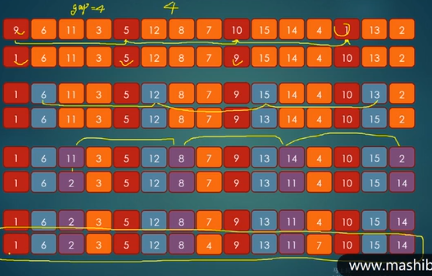

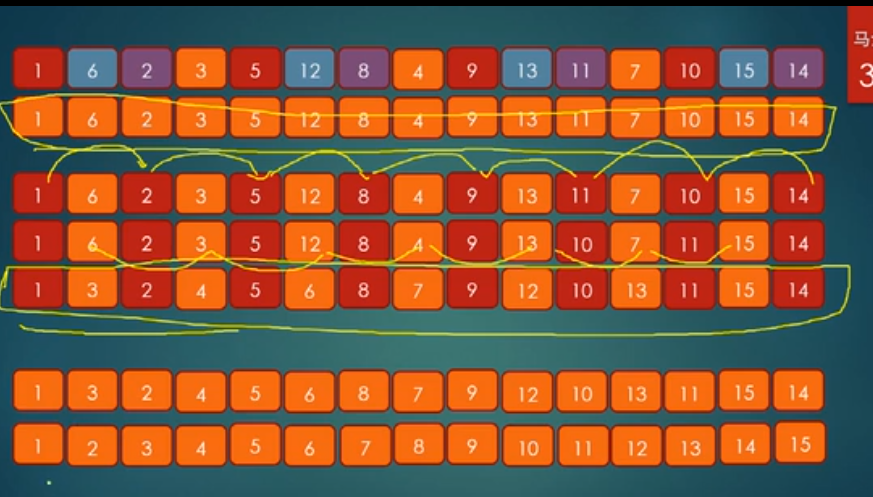

```java
for(int gap = 4;gap>0;gap/=2){
    for (int x = gap; x < arr.length; x++) {
        for(int y = x;y>gap-1;y-=gap){
            if(arr[y]<arr[y-gap]){
                swap(arr,y,y-gap);
            }
        }
    }
}
//当数据比较大时，以4开始就不合适了,可以采用数组长度的一般开始
for(int gap = arr.length/2;gap>0;gap>>=2){
    for (int x = gap; x < arr.length; x++) {
        for(int y = x;y>gap-1;y-=gap){
            if(arr[y]<arr[y-gap]){
                swap(arr,y,y-gap);
            }
        }
    }
}
//希尔的效率是否高在于间隔序列
//Knuth序列 
//h =1
//h = 3*h+1；
// 1,4,13.....
//h大于长度三分之一就不适合了
int h =3;
while(h<arr.length/3){
    h = h*3+1;
}
for(int gap = h;gap>0;gap = (gap-1)/3){
    for (int x = gap; x < arr.length; x++) {
        for(int y = x;y>gap-1;y-=gap){
            if(arr[y]<arr[y-gap]){
                swap(arr,y,y-gap);
            }
        }
    }
}


```

希尔排序的用途：不好说，一般用于中型规模的数据

#### 4.3.5 快速排序

https://blog.csdn.net/A_BlackMoon/article/details/81064712


#####  算法步骤

- 从数列中挑出一个元素，称为 “基准”（pivot）;
- 重新排序数列，所有元素比基准值小的摆放在基准前面，所有元素比基准值大的摆在基准的后面（相同的数可以到任一边）。在这个分区退出之后，该基准就处于数列的中间位置。这个称为分区（partition）操作；
- 递归地（recursive）把小于基准值元素的子数列和大于基准值元素的子数列排序；


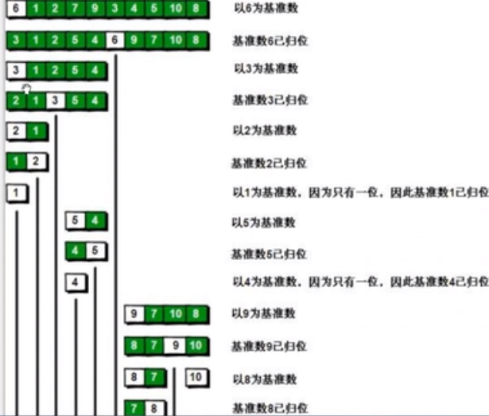

```java
//要用到递归
 /**
     * 快速排序，递归
     * @param arr 数组
     * @param left 从左边哪开始
     * @param right 从右边哪开始
     */
    public static void quickSort(int[] arr,int left,int right){
        //进行判断，left不能大于right
        if(left>right){
            return ;
        }
        int base  = arr[left];
        //定义变量i,j
        int i = left;
        int j = right;
        //当i和j不相遇时，进行检索
        while(i!=j){
            //先让j从右往左检索，如果检索到比基准小的就停下，
            //检索到大的就继续检索
            while(base<=arr[j]&&i<j){
                j--;//从左往右移动
            }
            //再让i从左往右检索，如果检索到比肌醇小的就停下
            while(base>=arr[i]&&i<j){
                i++; //从左往由移动
            }
            //i和j交换
            int temp = arr[i];
            arr[i] = arr[j];
            arr[j] = temp;
        }
        //跳出后，将基准与i或j交换，然后继续进行递归排序
        arr[left] = arr[i];
        arr[i] = base;
        quickSort(arr,left,i-1);
        quickSort(arr,j+1,right);
    }

```

> 通过10000个长度的数组来演示快速排序的速度与冒泡做对比，数字用Random来产生。
>
> **重要理论**：以空间换时间(n简单理解为循环次数)
>
> | 算法 | 时间复杂度 | 空间复杂度 |                      |
> | ---- | ---------- | ---------- | -------------------- |
> | 快速 | f(n log n) | O(log n )  | n=8 时间：24，空间 3 |
> | 冒泡 | f(n^2)     | O（1）     | n=8 时间：64 ，空间1 |
>
> 

#### 4.3.6 抽取互换位置的代码

```java
public static coid swap(int[] arr,int a ,int b){
    int temp = arr[a];
    arr[a] = arr[b];
    arr[b] = temp;
}

....swap(arr,y,y+1);
```

#### 4.3.7 排序的性能问题

思路：用一个变量记录最小值，另一个变量记住最小值得角标，减小换位次数，重点是**减少换位次数**,并且变量存在栈内存中，运算速度快，一轮下来再与最小位进行换位。

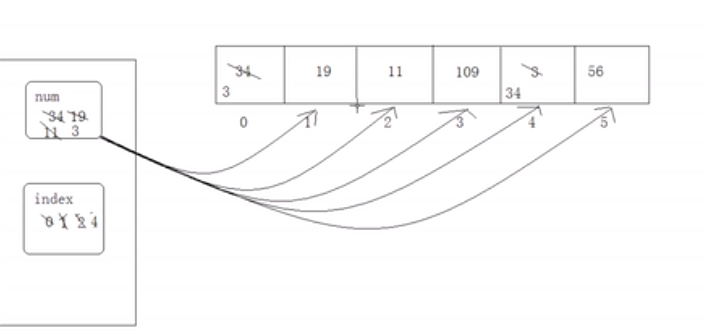

```java

for (int x = 0;x<arr.length-1;x++){
    int num = arr[x]; 
	int index = x;
    for (int y = x+1;y<arr.length;y++){
        if (arr[x]>arr[y]){
            num = arr[y];
            index = y;
        }
    }
    if(index!=x)
        swap(arr,x,index);
}
```

**结论**：元素多了才涉及效率问题。

#### 4.3.8 参考

几种排序的总结：https://www.cnblogs.com/zhaosq/p/9857713.html

最快的排序不好说，应该是快速排序

### 4.2 查找

数组常见功能：查找

> 例如查找班级里的某一个同学

#### 4.2.1 顺序查找

```java
//例子
public static int getIndex(int[] arr,int key){
   for(int x= 0;x<arr.length;x++){
        if(arr[x]==key)
        return x;
   }
   return -1; //方法必须要有返回值，所以返回-1，因为没由-角标 
}

public static void main(String[] args){
    int[] arr = {4,1,5,7,3,8,2};
    int index = getIndex(arr,10);
    sop("index value is "+index);
}

```

#### 4.2.2 折半查找（二分查找）

​	思路：	1.从中间切一刀进行比较，大的往左，小的往右

​    **前提**：数组必须进行排序

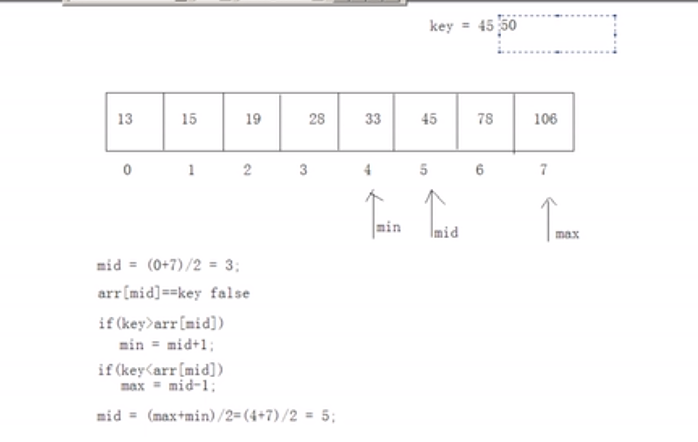

下图表示：当max<min 时就没必要再找了

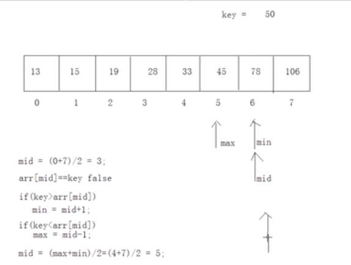

```java
//int[] arr =  {13,15,19,28,33,45,78,206};
public static int binarySearch(int[] arr,int key){
    int max = arr.length-1;
    int min = 0;
    int mid = (max+min)/2;
    while(arr[mid]!=key){
        if(key >arr[mid]){
            min = mid +1
        }else if(key<arr[mid]) {
            max = mid-1;
        }       
        if(max<min){
            return -1;
        }
        mid = (max+min/2;
    }
    return mid;
}
               
//另外一种写法：
public static int binarySearch2int[] arr,int key){
    int max = arr.length-1;
    int min = 0;
    int mid;
    while(max>=in){
        mid = (min+max)>>1;
        if(key >arr[mid]){
            min = mid +1
        }else if(key<arr[mid]) {
            max = mid-1;
        }else{
            return mid;
        }   
    }
    return -1;
}
```

> **注**：如果数组无序，就不要排序了，因为排完角标就变化了

> 面试题
>
> ```java
> //给定一个有序数组，往元素存储一个元素，保证这个元素是有序的，那么存储这个数的角标如何获取
> //注意数组长度是固定的，你只能获取位置
> // 思路：折半查找到如果为max<min，就返回min
> //int[] arr =  {13,15,19,28,33,45,78,206};
> public static int binarySearch2int[] arr,int key){
>     int max = arr.length-1;
>     int min = 0;
>     int mid;
>     while(max>=in){
>         mid = (min+max)>>1;
>         if(key >arr[mid]){
>             min = mid +1
>         }else if(key<arr[mid]) {
>             max = mid-1;
>         }else{
>             return mid;
>         }   
>     }
>     return min;
> }
> 
> //真实场景下开发这么玩就可以了
> import java.util.Arrays;
> int[] arr =  {13,15,19,28,33,45,78,206};
> int index = Arrays.binarySearch(arr,45); //5
> int index = Arrays.binarySearch(arr,50); //-7 
> //50应该返回插入为6，但是返回-7，原因：返回的是-min-1，java要考虑不仅要返回插入点，还要告诉你没有这个元素，为什么还-1，是因为假定传的是5，不是50，那么插入位置是0,0没法-
> 
> int[] arr = {4,1,5,7,3,8,2};
> 		System.out.println(Arrays.binarySearch(arr, 2)); //-3 也就是2
> //无序java封装的方法还是会出错，所以数组必须有序。
> ```

### 4.3 用数组进行进制的转换

题目：获取一个整数的16进制的表现形式

思路：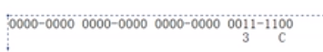

1. 用过程序取每一个四位。

2. 通过与运算来取也就是与上1111

   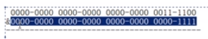

3. 再通过将这个数右移四位来与1111（不向左移位是因为数字会变得很大）

   > 用无符号右移靠谱 >>>因为>> 负数会补1

   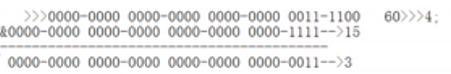

```java
public static void toHex(int num){
    /*int n1 = num&15;
    sop("n1="+n1);
    num>>>=4;
    int n2 = num&15;
    sop("n2="+n2);*/
    for(int x=0;x<8;x++){
        int temp = num &15;
        sop(temp); 
        num = num>>>4;
    }
}	
//60打印 12 3 0 0 0 0 0 0 不完美，要输入c
```

解决打印12数字不打印c问题

思路：

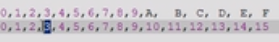

```java
//解决10以上打印数字不打印字母问题
public static void toHex(int num){
   
    for(int x=0;x<8;x++){
        int temp = num &15;
        if(temp>9){
            sop((char)(temp-10+'A'));
            //A在asc表中是65,10代表A并且asc表的字母连续存储，所以以A作为基准累加
        }else{
        	sop(temp);     
        }
        num = num>>>4;
    }
}
//这种方式存在的问题：1.反的，2.好多0
```

解决以上问题：

思路：用数组，因为16进制每一个值对应数组角标0-15

##### 查表法

定义：根据运算得到数组的角标，直接去查找数组中对应的元素即可

```java
public static void toHexByTable(int num){
    char[] cha = {'1','2','3','4','5','6','7','8','9','A','B','C','D','E','F'};
    for(int x=0;x<8;x++){
        int temp = num &15;
        sop(arr[temp]);
        num = num>>>4;
    }
}
```

解决多零和反打的问题

```java
public static void toHexByTable(int num){
    if(num==0){
        sop(0);
        return ;
    }
    char[] cha = {'1','2','3','4','5','6','7','8','9','A','B','C','D','E','F'};
    char[] arr= new char[8];
    //int post =0;
    int pos = arr.length; //不需要再排序了，从后往前存
    while(num!=0){
        int temp = num&15;
        arr[--post] = cha[temp];
        num  = num>>>4;
    }
    //解决多0的问题
    for(int i = pos;i<pos;i++){
        sop(arr[i]);
    }
}
```

##### 二进制、八进制、十六进制整合转换

将60 打印成二进制、八进制、十六进制	

```java
public static void trans(int num,int base,int offset){
    if(num==0){
        sop(0);
        return ;
    }
    char[] cha = {'1','2','3','4','5','6','7','8','9','A','B','C','D','E','F'};
    char[] arr= new char[32]; //32最多存32位，4个字节
    //int post =0;
    int pos = arr.length; 
    while(num!=0){
        int temp = num&base; //与多少根据进制定
        arr[--post] = cha[temp];
        num  = num>>>offset; //偏移几位根据进制定
    }
  
    for(int i = pos;i<pos;i++){
        sop(arr[i]);
    }
    
    //实际场景用
    Integer.toBinaryString(6);
}
```

##### 查表法练习

> 使用查表法：星期
>
> ```java
> public static String week(int num){
>     if(num>7||num<1){
>         return  "错误的星期";
>     }
>     String[] weeks = 	{"","星期一",""...};
>     return weeks[num];
> }
> ```
>
> 

## 5 二维数组

特点：数组中的元素仍然是数组

[^注]: 箱子由几格子，每个格子里装的是小箱子，小箱子也有格子

##### 定义方式：

```java
// int代表数据类型，第一个[] 代表是大箱子
//第二个[]代表小箱子
// 3代表大箱子里有2个小箱子
// 2代表小箱子里有几个格子
//左边代表是	
int[][] arr = new int[3][2]; 

sop(arr) //直接打印二维数组 [I@fb8ee3 //@左边实体类型，右边是实体的哈希值
sop(arr[0])//打印二维数组中的一维数组
sop(arr[0][0])//打印二维数组中一维数组的元素  
//到底为sm这样打印看内存模型    
```

> 二维数组内存模型
>
> 1. 二维数组中的一维数组若没有，就要初始化，引用类型默认初始化值都是null
> 2. 二维数组中的一维数组也是实体，只要是实体就要在**堆内存**开辟独立空间
> 3. 二维数组角标中保存的其实是一维数组的内存地址值

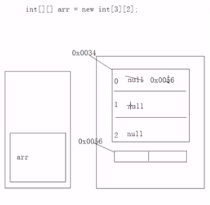

>分别定义一位数组的情况
>
>```java
>//不定义一维长度的情况
>int[][] arr = new int[3][];
>//分别对二维数组中的每一个一维数组进行初始化
>arr[0] = new int[2];
>arr[1] = new int[1];
>arr[2] = new int[3];
>```
>
>内存图：
>
>1. 先执行int[][] arr = new int\[3][ ] 的情况
>
>   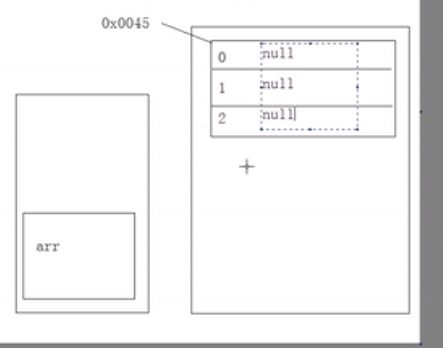
>
>2. 执行第二句的情况
>
>   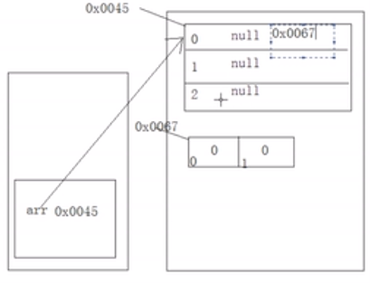
>
>3. 后续执行
>
>   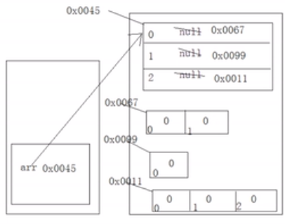
>
>练习：一下打印什么
>
>```java
>int[][] arr = new int[3][];
>sop(arr) //直接打印二维数组
>sop(arr[0])//null
>sop(arr[0][0])//直接报nullpoint 
>```

##### 第二种定义方式

```java
int[][] arr = {{3,1,7},{5,8,2,9},{4,1}};

//遍历此二维数组
for (int x = 0;x<arr.length;x++){
    for(int y = 0;y<arr[x].length;y++){
        sop(arr[x][y]);
    }
}

// 求和，
int sum = 0
for (int x = 0;x<arr.length;x++){
    for(int y = 0;y<arr[x].length;y++){
        sum+=arr[x][y];
    }
}

```

> **注意**：java支持多维数组，但一般就用到二维数组

##### 二维数组的使用场景

例子：销售员的每月销售额，算出某个人的总销售额

> 甲： 30 59 28 17
>
> 乙： 37 60 22 19

```java
int[][] arr = {{30, 59, 28, 17},{37, 60, 22, 19}}
```

## 6 数组的缺点

无论是一维还是二维数组是拿索引和数组关联，而索引没有任何业务意义

## 课后练习

1． 编写一个简单程序，要求数组长度为5，分别赋值10，20，30，40，50，在控制台输出该数组的值。

```java
/*例5-1

 *数组使用范例

 */

public class ArrayDemo

{

​    public static void main(String[] args)

​    {

​        int[] buffer=new int[5];

 

​        buffer[0]=10;

​        buffer[1]=20;

​        buffer[2]=30;

​        buffer[3]=40;

​        buffer[4]=50;

​        

​        for(int i=0;i<5;i++)

​        {

​            System.*out*.println(buffer[i]);

​        }

​    }

}
```

 

2．将一个字符数组的值（neusofteducation）考贝到另一个字符数组中。

```java
public class ArrayCopyDemo {

​    public static void main(String[ ] args) {

​        //定义源字符数组 

​        char[ ]  copyFrom = {'n', 'e', 'u', 's', 'o', 'f', 't', 'e', 'd', 'u', 'c', 'a', 't', 'i', 'o', 'n'};    

​        char[ ] copyTo = new char[7];

​        

​        System.arraycopy(copyFrom, 2, copyTo, 0, 7);

​        System.out.println(new String(copyTo));

​        

​    }

}
```

 

3． 给定一个有9个整数（1,6,2,3,9,4,5,7,8}）的数组，先排序，然后输出排序后的数组的值。

```java
public class ArraySortDemo {

 

​    /**

​     \* @param args

​     */

​    public static void main(String[] args) {

​       // TODO Auto-generated method stub

​       int[] point = {1,6,2,3,9,4,5,7,8};

​       

​       java.util.Arrays.sort( point );

​       

​       for(int i=0;i<point.length;i++)

​       {

​           System.*out*.println(point[i]);

​       }

 

​    }

 

}
```

 

 

4． 输出一个double型二维数组（长度分别为5、4，值自己设定）的值。

```java
/*例5-3

 *多维数组范例

 */

public class ArrayTwoDimension

{

​    public static void main(String[] args)

​    {

​        double[][] buffer=new double[5][4];

​        

​        for(int i=0;i<buffer.length;i++)

​        {

​            for(int j=0;j<buffer[0].length;j++)

​            {

​                System.out.print(buffer[i][j]);

​            }

​            System.out.println();

​        }

​    }

}
```

 

 

5． 在一个有8个整数（18，25，7，36，13，2，89，63）的数组中找出其中最大的数及其下标。

 

```java
public class Arraymax {

 

​    /**

​     \* @param args

​     */

​    public static void main(String[] args) {

​       int[] a = {18,25,7,36,13,2,89,63};

​       int max = a[0];

​       int maxIndex = 0;

​       for(int i=1;i<a.length;i++)

​       {

​           if(max<=a[i]){

​              max = a[i];

​              maxIndex = i;

​           }

​       }

​       System.out.println("最大值为："+max+" 最大值下标为："+maxIndex);

​    }

 

}
```

 

 

1、有2个多维数组分别是 2 3 4   和  1 5 2 8 

​											4 6 8         5 9 10 -3 

​															 2 7 -5 -18

按照如下方式进行运算。生成一个2行4列的数组。此数组的第1行1列是2\*1+3\*5+4*2

第1行2列是2*5+3*9+4*7  第2行1列是4*1+6*5+8*2 依次类推。

```java

int[][] arr1 = { { 2, 3, 4 }, { 4, 6, 8 } };
int[][] arr2 = { { 1, 5, 2, 8 }, { 5, 9, 20, -3 }, { 2, 7, -5, -18 } };
int[][] result = new int[2][4];
//第一个循环获取arr1的二维数组
for (int x = 0; x < arr1.length; x++) {
	
    //第二个循环获取arr1的一维数组
    for (int y = 0; y < arr2[0].length; y++) {
        int num = 0; // 用于累加乘积
        //第三个循环用于获取与arr1的一维数组中的每一个元素
        //关键规律在于z 因为z既是确定arr1里每一个一维数组的值得角标
        //也是确认arr2中一维数组的角标
        for (int z = 0; z < arr1[0].length; z++) {
            num += arr1[x][z] * arr2[z][y];
        }
        result[x][y] = num;
    }
}

//打印结果节
for(int x = 0;x<result.length;x++) {
    for (int y = 0;y<result[x].length;y++) {
        System.out.print(result[x][y]+" ");
    }
    System.out.println();
}

/*
25 65 44 -65 
50 130 88 -130 
*/


```

 

2． 将一个数组中的元素逆序存放

```java
public class Answer {

public static void main(String[] args) {

​       Scanner s = new Scanner(System.*in*);

​       int a[] = new int[20];

​    System.*out*.println("请输入多个正整数（输入-1表示结束）：");

​       int i=0,j;

​       do{

​          a[i]=s.nextInt();

​          i++;

​       }while (a[i-1]!=-1);

​       System.*out*.println("你输入的数组为：");

​       for( j=0; j<i-1; j++) {

​        System.*out*.print(a[j]+"   ");

​    }

​       System.*out*.println("\n数组逆序输出为：");

​       for( j=i-2; j>=0; j=j-1) {

​        System.*out*.print(a[j]+"   ");

​    }

​        }

 

}
```

 

 

\3. 将一个数组中的重复元素保留一个其他的清零。

```java
public class Answer {

public static void main(String[] args) {

​    int[] a = { 1, 2, 2, 3, 4, 5, 6, 4, 7 ,2 ,10};       

​    for (int i = 0;i < a.length - 1;i ++){

​       for (int j = i + 1;j < a.length;j ++){

​           if (a[i] == a[j]){

​              a[j] = 0;

​           }

​       }

​    }

 

}

}
```

 

4、给定一维数组{ -10，2，3，246，-100，0，5} ，计算出数组中的平均值、最大值、最小值。

​    

```java
int a[] = new int[]{ -10,23,246,-100,0,5};

​     int max = a[0];

​     int min = a[0];

​     int add = a[0];

​     for(int i =1;i<a.length;i++){

​        if(a[i]< min){

​            min = a[i];

​        }else if(a[i]>max){

​            max = a[i];

​        }

​        add = add+a[i];

​     }

​    System.*out*.println("最小值："+min);

​    System.*out*.println("最大值："+max);

System.*out*.println("平均值："+add/a.length);
```

 