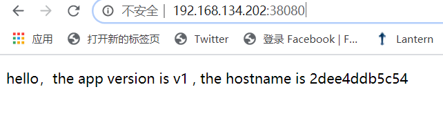
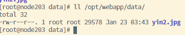
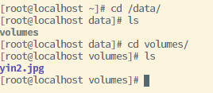
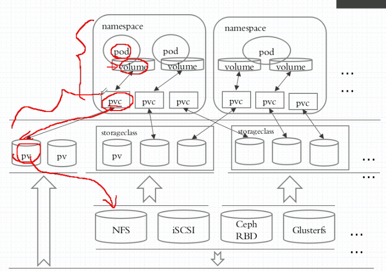
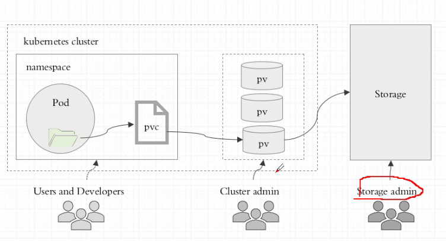
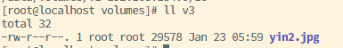
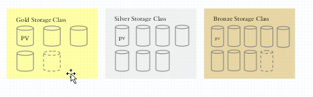
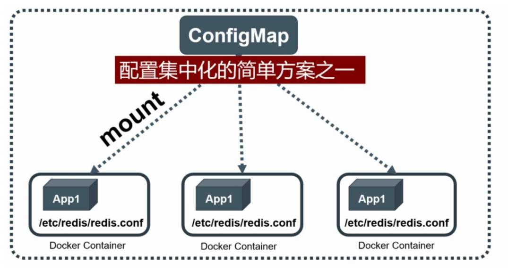

# 存储卷

​	Volume（存储卷）是Pod中能够被多个容器访问的共享目录。 Kubernetes的Volume概念、用途和目的与Docker的Volume比较类似，但 两者不能等价。首先，Kubernetes中的Volume被定义在Pod上，然后被 一个Pod里的多个容器挂载到具体的文件目录下；其次，Kubernetes中的 Volume与Pod的生命周期相同，但与容器的生命周期不相关，当容器终 止或者重启时，Volume中的数据也不会丢失。最后，Kubernetes支持多 种类型Volume，例如GlusterFS、Ceph等先进的分布式文件系统

## 1. 存储卷种类

Kubernetes提供了非常丰富的Volume类型，下面逐一进行说明。 

### **emptyDir** 

一个emptyDir Volume是在Pod分配到Node时创建的。从它的名称就 可以看出，它的初始内容为空，并且无须指定宿主机上对应的目录文 件，因为这是Kubernetes自动分配的一个目录，当Pod从Node上移除时，emptyDir中的数据也会被永久删除。emptyDir的一些用途如下。 

- 临时空间，例如用于某些应用程序运行时所需的临时目录，且无须永久保留。 

-  长时间任务的中间过程CheckPoint的临时保存目录。 

- 一个容器需要从另一个容器中获取数据的目录（多容器共享目录）。

目前，用户无法控制emptyDir使用的介质种类。如果kubelet的配置 是使用硬盘，那么所有emptyDir都将被创建在该硬盘上。Pod在将来可 以设置emptyDir是位于硬盘、固态硬盘上还是基于内存的tmpfs上，上面的例子便采用了emptyDir类的Volume。 

### **hostPath** 

hostPath为在Pod上挂载宿主机上的文件或目录，它通常可以用于以 下几方面。 

- 容器应用程序生成的日志文件需要永久保存时，可以使用宿主机的高速文件系统进行存储。 

- 需要访问宿主机上Docker引擎内部数据结构的容器应用时，可以通过定义hostPath为宿主机/var/lib/docker目录，使容器内部应用可以直接访问Docker的文件系统。 

在使用这种类型的Volume时，需要注意以下几点。 

- 在不同的Node上具有相同配置的Pod，可能会因为宿主机上的目录和文件不同而导致对Volume上目录和文件的访问结果不一致。 

- 如果使用了资源配额管理，则Kubernetes无法将hostPath在宿主机上使用的资源纳入管理。 

### **NFS** 

使用NFS网络文件系统提供的共享目录存储数据时，我们需要在系 统中部署一个NFS Server。

### **其他类型的Volume**

- iscsi：使用iSCSI存储设备上的目录挂载到Pod中。 

- flocker：使用Flocker管理存储卷。 

- glusterfs：使用开源GlusterFS网络文件系统的目录挂载到Pod中。

- rbd：使用Ceph块设备共享存储（Rados Block Device）挂载到Pod中。

- gitRepo：通过挂载一个空目录，并从Git库clone一个git repository以供Pod使用。 

- secret：一个Secret Volume用于为Pod提供加密的信息，你可以将定义在Kubernetes中的Secret直接挂载为文件让Pod访问。Secret Volume是通过TMFS（内存文件系统）实现的，这种类型的Volume总是不会被持久化的、
- 云存储：例如awsElasticBlockStore、gcePersistentDisk、AuzreDisk等


## 2. 示例

### 镜像准备

​	这里我们开发一个java的springboot web项目： 具有以下两个功能：

1. 访问/返回项目版本号和服务器域名或主机名
2. 上传、展示图片

#### 1. 编写java服务

```java
package edu.k8s.webapp;

import org.springframework.stereotype.Controller;
import org.springframework.ui.Model;
import org.springframework.web.bind.annotation.GetMapping;
import org.springframework.web.bind.annotation.PathVariable;
import org.springframework.web.bind.annotation.RequestMapping;
import org.springframework.web.bind.annotation.RequestParam;
import org.springframework.web.multipart.MultipartFile;

import javax.servlet.ServletOutputStream;
import javax.servlet.http.HttpServletResponse;
import javax.servlet.http.Part;
import java.io.*;
import java.net.InetAddress;
import java.net.UnknownHostException;

@Controller
public class WebController {

    @RequestMapping("/")
    public String index(Model model) throws UnknownHostException {
        InetAddress addr = InetAddress.getLocalHost();
        String hostName= addr.getHostName(); //获取本机计算机名称
        model.addAttribute("hostname",hostName);
        return "index";
    }

    @RequestMapping("/page")
    public String uploadPage(){
        return "upload";
    }

    @RequestMapping("/upload")
    public void upload(@RequestParam(value = "file") Part part) throws IOException {
        InputStream in = part.getInputStream();
        File tempDir = new File("/temp");
        if(!tempDir.exists()){
            boolean mkdir = tempDir.mkdir();
        }
        FileOutputStream out = new FileOutputStream("/temp/" + part.getSubmittedFileName());
        byte[] buff = new byte[1024];
        int len  = 0;
        while((len = in.read(buff))!=-1){
            out.write(buff,0,len);
        }
    }

    @GetMapping("/image/{name}")
    public void show(@PathVariable String name, HttpServletResponse response) throws IOException {
        FileInputStream fileInputStream = new FileInputStream("/temp/" + name);
        ServletOutputStream outputStream = response.getOutputStream();
        byte[] buff = new byte[1024];
        int len = 0;
        while((len = fileInputStream.read(buff))!=-1){
            outputStream.write(buff,0,len);
        }
    }
}
```

服务调试完毕后，执行```mvn clean package```打包

#### 2. 编写Dockerfile

```dockerfile
FROM openjdk:8u201-jdk-alpine3.9
COPY webapp-0.0.1-SNAPSHOT.jar /app.jar
ENTRYPOINT ["java","-jar","/app.jar"]
```

#### 3. 构建上传镜像

这里使用的是个人阿里云本地仓库服务，也可以使用dockerhub等其他镜像仓库服务

```bash
$ docker build -t webapp .
$ docker login --username=赵千里bbzhanshi999 registry.cn-hangzhou.aliyuncs.com
$ docker tag webapp registry.cn-hangzhou.aliyuncs.com/zhaoqianli/webapp:v1
$ docker push registry.cn-hangzhou.aliyuncs.com/zhaoqianli/webapp:v1
```

#### 4. 试运行

在其他节点上下载镜像，运行

```bash
$ docker run --name webapp -p 38080:8080 registry.cn-hangzhou.aliyuncs.com/zhaoqianli/webapp:v1
```

访问服务：http://ipaddr:38080/



### 2.1 emptyDir

​	emptyDir是空目录，并且会随着pod的消失而被删除，因此适合存放临时文件，这里我们以webapp来进行示例,创建deploy和NodePort svc

#### 1. 编写 webapp-volumes.yaml

```yaml
---
apiVersion: apps/v1
kind: Deployment
metadata:
  name: webapp-deploy
  namespace: default
spec:
  replicas: 1
  selector:
    matchLabels:
      app: webapp
  template:
    metadata:
      labels:
        app: webapp
    spec:
      volumes:
      - name: tempvol
        emptyDir: {}
      containers:
      - name: webapp
        image: registry.cn-hangzhou.aliyuncs.com/zhaoqianli/webapp:v1
        ports:
        - name: http
          containerPort: 8080
        volumeMounts:
        - mountPath: /temp
          name: tempvol
        imagePullPolicy: IfNotPresent
---
apiVersion: v1
kind: Service
metadata:
  name: webapp-svc
  namespace: default
spec:
  selector:
    app: webapp
  type: NodePort
  ports:
  - port: 8080
    targetPort: 8080
    nodePort: 30088
---
```

#### 2. 运行部署与服务

```bash
$ kubectl apply -f webapp-volumes.yaml
```

访问上传图片的服务，然后手动删除pod，看图片是否还存在

#### 总结

​	我们可以发现，当我们上传图片成功并且访问图片成功后，删除掉pod后，deploy会帮我们重新创建replicas，这时候再去访问图片，你啥也看不到，**说明emptyDir和pod的生命周期绑定**。

### 2.2 hostPath

​	hostpath是将容器的路径挂载在宿主机之上，它虽然能够实现文件的持久化，但是，假如我们重启的pod不原来的node上，那么仍然是访问不到数据的，所以此种方式只适用于绑定宿主机的情况下，例如收集宿主机的日志

#### 1. 编写webapp-hostPath-volumes.yaml

这里将原来的emptyDir修改成hostPath

```yaml
---
apiVersion: apps/v1
kind: Deployment
metadata:
  name: webapp-deploy
  namespace: default
spec:
  replicas: 1
  selector:
    matchLabels:
      app: webapp
  template:
    metadata:
      labels:
        app: webapp
    spec:
      volumes:
      - name: tempvol
        hostPath:
          path: "/opt/webapp/data"
          type: DirectoryOrCreate #目录不存在就自动创建
      containers:
      - name: webapp
        image: registry.cn-hangzhou.aliyuncs.com/zhaoqianli/webapp:v1
        ports:
        - name: http
          containerPort: 8080
        volumeMounts:
        - mountPath: /temp
          name: tempvol
        imagePullPolicy: IfNotPresent
---
apiVersion: v1
kind: Service
metadata:
  name: webapp-svc
  namespace: default
spec:
  selector:
    app: webapp
  type: NodePort
  ports:
  - port: 8080
    targetPort: 8080
    nodePort: 30088
---
```

#### 2. 运行部署与服务

```bash
$ kubectl apply -f webapp-hostPath-volumes.yaml
```

访问上传图片的服务，然后删除节点，访问宿主机下目录 ```/opt/webapp/data```,检查图片是否存在



#### 总结

​	上图中我们可以发现，pod运行在node203节点中，其指定挂载目录下确实有我们上传的图片，当我们删除pod时，这个文件夹依然存在，但是当我们重新创建pod之后，其宿主机如果不在node203上的话，那么图片也就显示不出来。

### 2.3 nfs共享存储

	NFS就是Network File System的缩写，它最大的功能就是可以通过网络，让不同的机器、不同的操作系统可以共享彼此的文件。
	
	NFS服务器可以让PC将网络中的NFS服务器共享的目录挂载到本地端的文件系统中，而在本地端的系统中来看，那个远程主机的目录就好像是自己的一个磁盘分区一样，在使用上相当便利；
​		nfs可以真正的实现存储空间与k8s集群的隔离，数据将被存储中nfs搭建的存储服务中，我们仍然以webapp来做实验

#### 1. 搭建 nfs

1. 单独新建一台宿主机store111作为提供nfs的服务器，并将其域名注入至master和node中（略）

2. store111,node202,node203下载nfs服务

   ```bash
   $ yum install -y nfs-utils
   ```

3. store111 创建共享存储目录

   ```bash
   mkdir -p /data/volumes
   ```

4. 编制/etc/exports文件

   将/data/volumes 暴露至192.168.134.0/16网段，开放读写权限和root权限

   ```bash
   vim /etc/exports
   -------------------
   /data/volumes     192.168.134.0/16(rw,no_root_squash)
   ```

5. 启动服务设置自启动

   ```bash
   $ systemctl start nfs
   $ systemctl enable nfs
   ```

   > nfs默认监听2049端口
   >
   > ```bash
   > ss -tnl
   > --------------------
   > LISTEN      0      64           *:2049      *:*   
   > ```

#### 2. 编辑webapp-nfs-volumes.yaml

```yaml
---
apiVersion: apps/v1
kind: Deployment
metadata:
  name: webapp-deploy
  namespace: default
spec:
  replicas: 1
  selector:
    matchLabels:
      app: webapp
  template:
    metadata:
      labels:
        app: webapp
    spec:
      volumes:
      - name: tempvol
        nfs:
          path: /data/volumes
          server: store111
      containers:
      - name: webapp
        image: registry.cn-hangzhou.aliyuncs.com/zhaoqianli/webapp:v1
        ports:
        - name: http
          containerPort: 8080
        volumeMounts:
        - mountPath: /temp
          name: tempvol
        imagePullPolicy: IfNotPresent
---
apiVersion: v1
kind: Service
metadata:
  name: webapp-svc
  namespace: default
spec:
  selector:
    app: webapp
  type: NodePort
  ports:
  - port: 8080
    targetPort: 8080
    nodePort: 30088
---
```

#### 3. 运行部署与服务

```bash
$ kubectl apply -f webapp-nfs-volumes.yaml
```

访问上传图片的服务，然后删除节点，访问store111下目录 ```/data/volumes```,检查图片是否存在



#### 总结

​	我们发现，图片最终上传至store111虚拟机下的/data/volumes目录，nfs给与集群内部的pod有了真正持久化的能力。

## 3. pv与pvc

​	之前提到的Volume是被定义在Pod上的，属于计算资源的一部分， 而实际上，网络存储是相对独立于计算资源而存在的一种实体资源。比如在使用虚拟机的情况下，我们通常会先定义一个网络存储，然后从中划出一个“网盘”并挂接到虚拟机上。Persistent Volume（PV）和与之相 关联的Persistent Volume Claim（PVC）也起到了类似的作用。PV可以被理解成Kubernetes集群中的某个网络存储对应的一块存储，它与Volume类似，但有以下区别。 

- PV只能是网络存储，不属于任何Node，但可以在每个Node上访问。
- PV并不是被定义在Pod上的，而是独立于Pod之外定义的。 
- PV目前支持的类型包括：gcePersistentDisk、 AWSElasticBlockStore、AzureFile、AzureDisk、FC（Fibre Channel）、Flocker、NFS、iSCSI、RBD（Rados Block Device）、CephFS、 Cinder、GlusterFS、VsphereVolume、Quobyte Volumes、VMware Photon、Portworx Volumes、ScaleIO Volumes和HostPath（仅供单机测试）。



**pv的好处**：我们可以将存储资源的定义和架设工作从容器编排工作中抽象出来，交由更加专业的fs工程师来进行调试，而开发者只需要声明自己所需要的存储资源就可以了



### 搭建与使用过程

1. 搭建底层存储系统
2. 编辑pv与底层存储系统进行绑定
3. 用户定义pod或deploy时创建pvc存储需求声明
4. 运行pod后，pvc会与某个符合条件的pv进行绑定，通过pvc使用底层存储资源

### 示例

​	还是以webapp为例，搭建pv与pvc，底层存储系统仍然采用nfs

#### 1. 创建nfs服务

在store111上创建几个目录

```bash
mkdir -p /data/volumes/v{1,2,3}
```

编辑```/etc/exports```

```bash
/data/volumes/v1     192.168.134.0/16(rw,no_root_squash)
/data/volumes/v2     192.168.134.0/16(rw,no_root_squash)
/data/volumes/v3     192.168.134.0/16(rw,no_root_squash)
```

刷新配置

```bash
exportsfs -arv

#检查挂载
showmount -e
----------------
/data/volumes/v3 192.168.134.0/16
/data/volumes/v2 192.168.134.0/16
/data/volumes/v1 192.168.134.0/16
```

#### 2. 定义pv

编制资源清单： pv-demo.yaml

```yaml
apiVersion: v1
kind: PersistentVolume
metadata:
  name: pv001
  labels:
    name: pv001
spec:
  nfs:
    path: /data/volumes/v1
    server: store111
  accessModes: ["ReadWriteMany","ReadWriteOnce"]
  capacity:
    storage: 100Mi
---
apiVersion: v1
kind: PersistentVolume
metadata:
  name: pv002
  labels:
    name: pv002
spec:
  nfs:
    path: /data/volumes/v2
    server: store111
  accessModes: ["ReadWriteOnce"]
  capacity:
    storage: 200Mi
---
apiVersion: v1
kind: PersistentVolume
metadata:
  name: pv003
  labels:
    name: pv003
spec:
  nfs:
    path: /data/volumes/v3
    server: store111
  accessModes: ["ReadWriteMany","ReadWriteOnce"]
  capacity:
    storage: 200Mi
```

创建pv

```bash
$ kubectl apply -f pv-demo.yaml
```

#### 3. 定义 pvc和声明使用pvc

编辑 webapp-pvc-volumes.yaml

```yaml
---
apiVersion: v1
kind: PersistentVolumeClaim
metadata:
  name: imagepvc
  namespace: default
spec:
  accessModes: ["ReadWriteMany"]
  resources:
    requests:
      storage: 150Mi
---
apiVersion: apps/v1
kind: Deployment
metadata:
  name: webapp-deploy
  namespace: default
spec:
  replicas: 1
  selector:
    matchLabels:
      app: webapp
  template:
    metadata:
      labels:
        app: webapp
    spec:
      volumes:
      - name: tempvol
        persistentVolumeClaim:
          claimName: imagepvc
      containers:
      - name: webapp
        image: registry.cn-hangzhou.aliyuncs.com/zhaoqianli/webapp:v1
        ports:
        - name: http
          containerPort: 8080
        volumeMounts:
        - mountPath: /temp
          name: tempvol
        imagePullPolicy: IfNotPresent
---
apiVersion: v1
kind: Service
metadata:
  name: webapp-svc
  namespace: default
spec:
  selector:
    app: webapp
  type: NodePort
  ports:
  - port: 8080
    targetPort: 8080
    nodePort: 30088
---
```

#### 4 运行pvc和pv

```bash
$ kubectl apply -f webapp-pvc-volumes.yaml
```

#### 5. 查看pv状态

```bash
$ kubectl get pv
------------------
NAME    CAPACITY   ACCESS MODES   RECLAIM POLICY   STATUS      CLAIM              STORAGECLASS   REASON   AGE
pv001   100Mi      RWO,RWX        Retain           Available                                              3m18s
pv002   200Mi      RWO            Retain           Available                                              3m18s
pv003   200Mi      RWO,RWX        Retain           Bound       default/imagepvc                           3m18s
```

我们发现pvc最终和pv003挂钩了，原因是因为其storage符合要求，并且包含了多谢多次的模式

#### 6  测试服务

访问服务，查看store111下v3目录中是否有图片



可见此时对应的v3文件夹中已经包含了上传的图片

## 4 动态存储类StorageClass

​	StorageClass作为对存储资源的抽象定义，对用户设置的PVC申请屏蔽后端存储的细节，一方面减少了用户对于存储资源细节的关注，另一方面减轻了管理员手工管理PV的工作，由系统自动完成PV的创建和绑定，实现了动态的资源供应。基于StorageClass的动态资源供应模式将逐步成为云平台的标准存储配置模式。



> 示例详见 《kubernetes权威指南第四版》8.6 动态存储管理实战：**GlusterFS**

## 5. configmap与secret

​	为了能够准确和深刻理解Kubernetes ConfigMap的功能和价值，我们需要从Docker说起。我们知道，Docker通过将程序、依赖库、数据及配置文件“打包固化”到一个不变的镜像文件中的做法，解决了应用的部署的难题，但这同时带来了棘手的问题，即配置文件中的参数在运行期如何修改的问题。我们不可能在启动Docker容器后再修改容器里的配置文件，然后用新的配置文件重启容器里的用户主进程。为了解决这个问题，Docker提供了两种方式： 

- 在运行时通过容器的环境变量来传递参数； 

- 通过Docker Volume将容器外的配置文件映射到容器内。 

​    这两种方式都有其优势和缺点，在大多数情况下，后一种方式更合适我们的系统，因为大多数应用通常从一个或多个配置文件中读取参数。但这种方式也有明显的缺陷：我们必须在目标主机上先创建好对应的配置文件，然后才能映射到容器里。上述缺陷在分布式情况下变得更为严重，因为无论采用哪种方式，写入（修改）多台服务器上的某个指定文件，并确保这些文件保持一致，都是一个很难完成的目标。此外，在大多数情况下，我们都希望能集中管理系统的配置参数，而不是管理一堆配置文件。针对上述问题，Kubernetes给出了一个很巧妙的设计实现，如下所述。、

​	首先，把所有的配置项都当作key-value字符串，当然value可以来自某个文本文件，比如配置项password=123456、user=root、 host=192.168.8.4用于表示连接FTP服务器的配置参数。这些配置项可以作为Map表中的一个项，整个Map的数据可以被持久化存储在Kubernetes的Etcd数据库中，然后提供API以方便Kubernetes相关组件或客户应用CRUD操作这些数据，上述专门用来保存配置参数的Map就是Kubernetes ConfigMap资源对象。

​	接下来，Kubernetes提供了一种内建机制，将存储在etcd中的ConfigMap通过Volume映射的方式变成目标Pod内的配置文件，不管目标Pod被调度到哪台服务器上，都会完成自动映射。进一步地，如果 ConfigMap中的key-value数据被修改，则映射到Pod中的“配置文件”也会随之自动更新。于是，Kubernetes ConfigMap就成了分布式系统中最为简单（使用方法简单，但背后实现比较复杂）且对应用无侵入的配置中心。ConfigMap配置集中化的一种简单方案如图所示。 



### 5.1   配置容器化应用的几种方式

1. 自定义命令行参数：args

2. 把配置文件直接拷贝至镜像

3. 环境变量：

   1. cloud native的应用程序一般可直接通过环境变量加载配置
   2. 通过entrypoint脚本来预处理变量为配置文件中的配置信息

4. 存储卷

   存储卷直接挂载至容器存储配置文件的目录

### 5.2 创建configmap

​	这里我们仍然使用之前创建的webapp这个springboot应用来体验configmap的作用，顺便体会一下springboot的云原生特性在容器化过程中的体现。

​	首先我们修改webapp的代码，添加自定义配置greeting，并且增加输出greeting的html页面

application.properties

   ```pro
greeting=${GREET:hello k8s}
   ```

这里的**${GREET:hello k8s}**含义是通过读取环境变量中GREET的值来设置greeting的的值，如果环境变量中没有，就直接采用默认值**hello k8s**

WebController.java

```java
@Value("${greeting}")
private String greeting;

@RequestMapping("/greeting")
public String greeting(Model model){
    model.addAttribute("greeting",greeting);
    return "greeting";
}
```

greeting.html

```html
<!DOCTYPE html>
<html lang="en" xmlns:th="http://www.thymeleaf.org">
<head>
    <meta charset="UTF-8">
    <title>greeting</title>
</head>
<body>
    <h1 th:text="${greeting}"></h1>
</body>
</html>
```

然后编写dockerfile，发布镜像至仓库（略）

#### **1.**通过**YAML**配置文件方式创建 

我们可以像编制其他k8s标准资源一样通过yaml格式编写configmap,

##### 1.1 创建示例

例如编写 cm-demo.yaml

```yaml
apiVersion: v1
kind: ConfigMap
metadata:
  name: webapp-config
data:
  greeting: hello k8s from configmap str
  key-application-properties: |
    greeting= hello k8s from configmap file
```

​	这里data属性中的属性值既可以是字符串，也可以是当做一个完整的文件内容，因此第一个greeting代表的是值，第二个key-application-properties代表的是一个完整的properties配置文件

执行以下命令创建configmap

```bash
$ kubectl apply -f cm-demo.yaml
```

查看创建的cm

```bash
$ kubectl describe cm webapp-config
-----------------
webapp-config   2      7s
[root@master201 webapp]# kubectl describe cm webapp-config
Name:         webapp-config
Namespace:    default
Labels:       <none>
Annotations:  kubectl.kubernetes.io/last-applied-configuration:
                {"apiVersion":"v1","data":{"greeting":"hello k8s from configmap str","key-application-properties":"greeting= hello k8s from configmap file...

Data
====
greeting:
----
hello k8s from configmap str
key-application-properties:
----
greeting= hello k8s from configmap file

Events:  <none>
```

#### **2.**通过**kubectl**命令行方式创建 

​	不使用YAML文件，直接通过kubectl create configmap也可以创建ConfigMap，可以使用参数--from-file或--from-literal指定内容，并且可以 在一行命令中指定多个参数。

（1）通过--from-file参数从文件中进行创建，可以指定key的名称，也可以在一个命令行中创建包含多个key的ConfigMap，语法为：

```bash
$ kubectl create configmap NAME --from-file=[key=]source
```

（2）通过--from-file参数从目录中进行创建，该目录下的每个配置文件名都被设置为key，文件的内容被设置为value，语法为： 

```bash
$ kubectl create configmap NAME --from-file=config-fir-dir
```

（3）使用--from-literal时会从文本中进行创建，直接将指定的key#=value#创建为ConfigMap的内容，语法为

```bash
$ kubectl create configmap NAME --from-literal=key=value
```

##### 2.1 创建示例

首先创建一个application.properties文件

```bash
vim application.properties
---------------------
greeting=hello k8s from configmap file2
```

然后通过命令创建configmap

```bash
$ kubectl create cm webapp-config2 --from-file=./application.properties --from-literal=greeting="hello k8s from configmap str2"
```

### 5.3 pod中使用configmap

#### **1.**通过环境变量方式使用**ConfigMap** 

​	首先我们创建基于镜像webapp的示例pod

```yaml
apiVersion: v1
kind: Pod
metadata:
  name: cm-env-webapp
  namespace: default
spec:
  containers:
  - name: webapp
    image: registry.cn-hangzhou.aliyuncs.com/zhaoqianli/webapp:v3
    env:
    - name: GREET   #定义环境变量的名称
      valueFrom:
        configMapKeyRef:
          name: webapp-config2  # 环境变量的值取自哪一个configmap
          key: greeting       #取该配置文件中的哪个key
```

运行pod，访问其内部，检查环境变量，curl访问接口服务检查返回html

```bash
/ # printenv | grep GREET
GREET=hello k8s from configmap str2
----------------------------------
[root@master201 webapp]# curl http://10.244.1.48:8080/greeting
<!DOCTYPE html>
<html lang="en">
<head>
    <meta charset="UTF-8">
    <title>greeting</title>
</head>
<body>
    <h1>hello k8s from configmap str2</h1>
</body>
```


#### **2.**通过**volumeMount**使用**ConfigMap** 

​	以存储卷方式挂载的配置信息，当ConfigMap中值修改之后，pod中的挂载内容也会随即改变，这就给动态热更新pod提供了条件。

首先我们创建基于镜像webapp的示例pod

```yaml
apiVersion: v1
kind: Pod
metadata:
  name: cm-vol-webapp
  namespace: default
spec:
  containers:
  - name: webapp
    image: registry.cn-hangzhou.aliyuncs.com/zhaoqianli/webapp:v3
    volumeMounts:
    - name: appprop             #引用volume的名称
      mountPath: /config        # 挂载的容器内部目录位置
  volumes:
  - name: appprop              # 定义volume的名称
    configMap:                 #定义volume从configmap中获取数据
      name: webapp-config       # configmap的名称
      items:                    # 要挂载的具体的项目
      - key: key-application-properties   # 指定cm中的某一个键名
        path: application.properties      # 指定键对应的值以什么文件名进行挂载
```

> 这里需要补充一个知识点，springboot 应用启动时，默认读取同目录下config目录中的配置文件，因此这里我们将configmap中的key-application-properties的值以文件的形式挂载到容器/config/application.properties之下。这样springboot应用会优先读取这个配置文件

运行pod，访问其内部，检查挂载卷文件，curl访问接口服务检查返回html

```bash
/ # ls /config
application.properties
/ # cat /config/application.properties 
greeting= hello k8s from configmap file
----------------------------------
[root@master201 webapp]# curl http://10.244.2.55:8080/greeting
<!DOCTYPE html>
<html lang="en">
<head>
    <meta charset="UTF-8">
    <title>greeting</title>
</head>
<body>
    <h1>hello k8s from configmap file</h1>
</body>
```

##### 2.1. 修改configmap检查配置变化

 修改webapp-config

```bash
$ kubectl edit cm webapp-config
-----------------------------
"key-application-properties":"greeting= hello k8s from configmap file aready edited\n"}
```

再次访问容器内部，检查配置修改

```bash
/config # cat application.properties 
greeting= hello k8s from configmap file by edited again
```

可以发现值已经改变了，但是访问接口是不能改变的，原因是springboot已经将配置文件读取到了内存中，因此如果要实现动态热更新，还需要配置容器应用内部的接口或者功能，我们知道，spring cloud的分布式配置中心可以实现动态热更新。

## 6. secret

​	secret可以看做是一种特殊的configmap，凡是不能以明文方式保存的配置信息都可以保存在secret中，比如密码，ssl密钥，docker registry的登录密码和账号等。

​	secret分为以下三种类型：

- docker Regiistry： 用于控制pod所依赖的私有镜像下载时使用特定账户和密码登录
- generic：一般性的加密配置文件信息，例如mysql的root密码
- tls： 用于保存ssl协议的私钥

### 6.1 示例

   我们以mysql的root密码为例来实现密码的secret挂载，我们知道官方mysql的镜像有一个环境变量代表了root的password： **MYSQL_ROOT_PASSWORD**,我们通过secret的base64来加密维护这个密码，然后通过环境变量的方式传给pod使用。

#### 1. 创建secret

```bash
$ kubectl create secret generic mysql-passwd --from-literal=passwd=1234
```

查看创建的secret

```bash
$ kubectl describe secret mysql-passwd
------------------------
Name:         mysql-passwd
Namespace:    default
Labels:       <none>
Annotations:  <none>

Type:  Opaque

Data
====
passwd:  4 bytes
```

我们可以看到这里的值是不会显示出来的

```bash
# 查看yaml格式的描述
$ kubectl get secret mysql-passwd -o yaml
-----------------------------
apiVersion: v1
data:
  passwd: MTIzNA==
kind: Secret
metadata:
  creationTimestamp: "2020-01-24T07:30:36Z"
  name: mysql-passwd
  namespace: default
  resourceVersion: "410866"
  selfLink: /api/v1/namespaces/default/secrets/mysql-passwd
  uid: 5e2f4115-1065-4c1b-b684-0fba35ea15f3
type: Opaque
```

我们可以看到这里passwd的值已经被编码了，通过base64命令解码

```bash
[root@master201 webapp]# echo "MTIzNA==" |  base64 -d
1234
```

#### 2. 创建mysql pod

```bash
$ vim mysql-demo.yaml
```

```yaml
apiVersion: v1
kind: Pod
metadata:
  name: secret-mysql
  namespace: default
spec:
  containers:
  - name: mysql
    image: mysql:5.6
    env:
    - name: MYSQL_ROOT_PASSWORD
      valueFrom:
        secretKeyRef:
          key: passwd
          name: mysql-passwd
```

运行pod，进入pod内部通过mysql命令登录root账户，检查是否有效

```bash
# printenv 
MYSQL_ROOT_PASSWORD=1234
```

可见密码已经以1234注入了，其实这种方式的安全性并没有多高，因为之前已经验证了secret中的密码是以base64进行编码的，很容易解码。

