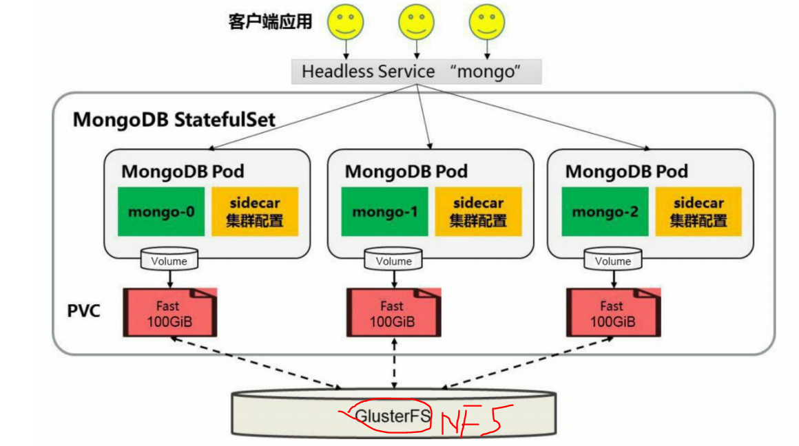

# StatefulSet

​	在Kubernetes系统中，Pod的管理对象RC、Deployment、DaemonSet和Job都面向无状态的服务。但现实中有很多服务是有状态的，特别是 一些复杂的中间件集群，例如MySQL集群、MongoDB集群、Akka集 群、ZooKeeper集群等，这些应用集群有4个共同点。 

（1）每个节点都有固定的身份ID，通过这个ID，集群中的成员可以相互发现并通信。 

（2）集群的规模是比较固定的，集群规模不能随意变动。 

（3）集群中的每个节点都是有状态的，通常会持久化数据到永久存储中。

（4）如果磁盘损坏，则集群里的某个节点无法正常运行，集群功能受损。

​	如果通过RC或Deployment控制Pod副本数量来实现上述有状态的集群，就会发现第1点是无法满足的，因为Pod的名称是随机产生的，Pod的IP地址也是在运行期才确定且可能有变动的，我们事先无法为每个Pod都确定唯一不变的ID。另外，为了能够在其他节点上恢复某个失败的节点，这种集群中的Pod需要挂接某种共享存储，为了解决这个问题，Kubernetes从1.4版本开始引入了PetSet这个新的资源对象，并且在1.5版本时更名为StatefulSet，StatefulSet从本质上来说，可以看作 Deployment/RC的一个特殊变种，它有如下特性。

- StatefulSet里的每个Pod都有稳定、唯一的网络标识，可以用来 发现集群内的其他成员。假设StatefulSet的名称为kafka，那么第1个Pod叫kafka-0，第2个叫kafka-1，以此类推。 

- StatefulSet控制的Pod副本的启停顺序是受控的，操作第n个Pod时，前n-1个Pod已经是运行且准备好的状态。 

- StatefulSet里的Pod采用稳定的持久化存储卷，通过PV或PVC来实现，删除Pod时默认不会删除与StatefulSet相关的存储卷（为了保证数 据的安全）。 

​    StatefulSet除了要与PV卷捆绑使用以存储Pod的状态数据，还要与 Headless Service配合使用，即在每个StatefulSet定义中都要声明它属于哪个Headless Service。Headless Service与普通Service的关键区别在于，它没有Cluster IP，如果解析Headless Service的DNS域名，则返回的是该 Service对应的全部Pod的Endpoint列表。StatefulSet在Headless Service的基础上又为StatefulSet控制的每个Pod实例都创建了一个DNS域名，这个域名的格式为： 

​	比如一个3节点的Kafka的StatefulSet集群对应的Headless Service的名称为kafka，StatefulSet的名称kafka，则StatefulSet里的3个Pod的DNS 名称分别为kafka-0.kafka、kafka-1.kafka、kafka-3.kafka，这些DNS名称可以直接在集群的配置文件中固定下来。

## StatefulSet特点

1. 稳定且唯一的网络标识符
2. 稳定且持久的存储。
3. 有序、平滑的部署和扩展
4. 有序、平滑的删除和终止

## StatefulSet组成

三个组件： headless service、StatefulSet控制器、volumeClaimTemplate

## 示例

​	本节以MongoDB为例，使用StatefulSet完成MongoDB集群的创建， 为每个MongoDB实例在共享存储中（这里采用nfs）都申请一片存储空间，以实现一个无单点故障、高可用、可动态扩展的MongoDB集群。部署架构如图所示。



### 1. 创建共享存储

在store111上创建nfs共享存储

```bash
$ mkdir -p /data/volumes/v{1,2,3,4,5}
$ vim /etc/exports
-----------------
/data/volumes/v1     192.168.134.0/16(rw,no_root_squash)
/data/volumes/v2     192.168.134.0/16(rw,no_root_squash)
/data/volumes/v3     192.168.134.0/16(rw,no_root_squash)
/data/volumes/v4     192.168.134.0/16(rw,no_root_squash)
/data/volumes/v5     192.168.134.0/16(rw,no_root_squash)
-----------------
$ exportsfs -arv
```

### 2. 声明pv

编制资源清单： pv-demo.yaml

```yaml
apiVersion: v1
kind: PersistentVolume
metadata:
  name: pv001
  labels:
    name: pv001
spec:
  nfs:
    path: /data/volumes/v1
    server: store111
  accessModes: ["ReadWriteMany"]
  capacity:
    storage: 100Mi
---
apiVersion: v1
kind: PersistentVolume
metadata:
  name: pv002
  labels:
    name: pv002
spec:
  nfs:
    path: /data/volumes/v2
    server: store111
  accessModes: ["ReadWriteMany"]
  capacity:
    storage: 100Mi
---
apiVersion: v1
kind: PersistentVolume
metadata:
  name: pv003
  labels:
    name: pv003
spec:
  nfs:
    path: /data/volumes/v3
    server: store111
  accessModes: ["ReadWriteMany"]
  capacity:
    storage: 100Mi
---
apiVersion: v1
kind: PersistentVolume
metadata:
  name: pv004
  labels:
    name: pv004
spec:
  nfs:
    path: /data/volumes/v4
    server: store111
  accessModes: ["ReadWriteMany"]
  capacity:
    storage: 100Mi
---
apiVersion: v1
kind: PersistentVolume
metadata:
  name: pv005
  labels:
    name: pv005
spec:
  nfs:
    path: /data/volumes/v5
    server: store111
  accessModes: ["ReadWriteMany"]
  capacity:
    storage: 100Mi
```

创建pv

```bash
$ kubectl apply -f pv-demo.yaml
```

### 3.创建headless service

```bash
$ vim mongo-service.yaml
```

```yaml
apiVersion: v1
kind: Service
metadata:
  name: mongo
  labels:
    name: mongo
spec:
  ports:
  - port: 27017
    targetPort: 27017
  clusterIP: None
  selector:
    role: mongo
```

创建service

```bash
$ kubectl create -f mongo-service.yaml
```

### 4. 创建SatefulSet

> 参考https://github.com/cvallance/mongo-k8s-sidecar/blob/master/example/StatefulSet/mongo-statefulset.yaml

```bash
$ vim mongo-sts.yaml
```

```yaml
apiVersion: apps/v1beta1
kind: StatefulSet
metadata:
  name: mongo
spec:
  serviceName: "mongo"
  replicas: 3
  selector:
    matchLabels:
      role: mongo
      environment: test
  template:
    metadata:
      labels:
        role: mongo
        environment: test
    spec:
      terminationGracePeriodSeconds: 10
      containers:
        - name: mongo
          image: mongo:3.4
          command:
            - mongod
            - "--replSet"
            - rs0
            - "--bind_ip"
            - 0.0.0.0
            - "--smallfiles"
            - "--noprealloc"
          ports:
            - containerPort: 27017
          volumeMounts:
          - name: mongo-data
            mountPath: /data/db
        - name: mongo-sidecar
          image: cvallance/mongo-k8s-sidecar
          env:
            - name: MONGO_SIDECAR_POD_LABELS
              value: "role=mongo,environment=test"
  volumeClaimTemplates:
  - metadata:
      name: mongo-data
    spec:
      accessModes: ["ReadWriteMany"]
      resources:
        requests:
          storage: 100Mi
  
  
```

> 其中的主要配置说明如下。 
>
> （1）在该StatefulSet的定义中包括两个容器：mongo和mongo-sidecar。mongo是主服务程序，mongo-sidecar是将多个mongo实例进行集群设置的工具。mongo-sidecar中的环境变量如下。 
>
> - **MONGO_SIDECAR_POD_LABELS**：设置为mongo容器的标签，用于sidecar查询它所要管理的MongoDB集群实例。 
>
> - **KUBERNETES_MONGO_SERVICE_NAME**：它的值为mongo，表示sidecar将使用mongo这个服务名来完成MongoDB集群的设置。
>
> （2）replicas=3表示这个MongoDB集群由3个mongo实例组成。 
>
> （3）volumeClaimTemplates是StatefulSet最重要的存储设置。resources.requests.storage=100Mi表示为每个mongo实例都分配100GiB的磁盘空间。 s

执行StatefulSet

```bash
$ kubectl apply -f mongo-sts.yaml
```

### 5. 查看运行状态

查看pv与pvc绑定状态

```bash
$ kubectl get pvc
-------------------------------
NAME                 STATUS   VOLUME   CAPACITY   ACCESS MODES   STORAGECLASS   AGE
mongo-data-mongo-0   Bound    pv001    100Mi      RWX                           19m
mongo-data-mongo-1   Bound    pv002    100Mi      RWX                           59s
mongo-data-mongo-2   Bound    pv003    100Mi      RWX                           45s
```

实际上我们可以发现volumeClaimTemplates做了两步动作，帮我们创建了pod的volume，并且帮我们创建了对应的pvc

### 6. 集群的扩容

假设在系统运行过程中，3个mongo实例不足以满足业务的要求， 这时就需要对mongo集群进行扩容。仅需要通过对StatefulSet进行scale操作，就能实现在mongo集群中自动添加新的mongo节点。 

使用kubectl scale命令将StatefulSet设置为5个实例： 

```bash
$ kubectl scale --replicas=5 sts mongo
```

监视扩容的过程

```bash
$ kubectl get pods -w 
--------------------
mongo-0   2/2     Running             0          10m
mongo-1   2/2     Running             0          8m38s
mongo-2   2/2     Running             0          5m1s
mongo-3   0/2     ContainerCreating   0          6s
mongo-3   2/2     Running             0          10s
mongo-4   0/2     Pending             0          0s
mongo-4   0/2     Pending             0          0s
mongo-4   0/2     Pending             0          1s
mongo-4   0/2     ContainerCreating   0          1s
mongo-4   2/2     Running             0          5s


# 查看pv绑定
$ kubectl get pv
----------------------
pv001   100Mi      RWX            Retain           Bound    default/mongo-data-mongo-0                           13h
pv002   100Mi      RWX            Retain           Bound    default/mongo-data-mongo-1                           13h
pv003   100Mi      RWX            Retain           Bound    default/mongo-data-mongo-2                           13h
pv004   100Mi      RWX            Retain           Bound    default/mongo-data-mongo-3                           13h
pv005   100Mi      RWX            Retain           Bound    default/mongo-data-mongo-4                           13h
```

