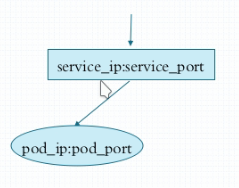
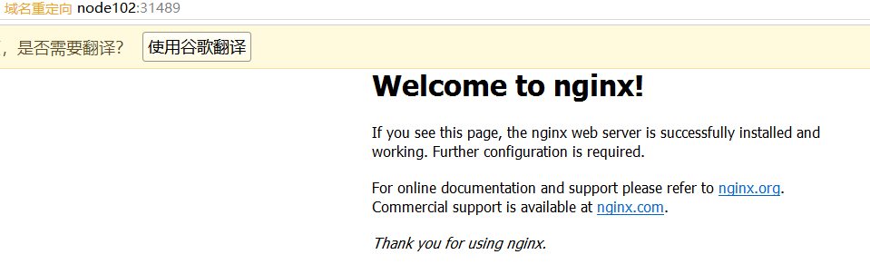

# kubernetes应用快速入门

## 1.kubectl命令

kubectl命令时api server的客户端，通过kubectl可以访问、查询、管理、维护kubernetes集群中的资源和对象

### 1.1 kubectl常用命令

打开终端，输入

```bash
$ kubectl
--------------
Basic Commands (Beginner):
  create         Create a resource from a file or from stdin.
  expose         Take a replication controller, service, deployment or pod and expose it as a new Kubernetes Service
  run            Run a particular image on the cluster
  set            Set specific features on objects
....
```

可以看到，kubectl的命令有很多，并且有解释

#### describe命令

```bash
$ kubectl describe [type] [object]
```

通过describe命令可以查询各对象的详细信息状态，通常用于解决问题时，比如某一个pod始终没有就绪，那么就要检查pod状态

```bash
$ kubectl describe pod podName
```

查询某个节点的状态

```bash
$ kubectl describe node node102
```

#### cluster-info命令

用于查询集群状态

kubectl cluster-info

```bash
$ kubectl cluster-info
```

## 2. 快速启动应用

### 2.1 kubectl run命令

输入```kubectl run --help``` 命令，检查结果

```bash
Examples:
  # Start a single instance of nginx.
  kubectl run nginx --image=nginx 
  //第一个nginx代表的是deployment的名称，第二个是镜像的名称，和docker一样
  
  # Start a single instance of hazelcast and let the container expose port 5701 .
  kubectl run hazelcast --image=hazelcast --port=5701
  
  # Start a single instance of hazelcast and set environment variables "DNS_DOMAIN=cluster" and "POD_NAMESPACE=default"
in the container.
  kubectl run hazelcast --image=hazelcast --env="DNS_DOMAIN=cluster" --env="POD_NAMESPACE=default"
  
  # Start a single instance of hazelcast and set labels "app=hazelcast" and "env=prod" in the container.
  kubectl run hazelcast --image=hazelcast --labels="app=hazelcast,env=prod"
  
  # Start a replicated instance of nginx.
  kubectl run nginx --image=nginx --replicas=5 //启动五个pods
  
  # Dry run. Print the corresponding API objects without creating them.
  kubectl run nginx --image=nginx --dry-run //dry run相当于预演模式，相当于正式运行前的测试，实际上不会
  
  # Start a single instance of nginx, but overload the spec of the deployment with a partial set of values parsed from
JSON.
  kubectl run nginx --image=nginx --overrides='{ "apiVersion": "v1", "spec": { ... } }'
  
  # Start a pod of busybox and keep it in the foreground, don't restart it if it exits.
  kubectl run -i -t busybox --image=busybox --restart=Never 
  //restart never表示如果某一个pod挂了，不会再补一个
  
  # Start the nginx container using the default command, but use custom arguments (arg1 .. argN) for that command.
  kubectl run nginx --image=nginx -- <arg1> <arg2> ... <argN>
  
  # Start the nginx container using a different command and custom arguments.
  kubectl run nginx --image=nginx --command -- <cmd> <arg1> ... <argN>
  
  # Start the perl container to compute π to 2000 places and print it out.
  kubectl run pi --image=perl --restart=OnFailure -- perl -Mbignum=bpi -wle 'print bpi(2000)'
  
  # Start the cron job to compute π to 2000 places and print it out every 5 minutes.
  kubectl run pi --schedule="0/5 * * * ?" --image=perl --restart=OnFailure -- perl -Mbignum=bpi -wle 'print bpi(2000)'
  // 创建了一个job，定时控制器
  .......
```

可以发现，kubectl为我们提供了很多nginx应用的示例，参考:http://docs.kubernetes.org.cn/468.html

### 2.2  运行nginx

```bash
$ kubectl run nginx-deploy --image=nginx:1.14-alpine --port=80 --replicas=1 --dry-run=true
---------------------------------
deployment.apps/nginx-deploy created (dry run)
```

继续运行：

```bash
$ kubectl run nginx-deploy --image=nginx:1.14-alpine --port=80 --replicas=1
-----------------------------------
deployment.apps/nginx-deploy created
```

查看pods

```bash
$ kubectl get pods -o wide
------------------------
NAME                            READY   STATUS    RESTARTS   AGE     IP           NODE      NOMINATED NODE   READINESS GATES
nginx-deploy-66ff98548d-5jns6   1/1     Running   0          8m42s   10.244.2.2   node103   <none>           <none>
//可以发现，这个pod运行在node103下
```

nginx-deploy-66ff98548d-5jns6虽然是pod的名称，但实际上代表了多层含义，不仅创建了pod，还创建了deployment控制器和replicasets控制器，创建了的对象有如下：

deployment：nginx-deploy 

replicasets：nginx-deploy-66ff98548d

应用pods：nginx-deploy-66ff98548d-5jns6

### 2.3 访问nginx服务

要想访问nginx，首先我们知道由于pods并没有对应的service，所以我们从外部是无法访问的，所以只能在集群内部进行访问，从上面的输入信息，我们可以看到，这个pod运行的地址为：```10.244.2.2``` ,而这个地址显然是flannel生产的pod-cidr所在网段，也就是pod之间进行通讯的网段

在pod运行节点node103上输入：

```bash
$ ifconfig
--------------------
cni0: flags=4163<UP,BROADCAST,RUNNING,MULTICAST>  mtu 1450
        inet 10.244.2.1  netmask 255.255.255.0  broadcast 0.0.0.0
        inet6 fe80::2c20:5eff:fe44:86fd  prefixlen 64  scopeid 0x20<link>
        ether 2e:20:5e:44:86:fd  txqueuelen 1000  (Ethernet)
        RX packets 1  bytes 28 (28.0 B)
        RX errors 0  dropped 0  overruns 0  frame 0
        TX packets 8  bytes 656 (656.0 B)
        TX errors 0  dropped 0 overruns 0  carrier 0  collisions 0
```

可以看到，node103有一个cni0的虚拟网络适配器，地址：10.244.2.1，所以其对应的nginx pod 地址为10.244.2.2

任意一个节点输入：

```bash
$ curl http://10.244.2.2
-------------------------
<!DOCTYPE html>
<html>
<head>
<title>Welcome to nginx!</title>
<style>
    body {
        width: 35em;
        margin: 0 auto;
        font-family: Tahoma, Verdana, Arial, sans-serif;
    }
</style>
</head>
<body>
<h1>Welcome to nginx!</h1>
<p>If you see this page, the nginx web server is successfully installed and
working. Further configuration is required.</p>

<p>For online documentation and support please refer to
<a href="http://nginx.org/">nginx.org</a>.<br/>
Commercial support is available at
<a href="http://nginx.com/">nginx.com</a>.</p>

<p><em>Thank you for using nginx.</em></p>
</body>
</html>
```

### 2.4 外部访问nginx服务

试着删除nginx的pod，会发现，控制器会重新补充pod上来

```bash
$ kubectl delete pods nginx-deploy-66ff98548d-vrtkq //删除nginx pod
------------------
kubectl delete pods nginx-deploy-66ff98548d-vrtkq

$ kubectl get pods -o wide
---------------------------------
NAME                            READY   STATUS    RESTARTS   AGE   IP           NODE      NOMINATED NODE   READINESS GATES
nginx-deploy-66ff98548d-f7p8m   1/1     Running   0          15s   10.244.2.2   node103   <none>           <none>
```

可以发现删除pod后，新的pod被创建出来，两个pod之间的网络地址肯定是不一样的，因此，外部访问需要将nginx服务通过service暴露出去。



上图反映了暴露方式，我们知道pod是动态的，有控制器replicaset来维护，因此其地址会随时改变，为了让外部客户能通过访问固定地址，我们需要将pod的服务端口暴露出去，

#### 2.4.1  内部暴露端口

```bash
$ kubectl expose --help //输入命令查看详细描述
-------------------------------------
Usage:
  kubectl expose (-f FILENAME | TYPE NAME) [--port=port] [--protocol=TCP|UDP|SCTP] [--target-port=number-or-name]
[--name=name] [--external-ip=external-ip-of-service] [--type=type] [options]
```

services暴露端口的方式有多种：

ClusterIP(默认):将端口暴露于k8s集群内部，供其他外部pod进行访问

NodePort:暴露至节点的端口，这样外部的服务就可以访问该pod

根据提示，输入暴露端口命令

```bash
$ kubectl expose deployment nginx-deploy  --name=nginx --port=80 --target-port=80 
//将pod的80端口暴露至service的80端口
---------------------------
service/nginx-deploy exposed
```

查询service情况

```bash
$ kubectl get services
-----------------------
NAME           TYPE        CLUSTER-IP      EXTERNAL-IP   PORT(S)   AGE
kubernetes     ClusterIP   10.96.0.1       <none>        443/TCP   20h
nginx-deploy   ClusterIP   10.105.37.206   <none>        80/TCP    113s
```

此时，发现暴露的端口运行在10.105.37.206这个虚拟ip上，由于我们采用的是默认的ClusterIP方式暴露端口，因此只能在集群内部使用这个地址来进行访问。

```bash
$ curl http://10.105.37.206  //访问暴露的nginx服务
```

创建一个busybox的pod来试着和nginx进行pod间的通讯

采用交互方式运行一个busybox pod

```bash
kubectl run busybox-deploy --image=busybox --replicas=1 -it --restart=Never
$ cat /etc/resolv.conf
------------------
nameserver 10.96.0.10
search default.svc.cluster.local svc.cluster.local cluster.local
$ wget nginx
---------------
Connecting to nginx (10.103.52.40:80)
saving to 'index.html'
index.html           100% |**************************************************************************|   612  0:00:00 ETA
'index.html' saved
```

可以发现 其nameserver确实指向了10.96.0.10,当我们使用wget nginx时，也确实下载下来了index.html，pod间通过service交互成功

```bash
$ kubectl describe svc nginx
-------------------------
Name:              nginx
Namespace:         default
Labels:            run=nginx-deploy  //控制器创建新pod都会带上这个label
Annotations:       <none>
Selector:          run=nginx-deploy
Type:              ClusterIP
IP:                10.103.52.40
Port:              <unset>  80/TCP
TargetPort:        80/TCP
Endpoints:         10.244.1.3:80
Session Affinity:  None
Events:            <none>

$ kubectl get pods --show-labels
---------------------------------
NAME                            READY   STATUS    RESTARTS   AGE   LABELS
busybox-deploy                  0/1     Error     0          16m   run=busybox-deploy 
nginx-deploy-66ff98548d-znjdm   1/1     Running   0          62m   pod-template-hash=66ff98548d,run=nginx-deplo //这里可以看到pod的标签
```

通过以上发现，之所以删除nginx 的pod，busybox仍然能通过nginx服务名来访问到新的pod，原因是因为控制器在重新创建pod时，都会给pod打上run=nginx-deploy的标签，所有service可以找到此标签，并且建立iptables映射

#### 2.4.2 动态扩展pod

```bash
$ kubectl scale --help 
-------------------------
Usage:
  kubectl scale [--resource-version=version] [--current-replicas=count] --replicas=COUNT (-f FILENAME | TYPE NAME)
  
$ kubectl scale --replicas=2  deployments nginx-deploy //将nginx-deploy扩展至两个
-----------------------
deployment.apps/nginx-deploy scaled

$ kubectl get deployments
----------------------
NAME           READY   UP-TO-DATE   AVAILABLE   AGE
nginx-deploy   2/2     2            2           103m  //可用的nginx pod 有两个

$ kubectl get pods -o wide
------------------------
nginx-deploy-66ff98548d-7pz9m   1/1     Running   0  2m48s   10.244.2.6   node103   <none>           <none>  
nginx-deploy-66ff98548d-znjdm   1/1     Running   0  106m    10.244.1.3   node102   <none>           <none>
```

可以发现，当scale命令执行后，出现了两个nginx的pod，分别运行在node102和node103上，这时候访问service时，service会采取一定的策略进行请求转发

### 2.5   验证service

```bash
iptables -vnL -t nat
--------------
Chain KUBE-SERVICES (2 references)
 pkts bytes target     prot opt in     out     source               destination         
    0     0 KUBE-MARK-MASQ  tcp  --  *      *      !10.244.0.0/16        10.96.0.1            /* default/kubernetes:https cluster IP */ tcp dpt:443
    0     0 KUBE-SVC-NPX46M4PTMTKRN6Y  tcp  --  *      *       0.0.0.0/0            10.96.0.1            /* default/kubernetes:https cluster IP */ tcp dpt:443
    0     0 KUBE-MARK-MASQ  udp  --  *      *      !10.244.0.0/16        10.96.0.10           /* kube-system/kube-dns:dns cluster IP */ udp dpt:53
    0     0 KUBE-SVC-TCOU7JCQXEZGVUNU  udp  --  *      *       0.0.0.0/0            10.96.0.10           /* kube-system/kube-dns:dns cluster IP */ udp dpt:53
    0     0 KUBE-MARK-MASQ  tcp  --  *      *      !10.244.0.0/16        10.96.0.10           /* kube-system/kube-dns:dns-tcp cluster IP */ tcp dpt:53
    0     0 KUBE-SVC-ERIFXISQEP7F7OF4  tcp  --  *      *       0.0.0.0/0            10.96.0.10           /* kube-system/kube-dns:dns-tcp cluster IP */ tcp dpt:53
    0     0 KUBE-MARK-MASQ  tcp  --  *      *      !10.244.0.0/16        10.96.0.10           /* kube-system/kube-dns:metrics cluster IP */ tcp dpt:9153
    0     0 KUBE-SVC-JD5MR3NA4I4DYORP  tcp  --  *      *       0.0.0.0/0            10.96.0.10           /* kube-system/kube-dns:metrics cluster IP */ tcp dpt:9153
    0     0 KUBE-MARK-MASQ  tcp  --  *      *      !10.244.0.0/16        10.103.52.40         /* default/nginx: cluster IP */ tcp dpt:80
    0     0 KUBE-SVC-4N57TFCL4MD7ZTDA  tcp  --  *      *       0.0.0.0/0            10.103.52.40         /* default/nginx: cluster IP */ tcp dpt:80
    4   240 KUBE-NODEPORTS  all  --  *      *       0.0.0.0/0            0.0.0.0/0            /* kubernetes service nodeports; NOTE: this must be the last rule in this chain */ ADDRTYPE match dst-type LOCAL
```

通过这一段调用链，我们可以发现实际上kube-proxy通过iptables实现了services对后端pods的负载均衡。

2.6 真外部访问nginx服务

如果我们想将nginx的端口直接暴露到集群外部供公网环境调用，或者宿主机调用，那么我们要将service的类型设置为NodePort

#### 2.6.1 修改原service方式

```bash
$ kubectl edit svc nginx
-----------------------
//将clusterIP换成NodePort
apiVersion: v1
kind: Service
metadata:
  creationTimestamp: "2019-12-05T13:35:31Z"
  labels:
    run: nginx-deploy
  name: nginx
  namespace: default
  resourceVersion: "12683"
  selfLink: /api/v1/namespaces/default/services/nginx
  uid: 060400a8-08e5-4cae-991f-9647bbf71b61
spec:
  clusterIP: 10.103.52.40
  ports:
  - port: 80
    protocol: TCP
    targetPort: 80
  selector:
    run: nginx-deploy
  sessionAffinity: None
  type: ClusterIP //这里修改成NodePort
status:
  loadBalancer: {}
  
$ kubectl get svc
----------------
nginx        NodePort    10.103.52.40   <none>        80:31489/TCP   102m
```

我们可以看到，此时ngnix服务已经变成NodePort，并且对外暴露了端口31489

宿主机打开浏览器访问：http://node102:31489 查看结果



#### 2.6.2 创建新service

```bash
kubectl expose deployment nginx-deploy --name=onginx   --type=NodePort
```

