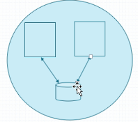

# Kubernetes资源清单定义入门

## 1. 资源概念

​	对于kubernetes而言，k8s中的大部分对象都被理解成资源，而这些资源都可以在创建时，采用yaml格式的资源清单形式定义，并且根据这个清单进行创建。

### 1.1 常用资源

- 工作负载型workload：Pod，ReplicaSet，Deployment，StatefulSet，DaemonSet，Job，CronJob
- 服务发现/负载均衡：Service，Ingress，....
- 配置与存储：Volume，CSI（容器存储接口）
  - ConfigMap：配置中心
  - Secret：保存敏感配置
  - DownwardApi：外部环境信息输出给容器
- 集群级的资源
  - Namespace，Node，Role，ClusterRole，RoleBinding，ClusterRoleBinding
- 元数据
  - HPA,PodTemplate，LimitRange

## 2. 资源清单

```bash
$ kubectl get pod nginx-deploy-66ff98548d-7pz9m -o yaml
```

展示如下yaml格式信息：

```yaml
apiVersion: v1
kind: Pod
metadata:
  creationTimestamp: "2019-12-05T14:38:17Z"
  generateName: nginx-deploy-66ff98548d-
  labels:
    pod-template-hash: 66ff98548d
    run: nginx-deploy
  name: nginx-deploy-66ff98548d-7pz9m
  namespace: default
  ownerReferences:
  - apiVersion: apps/v1
    blockOwnerDeletion: true
    controller: true
    kind: ReplicaSet
    name: nginx-deploy-66ff98548d
    uid: 074ddd40-c2d9-4a12-80db-af3f16884f49
  resourceVersion: "22980"
  selfLink: /api/v1/namespaces/default/pods/nginx-deploy-66ff98548d-7pz9m
  uid: 80cc4a69-41e0-4bc2-ab2e-941b4dfa0cb6
spec: #具体定义资源的规则，及其重要
  containers:
  - image: nginx:1.14-alpine
    imagePullPolicy: IfNotPresent
    name: nginx-deploy
    ports:
    - containerPort: 80
      protocol: TCP
    resources: {}
    terminationMessagePath: /dev/termination-log
    terminationMessagePolicy: File
    volumeMounts:
    - mountPath: /var/run/secrets/kubernetes.io/serviceaccount
      name: default-token-dsvv6
      readOnly: true
  dnsPolicy: ClusterFirst
  enableServiceLinks: true
  nodeName: node103
  priority: 0
  restartPolicy: Always
  schedulerName: default-scheduler
  securityContext: {}
  serviceAccount: default
  serviceAccountName: default
  terminationGracePeriodSeconds: 30
  tolerations:
  - effect: NoExecute
    key: node.kubernetes.io/not-ready
    operator: Exists
    tolerationSeconds: 300
  - effect: NoExecute
    key: node.kubernetes.io/unreachable
    operator: Exists
    tolerationSeconds: 300
  volumes:
  - name: default-token-dsvv6
    secret:
      defaultMode: 420
      secretName: default-token-dsvv6
status: #显式资源的当前状态
  conditions:
  - lastProbeTime: null
    lastTransitionTime: "2019-12-05T14:38:17Z"
    status: "True"
    type: Initialized
  - lastProbeTime: null
    lastTransitionTime: "2019-12-06T01:45:56Z"
    status: "True"
    type: Ready
  - lastProbeTime: null
    lastTransitionTime: "2019-12-06T01:45:56Z"
    status: "True"
    type: ContainersReady
  - lastProbeTime: null
    lastTransitionTime: "2019-12-05T14:38:17Z"
    status: "True"
    type: PodScheduled
  containerStatuses:
  - containerID: docker://856c9b8daae18626075661f4bc65bdbd1feee6eee2e4f002883edad5d8ba047a
    image: nginx:1.14-alpine
    imageID: docker-pullable://nginx@sha256:485b610fefec7ff6c463ced9623314a04ed67e3945b9c08d7e53a47f6d108dc7
    lastState:
      terminated:
        containerID: docker://43a1995889daccebb750f729a1cf0900e039e5d9efb33c0bbeaaa2712d6adb4b
        exitCode: 0
        finishedAt: "2019-12-05T15:31:34Z"
        reason: Completed
        startedAt: "2019-12-05T14:38:18Z"
    name: nginx-deploy
    ready: true
    restartCount: 1
    started: true
    state:
      running:
        startedAt: "2019-12-06T01:45:56Z"
  hostIP: 192.168.134.103
  phase: Running
  podIP: 10.244.2.7
  podIPs:
  - ip: 10.244.2.7
  qosClass: BestEffort
  startTime: "2019-12-05T14:38:17Z"
```

通过以上输出，我们可以看出yaml格式的资源清单，而k8s定义资源清单的格式不止yaml一种

### 2.1 创建资源的方法

1. apiserver仅接受JSON格式的资源定义。
2. 我们用run命令创建的资源其实都被转换成了JSON。
3. yaml格式提供配置清单，apiserver可自动将其转为JSON格式，而后再提交。

### 2.2  资源清单组成

大部分的资源配置清单都**必须具有**如下五个一级yaml字段：

1. apiVersion：格式：group/version（资源所属组/版本），默认组为core，可以省略

   ```bash
   $ kubectl api-versions //显式可用apiVersion
   -------------------------
   admissionregistration.k8s.io/v1
   admissionregistration.k8s.io/v1beta1
   apiextensions.k8s.io/v1
   apiextensions.k8s.io/v1beta1
   apiregistration.k8s.io/v1
   apiregistration.k8s.io/v1beta1
   apps/v1
   ....
   v1
   ```

   alpha:内测版本

   beta:非稳定公测版

   不同的apiVersion对应的资源定义字段是不同的，由于k8s本身还在快速迭代中，因此这个字段的值以后还会变，导致我们后续使用新版本的apiVersion时，资源定义的字段有可能不同，因此确认当前yaml的apiVersion字段是不可以省略的。

2. kind：资源类别（1.1节中的都是资源）

3. metadata：元数据

   重要资源字段：

   - name：同一类别资源中，name必须唯一。

   - namespace：所属名称空间，kubernetes级别的概念

   - labels：供Selector用于区分资源的重要属性

   - annotations：资源注解

   - uid：唯一标识，系统自动生成

   - selfLink：自引用 

     ```bash
     /api/v1/namespaces/default/pods/nginx-deploy-66ff98548d-7pz9m
     //可以看出，selflink反映了apiVersion:v1，namespaces:default，pods:nginx-deploy-66ff98548d-7pz9m
     ```

     基于http协议通过api server引用资源的方式：

     ```/api/group/{VERSION}/namespaces/{NAMESPACE}/{TYPE}/{NAME}```

4. spec：定义用户期望的目标状态，desire state

   不同的资源类型spec中字段不同

5. status：资源当前状态，current state，**这个字段有k8s维护，用户无法定义**

### 2.3  explain命令

​	输入命令：```kubectl explain pods```

```bash
FIELDS:
   apiVersion   <string>
     APIVersion defines the versioned schema of this representation of an
     object. Servers should convert recognized schemas to the latest internal
     value, and may reject unrecognized values. More info:
     https://git.k8s.io/community/contributors/devel/sig-architecture/api-conventions.md#resources

   kind <string>
     Kind is a string value representing the REST resource this object
     represents. Servers may infer this from the endpoint the client submits
     requests to. Cannot be updated. In CamelCase. More info:
     https://git.k8s.io/community/contributors/devel/sig-architecture/api-conventions.md#types-kinds

   metadata     <Object>
     Standard object's metadata. More info:
     https://git.k8s.io/community/contributors/devel/sig-architecture/api-conventions.md#metadata

   spec <Object>
     Specification of the desired behavior of the pod. More info:
     https://git.k8s.io/community/contributors/devel/sig-architecture/api-conventions.md#spec-and-status

   status       <Object>
     Most recently observed status of the pod. This data may not be up to date.
     Populated by the system. Read-only. More info:
     https://git.k8s.io/community/contributors/devel/sig-architecture/api-conventions.md#spec-and-status
```

```bash
$ kubectl explain pods.metadata
--------------------------------
FIELDS:
   annotations  <map[string]string>
     Annotations is an unstructured key value map stored with a resource that
     may be set by external tools to store and retrieve arbitrary metadata. They
     are not queryable and should be preserved when modifying objects. More
     info: http://kubernetes.io/docs/user-guide/annotations

   clusterName  <string>
     The name of the cluster which the object belongs to. This is used to
     distinguish resources with same name and namespace in different clusters.
     This field is not set anywhere right now and apiserver is going to ignore
     it if set in create or update request.
 ........
```

## 3.  创建yaml资源清单

### 3.1  准备工作

​	创建目录和清单文件

```bash
$ mkdir -p manifests
$ cd manifests
$ vim pod-demo.yaml
```

### 3.2 编辑 yaml

编辑创建的pod-demo.yml文件

```yaml
apiVersion: v1
kind: Pod
metadata:
  name: pod-demo
  namespace: default
  labels:
    app: myapp
    tier: frontend
spec:
  containers:
  - name: myapp
    image: nginx:1.14-alpine
  - name: busybox
    image: busybox:latest
    command:
    - "/bin/sh"
    - "-c"
    - "echo $(date) >> /usr/share/nginx/html/index.html; sleep 5"
```

以上pod清单文件中，有两个容器，nginx作为主容器运行，而busybox是一个边车容器，他的作用是每五秒向nginx首页输出当前时间，**但是这样是不行的，原因暂且不表，往下看**

## 4. 运行资源清单

#### 4.1通过yaml清单文件加载资源

```bash
$  kubectl create -f pod-demo.yaml //master下运行
------------------------------------
pod/pod-demo created

```

#### 4.2 查询pod是否创建

```bash
$ kubectl get pods
------------------------------
pod-demo                        2/2     Running   2          60s
```

#### 4.3 查询pod相信信息

```bash
$ kubectl describe pods pod-demo
---------------------------------
Containers:
  myapp:
    Container ID:   docker://5594605588ae55872688786430db739d28b43ef46bdc7038924a47e467d769fa
    Image:          nginx:1.14-alpine
    Image ID:       docker-pullable://nginx@sha256:485b610fefec7ff6c463ced9623314a04ed67e3945b9c08d7e53a47f6d108dc7
    Port:           <none>
    Host Port:      <none>
    State:          Running
      Started:      Fri, 06 Dec 2019 01:11:06 -0500
    Ready:          True
    Restart Count:  0
    Environment:    <none>
    Mounts:
      /var/run/secrets/kubernetes.io/serviceaccount from default-token-dsvv6 (ro)
  busybox:
    Container ID:  docker://657593977e3bc8a780149a9faa1d01a3ae8ce6170bbf347ca2982e9ec27853de
    Image:         busybox:latest
    Image ID:      docker-pullable://busybox@sha256:1828edd60c5efd34b2bf5dd3282ec0cc04d47b2ff9caa0b6d4f07a21d1c08084
    Port:          <none>
    Host Port:     <none>
    Command:
      /bin/sh
      -c
      echo $(date) >> /usr/share/nginx/html/index.html; sleep 5
    State:          Waiting
      Reason:       CrashLoopBackOff
    Last State:     Terminated
      Reason:       Completed
      Exit Code:    0
      Started:      Fri, 06 Dec 2019 01:14:42 -0500
      Finished:     Fri, 06 Dec 2019 01:14:47 -0500
    Ready:          False
    Restart Count:  5
    Environment:    <none>
    Mounts:
      /var/run/secrets/kubernetes.io/serviceaccount from default-token-dsvv6 (ro)
Conditions:
  Type              Status
  Initialized       True 
  Ready             False 
  ContainersReady   False 
  PodScheduled      True 
Volumes:
  default-token-dsvv6:
    Type:        Secret (a volume populated by a Secret)
    SecretName:  default-token-dsvv6
    Optional:    false
QoS Class:       BestEffort
Node-Selectors:  <none>
Tolerations:     node.kubernetes.io/not-ready:NoExecute for 300s
                 node.kubernetes.io/unreachable:NoExecute for 300s
Events:
  Type     Reason     Age                   From                            Message
  ----     ------     ----                  ----                            -------
  Normal   Scheduled  <unknown>             default-scheduler               Successfully assigned default/pod-demo to node102
  Normal   Pulled     5m13s                 kubelet, localhost.localdomain  Container image "nginx:1.14-alpine" already present on machine
  Normal   Created    5m13s                 kubelet, localhost.localdomain  Created container myapp
  Normal   Started    5m13s                 kubelet, localhost.localdomain  Started container myapp
  Normal   Pulling    4m7s (x4 over 5m13s)  kubelet, localhost.localdomain  Pulling image "busybox:latest"
  Normal   Pulled     4m4s (x4 over 5m10s)  kubelet, localhost.localdomain  Successfully pulled image "busybox:latest"
  Normal   Created    4m4s (x4 over 5m10s)  kubelet, localhost.localdomain  Created container busybox
  Normal   Started    4m4s (x4 over 5m9s)   kubelet, localhost.localdomain  Started container busybox
  Warning  BackOff    3s (x20 over 4m55s)   kubelet, localhost.localdomain  Back-off restarting failed container
```

从上面的日志中，我们发现busybox的容器命令执行失败，因为状态为Wait，Reason为CrashLoopBackOff，说明我们的命令有问题，这时候我们需要找错

#### 4.4 查找错误

我们需要通过查询日志来找错

```bash
kubectl logs pod-demo busybox
------------------------------
/bin/sh: can't create /usr/share/nginx/html/index.html: nonexistent directory
```

可以发现，这里显示我们找不着这个目录，3.2章节中已经说了这样是不行的，原因如下：

容器nginx和busybox虽然都运行在一个Pod中，但学过docker的都知道，他们的卷volume是相互独立的，因此，busybox中显然是不可能有这个路径的，我们可以通过如下方式证明：

通过交互模式进入nginx容器

```bash
$ kubectl exec pod-demo -c myapp -it  -- /bin/sh
/ # cat /usr/share/nginx/html/index.html
------------------------
<!DOCTYPE html>
<html>
<head>
<title>Welcome to nginx!</title>
........

$ kubectl exec pod-demo -c busybox -it  -- /bin/sh
```

我们可以发现，显然在nginx容器中是存在这个目录的



从上图可以看出，如果真的想让两个容器共享存储卷，那么我们还需在pod中配置共享存储卷，方法暂时不讲，我们先绕开解决错误

#### 4.5 修改错误

修改pod-demo.yaml文件

```bash
$ vim pod-demo.yaml
- "echo $(date) >> /usr/share/nginx/html/index.html; sleep 5" 更换为
- "sleep 3600" 
```

检查pod状态

```bash
$ kubectl get pods
-----------------------
pod-demo                        2/2     Running   0          9s
```

## 5.  删除资源

之前我们删除资源使用的都是指定资源的方式来删除，有了yaml后，我们还可以根据yaml清单来删除

```bash
$ kubectl delete -f pod-demo.yaml
```

#### yaml的优势

- 从上面的删除操作和创建操作，我们可以发现，有了yaml文件，我们就可以复用资源定义，不用像在第四章那样通过命令来创建
- yaml文件形式可以用来创建不受控制器管理的pod，我们创建的pod-demo中，没有定义任何控制器，所以不受控制器管理
- yaml中可以自定义各种属性，例如pod的名称，容器的名称，容器之间的交互，生命周期相关定义，资源限制等等

