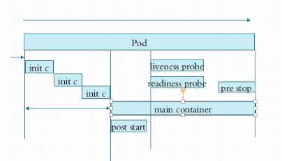

# Kubernetes Pod应用进阶

​	上节中，我们通过资源清单创建的pod是自主式pod，也就是不受控制器控制的pod，其实大部分的资源清单具有以下特点

- 一级字段：apiVersion（group/version),kind,metadata(name,namespace,labels,annotations...),spec,status(read only)

## Pod spec常用字段

> 通过命令```kubectl explain [字段名]```可以查询具体的详细解释
>
> 例如： ```kubectl explain pods.spec.containers```
>
> ```bash
> name <string> -required-
>      Name of the container specified as a DNS_LABEL. Each container in a pod
>      must have a unique name (DNS_LABEL). Cannot be updated.
> ```
>
> 可以看到，name属性字段类型string，并且required，也就是必须定义

- containers <[]object>

  - name string>

  - image <string>

  - imagePullPolicy      <string>  镜像获取策略

    - Always 永远从仓库下载，如果image tag是latest，那么默认就是Always
    - Never 从不从远程仓库下载
    - IfNotPresent 如果没有才去远程仓库下载，如果不是latest标签，默认是IfNotPresent 

  - ports        <[]Object> 暴露端口

    可以暴露多个端口，并且每个端口还有名字，**与docker不同的是**：我们不设置ports也不能阻止端口的暴露，因为pod之间是可以直接通讯的

    ```bash
    $ kubectl explain pods.spec.containers.ports
    -----------------------------------
    containerPort        <integer> -required-
    .....
    ```

    - containerPort        <integer> -required-
    - hostIP       <string>
    - hostPort     <integer>
    - name       <string>
    - protocol     <string>   Protocol for port. Must be UDP, TCP, or SCTP. Defaults to "TCP"

    书写格式,以第5章pod-demo.yaml为例

    ```yaml
    ....
    spec:
      containers:
      - name: myapp
        image: nginx:1.14-alpine
        ports: #这里注意，ports是个对象列表，因此需要用到- 
        - name: http
          containerPort: 80
        - name: https
          containerPort: 443
      - name: busybox
        image: busybox:latest
        command:
        - "/bin/sh"
        - "-c"
        - "echo $(date) >> /usr/share/nginx/html/index.html; sleep 5"
    ```

    以上的内容其实定义与否，80和443都会暴露。

  - command <[]string>  命令 args <[]string>

    这两个命令用于修改容器默认的运行方式，也就是entrypoint
  
    args相当于docker中的cmd
  
    command 相当于docker entrypoint 的定义，在docker的entrypoint的定义中，如果同时又cmd，那么cmd会作为参数传入entrypoint，在k8s中如果同时有command和args字段，那么args字段会作为参数传入entrypoint。具体规则见文档摘要：
  
    > This table summarizes the field names used by Docker and Kubernetes.
    >
    > | Description                         | Docker field name | Kubernetes field name |
    > | :---------------------------------- | :---------------- | :-------------------- |
    > | The command run by the container    | Entrypoint        | command               |
    > | The arguments passed to the command | Cmd               | args                  |
    >
    > When you override the default Entrypoint and Cmd, these rules apply:
    >
    > - If you do not supply `command` or `args` for a Container, the defaults defined in the Docker image are used.
    > - If you supply a `command` but no `args` for a Container, only the supplied `command` is used. The default EntryPoint and the default Cmd defined in the Docker image are ignored.
    > - If you supply only `args` for a Container, the default Entrypoint defined in the Docker image is run with the `args` that you supplied.
    > - If you supply a `command` and `args`, the default Entrypoint and the default Cmd defined in the Docker image are ignored. Your `command` is run with your `args`.
    >
    > Here are some examples:
    >
    > | Image Entrypoint | Image Cmd   | Container command | Container args | Command run      |
    > | :--------------- | :---------- | :---------------- | :------------- | :--------------- |
    > | `[/ep-1]`        | `[foo bar]` | <not set>         | <not set>      | `[ep-1 foo bar]` |
    > | `[/ep-1]`        | `[foo bar]` | `[/ep-2]`         | <not set>      | `[ep-2]`         |
    > | `[/ep-1]`        | `[foo bar]` | <not set>         | `[zoo boo]`    | `[ep-1 zoo boo]` |
    > | `[/ep-1]`        | `[foo bar]` | `[/ep-2]`         | `[zoo boo]`    | `[ep-2 zoo boo   |
    
  - restartPolicy        <string>
  
    pod的重启策略：
  
    Always：当容器停止运行时，总是重启pod
  
    OnFailure：当容器以非正常原因重启时，重启pod
  
    Never：不管什么情况，都不重启pod
  
    > 具体解释见：https://kubernetes.io/docs/concepts/workloads/pods/pod-lifecycle/#restart-policy
  
    **注意：**一旦一个pod创建绑定到了一个节点后，这个pod就不会再绑定到其他节点，换句话说，就是不可能在迁移到别的机器上，除非重新创建
  
  
  
## Pod metadata字段

- metadata <Object>

  - labels <map[string]string>

    labels是附加在资源之上的键值对，一个资源可以有多个标签，并且都可以交由选择器进行匹配，标签既可以在对象创建指定，也可以在创建之后通过命令进行增删改，标签可以用于多个维度的使用：

    1. 例如app标签指定应用程序性质，nginx redis tomcat .......
    2. tier指定pod是哪个层次的标签：frontend ，backend，store等，
    3. 标签开可以指定版本，release：stateble，canary，alpha，beta
    4. 环境标签evrionment,env:production development qa等

    **注**：标签的key长度要小于63字符，只能使用字母数字下划线点号连接线组成，只能以字母或数字开头

    标签中的value也不能超过63个字符，只能以字母数字开头和结尾，中间可以使用字母数字下划线连接线，**value值可为空**

    $ kubectl get pods --show-labels

    在命令后加```--show-labels```可以显示资源的标签

    ```bash
    $ kubectl get pods -l [selector='']
    ```

    上面的命令可以根据选择器选出符合选择器规则的pod，例如选择含有app label的pod

    ```bash
    $ kubectl get pods -l app
    ```

    **注意**：如果用-L而不是-l，那么代表展示所有pod的app属性值

    ```bash
    $ kubectl get pods -L app,run
    ------------------------------------
    NAME                            READY   STATUS    RESTARTS   AGE     APP     RUN
    busybox-deploy                  0/1     Error     0          2d13h           busybox-deploy
    nginx-deploy-66ff98548d-7pz9m   1/1     Running   2          2d12h           nginx-deploy
    nginx-deploy-66ff98548d-znjdm   1/1     Running   2          2d13h           nginx-deploy
    pod-demo                        2/2     Running   0          4m1s    myapp 
    ```

    我们可以通过命令给pod打标签

    ```bash
    $ kubectl label --help //获取命令使用说明
    
    $ kubectl label pod pod-demo release=canary //更新pod-demo的label release值位canary
    
    $ kubectl get pod pod-demo  --show-labels
    -----------------------
    NAME       READY   STATUS    RESTARTS   AGE    LABELS
    pod-demo   2/2     Running   2          155m   app=myapp,release=canary,tier=frontend
    ```

    修改已有标签的值需要添加--ovewrite参数

    ```bash
    $ kubectl label pod pod-demo release=stable --overwrite
    ------------
    pod/pod-demo labeled
    ```

    通过标签选择器来查询pod

    类似css选择器的设计思想，标签选择器种类：

    1. 等值关系：=，==，!=

       ```bash
       $ kubectl get pods -l release=stable --show-labels
       $ kubectl get pods -l release=stable,app=myapp --show-labels
       ```

    2. 集合关系：

       key in (value1,value2.....)

       key notin (value1,valu2......)

       ```bash
       $ kubectl get pods -l "release in (canary,beta,alpha)"
       $ kubectl get pods -l "release notin (canary,beta,alpha)"
       ```

    pod控制器，service都需要通过LabelSelector来关联对应的pod资源，而这种情况下，pod控制器和service都会用另外两个字段来进行嵌套：

    - matchLabels：直接给定键值

    - matchExpressions：基于给定的表达式来定义使用标签选择器，{key:"KEY",operator:"OPERATOR",values:[VAL1,VAL2,....]}

      常用operator：In NotIn,Exists,NotExists,后两种values字段值必须为空列表，前两种必须为非空

    > 标签不仅可以打在pods上，也可以打在各种资源上，例如打在node上
    >
    > ```bash
    > $ kubectl get nodes --show-labels
    > -------------------------
    > master101   Ready    master   3d13h   v1.16.3   beta.kubernetes.io/arch=amd64,beta.kubernetes.io/os=linux,kubernetes.io/arch=amd64,kubernetes.io/hostname=master101,kubernetes.io/os=linux,node-role.kubernetes.io/master=
    > node102     Ready    <none>   3d12h   v1.16.3   beta.kubernetes.io/arch=amd64,beta.kubernetes.io/os=linux,kubernetes.io/arch=amd64,kubernetes.io/hostname=node102,kubernetes.io/os=linux
    > node103     Ready    <none>   3d12h   v1.16.3   beta.kubernetes.io/arch=amd64,beta.kubernetes.io/os=linux,kubernetes.io/arch=amd64,kubernetes.io/hostname=node103,kubernetes.io/os=linux
    > 
    > $ kubectl label nodes node102 disktype=ssd
    > $ kubectl get nodes node102 --show-labels
    > ------------------------------------
    > node102   Ready    <none>   3d12h   v1.16.3   beta.kubernetes.io/arch=amd64,beta.kubernetes.io/os=linux,disktype=ssd,kubernetes.io/arch=amd64,kubernetes.io/hostname=node102,kubernetes.io/os=linux
    > ```
    >
    > 思考：为什么要给node打label？
    >
    > 原因是因为通过node标签，我们可以让集群应用创建时具有资源倾向性，例如，我们优先使用具有ssd固态存储介质的节点进行创建pod，我们还可以手动通过yaml来配置节点标签选择器，使得pod运行在特定的节点上
    >
    > ```bash
    > $ kubectl explain pods.spec.nodeSelector
    > ```
    >
    > 可以看到,通过定义字段nodeSelector，我们可以让资源运行在特定的node上
    >
    > 例如，让pod-demo只能运行在ssd节点上
    >
    > ```yaml
    > spec:
    > nodeSelector:
    >  disktype: ssd
    > ```
    >
    > ```bash
    > $ kubectl delete -f pod-demo.yaml
    > $ kubectl create -f pod-demo.yaml
    > $ kubectl get pods pod-demo -o wide
    > -------------------
    > pod-demo   2/2     Running   0          25s   10.244.1.8   node102   <none>           <none>
    > ```
    >
    > 可以发现，通过重新设置yaml中nodeSelector字段的值，我们的pod-demo铁定运行在了node102上，因为node102含有label ```disktype=ssd```
    >
    > 此外，我们还可以用nodeName字段直接选择节点，但不存在调度的意义

  - annotations  <map[string]string>

    与labels不同的是，它不能用于挑选资源对象，仅用于为对象提供“元数据”，且其键值大小没有限制，一些程序需要用到annotations。

    编辑annotation：

    ```yaml
    metadata:
      annotations:
        neuedu.com/created-by: "cluster admin" #添加应用创建的组织信息
    ```

    重新创建pod,查看annotations

    ```bash
    $ kubectl describe pods pod-demo
    -----------------------------
    Annotations:  neuedu.com/created-by: cluster admin
    ```

## Pod的声明周期

### 1.  常见的pod状态

- Pending:挂机状态，表示调度尚未完成，或者容器正在下载镜像
- Running: 运行状态
- Failed: pod内所有容器均已退出，但至少有一个容器退出失败状态
- Succeeded：pod内所有容器均成功执行后退出，且不会再重启
- Unknown：apiServer无法从kubelet进行通讯，或者kubelet无法向apiServer返回数据的情况下，报unknown

### 2.创建pod的阶段描述

​	初始化容器->主容器启动->主容器启动后钩子->主容器健康探测->主容器关闭->主容器关闭后钩子



### 3. pod声明周期中的重要行为

#### 3.1  初始化容器

#### 3.2  容器探测

- liveness：存活性探测
- readiness： 就绪性探测

