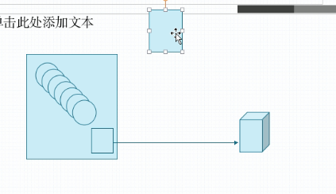

# kubernetes Pod控制器

## 1. ReplicaSet

​	用于控制pod的扩缩容和更新。它是新一代的Replication Controller，或者说是它的一个替换，Replication Controller已经不推荐使用了。

​	ReplicaSet的定义过程，主要需要定义三个核心资源：

1. 用户期望的pod数量
2. 标签选择器，选定受自己管理的副本
3. pod资源模板，定义了扩展pod时建立pod的规则

replicatSet主要用于管理无状态的Pod

> ReplicaSet不建议被直接使用，而是建议使用Deployment

### 1.1 例子

```bash
$ kubectl explain rs.spec
------------------------
FIELDS:
   minReadySeconds      <integer>
     Minimum number of seconds for which a newly created pod should be ready
     without any of its container crashing, for it to be considered available.
     Defaults to 0 (pod will be considered available as soon as it is ready)

   replicas     <integer>
     Replicas is the number of desired replicas. This is a pointer to
     distinguish between explicit zero and unspecified. Defaults to 1. More
     info:
     https://kubernetes.io/docs/concepts/workloads/controllers/replicationcontroller/#what-is-a-replicationcontroller

   selector     <Object> -required-
     Selector is a label query over pods that should match the replica count.
     Label keys and values that must match in order to be controlled by this
     replica set. It must match the pod template's labels. More info:
     https://kubernetes.io/docs/concepts/overview/working-with-objects/labels/#label-selectors

   template     <Object>
     Template is the object that describes the pod that will be created if
     insufficient replicas are detected. More info:
     https://kubernetes.io/docs/concepts/workloads/controllers/replicationcontroller#pod-template
```

可以看到，只需要定义选择器，副本数量，pod模板

```bash
$ kubectl explain rs.spec.template
--------------------------------
FIELDS:
   metadata     <Object>
     Standard object's metadata. More info:
     https://git.k8s.io/community/contributors/devel/sig-architecture/api-conventions.md#metadata

   spec <Object>
     Specification of the desired behavior of the pod. More info:
     https://git.k8s.io/community/contributors/devel/sig-architecture/api-conventions.md#spec-and-status
```

可以看到，**template的定义其实和pod一样，定义的就是pod**

```bash
$ vim rs-demo.yml
```

```yaml
apiVersion: apps/v1
kind: ReplicaSet
metadata:
  name: rs-demo
  namespace: default
spec:
  replicas: 2
  selector:
    matchLabels:
      app: rs-demo
      release: canary
  template:
    metadata:
      name: rs-demo-pod
      labels:
        app: rs-demo
        release: canary
    spec:
      containers:
      - name: rs-demo-container
        image: nginx:1.14-alpine
        ports:
        - name: http
          containerPort: 80
  
```

```bash
$ kubectl create -f rs-demo.yml
$ kubectl get rs
----------------------
NAME      DESIRED   CURRENT   READY   AGE
rs-demo   2         2         2       3m52s

$ kubectl get pods
------------------------
rs-demo-hnfvx   1/1     Running   0          14s
rs-demo-wkxx5   1/1     Running   0          14s
```

课件你的pod名称是随机生成的

 ```bash
$ kubectl describe pod rs-demo-hnfvx
-------------------------
Controlled By:  ReplicaSet/rs-demo
 ```

可见这个pod交由rs管理，我们故意删除一个pod

```bash
$ kubectl delete pod rs-demo-hnfvx
$ kubectl get pods
----------------
NAME            READY   STATUS    RESTARTS   AGE
rs-demo-j67lr   1/1     Running   0          7s
rs-demo-wkxx5   1/1     Running   0          3m3s
```

一个新的pod```rs-demo-j67lr```出现了，少了会自动补，那多了呢？

我们手动创建一个能被上面rs选中的pod，我们看看会发生什么

```bash
$ vim  test-nginx.yml
```

```yaml
apiVersion: v1
kind: Pod
metadata:
  name: test-nginx
  labels:
    app: rs-demo
    release: canary
spec:
    containers:
    - name: test-nginx
      image: nginx:1.14-alpine
      ports:
      - name: http
        containerPort: 80
```

```bash
$ kubectl delete -f rs-demo.yaml
$ kubectl create -f test-nginx.yaml
$ kubectl create -f rs-demo.yaml
$ kubectl get pods
---------------------
NAME            READY   STATUS    RESTARTS   AGE
rs-demo-w259v   1/1     Running   0          2s
test-nginx      1/1     Running   0          39s
```

我们可以发现rs只创建了一个pod，另一个被test-nginx占用了

访问pod：

```bash
$ curl 10.244.2.7
-------------------
<html>
.......
```

> 虽然我们可以直接访问rs创建的节点，但是大家也知道，pod的地址是变化的，因为重新创建地址又会变，所以我们需要使用service来暴露这些pod的服务，并且service还能实现负载均衡
>
> service是通过标签选择器来找到这些提供pod的服务的，比如我们上面创建的rs中定义了pod的标签为**app: rs-demo**和**release: canary**，因此，我们的service可以设置关联这些label的选择器来找到pod

### 1.2 更新ReplicaSet

#### edit命令修改replicas

```bash
$ kubectl edit ReplicaSet rs-demo
------------
replicas:3

$ kubectl get pods
-----------------
rs-demo-c5g2r   1/1     Running   0          3s    10.244.1.6   node202   <none>           <none>
rs-demo-w259v   1/1     Running   0          11m   10.244.2.7   node203   <none>           <none>
test-nginx      1/1     Running   0          11m   10.244.1.5   node202   <none>           <none>
```

#### 修改容器镜像版本

```bash
$ kubectl edit ReplicaSet rs-demo
-------------
image: nginx:latest

$ kubectl get rs -o wide
-------------------
rs-demo   3         3         3       19m   rs-demo-container   nginx:latest   app=rs-demo,release=canary

$ kubectl describe pod test-nginx
---------------------
containers:
  test-nginx:
    Container ID:   docker://c3536d633f64c2a110aba6940eb17633b619ac49c2182b3dd259c99c9d8f23bd
    Image:          nginx:1.14-alpine
```

你可能发现了，虽然我们修改了镜像版本，但是我们的pod中的容器并没有重新创建，原因是，rs并不会修改旧有的pod中的容器版本，而只会在重新创建pod时使用新镜像版本

```bash
$ kubectl delete pods test-nginx
$ kubectl describe pods rs-demo-2hf7h
------------------
Image:          nginx:latest
```

可见，当我们删除了原来的pod，新建的就采用了latest版本，我们可以利用这点实现金丝雀发布或者蓝绿发布

>金丝雀和蓝绿发布概念参考：https://www.cnblogs.com/apanly/p/8784096.html
>
>以上我们都是手动在进行版本的修改和发布，而**deployment**可以做蓝绿发布


一个deployment可以同时管理多个ReplicaSet，通过蓝绿更新pod，一旦发现新的版本有问题，还可以回滚到原来的rs


## 2. Deployment

​	Deployment建立在RS之上，除了拥有ReplicaSet的所有扩缩容功能，还具有以下扩展功能：滚动更新回滚，支持声明式配置的功能，支持随时更改，**是使用最多的控制器**。


## 3. DaemonSet

​	常用的控制器之一，往往用于系统级功能，DaemonSet可以理解为需要与k8s集群上每一个node一一绑定的控制器，它控制的pod需要在每一个node上都运行一个或多个，当这些pod宕机后，需要在宕机的node上在重建一个，而不是随机在任何一个node上建立。

​	试想一个应用场景，我们需要在每个集群节点上部署一个日志收集器，它的工作是收集当前节点上其他pod的运行日志和node的运行日志，那么显然这样的收集器需要与节点绑定，及时挂了，也不能在别的节点上创建，那么这样的应用场景就是适合使用DaemonSet



> Deployment和DeamonSet所控制的pod有以下特点：
>
> 1. 无状态
> 2. 必须始终持续运行在后台，不存在终止的一刻


## 4. Job

​	有些pod只是简单运行一些任务，例如某一个pod就是备份一次数据库，那么这样的pod运行完了就应该销毁，对于这样的pod，应该使用Job来控制。

> Job一般用于执行一次性的任务，比如一些临时任务，所以运行完就结束，当然，判断是否算正常结束时要用户自定义规则的，比如备份mysql数据库，如果没备份完job控制的pod就挂了，那么Job控制器是需要重新建立pod来重新运行的，直到任务完成。
>
> 因此，Job不适合用作周期性的任务，

## 5. CronJob

​	顾名思义，CronJob是用来控制周期性定时任务Pod的，例如定时备份数据库，定时启动计划任务等等。除了按照计划执行创建Pod，执行Pod任务以外，CronJob还要负责协调pod的创建时机，比如第一个Pod的任务还没执行完，第二个时间到的Pod还需要不需要创建，者些都可以使用CronJob来进行控制。

> Job和CronJob都是用于控制不需要常驻后台的Pod，执行完就销毁的Pod

## 6. StatefulSet

​	之前的Deployment或者ReplicaSet关注的都是群体pod，而不关注个体pod，简而言之pod是可以互相取代的，而StatefulSet关注的无法被取代的个体pod，例如Redis cluster，每一个redis节点的数据都是无法复制的，一个挂了，替换一个上来数据就丢失了，那么这样的场景就不适合使用Deployment来进行管理，对于有状态信息的pod，需要使用StatefulSet。

>  悲惨的是，StatefulSet并不能解决复杂的有状态运行场景，这些具体的控制流程需要运维人员用复杂的脚本定义规则控制，对于极端复杂的数据库集群控制，难度极大，在k8s 1.8版本后，有一种页数的控制器CDR：Custom Defined Resources，支持用户自定义资源，这个功能的灵活性要远超StatefulSet。另外还有Operator可以进行状态控制。
>
> 不管哪一种方式，其难度都很大，好比对k8s的二次开发，这才是**k8s的难点**。

