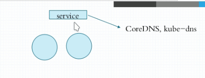
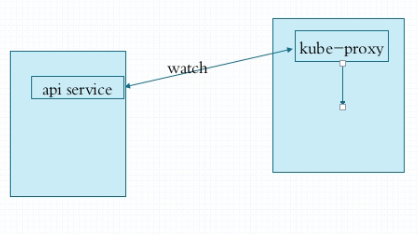
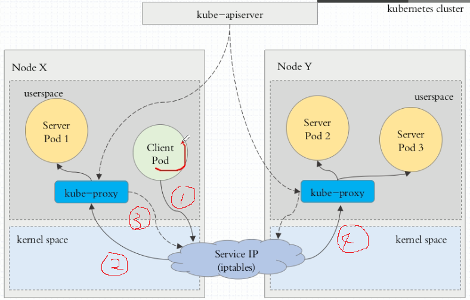
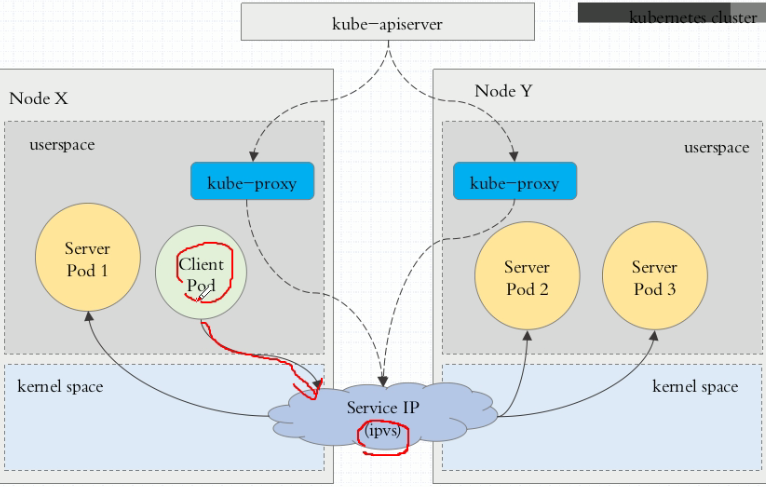
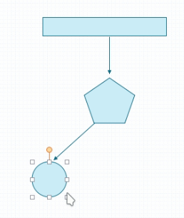

# kubernetes Service资源

​	service之所以能将服务暴露到集群内部并且实现负载均衡，原因是因为k8s有自己的coreDns服务，来映射域名和虚拟ip地址



​	service 的网络称之为cluster netowork，service的ip是vitrual IP，

而service的网路是由kube-proxy来维护的。任何pod的资源变动，例如扩展重创建都会通知api-server，而每一个节点上运行的kube-proxy都会去通过**watch**监听的方式实时与api-server同步pod资源变动，并且将变动的信息，也就是pod的地址变更至service，而service所维护的虚拟ip与pod ip的映射实际上是交给宿主机内核空间的iptables或者ipvs或userspace来实现。




## 1. service 的工作模式

service的实现方式有三种：

1. userspace: 1.1版之前
2. iptables：1.1-1.10版，1.10版以上如无ipvs的情况下也会使用
3. ipvs：1.10版之后

### 1.1 userspace

用户空间的方式大致如下图几步：

1. 客户端pod想要访问Server Pod,首先发送的请求会被iptables拦截，iptables根据内部规则，将请求转给客户端pod所在节点的kube-proxy服务。
2. 本地kube-proxy通过watch与kube-apiServer通讯获得到了其他节点的kube-proxy服务地址，并且将请求转至其他kube-proxy（包括自己）
3. iptables会拦截此请求，并且根据内部规则，将请求转发给所有节点上的kube-proxy
4. kube-proxy收到请求后，才会去寻找对应的service映射的pod服务



userspace的工作效率是比较低的，原因是因为中间转发过程较多，kube-proxy的负载较大，进和出都要经过它。

### 1.2 iptables

iptables方式与userspace的不同点在于，客户端pod请求Server pod时，iptables拦截请求后，不再转发给kube-proxy，而是事先在节点内核空间中已经直接注入了service的虚拟ip的dns规则，通过这个规则，直接施加对pod的负载均衡，之间转发给对应的pod。


iptables 因为它纯粹是为防火墙而设计的，并且基于内核规则列表，集群数量越多性能越差。
一个例子是，在5000节点集群中使用 NodePort 服务，如果我们有2000个服务并且每个服务有10个 pod，这将在每个工作节点上至少产生20000个 iptable 记录，这可能使内核非常繁忙。

### 1.3  IPVS

​	IPVS基本上是一种高效的Layer-4交换机，它提供[负载平衡](https://baike.baidu.com/item/负载平衡)的功能,`IPVS`模式与`iptables`同样基于`Netfilter`，但是采用的`hash`表，因此当`service`数量达到一定规模时，hash查表的速度优势就会显现出来，从而提高`service`的服务性能。



>在kubernetes 1.11版本后，service的默认模式就是ipvs，我们可以在配置service时设置其具体工作模式，如果不设置默认采用ipvs，但如果你的宿主机中b并没有启动ipvs，那么k8s会将service的工作模式**自动降级为iptables**

## 2. service的创建

### 2.1 资源清单字段

> ```bash
> $ kubectl explain svc
> ```

#### spec:

- #### type:

  ExternalName, ClusterIP, NodePort, and LoadBalancer
  
- sessionAffinity

  解释：

  ```bash
  Supports "ClientIP" and "None". Used to maintain session affinity. Enable
       client IP based session affinity. Must be ClientIP or None. Defaults to
       None.
  ```

  sessionAffinity基于客户端IP地址进行会话保持的模式，即第1次将某个客户端发起的请求转发到后端的某个Pod上，之后从相同的客户端发起的请求都将被转发到后端相同的Pod上默认值位None，当为None时，service的负载均衡策略是RoundRobin，而为ClientIp时，就绑定至客户端ip


### 2.2 ClusterIP

​	默认的service类型，每一个服务都会存在一个入口ip地址，以下通过为例子，映射通过ds-demo.yaml创建的redis服务,

创建redis-svc.yaml

```yaml
apiVersion: v1
kind: Service
metadata:
  name: redis
  namespace: default
spec:
  selector:
    app: redis
    role: logstor
  clusterIP: 10.97.97.97
  type: ClusterIP
  ports:
  - port: 6379
    targetPort: 6379
```

#### 启动service

```bash
$ kubectl apply -f redis-svc.yaml
```

查看服务描述

```bash
$ kubectl describe svc redis
-------------------
Name:              redis
Namespace:         default
Labels:            <none>
Annotations:       <none>
Selector:          app=redis,role=logstor
Type:              ClusterIP
IP:                10.96.97.97
Port:              <unset>  6379/TCP
TargetPort:        6379/TCP
Endpoints:         10.244.1.22:6379
Session Affinity:  None
Events:            <none>
```

可以看到Endpoints:         10.244.1.22:6379。

```bash
$ kubectl get pods -o wide | grep redis
-------------------------
redis-646cf89449-ntdmm          1/1     Running   0          85m   10.244.1.22   node202   <none>           <none>
```

可见通过selector选择器已经将redis的pod代理至services

> endpoints实际上是一种标准的k8s对象，他是服务于pod之间的中间层
>
> 

##### 资源记录

k8s中的资源一旦创建，都会创建一个资源记录，其格式为

SVC_NAME.NS_NAME.DOMAIN.LTD.

默认的域名后缀为

svc.cluster.local.

因此上面的redis服务的资源记录地址为：redis.default.svc.cluster.local.

这样其他服务就可以通过这个地址进行访问了

### 2.3 NodePort

​	nodePort类型可见服务的访问暴露至宿主机上，这样就可以通过外部访问这个服务

以myapp为例，创建myapp-svc.yaml

```yaml
apiVersion: v1
kind: Service
metadata:
  name: myapp
  namespace: default
spec:
  selector:
    app: myapp
    release: canary
  clusterIP: 10.96.99.99  #可以不指定地址，自动分配
  type: NodePort
  ports:
  - port: 80
    targetPort: 80
    nodePort: 30080   #需保证节点端口没有被占用30000-32767，不指定可以动态分配
```

#### 启动服务

```bash
$ kubectl create -f  myapp-svc.yaml
```

```bash
$ kubectl get svc 
--------------------------
myapp        NodePort    10.96.99.99   <none>        80:30080/TCP   9s
```

#### 测试

在集群外，例如在宿主机上访问服务

```bash
curl http://192.168.134.201:30080
```

### 2.4 externalName

此种服务适用于集群内部的服务与集群外部的服务进行通讯时使用

### 2.5 headless Service

​	在某些应用场景中，开发人员希望自己控制负载均衡的策略，不使用Service提供的默认负载均衡的功能，或者应用程序希望知道属于同组服务的其他实例。Kubernetes提供了Headless Service来实现这种功能， 即不为Service设置ClusterIP（入口IP地址），仅通过Label Selector将后端的Pod列表返回给调用的客户端。

例如修改上面的redis service：

```yaml
apiVersion: v1
kind: Service
metadata:
  name: redis
  namespace: default
spec:
  selector:
    app: redis
    role: logstor
  clusterIP: None
  type: ClusterIP
  ports:
  - port: 6379
    targetPort: 6379
```

这样，Service就不再具有一个特定的ClusterIP地址，对其进行访问 将获得包含Label“app=nginx”的全部Pod列表，然后客户端程序自行决定 如何处理这个Pod列表

```bash
$ kubectl get svc -o wide
-------------------------
NAME             TYPE        CLUSTER-IP    EXTERNAL-IP   PORT(S)        AGE    SELECTOR
kubernetes       ClusterIP   10.96.0.1     <none>        443/TCP        36d    <none>
myapp            NodePort    10.96.99.99   <none>        80:30080/TCP   34m    app=myapp,release=canary
redis            ClusterIP   10.96.97.97   <none>        6379/TCP       121m   app=redis,role=logstor
redis-headless   ClusterIP   None          <none>        6379/TCP       43s    app=redis,role=logstor
```

可见redis-headless已经没有了clusterIP，我们通过dig命令解析以下域名

安装dig命令

```bash
$ yum install bind-utils
```

执行

```bash
$ dig -t A redis-headless.default.svc.cluster.local. @10.96.0.10
# 10.96.0.10 是默认的Coredns服务地址，通过kubectl get svc -n kube-system查询、
---------------------
;; ANSWER SECTION:
redis-headless.default.svc.cluster.local. 30 IN A 10.244.2.31
redis-headless.default.svc.cluster.local. 30 IN A 10.244.1.22
```

可见这个域名映射了两个对应的pod节点

执行```dig -t A redis.defualt.svc.cluster.local. @10,96.0.10```时，结果如下

```bash
redis.default.svc.cluster.local. 30 IN  A       10.96.97.97
```

可以发现这里dns映射的地址是clusterIP，而不是pod的三层网络地址

