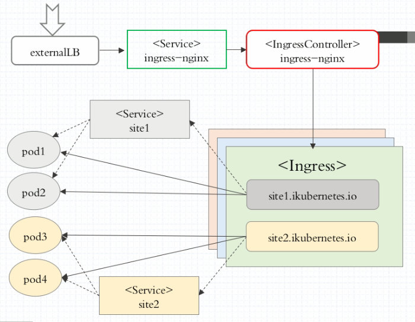

# Ingress 和Ingress Controller

​	根据前面对Service的使用说明，我们知道Service的表现形式为 IP:Port，即工作在TCP/IP层。而对于基于HTTP的服务来说，不同的 URL地址经常对应到不同的后端服务或者虚拟服务器（Virtual Host）， 这些应用层的转发机制仅通过Kubernetes的Service机制是无法实现的。 从Kubernetes 1.1版本开始新增Ingress资源对象，用于将不同URL的访问 请求转发到后端不同的Service，以实现HTTP层的业务路由机制。 Kubernetes使用了一个Ingress策略定义和一个具体的Ingress Controller， 两者结合并实现了一个完整的Ingress负载均衡器。 


## 1. ingress Controller运行机制



	1. 外部负载均衡器将请求调度至暴露至节点上的ingress-nginx服务pod，也可不用直接替换为DeamonSet
 	2. ingress-nginx将请求调度至IngressController
 	3. IngressController根据Ingress定义的http url映射关系，将请求调度至pod，这里需要注意的是，ingress如何维护pod和url的映射关系需要依赖于service，道理很简单，service能够通过selector找到pod，即使pod发生变化，service仍然能根据选择器找到，所以ingress也会实时访问service来同步这个映射关系

> 参考：https://www.cnblogs.com/linuxk/p/9706720.html

## 2. 定义ingress

```bash
$ kubectl explain ingress
---------------------------
DESCRIPTION:
     Ingress is a collection of rules that allow inbound connections to reach
     the endpoints defined by a backend. An Ingress can be configured to give
     services externally-reachable urls, load balance traffic, terminate SSL,
     offer name based virtual hosting etc. DEPRECATED - This group version of
     Ingress is deprecated by networking.k8s.io/v1beta1 Ingress. See the release
     notes for more information.

FIELDS:
   apiVersion   <string>
     APIVersion defines the versioned schema of this representation of an
     object. Servers should convert recognized schemas to the latest internal
     value, and may reject unrecognized values. More info:
     https://git.k8s.io/community/contributors/devel/sig-architecture/api-conventions.md#resources

   kind <string>
     Kind is a string value representing the REST resource this object
     represents. Servers may infer this from the endpoint the client submits
     requests to. Cannot be updated. In CamelCase. More info:
     https://git.k8s.io/community/contributors/devel/sig-architecture/api-conventions.md#types-kinds

   metadata     <Object>
     Standard object's metadata. More info:
     https://git.k8s.io/community/contributors/devel/sig-architecture/api-conventions.md#metadata

   spec <Object>
     Spec is the desired state of the Ingress. More info:
     https://git.k8s.io/community/contributors/devel/sig-architecture/api-conventions.md#spec-and-status

   status       <Object>
     Status is the current state of the Ingress. More info:
     https://git.k8s.io/community/contributors/devel/sig-architecture/api-conventions.md#spec-and-status
```

### spec

```bash
$ kubectl explain ingress.spec
-------------------------------
RESOURCE: spec <Object>

DESCRIPTION:
     Spec is the desired state of the Ingress. More info:
     https://git.k8s.io/community/contributors/devel/sig-architecture/api-conventions.md#spec-and-status

     IngressSpec describes the Ingress the user wishes to exist.

FIELDS:
   backend      <Object>
     A default backend capable of servicing requests that don't match any rule.
     At least one of 'backend' or 'rules' must be specified. This field is
     optional to allow the loadbalancer controller or defaulting logic to
     specify a global default.

   rules        <[]Object>
     A list of host rules used to configure the Ingress. If unspecified, or no
     rule matches, all traffic is sent to the default backend.

   tls  <[]Object>
     TLS configuration. Currently the Ingress only supports a single TLS port,
     443. If multiple members of this list specify different hosts, they will be
     multiplexed on the same port according to the hostname specified through
     the SNI TLS extension, if the ingress controller fulfilling the ingress
     supports SNI.
```

#### rules

```bash
KIND:     Ingress
VERSION:  extensions/v1beta1

RESOURCE: rules <[]Object>

DESCRIPTION:
     A list of host rules used to configure the Ingress. If unspecified, or no
     rule matches, all traffic is sent to the default backend.

     IngressRule represents the rules mapping the paths under a specified host
     to the related backend services. Incoming requests are first evaluated for
     a host match, then routed to the backend associated with the matching
     IngressRuleValue.

FIELDS:
   host <string>
     Host is the fully qualified domain name of a network host, as defined by
     RFC 3986. Note the following deviations from the "host" part of the URI as
     defined in the RFC: 1. IPs are not allowed. Currently an IngressRuleValue
     can only apply to the IP in the Spec of the parent Ingress. 2. The `:`
     delimiter is not respected because ports are not allowed. Currently the
     port of an Ingress is implicitly :80 for http and :443 for https. Both
     these may change in the future. Incoming requests are matched against the
     host before the IngressRuleValue. If the host is unspecified, the Ingress
     routes all traffic based on the specified IngressRuleValue.

   http <Object>
```

​	通过设置rules来配置http的映射规则，可以分为虚拟主机名和url两种方式

#### backend

```bash
$ kubectl explain ingress.spec.backend
-------------------------------
DESCRIPTION:
     A default backend capable of servicing requests that don't match any rule.
     At least one of 'backend' or 'rules' must be specified. This field is
     optional to allow the loadbalancer controller or defaulting logic to
     specify a global default.

     IngressBackend describes all endpoints for a given service and port.

FIELDS:
   serviceName  <string> -required-
     Specifies the name of the referenced service.

   servicePort  <string> -required-
     Specifies the port of the referenced service.
```

可以发现，backend指定了两个属性，一个serviceName和servicePort，分别代表了映射至后端的service服务的名称和端口号，通过此找到service负载均衡的pod服务

## 3. 安装部署ingress controller

### 3.1 手动下载镜像

由于众所周知的原因，安装ingress需要下载quay.io下的镜像，但是不翻墙是下不了的，因此我们可以在各个集群节点上手动通过镜像下载镜像

```bash
# 手动在各node上下载
$ docker pull quay.azk8s.cn/kubernetes-ingress-controller/nginx-ingress-controller:master
# 手动重打标签纸quay.io
$ docker tag quay.azk8s.cn/kubernetes-ingress-controller/nginx-ingress-controller:master   quay.io/kubernetes-ingress-controller/nginx-ingress-controller:master
```

### 3.2 generic deploy

在master上执行以下命令部署ingress controller，此种方式适用于一般情况

```bash
$ kubectl apply -f https://raw.githubusercontent.com/kubernetes/ingress-nginx/nginx-0.27.1/deploy/static/mandatory.yaml
```

### 3.3 暴露ingress controller

ingress controller 需要暴露端口才能被集群外部访问，暴露服务的方式有两种

1. 添加service暴露
2. 将ingress controller设置为daemonset

第一种方式输入如下命令：

```bash
$ kubectl apply -f https://raw.githubusercontent.com/kubernetes/ingress-nginx/nginx-0.27.1/deploy/static/provider/baremetal/service-nodeport.yaml
```

实际上就是以nodeport的方式暴露service，而service会将请求调度至运行在集群上的ingress nginx 

检查service

```bash
$ kubectl get svc -n ingress-nginx
--------------------
ingress-nginx   NodePort   10.96.236.96   <none>        80:31162/TCP,443:30688/TCP   24m
```

可以发现端口暴露在了31162和30688上，分别对应http和https服务

### 3.4 测试

集群外部访问http://192.168.134.201:31162，发现nginx服务器的返回404，证明ingress controller已经运行成功

## 4. 配置ingress

​	这里我们创建一个tomcat的deployment以及对应的service，之后我们创建ingress规则，之后演示结果

### 4.1 编写配置清单（deployment，service，ingress）

```bash
$ vim tomcat-ingress.yaml
```

```yaml
---
apiVersion: apps/v1
kind: Deployment
metadata:
  name: tomcat-deploy
  namespace: default
spec:
  replicas: 3
  selector:
    matchLabels:
      app: tomcat
      release: canary
  template:
    metadata:
      labels:
        app: tomcat
        release: canary
    spec:
      containers:
      - name: tomcat
        image: tomcat:jre8-alpine
        ports:
        - name: http
          containerPort: 8080
---
apiVersion: v1
kind: Service
metadata:
  name: tomcat-svc
  namespace: default
spec:
  selector:
    app: tomcat
    release: canary
  ports:
  - name: http
    targetPort: 8080
    port: 8080
---
apiVersion: extensions/v1beta1
kind: Ingress
metadata:
  name: tomcat-ingress
  namespace: default
  annotations:
    kubernetes.io/ingress.class: "nginx"
spec:
  rules:
  - http:
      paths:
      - path: /
        backend:
          serviceName: tomcat-svc
          servicePort: 8080
```

### 4.2 运行ingress规则

```bash
$ kubectl apply -f tomcat-ingress.yaml
```

### 4.3  测试

集群外访问ingress： http://192.168.134.201:31162

### 4.4 检查ingress controller配置注入

​	实际上ingress的规则最终会以注入nginx.conf的方式修改nginx的运行规则，因此我们可以通过exec命令进入ingress controller对应的pod中检查nginx.conf

```bash
$ kubectl exec -n ingress-nginx [pod名] -it /bin/sh
# / cat nginx.conf
--------------------------------

```

