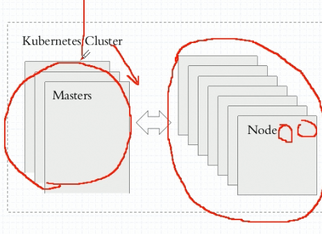
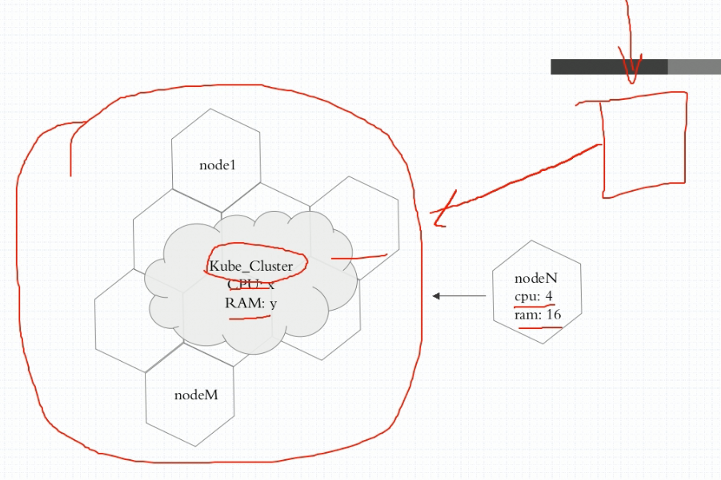

# devops核心要点

## 1.相关术语

1. ci：持续集成
2. cd：持续交付
3. cd：持续部署

## 2. k8s相关概念

### 特点：

- 自动装箱，自我修复，水平扩展，服务发现和负载均衡
- 自动发布和回滚
- 密钥和配置管理，存储编排，任务批量处理执行

### k8s集群

k8s的集群有中心节点: master/nodes(worker)

master几种管理集群，nodes就是真正的工作节点

master一般情况下又三个，node有多个。

**master 组成**：

API Server：接收客户端请求

Scheduler：调度node节点

Controller-Manager：管理controller用于控制node的健康，容灾

**node组成**：

kubelet：集群代理，用于接收和执行master发出的命令，如启动pod，本地管理pod健康。

容器引擎：docker，rkt，用于创建执行容器

#### pod:

k8s操作的最小化原子单位，一个pod中可以运行多个容器，容器之间共享一个网络命名空间，也就是一个ip，容器之间还共享数据卷，数据卷属于pod。

一般情况下一个pod内只部署一个容器。

由于pod是原子化的，所以一个pod只能运行在一个node中

#### kube cluster

kube cluster 相当于整合了所有node工作节点的计算和存储资源

#### pod label selector

k8s在管理集群上的pod时，可以通过给pod打上label，通过选择器来控制对应标签的pod，label用于pod的身份识别和管理

