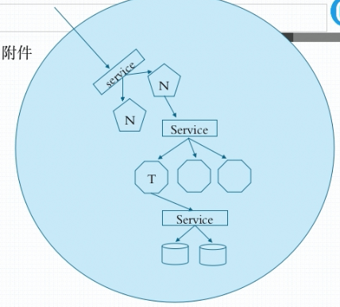
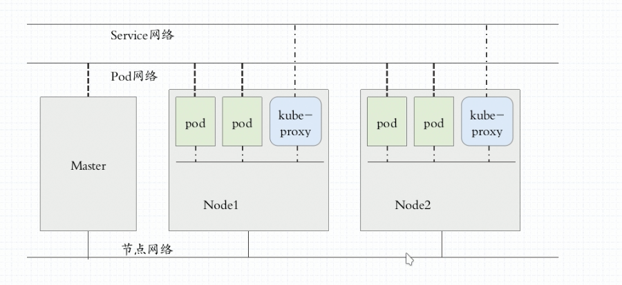

# kubernetes基础概念

## Pod

- 自助式Pod（手工管理，不建议使用）
- 控制器管理的Pod
  - ReplicationController：用于控制pod的创建，运行，维护，更新，支持滚动更新。
  - ReplicaSet：
  - Deployment：只能负责管理无状态的应用，使用最多得控制器
    - HPA（HorizontalPodAutoscaler）:水平动态扩展控制器，自动监控流量负载，计算扩展数量，进行扩展。
  - StatefulSet：管理有状态的应用，例如数据服务
  - DaemonSet：
  - Job，Cronjob：控制一些定时pod资源，例如定时任务

## Service

Service指的是pod的代理，客户端访问k8s中的pod需要通过Service进行代理，也就是说先访问Servcie，由Service寻找对应的pod来访问pod中的容器中的real Server，而Service的Ip是虚拟ip，采用的ipvs的方式，因此，k8s中为了维护Service的虚拟地址映射，还需要有DnsPod服务来进行维护，也即是Dns

## AddOns

系统架构级pod，k8s不管运行什么服务，都必须要依赖的pod组件，例如DnsPod用于提供Service的iptables

## k8s中的网络与通讯

### 三种网络

1. node节点网络

   指k8s集群的物理或虚拟机node之间的网络环境

2. 集群网络或Service网络

   指k8s集群内部，服务通过service访问其他服务的无网络环境

3. pod网络

   指pod运行的网络环境

> 三个网络的网段显然是不同的

### 三种通信

- 通一个pod内的多个容器间访问
- 各pod之间的通信
- pod与Service之间的通信

## etcd

api server存储的数据的服务，必须要做高可用，并且需要基于https通信

## CNI容器网络接口

k8s不提供service网络层和pod层的网络服务，需要依赖于插件

- falannel：网络配置
- calico：网络配置，网络策略
- canel:以上两种的结合，用falannel提高网络配置，calico提供网络策略

> 以上三种插件有两种运行方式：
>
> 1.作为容器运行，也即是附件
>
> 2.脱离于集群的守护进程运行