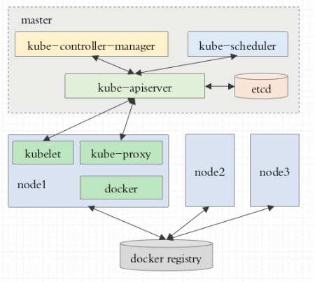
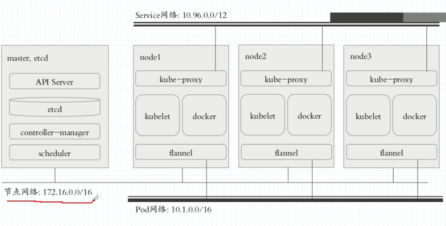

# kubeadm初始化kubernetes集群

## 集群架构



## 网络架构



> 相关参考网址：
>
> https://github.com/kubernetes/kubeadm/blob/master/docs/design/design_v1.10.md

## 概要步骤

1. master、nodes：安装kubelet，kubeadm，docker
2. master：kubeadm init
3. nodes：kubeadm join

## 总体步骤

虚拟机：

​	master,node1,node

前提：

1. 基于主机名进行通信：```/etc/hosts```

2. 时间同步：

   ```bash
   ntpdate 0.cn.pool.ntp.org
   ```

3. 关闭firewalld和iptables.service

安装配置步骤：

1. etcd cluster，仅master节点

2. flannel，集群所有节点

3. 配置k8s的master：仅master节点

   kubernetes-master

   启动的服务：

   - kube-apiserver
   - kube-scheduler
   - kube-controller-manager

4. 配置k8s的node节点

   kuberneters-node

   先设定启动docker服务；

   启动k8s的服务：

   ​	kube-proxy，kubelet


## 详细步骤

### 1. 虚拟机安装

#### 1.1 安装vmware安装centos7，生成三台

> 安装虚拟机略过,**cpu必须两颗**

1. 安装ntp和ntpdate服务

   ```bash
   yum install -y ntp ntpdate
   ```

2. 关闭防火墙服务和自启动

   ```bash
   systemctl stop firewalld.service
   systemctl disable firewalld.service
   ```

#### 1.2 配置虚拟机静态ip和主机名（三台都需要）

```bash
//配置静态ip
vi /etc/sysconfig/network-scripts/ifcfg-ens33
BOOTPROTO=none
IPADDR=192.168.134.xxx
DNS1=114.114.114.114
NETMASK=255.255.255.0

service network.service restart
```

```bash
vi /etc/hosts
192.168.134.1 mother
192.168.134.101 master101
192.168.134.102 node102
192.168.134.103 node103
```

#### 1.3 配置时间同步（三台都需要）

```bash
ntpdate 0.cn.pool.ntp.org
```

### 2.k8s docker安装

#### 2.1 yum镜像配置

> 可访问阿里云镜像搜索https://developer.aliyun.com/mirror

##### 2.1.1 docker-ce镜像

```bash
//root 用户登录
cd /etc/yum.repos.d/
wget https://mirrors.aliyun.com/docker-ce/linux/centos/docker-ce.repo
```

##### 2.1.2 kubernetes镜像

```bash
//root登录
cd /etc/yum.repos.d/
vim kubernetes.repo

[kubernetes]
name=Kubernetes
baseurl=https://mirrors.aliyun.com/kubernetes/yum/repos/kubernetes-el7-x86_64/
enabled=1
gpgcheck=1
repo_gpgcheck=1
gpgkey=https://mirrors.aliyun.com/kubernetes/yum/doc/yum-key.gpg https://mirrors.aliyun.com/kubernetes/yum/doc/rpm-package-key.gpg
```

> 以上两个镜像repo配置完后，复制给另外两个节点
>
> ```bash
> scp kubernetes.repo docker-ce.repo node103:/etc/yum.repos.d/
> scp kubernetes.repo docker-ce.repo node102:/etc/yum.repos.d/
> ```

#### 2.2  yum安装（所有节点）

```bash
yum install -y docker-ce kubeadm kubelet kubectl
```

#### 2.3  启动docker

>  ~~分割线中内容以失效，直接跳到下面步骤~~

------

##### ~~配置k8s仓库代理*~~

~~*启动之前，由于k8s要去仓库中下载k8s相关镜像，例如kubelet 等， 因此由于墙的愿因，需要配置代理*~~

```bash
vi /usr/lib/systemd/system/docker.service
//在Type=notify后插入
Environment="HTTPS_PROXY=http://www.ik8s.io:10080"
Environment="NO_PROXY=127.0.0.0/8,192.168.134.0/16"
```

##### ~~*拷贝至node*~~

```bash
scp /usr/lib/systemd/system/docker.service node102:/usr/lib/systemd/system/
scp /usr/lib/systemd/system/docker.service node103:/usr/lib/systemd/system/
```

------

> ~~分割线中内容以失效，直接跳到下面步骤~~

##### 配置docker国内镜像加速器

```bash
sudo mkdir -p /etc/docker
sudo tee /etc/docker/daemon.json <<-'EOF'
{
  "registry-mirrors": ["https://p3jtjl41.mirror.aliyuncs.com"]
}
EOF
sudo systemctl daemon-reload
sudo systemctl restart docker
```

##### 启动docker

```bash
systemctl daemon-reload //重新加载daemon
service docker start
docker info //检查配置是否成功
-------------------------------
Architecture: x86_64
 CPUs: 1
 Total Memory: 972.4MiB
 Name: master101
 ID: 5Z2T:KXWY:FNRL:TPPB:FLEJ:NOGD:H277:FTWR:GQFL:GIBG:VY5T:LK6B
 Docker Root Dir: /var/lib/docker
 Debug Mode: false
 Registry: https://index.docker.io/v1/
```

##### 确保桥接的iptables和ip6tables值为1

```bash
cat /proc/sys/net/bridge/bridge-nf-call-iptables 
->1
cat /proc/sys/net/bridge/bridge-nf-call-ip6tables 
->1
```

如果不为1，通过如下命令修改

```bash
/etc/sysctl.conf <<'EOF'
net.bridge.bridge-nf-call-ip6tables = 1
net.bridge.bridge-nf-call-iptables = 1
EOF
sysctl -p
systemctl daemon-reload
systemctl restart docker
```

##### 设置docker开机自启动

```bash
systemctl enable docker
```


#### 2.4 设定kubelet

> 早期k8s版本不允许主机节点使用swap虚拟内存交换，因此需要通过修改kubelet的额外配置忽略这一点
>
> ```bash
> rpm -ql kubelet //检查kubelet的安装文件目录
> 
> /etc/kubernetes/manifests
> /etc/sysconfig/kubelet
> /usr/bin/kubelet
> /usr/lib/systemd/system/kubelet.service
> 
> cat /etc/sysconfig/kubelet
> 
> KUBELET EXTRA ARGS=
> 
> //这里需要修改KUBELET EXTRA ARGS
> KUBELET_EXTRA_ARGS="--fail-swap-on=false"
> ```

##### 设置开机启动服务

```bash
systemctl enable kubelet
```

#### 2.5 初始化kubeadm

查询下kubeadm命令

```bash
kubeadm init --help
```

~~init命令~~

```bash
kubeadm init --pod-network-cidr=10.244.0.0/16 --ignore-preflight-errors=Swap
//这里pod-network-cidr指的是pod之间的通讯接口交由flannel管理，而flannel的默认网段既是10.244.0.0，第二个参数ignore-preflight-errors是用于配置关于Swap的错误请忽视的意思
```

##### **注意**：

由于不可描述的原因，gcr.io我们是访问不了的，因此会导致如下运行失败的结果：

```bash
error execution phase preflight: [preflight] Some fatal errors occurred:
        [ERROR ImagePull]: failed to pull image k8s.gcr.io/kube-apiserver:v1.16.3: output: Error response from daemon: Get https://k8s.gcr.io/v2/: net/http: request canceled while waiting for connection (Client.Timeout exceeded while awaiting headers)
, error: exit status 1
        [ERROR ImagePull]: failed to pull image k8s.gcr.io/kube-controller-manager:v1.16.3: output: Error response from daemon: Get https://k8s.gcr.io/v2/: net/http: request canceled while waiting for connection (Client.Timeout exceeded while awaiting headers)
, error: exit status 1
        [ERROR ImagePull]: failed to pull image k8s.gcr.io/kube-scheduler:v1.16.3: output: Error response from daemon: Get https://k8s.gcr.io/v2/: net/http: request canceled while waiting for connection (Client.Timeout exceeded while awaiting headers)
, error: exit status 1
        [ERROR ImagePull]: failed to pull image k8s.gcr.io/kube-proxy:v1.16.3: output: Error response from daemon: Get https://k8s.gcr.io/v2/: net/http: request canceled while waiting for connection (Client.Timeout exceeded while awaiting headers)
, error: exit status 1
        [ERROR ImagePull]: failed to pull image k8s.gcr.io/pause:3.1: output: Error response from daemon: Get https://k8s.gcr.io/v2/: net/http: request canceled while waiting for connection (Client.Timeout exceeded while awaiting headers)
, error: exit status 1
        [ERROR ImagePull]: failed to pull image k8s.gcr.io/etcd:3.3.15-0: output: Error response from daemon: Get https://k8s.gcr.io/v2/: net/http: request canceled while waiting for connection (Client.Timeout exceeded while awaiting headers)
, error: exit status 1
        [ERROR ImagePull]: failed to pull image k8s.gcr.io/coredns:1.6.2: output: Error response from daemon: Get https://k8s.gcr.io/v2/: net/http: request canceled while waiting for connection (Client.Timeout exceeded while awaiting headers)
, error: exit status 1
```

因此在这里要么你设置虚拟机的fq代理，要么采用如下办法解决问题：

##### 手动下载系统架构级pod所需镜像

###### ~~从国内镜像手动拉取image~~

```bash
docker pull registry.aliyuncs.com/google_containers/kube-apiserver:v1.16.3
docker pull registry.aliyuncs.com/google_containers/kube-controller-manager:v1.16.3
docker pull registry.aliyuncs.com/google_containers/kube-scheduler:v1.16.3
docker pull registry.aliyuncs.com/google_containers/kube-proxy:v1.16.3
docker pull registry.aliyuncs.com/google_containers/pause:3.1
docker pull registry.aliyuncs.com/google_containers/etcd:3.3.15-0
docker pull registry.aliyuncs.com/google_containers/coredns:1.6.2
```

###### ~~重新给镜像打上tag~~

```bash
docker tag registry.aliyuncs.com/google_containers/kube-apiserver:v1.16.3 k8s.gcr.io/kube-apiserver:v1.16.3
docker tag registry.aliyuncs.com/google_containers/kube-controller-manager:v1.16.3 k8s.gcr.io/kube-controller-manager:v1.16.3
docker tag registry.aliyuncs.com/google_containers/kube-scheduler:v1.16.3 k8s.gcr.io/kube-scheduler:v1.16.3
docker tag registry.aliyuncs.com/google_containers/kube-proxy:v1.16.3 k8s.gcr.io/kube-proxy:v1.16.3
docker tag registry.aliyuncs.com/google_containerss/pause:3.1 k8s.gcr.io/pause:3.1
docker tag registry.aliyuncs.com/google_containers/etcd:3.3.15-0 k8s.gcr.io/etcd:3.3.15-0
docker tag registry.aliyuncs.com/google_containers/coredns:1.6.2 k8s.gcr.io/coredns:1.6.2

```

###### 重新运行kubeadm init 命名

```bash
kubeadm init --pod-network-cidr=10.244.0.0/16 --ignore-preflight-errors=Swap --image-repository registry.aliyuncs.com/google_containers
// 这里直接配置--image-repository属性就可以省略上面两个步骤
```

> 运行完毕控制台重要信息如下：
>
> ```bash
> Your Kubernetes control-plane has initialized successfully!
> 
> To start using your cluster, you need to run the following as a regular user:
> 
>   mkdir -p $HOME/.kube
>   sudo cp -i /etc/kubernetes/admin.conf $HOME/.kube/config
>   sudo chown $(id -u):$(id -g) $HOME/.kube/config
> 
> You should now deploy a pod network to the cluster.
> Run "kubectl apply -f [podnetwork].yaml" with one of the options listed at:
>   https://kubernetes.io/docs/concepts/cluster-administration/addons/
> 
> Then you can join any number of worker nodes by running the following on each as root:
> 
> //以下内容非常重要，因为当其他node想加入当前集群时，必须要输入以下命令，而其中的token需要记住的，否则查找token很麻烦
> kubeadm join 192.168.134.101:6443 --token 6i2qot.8681dly7hrzu6ne0 --discovery-token-ca-cert-hash sha256:8533ec6c5666194ccf4d72f1f71142999c66ae8af4172ac6ee1439df9e026ba4 
> ```

> 如果忘记了token和ca hash
>
> ```bash
> kubeadm token list  | awk -F" " '{print $1}' |tail -n 1 //获取token
> zzd4im.reqma5o3xyio7k61
> 
> openssl x509 -pubkey -in /etc/kubernetes/pki/ca.crt | openssl rsa -pubin -outform der 2>/dev/null | openssl dgst -sha256 -hex | sed  's/^ .* //'
> //获取CA公钥的哈希值
> (stdin)= 3f706a5da4c3a16fb76dbec67653532d49e444219fdd9abfc3642d5ef20ae74b
> ```
>
> 

#### 2.6 node加入集群准备

##### master检查6443端口

```bash
ss -tnl
LISTEN     0      128                                  [::]:6443
```

##### 创建隐藏目录和文件

如果是root用户，输入如下命令

```bash
mkdir -p $HOME/.kube
cp -i /etc/kubernetes/admin.conf $HOME/.kube/config
```

##### 查询组件状态信息

```bash
kubectl get cs 
```

#### 2.7 安装flannel

查询节点信息

```bash
kubectl get nodes
NAME        STATUS     ROLES    AGE   VERSION
master101   NotReady   master   25m   v1.16.3
```

以上信息显示master节点状态处于NotReady，原因是因为还没有安装flannel，pod之间无法通讯

##### ~~2.7.1安装flannel 方式1~~

搜索github上的flannel项目https://github.com/coreos/flannel，根据文档输入以下命令

```bash
kubectl apply -f https://raw.githubusercontent.com/coreos/flannel/master/Documentation/kube-flannel.yml
```

显示如下信息：

```bash
podsecuritypolicy.policy/psp.flannel.unprivileged created
clusterrole.rbac.authorization.k8s.io/flannel created
clusterrolebinding.rbac.authorization.k8s.io/flannel created
serviceaccount/flannel created
configmap/kube-flannel-cfg created
daemonset.apps/kube-flannel-ds-amd64 created
daemonset.apps/kube-flannel-ds-arm64 created
daemonset.apps/kube-flannel-ds-arm created
daemonset.apps/kube-flannel-ds-ppc64le created
daemonset.apps/kube-flannel-ds-s390x created
```

这不代表安装完了，这时候flannel安装程序在下载pod

```bash
kubectl get pods kube-system//查询pod就绪否
```

##### 2.7.2 安装flannel 方式2

由于众所周知的原因，当执行方式1命令时，有可能quay.io被墙，导致flannel安装过程中一直无法下载到image，因此需要如下动作

在宿主机上翻墙，下载https://raw.githubusercontent.com/coreos/flannel/master/Documentation/kube-flannel.yml文件至本地

将kube-flannel中的所有quay.io替换为quay-mirror.qiniu.com或quay.azk8s.cn，改变镜像服务地址

将文件拷贝至虚拟机

```bash
scp kube-flannel.yml root@master101:/opt
```

虚拟机中执行如下命令

```bash
kubectl apply -f  kube-flannel.yml
```

待镜像下载完后，执行如下命令查看结果

```bash
kubectl get pods -n kube-system//查询pod就绪否

kube-flannel-ds-amd64-mth9f         1/1     Running   0          10m 
//出现这行时，代表flannel配置运行成功
```

#### 2.8 namespace名称空间

输入命令：```kubectl get namespace```，结果：

```bash
default           Active   18h
kube-node-lease   Active   18h
kube-public       Active   18h
kube-system       Active   18h
```

Namespace是对一组资源和对象的抽象集合，比如可以用来将系统内部的对象划分为不同的项目组或用户组。常见的pods, services, replication controllers和deployments等都是属于某一个namespace的（默认是default），而node, persistentVolumes等则不属于任何namespace。

Namespace常用来隔离不同的用户，比如Kubernetes自带的服务一般运行在kube-system namespace中。

#### 2.9 node节点操作

​	此时master节点的配置基本，完成，我们可以将node节点加入到集群中

##### 2.9.1 准备工作

###### 拷贝docker资源

​	将/etc/docker/daemon.json拷贝至node

```bash
// master终端上操作
scp /etc/docker/daemon.json node102:/etc/docker/daemon.json
scp /etc/docker/daemon.json node103:/etc/docker/daemon.json

//node终端上操作
systemctl daemon-reload
systemctl start docker 
systemctl enable docker 
```

###### 拷贝kubelet配置文件

​	kubelet由于设置了额外的忽略Swap的配置项，因此需要拷贝配置文件至node

```bash
// master 终端上操作
scp /etc/sysconfig/kubelet node102:/etc/sysconfig/
scp /etc/sysconfig/kubelet node103:/etc/sysconfig/

//node 终端上操作
systemctl enable kubelet
```

###### 执行kubeadm join命令

​	将master 中kubeadm init 命令成功后给出的提示命令在node中输入

```bash
kubeadm join 192.168.134.101:6443 --token 6i2qot.8681dly7hrzu6ne0 --discovery-token-ca-cert-hash sha256:8533ec6c5666194ccf4d72f1f71142999c66ae8af4172ac6ee1439df9e026ba4 --ignore-preflight-errors=Swap
```

##### 2.9.2 检查集群运行状态

在master节点输入命令

```
kubectl get nodes
```

结果如下代表集群就绪

```bash
NAME        STATUS   ROLES    AGE    VERSION
master101   Ready    master   19h    v1.16.3
node102     Ready    <none>   103s   v1.16.3
node103     Ready    <none>   31s    v1.16.3
```

> 当在node 中输入kubeadm join命令后，不代表node已经加入到k8s集群中，因为集群也需要下载系统架构级的pod：kube-proxy flannel pause。当node节点下载完并运行了pod后，这时候才进入到Ready状态

输入命令查看集群所有的pods

```bash
kubectl get pods -n kube-system -o wide
----------------------------------
NAME                                READY   STATUS    RESTARTS   AGE     IP                NODE        NOMINATED NODE   READINESS GATES
coredns-58cc8c89f4-8bsr8            1/1     Running   1          19h     10.244.0.5        master101   <none>           <none>
coredns-58cc8c89f4-s225c            1/1     Running   1          19h     10.244.0.4        master101   <none>           <none>
etcd-master101                      1/1     Running   2          19h     192.168.134.101   master101   <none>           <none>
kube-apiserver-master101            1/1     Running   2          19h     192.168.134.101   master101   <none>           <none>
kube-controller-manager-master101   1/1     Running   2          19h     192.168.134.101   master101   <none>           <none>
kube-flannel-ds-amd64-mth9f         1/1     Running   1          18h     192.168.134.101   master101   <none>           <none>
kube-flannel-ds-amd64-xvfzh         1/1     Running   0          7m52s   192.168.134.103   node103     <none>           <none>
kube-flannel-ds-amd64-zzskq         1/1     Running   0          9m4s    192.168.134.102   node102     <none>           <none>
kube-proxy-4p2mq                    1/1     Running   0          9m4s    192.168.134.102   node102     <none>           <none>
kube-proxy-kxl4m                    1/1     Running   0          7m52s   192.168.134.103   node103     <none>           <none>
kube-proxy-m9wmq                    1/1     Running   2          19h     192.168.134.101   master101   <none>           <none>
kube-scheduler-master101            1/1     Running   2          19h     192.168.134.101   master101   <none>           <none>
```

可以发现，这时候pods中由三个flannel，三个proxy在运行，显然这是node上的pods

