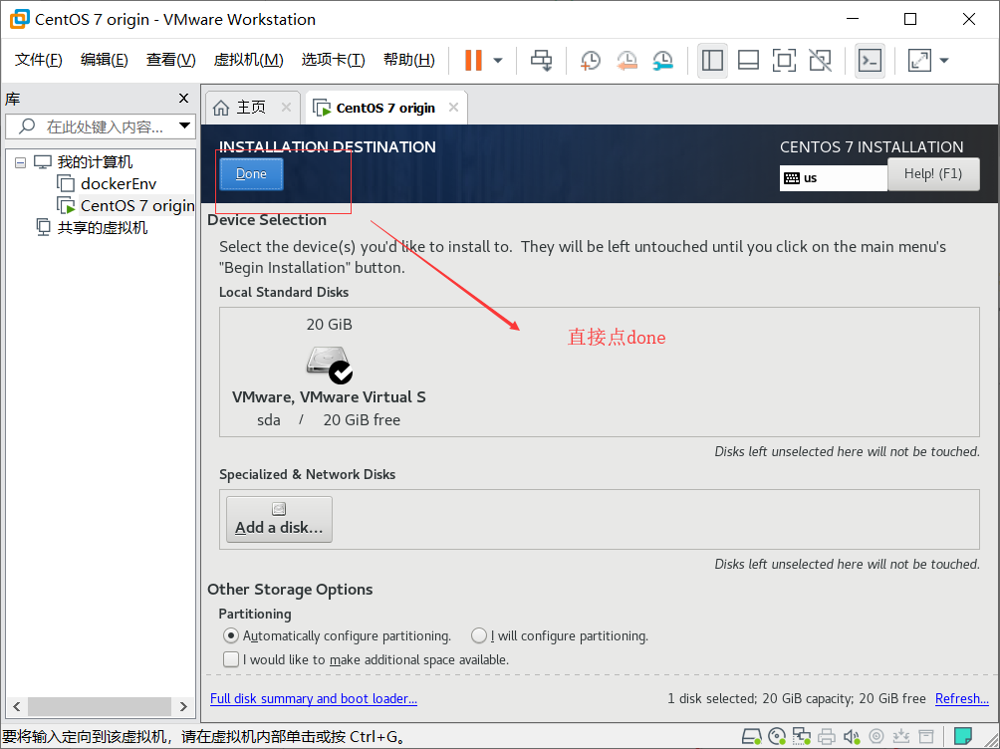
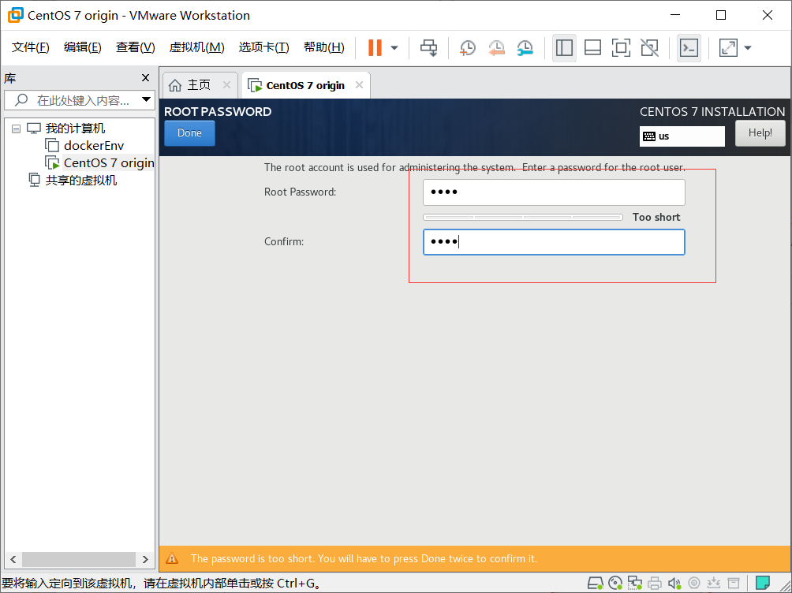
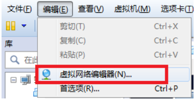

# Linux安装教程

​	Linux 内核最初只是由芬兰人林纳斯·托瓦兹（Linus Torvalds）在赫尔辛基大学上学时出于个人爱好而编写的。

Linux 是一套免费使用和自由传播的类 Unix 操作系统，是一个基于 POSIX 和 UNIX 的多用户、多任务、支持多线程和多 CPU 的操作系统。

Linux 能运行主要的 UNIX 工具软件、应用程序和网络协议。它支持 32 位和 64 位硬件。Linux 继承了 Unix 以网络为核心的设计思想，是一个性能稳定的多用户网络操作系统。

## Linux 的发行版

Linux 的发行版说简单点就是将 Linux 内核与应用软件做一个打包。


目前市面上较知名的发行版有：Ubuntu、RedHat、CentOS、Debian、Fedora、SuSE、OpenSUSE、Arch Linux、SolusOS 等。


## Linux 应用领域

今天，linux已经广泛应用于企业的各个领域，大到互联网服务，小到企业级应用，在我们的身边，linux无处不在。

## Linux vs Windows

目前国内 Linux 更多的是应用于服务器上，而桌面操作系统更多使用的是 Windows。主要区别如下

| 比较     | Windows                                                      | Linux                                                        |
| :------- | :----------------------------------------------------------- | :----------------------------------------------------------- |
| 界面     | 界面统一，外壳程序固定所有 Windows 程序菜单几乎一致，快捷键也几乎相同 | 图形界面风格依发布版不同而不同，可能互不兼容。GNU/Linux 的终端机是从 UNIX 传承下来，基本命令和操作方法也几乎一致。 |
| 驱动程序 | 驱动程序丰富，版本更新频繁。默认安装程序里面一般包含有该版本发布时流行的硬件驱动程序，之后所出的新硬件驱动依赖于硬件厂商提供。对于一些老硬件，如果没有了原配的驱动有时很难支持。另外，有时硬件厂商未提供所需版本的 Windows 下的驱动，也会比较头痛。 | 由志愿者开发，由 Linux 核心开发小组发布，很多硬件厂商基于版权考虑并未提供驱动程序，尽管多数无需手动安装，但是涉及安装则相对复杂，使得新用户面对驱动程序问题（是否存在和安装方法）会一筹莫展。但是在开源开发模式下，许多老硬件尽管在Windows下很难支持的也容易找到驱动。HP、Intel、AMD 等硬件厂商逐步不同程度支持开源驱动，问题正在得到缓解。 |
| 使用     | 使用比较简单，容易入门。图形化界面对没有计算机背景知识的用户使用十分有利。 | 图形界面使用简单，容易入门。文字界面，需要学习才能掌握。     |
| 学习     | 系统构造复杂、变化频繁，且知识、技能淘汰快，深入学习困难。   | 系统构造简单、稳定，且知识、技能传承性好，深入学习相对容易。 |
| 软件     | 每一种特定功能可能都需要商业软件的支持，需要购买相应的授权。 | 大部分软件都可以自由获取，同样功能的软件选择较少。           |

## 1. vmware安装

我们采用虚拟机的安装方式来安装第一个linux系统，我们需要使用虚拟化工具来进行安装，这里选用VMware15

vmware安装时，注意有些选项按照图示不要勾选


> 许可证秘钥自行百度对应版本，以vmware15为例，一下为一些秘钥：
>
> VG5HH-D6E04-0889Y-QXZET-QGUC8
>
> CY55A-F6G80-H85HQ-WNN5X-W38W4
>
> AC11H-4HZ05-08EDQ-APQGX-YCUC8
>
> ZG780-8EZ9M-M89LY-M5PEG-W2AZ8
>

## 2. centos安装

​	整个课程中，默认使用centos7社区版作为开发环境，安装以centos7为例，首先我们需要下载centos7的Miniaml的镜像

下载地址为：https://mirrors.aliyun.com/centos/7.7.1908/isos/x86_64/CentOS-7-x86_64-Minimal-1908.iso

### 2.1 检查宿主环境

​	安装之前，最好进入bios检查是否已打开虚拟化技术选项，如图：


### 2.2 vmware安装centos7

#### 2.2.1 虚拟机安装向导配置

1. 选择自定义安装

   

2. 

3. 选择稍后安装

   

4. 选择centos7 64位

   

5. 设置虚拟机名称和保存的位置

   

6. 设置cpu数量和内核数量2*2

   

7. 设置内存大小为2g

   

8. 选择网络类型为NAT模式

   

9. 设置i/o类型与磁盘

   

   

   

   

   

10. 新建虚拟机向导配置完成

    


#### 2.2.2 虚拟机镜像安装

1. 点击编辑虚拟机选择cd

   

   选择之前下载的centos7镜像文件

   

2. 运行虚拟机

   

3. 选择安装虚拟机

   

4. 选择语言英文

   

5. 选择时区

   

   

6. 选择安装路径

   

   

7. 点击开始安装

   

8. 设置root密码和创建新账户

   

   设置root密码

   

   创建新账户

   

9. 点击完成安装并重启系统

   

   


## 3. 网络环境配置

​	刚完成安装的centos7 minimal版缺乏必要的网络运行依赖，并且也没法和宿主机进行ssl通讯，这里我们需要配置虚拟机的网络环境

### 3.1 配置与宿主机共享网络

1. 查看虚拟网络编辑器

   

2. 查看虚拟网段和网关

   

   

   > 由此可见，**我们要想虚拟机能够和宿主机互通**，并且通过宿主机共享宿主机ip的方式来连接外网，那么我们需要**修改虚拟机的ip地址和网关**

3. 修改虚拟机ip

   我们需要通过编辑```/etc/sysconfig/network-scripts/ifcfg-ens33```这个文件来进行配置

   ```bash
   $ vi /etc/sysconfig/network-scripts/ifcfg-ens33
   ```

   （vi修改文件需要进入编辑模式，敲一下i键进入编辑模式

   退出编辑模式，敲一下Esc按钮，输入:wq! 保存并退出）

   需要修改并添加如下内容

   ```bash
   ONBOOT=yes                
   # IP的配置方法[none|static|bootp|dhcp]（引导时不使用协议|静态分配IP|BOOTP协议|DHCP协议）
   BOOTPROTO=static 
   #IP地址
   IPADDR=192.168.40.150   
   #网关  
   GATEWAY=192.168.40.2 
   #域名解析器
   DNS1=114.114.114.114
   DNS2=8.8.8.8
   ```

   保存修改，重启网络服务

   ```bash
   $ systemctl restart network
   ```

4. 测试网络

   测试是否能ping通宿主机和外网，先查一下宿主机的ip地址，注意是和你路由连接的那个网段

   

   在虚拟机中输入

   ```bash
   $ ping 192.168.31.133
   ```

   

   同理，再测试外网

   ```bash
   $ ping www.baidu.com
   ```
### 3.2 配置主机名

​	在大数据的开发环境下，我们需要有多台虚拟机搭建集群环境，因此可以提前配置好多个虚拟机的主机名，这样后期我们可以通过主机名来进行互相访问

#### 1. 配置本机主机名

输入如下命令查看本机主机名：

```bash
$ hostname
---------
localhost.localdomain
```

修改主机名为hadoop150

```bash
$ hostnamectl set-hostname hadoop150
```

#### 2.添加其他主机名

```bash
$ vi /etc/hosts
```

添加如下内容

```bash
192.168.40.150 hadoop150
192.168.40.151 hadoop151
192.168.40.152 hadoop152
192.168.40.153 hadoop153
192.168.40.154 hadoop154
192.168.40.155 hadoop155
192.168.40.156 hadoop156
192.168.40.157 hadoop157
192.168.40.158 hadoop158
```

#### 3. 配置宿主机hosts文件

如果你希望宿主机也能直接通过主机名访问虚拟机，那么可以修改宿主机的hosts文件，文件所在路径```C:\Windows\System32\drivers\etc```

添加如下那内容同上

```bash
192.168.40.150 hadoop150
192.168.40.151 hadoop151
192.168.40.152 hadoop152
192.168.40.153 hadoop153
192.168.40.154 hadoop154
192.168.40.155 hadoop155
192.168.40.156 hadoop156
192.168.40.157 hadoop157
192.168.40.158 hadoop158
```

在windows下试着瓶主机名hadoop150


### 3.3 安装terminus

如果直接在vmware中执行命令，我们会发现很不方便，我们无法将宿主机中的复制内容粘贴到虚拟机中，我们可以用过任意ssh工具进行远程访问，这样我们就可以在远程打开终端与操作系统连接，ssh工具很多,如ssh client、xshell Putty等，这里我们选择简洁并且免费的terminus

#### 安装terminus

下载地址：https://autoupdate.termius.com/win/Termius.exe 或者在Microsoft store中直接安装（win10）

安装过程省略

打开terminus，直接免密登录或注册账号再登录


创建host


配置host


配置登录账户为root和root密码，点击保存


点击连接主机，结果显示连接失败


原因是由于我们的虚拟机防火墙拦截了ssh协议端口22，我们需要开放端口，或者直接关闭防火墙

#### centos7关闭防火墙

centos7的防火墙舍弃了之前iptables，而采用firewalld

输入如下命令关闭防火墙并禁止开机启动

```bash
$ sudo systemctl stop firewalld  # 关闭防火墙
$ sudo systemctl disable firewalld  #禁止启动防火墙
$ reboot now #重新启动
```

再次打开terminus连接


## 4 安装必要的工具

centos7 minimal版缺乏必要的网络管理命令，比如ifconfig就没有，安装这些必要的命令和工具，我们需要通过yum，在安装之前我们可以配置yum源的阿里镜像，保证国内使用时下载的稳定

### 配置yum阿里镜像源

> 参考https://developer.aliyun.com/mirror/centos?spm=a2c6h.13651102.0.0.3e221b11RaHtqX

1. 备份

```bash
$ mv /etc/yum.repos.d/CentOS-Base.repo /etc/yum.repos.d/CentOS-Base.repo.backup
```

2. 下载新的 CentOS-Base.repo 到 /etc/yum.repos.d/

```bash
$ wget -O /etc/yum.repos.d/CentOS-Base.repo http://mirrors.aliyun.com/repo/Centos-7.repo
```

或者

```bash
$ curl -o /etc/yum.repos.d/CentOS-Base.repo http://mirrors.aliyun.com/repo/Centos-7.repo
```

3. 运行 ```yum makecache``` 生成缓存

4. 更新yum

   ```bash
   $ yum update
   ```

### 安装net-tools

```bash
$ yum install -y net-tools
```

安装完毕后，我们输入ifconfig，会发现命令出现了


### 安装 wget

```bash
$ yum -y install wget
```

### 安装vim

```bash
$ yum -y install vim
```


## 5. 虚拟机的快照与克隆

​	在使用虚拟机的过程中，我么经常性的需要保存虚拟机当前的运行状态，以便于之后如果出现了错误，我们可以回退到原始状态，这里就需要运用虚拟化工具的快照功能。

### vmware创建快照

​	要创建一个非运行时的快照，请先将虚拟机关闭。


1. 右击虚拟机，选择快照管理器

   

2. 点击拍摄快照

   

   录入快照名称，点击拍摄快照

   

   快照创建完成

   

### 虚拟机克隆

​	当快照创建完后，如果需要根据当前快照复制一台新的虚拟机，就可以利用vamware的克隆功能实现

1. 右击虚拟机选择管理中的克隆

   

2. 选择快照

   

3. 选择克隆方式

   > 克隆的方式有两种
   >
   > 1. 链接克隆
   >
   >    对原始虚拟机的引用，所需磁盘空间少，但是需要原虚拟机存在
   >
   > 2. 完整克隆
   >
   >    完全独立于原始虚拟机，推荐。

   

4. 设置虚拟机名称和位置

   

5. 克隆完成

   

> 克隆完成后，不代表当前克隆的新虚拟机就能和宿主机正常通信，因此别忘了，新虚拟机和旧虚拟机的ip地址相同，因此，我们要修改新虚拟机的ip

#### 修改克隆虚拟机ip

通过vim打开ifcfg-ens33网卡配置

```bash
$ vim /etc/sysconfig/network-scripts/ifcfg-ens33
--------------------------
#修改ip
IPADDR=192.168.40.151
```

重启网络服务

```bash
$ systemctl restart network
```

#### 测试虚拟机互通

在hadoop150与hadoop任意一台机器上试着ping对方主机名

```bash
$ ping hadoop150
---------------------
PING hadoop150 (192.168.40.150) 56(84) bytes of data.
64 bytes from hadoop150 (192.168.40.150): icmp_seq=1 ttl=64 time=0.178 ms
64 bytes from hadoop150 (192.168.40.150): icmp_seq=2 ttl=64 time=0.221 ms
64 bytes from hadoop150 (192.168.40.150): icmp_seq=3 ttl=64 time=0.240 ms
```


