# Linux入门与基础

## linux的目录结构

​	打开终端，输入```ls```查看linux根目录下的情况

```bash
$ ls /
----------------
bin  boot  dev  etc  home  lib  lib64  media  mnt  opt  proc  root  run  sbin  srv  sys  tmp  usr  var
```

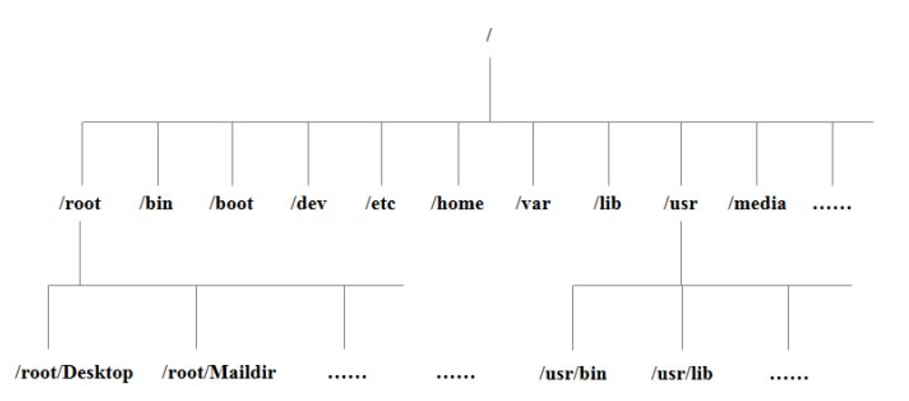

>  /bin (/usr/bin /usr/local/bin )

是Binary的缩写, 这个目录存放着最经常使用的命令 

>  /sbin    (/usr/sbin 、 /usr/local/sbin)

s就是Super User的意思，这里存放的是系统管理员使用的系统管理程序

> /**home**

存放普通用户的主目录，在Linux中每个用户都有一个自己的目录，一般该目录名是以用户的账号命名的。

> **/root**

该目录为系统管理员，也称作超级权限者的用户主目录。

> /lib

系统开机所需要最基本的动态连接共享库，其作用类似于Windows里的DLL文件。几乎所有的应用程序都需要用到这些共享库。

> /lost+found

这个目录一般情况下是空的，当系统非法关机后，这里就存放了一些文件。

>  **/etc**

所有的系统管理所需要的配置文件和子目录。

> **/usr**

这是一个非常重要的目录，用户的很多应用程序和文件都放在这个目录下，类似与windows下的program files目录。

> /boot

这里存放的是启动Linux时使用的一些核心文件，包括一些连接文件以及镜像文件，**自己的安装别放这里**

> /proc

这个目录是一个虚拟的目录，它是系统内存的映射，我们可以通过直接访问这个目录来获取系统信息。

> /srv

service缩写，该目录存放一些服务启动之后需要提取的数据。

> /sys

这是linux2.6内核的一个很大的变化。该目录下安装了2.6内核中新出现的一个文件系统 sysfs 。

> /tmp

这个目录是用来存放一些临时文件的。

> /dev

类似于windows的设备管理器，把所有的硬件用文件的形式存储，**在linux中一切皆文件**。

> /media

linux系统会自动识别一些设备，例如U盘、光驱等等，当识别后，linux会把识别的设备挂载到这个目录下。

> /mnt

系统提供该目录是为了让用户临时挂载别的文件系统的，我们可以将外部的存储挂载在/mnt/上，然后进入该目录就可以查看里的内容了，比如你挂载的其他硬盘或者u盘等

> **/opt** 

这是给主机额外安装软件所摆放的目录。比如你安装一个ORACLE数据库则就可以放到这个目录下。默认是空的。**hadoop就可以安装在此**

> **/usr/local**

这是另一个给主机额外安装软件所摆放的目录。一般是通过编译源码方式安装的程序。

> **/var**

这个目录中存放着在不断扩充着的东西，我们习惯将那些经常被修改的目录放在这个目录下。包括各种日志文件。

> /selinux

SELinux是一种安全子系统,它能控制程序只能访问特定文件。


## VIM/VI 编辑器

​	VI是Unix操作系统和类Unix操作系统中最通用的文本编辑器。

​	VIM编辑器是从VI发展出来的一个性能更强大的文本编辑器。可以主动的以字体颜色辨别语法的正确性，方便程序设计。VIM与VI编辑器完全兼容。

### 准备测试数据

拷贝/etc/kdump.conf数据到/root目录下

```bash
$ cp /etc/kdump.conf /root
```

### 一般模式

以vi打开一个档案就直接进入一般模式了（这是**默认的模式**）。在这个模式中， 你可以使用『上下左右』按键来移动光标，你可以使用『删除字符』或『删除整行』来处理档案内容， 也可以使用『复制、贴上』来处理你的文件数据。

​											常用语法

| 语法                        | 功能描述                                           |
| --------------------------- | -------------------------------------------------- |
| yy                          | **复制**光标当前一行                               |
| y数字y                      | 复制一段（从第几行到第几行）                       |
| p                           | 箭头移动到目的行**粘贴**                           |
| u                           | **撤销上一步**                                     |
| dd                          | **删除**光标当前行                                 |
| d数字d                      | 删除光标（含）后多少行                             |
| x                           | 删除一个字母，相当于del，**向后删**                |
| X                           | 删除一个字母，相当于Backspace，向前删              |
| yw                          | 复制一个词                                         |
| dw                          | 删除一个词                                         |
| h 或 向左箭头键(←)          | 光标向左移动一个字符                               |
| j 或 向下箭头键(↓)          | 光标向下移动一个字符                               |
| k 或 向上箭头键(↑)          | 光标向上移动一个字符                               |
| l 或 向右箭头键(→)          | 光标向右移动一个字符                               |
| [Ctrl] + [f]                | 屏幕『向上』移动一页，相当于 [Page Up] 按键 (常用) |
| [Ctrl] + [b]                | 屏幕『向下』移动半页                               |
| shift+^                     | **移动到行头**                                     |
| shift+$                     | **移动到行尾**                                     |
| gg或者1+G                   | **移动到页头**                                     |
| G                           | **移动到页尾**                                     |
| 数字+G（先输入数字，在按G） | **移动到目标行**                                   |

​								块选择模式

| V         | : 字符选择，会把光标经过的位置反白选择   |
| --------- | ---------------------------------------- |
| v         | 行选择，会把光标经过的行反白选择         |
| Ctrl + v: | 块选择，可以使用长方形的方式反白选择内容 |
| y         | 将反白的地方复制                         |
| d         | 将反白的地方删除                         |
| r         | 修改内容                                 |

vi/vim键盘映射图图


### 编辑模式

​	在一般模式中可以进行删除、复制、粘贴等的动作，但是无法编辑文件内容！要等到你按下『i, I, o, O, a, A, r, R』等任何一个字母之后才会进入编辑模式。

​	注意了！通常在Linux中，按下这些按键时，在画面的左下方会出现『INSERT或 REPLACE』的字样，此时才可以进行编辑。而如果要回到一般模式时， 则必须要按下『Esc』这个按键即可退出编辑模式。

1．进入编辑模式

常用语法

| 按键 | 功能                   |
| ---- | ---------------------- |
| i    | **当前光标前**         |
| a    | 当前光标后             |
| o    | **当前光标行的下一行** |
| I    | 光标所在行最前         |
| A    | 光标所在行最后         |
| O    | 当前光标行的上一行     |

2．退出编辑模式

按『Esc』键

### 指令模式

**在一般模式当中**，输入『 **: / ?**』3个中的任何一个按钮，就可以将光标移动到最底下那一行。

在这个模式当中， 可以提供你『搜寻资料』的动作，而读取、存盘、大量取代字符、离开 vi 、显示行号等动作是在此模式中达成的！

1．基本语法

表1-3

| 命令                                               | 功能                                                         |
| -------------------------------------------------- | ------------------------------------------------------------ |
| :w                                                 | **保存**                                                     |
| :q                                                 | **退出**                                                     |
| :!                                                 | **强制执行**                                                 |
| / 要查找的词                                       | n 查找下一个，N 往上查找                                     |
| ? 要查找的词                                       | n是查找上一个，N是往下查找                                   |
| :nohlsearch 或:noh                                 | 取消查找高亮                                                 |
| n                                                  | 搜索下一个匹配字符串                                         |
| N                                                  | 搜索上一个匹配                                               |
| :n1,n2s/word1/word2/g                              | n1 与 n2 为数字。在第 n1 与 n2 行之间寻找 word1 这个字符串，并将该字符串取代为 word2举例来说，在 100 到 200 行之间搜寻 vbird 并取代为 VBIRD 则：『:100,200s/vbird/VBIRD/g』。(常用) |
| **:1,$s/word1/word2/g** 或 **:%s/word1/word2/g**   | 从第一行到最后一行寻找 word1 字符串，并将该字符串取代为 word2 ！(常用) |
| **:1,$s/word1/word2/gc** 或 **:%s/word1/word2/gc** | 从第一行到最后一行寻找 word1 字符串，并将该字符串取代为 word2 ！且在取代前显示提示字符给用户确认 (confirm) 是否需要取代！(常用) |
| :w [filename]                                      | 将编辑的数据储存成另一个档案（类似另存新档）                 |
| :n1,n2 w [filename]                                | 将 n1 到 n2 的内容储存成 filename 这个档案。                 |
| :set nu                                            | 显示行号                                                     |
| :set nonu                                          | 关闭行号                                                     |
| ZZ（shift+zz）：wq                                 | **没有修改文件直接退出，如果修改了文件保存后退出**           |
| :! command                                         | 暂时离开 vi 到指令行模式下执行 command 的显示结果！例如<br/>『:! ls /home』即可在 vi 当中察看 /home 底下以 ls 输出的档案信息！ |

2．案例

（1）强制保存退出

```bash
:wq!
```

### 模式间转换

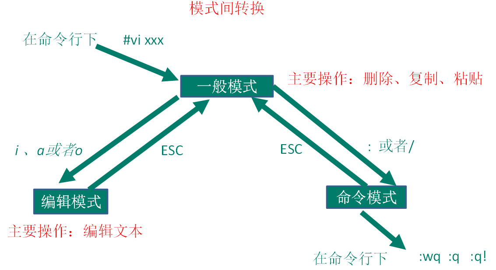

### vim技巧篇

我们可以利用**块选择模式**完成一些批量编辑工作

#### 示例 1：纵向编辑在批量修改代码的应用演示

将数列：

```
10.1.1.214 
10.1.1.212 
10.1.1.210
```

编辑成序列：

```
ping -c 4 10.5.5.214 >> result0 
ping -c 4 10.5.5.212 >> result0 
ping -c 4 10.5.5.210 >> result0
```

这是一个将 IP 数列修改成可执行的 ping 命令序列的过程。

##### 第一步：修改

将 IP 数列中第二段所有数字“1” 修改为“5”：

将游标定位第一个行 IP 地址第二段的“1”

`ctrl-v `进入纵向编辑模式

`G `移动游标到最后一行，可视块覆盖所要修改的列

`r `进入修改模式

`5 `输入数字“5”

`ESC `退出纵向编辑模式，同时所有被选中的数字都被改成了“5”，并回到命令模式

结果如下：

```
10.5.5.214 
10.5.5.212
10.5.5.210
```

##### 第二步：前添加

在所有行之前添加“ping – c 4 ”：

将游标定位到第一行第一列

`ctrl-v `进入纵向编辑模式

`G `移动游标到最后一行第一列，可视块覆盖了第一列

`I `进入行首插入模式

`ping -c 4 `输入所要求字符“ping – c 4 ”

`ESC `**按两下**退出纵向编辑模式的同时所有选中的字符前都添加了“ping – c 4 ”，回到命令模式

结果如下：

```
ping -c 4 10.5.5.214 
ping -c 4 10.5.5.212 
ping -c 4 10.5.5.210
```

##### 第三步：后添加

在所有行之后添加“>> result0”：

将游标定位到第一行最后一列

`ctrl-v` 进入纵向编辑模式

`G` 移动游标到最后一行最后一列，VISUAL 　 BLOCK 　覆盖了最后一列

`A` 进入行尾插入模式

`>> result`	输入所要求字符“>> result0”

`ESC` **按两下**退出纵向编辑模式的同时所有选中的字符后都添加了“ >> result0”，回到命令模式

结果如下：

```
ping -c 4 10.5.5.214 >> result0 
ping -c 4 10.5.5.212 >> result0 
ping -c 4 10.5.5.210 >> result0
```

以上三个步骤有一个共同特点，就是都纵向为编辑方向。以上由三行代码为例的方法同样也可以适用于更多的行。

#### 示例2 批量添加注释

方法一 ：块选择模式

批量注释：

**Ctrl + v** 进入块选择模式，然后移动光标选中你要注释的行，再按大写的 **I** 进入行首插入模式输入注释符号如 **//** 或 **#**，输入完毕之后，按两下 **ESC**，**Vim** 会自动将你选中的所有行首都加上注释，保存退出完成注释。

取消注释：

**Ctrl + v** 进入块选择模式，选中你要删除的行首的注释符号，注意 **//** 要选中两个，选好之后按 **d** 即可删除注释，**ESC** 保存退出。

方法二: 替换命令

批量注释。

使用下面命令在指定的行首添加注释。

使用名命令格式： **:起始行号,结束行号s/^/注释符/g**（注意冒号）。

取消注释：

使用名命令格式： **:起始行号,结束行号s/^注释符//g**（注意冒号）。

#### vim配置模板

参考：https://my.oschina.net/wangzilong/blog/760292

## systemctl后台服务管理

从CentOS 7.x开始，CentOS开始使用systemd服务来代替daemon，

原来管理系统启动和管理系统服务的相关命令全部由systemctl命令来代替。

### 原来的 service 命令与 systemctl 命令对比

| daemon命令             | systemctl命令                 | 说明     |
| ---------------------- | ----------------------------- | -------- |
| service [服务] start   | systemctl start [unit type]   | 启动服务 |
| service [服务] stop    | systemctl stop [unit type]    | 停止服务 |
| service [服务] restart | systemctl restart [unit type] | 重启服务 |

**此外还是二个systemctl参数没有与service命令参数对应**

- status：参数来查看服务运行情况
- reload：重新加载服务，加载更新后的配置文件（并不是所有服务都支持这个参数，比如network.service）

应用举例：

```bash
#启动网络服务
systemctl start network.service

#停止网络服务
systemctl stop network.service

#重启网络服务
systemctl restart network.service

#查看网络服务状态
systemctl status network.serivce
```

### 原来的chkconfig 命令与 systemctl 命令对比

### 设置开机启动/不启动

| daemon命令           | systemctl命令                 | 说明                 |
| -------------------- | ----------------------------- | -------------------- |
| chkconfig [服务] on  | systemctl enable [unit type]  | 设置服务开机启动     |
| chkconfig [服务] off | systemctl disable [unit type] | 设备服务禁止开机启动 |

应用举例：

```bash
#停止cup电源管理服务
systemctl stop cups.service

#禁止cups服务开机启动
systemctl disable cups.service

#查看cups服务状态
systemctl status cups.service

#重新设置cups服务开机启动
systemctl enable cups.service
```

### 查看系统上上所有的服务

命令格式：

```bash
systemctl [command] [–type=TYPE] [–all]
```

参数详解：

command – list-units：依据unit列出所有启动的unit。加上 –all 才会列出没启动的unit; – list-unit-files:依据/usr/lib/systemd/system/ 内的启动文件，列出启动文件列表

–type=TYPE – 为unit type, 主要有service, socket, target

应用举例：

| systemctl命令                                    | 说明                       |
| ------------------------------------------------ | -------------------------- |
| systemctl                                        | 列出所有的系统服务         |
| systemctl list-units                             | 列出所有启动unit           |
| systemctl list-unit-files                        | 列出所有启动文件           |
| systemctl list-units –type=service –all          | 列出所有service类型的unit  |
| systemctl list-units –type=service –all grep cpu | 列出 cpu电源管理机制的服务 |
| systemctl list-units –type=target –all           | 列出所有target             |

### systemctl特殊的用法

| systemctl命令                   | 说明                       |
| ------------------------------- | -------------------------- |
| systemctl is-active [unit type] | 查看服务是否运行           |
| systemctl is-enable [unit type] | 查看服务是否设置为开机启动 |
| systemctl mask [unit type]      | 注销指定服务               |
| systemctl unmask [unit type]    | 取消注销指定服务           |

应用举例：

```bash
#查看网络服务是否启动
systemctl is-active network.service

#检查网络服务是否设置为开机启动
systemctl is-enable network.service

#停止cups服务
systemctl stop cups.service

#注销cups服务
systemctl mask cups.service

#查看cups服务状态
systemctl status cups.service

#取消注销cups服务
systemctl unmask cups.service
```


## 关机重启命令

在linux领域内大多用在服务器上，很少遇到关机的操作。毕竟服务器上跑一个服务是永无止境的，除非特殊情况下，不得已才会关机。

**正确的关机流程为**：sync > shutdown > reboot > halt

### 1. 基本语法

（1）sync  			（功能描述：将数据由内存同步到硬盘中）

（2）halt 			（功能描述：关闭系统，等同于shutdown -h now 和 poweroff）

（3）reboot 			（功能描述：就是重启，等同于 shutdown -r now）

（4）shutdown [选项] 时间	

| 选项 | 功能          |
| ---- | ------------- |
| -h   | -h=halt关机   |
| -r   | -r=reboot重启 |

| 参数 | 功能                                   |
| ---- | -------------------------------------- |
| now  | 立刻关机                               |
| 时间 | 等待多久后关机（时间单位是**分钟**）。 |

### 2. 经验技巧

​	Linux系统中为了提高磁盘的读写效率，对磁盘采取了 “预读迟写”操作方式。当用户保存文件时，Linux核心并不一定立即将保存数据写入物理磁盘中，而是将数据保存在缓冲区中，等缓冲区满时再写入磁盘，这种方式可以极大的提高磁盘写入数据的效率。但是，也带来了安全隐患，如果数据还未写入磁盘时，系统掉电或者其他严重问题出现，则将导致数据丢失。使用sync指令可以立即将缓冲区的数据写入磁盘。

### 3. 案例

（1）将数据由内存同步到硬盘中

```bash
$ sync
```

（2）重启

```bash
$ reboot now
```

（3）关机

```bash
$ halt
```

（4）计算机将在1分钟后关机，并且会显示在登录用户的当前屏幕中

```bash
$ shutdown -h 1 ‘This server will shutdown after 1 mins’
```

（5）立马关机（等同于 halt）

```bash
$ shutdown -h now 
```

（6）系统立马重启（等同于 reboot）

```bash
$ shutdown -r now
```


## 常用基本命令

​	与linux的交互除有图形化界面之外，都是采用命令方式

首次进入终端，会看到如下的显示

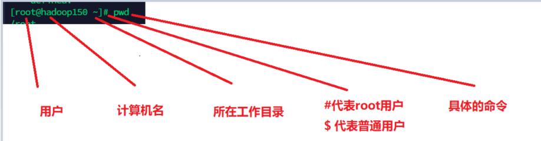

### 1.帮助命令

#### 1.1 man获得帮助信息

##### 基本语法

```bash
$ man [命令或配置文件]		（功能描述：获得帮助信息）
```

##### 显示说明

| 信息        | 功能                     |
| ----------- | ------------------------ |
| NAME        | 命令的名称和单行描述     |
| SYNOPSIS    | 怎样使用命令             |
| DESCRIPTION | 命令功能的深入讨论       |
| EXAMPLES    | 怎样使用命令的例子       |
| SEE ALSO    | 相关主题（通常是手册页） |

##### 案例

查看ls命令的帮助信息

```bash
$ man ls
```

#### 1.2 help 获得shell内置命令的帮助信息

> 注意：help命令只能获取shell脚本对应的内置命令

##### 基本语法

```bash
$ help 命令	（功能描述：获得shell内置命令的帮助信息）
```

##### 案例

查看cd命令的帮助信息```help cd```

### 2.文件目录命令

#### 2.1 pwd显示当前工作目录绝对路径

pwd:print working directory 打印工作目录

##### 基本语法

```bash
$ pwd		（功能描述：显示当前工作目录的绝对路径）
```

##### 案例

显示当前工作目录的绝对路径

```bash
[root@hadoop150 ~]# pwd
/root
```

#### 2.2 ls列出目录的内容

ls:list 列出目录内容

##### 基本语法

```bash
$ ls [选项] [目录或是文件]
```

##### 选项说明

| 选项 | 功能                                                      |
| ---- | --------------------------------------------------------- |
| -a   | 全部的文件，连同隐藏档( 开头为 . 的文件) 一起列出来(常用) |
| -l   | 长数据串列出，包含文件的属性与权限等等数据；(常用)        |

##### 显示说明

​	每行列出的信息依次是： **文件类型与权限 链接数 文件属主 文件属组 文件大小用byte来表示 建立或最近修改的时间 名字** 

##### 案例

查看当前目录的所有内容信息

```bash
$ ls -al

总用量 44

drwx------. 5 neuedu neuedu 4096 5月  27 15:15 .

drwxr-xr-x. 3 root    root    4096 5月  27 14:03 ..

drwxrwxrwx. 2 root    root    4096 5月  27 14:14 hello

##### -rwxrw-r--. 1 neuedu neuedu   34 5月  27 14:20 test.txt
```

#### 2.3 cd 切换目录

cd:Change Directory切换路径

##### 基本语法

```bash
$ cd  [参数]
```

##### 参数说明

| 参数        | 功能                                 |
| ----------- | ------------------------------------ |
| cd 绝对路径 | 切换路径                             |
| cd相对路径  | 切换路径                             |
| cd ~或者cd  | 回到自己的家目录                     |
| cd -        | 回到上一次所在目录                   |
| cd ..       | 回到当前目录的上一级目录             |
| cd -P       | 跳转到实际物理路径，而非快捷方式路径 |

##### 案例

（1）使用绝对路径切换到root目录

```bash
$ cd /root/
```

（2）使用相对路径切换到“/srv”目录

```bash
$ cd srv
```

（3）表示回到自己的家目录，亦即是 /root 这个目录

```bash
$ cd ~
```

（4）cd- 回到上一次所在目录

```bash
$ cd -
```

（5）表示回到当前目录的上一级目录

```bash
$ cd ..
```

#### 2.4 mkdir创建一个新的目录

mkdir:Make directory 建立目录

##### 基本语法

```bash
mkdir [选项] 要创建的目录
```

##### 选项说明

表1-10 选项说明

| 选项 | 功能         |
| ---- | ------------ |
| -p   | 创建多层目录 |

##### 案例

（1）创建一个目录

```bash
$ mkdir xiyou
$ mkdir xiyou/mingjie
```

（2）创建一个多级目录

```bash
$ mkdir -p xiyou/dssz/meihouwang
```

#### 2.5 rmdir 删除一个空的目录

rmdir:Remove directory 移动目录

##### 基本语法：

```bash
$ rmdir 要删除的空目录
```

##### 案例

删除一个空的文件夹

```bash
$ rmdir xiyou/dssz/meihouwang
```

#### 2.6 touch 创建空文件

##### 基本语法

```bash
$ touch 文件名称
```

##### 案例

```bash
$ touch xiyou/dssz/sunwukong.txt
```

#### 2.7 cp 复制文件或目录

##### 基本语法

```bash
$ cp [选项] source dest 				（功能描述：复制source文件到dest）
```

##### 选项说明

| 选项 | 功能               |
| ---- | ------------------ |
| -r   | 递归复制整个文件夹 |

参数说明

| 参数   | 功能     |
| ------ | -------- |
| source | 源文件   |
| dest   | 目标文件 |

##### 经验技巧

​	强制覆盖不提示的方法：\cp

##### 案例

（1）复制文件

```bash
$ cp xiyou/dssz/suwukong.txt xiyou/mingjie/
```

（2）递归复制整个文件夹

```bash
$ cp -r xiyou/dssz/ ./
```

#### 2.7 rm 移除文件或目录

##### 基本语法

```bash
$ rm [选项] deleteFile			（功能描述：递归删除目录中所有内容）
```

##### 选项说明

| 选项 | 功能                                     |
| ---- | ---------------------------------------- |
| -r   | 递归删除目录中所有内容                   |
| -f   | 强制执行删除操作，而不提示用于进行确认。 |
| -v   | 显示指令的详细执行过程                   |

##### 案例

（1）删除目录中的内容

```bash
$ rm xiyou/mingjie/sunwukong.txt
```

（2）递归删除目录中所有内容

```bash
$ rm -rf dssz/
```

#### 2.8 mv 移动文件与目录或重命名

##### 基本语法

```bash
$ mv oldNameFile newNameFile （功能描述：重命名）
$ mv /temp/movefile /targetFolder	（功能描述：移动文件）
```

##### 案例

（1）重命名

```bash
$ mv xiyou/dssz/suwukong.txt xiyou/dssz/houge.txt
```

（2）移动文件

```bash
$ mv xiyou/dssz/houge.txt ./
```

#### 2.9 cat 查看文件内容

查看文件内容，从第一行开始显示。

##### 基本语法

```bash
$ cat  [选项] 要查看的文件
```

##### 选项说明

| 选项 | 功能描述                     |
| ---- | ---------------------------- |
| -n   | 显示所有行的行号，包括空行。 |

##### 经验技巧

一般查看比较小的文件，**一屏幕能显示全的**。

##### 案例

（1）查看文件内容并显示行号

```bash
$ cat -n houge.txt 
```

#### 2.10 more 文件内容分屏查看器

​	more指令是一个基于VI编辑器的文本过滤器，它以全屏幕的方式按页显示文本文件的内容。more指令中内置了若干快捷键，详见操作说明。

##### 基本语法

```bash
$ more 要查看的文件
```

##### 操作说明

| 操作           | 功能说明                                 |
| -------------- | ---------------------------------------- |
| 空白键 (space) | 代表向下翻一页；                         |
| Enter          | 代表向下翻『一行』；                     |
| q              | 代表立刻离开 more ，不再显示该文件内容。 |
| Ctrl+F         | 向下滚动一屏                             |
| Ctrl+B         | 返回上一屏                               |
| =              | 输出当前行的行号                         |
| :f             | 输出文件名和当前行的行号                 |

##### 案例

（1）采用more查看文件

```bash
$ more test
```

#### 2.11 less 分屏显示文件内容

​	less指令用来分屏查看文件内容，它的功能与more指令类似，但是比more指令更加强大，支持各种显示终端。less指令在显示文件内容时，并不是一次将整个文件加载之后才显示，而是根据显示需要加载内容，对于显示**大型文件具有较高的效率**。

##### 基本语法

```bash
$ less 要查看的文件
```

##### 操作说明

| 操作       | 功能说明                                           |
| ---------- | -------------------------------------------------- |
| 空白键     | 向下翻动一页；                                     |
| [pagedown] | 向下翻动一页                                       |
| [pageup]   | 向上翻动一页；                                     |
| /字串      | 向下搜寻『字串』的功能；n：向下查找；N：向上查找； |
| ?字串      | 向上搜寻『字串』的功能；n：向上查找；N：向下查找； |
| q          | 离开 less 这个程序；                               |

##### 案例

（1）采用less查看文件

```bash
$ less /var/log/boot.log
```

#### 2.12 echo

echo输出内容到控制台

##### 基本语法

```bash
$ echo [选项] [输出内容]
```

##### 选项： 

  -e：  支持反斜线控制的字符转换

| 控制字符 | 作用                |
| -------- | ------------------- |
| \\       | 输出\本身           |
| \n       | 换行符              |
| \t       | 制表符，也就是Tab键 |

##### 案例

```bash
$ echo "hello\tworld"
------------------
hello\tworld
```

```bash
$ echo -e "hello\tworld"
--------------------------
hello		world
```

#### 2.13 head 显示文件头部内容

head用于显示文件的开头部分内容，默认情况下head指令显示文件的前10行内容。

##### 基本语法

```bash
$ head 文件	      （功能描述：查看文件头10行内容）
$ head -n 5 文件      （功能描述：查看文件头5行内容，5可以是任意行数）
```

##### 选项说明

| 选项      | 功能                   |
| --------- | ---------------------- |
| -n <行数> | 指定显示头部内容的行数 |

##### 案例

（1）查看文件的头2行

```bash
$ head -n 2 smartd.conf
```

#### 2.14 tail 输出文件尾部内容

tail用于输出文件中尾部的内容，默认情况下tail指令显示文件的后10行内容。

##### 基本语法

```bash
$ tail  文件 			（功能描述：查看文件后10行内容）
$ tail  -n 5 文件 		（功能描述：查看文件后5行内容，5可以是任意行数）
$ tail  -f  文件		（功能描述：实时追踪该文档的所有更新）
```

##### 选项说明

| 选项     | 功能                                 |
| -------- | ------------------------------------ |
| -n<行数> | 输出文件尾部n行内容                  |
| -f       | 显示文件最新追加的内容，监视文件变化 |

##### 案例

（1）查看文件头1行内容

```bash
$ tail -n 1 smartd.conf 
```

（2）实时追踪该档的所有更新

```bash
$ tail -f houge.txt
```

#### 2.15  >覆盖 和 >> 追加

​	其实这是UNIX系统的标准输入与标准输出功能，在shell中会说到，这里先知道基本用法

##### 基本语法

```bash
$ ll >文件		（功能描述：列表的内容写入文件a.txt中（覆盖写））

$ ll >>文件		（功能描述：列表的内容**追加**到文件aa.txt的末尾）

$ cat 文件1 > 文件2	（功能描述：将文件1的内容覆盖到文件2）

$ echo “内容” >> 文件
```

##### 案例

（1）将ls查看信息写入到文件中

```bash
$ ls -l>houge.txt
```

（2）将ls查看信息追加到文件中

```bash
$ ls -l>>houge.txt
```

（3）采用echo将hello单词追加到文件中

```bash
$ echo hello>>houge.txt
```

#### **2.16 ln 软链接**

软链接也成为符号链接，类似于windows里的快捷方式，有自己的数据块，主要存放了链接其他文件的路径。

> linux连接种类参考：https://www.runoob.com/linux/linux-comm-ln.html

##### 基本语法

```bash
$ ln -s [原文件或目录] [软链接名]		（功能描述：给原文件创建一个软链接）
```

##### 经验技巧

删除软链接： rm -rf 软链接名，而不是rm -rf 软链接名/

查询：通过ll就可以查看，列表属性第1位是l，尾部会有位置指向。

##### 案例

（1）创建软连接

```bash
[root@hadoop101 ~]# mv houge.txt xiyou/dssz/
[root@hadoop101 ~]# ln -s xiyou/dssz/houge.txt ./houzi
[root@hadoop101 ~]# ll
-------------------
lrwxrwxrwx. 1 root    root      20 6月  17 12:56 houzi -> xiyou/dssz/houge.txt
```

（2）删除软连接，同正常的文件一样

```bash
[root@hadoop101 ~]# rm -rf houzi
```

（3）进入软连接实际物理路径

```bash
[root@hadoop101 ~]# ln -s xiyou/dssz/ ./dssz
[root@hadoop101 ~]# cd -P dssz/
```

#### **2.17 history 查看已经执行过历史命令**

##### 基本语法

```bash
$ history						（功能描述：查看已经执行过历史命令）
```

##### 案例

（1）查看已经执行过的历史命令

```bash
$ history
```

### 3. 时间日期命令

#### 3.1 date命令

##### 基本语法

```bash
$ date [OPTION]... [+FORMAT]
```

##### 选项说明

| 选项           | 功能                                           |
| -------------- | ---------------------------------------------- |
| -d<时间字符串> | 显示指定的“时间字符串”表示的时间，而非当前时间 |
| -s<日期时间>   | 设置系统日期时间                               |

##### 参数说明

| 参数            | 功能                         |
| --------------- | ---------------------------- |
| <+日期时间格式> | 指定显示时使用的日期时间格式 |

#### 3.2 date 显示当前时间

##### 基本语法

```bash
$ date								（功能描述：显示当前时间）
$ date +%Y							（功能描述：显示当前年份）
$ date +%m							（功能描述：显示当前月份）
$ date +%d							（功能描述：显示当前是哪一天）
$ date "+%Y-%m-%d %H:%M:%S"		    （功能描述：显示年月日时分秒）
```

##### 案例

（1）显示当前时间信息

```bash
$ date
```

（2）显示当前时间年月日

```bash
$ date +%Y%m%d
```

（3）显示当前时间年月日时分秒

```bash
$ date "+%Y-%m-%d %H:%M:%S"
```

#### 3.3 date 显示非当前时间

##### 基本语法

```bash
$ date -d '1 days ago'			（功能描述：显示前一天时间）

$ date -d '-1 days ago'			（功能描述：显示明天时间）
```

##### 案例

（1）显示前一天

```bash
$ date -d '1 days ago'
```

（2）显示明天时间

```bash
$ date -d '-1 days ago'
```

#### 3.4 date 设置系统时间

##### 基本语法

```bash
$ date -s 字符串时间
```

##### 案例

（1）设置系统当前时间

```bash
$ date -s "2017-06-19 20:52:18"
```

#### 3.5 cal 查看日历

##### 基本语法

```bash
$ cal [选项]			（功能描述：不加选项，显示本月日历）
```

##### 选项说明

| 选项       | 功能             |
| ---------- | ---------------- |
| 具体某一年 | 显示这一年的日历 |

##### 案例

（1）查看当前月的日历

```bash
$ cal
```

（2）查看2017年的日历

```bash
$ cal 2017
```

### 4. 用户管理命令

#### 4.1 useradd 添加新用户

##### 基本语法

```bash
$ useradd 用户名			（功能描述：添加新用户）

$ useradd -g 组名 用户名	（功能描述：添加新用户到某个组）
```

##### 案例

（1）添加一个用户

```bash
$ useradd tangseng
$ ll /home/
```

#### 4.2 passwd 设置用户密码

##### 基本语法

```bash
$ passwd 用户名	（功能描述：设置用户密码）
```

##### 案例

（1）设置用户的密码

```bash
$ passwd tangseng
```

#### 4.3 id查看用户是否存在

##### 基本语法

```bash
$ id 用户名
```

##### 案例

（1）查看用户是否存在

```bash
$ id tangseng
```

#### 4.4 cat  /etc/passwd 查看创建了哪些用户

##### 基本语法

```bash
$ cat  /etc/passwd
```

#### 4.5 su 切换用户

su: swith user 切换用户

##### 基本语法

```bash
$ su 用户名称   （功能描述：切换用户，只能获得用户的执行权限，不能获得环境变量）

$ su - 用户名称		（功能描述：切换到用户并获得该用户的环境变量及执行权限）
```

##### 案例

（1）切换用户

```bash
[root@hadoop101 ~]#su tangseng

[root@hadoop101 ~]#echo $PATH

/usr/lib64/qt-3.3/bin:/usr/local/sbin:/usr/local/bin:/sbin:/bin:/usr/sbin:/usr/bin:/root/bin

[root@hadoop101 ~]#exit

[root@hadoop101 ~]#su - tangseng

[root@hadoop101 ~]#echo $PATH

/usr/lib64/qt-3.3/bin:/usr/local/bin:/bin:/usr/bin:/usr/local/sbin:/usr/sbin:/sbin:/home/tangseng/bin
```

#### 4.6 userdel 删除用户

##### 基本语法

```bash
$ userdel  用户名		（功能描述：删除用户但保存用户主目录）

$ userdel -r 用户名		（功能描述：用户和用户主目录，都删除）
```

##### 选项说明

| 选项 | 功能                                       |
| ---- | ------------------------------------------ |
| -r   | 删除用户的同时，删除与用户相关的所有文件。 |

##### 案例

（1）删除用户但保存用户主目录

```bash
[root@hadoop101 ~]#userdel tangseng
[root@hadoop101 ~]#ll /home/
```

（2）删除用户和用户主目录，都删除

```bash
[root@hadoop101 ~]#useradd zhubajie
[root@hadoop101 ~]#ll /home/
[root@hadoop101 ~]#userdel -r zhubajie
[root@hadoop101 ~]#ll /home/
```

#### 4.7 who 查看登录用户信息

##### 基本语法

```bash
$ whoami			（功能描述：显示自身用户名称）

$ who am i		（功能描述：显示登录用户的用户名）
```

##### 案例

（1）显示自身用户名称

```bash
[root@hadoop101 opt]# whoami
```

（2）显示登录用户的用户名

```bash
[root@hadoop101 opt]# who am i
```

#### 4.8 **sudo** **设置普通用户具有root权限**

要想让普通用户具有root的权限，我们需要使用sudo命令，但前提是这个用户必须在sudoers名单中

##### 1．添加neuedu用户，并对其设置密码。

```bash
[root@hadoop101 ~]#useradd neuedu

[root@hadoop101 ~]#passwd neuedu
```

##### 2．修改配置文件

```bash
[root@hadoop101 ~]#vi /etc/sudoers
```

修改 /etc/sudoers 文件，找到下面一行(91行)，在root下面添加一行，如下所示：

```bash
## Allow root to run any commands anywhere
root    ALL=(ALL)     ALL
neuedu   ALL=(ALL)     ALL
```

或者配置成采用sudo命令时，不需要输入密码

```bash
\## Allow root to run any commands anywhere
root      ALL=(ALL)     ALL
neuedu   ALL=(ALL)     NOPASSWD:ALL
```

修改完毕，现在可以用neuedu帐号登录，然后用命令 sudo ，即可获得root权限进行操作。

##### 3．案例

（1）用普通用户在/opt目录下创建一个文件夹

```bash
[neuedu@hadoop101 opt]$ sudo mkdir module
[root@hadoop101 opt]# chown neuedu:neuedu module/
```

#### 4.9 usermod 修改用户

##### 基本语法

```bash
$ usermod -g 用户组 用户名
```

##### 选项说明

| 选项 | 功能                                   |
| ---- | -------------------------------------- |
| -g   | 修改用户的初始登录组，给定的组必须存在 |

##### 案例

（1）将用户加入到用户组

```bash
[root@hadoop101 opt]#usermod -g root zhubajie
```

### 5 用户组管理命令

​	每个用户都有一个用户组，系统可以对一个用户组中的所有用户进行集中管理。不同Linux 系统对用户组的规定有所不同，如Linux下的用户属于与它同名的用户组，这个用户组在创建用户时同时创建。用户组的管理涉及用户组的添加、删除和修改。组的增加、删除和修改实际上就是对/etc/group文件的更新。

#### 5.1 groupadd 新增组

##### 基本语法

```bash
$ groupadd 组名
```

##### 案例

（1）添加一个xitianqujing组

```bash
[root@hadoop101 opt]#groupadd xitianqujing
```

#### 5.2 groupdel 删除组

##### 基本语法

```bash
$ groupdel 组名
```

##### 案例

（1）删除xitianqujing组

```bash
[root@hadoop101 opt]# groupdel xitianqujing
```

#### 5.3 groupmod 修改组

##### 基本语法

```bash
$ groupmod -n 新组名 老组名
```

##### 选项说明

| 选项       | 功能描述           |
| ---------- | ------------------ |
| -n<新组名> | 指定工作组的新组名 |

##### 案例

（1）修改neuedu组名称为neuedu1

```bash
[root@hadoop101 ~]#groupadd xitianqujing
[root@hadoop101 ~]# groupmod -n xitian xitianqujing
```

#### 5.4 cat  /etc/group 查看创建了哪些组

#### 基本操作

```bash
[root@hadoop101 neuedu]# cat  /etc/group
```

### 6 文件权限类

#### 6.1 文件属性

​	Linux系统是一种典型的多用户系统，不同的用户处于不同的地位，拥有不同的权限。为了保护系统的安全性，Linux系统对不同的用户访问同一文件（包括目录文件）的权限做了不同的规定。在Linux中我们可以使用ll或者ls -l命令来显示一个文件的属性以及文件所属的用户和组。

##### 1．从左到右的10个字符表示，如图所示：

 

如果没有权限，就会出现减号[ - ]而已。从左至右用0-9这些数字来表示:

（1）0首位表示类型

​	在Linux中第一个字符代表这个文件是目录、文件或链接文件等等

​	**-** 代表文件

​	 **d** 代表目录

​	 **l** 链接文档(link file)；

（2）第1-3位确定属主（该文件的所有者）拥有该文件的权限。---User

（3）第4-6位确定属组（所有者的同组用户）拥有该文件的权限，---Group

（4）第7-9位确定其他用户拥有该文件的权限 ---Other

##### 2．rxw作用文件和目录的不同解释

（1）作用到文件：

​	[ r ]代表可读(read): 可以读取，查看

​	[ w ]代表可写(write): 可以修改，但是不代表可以删除该文件，删除一个文件的前提条件是对该文件所在的目	录有写权限，才能删除该文件.

​	[ x ]代表可执行(execute):可以被系统执行

（2）作用到目录：

​	[ r ]代表可读(read): 可以读取，ls查看目录内容

​	[ w ]代表可写(write): 可以修改，目录内创建+删除+重命名目录

​	[ x ]代表可执行(execute):可以进入该目录

##### 3．案例

```bash
[root@hadoop101 ~]# ll
---------------------
total 104
-rw-------. 1 root root  1248 1月   8 17:36 anaconda-ks.cfg
drwxr-xr-x. 2 root root  4096 1月  12 14:02 dssz
lrwxrwxrwx. 1 root root    20 1月  12 14:32 houzi -> xiyou/dssz/houge.tx
```

文件基本属性介绍，如图所示：

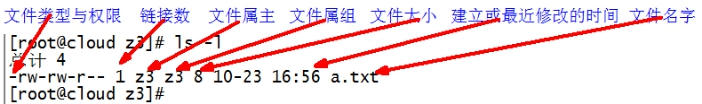 

（1）如果查看到是文件：链接数指的是硬链接个数。创建硬链接方法

  ```bash
$ ln [原文件] [目标文件]	 
[root@hadoop101 ~]# ln xiyou/dssz/houge.txt ./hg.txt
  ```

（2）如果查看的是文件夹：链接数指的是子文件夹个数。

```bash
[root@hadoop101 ~]# ls -al xiyou/
--------------------------
总用量 16
drwxr-xr-x.  4 root root 4096 1月  12 14:00 .
dr-xr-x---. 29 root root 4096 1月  12 14:32 ..
drwxr-xr-x.  2 root root 4096 1月  12 14:30 dssz
drwxr-xr-x.  2 root root 4096 1月  12 14:04 mingjie
```

#### 6.2 chmod 改变权限

##### 基本语法

 

第一种方式变更权限

```bash
$ chmod  [{ugoa}{+-=}{rwx}] 文件或目录
```

第二种方式变更权限

```bash
$ chmod  [mode=421 ]  [文件或目录]
```

##### 经验技巧

u:所有者  g:所有组  o:其他人  a:所有人(u、g、o的总和)

r=4 w=2 x=1        rwx=4+2+1=7

##### 案例

（1）修改文件使其所属主用户具有执行权限

```bash
[root@hadoop101 ~]# cp xiyou/dssz/houge.txt ./
[root@hadoop101 ~]# chmod u+x houge.txt
```

（2）修改文件使其所属组用户具有执行权限

```bash
[root@hadoop101 ~]# chmod g+x houge.txt
```

（3）修改文件所属主用户执行权限,并使其他用户具有执行权限

```bash
[root@hadoop101 ~]# chmod u-x,o+x houge.txt
```

（4）采用数字的方式，设置文件所有者、所属组、其他用户都具有可读可写可执行权限。

```bash
[root@hadoop101 ~]# chmod 777 houge.txt
```

（5）修改整个文件夹里面的所有文件的所有者、所属组、其他用户都具有可读可写可执行权限。

```bash
[root@hadoop101 ~]# chmod -R 777 xiyou/
```

#### 6.3 chown 改变所有者

##### 基本语法

```bash
$ chown [选项] [最终用户] [文件或目录]		（功能描述：改变文件或者目录的所有者）
```

##### 选项说明

| 选项 | 功能     |
| ---- | -------- |
| -R   | 递归操作 |

##### 案例

（1）修改文件所有者

```bash
[root@hadoop101 ~]# chown neuedu houge.txt 
[root@hadoop101 ~]# ls -al
---------------------------
-rwxrwxrwx. 1 neuedu root 551 5月  23 13:02 houge.txt
```

（2）递归改变文件所有者和所有组

```bash
[root@hadoop101 xiyou]# ll
---------------------------------------
drwxrwxrwx. 2 root root 4096 9月   3 21:20 xiyou
----------------------------------------
[root@hadoop101 xiyou]# chown -R neuedu:neuedu xiyou/
[root@hadoop101 xiyou]# ll
-----------------------------------------------------
drwxrwxrwx. 2 neuedu neuedu 4096 9月   3 21:20 xiyou
```

#### 6.4 chgrp 改变所属组

##### 基本语法

```bash
$ chgrp [最终用户组] [文件或目录]	（功能描述：改变文件或者目录的所属组）
```

##### 案例

（1）修改文件的所属组

```bash
[root@hadoop101 ~]# chgrp root houge.txt
[root@hadoop101 ~]# ls -al
------------------------------------
-rwxrwxrwx. 1 neuedu root 551 5月  23 13:02 houge.txt
```

### 7 搜索查找类

#### 7.1 find 查找文件或者目录

​	find指令将从指定目录向下递归地遍历其各个子目录，将满足条件的文件显示在终端。

##### 基本语法

```bash
$ find [搜索范围] [选项]
```

##### 选项说明

| 选项            | 功能                             |
| --------------- | -------------------------------- |
| -name<查询方式> | 按照指定的文件名查找模式查找文件 |
| -user<用户名>   | 查找属于指定用户名所有文件       |
| -size<文件大小> | 按照指定的文件大小查找文件。     |

##### 案例

（1）按文件名：根据名称查找/目录下的filename.txt文件。

```bash
[root@hadoop101 ~]# find xiyou/ -name “*.txt”
```

（2）按拥有者：查找/opt目录下，用户名称为-user的文件

```bash
[root@hadoop101 ~]# find xiyou/ -user neuedu
```

（3）按文件大小：在/home目录下查找大于200m的文件（+n 大于  -n小于   n等于）

```bash
[root@hadoop101 ~]find /home -size +204800
```

#### 7.2 grep 过滤查找及“|”管道符

管道符，“|”，表示将前一个命令的处理结果输出传递给后面的命令处理

##### 基本语法

```bash
$ grep 选项 查找内容 源文件
```

##### 选项说明

| 选项 | 功能               |
| ---- | ------------------ |
| -n   | 显示匹配行及行号。 |

##### 案例

（1）查找某文件在第几行

```bash
[root@hadoop101 ~]# ls | grep -n test
```

#### 7.3 **which** **查找命令**

​	查找命令在那个目录下

##### 基本语法

```bash
$ which 命令
```

##### 案例

```bash
$ which ll
```

### 8 压缩和解压类

#### 8.1 gzip/gunzip 压缩

**基本语法**

```bash
$ gzip 文件		（功能描述：压缩文件，只能将文件压缩为*.gz文件）

$ gunzip 文件.gz	（功能描述：解压缩文件命令）
```

##### 经验技巧

（1）**只能压缩文件**不能压缩目录

（2）**不保留原来的文件**

案例

（1）gzip压缩

```bash
[root@hadoop101 ~]# ls
------
test.java
-----
[root@hadoop101 ~]# gzip houge.txt
[root@hadoop101 ~]# ls
----------
houge.txt.gz
```

（2）gunzip解压缩文件

```bash
[root@hadoop101 ~]# gunzip houge.txt.gz 
[root@hadoop101 ~]# ls
houge.txt
```

#### 8.2 zip/unzip 压缩

##### 基本语法

```bash
$ zip  [选项] XXX.zip  将要压缩的内容 		（功能描述：压缩文件和目录的命令）
$ unzip [选项] XXX.zip						（功能描述：解压缩文件）
```

##### 选项说明

| zip选项 | 功能     |
| ------- | -------- |
| -r      | 压缩目录 |

| unzip选项 | 功能                     |
| --------- | ------------------------ |
| -d<目录>  | 指定解压后文件的存放目录 |

##### 经验技巧

zip 压缩命令在window/linux都通用，**可以压缩目录且保留源文件**。

##### 案例

（1）压缩 1.txt 和2.txt，压缩后的名称为mypackage.zip 

```bash
[root@hadoop101 opt]# touch bailongma.txt
[root@hadoop101 ~]# zip houma.zip houge.txt bailongma.txt 
-----------------------------
  adding: houge.txt (stored 0%)
  adding: bailongma.txt (stored 0%)

[root@hadoop101 opt]# ls
-------------------
houge.txt	bailongma.txt	houma.zip 
```

（2）解压 mypackage.zip

```bash
[root@hadoop101 ~]# unzip houma.zip 
----------------------
Archive:  houma.zip
extracting: houge.txt               
extracting: bailongma.txt       

[root@hadoop101 ~]# ls
-----------------------
houge.txt	bailongma.txt	houma.zip 
```

（3）解压mypackage.zip到指定目录-d

```bash
[root@hadoop101 ~]# unzip houma.zip -d /opt
[root@hadoop101 ~]# ls /opt/
```

#### 8.3 tar 打包

##### 基本语法

```bash
$ tar  [选项]  XXX.tar.gz  将要打包进去的内容		（功能描述：打包目录，压缩后的文件格式.tar.gz）
```

##### 选项说明

| 选项   | 功能                 |
| ------ | -------------------- |
| -z     | 打包同时压缩         |
| **-c** | **产生.tar打包文件** |
| -v     | 显示详细信息         |
| -f     | 指定压缩后的文件名   |
| **-x** | **解包.tar文件**     |

##### 案例

（1）压缩多个文件

```bash
[root@hadoop101 opt]# tar -zcvf houma.tar.gz houge.txt bailongma.txt 
------------
houge.txt
bailongma.txt

[root@hadoop101 opt]# ls
----------------
houma.tar.gz houge.txt bailongma.txt 
```

（2）压缩目录

```bash
[root@hadoop101 ~]# tar -zcvf xiyou.tar.gz xiyou/
----------
xiyou/
xiyou/mingjie/
xiyou/dssz/
xiyou/dssz/houge.txt
```

（3）解压到当前目录

```bash
[root@hadoop101 ~]# tar -zxvf houma.tar.gz
```

（4）解压到指定目录

```bash
[root@hadoop101 ~]# tar -zxvf xiyou.tar.gz -C /opt
[root@hadoop101 ~]# ll /opt/
```

### 9 磁盘分区类

#### 9.1 df 查看磁盘空间使用情况

df: disk free 空余硬盘

##### 基本语法

```bash
$ df  选项	（功能描述：列出文件系统的整体磁盘使用量，检查文件系统的磁盘空间占用情况）
```

##### 选项说明

| 选项 | 功能                                                     |
| ---- | -------------------------------------------------------- |
| -h   | 以人们较易阅读的 GBytes, MBytes, KBytes 等格式自行显示； |

##### 案例

（1）查看磁盘使用情况

```bash
[root@hadoop101 ~]# df -h
------------------------
Filesystem      Size  Used Avail Use% Mounted on
/dev/sda2        15G  3.5G   11G  26% /
tmpfs           939M  224K  939M   1% /dev/shm
/dev/sda1       190M   39M  142M  22% /boot
```

#### 9.2 fdisk 查看分区

##### 基本语法

```bash
$ fdisk -l			（功能描述：查看磁盘分区详情）
```

##### 选项说明

| 选项 | 功能                   |
| ---- | ---------------------- |
| -l   | 显示所有硬盘的分区列表 |

##### 经验技巧

该命令必须在root用户下才能使用

##### 功能说明

（1）Linux分区

```bash
Device：分区序列

Boot：引导

Start：从X磁柱开始

End：到Y磁柱结束

Blocks：容量

Id：分区类型ID

System：分区类型
```

（2）Win7分区，如图

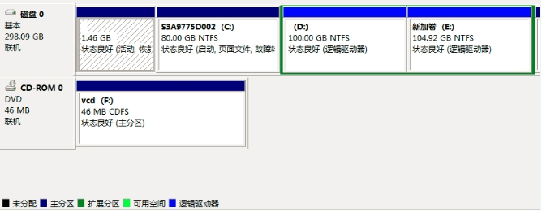 

##### 案例

（1）查看系统分区情况

```bash
[root@hadoop101 /]# fdisk -l
----------------------------
Disk /dev/sda: 21.5 GB, 21474836480 bytes
255 heads, 63 sectors/track, 2610 cylinders
Units = cylinders of 16065 * 512 = 8225280 bytes
Sector size (logical/physical): 512 bytes / 512 bytes
I/O size (minimum/optimal): 512 bytes / 512 bytes
Disk identifier: 0x0005e654
Device Boot      Start         End      Blocks   Id  System
/dev/sda1   *           1          26      204800   83  Linux
Partition 1 does not end on cylinder boundary.
/dev/sda2              26        1332    10485760   83  Linux
/dev/sda3            1332        1593     2097152   82  Linux swap / Solaris
```

#### 9.3 mount/umount 挂载/卸载

​	对于Linux用户来讲，不论有几个分区，分别分给哪一个目录使用，它总归就是一个根目录、一个独立且唯一的文件结构。

​	Linux中每个分区都是用来组成整个文件系统的一部分，它在用一种叫做“挂载”的处理方法，它整个文件系统中包含了一整套的文件和目录，并将一个分区和一个目录联系起来，要载入的那个分区将使它的存储空间在这个目录下获得。

##### 1．挂载前准备（必须要有光盘或者已经连接镜像文件）

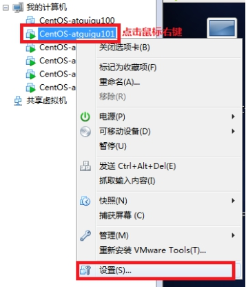 

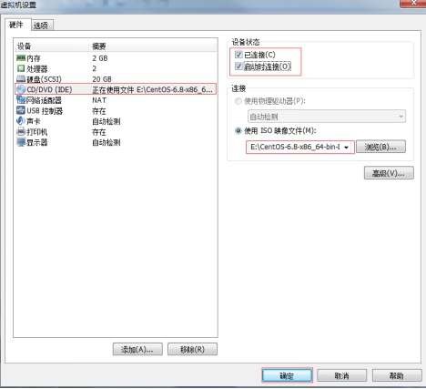 

##### 基本语法

```bash
$ mount [-t vfstype] [-o options] device dir	（功能描述：挂载设备）

$ umount 设备文件名或挂载点			（功能描述：卸载设备）
```

##### 参数说明

| 参数       | 功能                                                         |
| ---------- | ------------------------------------------------------------ |
| -t vfstype | 指定文件系统的类型，通常不必指定。mount 会自动选择正确的类型。常用类型有：光盘或光盘镜像：iso9660DOS fat16文件系统：msdos[Windows](http://blog.csdn.net/hancunai0017/article/details/6995284) 9x fat32文件系统：vfatWindows NT ntfs文件系统：ntfsMount Windows文件[网络](http://blog.csdn.net/hancunai0017/article/details/6995284)共享：smbfs[UNIX](http://blog.csdn.net/hancunai0017/article/details/6995284)(LINUX) 文件网络共享：nfs |
| -o options | 主要用来描述设备或档案的挂接方式。常用的参数有：loop：用来把一个文件当成硬盘分区挂接上系统ro：采用只读方式挂接设备rw：采用读写方式挂接设备　  iocharset：指定访问文件系统所用字符集 |
| device     | 要挂接(mount)的设备                                          |
| dir        | 设备在系统上的挂接点(mount point)                            |

##### 案例

（1）挂载光盘镜像文件

```bash
[root@hadoop101 ~]# mkdir /mnt/cdrom/						建立挂载点
[root@hadoop101 ~]# mount -t iso9660 /dev/cdrom /mnt/cdrom/	设备/dev/cdrom挂载到 挂载点 ：  /mnt/cdrom中
[root@hadoop101 ~]# ll /mnt/cdrom/
```

（2）卸载光盘镜像文件

```bash
[root@hadoop101 ~]# umount /mnt/cdrom
```

5．设置开机自动挂载

```bash
[root@hadoop101 ~]# vi /etc/fstab
```

添加红框中内容，保存退出。

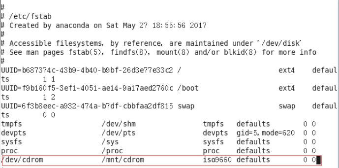 

### 10 进程线程类

进程是正在执行的一个程序或命令，每一个进程都是一个运行的实体，都有自己的地址空间，并占用一定的系统资源。

#### 10.1 ps 查看当前系统进程状态

ps:process status 进程状态

##### 基本语法

```bash
$ ps aux | grep xxx		（功能描述：查看系统中所有进程）
$ ps -ef | grep xxx		（功能描述：可以查看子父进程之间的关系）
```

##### 选项说明

| 选项 | 功能                   |
| ---- | ---------------------- |
| -a   | 选择所有进程           |
| -u   | 显示所有用户的所有进程 |
| -x   | 显示没有终端的进程     |

##### 功能说明

（1）ps aux显示信息说明

​	**USER**：该进程是由哪个用户产生的

​	**PID**：进程的ID号

​	**%CPU**：该进程占用CPU资源的百分比，占用越高，进程越耗费资源；

​	**%MEM**：该进程占用物理内存的百分比，占用越高，进程越耗费资源；

​	**VSZ**：该进程占用虚拟内存的大小，单位KB；

​	**RSS**：该进程占用实际物理内存的大小，单位KB；

​	**TTY**：该进程是在哪个终端中运行的。其中tty1-tty7代表本地控制台终端，tty1-tty6是本地的字符界面终端，

​                   tty7是图形终端。pts/0-255代表虚拟终端。

​	**STAT**：进程状态。常见的状态有：R：运行、S：睡眠、T：停止状态、s：包含子进程、+：位于后台

​	**START**：该进程的启动时间

​	**TIME**：该进程占用CPU的运算时间，注意不是系统时间

​	**COMMAND**：产生此进程的命令名

（2）ps -ef显示信息说明

​	**UID**：用户ID 

​	**PID**：进程ID 

​	**PPID**：父进程ID 

​	**C**：CPU用于计算执行优先级的因子。数值越大，表明进程是CPU密集型运算，执行优先级会降低；数值越        小，表明进程是I/O密集型运算，执行优先级会提高 

​	**STIME**：进程启动的时间 

​	**TTY**：完整的终端名称 

​	**TIME**：CPU时间 

​	**CMD**：启动进程所用的命令和参数

##### 经验技巧

​	如果想查看进程的**CPU占用率和内存占用率**，可以使用aux; 如果想查看**进程的父进程ID**可以使用ef;

##### 案例

```bash
[root@hadoop101 datas]# ps aux
```

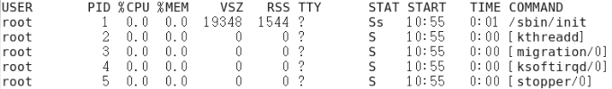 

```bash
[root@hadoop101 datas]# ps -ef
```

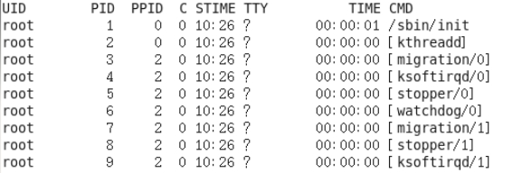 

#### 10.2 kill 终止进程

##### 基本语法

```bash
$ kill  [选项] 进程号		（功能描述：通过进程号杀死进程）
$ killall 进程名称			（功能描述：通过进程名称杀死进程，也支持通配符，这在系统因负载过大而变得很慢时很有用）	
```

##### 选项说明

| 选项 | 功能                 |
| ---- | -------------------- |
| -9   | 表示强迫进程立即停止 |

##### 案例

（1）杀死浏览器进程

```bash
[root@hadoop101 桌面]# kill -9 5102
```

（2）通过进程名称杀死进程

```bash
[root@hadoop101 桌面]# killall firefox
```

#### 10.3 pstree 查看进程树

pstree命令在centos minimal版中要单独安装

```bash
$ yum -y install psmisc 
```


##### 基本语法

```bash
$ pstree [选项]
```

##### 选项说明

| 选项 | 功能               |
| ---- | ------------------ |
| -p   | 显示进程的PID      |
| -u   | 显示进程的所属用户 |

##### 案例

（1）显示进程pid

```bash
[root@hadoop101 datas]# pstree -p
```

（2）显示进程所属用户

```bash
[root@hadoop101 datas]# pstree -u
```

#### 10.4 top 查看系统健康状态

##### 基本语法

```bash
$ top [选项]	
```

##### 选项说明

| 选项    | 功能                                                         |
| ------- | ------------------------------------------------------------ |
| -d 秒数 | 指定top命令每隔几秒更新。默认是3秒在top命令的交互模式当中可以执行的命令： |
| -i      | 使top不显示任何闲置或者僵死进程。                            |
| -p      | 通过指定监控进程ID来仅仅监控某个进程的状态。                 |

##### 操作说明

| 操作 | 功能                          |
| ---- | ----------------------------- |
| P    | 以CPU使用率排序，默认就是此项 |
| M    | 以内存的使用率排序            |
| N    | 以PID排序                     |
| q    | 退出top                       |

##### 查询结果字段解释

第一行信息为任务队列信息

| 内容                             | 说明                                                         |
| -------------------------------- | ------------------------------------------------------------ |
| 12:26:46                         | 系统当前时间                                                 |
| up 1 day, 13:32                  | 系统的运行时间，本机已经运行1天13小时32分钟                  |
| 2 users                          | 当前登录了两个用户                                           |
| load  average:  0.00, 0.00, 0.00 | 系统在之前1分钟，5分钟，15分钟的平均负载。一般认为小于1时，负载较小。如果大于1，系统已经超出负荷。 |

第二行为进程信息

| Tasks:  95 total | 系统中的进程总数                          |
| ---------------- | ----------------------------------------- |
| 1 running        | 正在运行的进程数                          |
| 94 sleeping      | 睡眠的进程                                |
| 0 stopped        | 正在停止的进程                            |
| 0 zombie         | 僵尸进程。如果不是0，需要手工检查僵尸进程 |

第三行为CPU信息

| Cpu(s):  0.1%us | 用户模式占用的CPU百分比                                      |
| --------------- | ------------------------------------------------------------ |
| 0.1%sy          | 系统模式占用的CPU百分比                                      |
| 0.0%ni          | 改变过优先级的用户进程占用的CPU百分比                        |
| 99.7%id         | 空闲CPU的CPU百分比                                           |
| 0.1%wa          | 等待输入/输出的进程的占用CPU百分比                           |
| 0.0%hi          | 硬中断请求服务占用的CPU百分比                                |
| 0.1%si          | 软中断请求服务占用的CPU百分比                                |
| 0.0%st          | st（Steal  time）虚拟时间百分比。就是当有虚拟机时，虚拟CPU等待实际CPU的时间百分比。 |

第四行为物理内存信息

| Mem:    625344k total | 物理内存的总量，单位KB                                       |
| --------------------- | ------------------------------------------------------------ |
| 571504k used          | 已经使用的物理内存数量                                       |
| 53840k free           | 空闲的物理内存数量，我们使用的是虚拟机，总共只分配了628MB内存，所以只有53MB的空闲内存了 |
| 65800k buffers        | 作为缓冲的内存数量                                           |

第五行为交换分区（swap）信息

| Swap:   524280k total | 交换分区（虚拟内存）的总大小 |
| --------------------- | ---------------------------- |
| 0k used               | 已经使用的交互分区的大小     |
| 524280k free          | 空闲交换分区的大小           |
| 409280k cached        | 作为缓存的交互分区的大小     |

##### 案例

```bash
[root@hadoop101 neuedu]# top -d 1
[root@hadoop101 neuedu]# top -i
[root@hadoop101 neuedu]# top -p 2575
```

执行上述命令后，可以按P、M、N对查询出的进程结果进行排序。

#### 10.5 netstat 显示网络统计信息和端口占用情况

##### 基本语法

```bash
$ netstat -anp |grep 进程号	（功能描述：查看该进程网络信息）
$ netstat -nlp	| grep 端口号	（功能描述：查看网络端口号占用情况）
```

##### 选项说明

| 选项 | 功能                                     |
| ---- | ---------------------------------------- |
| -n   | 拒绝显示别名，能显示数字的全部转化成数字 |
| -l   | 仅列出有在listen（监听）的服务状态       |
| -p   | 表示显示哪个进程在调用                   |

##### 案例

（1）通过进程号查看该进程的网络信息

```bash
[root@hadoop101 hadoop-2.7.2]# netstat -anp | grep 火狐浏览器进程号
--------------
unix  2      [ ACC ]     STREAM     LISTENING     **20670**  3115/firefox        /tmp/orbit-root/linc-c2b-0-5734667cbe29
unix  3      [ ]         STREAM     CONNECTED     20673  3115/firefox        /tmp/orbit-root/linc-c2b-0-5734667cbe29
unix  3      [ ]         STREAM     CONNECTED     20668  3115/firefox        
unix  3      [ ]         STREAM     CONNECTED     20666  3115/firefox     
```

（2）查看某端口号是否被占用

```bash
[root@hadoop101 桌面]# netstat -nlp | grep 20670
----------------------------
unix  2      [ ACC ]     STREAM     LISTENING     20670  3115/firefox        /tmp/orbit-root/linc-c2b-0-5734667cbe29
```

### 11 crond 系统定时任务

#### 11.1 crond 服务管理

重新启动crond服务

```bash
[root@hadoop101 ~]# sytemctl restart crond
```

#### 11.2 crontab 定时任务设置

##### 基本语法

```bash
$ crontab [选项]
```

##### 选项说明

| 选项 | 功能                          |
| ---- | ----------------------------- |
| -e   | 编辑crontab定时任务           |
| -l   | 查询crontab任务               |
| -r   | 删除当前用户所有的crontab任务 |

##### 参数说明

```bash
[root@hadoop101 ~]# crontab -e 
```

（1）进入crontab编辑界面。会打开vim编辑你的工作。

\* * * * * 执行的任务

| 项目      | 含义                 | 范围                    |
| --------- | -------------------- | ----------------------- |
| 第一个“*” | 一小时当中的第几分钟 | 0-59                    |
| 第二个“*” | 一天当中的第几小时   | 0-23                    |
| 第三个“*” | 一个月当中的第几天   | 1-31                    |
| 第四个“*” | 一年当中的第几月     | 1-12                    |
| 第五个“*” | 一周当中的星期几     | 0-7（0和7都代表星期日） |

（2）特殊符号

| 特殊符号 | 含义                                                         |
| -------- | ------------------------------------------------------------ |
| *        | 代表任何时间。比如第一个“*”就代表一小时中每分钟都执行一次的意思。 |
| ，       | 代表不连续的时间。比如“0 8,12,16 * * * 命令”，就代表在每天的8点0分，12点0分，16点0分都执行一次命令 |
| -        | 代表连续的时间范围。比如“0 5  *  *  1-6命令”，代表在周一到周六的凌晨5点0分执行命令 |
| */n      | 代表每隔多久执行一次。比如“*/10  *  *  *  *  命令”，代表每隔10分钟就执行一遍命令 |

（3）特定时间执行命令

| 时间              | 含义                                                         |
| ----------------- | ------------------------------------------------------------ |
| 45 22 * * * 命令  | 在22点45分执行命令                                           |
| 0 17 * * 1 命令   | 每周1 的17点0分执行命令                                      |
| 0 5 1,15 * * 命令 | 每月1号和15号的凌晨5点0分执行命令                            |
| 40 4 * * 1-5 命令 | 每周一到周五的凌晨4点40分执行命令                            |
| */10 4 * * * 命令 | 每天的凌晨4点，每隔10分钟执行一次命令                        |
| 0 0 1,15 * 1 命令 | 每月1号和15号，每周1的0点0分都会执行命令。注意：星期几和几号最好不要同时出现，因为他们定义的都是天。非常容易让管理员混乱。 |

案例

（1）每隔1分钟，向/root/bailongma.txt文件中添加一个11的数字

```bash
$ */1 * * * * /bin/echo ”11” >> /root/bailongma.txt
```


## 软件包管理

### 1 RPM

#### 1.1 RPM概述

RPM（RedHat Package Manager），RedHat软件包管理工具，类似windows里面的setup.exe是Linux这系列操作系统里面的打包安装工具，它虽然是RedHat的标志，但理念是通用的。

RPM包的名称格式:

Apache-1.3.23-11.i386.rpm

- “apache” 软件名称

- “1.3.23-11”软件的版本号，主版本和此版本

- “i386”是软件所运行的硬件平台，Intel 32位微处理器的统称

- “rpm”文件扩展名，代表RPM包

#### 1.2 RPM查询命令（rpm -qa）

##### 基本语法

```bash
$ rpm -qa				（功能描述：查询所安装的所有rpm软件包）
```

##### 经验技巧

由于软件包比较多，一般都会采取过滤。**rpm -qa | grep rpm**软件包

##### 案例

（1）查询firefox软件安装情况

```bash
[root@hadoop101 Packages]# rpm -qa |grep firefox 
-------------
firefox-45.0.1-1.el6.centos.x86_64
```

#### 1.3 RPM卸载命令（rpm -e）

##### 基本语法

```bash
 $ rpm -e RPM软件包   

$ rpm -e --nodeps 软件包 
```

##### 选项说明

| 选项     | 功能                                                         |
| -------- | ------------------------------------------------------------ |
| -e       | 卸载软件包                                                   |
| --nodeps | 卸载软件时，不检查依赖。这样的话，那些使用该软件包的软件在此之后可能就不能正常工作了。 |

##### 案例

（1）卸载firefox软件

```bash
[root@hadoop101 Packages]# rpm -e firefox
```

#### 1.4 RPM安装命令（rpm -ivh）

##### 基本语法

```bash
$ rpm -ivh RPM包全名
```

##### 选项说明

| 选项     | 功能                     |
| -------- | ------------------------ |
| -i       | -i=install，安装         |
| -v       | -v=verbose，显示详细信息 |
| -h       | -h=hash，进度条          |
| --nodeps | --nodeps，不检测依赖进度 |

##### 案例

（1）安装firefox软件

```bash
[root@hadoop101 Packages]# pwd
-------------------------------
/media/CentOS_6.8_Final/Packages

[root@hadoop101 Packages]# rpm -ivh firefox-45.0.1-1.el6.centos.x86_64.rpm 
---------------------------------------
warning: firefox-45.0.1-1.el6.centos.x86_64.rpm: Header V3 RSA/SHA1 Signature, key ID c105b9de: NOKEY
Preparing...                ########################################### [100%]
   1:firefox                ########################################### [100%]
```

### 2 YUM仓库配置

#### 2.1 YUM概述

YUM（全称为 Yellow dog Updater, Modified）是一个在Fedora和RedHat以及CentOS中的Shell前端软件包管理器。基于RPM包管理，能够从指定的服务器自动下载RPM包并且安装，可以自动处理依赖性关系，并且一次安装所有依赖的软件包，无须繁琐地一次次下载、安装，

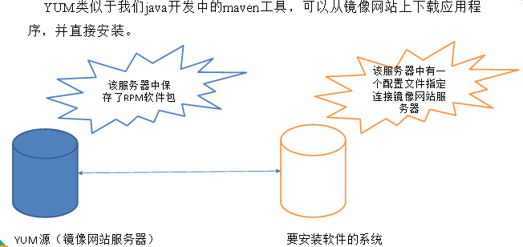

#### 2.2 YUM的常用命令

##### 基本语法

```bash
$ yum [选项] [参数]
```

##### 选项说明

| 选项 | 功能                  |
| ---- | --------------------- |
| -y   | 对所有提问都回答“yes” |

##### 参数说明

| 参数         | 功能                          |
| ------------ | ----------------------------- |
| install      | 安装rpm软件包                 |
| update       | 更新rpm软件包                 |
| check-update | 检查是否有可用的更新rpm软件包 |
| remove       | 删除指定的rpm软件包           |
| list         | 显示软件包信息                |
| clean        | 清理yum过期的缓存             |
| deplist      | 显示yum软件包的所有依赖关系   |

##### 案例实操

（1）采用yum方式安装firefox

```bash
[root@hadoop101 ~]#yum -y install firefox.x86_64
```

#### 2.3 修改网络YUM源

默认的系统YUM源，需要连接国外apache网站，网速比较慢，可以修改关联的网络YUM源为国内镜像的网站，比如网易163。

1．前期文件准备

（1）前提条件linux系统必须可以联网

（2）在Linux环境中访问该网络地址：<http://mirrors.163.com/.help/centos.html>，在使用说明中点击CentOS6->再点击保存，

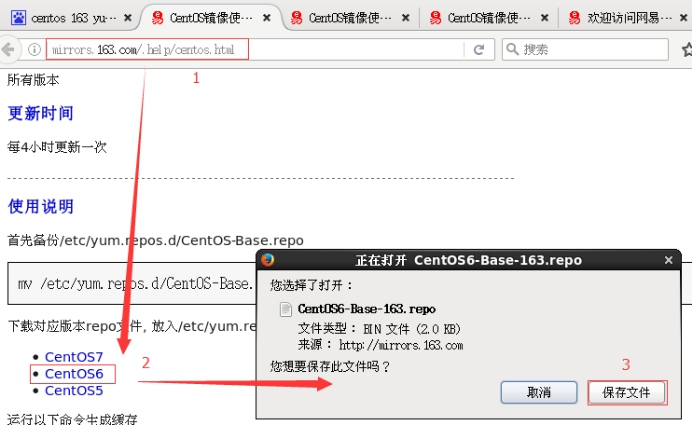 

（3）查看文件保存的位置，

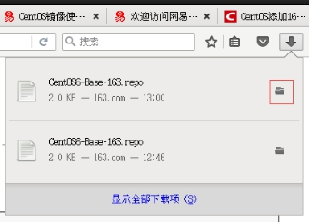 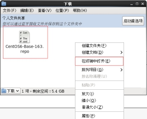

在打开的终端中输入如下命令，就可以找到文件的保存位置。

```bash
[neuedu@hadoop101 下载]$ pwd
-----------------
/home/neuedu/下载
```

2．替换本地yum文件

（1）把下载的文件移动到/etc/yum.repos.d/目录

```bash
[root@hadoop101 下载]# mv CentOS6-Base-163.repo /etc/yum.repos.d/	
```

（2）进入到/etc/yum.repos.d/目录

```bash
[root@hadoop101 yum.repos.d]# pwd
--------------------------
/etc/yum.repos.d
```

（3）用CentOS6-Base-163.repo替换CentOS-Base.repo

```bash
[root@hadoop101 yum.repos.d]# mv CentOS6-Base-163.repo  CentOS-Base.repo
```

3．安装命令

```bash
[root@hadoop101 yum.repos.d]#yum clean all
[root@hadoop101 yum.repos.d]#yum makecache
```

>  yum makecache就是把服务器的包信息下载到本地电脑缓存起来

4．测试

```bash
[root@hadoop101 yum.repos.d]#yum list | grep firefox
[root@hadoop101 ~]#yum -y install firefox.x86_64
```

