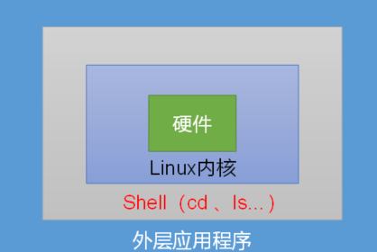

# Shell 编程

​	Shell 是一个用 C 语言编写的程序，它是用户使用 Linux 的桥梁。Shell 既是一种命令语言，又是一种程序设计语言。Shell 是指一种应用程序，这个应用程序提供了一个界面，用户通过这个界面访问操作系统内核的服务。Ken Thompson 的 sh 是第一种 Unix Shell，Windows Explorer 是一个典型的图形界面 Shell。



## Shell 脚本

​	Shell 脚本（shell script），是一种为 shell 编写的脚本程序。

业界所说的 shell 通常都是指 shell 脚本，但读者朋友要知道，shell 和 shell script 是两个不同的概念。

由于习惯的原因，简洁起见，"shell编程" 都是指 shell 脚本编程，不是指开发 shell 自身。

**我们要学的实际上是shell脚本编程。**

## Shell解析器

linux系统支持多种shell解析器，在终端输入

```bash
$ cat /etc/shells
---------------------
/bin/sh
/bin/bash
/usr/bin/sh
/usr/bin/bash
```

>shell历史介绍：https://www.csdn.net/article/2011-12-22/309551

**sh: **  1977年，Stephen Bourne在贝尔实验室为V7 UNIX开发了Bourne Shell，并一直沿用至今。很多情况下，它甚至是默认的Shell。Bourne Shell是用C语言开发的，但相比其他Shell，其语法更类似于算法语言（ALGOL）。

**bash:**  Bourne-Again Shell，即bash，是一个开源的GNU项目，旨在替换Bourne Shell。除了支持脚本的向后兼容性，bash还吸收了Korn Shell和C Shell的一些特性。例如，命令历史记录，命令行编辑，目录堆栈，很多实用的环境变量，命令行自动完成，等等。Bash继续发展了一些新的特性，如支持正则表达式和关联数组。

### bash和sh的关系

在当今的linux系统中sh实际上已经不存在了，它其实是sh的软连接

```bash
$ cd /bin
$ ll | grep bash
-----------------
...
lrwxrwxrwx. 1 root root         4 Feb 15 23:57 sh -> bash
```

### 查看当前系统shell

通过环境变量查看当前系统使用的默认shell，

```bash
$ echo $SHEll
----------------------
/bin/bash

$ printenv | grep SHELL
---------------
SHELL=/bin/bash
```

## shell入门

通过vim编辑器编辑如下内容，

```bash
vim hello.sh
------------
#!/bin/bash
echo "hello shell!!"
```

通过解释器运行脚本

```bash
bash hello.sh
--------------
hello shell
```

## 运行shell的三种方式

### **1、作为可执行程序**

将上面的代码保存为 test.sh，并 cd 到相应目录：

```bash
chmod +x ./hello.sh  #使脚本具有执行权限
./hello.sh  #执行脚本
```

要想让一个文件可以执行，必须设置其可执行权限，否则谁都执行不了

注意，一定要写成 **./hello.sh**，而不是 **hello.sh**，运行其它二进制的程序也一样，直接写 test.sh，linux 系统会去 PATH 里寻找有没有叫 hello.sh 的，而只有 /bin, /sbin, /usr/bin，/usr/sbin 等在 PATH 里，你的当前目录通常不在 PATH 里，所以写成 test.sh 是会找不到命令的，要用 ./test.sh 告诉系统说，就在当前目录找。

### **2、作为解释器参数**

这种运行方式是，直接运行解释器，其参数就是 shell 脚本的文件名，如：

```bash
$ sh hello.sh
$ bash hello.sh
```

> 试着将#!/bin/bash 改成#!/bin/baaaaaaaaaa
>
> 再次用两种方式运行脚本，看看区别
>
> 你会发现实际上这一行对于解释器来运行它就是注释，但是对于可执行文件运行，它规定了解释器

### 3、通过source（点命令执行）

``` bash
$ source filename
$ . filename
```

> 第三种与前两种的区别在于，第三种并没有创建当前进程的子进程，而是直接用当前进程执行脚本

## 多命令处理

> shell脚本最重要的好处就是它可以按照一段预先定义好的指令来执行动态且复杂的逻辑，这就是脚本的意义，我们所熟知的javascript和python都是脚本类型语言，某种意义上说，shell也是门编程语言。

编写一下脚本

```bash
vim createFile.sh
```

```shell
#!/bin/bash
cd ~
mkdir a
cd a
touch b
echo "hello world " >> b
```

## Shell中的变量

shell 中的变量只能为字符串型

### 命名变量

定义变量时，变量名不加美元符号$，如：

```bash
your_name="neuedu.com"
```

注意，变量名和等号之间不能有空格，这可能和你熟悉的所有编程语言都不一样。同时，变量名的命名须遵循如下规则：

- 命名只能使用英文字母，数字和下划线，首个字符不能以数字开头。
- 中间不能有空格，可以使用下划线（_）。
- 不能使用标点符号。
- 不能使用bash里的关键字（可用help命令查看保留关键字）。

例如：

```bash
# 合法的变量名
neuedu
LD_LIBRARY_PATH
_var
var2
# 非法的变量名
?var=123
user*name=neuedu
```

### 使用变量

使用一个定义过的变量，只要在变量名前面加美元符号即可，如：

```bash
your_name="qinjx"
echo $your_name
echo ${your_name} #可选花括号，如果需要确定变量名边界，就用花括号
```

### 只读变量

使用 readonly 命令可以将变量定义为只读变量，只读变量的值不能被改变,只读变量不能被删除。

下面的例子尝试更改只读变量，结果报错：

```bash
readonly myUrl="http://www.google.com"
myUrl="http://www.neuedu.com"
------------------
-bash: myUrl: readonly variable
```

### 删除变量

使用 unset 命令可以删除变量。语法：

```bash
unset variable_name
```

变量被删除后不能再次使用。unset 命令不能删除只读变量。

**案例**

```bash
#!/bin/sh
myUrl="http://www.neuedu.com"
unset myUrl
echo $myUrl
```

以上实例执行将没有任何输出。

### 变量类型

- Shell 变量的作用域可以分为三种：
  - 有的变量只能在函数内部使用，这叫做局部变量（local variable）；
  - 有的变量可以在当前 Shell 进程中使用，这叫做全局变量（global variable）；
  - 而有的变量还可以在子进程中使用，这叫做环境变量（environment variable）。

所谓全局变量，就是指变量在当前的整个 Shell 进程中都有效。每个 Shell 进程都有自己的作用域，彼此之间互不影响。在 Shell 中定义的变量，**默认就是全局变量。**

#### Shell 局部变量

Shell 也支持自定义函数，但是 Shell 函数和 C++JavaC#等其他编程语言函数的一个不同点就是：在 Shell 函数中定义的变量默认也是全局变量，它和在函数外部定义变量拥有一样的效果。请看下面的代码：

```bash
#!/bin/bash#定义函数function func(){    a=99}#调用函数func#输出函数内部的变量echo $a
```

输出结果：99

a 是在函数内部定义的，但是在函数外部也可以得到它的值，证明它的作用域是全局的，而不是仅限于函数内部。

要想变量的作用域仅限于函数内部，可以在定义时加上

```bash
local
```

命令，此时该变量就成了局部变量。请看下面的代码：

```bash
#!/bin/bash
#定义函数
function func(){ 
local a=99
}
#调用函数
func
#输出函数内部的变量
echo $a
```

输出结果为空，表明变量 a 在函数外部无效，是一个局部变量。

Shell 变量的这个特性和 JavaScript中的变量是类似的。在 JavaScript 函数内部定义的变量，默认也是全局变量，只有加上```var```关键字，它才会变成局部变量。

#### Shell 全局变量

所谓全局变量，就是指变量在当前的整个 Shell 进程中都有效。每个 Shell 进程都有自己的作用域，彼此之间互不影响。在 Shell 中定义的变量，默认就是全局变量。

想要实际演示全局变量在不同 Shell 进程中的互不相关性，可在图形界面下同时打开两个 Shell，或使用两个终端远程连接到服务器（SSH）。

首先打开一个 Shell 窗口，定义一个变量 a 并赋值为 99，然后打印，这时在同一个 Shell 窗口中是可正确打印变量 a 的值的。然后再打开一个新的 Shell 窗口，同样打印变量 a 的值，但结果却为空，如图 1 所示。


图1：打开两个 Shell 窗口

这说明全局变量 a 仅仅在定义它的第一个 Shell 进程中有效，对新的 Shell 进程没有影响。这很好理解，就像小王家和小徐家都有一部电视机（变量名相同），但是同一时刻小王家和小徐家的电视中播放的节目可以是不同的（变量值不同）。

需要强调的是，全局变量的作用范围是当前的 Shell 进程，而不是当前的 

Shell 脚本

文件，它们是不同的概念。打开一个 Shell 窗口就创建了一个 Shell 进程，打开多个 Shell 窗口就创建了多个 Shell 进程，每个 Shell 进程都是独立的，拥有不同的进程 ID。在一个 Shell 进程中可以使用 source 命令执行多个 Shell 脚本文件，此时全局变量在这些脚本文件中都有效。

例如，现在有两个 Shell 脚本文件，分别是 a.sh 和 b.sh。a.sh 的代码如下：

```bash
#!/bin/bash
echo $a
b=200
```

b.sh 的代码如下：

```bash
#!/bin/bash
echo $b
```

打开一个 Shell 窗口，输入以下命令：

```bash
[c.biancheng.net]$ a=99
[c.biancheng.net]$ . ./a.sh
99
[c.biancheng.net]$ . ./b.sh
200
```

这三条命令都是在一个进程中执行的，从输出结果可以发现，在 Shell 窗口中以命令行的形式定义的变量 a，在 a.sh 中有效；在 a.sh 中定义的变量 b，在 b.sh 中也有效，变量 b 的作用范围已经超越了 a.sh。

注意，必须在当前进程中运行 Shell 脚本，不能在新进程中运行 Shell 脚本

#### Shell 环境变量

全局变量只在当前 Shell 进程中有效，对其它 Shell 进程和子进程都无效。如果使用```export```命令将全局变量导出，那么它就在所有的子进程中也有效了，这称为“环境变量”。

环境变量被创建时所处的 Shell 进程称为父进程，如果在父进程中再创建一个新的进程来执行 Shell 命令，那么这个新的进程被称作 Shell 子进程。当 Shell 子进程产生时，它会继承父进程的环境变量为自己所用，所以说环境变量可从父进程传给子进程。不难理解，环境变量还可以传递给孙进程。

注意，两个没有父子关系的 Shell 进程是不能传递环境变量的，并且环境变量只能向下传递而不能向上传递，即“传子不传父”。

创建 Shell 子进程最简单的方式是运行 bash 命令


通过```exit```命令可以一层一层地退出 Shell。

下面演示一下环境变量的使用：

```bash
[c.biancheng.net]$ a=22       #定义一个全局变量
[c.biancheng.net]$ echo $a    #在当前Shell中输出a，成功
22
[c.biancheng.net]$ bash       #进入Shell子进程
[c.biancheng.net]$ echo $a    #在子进程中输出a，失败

[c.biancheng.net]$ exit       #退出Shell子进程，返回上一级Shell
exit
[c.biancheng.net]$ export a   #将a导出为环境变量
[c.biancheng.net]$ bash       #重新进入Shell子进程
[c.biancheng.net]$ echo $a    #在子进程中再次输出a，成功
22
[c.biancheng.net]$ exit       #退出Shell子进程
exit
[c.biancheng.net]$ exit       #退出父进程，结束整个Shell会话
```

可以发现，默认情况下，a 在 Shell 子进程中是无效的；使用 export 将 a 导出为环境变量后，在子进程中就可以使用了。

```
export a
```

这种形式是在定义变量 a 以后再将它导出为环境变量，如果想在定义的同时导出为环境变量，可以写作```export a=22```。

我们一直强调的是环境变量在 Shell 子进程中有效，并没有说它在所有的 Shell 进程中都有效；如果你通过终端创建了一个新的 Shell 窗口，那它就不是当前 Shell 的子进程，环境变量对这个新的 Shell 进程仍然是无效的。请看下图：


第一个窗口中的环境变量 a 在第二个窗口中就无效。

##### 环境变量也是临时的

通过 export 导出的环境变量只对当前 Shell 进程以及所有的子进程有效，如果最顶层的父进程被关闭了，那么环境变量也就随之消失了，其它的进程也就无法使用了，所以说环境变量也是临时的。

有人可能会问，如果我想让一个变量在所有 Shell 进程中都有效，不管它们之间是否存在父子关系，该怎么办呢？

**只有将变量写入 Shell 配置文件中才能达到这个目的**！Shell 进程每次启动时都会执行配置文件中的代码做一些初始化工作，如果将变量放在配置文件中，那么每次启动进程都会定义这个变量  

#### 全局环境变量配置

 	无论是否是交互式，是否是登录式，Bash [Shell](http://c.biancheng.net/shell/) 在启动时总要配置其运行环境，例如初始化环境变量、设置命令提示符、指定系统命令路径等。这个过程是通过加载一系列配置文件完成的，这些配置文件其实就是 [Shell 脚本](http://c.biancheng.net/shell/)文件。

​	与 Bash Shell 有关的配置文件主要有 ```/etc/profile```、```~/.bash_profile```、```~/.bash_login```、```~/.profile```、```~/.bashrc```、```/etc/bashrc```、```/etc/profile.d/*.sh```，不同的启动方式会加载不同的配置文件。  

  	Bash 官方文档说：如果是登录式的 Shell，首先会读取和执行 /etc/profiles，这是所有用户的全局配置文件，接着会到用户主目录中寻找 ~/.bash_profile、~/.bash_login 或者 ~/.profile，它们都是用户个人的配置文件。

不同的 [Linux](http://c.biancheng.net/linux_tutorial/) 发行版附带的个人配置文件也不同，有的可能只有其中一个，有的可能三者都有，笔者使用的是 CentOS 7，该发行版只有 ~/.bash_profile，其它两个都没有。

​	如果三个文件同时存在的话，到底应该加载哪一个呢？它们的优先级顺序是 ~/.bash_profile > ~/.bash_login > ~/.profile。如果 ~/.bash_profile 存在，那么一切以该文件为准，并且到此结束，不再加载其它的配置文件。如果 ~/.bash_profile 不存在，那么尝试加载 ~/.bash_login。~/.bash_login 存在的话就到此结束，不存在的话就加载 ~/.profile。  

> 注意，/etc/profiles 文件还会嵌套加载 /etc/profile.d/*.sh，请看下面的代码：

```bash
for i in /etc/profile.d/*.sh ; do
    if [ -r "$i" ]; then
        if [ "${-#*i}" != "$-" ]; then
            . "$i"
        else
            . "$i" >/dev/null
        fi
    fi
done
```

同样，~/.bash_profile 也使用类似的方式加载 ~/.bashrc：

```bash
if [ -f ~/.bashrc ]; then
. ~/.bashrc
fi
```

### 特殊变量

#### $n

**基本语法**

```bash
$n	（功能描述：n为数字，$0代表该脚本名称，$1-$9代表第一到第九个参数，十以上的参数，十以上的参数需要用大括号包含，如${10}）
```

**案例**

（1）输出该脚本文件名称、输入参数1和输入参数2 的值

```bash
[neuedu@hadoop101 datas]$ touch parameter.sh 
[neuedu@hadoop101 datas]$ vim parameter.sh
```

```shell
#!/bin/bash
echo "$0  $1   $2"
```

```bash
[neuedu@hadoop101 datas]$ chmod 777 parameter.sh
[neuedu@hadoop101 datas]$ ./parameter.sh cls  xz
./parameter.sh  cls   xz
```

#### $#

**基本语法**

```bash
$#	（功能描述：获取所有输入参数个数，常用于循环）。
```

**案例**

（1）获取输入参数的个数

```bash
$ vim parameter.sh
```

```shell
#!/bin/bash

echo "$0  $1   $2"

echo $#
```

```bash
$ chmod 777 parameter.sh
$ ./parameter.sh cls  xz
parameter.sh cls xz 
```

#### $\*、$@

**基本语法**

```bash
$*	（功能描述：这个变量代表命令行中所有的参数，$*把所有的参数看成一个整体）
$@	（功能描述：这个变量也代表命令行中所有的参数，不过$@把每个参数区分对待）
```

> $* 和 $@ 的区别
> 　　$* 和 $@ 都表示传递给函数或脚本的所有参数，不被双引号" “包含时，都以”$1" “$2"…"$n” 的形式输出所有参数，被双引号" “包含时，”$*" 会将所有的参数作为一个整体；"@" 会将各个参数分开，以换行形式输出所有参数。

**案例**

（1）打印输入的所有参数

```bash
[neuedu@hadoop101 datas]$ vim parameter.sh
```

```shell
#!/bin/bash
echo "$0  $1   $2"
echo $#
echo $*
echo $@
```

```bash
[neuedu@hadoop101 datas]$ bash parameter.sh 1 2 3
parameter.sh  1   2
3
1 2 3
1 2 3
```

#### $?

**基本语法**

```bash
$？	（功能描述：最后一次执行的命令的返回状态。如果这个变量的值为0，证明上一个命令正确执行；如果这个变量的值为非0（具体是哪个数，由命令自己来决定），则证明上一个命令执行不正确了。）
```

**案例**

（1）判断helloworld.sh脚本是否正确执行

```bash
$ ./helloworld.sh 
---------
hello world

$ echo $?
-----------------------
0

$ vim test.sh
------------
....
echo $[1/0]
--------
$ ./tesh.sh
$ echo $?
-------
1  #代表错误
```

## Shell 字符串

字符串是shell编程中最常用最有用的数据类型（除了数字和字符串，也没啥其它类型好用了），字符串可以用单引号，也可以用双引号，也可以不用引号。单双引号的区别跟PHP类似。

### 单引号

```bash
str='this is a string'
```

单引号字符串的限制：

- 单引号里的任何字符都会原样输出，单引号字符串中的变量是无效的；
- 单引号字串中不能出现单独一个的单引号（对单引号使用转义符后也不行），但可成对出现，作为字符串拼接使用。

### 双引号

```bash
your_name='neuedu'
str="Hello, I know you are \"$your_name\"! \n"
echo -e $str
```

输出结果为：

```bash
Hello, I know you are "neuedu"! 
```

双引号的优点：

- 双引号里可以有变量
- 双引号里可以出现转义字符

### 拼接字符串

```bash
your_name="neuedu"
# 使用双引号拼接
greeting="hello, "$your_name" !"
greeting_1="hello, ${your_name} !"
echo $greeting  $greeting_1
# 使用单引号拼接
greeting_2='hello, '$your_name' !'
greeting_3='hello, ${your_name} !'
echo $greeting_2  $greeting_3
```

输出结果为：

```bash
hello, neuedu ! hello, neuedu !
hello, neuedu ! hello, ${your_name} !
```

### 获取字符串长度

```bash
string="abcd"
echo ${#string} #输出 4
```

### 提取子字符串

以下实例从字符串第 **2** 个字符开始截取 **4** 个字符：

```bash
string="neuedu is a great site"
echo ${string:1:4} # 输出 unoo
```

**注意**：第一个字符的索引值为 **0**。

### 查找子字符串

查找字符 **i** 或 **o** 的位置(哪个字母先出现就计算哪个)：

```bash
string="neuedu is a great site"
echo `expr index "$string" io`  # 输出 4
```

**注意：** 以上脚本中 **`** 是反引号，而不是单引号 **'**，不要看错了哦。


## Shell 数组

数组中可以存放多个值。Bash Shell 只支持一维数组（不支持多维数组），初始化时不需要定义数组大小（与 PHP 类似）。

与大部分编程语言类似，数组元素的下标由0开始。

Shell 数组用括号来表示，元素用"空格"符号分割开，语法格式如下：

```bash
array_name=(value1 ... valuen)
```

### 实例

```bash
#!/bin/bash
# author:neuedu
# url:www.neuedu.com

my_array=(A B "C" D)
```

我们也可以使用下标来定义数组:

```bash
array_name[0]=value0
array_name[1]=value1
array_name[2]=value2
```

### 读取数组

读取数组元素值的一般格式是：

```bash
${array_name[index]}
```

### 实例

```bash
#!/bin/bash
# author:neuedu
# url:www.neuedu.com

my_array=(A B "C" D)

echo "第一个元素为: ${my_array[0]}"
echo "第二个元素为: ${my_array[1]}"
echo "第三个元素为: ${my_array[2]}"
echo "第四个元素为: ${my_array[3]}"
```

执行脚本，输出结果如下所示：

```bash
$ chmod +x test.sh 
$ ./test.sh
第一个元素为: A
第二个元素为: B
第三个元素为: C
第四个元素为: D
```

### 获取数组中的所有元素

使用@ 或 * 可以获取数组中的所有元素，例如：

```bash
#!/bin/bash
# author:neuedu
# url:www.neuedu.com

my_array[0]=A
my_array[1]=B
my_array[2]=C
my_array[3]=D

echo "数组的元素为: ${my_array[*]}"
echo "数组的元素为: ${my_array[@]}"
```

执行脚本，输出结果如下所示：

```bash
$ chmod +x test.sh 
$ ./test.sh
数组的元素为: A B C D
数组的元素为: A B C D
```

### 获取数组的长度

获取数组长度的方法与获取字符串长度的方法相同，例如：

```bash
#!/bin/bash
# author:neuedu
# url:www.neuedu.com

my_array[0]=A
my_array[1]=B
my_array[2]=C
my_array[3]=D

echo "数组元素个数为: ${#my_array[*]}"
echo "数组元素个数为: ${#my_array[@]}"
```

执行脚本，输出结果如下所示：

```bash
$ chmod +x test.sh 
$ ./test.sh
数组元素个数为: 4
数组元素个数为: 4
```

## Shell 注释

以 **#** 开头的行就是注释，会被解释器忽略。

通过每一行加一个 **#** 号设置多行注释，像这样：

```bash
#--------------------------------------------
# 这是一个注释
# author：neuedu
# site：www.neuedu.com
# slogan：学的不仅是技术，更是梦想！
#--------------------------------------------
##### 用户配置区 开始 #####
#
#
# 这里可以添加脚本描述信息
# 
#
##### 用户配置区 结束  #####
```

如果在开发过程中，遇到大段的代码需要临时注释起来，过一会儿又取消注释，怎么办呢？

每一行加个#符号太费力了，可以把这一段要注释的代码用一对花括号括起来，定义成一个函数，没有地方调用这个函数，这块代码就不会执行，达到了和注释一样的效果。

### 多行注释

多行注释还可以使用以下格式：

```bash
:<<EOF
注释内容...
注释内容...
注释内容...
EOF
```

EOF 也可以使用其他符号:

```bash
:<<'
注释内容...
注释内容...
注释内容...
'

:<<!
注释内容...
注释内容...
注释内容...
!
```

## 运算符

Shell 和其他编程语言一样，支持多种运算符，包括：

- 算数运算符
- 关系运算符
- 布尔运算符
- 字符串运算符
- 文件测试运算符

原生bash不支持简单的数学运算，但是可以通过其他命令来实现，例如 awk 和 expr，expr 最常用。

expr 是一款表达式计算工具，使用它能完成表达式的求值操作。

例如，两个数相加(**注意使用的是反引号 ` 而不是单引号 '**)：

```bash
#!/bin/bash

val=`expr 2 + 2`
echo "两数之和为 : $val"
```

使用命令毕竟比较麻烦，因为参数之间要用空格隔开，也就是‘2’ ‘+’ ‘2’ 这每一个数字和运算符都是参数，

所以建议大家使用**“$((运算式))”或“$[运算式]”**

### 案例

（1）计算3+2的值

```bash
$ expr 2 + 3
-----
5
```

（2）计算（2+3）X4的值

（a）expr一步完成计算

```bash
$ expr `expr 2 + 3` \* 4
----
20
```

（b）采用$[运算式]方式

```bash
$ S=$[(2+3)*4]
$ echo $S

$ S=$(((2+3)*4))
$ echo $S
```

### 算术运算符

下表列出了常用的算术运算符，假定变量 a 为 10，变量 b 为 20：

| 运算符 | 说明                                          | 举例                          |
| :----- | :-------------------------------------------- | :---------------------------- |
| +      | 加法                                          | `expr $a + $b` 结果为 30。    |
| -      | 减法                                          | `expr $a - $b` 结果为 -10。   |
| *      | 乘法                                          | `expr $a \* $b` 结果为  200。 |
| /      | 除法                                          | `expr $b / $a` 结果为 2。     |
| %      | 取余                                          | `expr $b % $a` 结果为 0。     |
| =      | 赋值                                          | a=$b 将把变量 b 的值赋给 a。  |
| ==     | 相等。用于比较两个数字，相同则返回 true。     | [ $a == $b ] 返回 false。     |
| !=     | 不相等。用于比较两个数字，不相同则返回 true。 | [ $a != $b ] 返回 true。      |

**注意：**条件表达式要放在方括号之间，并且要有空格，例如: **[$a==$b]** 是错误的，必须写成 **[ $a == $b ]**。

#### 实例

算术运算符实例如下

```bash
#!/bin/bash
# author:neuedu
# url:www.neuedu.com

a=10
b=20

val=`expr $a + $b`
echo "a + b : $val"

val=`expr $a - $b`
echo "a - b : $val"

val=`expr $a \* $b`
echo "a * b : $val"

val=`expr $b / $a`
echo "b / a : $val"

val=`expr $b % $a`
echo "b % a : $val"

if [ $a == $b ]
then
   echo "a 等于 b"
fi
if [ $a != $b ]
then
   echo "a 不等于 b"
fi
```

### 关系运算符

关系运算符只支持数字，不支持字符串，除非字符串的值是数字。

下表列出了常用的关系运算符，假定变量 a 为 10，变量 b 为 20：

| 运算符 | 说明                                                  | 举例                       |
| :----- | :---------------------------------------------------- | :------------------------- |
| -eq    | 检测两个数是否相等，相等返回 true。                   | [ $a -eq $b ] 返回 false。 |
| -ne    | 检测两个数是否不相等，不相等返回 true。               | [ $a -ne $b ] 返回 true。  |
| -gt    | 检测左边的数是否大于右边的，如果是，则返回 true。     | [ $a -gt $b ] 返回 false。 |
| -lt    | 检测左边的数是否小于右边的，如果是，则返回 true。     | [ $a -lt $b ] 返回 true。  |
| -ge    | 检测左边的数是否大于等于右边的，如果是，则返回 true。 | [ $a -ge $b ] 返回 false。 |
| -le    | 检测左边的数是否小于等于右边的，如果是，则返回 true。 | [ $a -le $b ] 返回 true。  |

#### 实例

关系运算符实例如下：

```bash
#!/bin/bash
# author:neuedu
# url:www.neuedu.com

a=10
b=20

if [ $a -eq $b ]
then
   echo "$a -eq $b : a 等于 b"
else
   echo "$a -eq $b: a 不等于 b"
fi
if [ $a -ne $b ]
then
   echo "$a -ne $b: a 不等于 b"
else
   echo "$a -ne $b : a 等于 b"
fi
if [ $a -gt $b ]
then
   echo "$a -gt $b: a 大于 b"
else
   echo "$a -gt $b: a 不大于 b"
fi
if [ $a -lt $b ]
then
   echo "$a -lt $b: a 小于 b"
else
   echo "$a -lt $b: a 不小于 b"
fi
if [ $a -ge $b ]
then
   echo "$a -ge $b: a 大于或等于 b"
else
   echo "$a -ge $b: a 小于 b"
fi
if [ $a -le $b ]
then
   echo "$a -le $b: a 小于或等于 b"
else
   echo "$a -le $b: a 大于 b"
fi
```

执行脚本，输出结果如下所示：

```bash
10 -eq 20: a 不等于 b
10 -ne 20: a 不等于 b
10 -gt 20: a 不大于 b
10 -lt 20: a 小于 b
10 -ge 20: a 小于 b
10 -le 20: a 小于或等于 b
```

### 布尔运算符

下表列出了常用的布尔运算符，假定变量 a 为 10，变量 b 为 20：

| 运算符 | 说明                                                | 举例                                     |
| :----- | :-------------------------------------------------- | :--------------------------------------- |
| !      | 非运算，表达式为 true 则返回 false，否则返回 true。 | [ ! false ] 返回 true。                  |
| -o     | 或运算，有一个表达式为 true 则返回 true。           | [ $a -lt 20 -o $b -gt 100 ] 返回 true。  |
| -a     | 与运算，两个表达式都为 true 才返回 true。           | [ $a -lt 20 -a $b -gt 100 ] 返回 false。 |

#### 实例

布尔运算符实例如下：

```bash
#!/bin/bash
# author:neuedu
# url:www.neuedu.com

a=10
b=20

if [ $a != $b ]
then
   echo "$a != $b : a 不等于 b"
else
   echo "$a == $b: a 等于 b"
fi
if [ $a -lt 100 -a $b -gt 15 ]
then
   echo "$a 小于 100 且 $b 大于 15 : 返回 true"
else
   echo "$a 小于 100 且 $b 大于 15 : 返回 false"
fi
if [ $a -lt 100 -o $b -gt 100 ]
then
   echo "$a 小于 100 或 $b 大于 100 : 返回 true"
else
   echo "$a 小于 100 或 $b 大于 100 : 返回 false"
fi
if [ $a -lt 5 -o $b -gt 100 ]
then
   echo "$a 小于 5 或 $b 大于 100 : 返回 true"
else
   echo "$a 小于 5 或 $b 大于 100 : 返回 false"
fi
```

执行脚本，输出结果如下所示：

```bash
10 != 20 : a 不等于 b
10 小于 100 且 20 大于 15 : 返回 true
10 小于 100 或 20 大于 100 : 返回 true
10 小于 5 或 20 大于 100 : 返回 false
```

### 逻辑运算符

以下介绍 Shell 的逻辑运算符，假定变量 a 为 10，变量 b 为 20:

| 运算符 | 说明       | 举例                                       |
| :----- | :--------- | :----------------------------------------- |
| &&     | 逻辑的 AND | [[ $a -lt 100 && $b -gt 100 ]] 返回 false  |
| \|\|   | 逻辑的 OR  | [[ $a -lt 100 \|\| $b -gt 100 ]] 返回 true |

#### 实例

逻辑运算符实例如下：

```bash
#!/bin/bash
# author:neuedu
# url:www.neuedu.com

a=10
b=20

if [[ $a -lt 100 && $b -gt 100 ]]
then
   echo "返回 true"
else
   echo "返回 false"
fi

if [[ $a -lt 100 || $b -gt 100 ]]
then
   echo "返回 true"
else
   echo "返回 false"
fi
```

执行脚本，输出结果如下所示：

```bash
返回 false
返回 true
```

### 字符串运算符

下表列出了常用的字符串运算符，假定变量 a 为 "abc"，变量 b 为 "efg"：

| 运算符 | 说明                                      | 举例                     |
| :----- | :---------------------------------------- | :----------------------- |
| =      | 检测两个字符串是否相等，相等返回 true。   | [ $a = $b ] 返回 false。 |
| !=     | 检测两个字符串是否相等，不相等返回 true。 | [ $a != $b ] 返回 true。 |
| -z     | 检测字符串长度是否为0，为0返回 true。     | [ -z $a ] 返回 false。   |
| -n     | 检测字符串长度是否为0，不为0返回 true。   | [ -n "$a" ] 返回 true。  |
| $      | 检测字符串是否为空，不为空返回 true。     | [ $a ] 返回 true。       |

#### 实例

字符串运算符实例如下：

```bash
#!/bin/bash
# author:neuedu
# url:www.neuedu.com

a="abc"
b="efg"

if [ $a = $b ]
then
   echo "$a = $b : a 等于 b"
else
   echo "$a = $b: a 不等于 b"
fi
if [ $a != $b ]
then
   echo "$a != $b : a 不等于 b"
else
   echo "$a != $b: a 等于 b"
fi
if [ -z $a ]
then
   echo "-z $a : 字符串长度为 0"
else
   echo "-z $a : 字符串长度不为 0"
fi
if [ -n "$a" ]
then
   echo "-n $a : 字符串长度不为 0"
else
   echo "-n $a : 字符串长度为 0"
fi
if [ $a ]
then
   echo "$a : 字符串不为空"
else
   echo "$a : 字符串为空"
fi
```

执行脚本，输出结果如下所示：

```bash
abc = efg: a 不等于 b
abc != efg : a 不等于 b
-z abc : 字符串长度不为 0
-n abc : 字符串长度不为 0
abc : 字符串不为空
```


### 文件测试运算符

文件测试运算符用于检测 Unix 文件的各种属性。

属性检测描述如下：

| 操作符  | 说明                                                         | 举例                      |
| :------ | :----------------------------------------------------------- | :------------------------ |
| -b file | 检测文件是否是块设备文件，如果是，则返回 true。              | [ -b $file ] 返回 false。 |
| -c file | 检测文件是否是字符设备文件，如果是，则返回 true。            | [ -c $file ] 返回 false。 |
| -d file | 检测文件是否是目录，如果是，则返回 true。                    | [ -d $file ] 返回 false。 |
| -f file | 检测文件是否是普通文件（既不是目录，也不是设备文件），如果是，则返回 true。 | [ -f $file ] 返回 true。  |
| -g file | 检测文件是否设置了 SGID 位，如果是，则返回 true。            | [ -g $file ] 返回 false。 |
| -k file | 检测文件是否设置了粘着位(Sticky Bit)，如果是，则返回 true。  | [ -k $file ] 返回 false。 |
| -p file | 检测文件是否是有名管道，如果是，则返回 true。                | [ -p $file ] 返回 false。 |
| -u file | 检测文件是否设置了 SUID 位，如果是，则返回 true。            | [ -u $file ] 返回 false。 |
| -r file | 检测文件是否可读，如果是，则返回 true。                      | [ -r $file ] 返回 true。  |
| -w file | 检测文件是否可写，如果是，则返回 true。                      | [ -w $file ] 返回 true。  |
| -x file | 检测文件是否可执行，如果是，则返回 true。                    | [ -x $file ] 返回 true。  |
| -s file | 检测文件是否为空（文件大小是否大于0），不为空返回 true。     | [ -s $file ] 返回 true。  |
| -e file | 检测文件（包括目录）是否存在，如果是，则返回 true。          | [ -e $file ] 返回 true。  |

其他检查符：

- **-S**: 判断某文件是否 socket。
- **-L**: 检测文件是否存在并且是一个符号链接。

#### 实例

变量 file 表示文件 **/var/www/neuedu/test.sh**，它的大小为 100 字节，具有 **rwx** 权限。下面的代码，将检测该文件的各种属性：

```bash
#!/bin/bash
# author:neuedu
# url:www.neuedu.com

file="/var/www/neuedu/test.sh"
if [ -r $file ]
then
   echo "文件可读"
else
   echo "文件不可读"
fi
if [ -w $file ]
then
   echo "文件可写"
else
   echo "文件不可写"
fi
if [ -x $file ]
then
   echo "文件可执行"
else
   echo "文件不可执行"
fi
if [ -f $file ]
then
   echo "文件为普通文件"
else
   echo "文件为特殊文件"
fi
if [ -d $file ]
then
   echo "文件是个目录"
else
   echo "文件不是个目录"
fi
if [ -s $file ]
then
   echo "文件不为空"
else
   echo "文件为空"
fi
if [ -e $file ]
then
   echo "文件存在"
else
   echo "文件不存在"
fi
```

执行脚本，输出结果如下所示：

```bash
文件可读
文件可写
文件可执行
文件为普通文件
文件不是个目录
文件不为空
文件存在
```

## Shell流程控制

和Java、PHP等语言不一样，sh的流程控制不可为空，如(以下为PHP流程控制写法)：

```java
if (true) {
    System.out.println(q);
}else {
    // 不做任何事情
}
```

在sh/bash里可不能这么写，如果else分支没有语句执行，就不要写这个else。

### if else语句

#### if

if 语句语法格式：

```bash
if condition
then
    command1 
    command2
    ...
    commandN 
fi
```

写成一行（适用于终端命令提示符）：

```bash
if [ $(ps -ef | grep -c "ssh") -gt 1 ]; then echo "true"; fi
```

末尾的fi就是if倒过来拼写，后面还会遇到类似的。

#### if else

if else 语法格式：

```bash
if condition
then
    command1 
    command2
    ...
    commandN
else
    command
fi
```

#### if else-if else

if else-if else 语法格式：

```bash
if condition1
then
    command1
elif condition2 
then 
    command2
else
    commandN
fi
```

以下实例判断两个变量是否相等：

```bash
a=10
b=20
if [ $a == $b ]
then
   echo "a 等于 b"
elif [ $a -gt $b ]
then
   echo "a 大于 b"
elif [ $a -lt $b ]
then
   echo "a 小于 b"
else
   echo "没有符合的条件"
fi
```

输出结果：

```bash
a 小于 b
```

if else语句经常与test命令结合使用，如下所示：

```bash
num1=$[2*3]
num2=$[1+5]
if test $[num1] -eq $[num2]
then
    echo '两个数字相等!'
else
    echo '两个数字不相等!'
fi
```

输出结果：

```bash
两个数字相等!
```

------

### for 循环

与其他编程语言类似，Shell支持for循环。

for循环一般格式为：

```bash
for var in item1 item2 ... itemN
do
    command1
    command2
    ...
    commandN
done
```

写成一行：

```bash
for var in item1 item2 ... itemN; do command1; command2… done;
```

当变量值在列表里，for循环即执行一次所有命令，使用变量名获取列表中的当前取值。命令可为任何有效的shell命令和语句。in列表可以包含替换、字符串和文件名。

in列表是可选的，如果不用它，for循环使用命令行的位置参数。

例如，顺序输出当前列表中的数字：

```bash
for loop in 1 2 3 4 5
do
    echo "The value is: $loop"
done
```

输出结果：

```
The value is: 1
The value is: 2
The value is: 3
The value is: 4
The value is: 5
```

顺序输出字符串中的字符：

```
for str in 'This is a string'
do
    echo $str
done
```

输出结果：

```bash
This is a string
```

------

### while 语句

while循环用于不断执行一系列命令，也用于从输入文件中读取数据；命令通常为测试条件。其格式为：

```bash
while condition
do
    command
done
```

以下是一个基本的while循环，测试条件是：如果int小于等于5，那么条件返回真。int从0开始，每次循环处理时，int加1。运行上述脚本，返回数字1到5，然后终止。

```bash
#!/bin/bash
int=1
while(( $int<=5 ))
do
    echo $int
    let "int++"
done
```

运行脚本，输出：

```bash
1
2
3
4
5
```

以上实例使用了 Bash let 命令，它用于执行一个或多个表达式，变量计算中不需要加上 $ 来表示变量，具体可查阅：[Bash let 命令](https://www.neuedu.com/linux/linux-comm-let.html)

。

while循环可用于读取键盘信息。下面的例子中，输入信息被设置为变量FILM，按<Ctrl-D>结束循环。

```bash
echo '按下 <CTRL-D> 退出'
echo -n '输入你最喜欢的网站名: '
while read FILM
do
    echo "是的！$FILM 是一个好网站"
done
```

运行脚本，输出类似下面：

```bash
按下 <CTRL-D> 退出
输入你最喜欢的网站名:neuedu
是的！neuedu 是一个好网站
```

#### 无限循环

无限循环语法格式：

```bash
while :
do
    command
done
```

或者

```bash
while true
do
    command
done
```

或者

```bash
for (( ; ; ))
```


------

### until 循环

until 循环执行一系列命令直至条件为 true 时停止。

until 循环与 while 循环在处理方式上刚好相反。

一般 while 循环优于 until 循环，但在某些时候—也只是极少数情况下，until 循环更加有用。

until 语法格式:

```bash
until condition
do
    command
done
```

condition 一般为条件表达式，如果返回值为 false，则继续执行循环体内的语句，否则跳出循环。

以下实例我们使用 until 命令来输出 0 ~ 9 的数字：

```bash
#!/bin/bash

a=0

until [ ! $a -lt 10 ]
do
   echo $a
   a=`expr $a + 1`
done
```

运行结果：

输出结果为：

```bash
0
1
2
3
4
5
6
7
8
9
```

------

### case

Shell case语句为多选择语句。可以用case语句匹配一个值与一个模式，如果匹配成功，执行相匹配的命令。case语句格式如下：

```bash
case 值 in
模式1)
    command1
    command2
    ...
    commandN
    ;;
模式2）
    command1
    command2
    ...
    commandN
    ;;
esac
```

case工作方式如上所示。取值后面必须为单词in，每一模式必须以右括号结束。取值可以为变量或常数。匹配发现取值符合某一模式后，其间所有命令开始执行直至 ;;。

取值将检测匹配的每一个模式。一旦模式匹配，则执行完匹配模式相应命令后不再继续其他模式。如果无一匹配模式，使用星号 * 捕获该值，再执行后面的命令。

下面的脚本提示输入1到4，与每一种模式进行匹配：

```bash
echo '输入 1 到 4 之间的数字:'
echo '你输入的数字为:'
read aNum
case $aNum in
    1)  echo '你选择了 1'
    ;;
    2)  echo '你选择了 2'
    ;;
    3)  echo '你选择了 3'
    ;;
    4)  echo '你选择了 4'
    ;;
    *)  echo '你没有输入 1 到 4 之间的数字'
    ;;
esac
```

输入不同的内容，会有不同的结果，例如：

```bash
输入 1 到 4 之间的数字:
你输入的数字为:
3
你选择了 3
```

------

### 跳出循环

在循环过程中，有时候需要在未达到循环结束条件时强制跳出循环，Shell使用两个命令来实现该功能：break和continue。

#### break命令

break命令允许跳出所有循环（终止执行后面的所有循环）。

下面的例子中，脚本进入死循环直至用户输入数字大于5。要跳出这个循环，返回到shell提示符下，需要使用break命令。

```bash
#!/bin/bash
while :
do
    echo -n "输入 1 到 5 之间的数字:"
    read aNum
    case $aNum in
        1|2|3|4|5) echo "你输入的数字为 $aNum!"
        ;;
        *) echo "你输入的数字不是 1 到 5 之间的! 游戏结束"
            break
        ;;
    esac
done
```

执行以上代码，输出结果为：

```bash
输入 1 到 5 之间的数字:3
你输入的数字为 3!
输入 1 到 5 之间的数字:7
你输入的数字不是 1 到 5 之间的! 游戏结束
```

#### continue

continue命令与break命令类似，只有一点差别，它不会跳出所有循环，仅仅跳出当前循环。

对上面的例子进行修改：

```bash
#!/bin/bash
while :
do
    echo -n "输入 1 到 5 之间的数字: "
    read aNum
    case $aNum in
        1|2|3|4|5) echo "你输入的数字为 $aNum!"
        ;;
        *) echo "你输入的数字不是 1 到 5 之间的!"
            continue
            echo "游戏结束"
        ;;
    esac
done
```

运行代码发现，当输入大于5的数字时，该例中的循环不会结束，语句 **echo "游戏结束"** 永远不会被执行。

------

### case ... esac

**case ... esac** 与其他语言中的 switch ... case 语句类似，是一种多分枝选择结构，每个 case 分支用右圆括号开始，用两个分号 **;;** 表示 break，即执行结束，跳出整个 case ... esac 语句，esac（就是 case 反过来）作为结束标记。

case ... esac 语法格式如下：

```bash
case 值 in
模式1)
    command1
    command2
    command3
    ;;
模式2）
    command1
    command2
    command3
    ;;
*)
    command1
    command2
    command3
    ;;
esac
```

case 后为取值，值可以为变量或常数。

值后为关键字 in，接下来是匹配的各种模式，每一模式最后必须以右括号结束，模式支持正则表达式。

实例

```bash
#!/bin/sh

site="neuedu"

case "$site" in
   "neuedu") echo "neuedu" 
   ;;
   "google") echo "Google 搜索" 
   ;;
   "taobao") echo "淘宝网" 
   ;;
esac
```

输出结果为:

```bash
neuedu
```

## read读取控制台输入

**基本语法**

```bash
$ read (选项) (参数)
```

**选项**：

-p：指定读取值时的提示符；

-t：指定读取值时等待的时间（秒）。

**参数**

​	变量：指定读取值的变量名

**案例**

（1）提示7秒内，读取控制台输入的名称

```bash
$ touch read.sh
$ vim read.sh
```

```shell
#!/bin/bash
read -t 7 -p "Enter your name in 7 seconds " NAME
echo $NAME
```

```bash
$ ./read.sh 
Enter your name in 7 seconds xiaoze
xiaoze
```

## 函数

linux shell 可以用户定义函数，然后在shell脚本中可以随便调用。

shell中函数的定义格式如下：

```bash
[ function ] funname [()]{
    action;
    [return int;]
}
```

说明：

- 1、可以带function fun() 定义，也可以直接fun() 定义,不带任何参数。
- 2、参数返回，可以显示加：return 返回，如果不加，将以最后一条命令运行结果，作为返回值。 return后跟数值n(0-255

下面的例子定义了一个函数并进行调用：

```bash
#!/bin/bash
# author:neuedu
# url:www.neuedu.com

demoFun(){
    echo "这是我的第一个 shell 函数!"
}
echo "-----函数开始执行-----"
demoFun
echo "-----函数执行完毕-----"
```

输出结果：

```bash
-----函数开始执行-----
这是我的第一个 shell 函数!
-----函数执行完毕-----
```

下面定义一个带有return语句的函数：

```bash
#!/bin/bash
# author:neuedu
# url:www.neuedu.com

funWithReturn(){
    echo "这个函数会对输入的两个数字进行相加运算..."
    echo "输入第一个数字: "
    read aNum
    echo "输入第二个数字: "
    read anotherNum
    echo "两个数字分别为 $aNum 和 $anotherNum !"
    return $(($aNum+$anotherNum))
}
funWithReturn
echo "输入的两个数字之和为 $? !"
```

输出类似下面：

```bash
这个函数会对输入的两个数字进行相加运算...
输入第一个数字: 
1
输入第二个数字: 
2
两个数字分别为 1 和 2 !
输入的两个数字之和为 3 !
```

函数返回值在调用该函数后通过 $? 来获得。

注意：所有函数在使用前必须定义。这意味着必须将函数放在脚本开始部分，直至shell解释器首次发现它时，才可以使用。调用函数仅使用其函数名即可。

------

### 函数参数

在Shell中，调用函数时可以向其传递参数。在函数体内部，通过 $n 的形式来获取参数的值，例如，$1表示第一个参数，$2表示第二个参数...

带参数的函数示例：

```bash
#!/bin/bash
# author:neuedu
# url:www.neuedu.com

funWithParam(){
    echo "第一个参数为 $1 !"
    echo "第二个参数为 $2 !"
    echo "第十个参数为 $10 !"
    echo "第十个参数为 ${10} !"
    echo "第十一个参数为 ${11} !"
    echo "参数总数有 $# 个!"
    echo "作为一个字符串输出所有参数 $* !"
}
funWithParam 1 2 3 4 5 6 7 8 9 34 73
```

输出结果：

```bash
第一个参数为 1 !
第二个参数为 2 !
第十个参数为 10 !
第十个参数为 34 !
第十一个参数为 73 !
参数总数有 11 个!
作为一个字符串输出所有参数 1 2 3 4 5 6 7 8 9 34 73 !
```

注意，$10 不能获取第十个参数，获取第十个参数需要${10}。当n>=10时，需要使用${n}来获取参数。

另外，还有几个特殊字符用来处理参数：

| 参数处理 | 说明                                                         |
| :------- | :----------------------------------------------------------- |
| $#       | 传递到脚本或函数的参数个数                                   |
| $*       | 以一个单字符串显示所有向脚本传递的参数                       |
| $$       | 脚本运行的当前进程ID号                                       |
| $!       | 后台运行的最后一个进程的ID号                                 |
| $@       | 与$*相同，但是使用时加引号，并在引号中返回每个参数。         |
| $-       | 显示Shell使用的当前选项，与set命令功能相同。                 |
| $?       | 显示最后命令的退出状态。0表示没有错误，其他任何值表明有错误。 |

### 案例

（1）计算两个输入参数的和

```bash
$ touch fun.sh
$ vim fun.sh
---------------
#!/bin/bash

function sum(){
   s=0
   s=$[ $1 + $2 ]
   echo "$s"
}
read -p "Please input the number1: " n1;
read -p "Please input the number2: " n2;
sum $n1 $n2;

$ chmod 777 fun.sh
$ ./fun.sh 
----------
Please input the number1: 2
Please input the number2: 5
7
```


###  系统函数

#### basename

##### 基本语法

```bash
$ basename [string / pathname] [suffix]  	（功能描述：basename命令会删掉所有的前缀包括最后一个（‘/’）字符，然后将字符串显示出来。
```

##### 选项：

suffix为后缀，如果suffix被指定了，basename会将pathname或string中的suffix去掉。

##### 案例

（1）截取该/home/atguigu/banzhang.txt路径的文件名称

```bash
$ basename /home/atguigu/banzhang.txt 
----------
banzhang.txt

$ basename /home/atguigu/banzhang.txt .txt
-------------
banzhang
```

#### dirname

##### 基本语法

```bash
$ dirname 文件绝对路径		（功能描述：从给定的包含绝对路径的文件名中去除文件名（非目录的部分），然后返回剩下的路径（目录的部分））
```

##### 案例

（1）获取banzhang.txt文件的路径

```bash
$ dirname /home/atguigu/banzhang.txt 
--------
/home/atguigu
```


## Shell 输入/输出重定向

大多数 UNIX 系统命令从你的终端接受输入并将所产生的输出发送回到您的终端。一个命令通常从一个叫标准输入的地方读取输入，默认情况下，这恰好是你的终端。同样，一个命令通常将其输出写入到标准输出，默认情况下，这也是你的终端。

重定向命令列表如下：

| 命令            | 说明                                               |
| :-------------- | :------------------------------------------------- |
| command > file  | 将输出重定向到 file。                              |
| command < file  | 将输入重定向到 file。                              |
| command >> file | 将输出以追加的方式重定向到 file。                  |
| n > file        | 将文件描述符为 n 的文件重定向到 file。             |
| n >> file       | 将文件描述符为 n 的文件以追加的方式重定向到 file。 |
| n >& m          | 将输出文件 m 和 n 合并。                           |
| n <& m          | 将输入文件 m 和 n 合并。                           |
| << tag          | 将开始标记 tag 和结束标记 tag 之间的内容作为输入。 |

> 需要注意的是文件描述符 0 通常是标准输入（STDIN），1 是标准输出（STDOUT），2 是标准错误输出（STDERR）。

------

### 输出重定向

重定向一般通过在命令间插入特定的符号来实现。特别的，这些符号的语法如下所示:

```bash
$ command1 > file1
```

上面这个命令执行command1然后将输出的内容存入file1。

注意任何file1内的已经存在的内容将被新内容替代。如果要将新内容添加在文件末尾，请使用>>操作符。

#### 实例

执行下面的 who 命令，它将命令的完整的输出重定向在用户文件中(users):

```bash
$ who > users
```

执行后，并没有在终端输出信息，这是因为输出已被从默认的标准输出设备（终端）重定向到指定的文件。

你可以使用 cat 命令查看文件内容：

```bash
$ cat users
_mbsetupuser console  Oct 31 17:35 
tianqixin    console  Oct 31 17:35 
tianqixin    ttys000  Dec  1 11:33 
```

输出重定向会覆盖文件内容，请看下面的例子：

```bash
$ echo "neuedu：www.neuedu.com" > users
$ cat users
neuedu：www.neuedu.com
$
```

如果不希望文件内容被覆盖，可以使用 >> 追加到文件末尾，例如：

```bash
$ echo "neuedu：www.neuedu.com" >> users
$ cat users
neuedu：www.neuedu.com
neuedu：www.neuedu.com
$
```

------

### 输入重定向

和输出重定向一样，Unix 命令也可以从文件获取输入，语法为：

```bash
$ command1 < file1
```

这样，本来需要从键盘获取输入的命令会转移到文件读取内容。

注意：输出重定向是大于号(>)，输入重定向是小于号(<)。

#### 实例

接着以上实例，我们需要统计 users 文件的行数,执行以下命令：

```bash
$ wc -l users
       2 users
```

也可以将输入重定向到 users 文件：

```bash
$  wc -l < users
       2 
```

注意：上面两个例子的结果不同：第一个例子，会输出文件名；第二个不会，因为它仅仅知道从标准输入读取内容。

```bash
$ command1 < infile > outfile
```

同时替换输入和输出，执行command1，从文件infile读取内容，然后将输出写入到outfile中。

### 重定向深入讲解

一般情况下，每个 Unix/Linux 命令运行时都会打开三个文件：

- 标准输入文件(stdin)：stdin的文件描述符为0，Unix程序默认从stdin读取数据。
- 标准输出文件(stdout)：stdout 的文件描述符为1，Unix程序默认向stdout输出数据。
- 标准错误文件(stderr)：stderr的文件描述符为2，Unix程序会向stderr流中写入错误信息。

默认情况下，command > file 将 stdout 重定向到 file，command < file 将stdin 重定向到 file。

如果希望 ```stderr``` 重定向到 file，可以这样写：

```bash
$ command 2 > file
```

如果希望 stderr 追加到 file 文件末尾，可以这样写：

```bash
$ command 2 >> file
```

**2** 表示标准错误文件(stderr)。

如果希望将 stdout 和 stderr 合并后重定向到 file，可以这样写：

```bash
$ command > file 2>&1

或者

$ command >> file 2>&1
```

如果希望对 stdin 和 stdout 都重定向，可以这样写：

```bash
$ command < file1 >file2
```

command 命令将 stdin 重定向到 file1，将 stdout 重定向到 file2。

------

### Here Document

Here Document 是 Shell 中的一种特殊的重定向方式，用来将输入重定向到一个交互式 Shell 脚本或程序。

它的基本的形式如下：

```bash
$ command << delimiter
    document
delimiter
```

它的作用是将两个 delimiter 之间的内容(document) 作为输入传递给 command。

> 注意：
>
> - 结尾的delimiter 一定要顶格写，前面不能有任何字符，后面也不能有任何字符，包括空格和 tab 缩进。
> - 开始的delimiter前后的空格会被忽略掉。

#### 实例

在命令行中通过 wc -l 命令计算 Here Document 的行数：

```bash
$ wc -l << EOF
    欢迎来到
    neuedu
    www.neuedu.com
EOF
3          # 输出结果为 3 行
$
```

我们也可以将 Here Document 用在脚本中，例如：

```bash
#!/bin/bash
# author:neuedu
# url:www.neuedu.com

cat << EOF
欢迎来到
neuedu
www.neuedu.com
EOF
```

执行以上脚本，输出结果：

```bash
欢迎来到
neuedu
www.neuedu.com
```

------

### /dev/null 文件

如果希望执行某个命令，但又不希望在屏幕上显示输出结果，那么可以将输出重定向到 /dev/null：

```bash
$ command > /dev/null
```

/dev/null 是一个特殊的文件，写入到它的内容都会被丢弃；如果尝试从该文件读取内容，那么什么也读不到。但是 /dev/null 文件非常有用，将命令的输出重定向到它，会起到"禁止输出"的效果。

如果希望屏蔽 stdout 和 stderr，可以这样写：

```bash
$ command > /dev/null 2>&1
```

## Shell 文件包含

和其他语言一样，Shell 也可以包含外部脚本。这样可以很方便的封装一些公用的代码作为一个独立的文件。

Shell 文件包含的语法格式如下：

```bash
. filename   # 注意点号(.)和文件名中间有一空格

或

source filename
```

### 实例

创建两个 shell 脚本文件。

test1.sh 代码如下：

```bash
#!/bin/bash
# author:neuedu
# url:www.neuedu.com

url="http://www.neuedu.com"
```

test2.sh 代码如下：

```bash
#!/bin/bash
#使用 . 号来引用test1.sh 文件
. ./test1.sh

# 或者使用以下包含文件代码
# source ./test1.sh

echo "neuedu官网地址：$url"
```

接下来，我们为 test2.sh 添加可执行权限并执行：

```bash
$ chmod +x test2.sh 
$ ./test2.sh 
neuedu官网地址：http://www.neuedu.com
```

##  Shell工具（重点）

###  cut

​	cut的工作就是“剪”，具体的说就是在文件中负责剪切数据用的。cut 命令从文件的每一行剪切字节、字符和字段并将这些字节、字符和字段输出。

#### 基本用法

```bash
$cut [选项参数]  filename
```

> 说明：默认分隔符是制表符

#### 选项参数说明

| 选项参数 | 功能                         |
| -------- | ---------------------------- |
| -f       | 列号，提取第几列             |
| -d       | 分隔符，按照指定分隔符分割列 |
| -c       | 指定具体的字符               |

#### 案例

数据准备

```bash
$ touch cut.txt
$ vim cut.txt
---------
dong shen
guan zhen
wo  wo
lai  lai
le  le
```

（1）切割cut.txt第一列

```bash
$ cut -d " " -f 1 cut.txt 
---------
dong
guan
wo
lai
le
```

（2）切割cut.txt第二、三列

```bash
$ cut -d " " -f 2,3 cut.txt 
-------------
shen
zhen
 wo
 lai
 le
```

（3）在cut.txt文件中切割出guan

```bash
$ cat cut.txt | grep "guan" | cut -d " " -f 1
guan
```

（4）选取系统PATH变量值，第2个“：”开始后的所有路径：

```bash
$ echo $PATH
-----------
/usr/lib64/qt-3.3/bin:/usr/local/bin:/bin:/usr/bin:/usr/local/sbin:/usr/sbin:/sbin:/home/atguigu/bin

 
$ echo $PATH | cut -d: -f 2-
------------------------------
/usr/local/bin:/bin:/usr/bin:/usr/local/sbin:/usr/sbin:/sbin:/home/atguigu/bin
```

（5）切割ifconfig 后打印的IP地址

```bash
$ ifconfig eth33 | grep "inet addr" | cut -d: -f 2 | cut -d" " -f1
------------
192.168.1.102
```

### sed

​	sed是一种流编辑器，它一次处理一行内容。处理时，把当前处理的行存储在临时缓冲区中，称为“模式空间”，接着用sed命令处理缓冲区中的内容，处理完成后，把缓冲区的内容送往屏幕。接着处理下一行，这样不断重复，直到文件末尾。文件内容并没有改变，除非你使用重定向存储输出。

#### 基本用法

```bash
$ sed [选项参数]  ‘command’  filename
```

#### 选项参数说明

| 选项参数 | 功能                                  |
| -------- | ------------------------------------- |
| -e       | 直接在指令列模式上进行sed的动作编辑。 |
| -i       | 直接编辑文件                          |

#### 命令功能描述

| 命令 | 功能描述                              |
| ---- | ------------------------------------- |
| *a*  | 新增，a的后面可以接字串，在下一行出现 |
| d    | 删除                                  |
| s    | 查找并替换                            |

#### 案例

数据准备

```bash
$ touch sed.txt
$ vim sed.txt
dong shen
guan zhen
wo  wo
lai  lai

le  le
```

（1）将“mei nv”这个单词插入到sed.txt第二行下，打印。

```bash
$ sed '2a mei nv' sed.txt 
-----------
dong shen
guan zhen
mei nv
wo  wo
lai  lai

le  le

$ cat sed.txt 
---------------
dong shen
guan zhen
wo  wo
lai  lai 

le  le
```

> 注意：文件并没有改变

（2）删除sed.txt文件所有包含wo的行

```bash
$ sed '/wo/d' sed.txt
dong shen
guan zhen
lai  lai 

le  le
```

（3）将sed.txt文件中wo替换为ni

```bash
$ sed 's/wo/ni/g' sed.txt 
dong shen
guan zhen
ni  ni
lai  lai

le  le
```

> 注意：‘g’表示global，全部替换

（4）将sed.txt文件中的第二行删除并将wo替换为ni

```bash
$ sed -e '2d' -e 's/wo/ni/g' sed.txt 
dong shen
ni  ni
lai  lai 

le  le
```

### awk

​	一个强大的文本分析工具，把文件逐行的读入，以空格为默认分隔符将每行切片，切开的部分再进行分析处理。

#### 基本用法

```bash
$ awk [选项参数] ‘pattern1{action1}  pattern2{action2}...’ filename
-----------
# pattern：表示AWK在数据中查找的内容，就是匹配模式
# action：在找到匹配内容时所执行的一系列命令
```

#### 选项参数说明

| 选项参数 | 功能                 |
| -------- | -------------------- |
| -F       | 指定输入文件折分隔符 |
| -v       | 赋值一个用户定义变量 |

#### 案例

数据准备

```bash
$ sudo cp /etc/passwd ./
```

（1）搜索passwd文件以root关键字开头的所有行，并输出该行的第7列。

```bash
$ awk -F: '/^root/{print $7}' passwd 
------------
/bin/bash
```

（2）搜索passwd文件以root关键字开头的所有行，并输出该行的第1列和第7列，中间以“，”号分割。

```bash
$ awk -F: '/^root/{print $1","$7}' passwd 
root,/bin/bash
```

>  注意：只有匹配了pattern的行才会执行action

（3）只显示/etc/passwd的第一列和第七列，以逗号分割，且在所有行前面添加列名user，shell在最后一行添加"dahaige，/bin/zuishuai"。

```bash
$ awk -F : 'BEGIN{print "user, shell"} {print $1","$7} END{print "dahaige,/bin/zuishuai"}' passwd
user, shell
root,/bin/bash
bin,/sbin/nologin
。。。

atguigu,/bin/bash
dahaige,/bin/zuishuai
```

>  注意：BEGIN 在所有数据读取行之前执行；END 在所有数据执行之后执行。

（4）将passwd文件中的用户id增加数值1并输出

```bash
$ awk -v i=1 -F: '{print $3+i}' passwd
---------
1
2
3
4
```

#### awk的内置变量

| 变量     | 说明                                   |
| -------- | -------------------------------------- |
| FILENAME | 文件名                                 |
| NR       | 已读的记录数                           |
| NF       | 浏览记录的域的个数（切割后，列的个数） |

#####  案例

（1）统计passwd文件名，每行的行号，每行的列数

```bash
$ awk -F: '{print "filename:"  FILENAME ", linenumber:" NR  ",columns:" NF}' passwd 
------------------------
filename:passwd, linenumber:1,columns:7
filename:passwd, linenumber:2,columns:7
filename:passwd, linenumber:3,columns:7
```

（2）切割IP

```bash
$ ifconfig eth33 | grep "inet addr" | awk -F: '{print $2}' | awk -F " " '{print $1}' 

192.168.1.102
```

（3）查询sed.txt中空行所在的行号

```bash
[atguigu@hadoop102 datas]$ awk '/^$/{print NR}' sed.txt 
-------
5
```

### sort

​	sort命令是在Linux里非常有用，它将文件进行排序，并将排序结果标准输出。

#### 基本语法

```bash
sort (选项) (参数)
```

| 选项 | 说明                     |
| ---- | ------------------------ |
| -n   | 依照数值的大小排序       |
| -r   | 以相反的顺序来排序       |
| -t   | 设置排序时所用的分隔字符 |
| -k   | 指定需要排序的列         |

参数：指定待排序的文件列表

#### 案例

数据准备

```bash
$ touch sort.sh
$ vim sort.sh 
-------------
bb:40:5.4
bd:20:4.2
xz:50:2.3
cls:10:3.5
ss:30:1.6
```

（1）按照“：”分割后的第三列倒序排序。

```bash
$ sort -t : -nrk 3  sort.sh 
------------
bb:40:5.4
bd:20:4.2
cls:10:3.5
xz:50:2.3
ss:30:1.6
```


