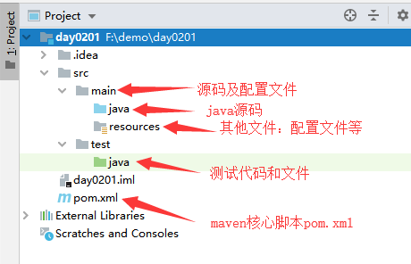

# Spring 入门

## 概述

Spring 是最受欢迎的企业级 Java 应用程序开发框架，数以百万的来自世界各地的开发人员使用 Spring 框架来创建性能好、易于测试、可重用的代码。

Spring 框架是一个开源的 Java 平台，它最初是由 Rod Johnson 编写的，并且于 2003 年 6 月首次在 Apache 2.0 许可下发布。

Spring 是轻量级的框架，其基础版本只有 2 MB 左右的大小。

Spring 框架的核心特性是可以用于开发任何 Java 应用程序，但是在 Java EE 平台上构建 web 应用程序是需要扩展的。 Spring 框架的目标是使 J2EE 开发变得更容易使用，通过启用基于 POJO 编程模型来促进良好的编程实践。

## 使用 Spring 框架的好处

下面列出的是使用 Spring 框架主要的好处：

- Spring 可以使开发人员使用 POJOs 开发企业级的应用程序。只使用 POJOs 的好处是你不需要一个 EJB 容器产品，比如一个应用程序服务器，但是你可以选择使用一个健壮的 servlet 容器，比如 Tomcat 或者一些商业产品。
- Spring 在一个单元模式中是有组织的。即使包和类的数量非常大，你只要担心你需要的，而其它的就可以忽略了。
- Spring 不会让你白费力气做重复工作，它真正的利用了一些现有的技术，像ORM 框架、日志框架、JEE、Quartz 和 JDK 计时器，其他视图技术。
- 测试一个用 Spring 编写的应用程序很容易，因为环境相关的代码被移动到这个框架中。此外，通过使用 JavaBean-style POJOs，它在使用依赖注入注入测试数据时变得更容易。
- Spring 的 web 框架是一个设计良好的 web MVC 框架，它为比如 Structs 或者其他工程上的或者不怎么受欢迎的 web 框架提供了一个很好的供替代的选择。MVC模式导致应用程序的不同方面(输入逻辑，业务逻辑和UI逻辑)分离，同时提供这些元素之间的松散耦合。
  - 模型(Model)封装了应用程序数据，通常它们将由POJO类组成。
  - 视图(View)负责渲染模型数据，一般来说它生成客户端浏览器可以解释HTML输出。
  - 控制器(Controller)负责处理用户请求并构建适当的模型，并将其传递给视图进行渲染。
- Spring 对JavaEE开发中非常难用的一些API（JDBC、JavaMail、远程调用等），都提供了封装，使这些API应用难度大大降低。
- 轻量级的 IOC 容器往往是轻量级的，例如，特别是当与 EJB 容器相比的时候。这有利于在内存和 CPU 资源有限的计算机上开发和部署应用程序。
- Spring提供了一致的事务管理接口，可向下扩展到（使用一个单一的数据库，例如）本地事务并扩展到全局事务（例如，使用 JTA）。

## hello spring

### 1.1 jdk环境配置

略

### 1.2 安装IDE 

主流的java ide可以支持spring的开发，例如:eclipse intellij netbean vscode sts等，这里我们选用intellij进行开发

### 1.3 准备maven环境

​	maven是java编程必不可少的工具，它可以通过简单的脚本和命令帮助开发者快速构建复杂的java应用程序。帮助开发者管理依赖、测试、打包、编译，陪着持续集成工具，maven还可以帮助开发者实现项目的自动部署。

>  eclipse和intellij这样的综合型ide默认都内置了maven工具，但在实际开发过程中，仍建议各位自行安装maven，并指定路径管理maven本地库

安装maven步骤：

#### 1.下载maven应用

这里我们直接下载maven二进制文件：http://mirror.bit.edu.cn/apache/maven/maven-3/3.6.3/binaries/apache-maven-3.6.3-bin.zip

#### 2.解压zip包，配置环境变量

配置MAVEN_HOME


  将maven命令集添加至系统环境变量中


打开命令行，测试

```bash
mvn -v
------------
Maven home: D:\software\apache-maven-3.6.3\bin\..
Java version: 1.8.0_45, vendor: Oracle Corporation, runtime: C:\Program Files\java\jdk1.8.0_45\jre
Default locale: zh_CN, platform encoding: GBK
OS name: "windows 8.1", version: "6.3", arch: "amd64", family: "windows"
```

#### 3.在intellij中配置maven环境（见1.4）

#### 4.配置maven中央仓库阿里云镜像

> maven默认的中央仓库在国内使用并不稳定，建议将中央仓库映射到阿里云镜像

修改 ```maven安装目录/conf/settings.xml```文件，在其<mirrors>标签中添加如下内容

```xml
<mirrors>
    <mirror>
        <id>alimaven</id>
        <name>aliyun maven</name>
        <url>http://maven.aliyun.com/nexus/content/groups/public/</url>
        <mirrorOf>central</mirrorOf>       
    </mirror>
</mirrors>
```

#### 5.配置maven本地仓库地址

maven会将从中央库中下载的jar包依赖默认保存在用户目录之下，也就是本地仓库，如果想修改仓库地址，在```settings.xml```中添加如下配置

```xml
<localRepository>d:\mvnRepo</localRepository>
```

### 1.4 创建hello world项目

#### 1. intellij创建maven项目

指定项目所在目录以及项目名称（这里注意项目路径不要有中文，并且最好不要在盘符下第一级子目录）


####  2. 配置maven项目自动导入

intellij支持实时监控maven项目的规则改变，并且自动完成依赖包的导入

刚打开项目时，我们会发现intellij右下角弹出如下对话框,请选择**Enable Auto-Import**


 如果没有弹出，或者没有选择，请打开maven设置，勾选自动导入


#### 3.配置intellij maven

​	由于intellij自带maven api，因此其默认使用自带maven和默认的本地仓库地址，这里我们需要设置使用我们手动下载的maven api，并且在我们创建其他项目时，也使用次配置，因此这里我们除了配置本项目的maven外，还需要设置新项目的maven配置

##### 配置当前项目


   

##### 全局项目配置

​	全局项目配置与当前项目配置方式一致，只不过选项在 other settings中


####   4 项目目录结构

​	项目创建完毕后，其目录结构如下



其中pom.xml是maven项目的核心配置文件，其中定义了这个项目的maven构建规则

### 1.5 编写第一个spring应用

#### 1. 引入项目依赖

首先在pom.xml中引入spring framework的最小化依赖

```xml
<dependencies>
    <dependency>
        <groupId>org.springframework</groupId>
        <artifactId>spring-context</artifactId>
        <version>5.2.3.RELEASE</version>
    </dependency>
</dependencies>
```

此时如果配置了自动导入的化，会发现intellij正在自动下载依赖包，首次下载成功后，之后的maven项目如果用到次依赖包，直接从本次仓库引入

​	下载完成后，我们可以看到intellij在```external libraries```下显示如下的依赖


#### 2. 编写代码

创建如下类

##### 实体bean

```java
package com.neusoft.model;

public class Good {

    public Good() {
    }

    public Good(String goodName, Double price, Long goodId) {
        this.goodName = goodName;
        this.price = price;
        this.goodId = goodId;
    }

    private String goodName;
    private Double price;
    private Long goodId;

    public String getGoodName() {
        return goodName;
    }

    public void setGoodName(String goodName) {
        this.goodName = goodName;
    }

    public Double getPrice() {
        return price;
    }

    public void setPrice(Double price) {
        this.price = price;
    }

    public Long getGoodId() {
        return goodId;
    }

    public void setGoodId(Long goodId) {
        this.goodId = goodId;
    }
}

```

##### dao及实现类

```java
package com.neusoft.dao;

import com.neusoft.model.Good;

public interface GoodDao {

    Good findGoodById(Long id);
}

```

```java
package com.neusoft.dao;

import com.neusoft.model.Good;

public class GoodDaoImpl implements GoodDao {

    public Good findGoodById(Long id) {
        if(id==1L){
            return new Good("香皂",12.8, 1L);
        }else if (id==2L){
            return  new Good("口罩",22.8, 2L);
        }else if (id==3L){
            return  new Good("84消毒液",42.8, 3L);
        }
        return null;
    }
}

```

##### service及实现类

```java
package com.neusoft.service;

import com.neusoft.model.Good;

public interface GoodService {

    Good findGoodById(Long id);
}

```

```java
package com.neusoft.service;

import com.neusoft.dao.GoodDao;
import com.neusoft.model.Good;

public class GoodServiceImpl implements GoodService {
    private GoodDao goodDao;

    public Good findGoodById(Long id) {
        return goodDao.findGoodById(id);
    }

    public void setGoodDao(GoodDao goodDao) {
        this.goodDao = goodDao;
    }
}

```

#### 3.装配spring容器

##### 1. xml方式装配

​	xml是spring最古老的容器装配方式，其优点是可以让我们的代码完全与spring解耦，保持代码的纯净，但是这种方式随着spring生态环境地位的改变，使用频率不是很高了

在resource目录下编写spring-ctx01.xml

```xml
<?xml version="1.0" encoding="UTF-8"?>
<beans xmlns="http://www.springframework.org/schema/beans"
       xmlns:xsi="http://www.w3.org/2001/XMLSchema-instance"
       xsi:schemaLocation="http://www.springframework.org/schema/beans http://www.springframework.org/schema/beans/spring-beans.xsd">

    <bean id="goodDao" class="com.neusoft.dao.GoodDaoImpl"/>

    <bean id="goodService" class="com.neusoft.service.GoodServiceImpl" >
        <property name="goodDao" ref="goodDao"/>
    </bean>
</beans>
```

创建程序主入口

```java
package com.neusoft;

import com.neusoft.model.Good;
import com.neusoft.service.GoodService;
import org.springframework.context.ApplicationContext;
import org.springframework.context.support.ClassPathXmlApplicationContext;

public class HelloSpring {

    public static void main(String[] args) {
        //创建IOC容器，并指定配置文件地址：配置文件地址在classpath下的spring-ctx01.xml
        ApplicationContext context = new ClassPathXmlApplicationContext("spring-ctx01.xml");

        //获取GoodService,根据id或者name获得，这种方式需要强转
        GoodService goodService = (GoodService) context.getBean("goodService");

        //调用查询方法
        Good good = goodService.findGoodById(1L);

        if(good!=null){
            System.out.printf("good name is %s, good price is %f,good id is %d",good.getGoodName(),good.getPrice(),good.getGoodId());
        }

    }
}
```

运行测试：

```
good name is 香皂, good price is 12.800000,good id is 1
Process finished with exit code 0
```

##### 2. java config方式

​	随着互联网应用的分布式进程，spring的核心思想也从单纯的通过依赖注入实现解耦变化为了适应敏捷开发的思想，因此，解耦的需求没有以往那么强烈，而开发的高效率才是spring更加关注的问题，因此注解的大量使用和后续的动态初始化配置才是spring的厉害之处，而这一切的基础都需要使用到java config的方式

创建主配置类AppConfig

```java
package com.neusoft.config;

import com.neusoft.dao.GoodDao;
import com.neusoft.dao.GoodDaoImpl;
import com.neusoft.service.GoodService;
import com.neusoft.service.GoodServiceImpl;
import org.springframework.context.annotation.Bean;
import org.springframework.context.annotation.Configuration;

@Configuration
public class AppConfig {
    @Bean
    public GoodDao goodDao(){
        return new GoodDaoImpl();
    }

    @Bean
    public GoodService goodService(){
        GoodServiceImpl goodService = new GoodServiceImpl();
        goodService.setGoodDao(goodDao());
        return goodService;
    }
}

```

创建主程序入口

```java
package com.neusoft;

import com.neusoft.config.AppConfig;
import com.neusoft.model.Good;
import com.neusoft.service.GoodService;
import org.springframework.context.ApplicationContext;
import org.springframework.context.annotation.AnnotationConfigApplicationContext;
import org.springframework.context.support.ClassPathXmlApplicationContext;

public class HelloSpring2 {

    public static void main(String[] args) {
        //创建IOC容器，并指定配置文件地址：配置文件地址在classpath下的spring-ctx01.xml
        ApplicationContext context = new AnnotationConfigApplicationContext(AppConfig.class);

        //获取GoodService,根据id或者name获得，这种方式需要强转
        GoodService goodService = (GoodService) context.getBean("goodService");

        //调用查询方法
        Good good = goodService.findGoodById(1L);

        if(good!=null){
            System.out.printf("good name is %s, good price is %f,good id is %d",good.getGoodName(),good.getPrice(),good.getGoodId());
        }

    }
}

```

运行测试：

```
good name is 香皂, good price is 12.800000,good id is 1
Process finished with exit code 0
```

## 2. Spring 整合Junit测试

​	除了使用main函数对spring进行测试以外，在真正复杂的应用场景中，我们需要更加细化的单元测试工具，以对不同模块进行细粒度更高的测试，这里我们使用spring-test包配合junit进行测试

首先，在pom.xml中引入junit和spring-test依赖

```xml
<dependency>
    <groupId>org.springframework</groupId>
    <artifactId>spring-test</artifactId>
    <version>5.2.3.RELEASE</version>
</dependency>
<dependency>
    <groupId>junit</groupId>
    <artifactId>junit</artifactId>
    <version>4.12</version>
    <scope>test</scope>
</dependency>
```

在test文件夹下编写测试类

```java
package com.neusoft;

import com.neusoft.config.AppConfig;
import com.neusoft.model.Good;
import com.neusoft.service.GoodService;
import org.junit.Test;
import org.junit.runner.RunWith;
import org.springframework.beans.factory.annotation.Autowired;
import org.springframework.test.context.ContextConfiguration;
import org.springframework.test.context.junit4.SpringJUnit4ClassRunner;

@RunWith(SpringJUnit4ClassRunner.class)
//@ContextConfiguration("classpath:spring-ctx01.xml")
@ContextConfiguration(classes = AppConfig.class)
public class SpringTest1 {
    @Autowired
    private GoodService goodService;
    
    @Test
    public void test1(){
        Good good = goodService.findGoodById(2L);
        System.out.println(good);
    }
}
```

执行测试方法，结果

```
...
com.neusoft.model.Good@1fa268de
Process finished with exit code 0
```


   

   

   