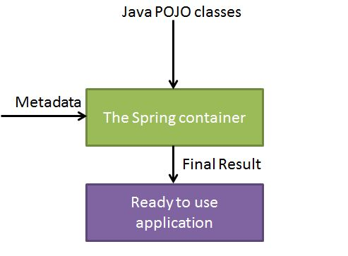

# Spring IOC &DI

## IoC 容器

Spring 容器是 Spring 框架的核心。容器将创建对象，把它们连接在一起，配置它们，并管理他们的整个生命周期从创建到销毁。Spring 容器使用依赖注入（DI）来管理组成一个应用程序的组件。这些对象被称为 Spring Beans，我们将在下一章中进行讨论。

通过阅读配置元数据提供的指令，容器知道对哪些对象进行实例化，配置和组装。配置元数据可以通过 XML，Java 注释或 Java 代码来表示。下图是 Spring 如何工作的高级视图。 Spring IoC 容器利用 Java 的 POJO 类和配置元数据来生成完全配置和可执行的系统或应用程序。

**IOC 容器**具有依赖注入功能的容器，它可以创建对象，IOC 容器负责实例化、定位、配置应用程序中的对象及建立这些对象间的依赖。通常new一个实例，控制权由程序员控制，而"控制反转"是指new实例工作不由程序员来做而是交给Spring容器来做。在Spring中[BeanFactory](https://www.w3cschool.cn/wkspring/j3181mm3.html)是IOC容器的实际代表者。



Spring 提供了以下两种不同类型的容器。

| 序号 | 容器 & 描述                                                  |
| ---- | ------------------------------------------------------------ |
| 1    | [Spring BeanFactory 容器](https://www.w3cschool.cn/wkspring/j3181mm3.html)它是最简单的容器，给 DI 提供了基本的支持，它用 org.springframework.beans.factory.BeanFactory 接口来定义。BeanFactory 或者相关的接口，如 BeanFactoryAware，InitializingBean，DisposableBean，在 Spring 中仍然存在具有大量的与 Spring 整合的第三方框架的反向兼容性的目的。 |
| 2    | [Spring ApplicationContext 容器](https://www.w3cschool.cn/wkspring/yqdx1mm5.html)该容器添加了更多的企业特定的功能，例如从一个属性文件中解析文本信息的能力，发布应用程序事件给感兴趣的事件监听器的能力。该容器是由 org.springframework.context.ApplicationContext 接口定义。 |

ApplicationContext 容器包括 BeanFactory 容器的所有功能，所以通常建议超过 BeanFactory。BeanFactory 仍然可以用于轻量级的应用程序，如移动设备或基于 applet 的应用程序，其中它的数据量和速度是显著。

## Spring 的 BeanFactory 容器

这是一个最简单的容器，它主要的功能是为依赖注入 （DI） 提供支持，这个容器接口在 org.springframework.beans.factory.BeanFactor 中被定义。BeanFactory 和相关的接口，比如BeanFactoryAware、DisposableBean、InitializingBean，仍旧保留在 Spring 中，主要目的是向后兼容已经存在的和那些 Spring 整合在一起的第三方框架。

在 Spring 中，有大量对 BeanFactory 接口的实现。其中，最常被使用的是 **XmlBeanFactory** 类。这个容器从一个 XML 文件中读取配置元数据，由这些元数据来生成一个被配置化的系统或者应用。

在资源宝贵的移动设备或者基于 applet 的应用当中， BeanFactory 会被优先选择。否则，一般使用的是 ApplicationContext，除非你有更好的理由选择 BeanFactory。

## Spring ApplicationContext 容器

Application Context 是 BeanFactory 的子接口，也被成为 Spring 上下文。 

Application Context 是 spring 中较高级的容器。和 BeanFactory 类似，它可以加载配置文件中定义的 bean，将所有的 bean 集中在一起，当有请求的时候分配 bean。 另外，它增加了企业所需要的功能，比如，从属性文件中解析文本信息和将事件传递给所指定的监听器。这个容器在 org.springframework.context.ApplicationContext interface 接口中定义。

ApplicationContext 包含 BeanFactory 所有的功能，一般情况下，相对于 BeanFactory，ApplicationContext 会更加优秀。当然，BeanFactory 仍可以在轻量级应用中使用，比如移动设备或者基于 applet 的应用程序。

最常被使用的 ApplicationContext 接口实现：

- **AnnotationConfigApplicationContext**：该容器Java Config配置类中加载已被定义的bean。
- **ClassPathXmlApplicationContext**：该容器从 XML 文件中加载已被定义的 bean。在这里，你不需要提供 XML 文件的完整路径，只需正确配置 CLASSPATH 环境变量即可，因为，容器会从 CLASSPATH 中搜索 bean 配置文件。
- **WebXmlApplicationContext**：该容器会在一个 web 应用程序的范围内加载在 XML 文件中已被定义的 bean。
- **AnnotationConfigWebApplicationContext**：同上，采用java config方式

我们已经在 第一章节中看到过 **ClassPathXmlApplicationContext**和**AnnotationConfigApplicationContext** 容器，并且，在基于 spring mvc 应用程序这个独立的章节中，我们会使用到**WebXmlApplicationContext**和**AnnotationConfigWebApplicationContext**。

## IOC与DI的概念

IOC全称Inverse of Control,控制反转，这是spring的核心概念，但是它解释起来并不容易理解，我们通过如下代码说明：

### 传统开发模式

在没有IOC的情况下，回忆一下我们的编码方式，假定我们有两个GoodDao的实现类

```java
class GoodDaoImpl1{
    public Good findGoodById(Long id){
        //通过jdbc实现
        Connecton conn = DriverManager.get Connection()
            .....
    }
}

class GoodDaoImpl2{
    public Good findGoodById(Long id){
        .......
            //通过orm框架实现
    }
}
```

当我们在创建GoodService实现类时，我们知道它是需要依赖于GoodDao实现类的，所以我们会这样编码

```java
class GoodServiceImpl implements GoodService{
    
    private GoodDao goodDao = new GoodDaoImpl1（）；
        
}
```

这里我们直接new了 goodDaoImpl1，但是假如我想用GoodDaoImpl2怎么办呢，或许你觉得很简单，我们直接改代码就可以了

是的，看似简单，但是不要忘了，**java是一种静态编译型语言**，改变代码就意味着我们要重新进行编译打包部署，这个代价在实际开发过程中的代价是极高的。

### ioc开发方式

有了ioc情况右如何呢？

我们改变service实现类的代码

```java
class GoodServiceImpl implements GoodService{
    
    private GoodDao goodDao；
        
}
```

在spring的配置文件中这样做

```xml
<bean id="goodDao" class="com.neusoft.dao.GoodDaoImpl1"/>
<!--<bean id="goodDao" class="com.neusoft.dao.GoodDaoImpl2"/>-->
<bean id="goodService" class="com.neusoft.service.GoodServiceImpl" >
    <property name="goodDao" ref="goodDao"/>
</bean>
```

你会发现，原来通过硬编码的方式现在变成了修改xml，不要小瞧这一动作，这一动作的直接后果是，我们不需要再对代码进行重新编译和打包了，这就是ioc的的好处。

**所谓**控制反转**，实际上的含义就是，原来控制实体类的动作是由**调用类**GoodSerivceImpl决定的，而现在，控制权反转给了**spring**，这就是**控制反转**

**事情并没有那么简单！！**

我们把以上的xml换成java config试试

```java

@Configuration
public class AppConfig {
    @Bean
    public GoodDao goodDao(){
        return new GoodDaoImpl1();
        //return new GoodDaoImpl2();
    }

    @Bean
    public GoodService goodService(){
        GoodServiceImpl goodService = new GoodServiceImpl();
        goodService.setGoodDao(goodDao());
        return goodService;
    }
}
```

**你发现了吗？你困惑吗？java config类也是java代码，难道修改javaconfig类就不要编译吗？那ioc还有啥用呢？**

这个原因对于初学者而言很难一句话解释清楚，这就要回溯到整个spring的发展历史了，spring的核心优势ioc其实已经不再那么重要了，而真正重要的其实是spring强大的生态体系，让java ee的开发者已经很难离开它了。

### Dependency Injection

由于IoC描述不易理解，因此软件界的泰斗级任务MartinFowler提出了DI(Dependency Injection,依赖注入）的概念来代替IoC,即让调用类对某一接口实现类的依赖关系由第三方（容器）注入，以移除调用类对某一接口实现类的依赖，“依赖注入”比“控制反转”更直接明了，易于理解。

在上面的例子中，GoodServiceImpl需要调用GoodDao的实现类，这时候GoodServiceImpl就依赖于spring向其分配GoodDao的实现类，而spirng容器会根据配置规则，适时的向Service中注入Dao的实现类，这就是依赖注入的概念，简单易懂。

## 依赖注入的方式

spring的依赖注入方式有如下两种

| 方式         |                     依赖注入类型 & 描述                      |
| ------------ | :----------------------------------------------------------: |
| 构造函数注入 | 当容器调用带有多个参数的构造函数类时，实现基于构造函数的 DI，每个代表在其他类中的一个依赖关系。 |
| set方法注入  | 基于 setter 方法的 DI 是通过在调用无参数的构造函数或无参数的静态工厂方法实例化 bean 之后容器调用 beans 的 setter 方法来实现的。 |

以xml为例：

```xml
<?xml version="1.0" encoding="UTF-8"?>
<beans xmlns="http://www.springframework.org/schema/beans"
       xmlns:xsi="http://www.w3.org/2001/XMLSchema-instance"
       xsi:schemaLocation="http://www.springframework.org/schema/beans http://www.springframework.org/schema/beans/spring-beans.xsd">

    <bean id="goodDao" class="com.neusoft.dao.GoodDaoImpl"/>
	
    <!--set方法注入-->
    <bean id="goodService" class="com.neusoft.service.GoodServiceImpl" >
        <property name="goodDao" ref="goodDao"/>
    </bean>
    
    <!--构造函数注入-->
    <bean id="goodService2" class="com.neusoft.service.GoodServiceImpl" >
        <constructor-arg name="goodDao" ref="goodDao"/>
    </bean>
</beans>
```

GoodServiceImpl代码：

```java
public class GoodServiceImpl implements GoodService {
    private GoodDao goodDao;

    public GoodServiceImpl() {
    }
	
    //构造函数
    public GoodServiceImpl(GoodDao goodDao) {
        this.goodDao = goodDao;
    }

    public Good findGoodById(Long id) {
        return goodDao.findGoodById(id);
    }
	
    //set方法
    public void setGoodDao(GoodDao goodDao) {
        this.goodDao = goodDao;
    }
}
```

## 依赖注入的java类型

### 1. 字面值类型

字面值类型包含字符串、数字类型

例如

```java
package com.neusoft.model;

public class Person {

    private String name;
    private Integer age;
    private Double salary;
    private Boolean male;

    public String getName() {
        return name;
    }

    public void setName(String name) {
        this.name = name;
    }

    public Integer getAge() {
        return age;
    }

    public void setAge(Integer age) {
        this.age = age;
    }

    public Double getSalary() {
        return salary;
    }

    public void setSalary(Double salary) {
        this.salary = salary;
    }

    public Boolean getMale() {
        return male;
    }

    public void setMale(Boolean male) {
        this.male = male;
    }

    @Override
    public String toString() {
        return "Person{" +
                "name='" + name + '\'' +
                ", age=" + age +
                ", salary=" + salary +
                ", male=" + male +
                '}';
    }
}

```

```xml
<bean id="person" class="com.neusoft.model.Person">
        <property name="age" value="11"/>
        <property name="name" value="haha"/>
        <property name="salary" value="111111.1"/>
        <property name="male" value="true"/>
</bean>
```

我们可以看到，java的基本数据类型都能使用字面值方式注入

### 2.null值

为属性设置一个null的注入值,必须使用<null />元素标签

```xml
<bean id="person" class="com.neusoft.model.Person">
        <property name="age"><null></null></property>
        <property name="name" value="haha"/>
        <property name="salary" value="111111.1"/>
        <property name="male" value="true"/>
</bean>
```

意义不大，直接不注入就是null

```xml
<bean id="person" class="com.neusoft.model.Person">
        <property name="name" value="haha"/>
        <property name="salary" value="111111.1"/>
        <property name="male" value="true"/>
</bean>
```

### 3.集合类型

spring的依赖注入还支持集合类型，诸如List ，Map 、Set都可以进行依赖注入

```java
<bean id="good1" class="com.neusoft.model.Good"/>
<bean id="good2" class="com.neusoft.model.Good"/>
<bean id="good3" class="com.neusoft.model.Good"/>

    <bean id="person" class="com.neusoft.model.Person">
        <property name="goodList">
           <list>
               <ref bean="good1"/>
               <ref bean="good2"/>
               <ref bean="good3"/>
           </list>
        </property>
    </bean>
```

## Bean 自动装配

你已经学会如何使用`<bean>`元素来声明 bean 和通过使用 XML 配置文件中的`<constructor-arg>`和`<property>`元素来注入 。

Spring 容器可以在不使用`<constructor-arg>`和`<property>` 元素的情况下**自动装配**相互协作的 bean 之间的关系，这有助于减少编写一个大的基于 Spring 的应用程序的 XML 配置的数量。

## 自动装配模式

下列自动装配模式，它们可用于指示 Spring 容器为来使用自动装配进行依赖注入。你可以使用`<bean>`元素的 **autowire** 属性为一个 bean 定义指定自动装配模式。

| 模式                                                         | 描述                                                         |
| ------------------------------------------------------------ | ------------------------------------------------------------ |
| no                                                           | 这是默认的设置，它意味着没有自动装配，你应该使用显式的bean引用来连线。你不用为了连线做特殊的事。在依赖注入章节你已经看到这个了。 |
| [byName](https://www.w3cschool.cn/wkspring/fwdz1mmb.html)    | 由属性名自动装配。Spring 容器看到在 XML 配置文件中 bean 的自动装配的属性设置为 byName。然后尝试匹配，并且将它的属性与在配置文件中被定义为相同名称的 beans 的属性进行连接。 |
| [byType](https://www.w3cschool.cn/wkspring/8dhy1mmd.html)    | 由属性数据类型自动装配。Spring 容器看到在 XML 配置文件中 bean 的自动装配的属性设置为 byType。然后如果它的**类型**匹配配置文件中的一个确切的 bean 名称，它将尝试匹配和连接属性的类型。如果存在不止一个这样的 bean，则一个致命的异常将会被抛出。 |
| [constructor](https://www.w3cschool.cn/wkspring/jtlb1mmf.html) | 类似于 byType，但该类型适用于构造函数参数类型。如果在容器中没有一个构造函数参数类型的 bean，则一个致命错误将会发生。 |
| autodetect                                                   | Spring首先尝试通过 constructor 使用自动装配来连接，如果它不执行，Spring 尝试通过 byType 来自动装配。 |

可以使用 **byType** 或者 **constructor** 自动装配模式来连接数组和其他类型的集合。

## Bean 的作用域

当在 Spring 中定义一个 bean 时，你必须声明该 bean 的作用域的选项。例如，为了强制 Spring 在每次需要时都产生一个新的 bean 实例，你应该声明 bean 的作用域的属性为 **prototype**。同理，如果你想让 Spring 在每次需要时都返回同一个bean实例，你应该声明 bean 的作用域的属性为 **singleton**。

Spring 框架支持以下五个作用域，分别为singleton、prototype、request、session和global session，5种作用域说明如下所示，

注意，如果你使用 web-aware ApplicationContext 时，其中三个是可用的。    

| 作用域         | 描述                                                         |
| -------------- | ------------------------------------------------------------ |
| singleton      | 在spring IoC容器仅存在一个Bean实例，Bean以单例方式存在，默认值 |
| prototype      | 每次从容器中调用Bean时，都返回一个新的实例，即每次调用getBean()时，相当于执行newXxxBean() |
| request        | 每次HTTP请求都会创建一个新的Bean，该作用域仅适用于WebApplicationContext环境 |
| session        | 同一个HTTP Session共享一个Bean，不同Session使用不同的Bean，仅适用于WebApplicationContext环境 |
| global-session | 一般用于Portlet应用环境，该运用域仅适用于WebApplicationContext环境 |

本章将讨论前两个范围，当我们将讨论有关 web-aware Spring ApplicationContext 时，其余三个将被讨论。

### singleton 作用域：

singleton 是默认的作用域，也就是说，当定义 Bean 时，如果没有指定作用域配置项，则 Bean 的作用域被默认为 singleton。 

当一个bean的作用域为Singleton，那么Spring IoC容器中只会存在一个共享的bean实例，并且所有对bean的请求，只要id与该bean定义相匹配，则只会返回bean的同一实例。

也就是说，当将一个bean定义设置为singleton作用域的时候，Spring IoC容器只会创建该bean定义的唯一实例。

Singleton是单例类型，就是在创建起容器时就同时自动创建了一个bean的对象，不管你是否使用，他都存在了，每次获取到的对象都是同一个对象。注意，Singleton作用域是Spring中的缺省作用域。你可以在 bean 的配置文件中设置作用域的属性为 singleton，如下所示：

```xml
<!-- A bean definition with singleton scope -->
<bean id="..." class="..." scope="singleton">
    <!-- collaborators and configuration for this bean go here -->
</bean>
```

### prototype 作用域

当一个bean的作用域为Prototype，表示一个bean定义对应多个对象实例。Prototype作用域的bean会导致在每次对该bean请求（将其注入到另一个bean中，或者以程序的方式调用容器的getBean()方法）时都会创建一个新的bean实例。Prototype是原型类型，它在我们创建容器的时候并没有实例化，而是当我们获取bean的时候才会去创建一个对象，而且我们每次获取到的对象都不是同一个对象。根据经验，对有状态的bean应该使用prototype作用域，而对无状态的bean则应该使用singleton作用域。

为了定义 prototype 作用域，你可以在 bean 的配置文件中设置作用域的属性为 prototype，如下所示：

```xml
<!-- A bean definition with singleton scope -->
<bean id="..." class="..." scope="prototype">
   <!-- collaborators and configuration for this bean go here -->
</bean>
```


## Spring基于注解的配置

从 Spring 2.5 开始就可以使用**注解**来配置依赖注入。而不是采用 XML 来描述一个 bean 连线，你可以使用相关类，方法或字段声明的注解，将 bean 配置移动到组件类本身。

在 XML 注入之前进行注解注入，因此后者的配置将通过两种方式的属性连线被前者重写。

注解连线在默认情况下在 Spring 容器中不打开。因此，在可以使用基于注解的连线之前，我们将需要在我们的 Spring 配置文件中启用它。所以如果你想在 Spring 应用程序中使用的任何注解，可以考虑到下面的配置文件。


```xml
<?xml version="1.0" encoding="UTF-8"?>

<beans xmlns="http://www.springframework.org/schema/beans"
    xmlns:xsi="http://www.w3.org/2001/XMLSchema-instance"
    xmlns:context="http://www.springframework.org/schema/context"
    xsi:schemaLocation="http://www.springframework.org/schema/beans
    http://www.springframework.org/schema/beans/spring-beans-3.0.xsd
    http://www.springframework.org/schema/context
    http://www.springframework.org/schema/context/spring-context-3.0.xsd">

   <context:annotation-config/>
   <!-- bean definitions go here -->

</beans>
```

一旦 被配置后，你就可以开始注解你的代码，表明 Spring 应该自动连接值到属性，方法和构造函数。让我们来看看几个重要的注解，并且了解它们是如何工作的：

| 序号 | 注解 & 描述                                                  |
| ---- | ------------------------------------------------------------ |
| 1    | [@Required](https://www.w3cschool.cn/wkspring/9sle1mmh.html)@Required 注解应用于 bean 属性的 setter 方法。 |
| 2    | [@Autowired](https://www.w3cschool.cn/wkspring/rw2h1mmj.html)@Autowired 注解可以应用到 bean 属性的 setter 方法，非 setter 方法，构造函数和属性。 |
| 3    | [@Qualifier](https://www.w3cschool.cn/wkspring/knqr1mm2.html)通过指定确切的将被连线的 bean，@Autowired 和 @Qualifier 注解可以用来删除混乱。 |
| 4    | [JSR-250 Annotations](https://www.w3cschool.cn/wkspring/lmsq1mm4.html)Spring 支持 JSR-250 的基础的注解，其中包括了 @Resource，@PostConstruct 和 @PreDestroy 注解。 |

### @Autowired

​	@Autowired注解非常强大，他可以用在方法、构造函数和属性上

```java
//---------非set方法
public class MovieRecommender {

    private final CustomerPreferenceDao customerPreferenceDao;

    @Autowired
    public MovieRecommender(CustomerPreferenceDao customerPreferenceDao) {
        this.customerPreferenceDao = customerPreferenceDao;
    }

    // ...
}
//---------- set方法
public class SimpleMovieLister {

    private MovieFinder movieFinder;

    @Autowired
    public void setMovieFinder(MovieFinder movieFinder) {
        this.movieFinder = movieFinder;
    }

    // ...
}
//----------------- 构造函数
public class MovieRecommender {

    private final CustomerPreferenceDao customerPreferenceDao;

    @Autowired
    private MovieCatalog movieCatalog;

    @Autowired
    public MovieRecommender(CustomerPreferenceDao customerPreferenceDao) {
        this.customerPreferenceDao = customerPreferenceDao;
    }

    // ...
}
```

### 使用注解定义Bean

​	除了使用javaconfig和xml的方式来定义bean以外，我们还可以用注解的方式定义实体bean，spring提供了多种注解供我们进行实体bean的定义，还是以GoodDao和GoodService为例

```java

@Component
public class GoodServiceImpl{
    @Autowired
    private GoodDao goodDao;
}

@Component
public class GoodDaoImpl {
   
}

```

配置注解扫描器

```xml
<?xml version="1.0" encoding="UTF-8"?>
<beans xmlns="http://www.springframework.org/schema/beans"
    xmlns:xsi="http://www.w3.org/2001/XMLSchema-instance"
    xmlns:context="http://www.springframework.org/schema/context"
    xsi:schemaLocation="http://www.springframework.org/schema/beans
        https://www.springframework.org/schema/beans/spring-beans.xsd
        http://www.springframework.org/schema/context
        https://www.springframework.org/schema/context/spring-context.xsd">

    <!--扫描com.neusoft包下的所有含有注解的类-->
    <context:component-scan base-package="com.neusoft"/>
	
</beans>
```

或者采用java config

```java
@Configuration  //表明当前类是spring的容器配置类 annotation
@ComponentScan("com.neusoft")
public class AppConfig{//....}
```

除了```@Componet```注解外，spring还提供了`@Service`, `@Repository`,`@Controller`等多种注解方式，那么到底使用哪种注解，我们要遵循语义化的规则，例如dao我们使用 `@Repository`,service层我们使用`@Service`,控制器我们使用`@Controller`

