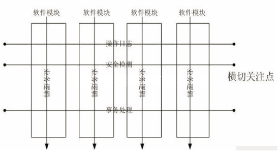

# Spring AOP

Spring 框架的一个关键组件是**面向方面的编程**(AOP)框架。面向方面的编程需要把程序逻辑分解成不同的部分称为所谓的关注点。跨一个应用程序的多个点的功能被称为**横切关注点**，这些横切关注点在概念上独立于应用程序的业务逻辑。有各种各样的常见的很好的方面的例子，如日志记录、审计、声明式事务、安全性和缓存等。

在 OOP 中，关键单元模块度是类，而在 AOP 中单元模块度是方面。依赖注入帮助你对应用程序对象相互解耦和 AOP 可以帮助你从它们所影响的对象中对横切关注点解耦。AOP 是像编程语言的触发物，如 Perl，.NET，Java 或者其他。

Spring AOP 模块提供拦截器来拦截一个应用程序，例如，当执行一个方法时，你可以在方法执行之前或之后添加额外的功能。

例如下图：



我们可以看到，在不该变原有核心代码的情况下，我们通过aop可以实现日志的拦截，安全监测，事务处理等一系列动作。

如何在不改变原有核心代码的情况下，实现这样的效果呢？这里我们不得不提的是代理模式。

## 代理模式

​	试想一个应用场景，总裁与秘书，我们知道现实生活中总裁有很多事要做，业务繁忙，很多事情需要秘书来处理，比如：记录签字盖章、会议出席记录等等。

### 1. 静态代理

​	静态代理在使用时,需要定义接口或者父类,被代理对象与代理对象一起实现相同的接口或者是继承相同父类，我们用代码来实现这个业务场景

首先创建Manager接口代表管理者

```java
package com.neusoft.staticproxy;

public interface Manager {

    void sign(String fileName); //签署文件

    void meeting(String meetName); //出席会议
}

```

创建实现类Ceo

```java
package com.neusoft.staticproxy;

public class Ceo implements Manager {


    public void sign(String fileName) {
        System.out.printf("ceo has signed the file：%s \n",fileName);;
    }

    public void meeting(String meetName) {
        System.out.printf("ceo has assigned the meeting: %s \n",meetName);
    }
}

```

秘书需要代理ceo实现文件签署的记录，以及会议的开始时间与结束时间的记录，这里秘书就是ceo的代理，而CEO就是秘书的代理对象

```java
package com.neusoft.staticproxy;

import java.util.Date;

public class Secretary implements Manager {

    private Manager target; //被代理对象

    //通过构造函数将代理对象注入到代理对象中去
    public Secretary(Manager target) {
        this.target = target;
    }

    public void sign(String fileName) {
        target.sign(fileName);
        System.out.println("ceo signed the file at time:"+new Date());
    }

    public void meeting(String meetName) {
        System.out.println("the meeting started at :"+new Date());
        target.meeting(meetName);
        try {
            Thread.sleep(2000);
        } catch (InterruptedException e) {
            e.printStackTrace();
        }
        System.out.println("the meeting ended at :"+ new Date());
    }
}

```

最后，我们写下如下测试类

```java
package com.neusoft.staticproxy;

public class StaticProxy {

    public static void main(String[] args)  {
        Ceo ceo = new Ceo();
        Secretary secretary = new Secretary(ceo);
        secretary.meeting("紧急会议");
        secretary.sign("辞职信");
    }
}
```

执行代码结果：

```bash
the meeting started at :Mon Feb 03 20:32:11 CST 2020
ceo has assigned the meeting: 紧急会议 
the meeting ended at :Mon Feb 03 20:32:13 CST 2020
ceo has signed the file：辞职信 
ceo signed the file at time:Mon Feb 03 20:32:13 CST 2020
```

**静态代理总结:**
1.可以做到在不修改目标对象的功能前提下,对目标功能扩展.
2.缺点:

- 因为代理对象需要与目标对象实现一样的接口,所以会有很多代理类,类太多.同时,一旦接口增加方法,目标对象与代理对象都要维护.

如何解决静态代理中的缺点呢?答案是可以使用动态代理方式。

### 2. 动态代理

​	

​	假设我们给Manager接口添加一个新方法声明

```java
public interface Manager {

    void sign(String fileName);

    void meeting(String meetName);

    void eating();
}
```

吃饭我们还要秘书代理，记录下吃饭时间？那怎么办？

这时候我们就需要利用java的动态代理机制来实现由选择的方法拦截

所谓动态，就是指，在java运行时创建出来的类型，以及该类型的实现类，而不是我们在编码阶段写死的实现类，这就为我们在动态运行时确定拦截被代理对象的哪一个方法创造了条件。

```java
package com.neusoft.dynamic;

import java.lang.reflect.InvocationHandler;
import java.lang.reflect.Method;
import java.lang.reflect.Proxy;
import java.util.Date;

public class ProxyManager {
    private Object target;
    public ProxyManager(Object target){
        this.target = target;
    }


    public Object getProxyInstance(){
        return Proxy.newProxyInstance(this.getClass().getClassLoader(), target.getClass().getInterfaces(), new InvocationHandler() {
            //此方法执行具体的拦截逻辑
            public Object invoke(Object proxy, Method method, Object[] args) throws Throwable {
                Object returnValue = null;
                if(method.getName().equals("meeting")){
                    returnValue = method.invoke(target, args);;
                    System.out.println("ceo signed the file at time:"+new Date());
                }else if(method.getName().equals("sign")){
                    System.out.println("the meeting started at :"+new Date());
                    returnValue = method.invoke(target, args);;
                    try {
                        Thread.sleep(2000);
                    } catch (InterruptedException e) {
                        e.printStackTrace();
                    }
                    System.out.println("the meeting ended at :"+ new Date());
                }else{
                    returnValue = method.invoke(target, args);;
                }
                return returnValue;
            }
        });
    }
}

```

编写测试类

```java
package com.neusoft.dynamic;

import java.lang.reflect.InvocationHandler;
import java.lang.reflect.Method;
import java.lang.reflect.Proxy;
import java.util.Date;

public class ProxyManager {
    private Object target;
    public ProxyManager(Object target){
        this.target = target;
    }


    public Object getProxyInstance(){
        return Proxy.newProxyInstance(this.getClass().getClassLoader(), target.getClass().getInterfaces(), new InvocationHandler() {
            //此方法执行具体的拦截逻辑
            public Object invoke(Object proxy, Method method, Object[] args) throws Throwable {
                Object returnValue = null;
                if(method.getName().equals("sign")){
                    returnValue = method.invoke(target, args);;
                    System.out.println("ceo signed the file at time:"+new Date());
                }else if(method.getName().equals("meeting")){
                    System.out.println("the meeting started at :"+new Date());
                    returnValue = method.invoke(target, args);;
                    try {
                        Thread.sleep(2000);
                    } catch (InterruptedException e) {
                        e.printStackTrace();
                    }
                    System.out.println("the meeting ended at :"+ new Date());
                }else{
                    returnValue = method.invoke(target, args);;
                }
                return returnValue;
            }
        });
    }
}

```

测试结果：

```
ceo has assigned the meeting: 演唱会 
ceo signed the file at time:Mon Feb 03 21:15:30 CST 2020
the meeting started at :Mon Feb 03 21:15:30 CST 2020
ceo has signed the file：合同 
the meeting ended at :Mon Feb 03 21:15:32 CST 2020
ceo is eating big fish
```

### 3. CGLIB代理

大家可能发现了，无论是动态代理还是静态代理，我们都使用到了接口，那假如我们要拦截一个没有接口的被代理对象该怎么办呢？这里我们使用cglib来实现。

Cglib代理,也叫作子类代理,它是在内存中构建一个子类对象从而实现对目标对象功能的扩展.

- JDK的动态代理有一个限制,就是使用动态代理的对象必须实现一个或多个接口,如果想代理没有实现接口的类,就可以使用Cglib实现.
- Cglib是一个强大的高性能的代码生成包,它可以在运行期扩展java类与实现java接口.它广泛的被许多AOP的框架使用,例如Spring AOP和synaop,为他们提供方法的interception(拦截)
- Cglib包的底层是通过使用一个小而块的字节码处理框架ASM来转换字节码并生成新的类.不鼓励直接使用ASM,因为它要求你必须对JVM内部结构包括class文件的格式和指令集都很熟悉.

Cglib子类代理实现方法:

1. 需要引入cglib的jar文件,但是Spring的核心包中已经包括了Cglib功能,所以直接引入`pring-core-3.2.5.jar`即可.
2. 引入功能包后,就可以在内存中动态构建子类
3. 代理的类不能为final,否则报错
4. 目标对象的方法如果为final/static,那么就不会被拦截,即不会执行目标对象额外的业务方法.

```java
package com.neusoft.cglib;

import org.springframework.cglib.proxy.Enhancer;
import org.springframework.cglib.proxy.MethodInterceptor;
import org.springframework.cglib.proxy.MethodProxy;

import java.lang.reflect.Method;
import java.util.Date;

public class ProxyFactory implements MethodInterceptor {

    private Object target;

    public ProxyFactory(Object target){
        this.target = target;
    }

    public Object getProxyInstance(){
        //1.工具类
        Enhancer en = new Enhancer();
        //2.设置父类
        en.setSuperclass(target.getClass());
        //3.设置回调函数
        en.setCallback(this);
        //4.创建子类(代理对象)
        return en.create();
    }

    public Object intercept(Object o, Method method, Object[] objects, MethodProxy methodProxy) throws Throwable {
        Object returnValue = null;
        if(method.getName().equals("sign")){
            returnValue = method.invoke(target, objects);;
            System.out.println("ceo signed the file at time:"+new Date());
        }else if(method.getName().equals("meeting")){
            System.out.println("the meeting started at :"+new Date());
            returnValue = method.invoke(target, objects);;
            try {
                Thread.sleep(2000);
            } catch (InterruptedException e) {
                e.printStackTrace();
            }
            System.out.println("the meeting ended at :"+ new Date());
        }else{
            returnValue = method.invoke(target, objects);;
        }
        return returnValue;
    }
}

```

编写测试类

```java
package com.neusoft.cglib;

public class CglibProxy {
    public static void main(String[] args) {
        Ceo ceo = new Ceo();
        ProxyFactory proxyFactory = new ProxyFactory(ceo);
        Ceo proxy = (Ceo) proxyFactory.getProxyInstance();
        proxy.meeting("茶话会");
        proxy.sign("薪资审核");
        proxy.eating();

    }
}
```

执行结果：

```
the meeting started at :Mon Feb 03 21:31:33 CST 2020
ceo has assigned the meeting: 茶话会 
the meeting ended at :Mon Feb 03 21:31:35 CST 2020
ceo has signed the file：薪资审核 
ceo signed the file at time:Mon Feb 03 21:31:35 CST 2020
ceo is eating big fish
```

>在Spring的AOP编程中:
>如果加入容器的目标对象有实现接口,用JDK代理
>如果目标对象没有实现接口,用Cglib代理

## Spring AOP

无论以上的哪种代理方式，在spring aop面前都显得很寒酸，spring的aop功能以动态代理和cglib代理为基础，创造出了功能及其强大的面向切面编程能力

### AOP 术语

在我们开始使用 AOP 工作之前，让我们熟悉一下 AOP 概念和术语。这些术语并不特定于 Spring，而是与 AOP 有关的。

| 项             | 描述                                                         |
| -------------- | ------------------------------------------------------------ |
| **Aspect**     | 切面是切点和通知组成，通知和切点共同定义了切面的全部内容即：它是什么，在何时何处完成其功能 |
| **Join point** | 连接点是在应用执行过程中能够插入切面的一个点，Spring仅支持方法的连接点，即仅能在方法调用前，方法调用后，方法抛出异常时及方法调用前后插入切面代码。 |
| **Advice**     | 切面的工作被成为通知，定义了切面是什么及何时使用。除了描述切面要完成的工作，通知还解决了何时执行这个工作的问题，它应该在某个方法被调用之前？之后？等 |
| **Pointcut**   | 切点定义了在何处应用切面，AOP通过“切点”定位特定的连接点。切点相当于查询条件，一个切点可以匹配多个连接点。 |
| Introduction   | 引介是一种特殊的通知，为类添加一些属性和方法。这样，即使一个业务类原本没有实现某个接口，通过AOP的引介功能，也可以动态地为该业务类添加接口的实现逻辑，使业务类成为这个接口的实现类。 |
| Target object  | 通知逻辑的织入目标类。如果没有AOP，那么目标业务类需要自己实现所有的逻辑，在AOP的帮助下，目标类只需要实现那些非横切逻辑的程序逻辑，而比如事务管理等这些横切逻辑就可以使用AOP动态织入特定的连接点上。 |
| Weaving        | 织入是将通知添加到目标类的具体连接点上的过程.AOP就像一台织布机，将目标类，通知或引介编织到一起。 |

### 通知的类型

Spring 方面可以使用下面提到的五种通知工作：

| 通知                         | 描述                                                         |
| ---------------------------- | ------------------------------------------------------------ |
| 前置通知Before               | 在一个方法执行之前，执行通知。                               |
| 后置通知After                | 在一个方法执行之后，不考虑其结果，执行通知。                 |
| 返回后通知After-returning    | 在一个方法执行之后，只有在方法成功完成时，才能执行通知。     |
| 抛出异常后通知After-throwing | 在一个方法执行之后，只有在方法退出抛出异常时，才能执行通知。 |
| 环绕通知Around advice        | 在建议方法调用之前和之后，执行通知。                         |

### 简单实现

要使用spring的注解式aop需要引入以下依赖

```xml
<dependency>
    <groupId>org.aspectj</groupId>
    <artifactId>aspectjweaver</artifactId>
    <version>1.9.4</version>
</dependency>
```

我们还是用aop来实现ceo的功能

```java

package com.neusoft.aop;

import org.springframework.stereotype.Component;

@Component
public class Ceo {
    public void sign(String fileName) {
        System.out.printf("ceo has signed the file：%s \n",fileName);;
    }

    public void meeting(String meetName) {
        System.out.printf("ceo has assigned the meeting: %s \n",meetName);
    }

    public void eating() {
        System.out.println("ceo is eating big fish");
    }
}

```

```java
package com.neusoft.aop;

import org.aspectj.lang.ProceedingJoinPoint;
import org.aspectj.lang.annotation.After;
import org.aspectj.lang.annotation.Around;
import org.aspectj.lang.annotation.Aspect;
import org.aspectj.lang.annotation.Pointcut;
import org.springframework.stereotype.Component;

import java.util.Date;

@Aspect
@Component
public class MyAspect {

    @Pointcut("execution(public void com.neusoft.aop.Ceo.meeting(..))")
    public void pointCut2() {}

    /* @Pointcut("execution(public void com.neusoft.aop.Ceo.sign(java.lang.String)) && args(file)")
    public void pointCut1(String file){}

    //设置通知和切点
    @After(value="pointCut1(f)")
    public void afterSign(String f){
        System.out.println("ceo signed the file "+f+" at time:"+new Date());
    }*/
    
    //设置通知和切点
    @After("execution(public void com.neusoft.aop.Ceo.sign(..)) && args(file)")
    public void afterSign(String file){
        System.out.println("ceo signed the file "+file+" at time:"+new Date());
    }
    //设置通知和切点
    @Around("pointCut2()")
    public void afterSign2(ProceedingJoinPoint joinPoint) throws Throwable {

        System.out.println("the meeting started at :"+new Date());
        // 获取方法参数
        Object[] args = joinPoint.getArgs();
        //执行方法
        joinPoint.proceed(args);
        try {
            Thread.sleep(2000);
        } catch (InterruptedException e) {
            e.printStackTrace();
        }
        System.out.println("the meeting ended at :"+ new Date());
    }
}

```

```java
package com.neusoft.aop;

import org.springframework.context.annotation.ComponentScan;
import org.springframework.context.annotation.Configuration;
import org.springframework.context.annotation.EnableAspectJAutoProxy;

@Configuration
@EnableAspectJAutoProxy
@ComponentScan("com.neusoft.aop")
public class AppConfig {
}

```

```java
package com.neusoft.aop;

import org.springframework.context.ApplicationContext;
import org.springframework.context.annotation.AnnotationConfigApplicationContext;

public class Aop {

    public static void main(String[] args) {
        ApplicationContext context = new AnnotationConfigApplicationContext(AppConfig.class);

        Ceo ceo = context.getBean(Ceo.class);
        ceo.sign("辞职信");
        ceo.meeting("年会");
        ceo.eating();
    }
}

```

执行结果

```bash
ceo has signed the file：辞职信 
ceo signed the file 辞职信 at time:Mon Feb 03 22:20:01 CST 2020
the meeting started at :Mon Feb 03 22:20:01 CST 2020
ceo has assigned the meeting: 年会 
the meeting ended at :Mon Feb 03 22:20:03 CST 2020
ceo is eating big fish
```

### execution表达式

基本语法格式为：

```java
execution(<修饰符模式>?<返回类型模式><方法名模式>(<参数模式>)<异常模式>?)
```

> 除了返回类型模式、方法名模式和参数模式外，其它项都是可选的。
>
> 注意：被切的对象必须注入到spring ioc中

下面，我们给出各种使用execution()函数实例。

- 匹配所有目标类的public方法

  ```java
  execution(public * *(..))
  ```

- 匹配目标类所有以To为后缀的方法。例如```greetTo()```和```serveTo()```方法。

  ```java
  execution(* *To(..))
  ```

- 匹配com.neusoft.Waiter目标类下所有的方法

  ```java
  execution(* com.neusoft.Waiter.*(..))
  ```

  第一个星达标返回任意类型，```com.neusoft.Waiter.*```代表Waiter类的所有方法名

- ```java
  execution(* com.neusoft.Waiter+.*(..))
  ```

  匹配Waiter及其子类的所有方法，这里的+号代表本类及本类的所有实现类或子类

- 匹配```com.neusoft```包下所有类的所有方法， 例如 com.neusoft.Ceo

  ```java
  execution(* com.neusoft.*(..))
  ```

- 匹配```com.neusoft```包、子孙包下所有类的所有方法，如```com.neusoft.dao```，```com.neusoft.servier```,com.neusoft.service.UserService

  ```java
  execution(* com.neusoft..*(..))
  ```

  这里第一个```..```代表所在包名下的所有类

- ```java
  execution(* joke(String,int)))
  ```

  匹配joke(String,int)方法，且joke()方法的第一个入参是String，第二个入参是int

- ```java
  execution(* joke(String,*)))
  ```

  匹配目标类中的joke()方法，该方法第一个入参为String，第二个入参可以是任意类型

- ```java
  execution(* joke(String,..)))
  ```

  匹配目标类中的joke()方法，该方法第 一个入参为String，后面可以有任意个入参且入参类型不限

- ```java
  execution(* joke(Object+)))
  ```

  匹 配目标类中的joke()方法，方法拥有一个入参，且入参是Object类型或该类的子类。


##  课后练习

在```com.neusoft.tutorial```包下有如下几个类,请通过aop实现如下功能：

1. 拦截所有以insert开头的方法，在方法执行**之前**打印执行方法的时间

2. 拦截UserDao下所有以find开头的方法，在find执行之前和执行之后打印时间
3. 拦截所有入参为Good类型的方法，在方法执行之后，打印时间
4. 拦截所有以ById结尾的方法，打印参数id的值

请根据以上功能要求，编写切面，切入点，连接点，通知，并编写测试类自行测试。

```java
package com.neusoft.tutorial;

public class Good {
}
```

```java
package com.neusoft.tutorial;

import org.springframework.stereotype.Repository;

@Repository
public class GoodDao {

    public Object findGoodById(int id){
        return "a good object";
    }

    public Object findList(String goodName){
        return "a list contains goods goodName is "+goodName;
    }

    public Object findAll(){
        return "all goods";
    }

    public void insertGood(Good good){
        System.out.println("insert a good");
    }

    public void updateGood(Good Good ){
        System.out.println("update a Good");
    }
}

```

```java
package com.neusoft.tutorial;

public class User {
}

```

```java
package com.neusoft.tutorial;

import org.springframework.stereotype.Repository;

@Repository
public class UserDao {

    public Object findUserById(int id){
        return "a user object";
    }

    public Object findList(String username){
        return "a list contains users username is "+username;
    }

    public Object findAll(){
        return "all users";
    }

    public void insertUser(User user){
        System.out.println("insert a user");
    }

    public void updateUser(User user ){
        System.out.println("update a user");
    }
}

```

